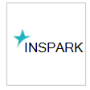

# Hanterade säkerhetstjänstleverantörer som stöds

**Gäller för:**
- [Microsoft Defender för Endpoint](https://go.microsoft.com/fwlink/p/?linkid=2154037)
- [Microsoft 365 Defender](https://go.microsoft.com/fwlink/?linkid=2118804)

> Vill du uppleva Microsoft Defender för Slutpunkt? [Registrera dig för en kostnadsfri utvärderingsversion.](https://www.microsoft.com/microsoft-365/windows/microsoft-defender-atp?ocid=docs-wdatp-exposedapis-abovefoldlink)

Följande leverantörer av hanterade säkerhetstjänster kan nås via portalen. 

Logotyp |Partnernamn   | Beskrivning 
:---|:---|:---
| [BDO Digital](https://go.microsoft.com/fwlink/?linkid=2090394) | BDO Digitals hanterade skydd utnyttjar best practice-verktyg, AI och in-house säkerhetsexperter för identitetsskydd 24/7/365
| [BlueVoyant](https://go.microsoft.com/fwlink/?linkid=2121401) | MDR för Microsoft Defender för Endpoint ger support vid övervakning, undersöker och minimerar avancerade attacker mot slutpunkter
| [Säkerhetscenter för molnet](https://go.microsoft.com/fwlink/?linkid=2099315) | InSparks Cloud Security Center är en hanterad 24x7-tjänst som levererar skydd, identifierar & svara-funktioner
| [Cloud SOC](https://go.microsoft.com/fwlink/?linkid=2104265) | Cloud SOC tillhandahåller säkerhetsövervakningstjänster dygnet runt, baserat på Microsofts moln och hjälper dig att kontinuerligt förbättra din säkerhet
| [CSIS Managed Detection & Response](https://go.microsoft.com/fwlink/?linkid=2091005) | 24/7 övervakning och analys av säkerhetsvarningar som ger företag handlingsbara insikter om vad, när och hur säkerhetstillbud har inträffat
| [Dell Technologies Advanced Threat Protection](https://go.microsoft.com/fwlink/?linkid=2091004) | Professionell övervakningstjänst för skadligt beteende och prestanda med 24/7-funktion
| [DXC-hanterad slutpunkt , hotidentifiering och svar](https://go.microsoft.com/fwlink/?linkid=2090395) | Identifiera slutpunktshot som kringgår traditionella säkerhetsskydd och innehåller dem i timmar eller minuter, inte dagar
 | [eSentire Managed Detection and Response](https://go.microsoft.com/fwlink/?linkid=2154970) | 24x7 hot undersökningar och svar via Microsoft Defender för Endpoint.
| [NTT-säkerhet](https://go.microsoft.com/fwlink/?linkid=2095320) | NTT:s EDR-tjänst tillhandahåller 24/7 säkerhetsövervakningssvar & din slutpunkt och ditt nätverk
 | [Onevinn MDR](https://go.microsoft.com/fwlink/?linkid=2155203)| 24/7 Hanterad identifiering och svar byggt på Microsoft Defender och Azure Sentinel, skapat med Onevinns hotinformation.
 | [Enerde Cyber](https://go.microsoft.com/fwlink/?linkid=2155202)| En avancerad tjänst för & Security Engineering.
| [Red Canary](https://go.microsoft.com/fwlink/?linkid=2103852) | Red Canary är en säkerhetsoperationpartner för moderna team, MDR på några minuter
| [SecureWorks Managed Detection and Response Powered by Red Cloak](https://go.microsoft.com/fwlink/?linkid=2133634) | Secureworks kombinerar hotinformation och över 20 års erfarenhet till SaaS och hanterade säkerhetslösningar
| [sepagoSOC](https://go.microsoft.com/fwlink/?linkid=2090491) | Säkerställa övergripande säkerhet genom avancerade automatiserade arbetsflöden i din nollförtroendemiljö
| [Trustwave Threat Detection & Response Services](https://go.microsoft.com/fwlink/?linkid=2127542) | Tjänster för identifiering av hot och svar för Azure utnyttjar integrationer med Sentinel och Defender för Slutpunkt
| [White Shark Managed Security Services](https://go.microsoft.com/fwlink/?linkid=2154210) |En expert metod för cybersäkerhet med transparent prissättning på alla plattformar, inklusive mobil.
| [Wortells moln-SOC](https://go.microsoft.com/fwlink/?linkid=2108415) | 24x7-hanterad Defender för slutpunktstjänst för & svar
| [ZTAP (Zero Trust Analytics Platform)](https://go.microsoft.com/fwlink/?linkid=2090971) | Minska dina aviseringar med 99 % och få tillgång till alla säkerhetsfunktioner från mobila enheter

## Relaterade ämnen
- [Konfigurera integrering av tjänstleverantör för hanterad tjänst](configure-mssp-support.md)