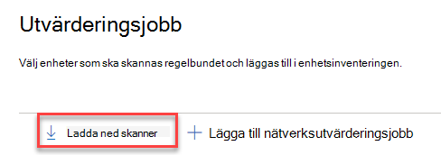
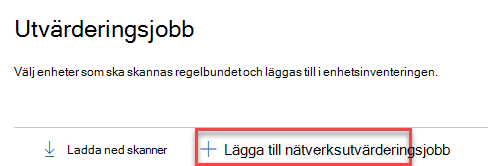
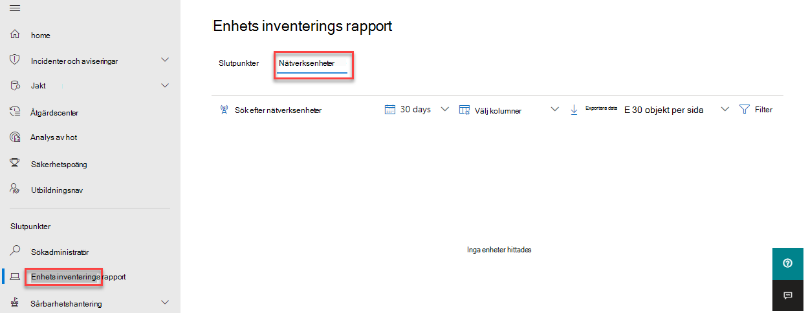

# Identifiering och hantering av säkerhetsrisker

[!INCLUDE [Microsoft 365 Defender rebranding](../../includes/microsoft-defender.md)]

**Gäller för:**

- [Microsoft Defender för Endpoint](https://go.microsoft.com/fwlink/?linkid=2154037)
- [Hot och hantering av säkerhetsrisker](next-gen-threat-and-vuln-mgt.md)
- [Microsoft 365 Defender](https://go.microsoft.com/fwlink/?linkid=2118804)

> [!IMPORTANT]
> **Skanning och hantering av nätverksenheter är för närvarande i offentlig förhandsversion** 
> Den här förhandsversionen tillhandahålls utan ett servicenivåavtal och rekommenderas inte för produktionsarbetsbelastningar. Vissa funktioner kanske inte stöds eller kan ha begränsade funktioner.
> Mer information finns i [Förhandsversionsfunktioner för Microsoft Defender för slutpunkt.](preview.md)

>Vill du uppleva Microsoft Defender för Slutpunkt? [Registrera dig för en kostnadsfri utvärderingsversion.](https://www.microsoft.com/microsoft-365/windows/microsoft-defender-atp?ocid=docs-wdatp-portaloverview-abovefoldlink)

> [!NOTE]  
> Blogg [som](https://techcommunity.microsoft.com/t5/microsoft-defender-for-endpoint/network-device-discovery-and-vulnerability-assessments/ba-p/2267548) publicerats \( 2021-04-13-2021 med insikter om de nya funktionerna för identifiering av nätverksenhet i \) Defender för Slutpunkt.  Den här artikeln innehåller en översikt över utmaningen **som** upptäckten av nätverksenhet är utformad för att hantera och detaljerad information om hur du kommer igång med de här nya funktionerna.

Funktioner för nätverksidentifiering är tillgängliga i **avsnittet** Enhetsinventering Microsoft 365 säkerhetscenter och Microsoft Defender Säkerhetscenter konsoler.  

En Microsoft Defender för Slutpunkt-enhet används på varje nätverkssegment för att utföra periodiska autentiserade genomsökningar av förkonfigurerade nätverksenheter. När Den har identifierats tillhandahåller Defender för Endpoints Hantering av hot och säkerhetsrisker-funktioner integrerade arbetsflöden för att säkra identifierade switchar, routrar, WLAN-styrenheter, brandväggar och VPN-gatewayer.  

När nätverksenheterna upptäcks och klassificeras kommer säkerhetsadministratörerna att kunna ta emot de senaste säkerhetsrekommendationerna och granska nyligen identifierade svagheter på nätverksenheter som distribuerats i deras organisationer.

## Metod

Nätverksenheter hanteras inte som standardslutpunkter eftersom Defender för Slutpunkt inte har någon sensor inbyggd i själva nätverksenheterna. Den här typen av enheter kräver en agentlös metod där en fjärrsökning hämtar den information som behövs från enheterna. Beroende på nätverkets topologi och egenskaper utför en enskild enhet eller några enheter som förs in i Microsoft Defender för Slutpunkt autentiserade genomsökningar av nätverksenheter med SNMP (skrivskyddat).

Det kommer att finnas två typer av enheter att tänka på:

- **Utvärderingsenhet:** En enhet som redan är inbyggd och som du använder för att söka igenom nätverksenheterna.
- **Nätverksenheter:** Nätverksenheterna som ska skannas och introduceras.

### Sårbarhetshantering för nätverksenheter 

När nätverksenheterna upptäcks och klassificeras kommer säkerhetsadministratörerna att kunna ta emot de senaste säkerhetsrekommendationerna och granska nyligen identifierade svagheter på nätverksenheter som distribuerats i deras organisationer.  

## Operativsystem som stöds

Följande operativsystem stöds för närvarande:

- Cisco IOS, IOS-XE, NX-OS
- Juniper JURESTER
- HPE ArubaOS, Procurve Switch Software
- Palo Mobil Networks PAN-OS

Fler nätverksleverantörer och operativsystem läggs till med tiden, baserat på data som har samlats från kundanvändning. Därför uppmanas du att konfigurera alla nätverksenheter, även om de inte anges i den här listan.

## Komma igång

Det första steget är att välja en enhet som ska utföra autentiserade nätverkssökningar.

1. Bestäm dig för en Defender för slutpunktsbaserad enhet (klient eller server) som har en nätverksanslutning till hanteringsporten för de nätverksenheter du planerar att skanna. 

2. SNMP-trafik mellan Defender för Endpoint-utvärderingsenheten och de riktade nätverksenheterna måste tillåtas (till exempel av brandväggen).

3. Bestäm vilka nätverksenheter som ska bedömas för säkerhetsproblem (till exempel: en Cisco switch eller en Palo Firewall Networks-brandvägg).  

4. Kontrollera att SNMP skrivskyddat är aktiverat på alla konfigurerade nätverksenheter så att Defender för Endpoints utvärderingsenhet kan köra frågor mot konfigurerade nätverksenheter. SNMP-skrivning behövs inte för att funktionen ska fungera korrekt.

5. Hämta IP-adresserna för de nätverksenheter som ska skannas (eller undernäten där dessa enheter är distribuerade).

6. Hämta SNMP-autentiseringsuppgifter för nätverksenheterna (till exempel: Community String, noAuthNoPriv, authNoPriv, authPriv). Du måste ange autentiseringsuppgifterna när du konfigurerar ett nytt bedömningsjobb.  

7. Proxyklientkonfiguration: Ingen extra konfiguration krävs förutom Defender för slutpunktens proxykrav.

8. Om du vill tillåta att nätverksskannern autentiseras och fungera korrekt måste du lägga till följande domäner/URL:er:

    - login.windows.net  
    - *.securitycenter.windows.com
    - login.microsoftonline.com
    - *.blob.core.windows.net/networkscannerstable/ *

    > [!NOTE]
    > Inte alla URL:er anges i Defender för Slutpunkt-dokumenterad lista över tillåtna datainsamling.

## Behörigheter

För att konfigurera utvärderingsjobb krävs följande användarbehörighetsalternativ: **Hantera säkerhetsinställningar i Säkerhetscenter.** Du hittar behörigheten genom att gå till **Inställningar**  >  **Roller.** Mer information finns i [Skapa och hantera roller för rollbaserad åtkomstkontroll.](user-roles.md)

## Installera nätverksskannern

1. Gå till **Microsoft 365 säkerhetsjobb**  >  **Inställningar**  >  **Endpoints**  >  **Assessment jobs** (under **Nätverksutvärderingar).**
    1. I Microsoft Defender Säkerhetscenter du till sidan Inställningar > Utvärderingsjobb.

2. Ladda ned nätverksskannern och installera den på den angivna Defender för Endpoint-utvärderingsenheten.

    > [!div class="mx-imgBorder"]
    > 

## Installation av nätverksskanner & registrering

Inloggningsprocessen kan slutföras på den angivna utvärderingsenheten eller någon annan enhet (till exempel din personliga klientenhet).

Så här slutför du registreringen av nätverksskannern:

1. Kopiera och följ URL-adressen som visas på kommandoraden och använd den angivna installationskoden för att slutföra registreringsprocessen.

    > [!NOTE]
    > Du kan behöva ändra inställningarna för kommandotolken för att kunna kopiera URL-adressen.

2. Ange koden och logga in med ett Microsoft-konto som har Behörigheten Defender för slutpunkt som kallas "Hantera säkerhetsinställningar i Säkerhetscenter".

3. När du är klar visas ett meddelande om att du har loggat in.

## Konfigurera ett nytt bedömningsjobb  

På sidan Utvärderingsjobb i **Inställningar** väljer du Lägg **till nätverksutvärderingsjobb**. Följ uppprocessen för att välja nätverksenheter som ska genomsökas regelbundet och läggas till i enhetsinventeringen.

För att förhindra duplicering av enheter i nätverkets enhetslager ska du se till att varje IP-adress bara är konfigurerad en gång på flera utvärderingsenheter.

> [!div class="mx-imgBorder"]
> 

Lägga till steg för nätverksutvärderingsjobb:

1. Välj ett namn för utvärderingsjobbet och "Utvärderingsenheten" som nätverksskannern installerades på. Den här enheten utför periodiska autentiserade genomsökningar.

2. Lägg till IP-adresser för målnätverksenheter som ska skannas (eller undernäten där de här enheterna är distribuerade). 

3. Lägg till nödvändiga SNMP-autentiseringsuppgifter för målnätverksenheterna. 

4. Spara det konfigurerade nätverksutvärderingsjobbet för att starta den periodiska nätverkssökningen. 

### Skanna och lägg till nätverksenheter

Under installationen kan du göra en testsökning en gång för att verifiera att:

- Det finns anslutning mellan Defender för endpoint-utvärderingsenheten och de konfigurerade målnätverksenheterna.
- De konfigurerade SNMP-autentiseringsuppgifterna är korrekta.

Varje utvärderingsenhet kan ha stöd för en lyckad ip-adresssökning på upp till 1 500. Om du till exempel skannar 10 olika undernät där endast 100 IP-adresser returnerar lyckade resultat kan du söka igenom 1 400 IP-ytterligare adresser från andra undernät på samma utvärderingsenhet.  

Om det finns flera IP-adressintervall/undernät att söka igenom tar det några minuter innan testsökningsresultatet visas. En testsökning är tillgänglig för upp till 1 024 adresser.

När resultatet visas kan du välja vilka enheter som ska ingå i den periodiska genomsökningen. Om du hoppar över genomsökningsresultaten läggs alla konfigurerade IP-adresser till i nätverksutvärderingsjobbet (oavsett enhetens svar). Genomsökningsresultatet kan också exporteras.

## Enhetsinventering

Nyligen identifierade enheter visas under den nya fliken **Nätverksenheter** på sidan **Enhetsinventering.** Det kan ta upp till två timmar efter att du har lagt till ett utvärderingsjobb tills enheterna har uppdaterats.

> [!div class="mx-imgBorder"]
> 

## Felsökning

### Installationen av nätverksskannern misslyckades

Kontrollera att obligatoriska URL:er läggs till i de tillåtna domänerna i brandväggsinställningarna. Kontrollera även att proxyinställningarna är konfigurerade enligt beskrivningen i Konfigurera [enhetsproxy och internetanslutningsinställningar.](configure-proxy-internet.md)

### Webbsidan Microsoft.com/devicelogin inte visas

Kontrollera att de obligatoriska webbadresserna läggs till i de tillåtna domänerna i brandväggen. Kontrollera även att proxyinställningarna är konfigurerade enligt beskrivningen i Konfigurera [enhetsproxy och internetanslutningsinställningar.](configure-proxy-internet.md)

### Nätverksenheter visas inte i enhetsinventeringen efter flera timmar

Genomsökningsresultatet bör uppdateras några timmar efter den första genomsökning som ägde rum efter slutförande av konfigurationen av utvärderingsjobbet.

Om enheter fortfarande inte visas kontrollerar du att tjänsten "MdatpNetworkScanService" körs på dina utvärderingsenheter, där du installerade nätverksskannern, och utför en "Kör genomsökning" i den relevanta utvärderingsjobbskonfigurationen.  

Om du fortfarande inte får några resultat efter fem minuter startar du om tjänsten.  

### Enheter som senast såg tiden är längre än 24 timmar

Kontrollera att skannern körs korrekt. Gå sedan till genomsökningsdefinitionen och välj "Kör test". Kontrollera vilka felmeddelanden som skickas tillbaka från relevanta IP-adresser.

### Obligatorisk Hantering av hot och säkerhetsrisker användarbehörighet

Registreringen har slutförts med ett fel: "Det verkar som att du inte har tillräcklig behörighet för att lägga till en ny agent. Den behörighet som krävs är "Hantera säkerhetsinställningar i Säkerhetscenter".

Tryck på valfri tangent för att avsluta.

Be systemadministratören att tilldela dig de behörigheter som krävs. Alternativt kan du be en annan relevant medlem att hjälpa dig med inloggningsprocessen genom att ange inloggningskoden och länken till honom/henne.

### Registreringsprocessen misslyckas med den angivna länken i kommandoraden i registreringsprocessen

Prova en annan webbläsare eller kopiera inloggningslänken och koden till en annan enhet.

### Texten är för liten eller det går inte att kopiera text från kommandoraden

Ändra kommandoradsinställningar på enheten så att textstorleken tillåts och ändras.

## Relaterade artiklar

- [Enhetsinventering](machines-view-overview.md)
- [Konfigurera avancerade funktioner](advanced-features.md)
