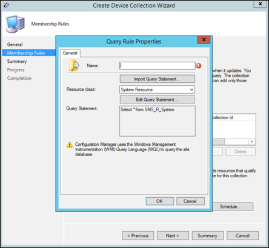
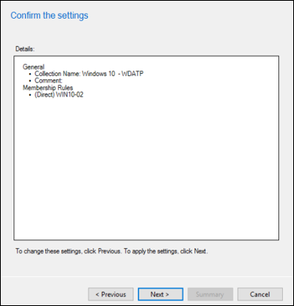
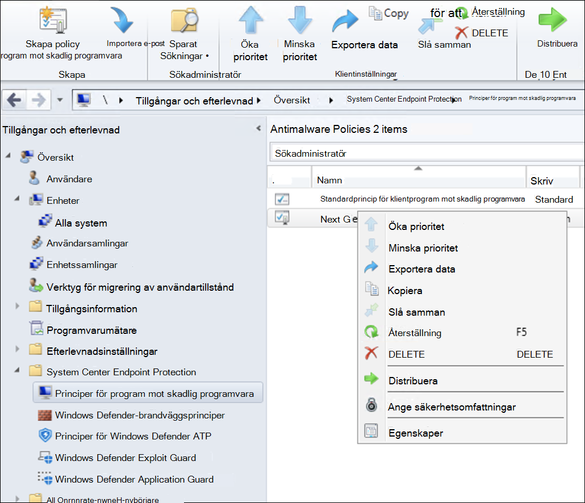

# Introduktion med hjälp av Microsoft Endpoint Configuration ManagerOnboarding using Microsoft Endpoint Configuration Manager

[!INCLUDE [Microsoft 365 Defender rebranding](../../includes/microsoft-defender.md)]

**Gäller för:****Applies to:**
- [Microsoft Defender för EndpointMicrosoft Defender for Endpoint](https://go.microsoft.com/fwlink/p/?linkid=2154037)
- [Microsoft 365 DefenderMicrosoft 365 Defender](https://go.microsoft.com/fwlink/?linkid=2118804)

> Vill du uppleva Microsoft Defender för Slutpunkt?Want to experience Microsoft Defender for Endpoint? [Registrera dig för en kostnadsfri utvärderingsversion.Sign up for a free trial.](https://www.microsoft.com/microsoft-365/windows/microsoft-defender-atp?ocid=docs-wdatp-exposedapis-abovefoldlink)

Den här artikeln är en del av distributionsguiden och fungerar som ett exempel på onboarding-metod.This article is part of the Deployment guide and acts as an example onboarding method. 

I ämnet [Planering](deployment-strategy.md) finns det flera metoder för att introducera enheter till tjänsten.In the [Planning](deployment-strategy.md) topic, there were several methods provided to onboard devices to the service. Det här avsnittet behandlar arkitekturen för samtidig hantering.This topic covers the co-management architecture. 

 *Diagram över miljöarkitekturer*
*Diagram of environment architectures*

Defender för Endpoint har stöd för registrering av olika slutpunkter och verktyg, men den här artikeln täcker inte in dem.While Defender for Endpoint supports onboarding of various endpoints and tools, this article does not cover them. Mer information om allmän onboarding med andra distributionsverktyg och metoder som stöds finns i [Översikt över onboarding.](onboarding.md)For information on general onboarding using other supported deployment tools and methods, see [Onboarding overview](onboarding.md).

Det här avsnittet leder användarna i:This topic guides users in:
- Steg 1: Windows enheter till tjänstenStep 1: Onboarding Windows devices to the service 
- Steg 2: Konfigurera Defender för slutpunktsfunktionerStep 2: Configuring Defender for Endpoint capabilities

Den här introduktionsvägledningen går igenom följande grundläggande steg som du måste vidta när du använder Microsoft Endpoint Configuration Manager:This onboarding guidance will walk you through the following basic steps that you need to take when using Microsoft Endpoint Configuration Manager:
- **Skapa en samling i Microsoft Endpoint Configuration Manager****Creating a collection in Microsoft Endpoint Configuration Manager**
- **Konfigurera Microsoft Defender för slutpunktsfunktioner med Microsoft Endpoint Configuration Manager****Configuring Microsoft Defender for Endpoint capabilities using Microsoft Endpoint Configuration Manager**

>[!NOTE]
>Endast Windows enheter omfattas av den här exempeldistributionen.Only Windows devices are covered in this example deployment. 

## Steg 1: Onboard Windows enheter med Microsoft Endpoint Configuration ManagerStep 1: Onboard Windows devices using Microsoft Endpoint Configuration Manager

### Skapa samlingCollection creation
Om du Windows 10 registrera Microsoft Endpoint Configuration Manager-enheter med hjälp av Microsoft Endpoint Configuration Manager kan distributionen ha en befintlig samling som mål, eller så kan en ny samling skapas för testning.To onboard Windows 10 devices with Microsoft Endpoint Configuration Manager, the deployment can target an existing collection or a new collection can be created for testing. 

Registrering med verktyg som grupprincip eller manuell metod installerar inte någon agent i systemet.Onboarding using tools such as Group policy or manual method does not install any agent on the system. 

I Microsoft Endpoint Configuration Manager konsolen konfigureras onboarding-processen som en del av inställningarna för efterlevnad i konsolen.Within the Microsoft Endpoint Configuration Manager console the onboarding process will be configured as part of the compliance settings within the console.

Alla system som får den här nödvändiga konfigurationen behåller den konfigurationen så länge Konfigurationshanteraren-klienten fortsätter att ta emot den här principen från hanteringspunkten.Any system that receives this required configuration will maintain that configuration for as long as the Configuration Manager client continues to receive this policy from the management point. 

Följ stegen nedan för att registrera slutpunkter med hjälp Microsoft Endpoint Configuration Manager.Follow the steps below to onboard endpoints using Microsoft Endpoint Configuration Manager.

1. I Microsoft Endpoint Configuration Manager navigera till Enhetssamlingar **för tillgångar och \> \> efterlevnadsöversikt.**In Microsoft Endpoint Configuration Manager console, navigate to **Assets and Compliance \> Overview \> Device Collections**.            

    

2. Högerklicka på **Enhetssamling** och välj **Skapa enhetssamling**.Right Click **Device Collection** and select **Create Device Collection**.

    

3. Ange ett **namn** och **en begränsad samling** och välj sedan **Nästa.**Provide a **Name** and **Limiting Collection**, then select **Next**.

    

4. Välj **Lägg till regel** och välj **Frågeregel.**Select **Add Rule** and choose **Query Rule**.

    

5.  Klicka **på** Nästa i **guiden Direktmedlemskap och** klicka på Redigera **frågeutdrag.**Click **Next** on the **Direct Membership Wizard** and click on **Edit Query Statement**.

     

6. Välj **Villkor** och välj sedan stjärnikonen.Select **Criteria** and then choose the star icon.

     

7. Se till att villkorstypen är ett enkelt värde  , välj var som operativsystem **–** versionsnummer , operator som är större än eller lika med och **värde 14393** och klicka på **OK.** Keep criterion type as **simple value**, choose where as **Operating System - build number**, operator as **is greater than or equal to** and value **14393** and click on **OK**.

    

8. Välj **Nästa** och **Stäng.**Select **Next** and **Close**.

    

9. Välj **Nästa**.Select **Next**.

    

När du har slutfört den här uppgiften har du en enhetssamling med Windows 10 alla slutpunkter i miljön.After completing this task, you now have a device collection with all the Windows 10 endpoints in the environment. 

## Steg 2: Konfigurera Microsoft Defender för slutpunktsfunktionerStep 2: Configure Microsoft Defender for Endpoint capabilities 
I det här avsnittet får du hjälp med att konfigurera följande funktioner Microsoft Endpoint Configuration Manager på Windows enheter:This section guides you in configuring the following capabilities using Microsoft Endpoint Configuration Manager on Windows devices:

- [**Identifiering och svar för slutpunkt****Endpoint detection and response**](#endpoint-detection-and-response)
- [**Nästa generations skydd****Next-generation protection**](#next-generation-protection)
- [**Minskning av attackytan****Attack surface reduction**](#attack-surface-reduction)

### Identifiering och svar av slutpunktEndpoint detection and response
#### Windows 10Windows 10
I Microsoft Defender Säkerhetscenter kan du ladda ned onboarding-principen som kan användas för att skapa principen i System Center Configuration Manager och distribuera den till Windows 10 enheter.From within the Microsoft Defender Security Center it is possible to download the '.onboarding' policy that can be used to create the policy in System Center Configuration Manager and deploy that policy to Windows 10 devices.

1. På en Microsoft Defender Säkerhetscenter portal väljer [du Inställningar och sedan Onboarding](https://securitycenter.windows.com/preferences2/onboarding).From a Microsoft Defender Security Center Portal, select [Settings and then Onboarding](https://securitycenter.windows.com/preferences2/onboarding).

2. Under Distributionsmetod väljer du den version **av** Microsoft Endpoint Configuration Manager .Under Deployment method select the supported version of **Microsoft Endpoint Configuration Manager**.

    

3. Välj **Ladda ned paket**.Select **Download package**.

    

4. Spara paketet på en tillgänglig plats.Save the package to an accessible location.
5. I Microsoft Endpoint Configuration Manager du till: **Tillgångar och efterlevnad > Översikt > Endpoint Protection > Microsoft Defender ATP Principer.**In  Microsoft Endpoint Configuration Manager, navigate to: **Assets and Compliance > Overview > Endpoint Protection > Microsoft Defender ATP Policies**.

6. Högerklicka på Microsoft Defender ATP **och** välj **Skapa Microsoft Defender ATP princip**.Right-click **Microsoft Defender ATP Policies** and select **Create Microsoft Defender ATP Policy**.

    

7. Ange namn och beskrivning, kontrollera **att Onboarding** är markerat och välj sedan **Nästa**.Enter the name and description, verify **Onboarding** is selected, then select **Next**.

    

8. Klicka **på Bläddra**.Click **Browse**.

9. Navigera till platsen för den nedladdade filen från steg 4 ovan.Navigate to the location of the downloaded file from step 4 above.

10. Klicka på **Nästa**.Click **Next**.
11. Konfigurera agenten med lämpliga exempel **(Ingen eller** **Alla filtyper).**Configure the Agent with the appropriate samples (**None** or **All file types**).

    

12. Välj lämplig telemetri **(Normal eller** **Expedited)** och klicka sedan på **Nästa.**Select the appropriate telemetry (**Normal** or **Expedited**) then click **Next**.

    

14. Verifiera konfigurationen och klicka sedan på **Nästa.**Verify the configuration, then click **Next**.

     

15. Klicka **på** Stäng när guiden är klar.Click **Close** when the Wizard completes.

16.  Högerklicka Microsoft Endpoint Configuration Manager Defender för slutpunktsprincip du just skapade i konsolen och välj **Distribuera**.In the Microsoft Endpoint Configuration Manager console, right-click the Defender for Endpoint policy you just created and select **Deploy**.

     

17. På den högra panelen markerar du den tidigare skapade samlingen och klickar på **OK.**On the right panel, select the previously created collection and click **OK**.

    

#### Tidigare versioner av Windows (version Windows 7 och Windows 8.1)Previous versions of Windows Client (Windows 7 and Windows 8.1)
Följ stegen nedan för att identifiera defender för slutpunktsarbetsyta och arbetsytenyckel, som krävs för registrering av tidigare versioner av Windows.Follow the steps below to identify the Defender for Endpoint Workspace ID and Workspace Key, that will be required for the onboarding of previous versions of Windows.

1. På en Microsoft Defender Säkerhetscenter väljer du **Inställningar > Onboarding**.From a Microsoft Defender Security Center Portal, select **Settings > Onboarding**.

2. Under Operativsystem väljer du **Windows 7 SP1 och 8.1.**Under operating system choose **Windows 7 SP1 and 8.1**.

3. Kopiera **arbetsyte-ID** **och arbetsytenyckel** och spara dem.Copy the **Workspace ID** and **Workspace Key** and save them. De kommer att användas senare i processen.They will be used later in the process.

    

4. Installera Microsoft Monitoring Agent (MMA).Install the Microsoft Monitoring Agent (MMA).  
    MMA stöds för närvarande (från och med januari 2019) på följande Windows operativsystem:MMA is currently (as of January 2019) supported on the following Windows Operating Systems:

    -   Server-SKU:er: Windows Server 2008 SP1 eller nyareServer SKUs: Windows Server 2008 SP1 or Newer

    -   Klient-SKU:er: Windows 7 SP1 och senareClient SKUs: Windows 7 SP1 and later

    MMA-agenten måste installeras på Windows enheter.The MMA agent will need to be installed on Windows devices. För att kunna installera agenten måste vissa system ladda ned uppdateringen för kundupplevelse och diagnostisk [telemetri](https://support.microsoft.com/help/3080149/update-for-customer-experience-and-diagnostic-telemetry) för att kunna samla in data med MMA.To install the agent, some systems will need to download the [Update for customer experience and diagnostic telemetry](https://support.microsoft.com/help/3080149/update-for-customer-experience-and-diagnostic-telemetry) in order to collect the data with MMA. Dessa systemversioner omfattar men kan inte begränsas till:These system versions include but may not be limited to:

    -   Windows 8.1Windows 8.1

    -   Windows 7Windows 7

    -   Windows Server 2016Windows Server 2016

    -   Windows Server 2012 R2Windows Server 2012 R2

    -   Windows Server 2008 R2Windows Server 2008 R2

    Mer specifikt Windows 7 SP1 måste följande korrigeringar installeras:Specifically, for Windows 7 SP1, the following patches must be installed:

    -   Installera [KB4074598](https://support.microsoft.com/help/4074598/windows-7-update-kb4074598)Install [KB4074598](https://support.microsoft.com/help/4074598/windows-7-update-kb4074598)

    -   Installera [antingen .NET Framework 4.5](https://www.microsoft.com/download/details.aspx?id=30653) (eller senare) **eller** 
         [KB3154518.](https://support.microsoft.com/help/3154518/support-for-tls-system-default-versions-included-in-the-net-framework)Install either [.NET Framework 4.5](https://www.microsoft.com/download/details.aspx?id=30653) (or later) **or**
        [KB3154518](https://support.microsoft.com/help/3154518/support-for-tls-system-default-versions-included-in-the-net-framework).
        Installera inte båda på samma system.Do not install both on the same system.

5. Om du använder en proxyserver för att ansluta till Internet kan du gå till avsnittet Konfigurera proxyinställningar.If you're using a proxy to connect to the Internet see the Configure proxy settings section.

När den är klar bör du se onboarded endpoints i portalen inom en timme.Once completed, you should see onboarded endpoints in the portal within an hour.

### Nästa generations skyddNext generation protection 
Microsoft Defender Antivirus är en inbyggd antimalwarelösning som ger nästa generations skydd för stationära datorer, bärbara datorer och servrar.Microsoft Defender Antivirus is a built-in antimalware solution that provides next generation protection for desktops, portable computers, and servers.

1. I Microsoft Endpoint Configuration Manager navigerar du till Översikt över tillgångar och **\> efterlevnad Endpoint Protection \> \> antimalware-policyer** och väljer Skapa programprincip för **program mot skadlig programvara.**In the Microsoft Endpoint Configuration Manager console, navigate to **Assets and Compliance \> Overview \> Endpoint Protection \> Antimalware Polices** and choose **Create Antimalware Policy**.

    

2. Välj Schemalagda genomsökningar **,** Sökinställningar **,** Standardåtgärder **,** Realtidsskydd , **Undantagsinställningar,** Avancerat, Åsidosättningar av hot, **Molnskyddstjänst** och Säkerhetsintelligensuppdateringar och välj **OK.**   Select **Scheduled scans**, **Scan settings**, **Default actions**, **Real-time protection**, **Exclusion settings**, **Advanced**, **Threat overrides**, **Cloud Protection Service** and **Security intelligence   updates** and choose **OK**.

    

    I vissa branscher eller vissa utvalda företagskunder kan ha specifika behov av hur Antivirus är konfigurerat.In certain industries or some select enterprise customers might have specific needs on how Antivirus is configured.

  
    [Snabbsökning kontra fullständig sökning och anpassad sökningQuick scan versus full scan and custom scan](/windows/security/threat-protection/microsoft-defender-antivirus/scheduled-catch-up-scans-microsoft-defender-antivirus#quick-scan-versus-full-scan-and-custom-scan)

    Mer information finns i Windows-säkerhet [konfigurationsramverket](/windows/security/threat-protection/windows-security-configuration-framework/windows-security-configuration-framework)For more details, see [Windows Security configuration framework](/windows/security/threat-protection/windows-security-configuration-framework/windows-security-configuration-framework)
  
    

    

    

    

    

    

    

    

3. Högerklicka på den nyligen skapade programprincipen för program mot skadlig programvara och välj **Distribuera**.Right-click on the newly created antimalware policy and select **Deploy**.

    

4. Rikta den nya program mot skadlig programvara till din Windows 10 och klicka på **OK.**Target the new antimalware policy to your Windows 10 collection and click **OK**.

     

När du har slutfört den här uppgiften har du nu konfigurerat Windows Defender Antivirus.After completing this task, you now have successfully configured Windows Defender Antivirus.

### Minska attackytanAttack surface reduction
Minskning av attackytan hos Defender för Endpoint inkluderar funktionsuppsättningen som är tillgänglig under Exploit Guard.The attack surface reduction pillar of Defender for Endpoint includes the feature set that is available under Exploit Guard. ASR-regler (Attack Surface Reduction), kontrollerad mappåtkomst, nätverksskydd och sårbarhetsskydd.Attack surface reduction (ASR) rules, Controlled Folder Access, Network Protection and Exploit Protection. 

Alla dessa funktioner ger ett granskningsläge och ett blockläge.All these features provide an audit mode and a block mode. I granskningsläge påverkas inte slutanvändarna.In audit mode there is no end-user impact. Allt som samlas in är ytterligare telemetri och gör den tillgänglig i Microsoft Defender Säkerhetscenter.All it does is collect additional telemetry and make it available in the Microsoft Defender Security Center. Syftet med en distribution är att stegvis flytta säkerhetskontroller till blockläge.The goal with a deployment is to step-by-step move security controls into block mode.

Så här anger du ASR-regler i granskningsläge:To set ASR rules in Audit mode:

1. På Microsoft Endpoint Configuration Manager navigerar du till Översikt över tillgångar och **\> efterlevnad Endpoint Protection Windows Defender \> \> Sårbarhetsskydd** och **väljer Skapa sårbarhetspolicy.**In the Microsoft Endpoint Configuration Manager console, navigate to **Assets and Compliance \> Overview \> Endpoint Protection \> Windows Defender Exploit Guard** and choose **Create Exploit Guard Policy**.

   

2.  Välj **Minska attackytan**.Select **Attack Surface Reduction**.
   

3. Ange att regler **ska granskas** och klicka på **Nästa.**Set rules to **Audit** and click **Next**.

    

4. Bekräfta den nya Exploit Guard-policyn genom att klicka på **Nästa.**Confirm the new Exploit Guard policy by clicking on **Next**.

    

    
5. När principen har skapats klickar du på **Stäng.**Once the policy is created click **Close**.

    

    
   

6.  Högerklicka på den nya principen och välj **Distribuera.**Right-click on the newly created policy and choose **Deploy**.
    
    

7. Rikta principen mot den nya Windows 10 och klicka på **OK.**Target the policy to the newly created Windows 10 collection and click **OK**.

    

När du har slutfört den här uppgiften har du nu konfigurerat ASR-regler i granskningsläge.After completing this task, you now have successfully configured ASR rules in audit mode.  
  
Nedan följer ytterligare steg för att verifiera om ASR-regler tillämpas korrekt på slutpunkter.Below are additional steps to verify whether ASR rules are correctly applied to endpoints. (Det kan ta några minuter)(This may take few minutes)

1. Från en webbläsare går du till <https://securitycenter.windows.com> .From a web browser, navigate to <https://securitycenter.windows.com>.

2.  Välj **Konfigurationshantering** på menyn till vänster.Select **Configuration management** from left side menu.

3. Klicka **på Gå till hantering av attackytor** i hanteringspanelen för attackytor.Click **Go to attack surface management** in the Attack surface management panel. 
    
    

4. Klicka **på fliken** Konfiguration i rapporterna för minskning av attackytan.Click **Configuration** tab in Attack surface reduction rules reports. Den visar en översikt över asr-regler och status för ASR-regler på varje enhet.It shows ASR rules configuration overview and ASR rules status on each devices.

    

5. Klicka på varje enhet visar konfigurationsinformation för ASR-regler.Click each device shows configuration details of ASR rules.

    

Mer [information finns i Optimera ASR-regeldistribution](/microsoft-365/security/defender-endpoint/configure-machines-asr)   och identifieringar.See [Optimize ASR rule deployment and detections](/microsoft-365/security/defender-endpoint/configure-machines-asr)   for more details.  

#### Ange nätverksskyddsregler i granskningsläge:Set Network Protection rules in Audit mode:
1. På Microsoft Endpoint Configuration Manager navigerar du till Översikt över tillgångar och **\> efterlevnad Endpoint Protection Windows Defender \> \> Sårbarhetsskydd** och **väljer Skapa sårbarhetspolicy.**In the Microsoft Endpoint Configuration Manager console, navigate to **Assets and  Compliance \> Overview \> Endpoint Protection \> Windows Defender Exploit Guard** and choose **Create Exploit Guard Policy**.

    

2. Välj **Nätverksskydd**.Select **Network protection**.

3. Ange inställningen Granskning **och** klicka på **Nästa.**Set the setting to **Audit** and click **Next**. 

    

4. Bekräfta den nya Exploit Guard-policyn genom att klicka **på Nästa.**Confirm the new Exploit Guard Policy by clicking **Next**.
    
    

5. Klicka på Stäng när principen har **skapats.**Once the policy is created click on **Close**.

    

6. Högerklicka på den nya principen och välj **Distribuera.**Right-click on the newly created policy and choose **Deploy**.

    

7. Välj principen för den nya Windows 10 och välj **OK**.Select the policy to the newly created Windows 10 collection and choose **OK**.

    

När du har slutfört den här uppgiften har du nu konfigurerat nätverksskydd i granskningsläge.After completing this task, you now have successfully configured Network Protection in audit mode.

#### Så här ställer du in regler för kontrollerad mappåtkomst i granskningsläge:To set Controlled Folder Access rules in Audit mode:

1. På Microsoft Endpoint Configuration Manager navigerar du till Översikt över tillgångar och **\> efterlevnad Endpoint Protection Windows Defender \> \> Sårbarhetsskydd** och **väljer Skapa sårbarhetspolicy.**In the Microsoft Endpoint Configuration Manager console, navigate to **Assets and Compliance \> Overview \> Endpoint Protection \> Windows Defender Exploit Guard** and choose **Create Exploit Guard Policy**.

    

2. Välj **Reglerad mappåtkomst.**Select **Controlled folder access**.
    
3. Ange att konfigurationen ska **granskas och** klicka på **Nästa.**Set the configuration to **Audit** and click **Next**.

        
    
4. Bekräfta den nya Exploit Guard-policyn genom att klicka på **Nästa.**Confirm the new Exploit Guard Policy by clicking on **Next**.

    

5. Klicka på Stäng när principen har **skapats.**Once the policy is created click on **Close**.

    

6. Högerklicka på den nya principen och välj **Distribuera.**Right-click on the newly created policy and choose **Deploy**.

    

7.  Rikta principen mot den nya Windows 10 och klicka på **OK.**Target the policy to the newly created Windows 10 collection and click **OK**.

    

Nu har du konfigurerat kontrollerad mappåtkomst i granskningsläge.You have now successfully configured Controlled folder access in audit mode.

## Relaterat ämneRelated topic
- [Introduktion med Microsoft Endpoint ManagerOnboarding using Microsoft Endpoint Manager](onboarding-endpoint-manager.md)
