# Introduktion med Microsoft Endpoint ManagerOnboarding using Microsoft Endpoint Manager

[!INCLUDE [Microsoft 365 Defender rebranding](../../includes/microsoft-defender.md)]

**Gäller för:****Applies to:**
- [Microsoft Defender för EndpointMicrosoft Defender for Endpoint](https://go.microsoft.com/fwlink/p/?linkid=2154037)
- [Microsoft 365 DefenderMicrosoft 365 Defender](https://go.microsoft.com/fwlink/?linkid=2118804)

> Vill du uppleva Microsoft Defender för Slutpunkt?Want to experience Microsoft Defender for Endpoint? [Registrera dig för en kostnadsfri utvärderingsversion.Sign up for a free trial.](https://www.microsoft.com/microsoft-365/windows/microsoft-defender-atp?ocid=docs-wdatp-exposedapis-abovefoldlink)

Den här artikeln är en del av distributionsguiden och fungerar som ett exempel på onboarding-metod.This article is part of the Deployment guide and acts as an example onboarding method.

I ämnet [Planering](deployment-strategy.md) finns det flera metoder för att introducera enheter till tjänsten.In the [Planning](deployment-strategy.md) topic, there were several methods provided to onboard devices to the service. Det här avsnittet beskriver den molnbaserade arkitekturen.This topic covers the cloud-native architecture.

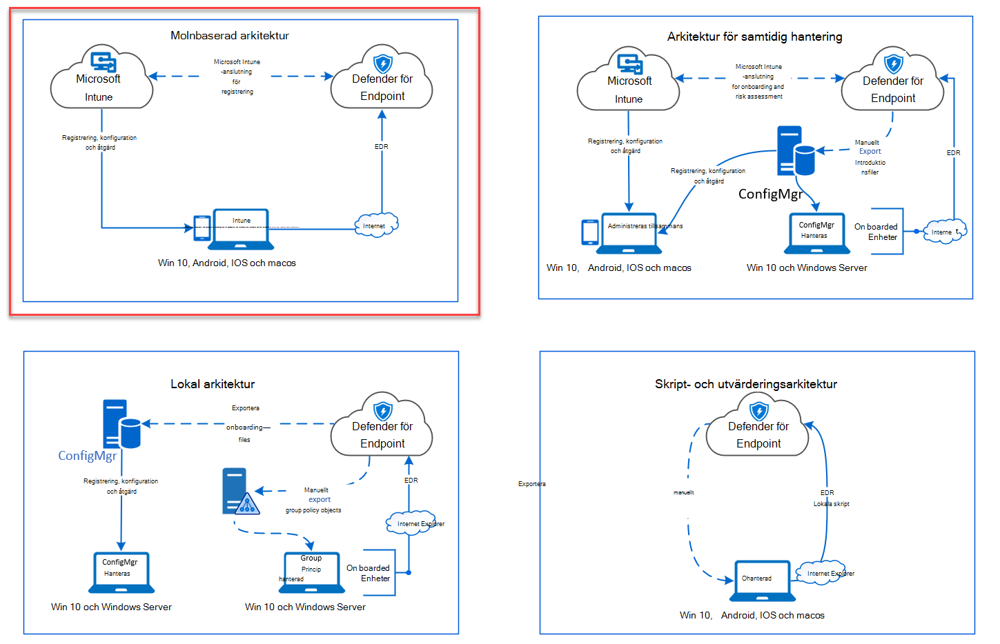
 *Diagram över miljöarkitekturer*
*Diagram of environment architectures*

Defender för Endpoint har stöd för registrering av olika slutpunkter och verktyg, men den här artikeln täcker inte in dem.While Defender for Endpoint supports onboarding of various endpoints and tools, this article does not cover them. Mer information om allmän onboarding med andra distributionsverktyg och metoder som stöds finns i [Översikt över onboarding.](onboarding.md)For information on general onboarding using other supported deployment tools and methods, see [Onboarding overview](onboarding.md).

[Microsoft Endpoint Manager](/mem/endpoint-manager-overview) är en lösningsplattform som ger en enhetlig plattform för flera tjänster.[Microsoft Endpoint Manager](/mem/endpoint-manager-overview) is a solution platform that unifies several services. Den innehåller [Microsoft Intune](/mem/intune/fundamentals/what-is-intune) för molnbaserad enhetshantering.It includes [Microsoft Intune](/mem/intune/fundamentals/what-is-intune) for cloud-based device management.

Det här avsnittet leder användarna i:This topic guides users in:

- Steg 1: Onboarding-enheter till tjänsten genom att skapa en grupp i Microsoft Endpoint Manager (MEM) för att tilldela konfigurationer påStep 1: Onboarding devices to the service by creating a group in Microsoft Endpoint Manager (MEM) to assign configurations on
- Steg 2: Konfigurera Defender för slutpunktsfunktioner med Microsoft Endpoint ManagerStep 2: Configuring Defender for Endpoint capabilities using Microsoft Endpoint Manager

Den här introduktionsvägledningen går igenom följande grundläggande steg som du måste vidta när du använder Microsoft Endpoint Manager:This onboarding guidance will walk you through the following basic steps that you need to take when using Microsoft Endpoint Manager:

- [Identifiera målenheter eller -användareIdentifying target devices or users](#identify-target-devices-or-users)
  - Skapa en Azure Active Directory (användare eller enhet)Creating an Azure Active Directory group (User or Device)
- [Skapa en konfigurationsprofilCreating a Configuration Profile](#step-2-create-configuration-policies-to-configure-microsoft-defender-for-endpoint-capabilities)
  - I Microsoft Endpoint Manager hjälper vi dig att skapa en separat princip för varje funktion.In Microsoft Endpoint Manager, we'll guide you in creating a separate policy for each capability.

## ResurserResources

Här är de länkar du behöver för resten av processen:Here are the links you'll need for the rest of the process:

- [MEM-portalMEM portal](https://aka.ms/memac)
- [SäkerhetscenterSecurity Center](https://securitycenter.windows.com/)
- [Intune-säkerhetsbaslinjerIntune Security baselines](/mem/intune/protect/security-baseline-settings-defender-atp#microsoft-defender)

Mer information om Microsoft Endpoint Manager finns i följande resurser:For more information about Microsoft Endpoint Manager, check out these resources:

- [Microsoft Endpoint Manager sidanMicrosoft Endpoint Manager page](/mem/)
- [Blogginlägg om intune och ConfigMgrBlog post on convergence of Intune and ConfigMgr](https://www.microsoft.com/microsoft-365/blog/2019/11/04/use-the-power-of-cloud-intelligence-to-simplify-and-accelerate-it-and-the-move-to-a-modern-workplace/)
- [Introduktionsvideo om MEMIntroduction video on MEM](https://www.microsoft.com/microsoft-365/blog/2019/11/04/use-the-power-of-cloud-intelligence-to-simplify-and-accelerate-it-and-the-move-to-a-modern-workplace)

## Steg 1: Introducera enheter genom att skapa en grupp i MEM för att tilldela konfigurationer påStep 1: Onboard devices by creating a group in MEM to assign configurations on

### Identifiera målenheter eller -användareIdentify target devices or users

I det här avsnittet skapar vi en testgrupp där du kan tilldela dina konfigurationer.In this section, we will create a test group to assign your configurations on.

> [!NOTE]
> Intune använder Azure Active Directory (Azure AD) grupper för att hantera enheter och användare.Intune uses Azure Active Directory (Azure AD) groups to manage devices and users. Som Intune-administratör kan du konfigurera grupper så att de passar organisationens behov.As an Intune admin, you can set up groups to suit your organizational needs.
>
> Mer information finns i Lägga [till grupper för att ordna användare och enheter.](/mem/intune/fundamentals/groups-add)For more information, see [Add groups to organize users and devices](/mem/intune/fundamentals/groups-add).

### Skapa en gruppCreate a group

1. Öppna MEM-portalen.Open the MEM portal.

2. Öppna **Grupper > Ny grupp.**Open **Groups > New Group**.

    > [!div class="mx-imgBorder"]
    > 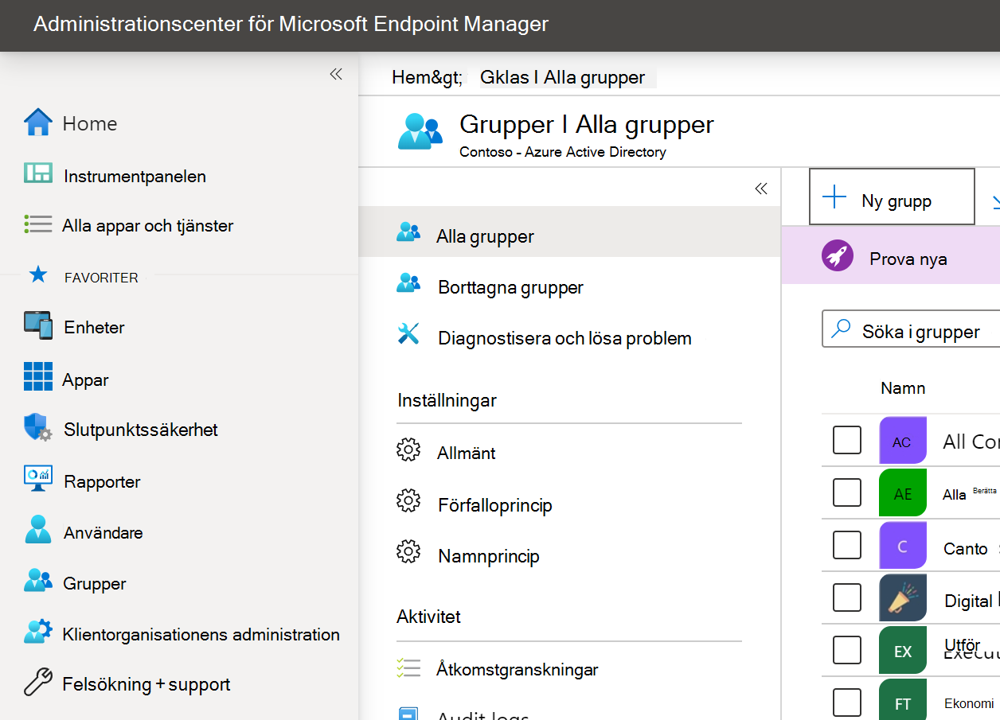

3. Ange information och skapa en ny grupp.Enter details and create a new group.

    > [!div class="mx-imgBorder"]
    > 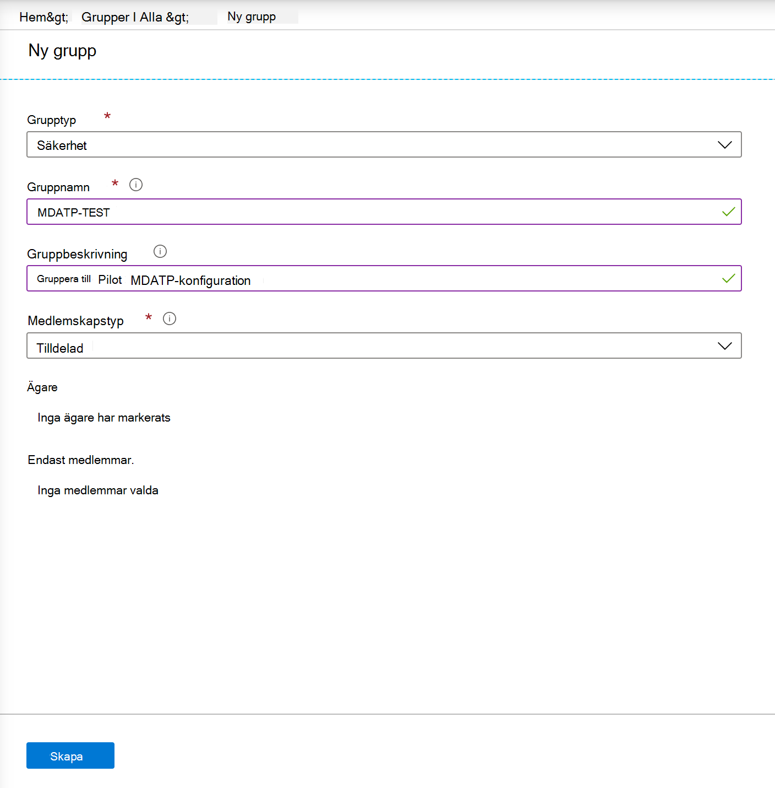

4. Lägg till testanvändaren eller testenheten.Add your test user or device.

5. I fönstret **Grupper > Alla grupper** öppnar du den nya gruppen.From the **Groups > All groups** pane, open your new group.

6. Välj  **Medlemmar > Lägg till medlemmar**.Select  **Members > Add members**.

7. Leta reda på testanvändaren eller enheten och markera den.Find your test user or device and select it.

    > [!div class="mx-imgBorder"]
    > 

8. Testgruppen har nu en medlem att testa.Your testing group now has a member to test.

## Steg 2: Skapa konfigurationsprinciper för att konfigurera Microsoft Defender för Endpoint-funktionerStep 2: Create configuration policies to configure Microsoft Defender for Endpoint capabilities

I följande avsnitt ska du skapa ett antal konfigurationsprinciper.In the following section, you'll create a number of configuration policies.

Först finns en konfigurationsprincip för att välja vilka grupper av användare eller enheter som ska introduceras i Defender för Slutpunkt:First is a configuration policy to select which groups of users or devices will be onboarded to Defender for Endpoint:

- [Identifiering och svar för slutpunktEndpoint detection and response](#endpoint-detection-and-response)

Sedan fortsätter du genom att skapa flera olika typer av slutpunktssäkerhetsprinciper:Then you will continue by creating several different types of endpoint security policies:

- [Nästa generations skyddNext-generation protection](#next-generation-protection)
- [Minskning av attackytanAttack surface reduction](#attack-surface-reduction--attack-surface-reduction-rules)

### Identifiering och svar av slutpunktEndpoint detection and response

1. Öppna MEM-portalen.Open the MEM portal.

2. Gå till **Slutpunktssäkerhet > identifiering och svar av slutpunkt.**Navigate to **Endpoint security > Endpoint detection and response**. Klicka på **Skapa profil.**Click on **Create Profile**.

    > [!div class="mx-imgBorder"]
    > 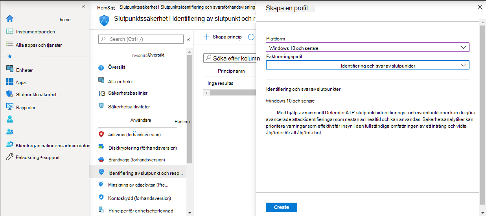

3. Under **Plattform väljer du Windows 10 senare, Profil – Identifiering av slutpunkt och svar > Skapa**.Under **Platform, select Windows 10 and Later, Profile - Endpoint detection  and response > Create**.

4. Ange ett namn och en beskrivning och välj sedan **Nästa.**Enter a name and description, then select  **Next**.

    > [!div class="mx-imgBorder"]
    > 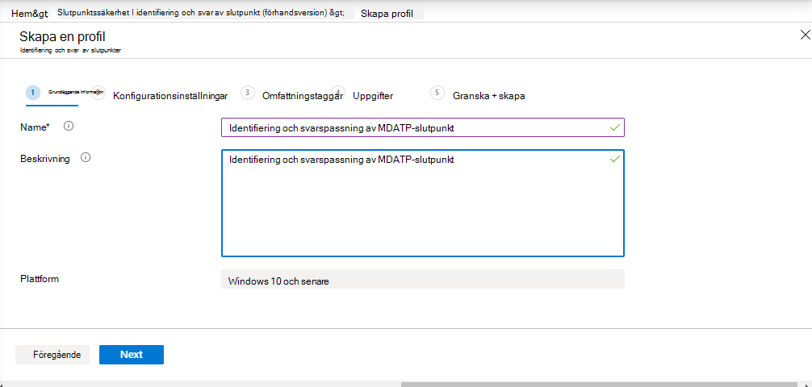

5. Välj inställningar efter behov och välj sedan  **Nästa**.Select settings as required, then select  **Next**.

    > [!div class="mx-imgBorder"]
    > 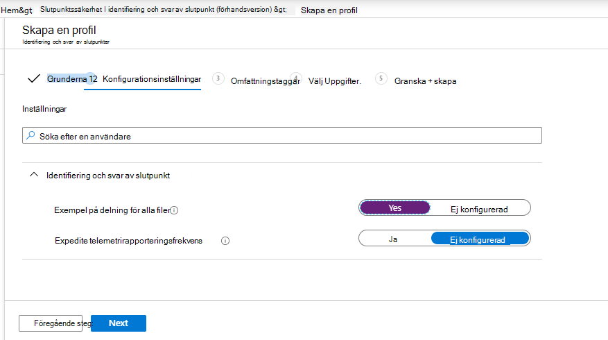

    > [!NOTE]
    > I den här instansen har det här fyllts i automatiskt eftersom Defender för Slutpunkt redan har integrerats med Intune.In this instance, this has been auto populated as Defender for Endpoint has already been integrated with Intune. Mer information om integrering finns i Aktivera [Microsoft Defender för slutpunkt i Intune.](/mem/intune/protect/advanced-threat-protection-configure#to-enable-microsoft-defender-atp)For more information on the integration, see [Enable Microsoft Defender for Endpoint in Intune](/mem/intune/protect/advanced-threat-protection-configure#to-enable-microsoft-defender-atp).
    >
    > Följande bild visar ett exempel på vad som visas när Microsoft Defender för Slutpunkt inte är integrerat med Intune:The following image is an example of what you'll see when Microsoft Defender for Endpoint is NOT integrated with Intune:
    >
    > 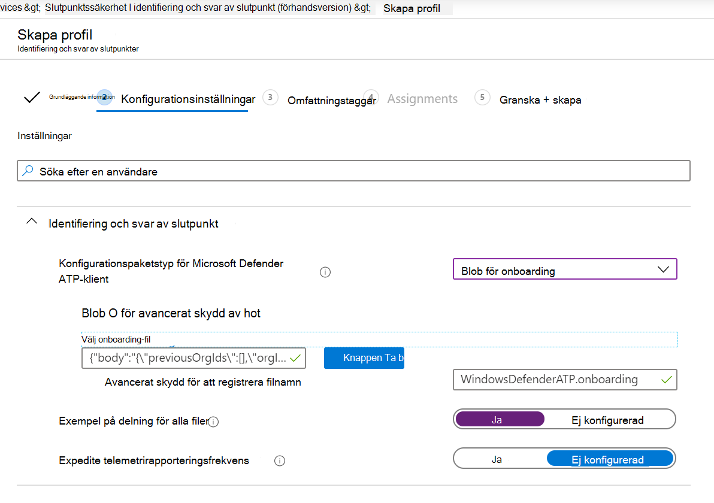

6. Lägg till omfattningstaggar om det behövs och välj **sedan Nästa.**Add scope tags if necessary, then select  **Next**.

    > [!div class="mx-imgBorder"]
    > 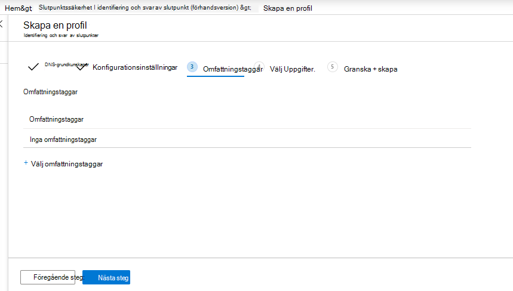

7. Lägg till testgrupp genom att **klicka på Välj grupper som ska ingå** och välj sedan **Nästa.**Add test group by clicking on **Select groups to include** and choose your group, then select  **Next**.

    > [!div class="mx-imgBorder"]
    > 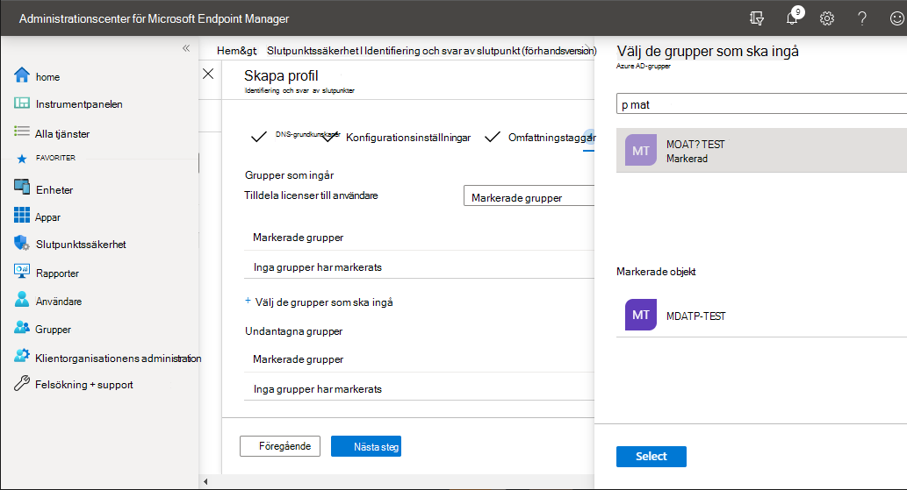

8. Granska och acceptera och välj sedan  **Skapa**.Review and accept, then select  **Create**.

    > [!div class="mx-imgBorder"]
    > 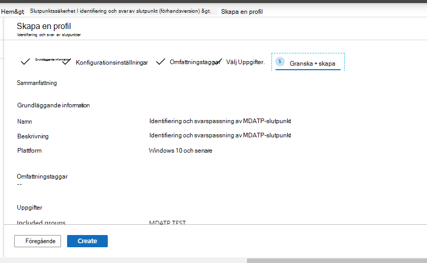

9. Du kan visa din slutförda princip.You can view your completed policy.

    > [!div class="mx-imgBorder"]
    > 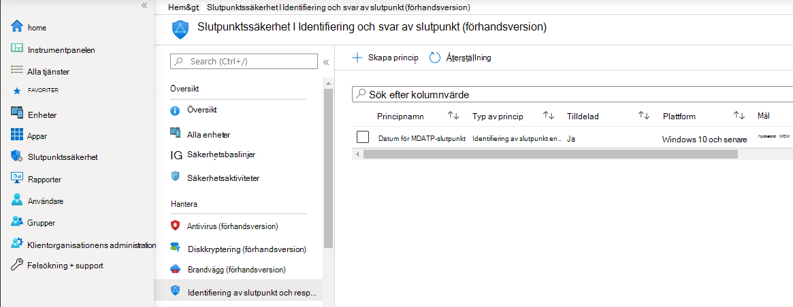

### Nästa generations skyddNext-generation protection

1. Öppna MEM-portalen.Open the MEM portal.

2. Gå till **Slutpunktssäkerhet > Antivirus > Skapa princip**.Navigate to **Endpoint security > Antivirus > Create Policy**.

    > [!div class="mx-imgBorder"]
    > 

3. Välj **plattform – Windows 10 och senare – Windows profil och plattform – Microsoft Defender Antivirus > Skapa.**Select **Platform - Windows 10 and Later - Windows and Profile – Microsoft  Defender Antivirus > Create**.

4. Ange namn och beskrivning och välj sedan  **Nästa**.Enter name and description, then select  **Next**.

    > [!div class="mx-imgBorder"]
    > 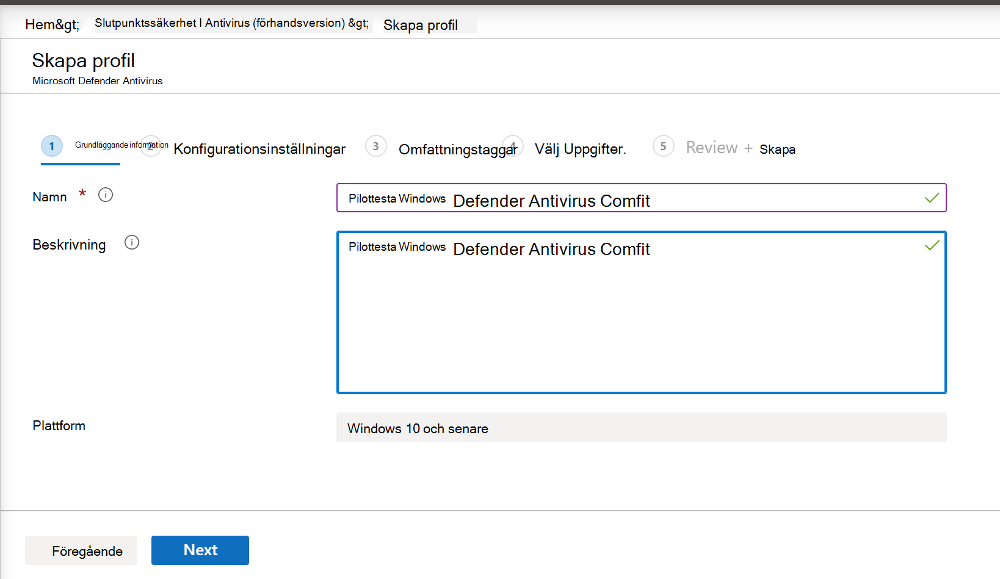

5. På sidan **Konfigurationsinställningar:** Ange de konfigurationer du behöver för Microsoft Defender Antivirus (Molnskydd, Undantag, Real-Time skydd och åtgärd).In the **Configuration settings page**: Set the configurations you require for  Microsoft Defender Antivirus (Cloud Protection, Exclusions, Real-Time  Protection, and Remediation).

    > [!div class="mx-imgBorder"]
    > 

6. Lägg till omfattningstaggar om det behövs och välj **sedan Nästa.**Add scope tags if necessary, then select  **Next**.

    > [!div class="mx-imgBorder"]
    > 

7. Välj de grupper du vill inkludera, tilldela till testgruppen och välj sedan **Nästa.**Select groups to include, assign to your test group, then select  **Next**.

    > [!div class="mx-imgBorder"]
    > 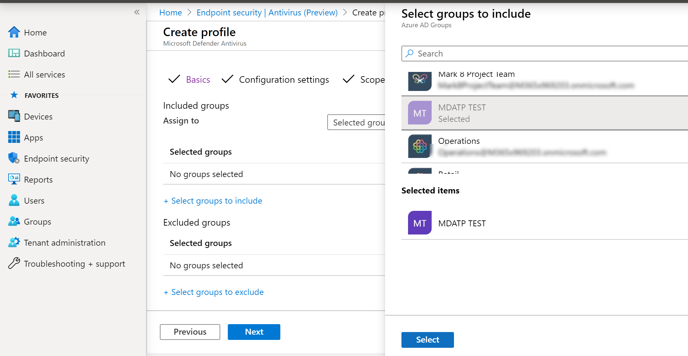

8. Granska och skapa och välj sedan  **Skapa**.Review and create, then select  **Create**.

    > [!div class="mx-imgBorder"]
    > 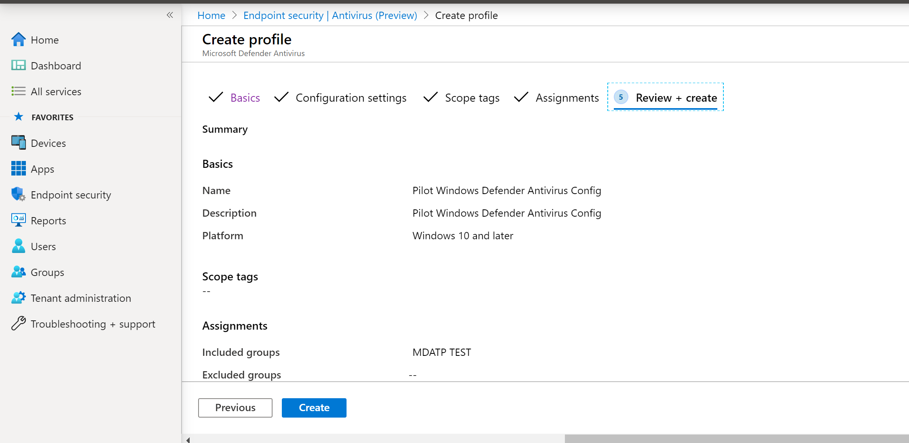

9. Konfigurationsprincipen som du har skapat visas.You'll see the configuration policy you created.

    > [!div class="mx-imgBorder"]
    > 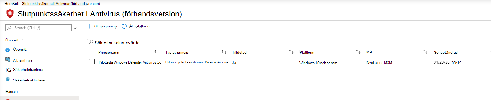

### Minskning av attackytan – regler för att minska attackytanAttack Surface Reduction – Attack surface reduction rules

1. Öppna MEM-portalen.Open the MEM portal.

2. Gå till **Slutpunktssäkerhet > minska attackytan**.Navigate to **Endpoint security > Attack surface reduction**.

3. Välj  **Skapa princip**.Select  **Create Policy**.

4. Välj **plattform – Windows 10 och senare – Profil – Regler för minskning av attackytor > Skapa**.Select **Platform - Windows 10 and Later – Profile - Attack surface reduction  rules > Create**.

    > [!div class="mx-imgBorder"]
    > 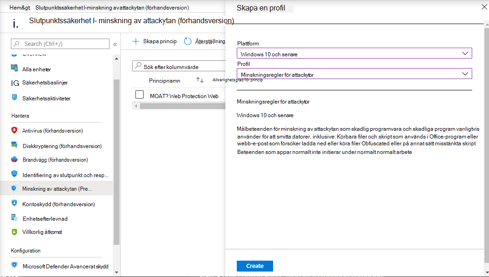

5. Ange ett namn och en beskrivning och välj sedan **Nästa.**Enter a name and description, then select  **Next**.

    > [!div class="mx-imgBorder"]
    > 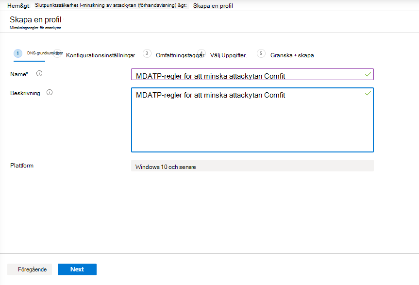

6. På sidan **Konfigurationsinställningar:** Ange de konfigurationer du behöver för att minska attackytan och välj sedan **Nästa.**In the **Configuration settings page**: Set the configurations you require for  Attack surface reduction rules, then select  **Next**.

    > [!NOTE]
    > Vi kommer att konfigurera alla minskningsregler för attackytor till Granskning.We will be configuring all of the Attack surface reduction rules to Audit.
    >
    > Mer information finns i Regler [för att minska attackytan](attack-surface-reduction.md).For more information, see [Attack surface reduction rules](attack-surface-reduction.md).

    > [!div class="mx-imgBorder"]
    > 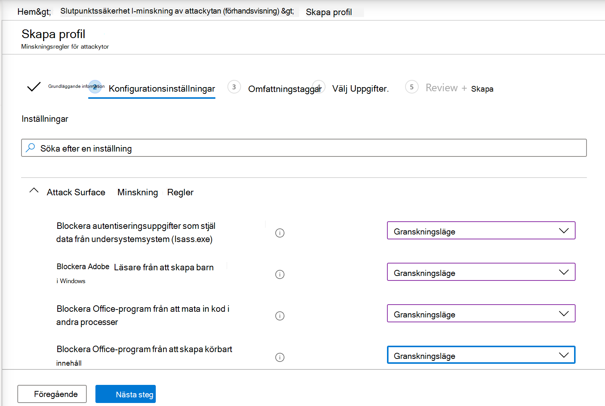

7. Lägg till omfattningstaggar efter behov och välj **sedan Nästa.**Add Scope Tags as required, then select  **Next**.

    > [!div class="mx-imgBorder"]
    > 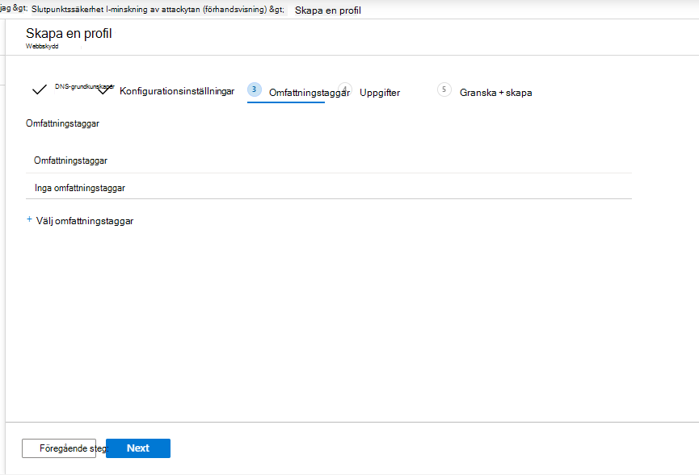

8. Välj de grupper du vill inkludera och tilldela till testgruppen och välj sedan **Nästa.**Select groups to include and assign to test group, then select  **Next**.

    > [!div class="mx-imgBorder"]
    > 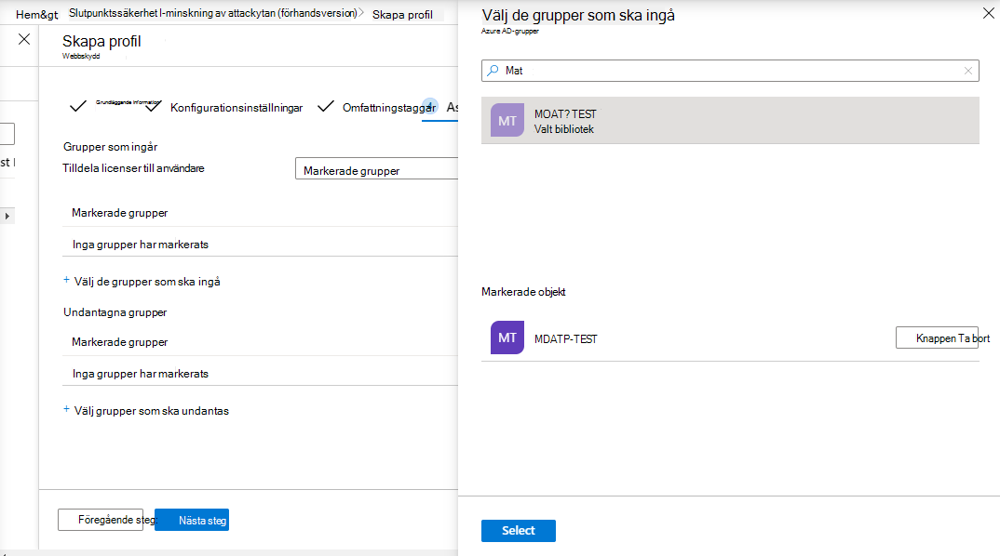

9. Granska informationen och välj sedan  **Skapa**.Review the details, then select  **Create**.

    > [!div class="mx-imgBorder"]
    > 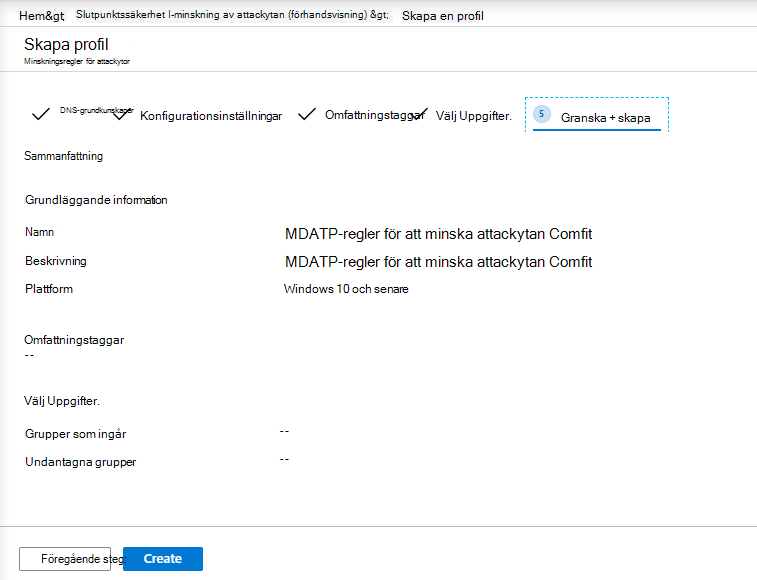

10. Visa principen.View the policy.

    > [!div class="mx-imgBorder"]
    > 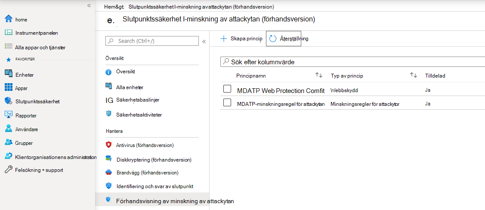

### Minskning av attackytan – webbskyddAttack Surface Reduction – Web Protection

1. Öppna MEM-portalen.Open the MEM portal.

2. Gå till **Slutpunktssäkerhet > minska attackytan**.Navigate to **Endpoint security > Attack surface reduction**.

3. Välj  **Skapa princip**.Select  **Create Policy**.

4. Välj **Windows 10 och Senare – Webbskydd > Skapa**.Select **Windows 10 and Later – Web protection > Create**.

    > [!div class="mx-imgBorder"]
    > 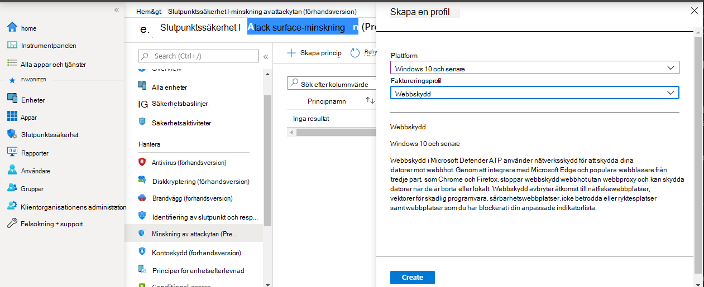

5. Ange ett namn och en beskrivning och välj sedan **Nästa.**Enter a name and description, then select  **Next**.

    > [!div class="mx-imgBorder"]
    > 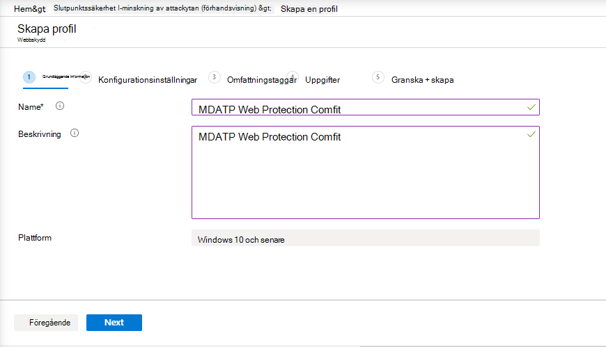

6. På sidan **Konfigurationsinställningar:** Ange de konfigurationer som krävs för webbskydd och välj sedan **Nästa.**In the **Configuration settings page**: Set the configurations you require for Web Protection, then select  **Next**.

    > [!NOTE]
    > Vi konfigurerar webbskydd för blockering.We are configuring Web Protection to Block.
    >
    > Mer information finns i [Webbskydd](web-protection-overview.md).For more information, see [Web Protection](web-protection-overview.md).

    > [!div class="mx-imgBorder"]
    > 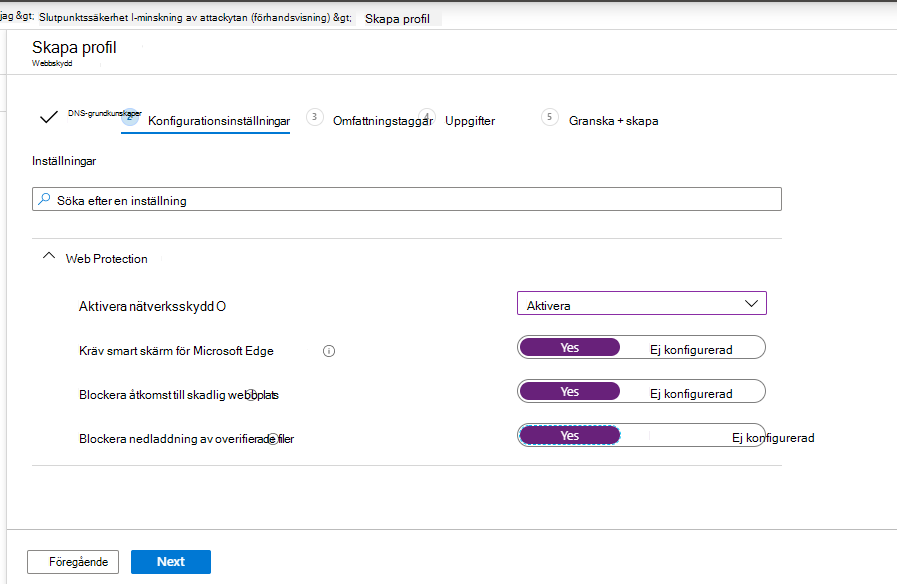

7. Lägg **till omfattningstaggar efter behov > Nästa.**Add **Scope Tags as required > Next**.

    > [!div class="mx-imgBorder"]
    > 

8. Välj **Tilldela för att testa > Nästa**.Select **Assign to test group > Next**.

    > [!div class="mx-imgBorder"]
    > 

9. Välj **Granska och skapa > skapa**.Select **Review and Create > Create**.

    > [!div class="mx-imgBorder"]
    > 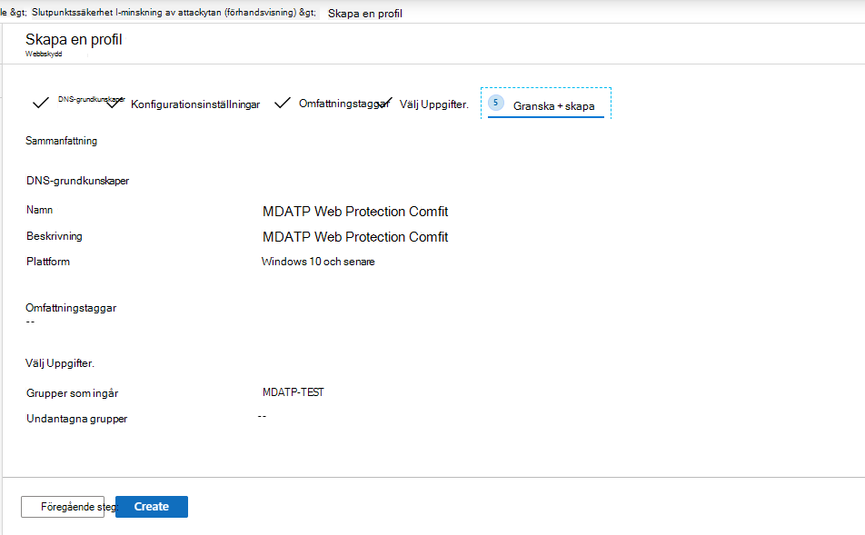

10. Visa principen.View the policy.

    > [!div class="mx-imgBorder"]
    > 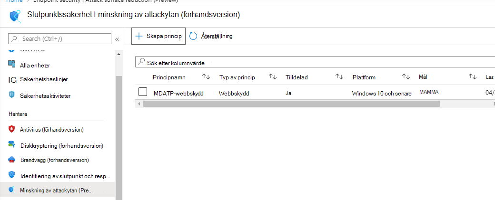

## Verifiera konfigurationsinställningarValidate configuration settings

### Bekräfta att principer har tillämpatsConfirm Policies have been applied

När konfigurationsprincipen har tilldelats tar det lite tid att tillämpa den.Once the Configuration policy has been assigned, it will take some time to apply.

Mer information om tidsinställningar finns [i Intune-konfigurationsinformation.](/mem/intune/configuration/device-profile-troubleshoot#how-long-does-it-take-for-devices-to-get-a-policy-profile-or-app-after-they-are-assigned)For information on timing, see [Intune configuration information](/mem/intune/configuration/device-profile-troubleshoot#how-long-does-it-take-for-devices-to-get-a-policy-profile-or-app-after-they-are-assigned).

Bekräfta att konfigurationsprincipen har använts på testenheten genom att följa följande process för varje konfigurationsprincip.To confirm that the configuration policy has been applied to your test device, follow the following process for each configuration policy.

1. Öppna MEM-portalen och navigera till relevant princip som visas i stegen ovan.Open the MEM portal and navigate to the relevant policy as shown in the steps above. I följande exempel visas nästa generations skyddsinställningar.The following example shows the next generation protection settings.

    > [!div class="mx-imgBorder"]
    > [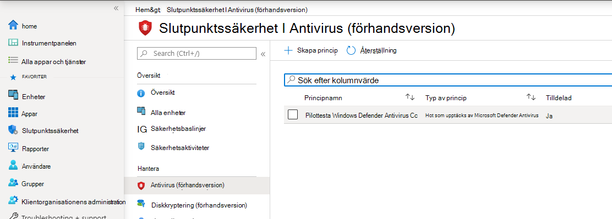](images/43ab6aa74471ee2977e154a4a5ef2d39.png#lightbox)

2. Välj **Konfigurationsprincip för** att visa principstatusen.Select  the **Configuration Policy** to view the policy status.

    > [!div class="mx-imgBorder"]
    > [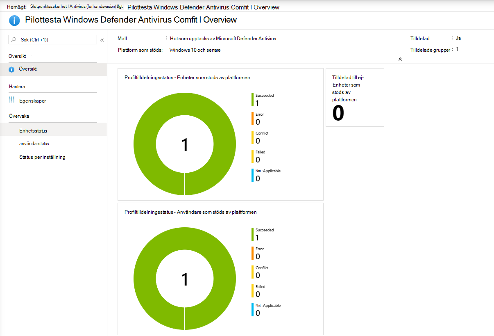](images/55ecaca0e4a022f0e29d45aeed724e6c.png#lightbox)

3. Välj  **Enhetsstatus** om du vill se statusen.Select  **Device Status** to see the status.

    > [!div class="mx-imgBorder"]
    > [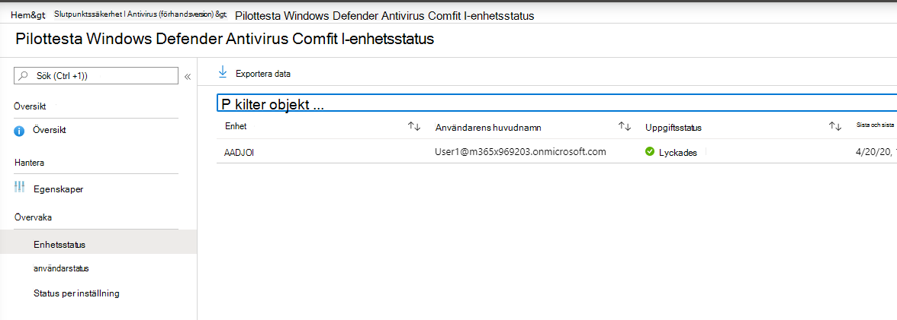](images/18a50df62cc38749000dbfb48e9a4c9b.png#lightbox)

4. Välj  **Användarstatus** om du vill se statusen.Select  **User Status** to see the status.

    > [!div class="mx-imgBorder"]
    > [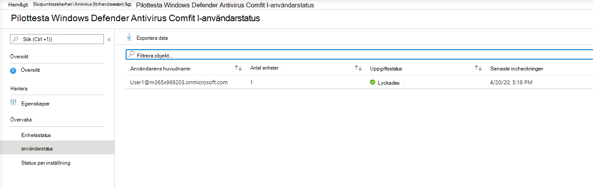](images/4e965749ff71178af8873bc91f9fe525.png#lightbox)

5. Välj  **Status per inställning för** att visa statusen.Select  **Per-setting status** to see the status.

    > [!TIP]
    > Den här vyn är mycket användbar om du vill identifiera inställningar som står i konflikt med en annan princip.This view is very useful to identify any settings that conflict with another policy.

    > [!div class="mx-imgBorder"]
    > [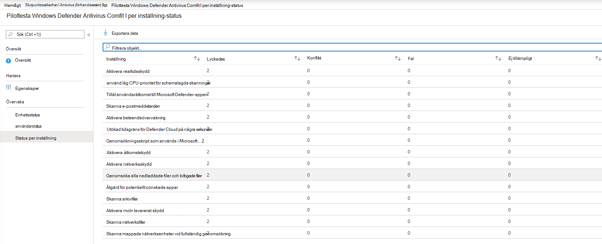](images/42acc69d0128ed09804010bdbdf0a43c.png#lightbox)

### Identifiering och svar av slutpunktEndpoint detection and response

1. Innan du använder konfigurationen bör inte tjänsten Defender för Endpoint Protection startas.Before applying the configuration, the Defender for Endpoint  Protection service should not be started.

    > [!div class="mx-imgBorder"]
    > [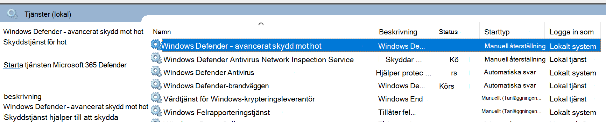](images/b418a232a12b3d0a65fc98248dbb0e31.png#lightbox)

2. När konfigurationen har tillämpats ska tjänsten Defender för Endpoint Protection startas.After the configuration has been applied, the Defender for Endpoint  Protection Service should be started.

    > [!div class="mx-imgBorder"]
    > 

3. När tjänsterna körs på enheten visas den i Microsoft Defender Säkerhetscenter.After the services are running on the device, the device appears in Microsoft  Defender Security Center.

    > [!div class="mx-imgBorder"]
    > 

### Nästa generations skyddNext-generation protection

1. Innan du använder principen på en testenhet bör du kunna hantera inställningarna manuellt enligt nedan.Before applying the policy on a test device, you should be able to manually  manage the settings as shown below.

    > [!div class="mx-imgBorder"]
    > 

2. När principen har tillämpats bör du inte kunna hantera inställningarna manuellt.After the policy has been applied, you should not be able to manually manage  the settings.

    > [!NOTE]
    > I följande bild **visas Aktivera moln levererat skydd** och Aktivera **realtidsskydd** som hanterat.In the following image **Turn on cloud-delivered protection** and **Turn on real-time protection** are being shown as managed.

    > [!div class="mx-imgBorder"]
    > 

### Minskning av attackytan – regler för att minska attackytanAttack Surface Reduction – Attack surface reduction rules

1. Innan du tillämpar principen på en testenhet, penna ett PowerShell-fönster och skriv `Get-MpPreference` .Before applying the policy on a test device, pen a PowerShell Window and type `Get-MpPreference`.

2. Det bör svara med följande rader utan innehåll:This should respond with the following lines with no content:

    > AttackSurfaceReductionOnlyExclusions:AttackSurfaceReductionOnlyExclusions:
    >
    > AttackSurfaceReductionRules_Actions:AttackSurfaceReductionRules_Actions:
    >
    > AttackSurfaceReductionRules_Ids:AttackSurfaceReductionRules_Ids:

    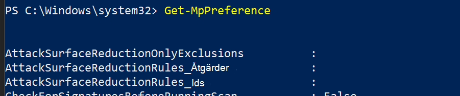

3. När du har tillämpat principen på en testenhet öppnar du ett PowerShell-Windows och skriver `Get-MpPreference` .After applying the policy on a test device, open a PowerShell Windows and type `Get-MpPreference`.

4. Det bör svara med följande rader med innehåll enligt nedan:This should respond with the following lines with content as shown below:

    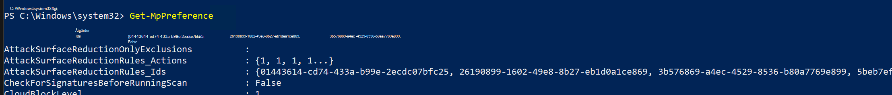

### Minskning av attackytan – webbskyddAttack Surface Reduction – Web Protection

1. Öppna ett PowerShell-fönster på testenheten Windows och skriv `(Get-MpPreference).EnableNetworkProtection` .On the test device, open a PowerShell Windows and type  `(Get-MpPreference).EnableNetworkProtection`.

2. Det bör svara med en nolla enligt nedan.This should respond with a 0 as shown below.

    

3. När du har tillämpat principen öppnar du en PowerShell-Windows och skriver `(Get-MpPreference).EnableNetworkProtection` .After applying the policy, open a PowerShell Windows and type  `(Get-MpPreference).EnableNetworkProtection`.

4. Detta bör svara med en 1:a (1) som visas nedan.This should respond with a 1 as shown below.

    
