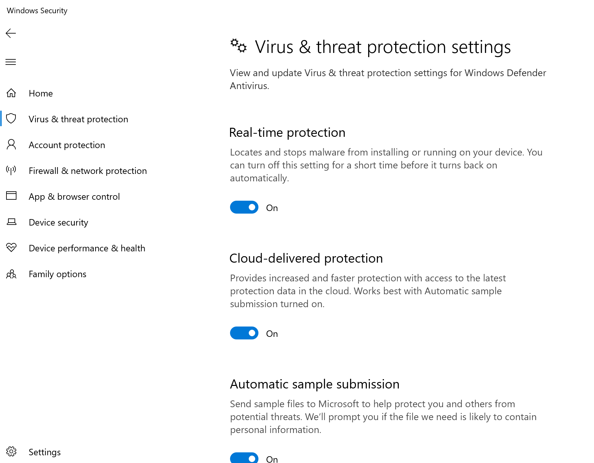
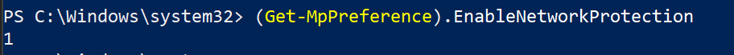

# Introduktion med Microsoft Endpoint Manager

[!INCLUDE [Microsoft 365 Defender rebranding](../../includes/microsoft-defender.md)]

**Gäller för:**
- [Microsoft Defender för Endpoint](https://go.microsoft.com/fwlink/p/?linkid=2154037)
- [Microsoft 365 Defender](https://go.microsoft.com/fwlink/?linkid=2118804)

> Vill du uppleva Microsoft Defender för Slutpunkt? [Registrera dig för en kostnadsfri utvärderingsversion.](https://www.microsoft.com/microsoft-365/windows/microsoft-defender-atp?ocid=docs-wdatp-exposedapis-abovefoldlink)

Den här artikeln är en del av distributionsguiden och fungerar som ett exempel på onboarding-metod.

I ämnet [Planering](deployment-strategy.md) finns det flera metoder för att introducera enheter till tjänsten. Det här avsnittet beskriver den molnbaserade arkitekturen.

 *Diagram över miljöarkitekturer*

Defender för Endpoint har stöd för registrering av olika slutpunkter och verktyg, men den här artikeln täcker inte in dem. Mer information om allmän onboarding med andra distributionsverktyg och metoder som stöds finns i [Översikt över onboarding.](onboarding.md)

[Microsoft Endpoint Manager](/mem/endpoint-manager-overview) är en lösningsplattform som ger en enhetlig plattform för flera tjänster. Den innehåller [Microsoft Intune](/mem/intune/fundamentals/what-is-intune) för molnbaserad enhetshantering.

Det här avsnittet leder användarna i:

- Steg 1: Onboarding-enheter till tjänsten genom att skapa en grupp i Microsoft Endpoint Manager (MEM) för att tilldela konfigurationer på
- Steg 2: Konfigurera Defender för slutpunktsfunktioner med Microsoft Endpoint Manager

Den här introduktionsvägledningen går igenom följande grundläggande steg som du måste vidta när du använder Microsoft Endpoint Manager:

- [Identifiera målenheter eller -användare](#identify-target-devices-or-users)
  - Skapa en Azure Active Directory (användare eller enhet)
- [Skapa en konfigurationsprofil](#step-2-create-configuration-policies-to-configure-microsoft-defender-for-endpoint-capabilities)
  - I Microsoft Endpoint Manager hjälper vi dig att skapa en separat princip för varje funktion.

## Resurser

Här är de länkar du behöver för resten av processen:

- [MEM-portal](https://aka.ms/memac)
- [Säkerhetscenter](https://securitycenter.windows.com/)
- [Intune-säkerhetsbaslinjer](/mem/intune/protect/security-baseline-settings-defender-atp#microsoft-defender)

Mer information om Microsoft Endpoint Manager finns i följande resurser:

- [Microsoft Endpoint Manager sidan](/mem/)
- [Blogginlägg om intune och ConfigMgr](https://www.microsoft.com/microsoft-365/blog/2019/11/04/use-the-power-of-cloud-intelligence-to-simplify-and-accelerate-it-and-the-move-to-a-modern-workplace/)
- [Introduktionsvideo om MEM](https://www.microsoft.com/microsoft-365/blog/2019/11/04/use-the-power-of-cloud-intelligence-to-simplify-and-accelerate-it-and-the-move-to-a-modern-workplace)

## Steg 1: Introducera enheter genom att skapa en grupp i MEM för att tilldela konfigurationer på

### Identifiera målenheter eller -användare

I det här avsnittet skapar vi en testgrupp där du kan tilldela dina konfigurationer.

> [!NOTE]
> Intune använder Azure Active Directory (Azure AD) grupper för att hantera enheter och användare. Som Intune-administratör kan du konfigurera grupper så att de passar organisationens behov.
>
> Mer information finns i Lägga [till grupper för att ordna användare och enheter.](/mem/intune/fundamentals/groups-add)

### Skapa en grupp

1. Öppna MEM-portalen.

2. Öppna **Grupper > Ny grupp.**

    > [!div class="mx-imgBorder"]
    > 

3. Ange information och skapa en ny grupp.

    > [!div class="mx-imgBorder"]
    > 

4. Lägg till testanvändaren eller testenheten.

5. I fönstret **Grupper > Alla grupper** öppnar du den nya gruppen.

6. Välj  **Medlemmar > Lägg till medlemmar**.

7. Leta reda på testanvändaren eller enheten och markera den.

    > [!div class="mx-imgBorder"]
    > 

8. Testgruppen har nu en medlem att testa.

## Steg 2: Skapa konfigurationsprinciper för att konfigurera Microsoft Defender för Endpoint-funktioner

I följande avsnitt ska du skapa ett antal konfigurationsprinciper.

Först finns en konfigurationsprincip för att välja vilka grupper av användare eller enheter som ska introduceras i Defender för Slutpunkt:

- [Identifiering och svar för slutpunkt](#endpoint-detection-and-response)

Sedan fortsätter du genom att skapa flera olika typer av slutpunktssäkerhetsprinciper:

- [Nästa generations skydd](#next-generation-protection)
- [Minskning av attackytan](#attack-surface-reduction--attack-surface-reduction-rules)

### Identifiering och svar av slutpunkt

1. Öppna MEM-portalen.

2. Gå till **Slutpunktssäkerhet > identifiering och svar av slutpunkt.** Klicka på **Skapa profil.**

    > [!div class="mx-imgBorder"]
    > 

3. Under **Plattform väljer du Windows 10 senare, Profil – Identifiering av slutpunkt och svar > Skapa**.

4. Ange ett namn och en beskrivning och välj sedan **Nästa.**

    > [!div class="mx-imgBorder"]
    > 

5. Välj inställningar efter behov och välj sedan  **Nästa**.

    > [!div class="mx-imgBorder"]
    > 

    > [!NOTE]
    > I den här instansen har det här fyllts i automatiskt eftersom Defender för Slutpunkt redan har integrerats med Intune. Mer information om integrering finns i Aktivera [Microsoft Defender för slutpunkt i Intune.](/mem/intune/protect/advanced-threat-protection-configure#to-enable-microsoft-defender-atp)
    >
    > Följande bild visar ett exempel på vad som visas när Microsoft Defender för Slutpunkt inte är integrerat med Intune:
    >
    > 

6. Lägg till omfattningstaggar om det behövs och välj **sedan Nästa.**

    > [!div class="mx-imgBorder"]
    > 

7. Lägg till testgrupp genom att **klicka på Välj grupper som ska ingå** och välj sedan **Nästa.**

    > [!div class="mx-imgBorder"]
    > 

8. Granska och acceptera och välj sedan  **Skapa**.

    > [!div class="mx-imgBorder"]
    > 

9. Du kan visa din slutförda princip.

    > [!div class="mx-imgBorder"]
    > 

### Nästa generations skydd

1. Öppna MEM-portalen.

2. Gå till **Slutpunktssäkerhet > Antivirus > Skapa princip**.

    > [!div class="mx-imgBorder"]
    > 

3. Välj **plattform – Windows 10 och senare – Windows profil och plattform – Microsoft Defender Antivirus > Skapa.**

4. Ange namn och beskrivning och välj sedan  **Nästa**.

    > [!div class="mx-imgBorder"]
    > 

5. På sidan **Konfigurationsinställningar:** Ange de konfigurationer du behöver för Microsoft Defender Antivirus (Molnskydd, Undantag, Real-Time skydd och åtgärd).

    > [!div class="mx-imgBorder"]
    > 

6. Lägg till omfattningstaggar om det behövs och välj **sedan Nästa.**

    > [!div class="mx-imgBorder"]
    > 

7. Välj de grupper du vill inkludera, tilldela till testgruppen och välj sedan **Nästa.**

    > [!div class="mx-imgBorder"]
    > 

8. Granska och skapa och välj sedan  **Skapa**.

    > [!div class="mx-imgBorder"]
    > 

9. Konfigurationsprincipen som du har skapat visas.

    > [!div class="mx-imgBorder"]
    > 

### Minskning av attackytan – regler för att minska attackytan

1. Öppna MEM-portalen.

2. Gå till **Slutpunktssäkerhet > minska attackytan**.

3. Välj  **Skapa princip**.

4. Välj **plattform – Windows 10 och senare – Profil – Regler för minskning av attackytor > Skapa**.

    > [!div class="mx-imgBorder"]
    > 

5. Ange ett namn och en beskrivning och välj sedan **Nästa.**

    > [!div class="mx-imgBorder"]
    > 

6. På sidan **Konfigurationsinställningar:** Ange de konfigurationer du behöver för att minska attackytan och välj sedan **Nästa.**

    > [!NOTE]
    > Vi kommer att konfigurera alla minskningsregler för attackytor till Granskning.
    >
    > Mer information finns i Regler [för att minska attackytan](attack-surface-reduction.md).

    > [!div class="mx-imgBorder"]
    > 

7. Lägg till omfattningstaggar efter behov och välj **sedan Nästa.**

    > [!div class="mx-imgBorder"]
    > 

8. Välj de grupper du vill inkludera och tilldela till testgruppen och välj sedan **Nästa.**

    > [!div class="mx-imgBorder"]
    > 

9. Granska informationen och välj sedan  **Skapa**.

    > [!div class="mx-imgBorder"]
    > 

10. Visa principen.

    > [!div class="mx-imgBorder"]
    > 

### Minskning av attackytan – webbskydd

1. Öppna MEM-portalen.

2. Gå till **Slutpunktssäkerhet > minska attackytan**.

3. Välj  **Skapa princip**.

4. Välj **Windows 10 och Senare – Webbskydd > Skapa**.

    > [!div class="mx-imgBorder"]
    > 

5. Ange ett namn och en beskrivning och välj sedan **Nästa.**

    > [!div class="mx-imgBorder"]
    > 

6. På sidan **Konfigurationsinställningar:** Ange de konfigurationer som krävs för webbskydd och välj sedan **Nästa.**

    > [!NOTE]
    > Vi konfigurerar webbskydd för blockering.
    >
    > Mer information finns i [Webbskydd](web-protection-overview.md).

    > [!div class="mx-imgBorder"]
    > 

7. Lägg **till omfattningstaggar efter behov > Nästa.**

    > [!div class="mx-imgBorder"]
    > 

8. Välj **Tilldela för att testa > Nästa**.

    > [!div class="mx-imgBorder"]
    > 

9. Välj **Granska och skapa > skapa**.

    > [!div class="mx-imgBorder"]
    > 

10. Visa principen.

    > [!div class="mx-imgBorder"]
    > 

## Verifiera konfigurationsinställningar

### Bekräfta att principer har tillämpats

När konfigurationsprincipen har tilldelats tar det lite tid att tillämpa den.

Mer information om tidsinställningar finns [i Intune-konfigurationsinformation.](/mem/intune/configuration/device-profile-troubleshoot#how-long-does-it-take-for-devices-to-get-a-policy-profile-or-app-after-they-are-assigned)

Bekräfta att konfigurationsprincipen har använts på testenheten genom att följa följande process för varje konfigurationsprincip.

1. Öppna MEM-portalen och navigera till relevant princip som visas i stegen ovan. I följande exempel visas nästa generations skyddsinställningar.

    > [!div class="mx-imgBorder"]
    > 

2. Välj **Konfigurationsprincip för** att visa principstatusen.

    > [!div class="mx-imgBorder"]
    > 

3. Välj  **Enhetsstatus** om du vill se statusen.

    > [!div class="mx-imgBorder"]
    > 

4. Välj  **Användarstatus** om du vill se statusen.

    > [!div class="mx-imgBorder"]
    > 

5. Välj  **Status per inställning för** att visa statusen.

    > [!TIP]
    > Den här vyn är mycket användbar om du vill identifiera inställningar som står i konflikt med en annan princip.

    > [!div class="mx-imgBorder"]
    > 

### Identifiering och svar av slutpunkt

1. Innan du använder konfigurationen bör inte tjänsten Defender för Endpoint Protection startas.

    > [!div class="mx-imgBorder"]
    > 

2. När konfigurationen har tillämpats ska tjänsten Defender för Endpoint Protection startas.

    > [!div class="mx-imgBorder"]
    > 

3. När tjänsterna körs på enheten visas den i Microsoft Defender Säkerhetscenter.

    > [!div class="mx-imgBorder"]
    > 

### Nästa generations skydd

1. Innan du använder principen på en testenhet bör du kunna hantera inställningarna manuellt enligt nedan.

    > [!div class="mx-imgBorder"]
    > 

2. När principen har tillämpats bör du inte kunna hantera inställningarna manuellt.

    > [!NOTE]
    > I följande bild **visas Aktivera moln levererat skydd** och Aktivera **realtidsskydd** som hanterat.

    > [!div class="mx-imgBorder"]
    > 

### Minskning av attackytan – regler för att minska attackytan

1. Innan du tillämpar principen på en testenhet, penna ett PowerShell-fönster och skriv `Get-MpPreference` .

2. Det bör svara med följande rader utan innehåll:

    > AttackSurfaceReductionOnlyExclusions:
    >
    > AttackSurfaceReductionRules_Actions:
    >
    > AttackSurfaceReductionRules_Ids:

    

3. När du har tillämpat principen på en testenhet öppnar du ett PowerShell-Windows och skriver `Get-MpPreference` .

4. Det bör svara med följande rader med innehåll enligt nedan:

    

### Minskning av attackytan – webbskydd

1. Öppna ett PowerShell-fönster på testenheten Windows och skriv `(Get-MpPreference).EnableNetworkProtection` .

2. Det bör svara med en nolla enligt nedan.

    

3. När du har tillämpat principen öppnar du en PowerShell-Windows och skriver `(Get-MpPreference).EnableNetworkProtection` .

4. Detta bör svara med en 1:a (1) som visas nedan.

    
