# <a name="create-a-notification-rule-when-a-local-onboarding-or-offboarding-script-is-used"></a><span data-ttu-id="247f0-104">Skapa en meddelanderegel när ett lokalt onboarding- eller offboarding-skript används</span><span class="sxs-lookup"><span data-stu-id="247f0-104">Create a notification rule when a local onboarding or offboarding script is used</span></span>

[!INCLUDE [Microsoft 365 Defender rebranding](../../includes/microsoft-defender.md)]


<span data-ttu-id="247f0-105">**Gäller för:**</span><span class="sxs-lookup"><span data-stu-id="247f0-105">**Applies to:**</span></span>
- [<span data-ttu-id="247f0-106">Microsoft Defender för Endpoint</span><span class="sxs-lookup"><span data-stu-id="247f0-106">Microsoft Defender for Endpoint</span></span>](https://go.microsoft.com/fwlink/p/?linkid=2154037)
- [<span data-ttu-id="247f0-107">Microsoft 365 Defender</span><span class="sxs-lookup"><span data-stu-id="247f0-107">Microsoft 365 Defender</span></span>](https://go.microsoft.com/fwlink/?linkid=2118804)


> <span data-ttu-id="247f0-108">Vill du uppleva Microsoft Defender för Slutpunkt?</span><span class="sxs-lookup"><span data-stu-id="247f0-108">Want to experience Microsoft Defender for Endpoint?</span></span> [<span data-ttu-id="247f0-109">Registrera dig för en kostnadsfri utvärderingsversion.</span><span class="sxs-lookup"><span data-stu-id="247f0-109">Sign up for a free trial.</span></span>](https://www.microsoft.com/microsoft-365/windows/microsoft-defender-atp?ocid=docs-wdatp-exposedapis-abovefoldlink)

[!include[Microsoft Defender for Endpoint API URIs for US Government](../../includes/microsoft-defender-api-usgov.md)]

[!include[Improve request performance](../../includes/improve-request-performance.md)]


<span data-ttu-id="247f0-110">Skapa en meddelanderegel så att du får ett meddelande när du använder ett lokalt onboarding- eller offboarding-skript.</span><span class="sxs-lookup"><span data-stu-id="247f0-110">Create a notification rule so that when a local onboarding or offboarding script is used, you'll be notified.</span></span> 

## <a name="before-you-begin"></a><span data-ttu-id="247f0-111">Innan du börjar</span><span class="sxs-lookup"><span data-stu-id="247f0-111">Before you begin</span></span>
<span data-ttu-id="247f0-112">Du måste ha åtkomst till:</span><span class="sxs-lookup"><span data-stu-id="247f0-112">You'll need to have access to:</span></span>
 - <span data-ttu-id="247f0-113">Microsoft Flow (som minst 1 flödesplan).</span><span class="sxs-lookup"><span data-stu-id="247f0-113">Microsoft Flow (Flow Plan 1 at a minimum).</span></span> <span data-ttu-id="247f0-114">Mer information finns på sidan [Priser för flöde.](https://flow.microsoft.com/pricing/)</span><span class="sxs-lookup"><span data-stu-id="247f0-114">For more information, see [Flow pricing page](https://flow.microsoft.com/pricing/).</span></span>
 - <span data-ttu-id="247f0-115">Azure-tabell eller SharePoint-lista eller -bibliotek/SQL DB</span><span class="sxs-lookup"><span data-stu-id="247f0-115">Azure Table or SharePoint List or Library / SQL DB</span></span>

## <a name="create-the-notification-flow"></a><span data-ttu-id="247f0-116">Skapa meddelandeflödet</span><span class="sxs-lookup"><span data-stu-id="247f0-116">Create the notification flow</span></span>

1. <span data-ttu-id="247f0-117">I [flow.microsoft.com](https://flow.microsoft.com/).</span><span class="sxs-lookup"><span data-stu-id="247f0-117">In [flow.microsoft.com](https://flow.microsoft.com/).</span></span>

2. <span data-ttu-id="247f0-118">Gå till **Mina flöden > Ny > – från tom**.</span><span class="sxs-lookup"><span data-stu-id="247f0-118">Navigate to **My flows > New > Scheduled - from blank**.</span></span> 

    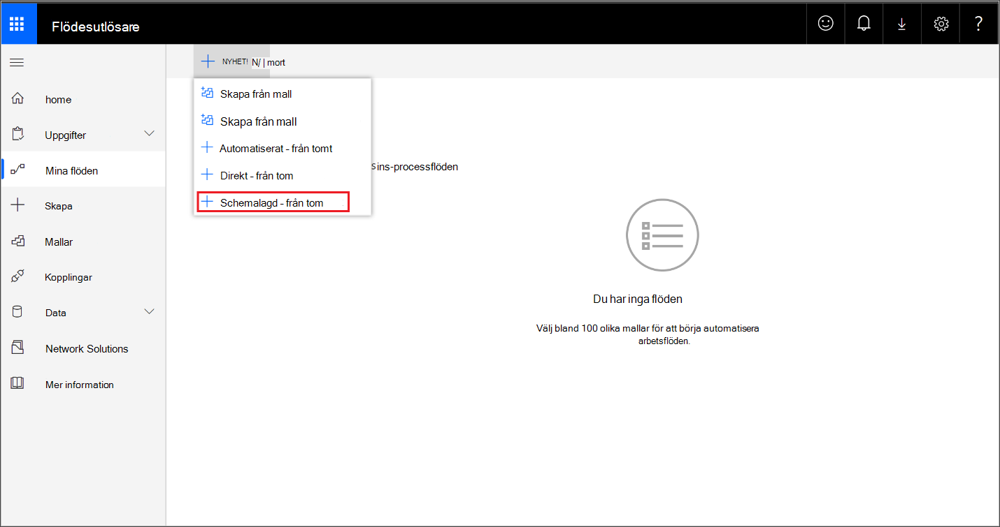


3. <span data-ttu-id="247f0-120">Skapa ett schemalagt flöde.</span><span class="sxs-lookup"><span data-stu-id="247f0-120">Build a scheduled flow.</span></span>
   1. <span data-ttu-id="247f0-121">Ange ett flödesnamn.</span><span class="sxs-lookup"><span data-stu-id="247f0-121">Enter a flow name.</span></span>
   2. <span data-ttu-id="247f0-122">Ange starttid och tid.</span><span class="sxs-lookup"><span data-stu-id="247f0-122">Specify the start and time.</span></span>
   3. <span data-ttu-id="247f0-123">Ange frekvens.</span><span class="sxs-lookup"><span data-stu-id="247f0-123">Specify the frequency.</span></span> <span data-ttu-id="247f0-124">Till exempel var femte minut.</span><span class="sxs-lookup"><span data-stu-id="247f0-124">For example, every 5 minutes.</span></span>

    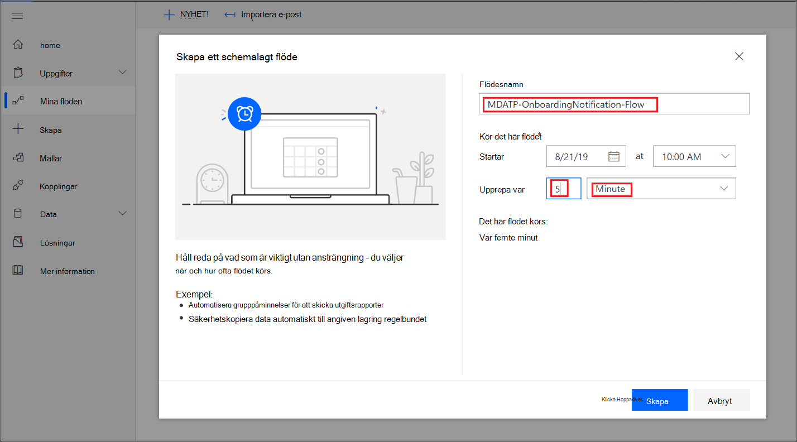

4. <span data-ttu-id="247f0-126">Välj knappen + för att lägga till en ny åtgärd.</span><span class="sxs-lookup"><span data-stu-id="247f0-126">Select the + button to add a new action.</span></span> <span data-ttu-id="247f0-127">Den nya åtgärden kommer att vara en HTTP-begäran till Defender för slutpunktens säkerhetscenter-enheters API.</span><span class="sxs-lookup"><span data-stu-id="247f0-127">The new action will be an HTTP request to the Defender for Endpoint security center device(s) API.</span></span> <span data-ttu-id="247f0-128">Du kan också ersätta den med den inmatade "WDATP Connector" (åtgärd: "Datorer - hämta lista över datorer").</span><span class="sxs-lookup"><span data-stu-id="247f0-128">You can also replace it with the out-of-the-box "WDATP Connector" (action: "Machines - Get list of machines").</span></span> 

    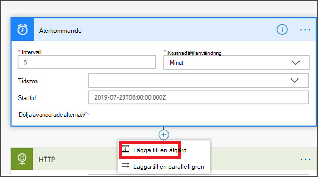


5. <span data-ttu-id="247f0-130">Ange följande HTTP-fält:</span><span class="sxs-lookup"><span data-stu-id="247f0-130">Enter the following HTTP fields:</span></span>

   - <span data-ttu-id="247f0-131">Metod: "GET" som ett värde för att få listan över enheter.</span><span class="sxs-lookup"><span data-stu-id="247f0-131">Method: "GET" as a value to get the list of devices.</span></span>
   - <span data-ttu-id="247f0-132">URI: Ange `https://api.securitycenter.microsoft.com/api/machines` .</span><span class="sxs-lookup"><span data-stu-id="247f0-132">URI: Enter `https://api.securitycenter.microsoft.com/api/machines`.</span></span>
   - <span data-ttu-id="247f0-133">Autentisering: Välj "Active Directory OAuth".</span><span class="sxs-lookup"><span data-stu-id="247f0-133">Authentication: Select "Active Directory OAuth".</span></span>
   - <span data-ttu-id="247f0-134">Klientorganisation: Logga in på https://portal.azure.com och navigera till Azure Active Directory > för appregistreringar och få värdet klientorganisations-ID. </span><span class="sxs-lookup"><span data-stu-id="247f0-134">Tenant: Sign-in to https://portal.azure.com and navigate to **Azure Active Directory > App Registrations** and get the Tenant ID value.</span></span>
   - <span data-ttu-id="247f0-135">Målgrupp: `https://securitycenter.onmicrosoft.com/windowsatpservice\`</span><span class="sxs-lookup"><span data-stu-id="247f0-135">Audience: `https://securitycenter.onmicrosoft.com/windowsatpservice\`</span></span>
   - <span data-ttu-id="247f0-136">Klient-ID: Logga in på https://portal.azure.com och navigera till Azure Active Directory > **och** få värdet klient-ID.</span><span class="sxs-lookup"><span data-stu-id="247f0-136">Client ID: Sign-in to https://portal.azure.com and navigate to **Azure Active Directory > App Registrations** and  get the Client ID value.</span></span>
   - <span data-ttu-id="247f0-137">Typ av autentiseringsuppgifter: Välj "Hemligt".</span><span class="sxs-lookup"><span data-stu-id="247f0-137">Credential Type: Select "Secret".</span></span>
   - <span data-ttu-id="247f0-138">Hemligt: Logga in på och https://portal.azure.com navigera till Azure Active Directory > för appregistreringar och få värdet klientorganisations-ID. </span><span class="sxs-lookup"><span data-stu-id="247f0-138">Secret: Sign-in to https://portal.azure.com and navigate to **Azure Active Directory > App Registrations** and get the Tenant ID value.</span></span>

    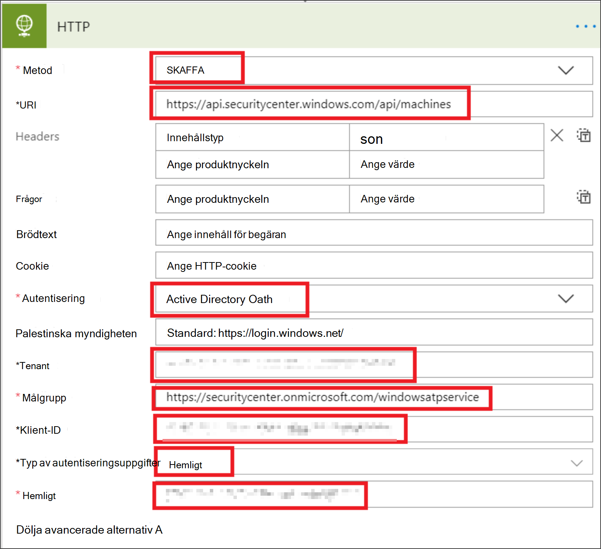


6. <span data-ttu-id="247f0-140">Lägg till ett nytt steg genom att **välja Lägg till** ny åtgärd och sedan söka efter **Dataåtgärder** och **välja Parse JSON.**</span><span class="sxs-lookup"><span data-stu-id="247f0-140">Add a new step by selecting **Add new action** then search for **Data Operations** and select **Parse JSON**.</span></span>

    

7. <span data-ttu-id="247f0-142">Lägg till brödtext **i fältet** Innehåll.</span><span class="sxs-lookup"><span data-stu-id="247f0-142">Add Body in the **Content** field.</span></span>

    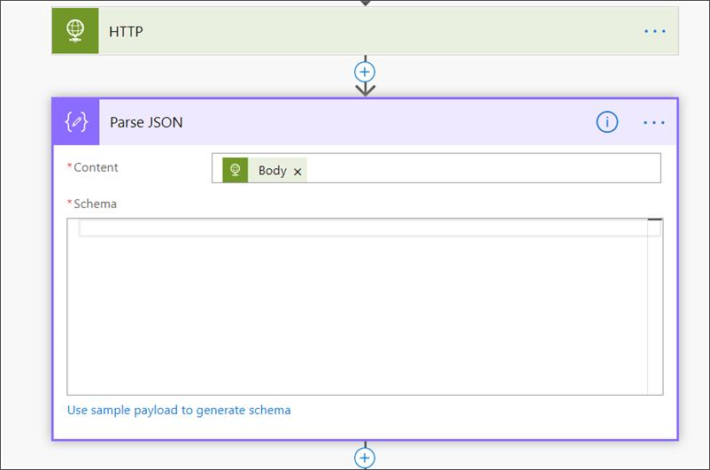

8. <span data-ttu-id="247f0-144">Välj länken **Använd exempel på nyttolast för att generera schema.**</span><span class="sxs-lookup"><span data-stu-id="247f0-144">Select the **Use sample payload to generate schema** link.</span></span>

    

9. <span data-ttu-id="247f0-146">Kopiera och klistra in följande JSON-kodstycke:</span><span class="sxs-lookup"><span data-stu-id="247f0-146">Copy and paste the following JSON snippet:</span></span>

    ```
    {
        "type": "object",
        "properties": {
            "@@odata.context": {
                "type": "string"
            },
            "value": {
                "type": "array",
                "items": {
                    "type": "object",
                    "properties": {
                        "id": {
                            "type": "string"
                        },
                        "computerDnsName": {
                            "type": "string"
                        },
                        "firstSeen": {
                            "type": "string"
                        },
                        "lastSeen": {
                            "type": "string"
                        },
                        "osPlatform": {
                            "type": "string"
                        },
                        "osVersion": {},
                        "lastIpAddress": {
                            "type": "string"
                        },
                        "lastExternalIpAddress": {
                            "type": "string"
                        },
                        "agentVersion": {
                            "type": "string"
                        },
                        "osBuild": {
                            "type": "integer"
                        },
                        "healthStatus": {
                            "type": "string"
                        },
                        "riskScore": {
                            "type": "string"
                        },
                        "exposureScore": {
                            "type": "string"
                        },
                        "aadDeviceId": {},
                        "machineTags": {
                            "type": "array"
                        }
                    },
                    "required": [
                        "id",
                        "computerDnsName",
                        "firstSeen",
                        "lastSeen",
                        "osPlatform",
                        "osVersion",
                        "lastIpAddress",
                        "lastExternalIpAddress",
                        "agentVersion",
                        "osBuild",
                        "healthStatus",
                        "rbacGroupId",
                        "rbacGroupName",
                        "riskScore",
                        "exposureScore",
                        "aadDeviceId",
                        "machineTags"
                    ]
                }
            }
        }
    }

    ```

10.  <span data-ttu-id="247f0-147">Extrahera värdena från JSON-samtalet och kontrollera om den registrerade enheten/-enheten redan är registrerad på SharePoint-listan som exempel:</span><span class="sxs-lookup"><span data-stu-id="247f0-147">Extract the values from the JSON call and check if the onboarded device(s) is / are already registered at the SharePoint list as an example:</span></span>
- <span data-ttu-id="247f0-148">Om ja utlöses inget meddelande</span><span class="sxs-lookup"><span data-stu-id="247f0-148">If yes, no notification will be triggered</span></span>
- <span data-ttu-id="247f0-149">Om nej registrerar du de nya onboarded-enheten i SharePoint-listan och ett meddelande skickas till Defender för Slutpunktsadministratören</span><span class="sxs-lookup"><span data-stu-id="247f0-149">If no, will register the new onboarded device(s) in the SharePoint list and a notification will be sent to the Defender for Endpoint admin</span></span>

    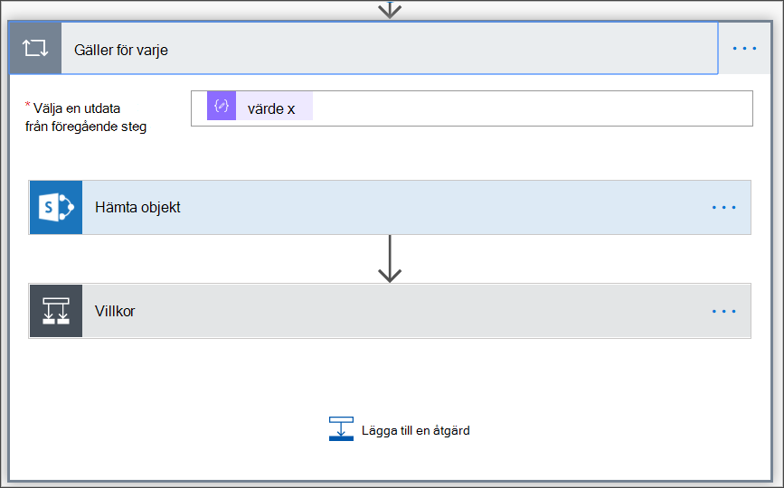

    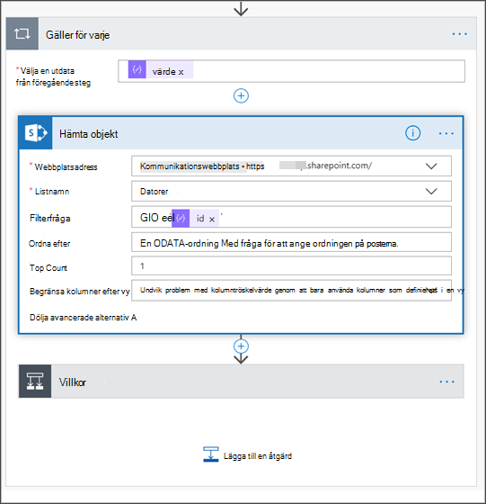

11. <span data-ttu-id="247f0-152">Under **Villkor** lägger du till följande uttryck: "length(body('Get_items')?[' värde'])" och ange att villkoret ska vara lika med 0.</span><span class="sxs-lookup"><span data-stu-id="247f0-152">Under **Condition**, add the following expression: "length(body('Get_items')?['value'])" and set the condition to equal to 0.</span></span>

    <span data-ttu-id="247f0-153">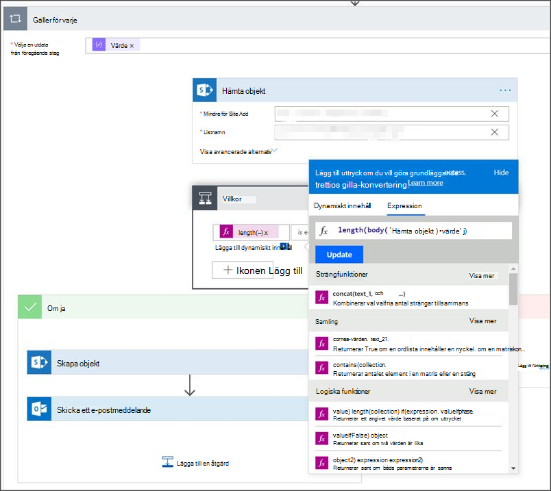</span><span class="sxs-lookup"><span data-stu-id="247f0-153"></span></span>  
    <span data-ttu-id="247f0-154">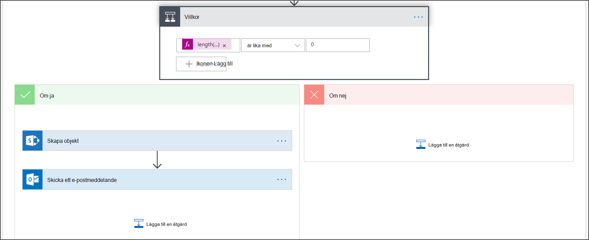 
     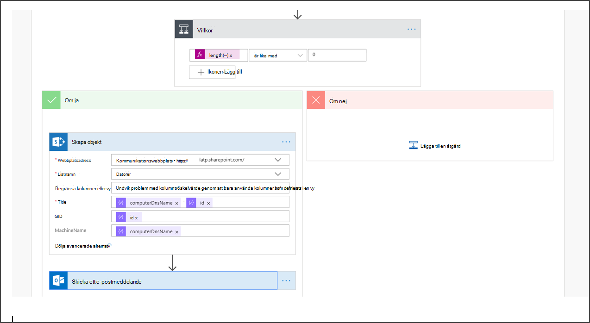</span><span class="sxs-lookup"><span data-stu-id="247f0-154"> 
    </span></span>  
<span data-ttu-id="247f0-155">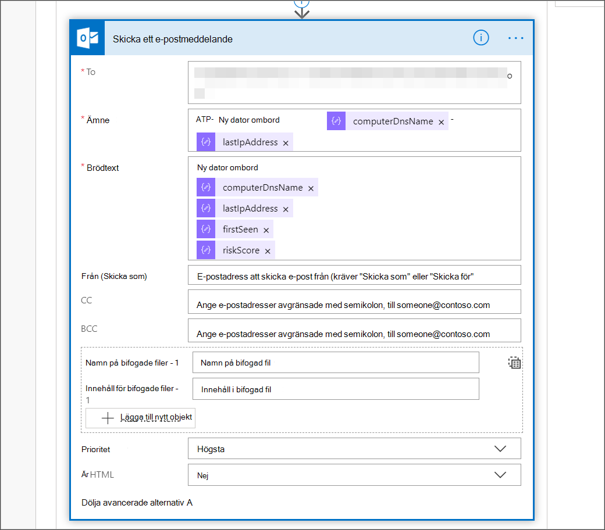</span><span class="sxs-lookup"><span data-stu-id="247f0-155"></span></span>

## <a name="alert-notification"></a><span data-ttu-id="247f0-156">Aviseringsmeddelande</span><span class="sxs-lookup"><span data-stu-id="247f0-156">Alert notification</span></span>
<span data-ttu-id="247f0-157">Följande bild är ett exempel på en e-postavisering.</span><span class="sxs-lookup"><span data-stu-id="247f0-157">The following image is an example of an email notification.</span></span>


## <a name="tips"></a><span data-ttu-id="247f0-159">Tips</span><span class="sxs-lookup"><span data-stu-id="247f0-159">Tips</span></span>

- <span data-ttu-id="247f0-160">Du kan endast filtrera här med hjälp av lastSeen:</span><span class="sxs-lookup"><span data-stu-id="247f0-160">You can filter here using lastSeen only:</span></span>
    - <span data-ttu-id="247f0-161">Var 60:e min:</span><span class="sxs-lookup"><span data-stu-id="247f0-161">Every 60 min:</span></span>
      - <span data-ttu-id="247f0-162">Ta alla enheter som senast har setts de senaste 7 dagarna.</span><span class="sxs-lookup"><span data-stu-id="247f0-162">Take all devices last seen in the past 7 days.</span></span> 

- <span data-ttu-id="247f0-163">För varje enhet:</span><span class="sxs-lookup"><span data-stu-id="247f0-163">For each device:</span></span> 
    - <span data-ttu-id="247f0-164">Om egenskapen senast sedd är i ett timintervall på [-7 dagar, -7dag + 60 minuter ] -> avisering om offboarding-möjlighet.</span><span class="sxs-lookup"><span data-stu-id="247f0-164">If last seen property is on the one hour interval of [-7 days, -7days + 60 minutes ] -> Alert for offboarding possibility.</span></span>
    - <span data-ttu-id="247f0-165">Om den första har setts är den senaste > aviseringen för registrering.</span><span class="sxs-lookup"><span data-stu-id="247f0-165">If first seen is on the past hour -> Alert for onboarding.</span></span>

<span data-ttu-id="247f0-166">I den här lösningen får du inte dubblettaviseringar: Det finns klientorganisationen som har flera enheter.</span><span class="sxs-lookup"><span data-stu-id="247f0-166">In this solution you will not have duplicate alerts: There are tenants that have numerous devices.</span></span> <span data-ttu-id="247f0-167">Att få alla dessa enheter kan vara mycket dyr och kan kräva sidinring.</span><span class="sxs-lookup"><span data-stu-id="247f0-167">Getting all those devices might be very expensive and might require paging.</span></span>

<span data-ttu-id="247f0-168">Du kan dela upp den i två frågor:</span><span class="sxs-lookup"><span data-stu-id="247f0-168">You can split it to two queries:</span></span> 
1.  <span data-ttu-id="247f0-169">För offboarding använder du bara det här intervallet med hjälp av OData-$filter och meddelar endast om villkoren är uppfyllda.</span><span class="sxs-lookup"><span data-stu-id="247f0-169">For offboarding take only this interval using the OData $filter and only notify if the conditions are met.</span></span>
2.  <span data-ttu-id="247f0-170">Ta alla enheter som senast sågs under den senaste timmen och kontrollera den första sett egenskapen för dem (om den första sett egenskapen finns på den senaste timmen, måste den senast sedd finnas där också).</span><span class="sxs-lookup"><span data-stu-id="247f0-170">Take all devices last seen in the past hour and check first seen property for them (if the first seen property is on the past hour, the last seen must be there too).</span></span> 

