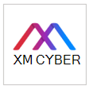
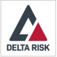
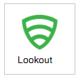
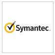
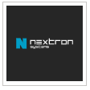

# Partnerprogram i Microsoft Defender för Slutpunkt 

[!INCLUDE [Microsoft 365 Defender rebranding](../../includes/microsoft-defender.md)]

**Gäller för:**
- [Microsoft Defender för Endpoint](https://go.microsoft.com/fwlink/p/?linkid=2154037)
- [Microsoft 365 Defender](https://go.microsoft.com/fwlink/?linkid=2118804)

> Vill du uppleva Microsoft Defender för Slutpunkt? [Registrera dig för en kostnadsfri utvärderingsversion.](https://www.microsoft.com/microsoft-365/windows/microsoft-defender-atp?ocid=docs-wdatp-exposedapis-abovefoldlink)

Defender för Endpoint stöder tredjepartsprogram som hjälper till att förbättra plattformens funktioner för identifiering, undersökning och hotinformation.

Stödet för tredjepartslösningar bidrar till att ytterligare effektivisera, integrera och hantera skydd från andra leverantörer med Microsoft Defender för Endpoint. säkerhetsgrupper kan arbeta effektivt mot moderna hot på ett effektivt sätt.

Microsoft Defender för Endpoint är sömlöst integrerat med befintliga säkerhetslösningar. Integreringen ger integrering med följande lösningar, till exempel:

- SIEM
- Lösningar för ärende- och IT-tjänsthantering
- Hanterade säkerhetstjänstleverantörer (MSSP)
- IoC-indikatorer, ingester och matchning
- Automatisk enhetsundersökning och åtgärd baserat på externa aviseringar
- Integrering med säkerhetsautomatisering och system för automatiseringssvar (SOAR)

## Program som stöds

### Säkerhetsinformation och analys

Logotyp |Partnernamn   | Beskrivning 
:---|:---|:---
| [AttackIQ-plattformen](https://go.microsoft.com/fwlink/?linkid=2103502) | AttackIQ-plattformen validerar att Defender för Endpoint konfigureras korrekt genom att kontinuerliga attacker startas på ett säkert sätt för produktionstillgångar
| [AzureSentinel](https://go.microsoft.com/fwlink/?linkid=2135705) | Streamaviseringar från Microsoft Defender för Endpoint till Azure Sentinel 
 | [Cymulate](https://go.microsoft.com/fwlink/?linkid=2135574)| Korrelera Defender för slutpunktsresultat med simulerade attacker för att verifiera korrekt identifiering och effektiva svarsåtgärder
 | [Elasticitetsäkerhet](https://go.microsoft.com/fwlink/?linkid=2139303) | Elasticitetsäkerhet är en kostnadsfri och öppen lösning som förhindrar, identifierar och svarar på hot
 | [IBM QRadar](https://go.microsoft.com/fwlink/?linkid=2113903) | Konfigurera IBM QRadar för att samla in identifieringar från Defender för Slutpunkt 
 | [Micro Focus ArcSight](https://go.microsoft.com/fwlink/?linkid=2113548) | Använda Micro Focus ArcSight för att hämta Defender för slutpunktsidentifiering
 | [RSA NetWitness](https://go.microsoft.com/fwlink/?linkid=2118566) | Stream Defender för slutpunktsaviseringar till RSA NetWitness med Microsoft Graph Säkerhets-API
 | [SafeBreach](https://go.microsoft.com/fwlink/?linkid=2114114)| Få insyn i Defender för slutpunktssäkerhetshändelser som automatiskt korreleras med SafeBreach-simuleringar
 | [Skybox Vulnerability Control](https://go.microsoft.com/fwlink/?linkid=2127467) | Skybox Vulnerability Control klipper ut sig genom bruset från hantering av säkerhetsrisker, korrelerar verksamhet, nätverk och hotkontext för att upptäcka dina riskfyllda svagheter
 | [Splunk](https://go.microsoft.com/fwlink/?linkid=2129805) | Med tillägget Defender för slutpunkt kan Splunk-användare mata in alla aviseringar och stödinformation till sin Splunk
 | [XM Cyber](https://go.microsoft.com/fwlink/?linkid=2136700) | Prioritera ditt svar på en avisering baserat på riskfaktorer och tillgångar med höga värden

### Automatisering och automatisering

Logotyp |Partnernamn   | Beskrivning 
:---|:---|:---
 | [CyberSponse CyOps](https://go.microsoft.com/fwlink/?linkid=2115943) | CyOps integreras med Defender för Endpoint för att automatisera kundernas spelböcker för incidentsvar i hög hastighet
 | [Delta Risk ActiveEye](https://go.microsoft.com/fwlink/?linkid=2127468) | Delta Risk, en ledande leverantör av SOC-as-a-Service och säkerhetstjänster, integrerar Defender för Endpoint med dess molnbaserade soAR-plattform ActiveEye.
 | [Dem denis, en Palo Networks Company](https://go.microsoft.com/fwlink/?linkid=2108414) | Inaktivera integrerar med Defender för Slutpunkt för att göra det möjligt för säkerhetsteam att använda och automatisera säkerhetsövervakning,berikande och svar för slutpunkter
 | [Microsoft Flow & Azure-funktioner](https://go.microsoft.com/fwlink/?linkid=2114300) | Använd Defender för slutpunktskopplingar för Azure Logic Apps & Microsoft Flow för att automatisera säkerhetsprocedurer
 | [Rapid7 InsightConnect](https://go.microsoft.com/fwlink/?linkid=2116040) | InsightConnect integrerar med Defender för Endpoint för att accelerera, effektivisera och integrera dina tidsintensiva säkerhetsprocesser
 | [ServiceNow](https://go.microsoft.com/fwlink/?linkid=2135621) | Mata in aviseringar i ServiceNow Security Operations-lösning baserat på Microsoft Graph API-integrering
 | [Sim simtur](https://go.microsoft.com/fwlink/?linkid=2113902) | Maximera incidentsvarsfunktioner som använder simlan och Defender för Slutpunkt tillsammans

### Hotinformation

Logotyp |Partnernamn   | Beskrivning 
:---|:---|:---
 | [MISP (Malware Information Sharing Platform)](https://go.microsoft.com/fwlink/?linkid=2127543) | Integrera hotindikatorer från plattformen för delning av hotinformation för öppen källa i din Defender för slutpunktsmiljö
 | [Palo Alto Networks](https://go.microsoft.com/fwlink/?linkid=2099582) | Förbättra ditt slutpunktsskydd genom att utöka Autofocus och andra hotflöden till Defender för Slutpunkt med MineMeld
 | [ThreatConnect](https://go.microsoft.com/fwlink/?linkid=2114115) | Avisering och/eller blockering av anpassad information om hot från ThreatConnect Playbooks med Defender för slutpunktsindikatorer

### Nätverkssäkerhet
Logotyp |Partnernamn   | Beskrivning 
:---|:---|:---
 | [Aruba ClearPass Policy Manager](https://go.microsoft.com/fwlink/?linkid=2127544) | Se till att Defender för slutpunkt är installerat och uppdaterat på varje slutpunkt innan du tillåter åtkomst till nätverket
 | [Blue Sexhörning för nätverk](https://go.microsoft.com/fwlink/?linkid=2104613) | Blue Sexhörning har byggt branschens första djupinlärningsplattform i realtid för skydd mot nätverkshot
 | [CyberMDX](https://go.microsoft.com/fwlink/?linkid=2135620) | Cyber-MDX integrerar omfattande sjukvårdstillgångar synlighet, hotskydd och repose i din Defender för Endpoint-miljö
 | [HYAS Protect](https://go.microsoft.com/fwlink/?linkid=2156763) | HYAS Protect använder auktoritativ kunskap om attackersinfrastruktur för att proaktivt skydda Microsoft Defender för slutpunktsslutpunkter från cyberattacker
 |[Identifiering och svar av vectra-nätverk (NDR)](https://go.microsoft.com/fwlink/?linkid=866934)| Vectra tillämpar AI & för att identifiera och svara på cyberattacker i realtid

### Olika plattformar
Logotyp |Partnernamn   | Beskrivning 
:---|:---|:---
| [Bitdefender](https://go.microsoft.com/fwlink/?linkid=860032)| Bitdefender GravityZone är en nästa generations plattform för slutpunktsskydd som ger ett heltäckande skydd mot hela skalan för avancerade cyberhot
 | [Bättre mobil](https://go.microsoft.com/fwlink/?linkid=2086214)| AI-baserad MTD-lösning för att stoppa mobilhot & nätfiske. Privat surfning på Internet för att skydda användarnas integritet 
| [Corrata](https://go.microsoft.com/fwlink/?linkid=2081148) | Mobil lösning – Skydda mobila enheter med detaljerad synlighet och kontroll från Corrata 
| [Lookout](https://go.microsoft.com/fwlink/?linkid=866935)| Get Lookout Mobile Threat Protection-telemetri för Android- och iOS-mobila enheter
 | [Symantec Endpoint Protection Mobile](https://go.microsoft.com/fwlink/?linkid=2090992)| SEP Mobile hjälper företag att förutse, upptäcka och förhindra säkerhetshot och säkerhetsproblem på mobila enheter 
| [Irperium](https://go.microsoft.com/fwlink/?linkid=2118044)|Utöka din Defender för slutpunkt till iOS och Android Machine Learning ditt mobilhot

## Andra integreringar

Logotyp |Partnernamn   | Beskrivning 
:---|:---|:---
| [Cyren-webbfilter](https://go.microsoft.com/fwlink/?linkid=2108221)| Förbättra Defender för slutpunkt med avancerad webbfiltrering
| [Morphisec](https://go.microsoft.com/fwlink/?linkid=2086215)| Ger Moving Target Defense-drivna avancerat skydd mot hot. Integrerar tekniska data direkt i WD Security Center-instrumentpaneler för att prioritera aviseringar, fastställa risknivå för enheter och visualisera full attacktidslinje, inklusive intern minnesinformation
| [THOR-molnet](https://go.microsoft.com/fwlink/?linkid=862988)| Gör det finns en live-forensisk sökning med en signaturbas som fokuserar på beständiga hot

## SIEM-integrering
Defender för Endpoint har stöd för SIEM-integrering med olika metoder. Detta kan omfatta specialiserade SIEM-systemgränssnitt med standardkopplingar, ett allmänt aviserings-API som aktiverar anpassade implementeringar och ett åtgärds-API som aktiverar statushantering för aviseringar.  Mer information finns i Aktivera [SIEM-integrering.](enable-siem-integration.md)

## Hantering av biljetttjänster och IT-tjänster 
Integrering av biljettlösning bidrar till att implementera manuella och automatiska svarsprocesser. Defender för Endpoint kan hjälpa dig att skapa biljetter automatiskt när en avisering skapas och lösa aviseringarna när biljetter stängs med API:t för aviseringar. 

## Säkerhetsautomatisering och automationssvarsintegrering (SOAR) 
Om du tar bort någon av lösningarna kan du skapa spelböcker och integrera den omfattande datamodellen och åtgärderna som Defender för slutpunkts-API:er visar för att få svar, till exempel fråga för enhetsdata, utlösa enhetsisolering, blockera/tillåta, åtgärda aviseringar och andra. 

## Korrelation för extern varning och automatiserad undersökning och åtgärd  
Defender för Endpoint erbjuder unika automatiska undersöknings- och åtgärdsfunktioner för att köra incidentåtgärder med en skala.
  
Genom att integrera automatisk undersökning och svarsfunktioner med andra lösningar, till exempel IDS och brandväggar, kan du hantera varningar och minimera komplexiteten kring nätverks- och enhets signalkorrelation, vilket effektivt effektiviserar åtgärderna för undersökning och åtgärder för hot på enheter.  

Externa aviseringar kan skickas till Defender för Endpoint. Dessa aviseringar visas sida vid sida med ytterligare enhetsbaserade aviseringar från Defender för Slutpunkt. Den här vyn ger en fullständig kontext av aviseringen och kan avslöja hela berättelse om en attack.  

## Indikatormatchning
Du kan använda hotinformation från leverantörer och sammanställare för att underhålla och använda indikatorer på kompromettatorer (IOCs).

Med Defender för Endpoint kan du integrera med dessa lösningar och agera på IoCs genom att korrelera rtf-telemetri för att skapa aviseringar.  Du kan också använda skyddsfunktioner och automatiska svarsfunktioner för att blockera körning och vidta åtgärder när det finns en matchning.

Defender för Endpoint har för närvarande stöd för IOC-matchning och -åtgärd för fil- och nätverksindikatorer. Blockering stöds för filindikatorer.  

## Stöd för icke-Windows plattformar
Defender för Endpoint tillhandahåller en centraliserad säkerhetsoperationer för Windows och icke-Windows, inklusive mobila enheter. Du kan se aviseringar från olika operativsystem som stöds (OS) i portalen och bättre skydda organisationens nätverk. 
