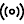

# Översikt över Microsoft Defender Säkerhetscenter-portalenMicrosoft Defender Security Center portal overview

[!INCLUDE [Microsoft 365 Defender rebranding](../../includes/microsoft-defender.md)]

**Gäller för:****Applies to:**
- [Microsoft Defender för EndpointMicrosoft Defender for Endpoint](https://go.microsoft.com/fwlink/p/?linkid=2146631)
- [Microsoft 365 DefenderMicrosoft 365 Defender](https://go.microsoft.com/fwlink/?linkid=2118804)

>Vill du använda Defender för Slutpunkt?Want to experience Defender for Endpoint? [Registrera dig för en kostnadsfri utvärderingsversion.Sign up for a free trial.](https://www.microsoft.com/microsoft-365/windows/microsoft-defender-atp?ocid=docs-wdatp-portaloverview-abovefoldlink) 

Enterprise security teams can use Microsoft Defender Security Center to monitor and assist in responding to alerts of potential advanced persistent threat activity or data breaches.Enterprise security teams can use Microsoft Defender Security Center to monitor and assist in responding to alerts of potential advanced persistent threat activity or data breaches.

Du kan använda [Microsoft Defender Säkerhetscenter för](https://securitycenter.windows.com/) att:You can use [Microsoft Defender Security Center](https://securitycenter.windows.com/) to:

- Visa, sortera och sortera aviseringar från slutpunkternaView, sort, and triage alerts from your endpoints
- Söka efter mer information om observerade indikatorer, till exempel filer och IP-adresserSearch for more information on observed indicators such as files and IP Addresses
- Ändra Microsoft Defender för slutpunktsinställningar, inklusive tidszon och granska licensinformationChange Microsoft Defender for Endpoint settings, including time zone and review licensing information

## Microsoft Defender SäkerhetscenterMicrosoft Defender Security Center

När du öppnar portalen visas:When you open the portal, you'll see:

- (1) Navigeringsfönstret (välj de vågräta linjerna högst upp i navigeringsfönstret för att visa eller dölja det)(1) Navigation pane (select the horizontal lines at the top of the navigation pane to show or hide it)
- (2) Sökning, communitycenter, lokalisering, hjälp och support, feedback(2) Search, Community center, Localization, Help and support, Feedback

 

> [!NOTE]
> Identifieringar av skadlig programvara visas bara om dina enheter använder Microsoft Defender Antivirus som standard för skydd mot skadlig kod i realtid.Malware related detections will only appear if your devices are using Microsoft Defender Antivirus as the default real-time protection antimalware product.

Du kan navigera i portalen med menyalternativen som är tillgängliga i alla avsnitt.You can navigate through the portal using the menu options available in all sections. I följande tabell finns en beskrivning av varje avsnitt.Refer to the following table for a description of each section.

OmrådeArea | BeskrivningDescription
:---|:---
**(1) Navigeringsfönstret****(1) Navigation pane** | Använd navigeringsfönstret för att flytta mellan Instrumentpaneler **,** Incidenter **,** Lista över enheter **,** Aviseringar kö **,** Automatiserade undersökningar **,** Avancerad sökning **,** Rapporter , Partners **& API:er**, **Hot & Sårbarhetshantering,** Utvärdering och **självstudiekurser**, **Tjänstens** hälsa, **Konfigurationshantering** och **Inställningar**. Use the navigation pane to move between **Dashboards**, **Incidents**, **Devices list**, **Alerts queue**, **Automated investigations**, **Advanced hunting**, **Reports**, **Partners & APIs**, **Threat & Vulnerability Management**, **Evaluation and tutorials**, **Service health**, **Configuration management**, and **Settings**. Markera de vågräta linjerna högst upp i navigeringsfönstret för att visa eller dölja dem.Select the horizontal lines at the top of the navigation pane to show or hide it.
**Instrumentpaneler****Dashboards** | Få åtkomst till de aktiva automatiserade undersökningarna, aktiva registreringar, automatiserad undersökningar, enheter som är i riskzonen, enheter med sensorproblem, tjänstens hälsa, identifieringskällor och rapporter instrumentpaneler för dagliga enheter.Access the active automated investigations, active alerts, automated investigations statistics, devices at risk, users at risk, devices with sensor issues, service health, detection sources, and daily devices reporting dashboards.
**Incidenter****Incidents** | Visa aviseringar som har aggregerats som incidenter.View alerts that have been aggregated as incidents.
**Listan Enheter****Devices list** | Visar listan över enheter som är onboarded to Defender för Endpoint, en del information om dem och deras exponerings- och risknivåer.Displays the list of devices that are onboarded to Defender for Endpoint, some information about them, and their exposure and risk levels.
**Kön Aviseringar****Alerts queue** | Visa aviseringar som genereras från enheter i din organisation.View alerts generated from devices in your organizations.
**Automatiserade undersökningar****Automated investigations** | Visar automatiska undersökningar som har utförts i nätverket, utlösande avisering, status för varje undersökning och annan information, till exempel när undersökningen startades och undersökningens varaktighet.Displays automated investigations that have been conducted in the network, triggering alert, the status of each investigation and other details such as when the investigation started and the duration of the investigation.
**Avancerad jakt****Advanced hunting** | Med avancerad sökning kan du proaktivt jaga och undersöka information i hela organisationen med hjälp av ett kraftfullt sök- och frågeverktyg.Advanced hunting allows you to proactively hunt and investigate across your organization using a powerful search and query tool.
**Rapporter****Reports** | Visa diagram med information om skydd mot hot, enhetshälsa och efterlevnad, webbskydd och sårbarhet.View graphs detailing threat protection, device health and compliance, web protection, and vulnerability.
**Partners & API:er****Partners & APIs** | Visa partneranslutningar som stöds, som förbättrar plattformens funktioner för identifiering, undersökning och hotinformation.View supported partner connections, which enhance the detection, investigation, and threat intelligence capabilities of the platform. Du kan också visa anslutna program, API-utforskaren, API-användningsöversikt och inställningar för dataexport.You can also view connected applications, the API explorer, API usage overview, and data export settings.
**Hot & sårbarhetshantering****Threat & Vulnerability management** | Visa Microsoft Secure Score för enheter, exponeringsresultat, exponerade enheter, sårbar programvara och vidta åtgärder för de viktigaste säkerhetsrekommendationerna.View your Microsoft Secure Score for Devices, exposure score, exposed devices, vulnerable software, and take action on top security recommendations.
**Utvärdering och självstudiekurser****Evaluation and tutorials** | Hantera testenheter, attack simuleringar och rapporter.Manage test devices, attack simulations, and reports. Lär dig mer om och upplev Defender för Slutpunkt-funktionerna genom en guidad genomgång i en utvärderingsmiljö.Learn and experience the Defender for Endpoint capabilities through a guided walk-through in a trial environment.
**Tjänstens hälsa****Service health** | Innehåller information om aktuell status för Defender för slutpunkt-tjänsten.Provides information on the current status of the Defender for Endpoint service. Du kan kontrollera att tjänstens hälsa är felfri eller om det finns aktuella problem.You'll be able to verify that the service health is healthy or if there are current issues.
**Konfigurationshantering****Configuration management** | Visar enheter som är ombord, organisationens säkerhetsbaslinje, prognosanalys, webbskyddstäckning och gör att du kan utföra hantering av attackytor på dina enheter.Displays on-boarded devices, your organizations' security baseline, predictive analysis, web protection coverage, and allows you to perform attack surface management on your devices.
**Inställningar****Settings** | Visar de inställningar du valde under introduktionen och gör att du kan uppdatera branschinställningar och bevarandeprincipperiod.Shows the settings you selected during onboarding and lets you update your industry preferences and retention policy period. Du kan också ange andra konfigurationsinställningar, till exempel behörigheter, API:er, regler, enhetshantering, IT-tjänsthantering och nätverksutvärderingar.You can also set other configuration settings such as permissions, APIs, rules, device management, IT service management, and network assessments.
**(2) Sökning, communitycenter, lokalisering, hjälp och support, feedback****(2) Search, Community center, Localization,  Help and support, Feedback** | **Sök** – sök efter enhet, fil, användare, URL, IP, sårbarhet, programvara och rekommendation.**Search** - search by device, file, user, URL, IP, vulnerability, software, and recommendation.    **Community Center** – Få tillgång till Community Center för att lära dig, samarbeta och dela upplevelser om produkten.**Community center** - Access the Community center to learn, collaborate, and share experiences about the product.     **Lokalisering –** ange tidszoner.**Localization** - Set time zones.     **Hjälp och support** – Få tillgång till Defender för slutpunktsguiden, Support för Microsoft och Microsoft Premier, licensinformation, simuleringar & självstudiekurser, Defender för endpoint-utvärderingslabb och kontakta en expert på hot.**Help and support** - Access the Defender for Endpoint guide, Microsoft and Microsoft Premier support, license information, simulations & tutorials, Defender for Endpoint evaluation lab, consult a threat expert.   **Feedback** – Ge kommentarer om vad du gillar och vad vi kan göra bättre.**Feedback** - Provide comments about what you like or what we can do better.

> [!NOTE]
> För enheter med DPI-skalningsproblem med hög upplösning kan du hitta möjliga lösningar i [Windows-skalningsproblem för hög-DPI-enheter.](https://support.microsoft.com/help/3025083/windows-scaling-issues-for-high-dpi-devices)For devices with high resolution DPI scaling issues, please see [Windows scaling issues for high-DPI devices](https://support.microsoft.com/help/3025083/windows-scaling-issues-for-high-dpi-devices) for possible solutions.

## Microsoft Defender för slutpunktsikonerMicrosoft Defender for Endpoint icons

Följande tabell innehåller information om de ikoner som används i hela portalen:The following table provides information on the icons used all throughout the portal:

IkonIcon | BeskrivningDescription
:---|:---
| Microsoft Defender för Endpoint-logotypMicrosoft Defender for Endpoint logo
| Avisering – Indikation på en aktivitet som är korrelerad med avancerade attacker.Alert – Indication of an activity correlated with advanced attacks.
| Identifiering – Indikation på identifiering av skadlig kod.Detection – Indication of a malware threat detection.
| Aktiva hot – hot som körs aktivt vid identifieringen.Active threat – Threats actively executing at the time of detection.
| Åtgärdat – Hot har tagits bort från enheten.Remediated – Threat removed from the device.
| Inte åtgärdat – Hot har inte tagits bort från enheten.Not remediated – Threat not removed from the device.
| Anger händelser som utlöste en avisering i **processträdet för Avisering.**Indicates events that triggered an alert in the **Alert process tree**.
| EnhetsikonDevice icon
| Microsoft Defender Antivirus-händelserMicrosoft Defender Antivirus events
| Windows Defender Application Guard-händelserWindows Defender Application Guard events
| Händelser i Windows Defender Device GuardWindows Defender Device Guard events
| Händelser för Sårbarhetsskydd i Windows DefenderWindows Defender Exploit Guard events
| Windows Defender SmartScreen-händelserWindows Defender SmartScreen events
| Händelser för Windows-brandväggenWindows Firewall events
| SvarsåtgärdResponse action
| ProcesshändelserProcess events
| NätverkshändelserNetwork events
| FilhändelserFile  events
| RegisterhändelserRegistry events
| Läsa in DLL-händelserLoad DLL events
| Andra händelserOther events
| Ändra åtkomsttokenAccess token modification
| Skapa filerFile creation
| UndertecknarenSigner
| SökvägFile path
| KommandoradCommand line
| Osignerad filUnsigned file
| ProcessträdProcess tree
| MinnestilldelningMemory allocation
| ProcessinlösningProcess injection
| Powershell-kommando som körsPowershell command run
 | Community centerCommunity center
 | MeddelandenNotifications
 | Automatisk undersökning – inga hot hittadesAutomated investigation - no threats found
 | Automatiserad undersökning – misslyckadesAutomated investigation - failed
 | Automatiserad undersökning – delvis undersökadAutomated investigation - partially investigated
 | Automatisk undersökning – avslutas av systemetAutomated investigation - terminated by system
 | Automatiserad undersökning – väntandeAutomated investigation - pending
 | Automatiserad undersökning – körsAutomated investigation - running
 | Automatiserad undersökning – åtgärdadAutomated investigation - remediated
 | Automatiserad undersökning – delvis åtgärdatAutomated investigation - partially remediated
 | Hot & sårbarhetshantering – insikter om hotThreat & Vulnerability Management - threat insights
 | Hot & sårbarhetshantering – möjlig aktiv aviseringThreat & Vulnerability Management - possible active alert
 | Hot & sårbarhetshantering – rekommendation insikterThreat & Vulnerability Management - recommendation insights

## Relaterade ämnenRelated topics

- [Översikt över Microsoft Defender SäkerhetscenterOverview of Microsoft Defender Security Center](use.md)
- [Visa instrumentpanelen för säkerhetsåtgärderView the Security operations dashboard](security-operations-dashboard.md)
- [Visa instrumentpanelen för & SårbarhetshanteringView the Threat & Vulnerability Management dashboard](tvm-dashboard-insights.md)
- [Visa instrumentpanelen för hotanalyser och vidta rekommenderade åtgärderView the Threat analytics dashboard and take recommended mitigation actions](threat-analytics.md)
