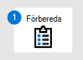

# Förbereda Microsoft Defender för distribution av EndpointPrepare Microsoft Defender for Endpoint deployment

[!INCLUDE [Microsoft 365 Defender rebranding](../../includes/microsoft-defender.md)]

**Gäller för:****Applies to:**
- [Microsoft Defender för EndpointMicrosoft Defender for Endpoint](https://go.microsoft.com/fwlink/p/?linkid=2146631)
- [Microsoft 365 DefenderMicrosoft 365 Defender](https://go.microsoft.com/fwlink/?linkid=2118804)

> Vill du uppleva Microsoft Defender för Slutpunkt?Want to experience Microsoft Defender for Endpoint? [Registrera dig för en kostnadsfri utvärderingsversion.Sign up for a free trial.](https://www.microsoft.com/microsoft-365/windows/microsoft-defender-atp?ocid=docs-wdatp-exposedapis-abovefoldlink)

Distribution av Defender för Endpoint är en process i tre steg:Deploying Defender for Endpoint is a three-phase process:

|  Fas 1: FörberedaPhase 1: Prepare |  [Fas 2: KonfigureraPhase 2: Setup](production-deployment.md) |  [Fas 3: IntroduktionPhase 3: Onboard](onboarding.md) |
| ----- | ----- | ----- |
|*Du är här!**You are here!* | ||

Du håller på att förbereda dig.You are currently in the preparation phase.

Förberedelse är avgörande för en lyckad distribution.Preparation is key to any successful deployment. I den här artikeln får du vägledning i de punkter du behöver tänka på när du förbereder distributionen av Defender för Slutpunkt.In this article, you'll be guided on the points you'll need to consider as you prepare to deploy Defender for Endpoint.

## Intressenter och godkännandeStakeholders and approval
Följande avsnitt fungerar för att identifiera alla intressenter som är inblandade i projektet och måste godkänna, granska eller hålla sig informerad.The following section serves to identify all the stakeholders that are involved in the project and need to approve, review, or stay informed.

Lägg till intressenter i tabellen nedan efter behov för din organisation.Add stakeholders to the table below as appropriate for your organization.

-   SO = Godkänn projektSO = Approve project

-   R = Granska det här projektet och ge inputR = Review this project and provide input

-   I = Informeras om projektetI = Informed of this project

| NamnName                 | RollRole                                                                                                                                                                                                          | ÅtgärdAction |
|----------------------|---------------------------------------------------------------------------------------------------------------------------------------------------------------------------------------------------------------|--------|
| Ange namn och e-postadressEnter name and email | **CISO (Chief Information Security Officer)** En chef som fungerar som *sponsor inom organisationen för den nya teknikdistributionen.***Chief Information Security Officer (CISO)** *An executive representative who serves as sponsor inside the organization for the new technology deployment.*                                                  | SOSO     |
| Ange namn och e-postadressEnter name and email | **Chef för Cyber Defense Operations Center (CDOC)** En representant från *CDOC-teamet* som ansvarar för att definiera hur ändringen justeras mot processerna i kundens säkerhetsoperationsteam.**Head of Cyber Defense Operations Center (CDOC)** *A representative from the CDOC team in charge of defining how this change is aligned with the processes in the customers security operations team.*       | SOSO     |
| Ange namn och e-postadressEnter name and email | **Säkerhetsarkitekt** En representant för säkerhetsgruppen som ansvarar för att definiera hur ändringen överensstämmer med organisationens *kärnarkitektur inom säkerhet.***Security Architect** *A representative from the Security team in charge of defining how this change is aligned with the core Security architecture in the organization.*                         | RR      |
| Ange namn och e-postadressEnter name and email | **Arbetsplatsarkitekt** *En representant för IT-teamet* som ansvarar för att definiera hur förändringen är i linje med organisationens kärnarkitektur på arbetsplatsen.**Workplace Architect** *A representative from the IT team in charge of defining how this change is aligned with the core workplace architecture in the organization.*                             | RR      |
| Ange namn och e-postadressEnter name and email | **Säkerhetsanalytiker En** representant för CDOC-teamet som kan bidra med information om identifieringsfunktioner, användarupplevelse och den övergripande användbarheten för denna ändring ur ett *säkerhetsperspektiv.***Security Analyst** *A representative from the CDOC team who can provide input on the detection capabilities, user experience, and overall usefulness of this change from a security operations perspective.* | II      |

## MiljöEnvironment 

Det här avsnittet används för att säkerställa att din miljö är helt förståd av intressenter, som kommer att hjälpa till att identifiera potentiella beroenden och/eller ändringar som krävs i tekniker eller processer.This section is used to ensure your environment is deeply understood by the stakeholders, which will help identify potential dependencies and/or changes required in technologies or processes.

| VadWhat                                  | BeskrivningDescription |
|---------------------------------------|-------------|
| Antal slutpunkterEndpoint count                        |             |
| Antal servrarServer count                          |             |
| HanteringsmotorManagement engine                     |             |
| CDOC-fördelningCDOC distribution                     |             |
| Säkerhetsinformation och händelse (SIEM)Security information and event (SIEM) |             |

## Rollbaserad åtkomstkontrollRole-based access control

Microsoft rekommenderar att man använder minsta behörighetsbegreppet.Microsoft recommends using the concept of least privileges. Defender för Endpoint utnyttjar inbyggda roller i Azure Active Directory.Defender for Endpoint leverages built-in roles within Azure Active Directory. Microsoft rekommenderar att [du granskar de olika roller som är tillgängliga](https://docs.microsoft.com/azure/active-directory/active-directory-assign-admin-roles-azure-portal) och väljer rätt roll för att lösa dina behov för varje person i programmet.Microsoft recommends [review the different roles that are available](https://docs.microsoft.com/azure/active-directory/active-directory-assign-admin-roles-azure-portal) and choose the right one to solve your needs for each persona for this application. Vissa roller kan behöva tillämpas tillfälligt och tas bort när distributionen har slutförts.Some roles may need to be applied temporarily and removed after the deployment has been completed.

| PersonasPersonas                     | RollerRoles | Azure AD-roll (vid behov)Azure AD Role (if necessary) | Tilldela tillAssign to |
|------------------------------|-------|-----------------------------|-----------|
| SäkerhetsadministratörSecurity Administrator       |       |                             |           |
| SäkerhetsanalytikerSecurity Analyst             |       |                             |           |
| SlutpunktsadministratörEndpoint Administrator       |       |                             |           |
| InfrastrukturadministratörInfrastructure Administrator |       |                             |           |
| Företagsägare/intressentBusiness Owner/Stakeholder   |       |                             |           |

Microsoft rekommenderar att du använder [Hantering av behörigheter för](https://docs.microsoft.com/azure/active-directory/active-directory-privileged-identity-management-configure) privilegierad identitet för att hantera dina roller för ytterligare granskning, kontroll och åtkomstgranskning för användare med katalogbehörigheter.Microsoft recommends using [Privileged Identity Management](https://docs.microsoft.com/azure/active-directory/active-directory-privileged-identity-management-configure) to manage your roles to provide additional auditing, control, and access review for users with directory permissions.

Defender för Endpoint har stöd för två sätt att hantera behörigheter:Defender for Endpoint supports two ways to manage permissions:

-   **Grundläggande behörighetshantering:** Ange behörighet till antingen fullständig åtkomst eller skrivskydd.**Basic permissions management**: Set permissions to either full access or read-only. När det gäller användare av grundläggande behörighetshantering med rollen Global administratör eller Säkerhetsadministratör i Azure Active Directory har de fullständig åtkomst medan rollen Säkerhetsläsare har skrivskyddsåtkomst.In the case of basic permissions management users with Global Administrator or Security Administrator role in Azure Active Directory have full access while the Security reader role has read-only access.

-   **Rollbaserad åtkomstkontroll (RBAC):** Ange detaljerade behörigheter genom att definiera roller, tilldela Azure AD-användargrupper till rollerna och ge användargrupper åtkomst till enhetsgrupper.**Role-based access control (RBAC)**: Set granular permissions by defining roles, assigning Azure AD user groups to the roles, and granting the user groups access to device groups. Mer information.For more information. se [Hantera portalåtkomst med hjälp av rollbaserad åtkomstkontroll](rbac.md).see [Manage portal access using role-based access control](rbac.md).

Microsoft rekommenderar att du utnyttjar RBAC för att säkerställa att endast användare som har ett företags justering kan komma åt Defender för Endpoint.Microsoft recommends leveraging RBAC to ensure that only users that have a business justification can access Defender for Endpoint.

Mer information om behörighetsriktlinjer finns [här.](https://docs.microsoft.com/microsoft-365/security/defender-endpoint/user-roles#create-roles-and-assign-the-role-to-an-azure-active-directory-group)You can find details on permission guidelines [here](https://docs.microsoft.com/microsoft-365/security/defender-endpoint/user-roles#create-roles-and-assign-the-role-to-an-azure-active-directory-group).

Följande exempeltabell hjälper till att identifiera Cyber Defense Operations Center-strukturen i din miljö som hjälper dig att avgöra vilken RBAC-struktur som krävs för din miljö.The following example table serves to identify the Cyber Defense Operations Center structure in your environment that will help you determine the RBAC structure required for your environment.

| TierTier   | BeskrivningDescription                                                                                                                                                                                                 | Behörighet krävsPermission Required |
|--------|-------------------------------------------------------------------------------------------------------------------------------------------------------------------------------------------------------------|---------------------|
| Nivå 1Tier 1 | **Team/IT-team för lokala säkerhetsåtgärder****Local security operations team / IT team** Gruppen undersöker och undersöker vanligtvis aviseringar som finns inom deras geolokalisering och eskalerar till nivå 2 i fall där en aktiv åtgärd krävs.This team usually triages and investigates alerts contained within their geolocation and escalates to Tier 2 in cases where an active remediation is required.                                              |                     |
| Nivå 2Tier 2 | **Teamet för regionala säkerhetsåtgärder****Regional security operations team** Det här teamet kan se alla enheter i deras region och utföra åtgärder.This team can see all the devices for their region and perform remediation actions.                                                                                                                        |        Visa dataView data               |
| Nivå 3Tier 3 | **Teamet för globala säkerhetsåtgärder****Global security operations team** Det här teamet består av säkerhetsexperter och har behörighet att se och utföra alla åtgärder från portalen.This team consists of security experts and is authorized to see and perform all actions from the portal. | Visa dataView data    Undersökning av aviseringar Aktiv åtgärdAlerts investigation Active remediation actions   Undersökning av aviseringar Aktiv åtgärdAlerts investigation Active remediation actions   Hantera systeminställningar för portalsystemManage portal system settings   Hantera säkerhetsinställningarManage security settings |

## InförandeordningAdoption Order
I många fall kommer organisationer att ha befintliga slutpunktssäkerhetsprodukter på plats.In many cases, organizations will have existing endpoint security products in place. Lägsta antalet organisationer måste ha varit en antiviruslösning.The bare minimum every organization should have been an antivirus solution. Men i vissa fall kanske en organisation också har tagit bort en EDR-lösning redan.But in some cases, an organization might also have implanted an EDR solution already.

Historiskt sett var det tidsintensivt och svårt att ersätta alla säkerhetslösningar på grund av de nära hakar i programlagret och beroenden av infrastrukturen.Historically, replacing any security solution used to be time intensive and difficult to achieve due to the tight hooks into the application layer and infrastructure dependencies. Men eftersom Defender för Endpoint är inbyggt i operativsystemet är det nu enkelt att byta ut lösningar från tredje part.However, because Defender for Endpoint is built into the operating system, replacing third-party solutions is now easy to achieve.

Välj komponenten i Defender för slutpunkt som ska användas och ta bort de som inte gäller.Choose the component of Defender for Endpoint to be used and remove the ones that do not apply. I tabellen nedan visas den ordning som Microsoft rekommenderar för hur slutpunktssäkerhetspaketet ska aktiveras.The table below indicates the order Microsoft recommends for how the endpoint security suite should be enabled.

| KomponentComponent                               | BeskrivningDescription                                                                                                                                                                                                                                                                                                                                                                                                                                                                                                                                                                                                                                                                                              | Rangordning för införandeordningAdoption Order Rank |
|-----------------------------------------|----------------------------------------------------------------------------------------------------------------------------------------------------------------------------------------------------------------------------------------------------------------------------------------------------------------------------------------------------------------------------------------------------------------------------------------------------------------------------------------------------------------------------------------------------------------------------------------------------------------------------------------------------------------------------------------------------------|---------------------|
| Slutpunktsidentifiering & svar (EDR)Endpoint Detection & Response (EDR)     | Defender för slutpunktsidentifierings- och svarsfunktioner tillhandahåller avancerade attackidentifieringar som är nära i realtid och kan användas.Defender for Endpoint endpoint detection and response capabilities provide advanced attack detections that are near real-time and actionable. Säkerhetsanalytiker kan prioritera varningar effektivt, få inblick i den fullständiga omfattningen av ett intrång och vidta åtgärder för att åtgärda hot.Security analysts can prioritize alerts effectively, gain visibility into the full scope of a breach, and take response actions to remediate threats.   [Lära sig mer.Learn more.](https://docs.microsoft.com/windows/security/threat-protection/windows-defender-atp/overview-endpoint-detection-response)                                                                                                                                                                                                                                             | 11                   |
|Threat & Vulnerability Management (TVM)Threat & Vulnerability Management (TVM)|Hot & Sårbarhetshantering är en komponent i Microsoft Defender för Endpoint och ger både säkerhetsadministratörer och säkerhetsoperationsteam ett unikt värde, inklusive:Threat & Vulnerability Management is a component of Microsoft Defender for Endpoint, and provides both security administrators and security operations teams with unique value, including:   - EDR-insikter (slutpunktsidentifiering och svar) i realtid som är korrelerade med slutpunktsbrister- Real-time endpoint detection and response (EDR) insights correlated with endpoint vulnerabilities   – ovärderliga enhetsbrister under incidentundersökningar- Invaluable device vulnerability context during incident investigations   - Inbyggda åtgärdsprocesser via Microsoft Intune och Microsoft System Center Configuration Manager-  Built-in remediation processes through Microsoft Intune and Microsoft System Center Configuration Manager   [Mer information](https://techcommunity.microsoft.com/t5/Windows-Defender-ATP/Introducing-a-risk-based-approach-to-threat-and-vulnerability/ba-p/377845).[Learn more](https://techcommunity.microsoft.com/t5/Windows-Defender-ATP/Introducing-a-risk-based-approach-to-threat-and-vulnerability/ba-p/377845).| 22 |
| Nästa generations skydd (NGP)Next-generation protection (NGP)        | Microsoft Defender Antivirus är en inbyggd antimalwarelösning som ger nästa generations skydd för stationära datorer, bärbara datorer och servrar.Microsoft Defender Antivirus is a built-in antimalware solution that provides next-generation protection for desktops, portable computers, and servers. Microsoft Defender Antivirus innehåller:Microsoft Defender Antivirus includes:   -Moln levererat skydd för omedelbar identifiering och blockering av nya och nya hot.-Cloud-delivered protection for near-instant detection and blocking of new and emerging threats. Utöver maskininlärning och Intelligent Security Graph är moln levererat skydd en del av nästa generations teknik som driver Microsoft Defender Antivirus.Along with machine learning and the Intelligent Security Graph, cloud-delivered protection is part of the next-gen technologies that power Microsoft Defender Antivirus.     - Alltid-on-skanning med avancerad övervakning av fil- och processbeteenden och annan heuristics (kallas även "realtidsskydd").-  Always-on scanning using advanced file and process behavior monitoring and other heuristics (also known as "real-time protection").   - Dedikerade skyddsuppdateringar baserade på maskininlärning, mänsklig och automatiserad analys av stora data, samt ingående forskning om ändliga hot.- Dedicated protection updates based on machine-learning, human and automated big-data analysis, and in-depth threat resistance research.   [Mer information](https://docs.microsoft.com/windows/security/threat-protection/microsoft-defender-antivirus/microsoft-defender-antivirus-in-windows-10).[Learn more](https://docs.microsoft.com/windows/security/threat-protection/microsoft-defender-antivirus/microsoft-defender-antivirus-in-windows-10).                                                                                                                                                                                                                                                                                                                                                                       |33                   |
| Minskning av attackytan (ASR)Attack Surface Reduction (ASR)          | Funktioner för att minska attackytan i Microsoft Defender för Endpoint hjälper till att skydda enheter och program i organisationen från nya och nya hot.Attack surface reduction capabilities in Microsoft Defender for Endpoint help protect the devices and applications in the organization from new and emerging threats.   [Lära sig mer.Learn more.](https://docs.microsoft.com/windows/security/threat-protection/windows-defender-atp/overview-attack-surface-reduction)                                                                                                                                                                                                                                                                                                                                                                                       | 44                   |
| Auto Investigation & Remediation (AIR)Auto Investigation & Remediation (AIR)  | Microsoft Defender för Endpoint använder automatiska undersökningar för att avsevärt sänka mängden aviseringar som behöver undersökas individuellt.Microsoft Defender for Endpoint uses Automated investigations to significantly reduce the volume of alerts that need to be investigated individually. Funktionen Automatisk undersökning utnyttjar olika kontrollalgoritmer och processer som används av analytiker (till exempel spelböcker) för att undersöka aviseringar och vidta omedelbar åtgärd för att lösa överträdelser.The Automated investigation feature leverages various inspection algorithms, and processes used by analysts (such as playbooks) to examine alerts and take immediate remediation action to resolve breaches. Detta minskar meddelandevolymen avsevärt, vilket gör att experter på säkerhetsåtgärder kan fokusera på mer avancerade hot och andra initiativ med höga värden.This significantly reduces alert volume, allowing security operations experts to focus on more sophisticated threats and other high value initiatives.  [Lära sig mer.Learn more.](https://docs.microsoft.com/windows/security/threat-protection/windows-defender-atp/automated-investigations-windows-defender-advanced-threat-protection) | Ej tillämpligtNot applicable      |
| Microsoft Threat Experts (MTE)Microsoft Threat Experts (MTE)          | Microsoft Threat Experts är en hanterad säkerhetstjänst som tillhandahåller säkerhetscenter (SOCs) med övervakning och analys på expertnivå för att hjälpa dem att se till att kritiska hot i deras unika miljöer inte missas.Microsoft Threat Experts is a managed hunting service that provides Security Operation Centers (SOCs) with expert level monitoring and analysis to help them ensure that critical threats in their unique environments don't get missed.  [Lära sig mer.Learn more.](https://docs.microsoft.com/windows/security/threat-protection/windows-defender-atp/microsoft-threat-experts)                                                                                                                                                                                                                                                                                                                     | Ej tillämpligtNot applicable      |

## Nästa stegNext step
|||
|:-------|:-----|
|  [Fas 2: KonfigureraPhase 2: Setup](production-deployment.md) | Konfigurera Microsoft Defender för distribution av SlutpunktSet up Microsoft Defender for Endpoint deployment

