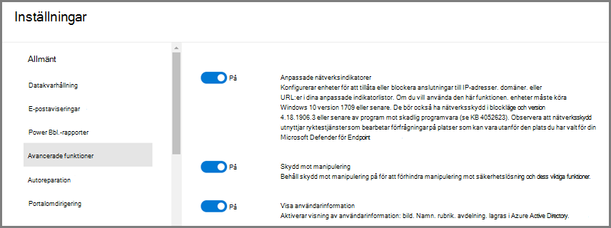
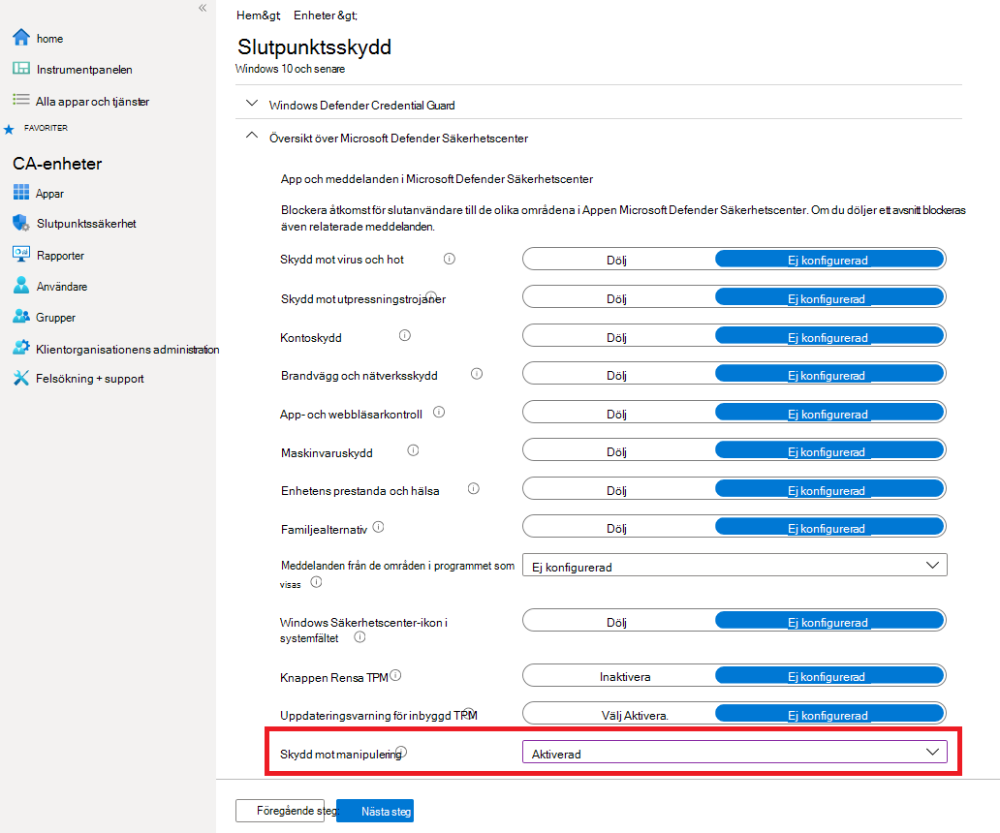
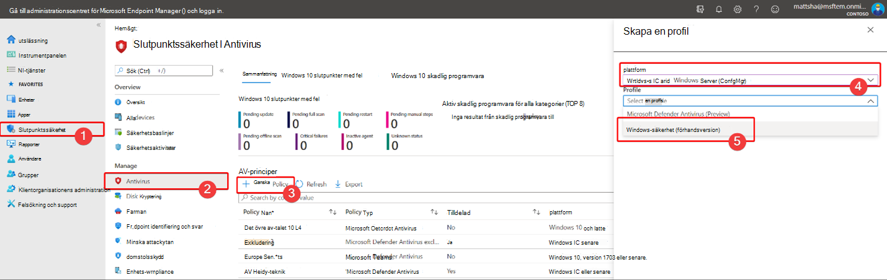
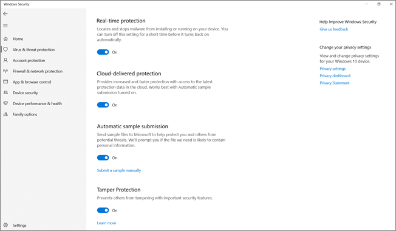
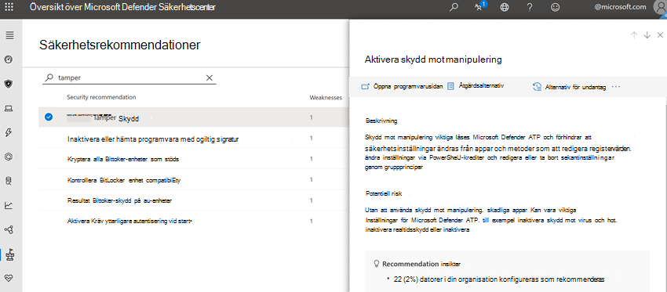

# Skydda säkerhetsinställningarna med manipuleringsskyddProtect security settings with tamper protection

[!INCLUDE [Microsoft 365 Defender rebranding](../../includes/microsoft-defender.md)]

**Gäller för:****Applies to:**

- [Microsoft Defender för EndpointMicrosoft Defender for Endpoint](/microsoft-365/security/defender-endpoint/)

Skydd mot manipulering är tillgängligt för enheter som kör någon av följande versioner Windows:Tamper protection is available for devices that are running one of the following versions of Windows:

- Windows 10Windows 10
- Windows Server 2019Windows Server 2019
- Windows Server, version 1803 eller senareWindows Server, version 1803 or later
- Windows Server 2016Windows Server 2016

## ÖversiktOverview

Under vissa typer av cyberattacker försöker dåliga aktör att inaktivera säkerhetsfunktioner, till exempel antivirusskydd, på dina datorer.During some kinds of cyber attacks, bad actors try to disable security features, such as anti-virus protection, on your machines. Dåliga aktör vill inaktivera dina säkerhetsfunktioner för att få enklare åtkomst till dina data, installera skadlig programvara eller på annat sätt utnyttja dina data, din identitet och dina enheter.Bad actors like to disable your security features to get easier access to your data, to install malware, or to otherwise exploit your data, identity, and devices. Skydd mot manipulering förhindrar att den här typen av saker uppstår.Tamper protection helps prevent these kinds of things from occurring.

Med skydd mot manipulering förhindras skadliga program från att vidta åtgärder som:With tamper protection, malicious apps are prevented from taking actions such as:

- Inaktivera skydd mot virus och hotDisabling virus and threat protection
- Inaktivera realtidsskyddDisabling real-time protection
- Stänga av beteendeövervakningTurning off behavior monitoring
- Inaktivera antivirus (till exempel IOfficeAntivirus (IOAV))Disabling antivirus (such as IOfficeAntivirus (IOAV))
- Inaktivera moln levererat skyddDisabling cloud-delivered protection
- Ta bort säkerhetsintelligensuppdateringarRemoving security intelligence updates

### Så här fungerar detHow it works

Skydd mot manipulering låser Microsoft Defender Antivirus och förhindrar att säkerhetsinställningarna ändras via appar och metoder som:Tamper protection essentially locks Microsoft Defender Antivirus and prevents your security settings from being changed through apps and methods such as:

- Konfigurera inställningar i Registereditorn på din Windows enhetConfiguring settings in Registry Editor on your Windows device
- Ändra inställningar med PowerShell-cmdletsChanging settings through PowerShell cmdlets
- Redigera eller ta bort säkerhetsinställningar via grupprinciperEditing or removing security settings through group policies

Skydd mot manipulering hindrar dig inte från att visa dina säkerhetsinställningar.Tamper protection doesn't prevent you from viewing your security settings. Skydd mot manipulering påverkar inte heller hur antivirusappar från tredje part registreras i Windows-säkerhet program.And, tamper protection doesn't affect how third-party antivirus apps register with the Windows Security app. Om din organisation använder e Windows 10 Enterprise E5 kan enskilda användare inte ändra inställningen för skydd mot manipulering. I så fall hanteras skydd mot manipulering av säkerhetsteamet.If your organization is using Windows 10 Enterprise E5, individual users can't change the tamper protection setting; in those cases, tamper protection is managed by your security team.

### Vad vill du göra?What do you want to do?

| När du ska utföra den här uppgiften ...To perform this task... | Se det här avsnittet...See this section... |
|:---|:---|
| Aktivera (eller inaktivera skydd mot manipulering) i Microsoft Defender SäkerhetscenterTurn tamper protection on (or off) in the Microsoft Defender Security Center 
Hantera skydd mot manipulering i hela klientorganisationenManage tamper protection across your tenant | [Hantera skydd mot manipulering för organisationen med hjälp av Microsoft Defender SäkerhetscenterManage tamper protection for your organization using the Microsoft Defender Security Center](#manage-tamper-protection-for-your-organization-using-the-microsoft-defender-security-center) |
| Aktivera (eller inaktivera skydd mot manipulering) för hela eller en del av organisationen med IntuneTurn tamper protection on (or off) for all or part of your organization using Intune 
Finjustera inställningar för manipuleringsskydd i organisationenFine-tune tamper protection settings in your organization | [Hantera skydd mot manipulering för din organisation med IntuneManage tamper protection for your organization using Intune](#manage-tamper-protection-for-your-organization-using-intune) |
| Aktivera (eller inaktivera) skydd mot manipulering för organisationen med KonfigurationshanterarenTurn tamper protection on (or off) for your organization with Configuration Manager | [Hantera skydd mot manipulering för organisationen med innehavar bifoga med Konfigurationshanteraren, version 2006Manage tamper protection for your organization using tenant attach with Configuration Manager, version 2006](#manage-tamper-protection-for-your-organization-with-configuration-manager-version-2006) |
| Aktivera (eller inaktivera) skydd mot manipulering för en enskild enhetTurn tamper protection on (or off) for an individual device | [Hantera skydd mot manipulering på en enskild enhetManage tamper protection on an individual device](#manage-tamper-protection-on-an-individual-device) |
| Visa information om manipuleringsförsök på enheterView details about tampering attempts on devices | [Visa information om försök till manipuleringView information about tampering attempts](#view-information-about-tampering-attempts) |
| Granska dina säkerhetsrekommendationerReview your security recommendations | [Granska säkerhetsrekommendationerReview security recommendations](#review-your-security-recommendations) |
| Granska listan med vanliga frågor och svarReview the list of frequently asked questions (FAQs) | [Bläddra i vanliga frågor och svarBrowse the FAQs](#view-information-about-tampering-attempts) |

Beroende på vilken metod eller vilket hanteringsverktyg du använder för att aktivera skydd mot manipulering kan det finnas ett beroende av KARTOR (moln levererat skydd).Depending on the method or management tool you use to enable Tamper protection, there may be a dependency on MAPS (cloud-delivered protection). 

Följande tabell innehåller information om metoder, verktyg och beroenden.The following table provides details on the methods, tools, and dependencies.

|     Så här aktiveras skydd mot manipuleringHow Tamper protection is enabled                                         |     Beroende på KARTOR (moln levererat skydd)Dependency on MAPS (cloud-delivered protection)    |
|------------------------------------------------------------------------------|--------------------------------------------------------|
|     Microsoft IntuneMicrosoft Intune                                                         |     NejNo                                                 |
| Microsoft Endpoint Configuration Manager + Klientorganisationens bifogaMicrosoft Endpoint Configuration Manager + Tenant Attach                     |     NejNo                                                 |
|     Microsoft Defender för Endpoint-portalen (securitycenter.microsoft.com)Microsoft Defender for Endpoint portal (securitycenter.microsoft.com)    |     JaYes                                                |
|     Microsoft 365 Defender-portalen (security.microsoft.com)Microsoft 365 Defender portal (security.microsoft.com)                   |     JaYes                                                |

## Hantera skydd mot manipulering för organisationen med hjälp av Microsoft Defender SäkerhetscenterManage tamper protection for your organization using the Microsoft Defender Security Center

Skydd mot manipulering kan aktiveras eller inaktiveras för klientorganisationen med hjälp av Microsoft Defender Säkerhetscenter ( [https://securitycenter.windows.com](https://securitycenter.windows.com) ).Tamper protection can be turned on or off for your tenant using the Microsoft Defender Security Center ([https://securitycenter.windows.com](https://securitycenter.windows.com)). Här är några saker att tänka på:Here are a few points to keep in mind:

- För närvarande är alternativet för att hantera skydd mot manipulering Microsoft Defender Säkerhetscenter skydd på som standard för nya distributioner.Currently, the option to manage tamper protection in the Microsoft Defender Security Center is on by default for new deployments. För befintliga distributioner är skydd av manipulering tillgängligt med möjlighet att välja att göra det här till standardmetod inom kort.For existing deployments, tamper protection is available on an opt-in basis, with plans to make this the default method in the near future. (Om du vill registrera dig väljer Microsoft Defender Säkerhetscenter i **Inställningar**  >  **Avancerade funktioner**  >  **Skydd mot manipulering**.)(To opt in, in the Microsoft Defender Security Center, choose **Settings** > **Advanced features** > **Tamper protection**.) 

- När du använder Microsoft Defender Säkerhetscenter för att hantera skydd mot manipulering behöver du inte använda Intune eller metoden för att bifoga klientorganisation.When you use the Microsoft Defender Security Center to manage tamper protection, you do not have to use Intune or the tenant attach method.

- När du hanterar skydd mot manipulering i Microsoft Defender Säkerhetscenter tillämpas inställningen på hela klientorganisationen och påverkar alla enheter som kör Windows 10, Windows Server 2016 eller Windows Server 2019.When you manage tamper protection in the Microsoft Defender Security Center, the setting is applied tenant wide, affecting all of your devices that are running Windows 10, Windows Server 2016, or Windows Server 2019. Om du vill finjustera skydd mot manipulering (t.ex. om du har skydd mot manipulering på vissa enheter men inaktiverat för andra) använder du [antingen Intune](#manage-tamper-protection-for-your-organization-using-intune) eller [Konfigurationshanteraren med klientorganisationens bifoga](#manage-tamper-protection-for-your-organization-with-configuration-manager-version-2006).To fine-tune tamper protection (such as having tamper protection on for some devices but off for others), use either [Intune](#manage-tamper-protection-for-your-organization-using-intune) or [Configuration Manager with tenant attach](#manage-tamper-protection-for-your-organization-with-configuration-manager-version-2006).

- Om du har en hybridmiljö har inställningar för skydd mot manipulering i Intune företräde framför inställningar som konfigurerats i Microsoft Defender Säkerhetscenter.If you have a hybrid environment, tamper protection settings configured in Intune take precedence over settings configured in the Microsoft Defender Security Center. 

### Krav för hantering av skydd mot manipulering i Microsoft Defender SäkerhetscenterRequirements for managing tamper protection in the Microsoft Defender Security Center

- Du måste ha rätt [behörighet,](/microsoft-365/security/defender-endpoint/assign-portal-access)till exempel global administratör, säkerhetsadministratör eller säkerhetsåtgärder.You must have appropriate [permissions](/microsoft-365/security/defender-endpoint/assign-portal-access), such as global admin, security admin, or security operations.

- Dina Windows-enheter måste köra någon av följande versioner av Windows:Your Windows devices must be running one of the following versions of Windows:
   - Windows 10Windows 10
   - [Windows Server 2019Windows Server 2019](/windows-server/get-started-19/whats-new-19)
   - Windows Server, version [1803](/windows/release-health/status-windows-10-1803) eller senareWindows Server, version [1803](/windows/release-health/status-windows-10-1803) or later
   - [Windows Server 2016Windows Server 2016](/windows-server/get-started/whats-new-in-windows-server-2016)
   - Mer information om versioner finns i Windows 10 [versionsinformation.](/windows/release-health/release-information)For more information about releases, see [Windows 10 release information](/windows/release-health/release-information).

- Dina enheter måste vara [onboarded to Microsoft Defender för Endpoint.](/microsoft-365/security/defender-endpoint/onboarding)Your devices must be [onboarded to Microsoft Defender for Endpoint](/microsoft-365/security/defender-endpoint/onboarding).

- Enheterna måste använda plattform mot skadlig programvara version 4.18.2010.7 (eller senare) och motor med skadlig programvara version 1.1.17600.5 (eller senare).Your devices must be using anti-malware platform version 4.18.2010.7 (or above) and anti-malware engine version 1.1.17600.5 (or above). ([Hantera Microsoft Defender Antivirus uppdateringar och använda baslinjer](manage-updates-baselines-microsoft-defender-antivirus.md).)([Manage Microsoft Defender Antivirus updates and apply baselines](manage-updates-baselines-microsoft-defender-antivirus.md).)

- [Moln levererat skydd](enable-cloud-protection-microsoft-defender-antivirus.md) måste vara aktiverat.[Cloud-delivered protection](enable-cloud-protection-microsoft-defender-antivirus.md) must be turned on.

### Aktivera (eller inaktivera skydd mot manipulering) i Microsoft Defender SäkerhetscenterTurn tamper protection on (or off) in the Microsoft Defender Security Center 

1. Gå till Microsoft Defender Säkerhetscenter ( [https://securitycenter.windows.com](https://securitycenter.windows.com) ) och logga in.Go to the Microsoft Defender Security Center ([https://securitycenter.windows.com](https://securitycenter.windows.com)) and sign in.

2. Välj **Inställningar**.Choose **Settings**.

3. Gå till **Allmänna**  >  **avancerade funktioner** och aktivera sedan skydd mot manipulering.Go to **General** > **Advanced features**, and then turn tamper protection on.

## Hantera skydd mot manipulering för din organisation med IntuneManage tamper protection for your organization using Intune

Om du är en del av organisationens säkerhetsteam och prenumerationen omfattar [Intune](/intune/fundamentals/what-is-intune)kan du aktivera (eller inaktivera) skydd mot manipulering för organisationen i [Microsoft Endpoint Manager administrationscenter-portalen.](https://endpoint.microsoft.com)If you are part of your organization's security team, and your subscription includes [Intune](/intune/fundamentals/what-is-intune), you can turn tamper protection on (or off) for your organization in the [Microsoft Endpoint Manager admin center](https://endpoint.microsoft.com) portal. Använd Intune när du vill finjustera inställningarna för skydd mot manipulering.Use Intune when you want to fine-tune tamper protection settings. Om du till exempel vill aktivera skydd mot manipulering på vissa enheter, men inte alla, använder du Intune.For example, if you want to enable tamper protection on some devices, but not all, use Intune.

### Krav för hantering av skydd mot manipulering i IntuneRequirements for managing tamper protection in Intune

- Du måste ha rätt [behörighet,](/microsoft-365/security/defender-endpoint/assign-portal-access)till exempel global administratör, säkerhetsadministratör eller säkerhetsåtgärder.You must have appropriate [permissions](/microsoft-365/security/defender-endpoint/assign-portal-access), such as global admin, security admin, or security operations.

- Din organisation använder [Intune för att hantera enheter](/intune/fundamentals/what-is-device-management).Your organization uses [Intune to manage devices](/intune/fundamentals/what-is-device-management). ([Intune-licenser](/intune/fundamentals/licenses) krävs; Intune ingår i Microsoft 365 E5.)([Intune licenses](/intune/fundamentals/licenses) are required; Intune is included in Microsoft 365 E5.)

- Dina Windows-enheter måste köra Windows 10 OS [1709,](/windows/release-health/status-windows-10-1709) [1803,](/windows/release-health/status-windows-10-1803) [1809](/windows/release-health/status-windows-10-1809-and-windows-server-2019) eller senare.Your Windows devices must be running Windows 10 OS [1709](/windows/release-health/status-windows-10-1709), [1803](/windows/release-health/status-windows-10-1803), [1809](/windows/release-health/status-windows-10-1809-and-windows-server-2019) or later. (Mer information om versioner finns i Windows 10 [versionsinformation](/windows/release-health/release-information).)(For more information about releases, see [Windows 10 release information](/windows/release-health/release-information).)

- Du måste använda Windows med [säkerhetsinformation](https://www.microsoft.com/wdsi/definitions) som uppdaterats till version 1.287.60.0 (eller senare).You must be using Windows security with [security intelligence](https://www.microsoft.com/wdsi/definitions) updated to version 1.287.60.0 (or above).

- Enheterna måste använda plattform mot skadlig programvara version 4.18.1906.3 (eller senare) och motor med skadlig programvara version 1.1.15500.X (eller senare).Your devices must be using anti-malware platform version 4.18.1906.3 (or above) and anti-malware engine version 1.1.15500.X (or above). ([Hantera Microsoft Defender Antivirus uppdateringar och använda baslinjer](manage-updates-baselines-microsoft-defender-antivirus.md).)([Manage Microsoft Defender Antivirus updates and apply baselines](manage-updates-baselines-microsoft-defender-antivirus.md).)

### Aktivera (eller inaktivera skydd mot manipulering) i IntuneTurn tamper protection on (or off) in Intune

1. Gå till [Microsoft Endpoint Manager och logga](https://endpoint.microsoft.com) in med ditt arbets- eller skolkonto.Go to the [Microsoft Endpoint Manager admin center](https://endpoint.microsoft.com) and sign in with your work or school account.

2. Välj   >  **Konfigurationsprofiler för enheter**.Select **Devices** > **Configuration Profiles**.

3. Skapa en profil som innehåller följande inställningar:Create a profile that includes the following settings:
    - **Plattform: Windows 10 och senare****Platform: Windows 10 and later**
    - **Profiltyp: Slutpunktsskydd****Profile type: Endpoint protection**
    - **Kategori: Microsoft Defender Säkerhetscenter****Category: Microsoft Defender Security Center**
    - **Skydd mot manipulering: aktiverat****Tamper Protection: Enabled**

4. Tilldela profilen till en eller flera grupper.Assign the profile to one or more groups.

### Använder du WINDOWS OS 1709, 1803 eller 1809?Are you using Windows OS 1709, 1803, or 1809?

Om du använder Windows 10 OS [1709,](/windows/release-health/status-windows-10-1709) [1803](/windows/release-health/status-windows-10-1803)eller [1809](/windows/release-health/status-windows-10-1809-and-windows-server-2019)visas  inte Skydd mot manipulering i Windows-säkerhet program.If you are using Windows 10 OS [1709](/windows/release-health/status-windows-10-1709), [1803](/windows/release-health/status-windows-10-1803), or [1809](/windows/release-health/status-windows-10-1809-and-windows-server-2019), you won't see **Tamper Protection** in the Windows Security app. I stället kan du använda PowerShell för att avgöra om skydd mot manipulering är aktiverat.Instead, you can use PowerShell to determine whether tamper protection is enabled.

#### Använda PowerShell för att avgöra om skydd mot manipulering är aktiveratUse PowerShell to determine whether tamper protection is turned on

1. Öppna Windows PowerShell appen.Open the Windows PowerShell app.

2. Använd [PowerShell-cmdleten Get-MpComputerStatus.](/powershell/module/defender/get-mpcomputerstatus?preserve-view=true&view=win10-ps)Use the [Get-MpComputerStatus](/powershell/module/defender/get-mpcomputerstatus?preserve-view=true&view=win10-ps) PowerShell cmdlet.

3. Leta efter i `IsTamperProtected` resultatlistan.In the list of results, look for `IsTamperProtected`. (Värdet sant innebär *att* skydd mot manipulering har aktiverats.)(A value of *true* means tamper protection is enabled.)

## Hantera skydd mot manipulering för organisationen med Konfigurationshanteraren, version 2006Manage tamper protection for your organization with Configuration Manager, version 2006

Om du använder [version 2006](/mem/configmgr/core/plan-design/changes/whats-new-in-version-2006)av Konfigurationshanteraren kan du hantera inställningar för skydd mot manipulering i Windows 10, Windows Server 2016 och Windows Server 2019 med en metod som kallas *klientorganisations* bifoga.If you're using [version 2006 of Configuration Manager](/mem/configmgr/core/plan-design/changes/whats-new-in-version-2006), you can manage tamper protection settings on Windows 10, Windows Server 2016, and Windows Server 2019 by using a method called *tenant attach*. Med Klientorganisationens fästa kan du synkronisera dina enheter med Konfigurationshanteraren för lokala enheter till administrationscentret i Microsoft Endpoint Manager och sedan leverera principer för slutpunktssäkerhetskonfiguration till lokala samlingar & enheter.Tenant attach enables you to sync your on-premises-only Configuration Manager devices into the Microsoft Endpoint Manager admin center, and then deliver endpoint security configuration policies to on-premises collections & devices.

> [!NOTE]
> Proceduren kan användas för att utöka skydd mot manipulering till enheter med Windows 10 och Windows Server 2019.The procedure can be used to extend tamper protection to devices running Windows 10 and Windows Server 2019. Kontrollera att du behöver granska förutsättningarna och annan information i resurserna som nämns i den här proceduren.Make sure to review the prerequisites and other information in the resources mentioned in this procedure.

1. Konfigurera klientorganisations bifoga.Set up tenant attach. Om du behöver hjälp med detta kan [Microsoft Endpoint Manager klientorganisationen bifoga: Enhetsynkronisering och enhetsåtgärder](/mem/configmgr/tenant-attach/device-sync-actions).To get help with this, see [Microsoft Endpoint Manager tenant attach: Device sync and device actions](/mem/configmgr/tenant-attach/device-sync-actions).

2. Gå till [Microsoft Endpoint Manager Säkerhetsantivirusprogram](https://go.microsoft.com/fwlink/?linkid=2109431)för **slutpunkt i administrationscentret** och välj sedan + Skapa  >   **princip.**In the [Microsoft Endpoint Manager admin center](https://go.microsoft.com/fwlink/?linkid=2109431), go to **Endpoint security** > **Antivirus**, and then choose **+ Create Policy**.  
   - I listan **Plattform** väljer du **Windows 10 och Windows Server (ConfigMgr)**.In the **Platform** list, select **Windows 10 and Windows Server (ConfigMgr)**.  
   - I **profillistan** väljer du Windows-säkerhet **upplevelse (förhandsversion)**.In the **Profile** list, select **Windows Security experience (preview)**.  

3. Distribuera principen till din enhetssamling.Deploy the policy to your device collection.

### Behöver du hjälp med den här metoden?Need help with this method? 

Se följande resurser:See the following resources:

- [Inställningar för Windows-säkerhet-upplevelsen i Microsoft IntuneSettings for the Windows Security experience profile in Microsoft Intune](/mem/intune/protect/antivirus-security-experience-windows-settings)
- [Tech Community-blogg: Vi presenterar skydd mot manipulering för Configuration Manager-klientorganisationens bifogar klienterTech Community Blog: Announcing Tamper Protection for Configuration Manager Tenant Attach clients](https://techcommunity.microsoft.com/t5/microsoft-endpoint-manager-blog/announcing-tamper-protection-for-configuration-manager-tenant/ba-p/1700246#.X3QLR5Ziqq8.linkedin)

## Hantera skydd mot manipulering på en enskild enhetManage tamper protection on an individual device

> [!NOTE]
> Skydd mot manipulering blockerar försök Microsoft Defender Antivirus ändra inställningarna via registret.Tamper protection blocks attempts to modify Microsoft Defender Antivirus settings through the registry.
>
> Om du vill se till att skydd mot manipulering inte stör säkerhetsprodukter från tredje part  eller företagsinstallationsskript som ändrar de här inställningarna går du till **Windows-säkerhet** och uppdaterar Säkerhetsinformation till version 1.287.60.0 eller senare.To help ensure that tamper protection doesn’t interfere with third-party security products or enterprise installation scripts that modify these settings, go to **Windows Security** and update **Security intelligence** to version 1.287.60.0 or later. (Se [Säkerhetsintelligensuppdateringar](https://www.microsoft.com/wdsi/definitions).)(See [Security intelligence updates](https://www.microsoft.com/wdsi/definitions).)
>
> När du har gjort den här uppdateringen fortsätter skydd mot manipulering att skydda dina registerinställningar och loggar försöker ändra dem utan att returnera fel.Once you’ve made this update, tamper protection continues to protect your registry settings, and logs attempts to modify them without returning errors.

Om du är hemanvändare, eller om du inte omfattas av inställningar som hanteras av ett säkerhetsteam, kan du använda Windows-säkerhet-appen för att hantera skydd mot manipulering.If you are a home user, or you are not subject to settings managed by a security team, you can use the Windows Security app to manage tamper protection. Du måste ha rätt administratörsbehörighet på enheten för att ändra säkerhetsinställningarna, till exempel skydd mot manipulering.You must have appropriate admin permissions on your device to do change security settings, such as tamper protection.

Det här är vad som visas i Windows-säkerhet appen:Here's what you see in the Windows Security app:

1. Välj **Start** och börja skriva *Säkerhet.*Select **Start**, and start typing *Security*. I sökresultatet väljer du **Windows-säkerhet**.In the search results, select **Windows Security**.

2. Välj **Virus & skydd mot hot**& för skydd mot  >  **hot**.Select **Virus & threat protection** > **Virus & threat protection settings**.

3. Ställ **in Skydd mot manipulering** på **På** eller **Av.**Set **Tamper Protection** to **On** or **Off**.

## Visa information om försök till manipuleringView information about tampering attempts

Manipuleringsförsök indikerar vanligtvis större cyberattacker.Tampering attempts typically indicate bigger cyberattacks. Bad actors try to change security settings as a way to persist and stay undetected.Bad actors try to change security settings as a way to persist and stay undetected. Om du är en del av organisationens säkerhetsteam kan du visa information om sådana försök och sedan vidta lämpliga åtgärder för att minimera hot.If you're part of your organization's security team, you can view information about such attempts, and then take appropriate actions to mitigate threats.

När ett manipuleringsförsök upptäcks avhöjs en avisering i [Microsoft Defender Säkerhetscenter](/microsoft-365/security/defender-endpoint/portal-overview) ( [https://securitycenter.windows.com](https://securitycenter.windows.com) ).When a tampering attempt is detected, an alert is raised in the [Microsoft Defender Security Center](/microsoft-365/security/defender-endpoint/portal-overview) ([https://securitycenter.windows.com](https://securitycenter.windows.com)).

Med [identifiering och åtgärd på slutpunkt](/microsoft-365/security/defender-endpoint/overview-endpoint-detection-response) och [avancerade](/microsoft-365/security/defender-endpoint/advanced-hunting-overview) sökfunktioner i Microsoft Defender för Endpoint kan ditt säkerhetsteam undersöka och åtgärda sådana försök.Using [endpoint detection and response](/microsoft-365/security/defender-endpoint/overview-endpoint-detection-response) and [advanced hunting](/microsoft-365/security/defender-endpoint/advanced-hunting-overview) capabilities in Microsoft Defender for Endpoint, your security operations team can investigate and address such attempts.

## Granska dina säkerhetsrekommendationerReview your security recommendations

Skydd mot manipulering [integreras & funktioner för sårbarhetshantering.](/microsoft-365/security/defender-endpoint/next-gen-threat-and-vuln-mgt)Tamper protection integrates with [Threat & Vulnerability Management](/microsoft-365/security/defender-endpoint/next-gen-threat-and-vuln-mgt) capabilities. [Bland säkerhetsrekommendationerna](/microsoft-365/security/defender-endpoint/tvm-security-recommendation) finns att se till att skydd mot manipulering är aktiverat.[Security recommendations](/microsoft-365/security/defender-endpoint/tvm-security-recommendation) include making sure tamper protection is turned on. Du kan till exempel söka efter *manipulering,* så som visas i följande bild:For example, you can search on *tamper*, as shown in the following image:

I resultatet kan du välja Aktivera skydd **mot manipulering om** du vill veta mer och aktivera det.In the results, you can select **Turn on Tamper Protection** to learn more and turn it on.

Mer information om hur du & säkerhetshantering finns i [& säkerhetshantering i Microsoft Defender Säkerhetscenter.](/microsoft-365/security/defender-endpoint/tvm-dashboard-insights#threat--vulnerability-management-in-microsoft-defender-security-center)To learn more about Threat & Vulnerability Management, see [Threat & Vulnerability Management in Microsoft Defender Security Center](/microsoft-365/security/defender-endpoint/tvm-dashboard-insights#threat--vulnerability-management-in-microsoft-defender-security-center).

## Vanliga frågor och svarFrequently asked questions

### För vilka Windows OS-versioner gäller skydd mot manipulering?To which Windows OS versions is configuring tamper protection is applicable?

Windows 10 OS [1709,](/windows/release-health/status-windows-10-1709) [1803,](/windows/release-health/status-windows-10-1803) [1809](/windows/release-health/status-windows-10-1809-and-windows-server-2019)eller senare tillsammans med [Microsoft Defender för Slutpunkt.](/microsoft-365/security/defender-endpoint)Windows 10 OS [1709](/windows/release-health/status-windows-10-1709), [1803](/windows/release-health/status-windows-10-1803), [1809](/windows/release-health/status-windows-10-1809-and-windows-server-2019), or later together with [Microsoft Defender for Endpoint](/microsoft-365/security/defender-endpoint).

Om du använder Konfigurationshanteraren, version 2006, med innehavar bifoga kan skydd mot manipulering utökas till Windows Server 2019.If you are using Configuration Manager, version 2006, with tenant attach, tamper protection can be extended to Windows Server 2019. Se [Klientorganisationens ansluta: Skapa och distribuera säkerhetsprincip för slutpunkt Antivirus från administrationscentret (förhandsversion)](/mem/configmgr/tenant-attach/deploy-antivirus-policy).See [Tenant attach: Create and deploy endpoint security Antivirus policy from the admin center (preview)](/mem/configmgr/tenant-attach/deploy-antivirus-policy).

### Kommer skydd mot manipulering att påverka antivirusregistrering från tredje part?Will tamper protection have any impact on third-party antivirus registration?

Nej.No. Antiviruserbjudanden från tredje part fortsätter att registrera sig i Windows-säkerhet program.Third-party antivirus offerings will continue to register with the Windows Security application.

### Vad händer om Microsoft Defender Antivirus inte är aktiv på en enhet?What happens if Microsoft Defender Antivirus is not active on a device?

Enheter som är onboarded to Microsoft Defender för Endpoint kommer att Microsoft Defender Antivirus i passiv form.Devices that are onboarded to Microsoft Defender for Endpoint will have Microsoft Defender Antivirus running in passive mode. Skydd mot manipulering fortsätter att skydda tjänsten och dess funktioner.Tamper protection will continue to protect the service and its features. 

### Hur kan jag aktivera/inaktivera skydd mot manipulering?How can I turn tamper protection on/off?

Om du är hemanvändare kan du gå till [Hantera skydd mot manipulering på en enskild enhet](#manage-tamper-protection-on-an-individual-device).If you are a home user, see [Manage tamper protection on an individual device](#manage-tamper-protection-on-an-individual-device).

Om du är en organisation som använder [Microsoft Defender](/microsoft-365/security/defender-endpoint)för Endpoint bör du kunna hantera skydd mot manipulering i Intune på liknande sätt som du hanterar andra funktioner för slutpunktsskydd.If you are an organization using [Microsoft Defender for Endpoint](/microsoft-365/security/defender-endpoint), you should be able to manage tamper protection in Intune similar to how you manage other endpoint protection features. Se följande avsnitt i den här artikeln:See the following sections of this article: 

- [Hantera skydd mot manipulering med IntuneManage tamper protection using Intune](#manage-tamper-protection-for-your-organization-using-intune)
- [Hantera skydd mot manipulering med Konfigurationshanteraren, version 2006Manage tamper protection using Configuration Manager, version 2006](#manage-tamper-protection-for-your-organization-with-configuration-manager-version-2006)
- [Hantera skydd mot manipulering med Microsoft Defender Säkerhetscenter](#manage-tamper-protection-for-your-organization-using-the-microsoft-defender-security-center) (för närvarande i förhandsgranskning)[Manage tamper protection using the Microsoft Defender Security Center](#manage-tamper-protection-for-your-organization-using-the-microsoft-defender-security-center) (currently in preview)

### Hur påverkar konfigureringsskyddet i Intune hur jag hanterar Microsoft Defender Antivirus via min grupprincip?How does configuring tamper protection in Intune affect how I manage Microsoft Defender Antivirus through my group policy?

Din vanliga grupprincip gäller inte skydd mot manipulering, och ändringar i Microsoft Defender Antivirus ignoreras när skydd mot manipulering är på.Your regular group policy doesn’t apply to tamper protection, and changes to Microsoft Defender Antivirus settings are ignored when tamper protection is on. 

### Konfigurerar du skydd mot manipulering i Intune enbart för hela organisationen för Microsoft Defender för Endpoint?For Microsoft Defender for Endpoint, is configuring tamper protection in Intune targeted to the entire organization only?

Konfigurering av skydd mot manipulering i Intune eller Microsoft Endpoint Manager kan riktas till hela organisationen och till specifika enheter och användargrupper.Configuring tamper protection in Intune or Microsoft Endpoint Manager can be targeted to your entire organization and to specific devices and user groups.

### Kan jag konfigurera skydd mot manipulering i Microsoft Endpoint Configuration Manager?Can I configure Tamper Protection in Microsoft Endpoint Configuration Manager?

Om du använder klientorganisationens bifoga kan du använda Microsoft Endpoint Configuration Manager.If you are using tenant attach, you can use Microsoft Endpoint Configuration Manager. Se följande resurser:See the following resources:
- [Hantera skydd mot manipulering för organisationen med Konfigurationshanteraren, version 2006Manage tamper protection for your organization with Configuration Manager, version 2006](#manage-tamper-protection-for-your-organization-with-configuration-manager-version-2006)
- [Tech Community-blogg: Vi presenterar skydd mot manipulering för Klientorganisationens Konfigurationshanteraren-klientorganisationens klienterTech Community blog: Announcing Tamper Protection for Configuration Manager Tenant Attach clients](https://techcommunity.microsoft.com/t5/microsoft-endpoint-manager-blog/announcing-tamper-protection-for-configuration-manager-tenant/ba-p/1700246#.X3QLR5Ziqq8.linkedin)

### Jag har den Windows E3-registrering.I have the Windows E3 enrollment. Kan jag använda konfigurerar skydd mot manipulering i Intune?Can I use configuring tamper protection in Intune?

För närvarande är konfigurering av skydd mot manipulering i Intune bara tillgängligt för kunder som har [Microsoft Defender för slutpunkt.](/microsoft-365/security/defender-endpoint)Currently, configuring tamper protection in Intune is only available for customers who have [Microsoft Defender for Endpoint](/microsoft-365/security/defender-endpoint).

### Vad händer om jag försöker ändra Microsoft Defender för slutpunktsinställningar i Intune, Microsoft Endpoint Configuration Manager och Windows Management Instrumentation när Manipuleringsskydd har aktiverats på en enhet?What happens if I try to change Microsoft Defender for Endpoint settings in Intune, Microsoft Endpoint Configuration Manager, and Windows Management Instrumentation when Tamper Protection is enabled on a device?

Du kan inte ändra de funktioner som skyddas genom skydd mot manipulering. sådana ändringsförfrågningar ignoreras.You won’t be able to change the features that are protected by tamper protection; such change requests are ignored.

### Jag är företagskund.I’m an enterprise customer. Kan lokala administratörer ändra skydd mot manipulering på sina enheter?Can local admins change tamper protection on their devices?

Nej.No. Lokala administratörer kan inte ändra inställningarna för skydd mot manipulering eller ändringar.Local admins cannot change or modify tamper protection settings.

### Vad händer om min enhet är inbyggd i Microsoft Defender för Endpoint och sedan hamnar i en status som inte är ombord?What happens if my device is onboarded with Microsoft Defender for Endpoint and then goes into an off-boarded state?

Om en enhet är avstängd från Microsoft Defender för Endpoint aktiveras skydd mot manipulering, vilket är standardinställningen för ohanterade enheter.If a device is off-boarded from Microsoft Defender for Endpoint, tamper protection is turned on, which is the default state for unmanaged devices. 

### Kommer det att finnas en varning om att status för manipuleringsskydd ändras i Microsoft Defender Säkerhetscenter?Will there be an alert about tamper protection status changing in the Microsoft Defender Security Center?

Ja.Yes. Aviseringen visas [https://securitycenter.microsoft.com](https://securitycenter.microsoft.com) under **Aviseringar**.The alert is shown in [https://securitycenter.microsoft.com](https://securitycenter.microsoft.com) under **Alerts**.

Ditt säkerhetsteam kan också använda sökfrågor, till exempel följande exempel:Your security operations team can also use hunting queries, such as the following example:

`DeviceAlertEvents | where Title == "Tamper Protection bypass"`

[Visa information om manipuleringsförsök](#view-information-about-tampering-attempts).[View information about tampering attempts](#view-information-about-tampering-attempts).

## Se ävenSee also

[Skydda Windows datorer med Endpoint Protection för Microsoft IntuneHelp secure Windows PCs with Endpoint Protection for Microsoft Intune](/intune/help-secure-windows-pcs-with-endpoint-protection-for-microsoft-intune)

[Få en översikt över Microsoft Defender för EndpointGet an overview of Microsoft Defender for Endpoint](/microsoft-365/security/defender-endpoint)

[Bättre tillsammans: Microsoft Defender Antivirus och Microsoft Defender för EndpointBetter together: Microsoft Defender Antivirus and Microsoft Defender for Endpoint](why-use-microsoft-defender-antivirus.md)