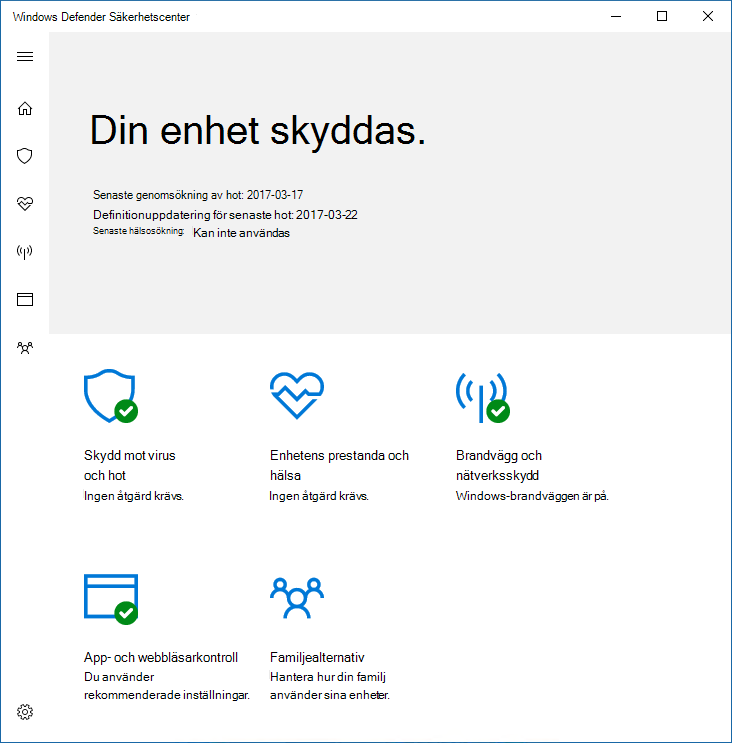

# Hindra användare från att se eller interagera med användargränssnittet i Microsoft Defender Antivirus

[!INCLUDE [Microsoft 365 Defender rebranding](../../includes/microsoft-defender.md)]

**Gäller för:**

- [Microsoft Defender för Endpoint](/microsoft-365/security/defender-endpoint/)

Du kan använda grupprinciper för att hindra användare på slutpunkter från att se Microsoft Defender Antivirus-gränssnittet. Du kan också förhindra att genomsökningar pausas.

## Dölja Antivirusgränssnittet i Microsoft Defender

Om du döljer gränssnittet i Windows 10 version 1703 döljs meddelanden från Microsoft Defender Antivirus och skyddspanelen för Virus & förhindras från att visas i Windows-säkerhetsappen.

Med inställningen **aktiverad:**

Med inställningen inställd på **Inaktiverad** eller ej konfigurerad:

>[!NOTE]
>Om du döljer gränssnittet förhindrar du också att meddelanden från Microsoft Defender Antivirus visas på slutpunkten. Microsoft Defender för slutpunktsmeddelanden visas fortfarande. Du kan också [individuellt konfigurera meddelanden som visas på slutpunkter](configure-notifications-microsoft-defender-antivirus.md)

I tidigare versioner av Windows 10 döljs Windows Defender-klientgränssnittet vid inställningen. Om användaren försöker öppna den får de ett varningsmeddelande där det står "Systemadministratören har begränsad åtkomst till den här appen".

## Använda grupprinciper för att dölja Microsoft Defender AV-gränssnittet för användare

1. På hanteringsdatorn för grupprinciper öppnar du [Konsolen](/previous-versions/windows/desktop/gpmc/group-policy-management-console-portal)för grupprinciphantering, högerklickar på det grupprincipobjekt du vill konfigurera och klickar på **Redigera.**

2. Med **grupprinciphanteringsredigeraren går** du till **Datorkonfiguration**.

3. Klicka **på Administrativa mallar**.

4. Expandera trädet till **Windows-komponenter > Microsoft Defender Antivirus> klientgränssnittet**.

5. Dubbelklicka på inställningen Aktivera **huvudlöst gränssnittsläge** och ange alternativet **Aktiverad**. Klicka på **OK**. 

Mer [information om hur du hindrar användare från att](configure-local-policy-overrides-microsoft-defender-antivirus.md) ändra skydd på datorer finns i Hindra användare från att ändra principinställningar lokalt.

## Hindra användare från att pausa en genomsökning

Du kan förhindra att användare pausar genomsökningar, vilket kan vara användbart för att säkerställa att schemalagda eller on-demand-sökningar inte avbryts av användarna.

> [!NOTE]
> Den här inställningen stöds inte i Windows 10.

### Använda grupprinciper för att hindra användare från att pausa en genomsökning

1. På hanteringsdatorn för grupprinciper öppnar du [Konsolen](/previous-versions/windows/desktop/gpmc/group-policy-management-console-portal)för grupprinciphantering, högerklickar på det grupprincipobjekt du vill konfigurera och klickar på **Redigera.**

2. Med **grupprinciphanteringsredigeraren går** du till **Datorkonfiguration**.

3. Klicka **på Administrativa mallar**.

4. Expandera trädet till **Windows-komponenterna**  >  **Microsoft Defender Antivirus**  >  **Scan**.

5. Dubbelklicka på inställningen Tillåt **användare att pausa genomsökning** och ange alternativet **Inaktiverad**. Klicka på **OK**. 

## Relaterade artiklar

- [Konfigurera meddelanden som visas på slutpunkter](configure-notifications-microsoft-defender-antivirus.md)

- [Konfigurera interaktion med slutanvändare med Microsoft Defender Antivirus](configure-end-user-interaction-microsoft-defender-antivirus.md)

- [Microsoft Defender Antivirus i Windows 10](microsoft-defender-antivirus-in-windows-10.md)