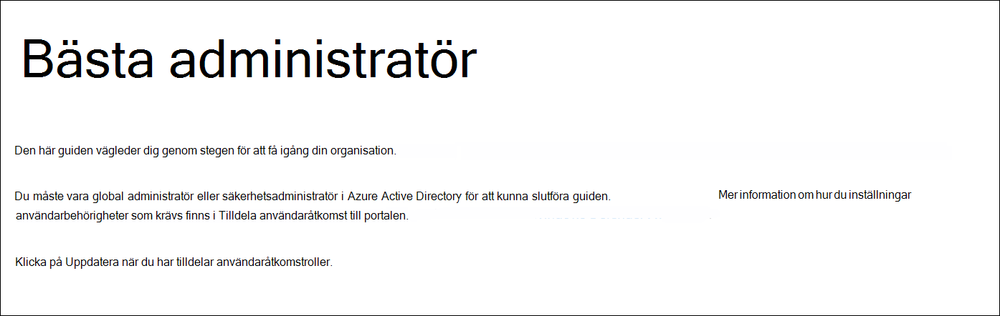
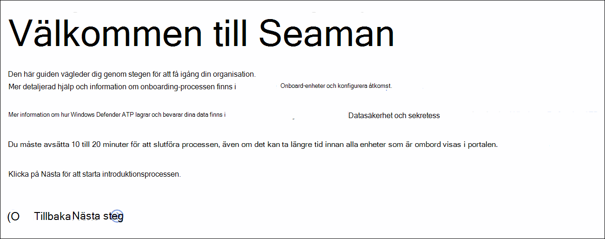
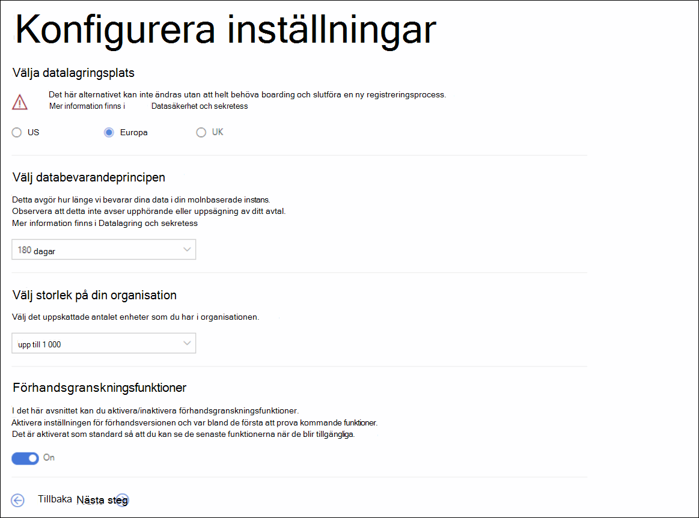
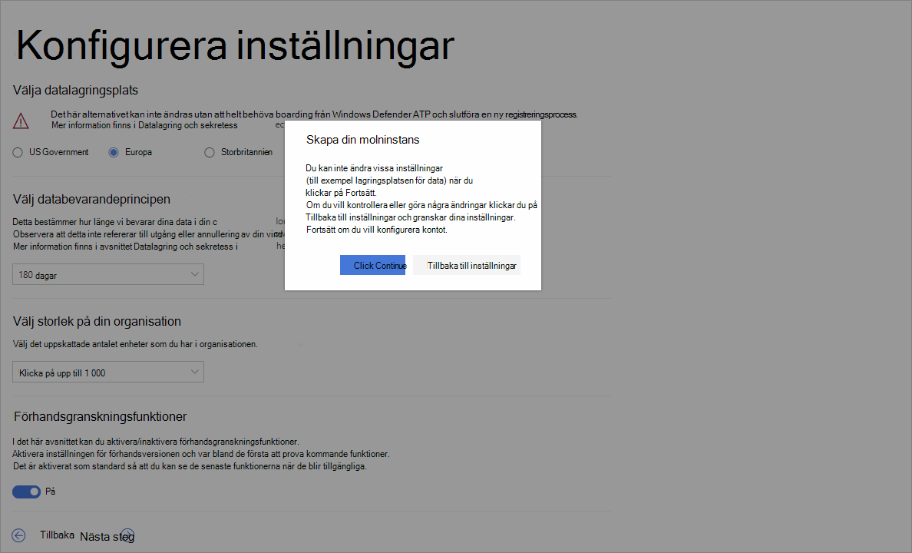

# <a name="set-up-microsoft-defender-for-endpoint-deployment"></a><span data-ttu-id="8c208-104">Konfigurera Microsoft Defender för distribution av Slutpunkt</span><span class="sxs-lookup"><span data-stu-id="8c208-104">Set up Microsoft Defender for Endpoint deployment</span></span>

[!INCLUDE [Microsoft 365 Defender rebranding](../../includes/microsoft-defender.md)]


<span data-ttu-id="8c208-105">**Gäller för:**</span><span class="sxs-lookup"><span data-stu-id="8c208-105">**Applies to:**</span></span>
- [<span data-ttu-id="8c208-106">Microsoft Defender för Endpoint</span><span class="sxs-lookup"><span data-stu-id="8c208-106">Microsoft Defender for Endpoint</span></span>](https://go.microsoft.com/fwlink/p/?linkid=2146631)
- [<span data-ttu-id="8c208-107">Microsoft 365 Defender</span><span class="sxs-lookup"><span data-stu-id="8c208-107">Microsoft 365 Defender</span></span>](https://go.microsoft.com/fwlink/?linkid=2118804)

> <span data-ttu-id="8c208-108">Vill du uppleva Microsoft Defender för Slutpunkt?</span><span class="sxs-lookup"><span data-stu-id="8c208-108">Want to experience Microsoft Defender for Endpoint?</span></span> [<span data-ttu-id="8c208-109">Registrera dig för en kostnadsfri utvärderingsversion.</span><span class="sxs-lookup"><span data-stu-id="8c208-109">Sign up for a free trial.</span></span>](https://www.microsoft.com/microsoft-365/windows/microsoft-defender-atp?ocid=docs-wdatp-exposedapis-abovefoldlink)

<span data-ttu-id="8c208-110">Distribution av Defender för Endpoint är en process i tre steg:</span><span class="sxs-lookup"><span data-stu-id="8c208-110">Deploying Defender for Endpoint is a three-phase process:</span></span>

| <span data-ttu-id="8c208-111">[](prepare-deployment.md)</span><span class="sxs-lookup"><span data-stu-id="8c208-111">[](prepare-deployment.md)</span></span><br>[<span data-ttu-id="8c208-112">Fas 1: Förbereda</span><span class="sxs-lookup"><span data-stu-id="8c208-112">Phase 1: Prepare</span></span>](prepare-deployment.md) | <br><span data-ttu-id="8c208-114">Fas 2: Konfigurera</span><span class="sxs-lookup"><span data-stu-id="8c208-114">Phase 2: Setup</span></span> | <span data-ttu-id="8c208-115">[](onboarding.md)</span><span class="sxs-lookup"><span data-stu-id="8c208-115">[](onboarding.md)</span></span><br>[<span data-ttu-id="8c208-116">Fas 3: Introduktion</span><span class="sxs-lookup"><span data-stu-id="8c208-116">Phase 3: Onboard</span></span>](onboarding.md) |
| ----- | ----- | ----- |
| | <span data-ttu-id="8c208-117">*Du är här!*</span><span class="sxs-lookup"><span data-stu-id="8c208-117">*You are here!*</span></span>||

<span data-ttu-id="8c208-118">Du befinner dig för närvarande i set-up-fasen.</span><span class="sxs-lookup"><span data-stu-id="8c208-118">You are currently in the set-up phase.</span></span>

<span data-ttu-id="8c208-119">I det här distributionsscenariot vägleds du genom stegen om:</span><span class="sxs-lookup"><span data-stu-id="8c208-119">In this deployment scenario, you'll be guided through the steps on:</span></span>
- <span data-ttu-id="8c208-120">Licensieringsverifiering</span><span class="sxs-lookup"><span data-stu-id="8c208-120">Licensing validation</span></span>
- <span data-ttu-id="8c208-121">Klientorganisationskonfiguration</span><span class="sxs-lookup"><span data-stu-id="8c208-121">Tenant configuration</span></span>
- <span data-ttu-id="8c208-122">Nätverkskonfiguration</span><span class="sxs-lookup"><span data-stu-id="8c208-122">Network configuration</span></span>


>[!NOTE]
><span data-ttu-id="8c208-123">För att du ska kunna vägleda dig genom en vanlig distribution omfattar det här scenariot bara användningen av Microsoft Endpoint Configuration Manager.</span><span class="sxs-lookup"><span data-stu-id="8c208-123">For the purpose of guiding you through a typical deployment, this scenario will only cover the use of Microsoft Endpoint Configuration Manager.</span></span> <span data-ttu-id="8c208-124">Defender för Endpoint stöder användning av andra onboarding-verktyg men täcker inte in de scenarierna i distributionsguiden.</span><span class="sxs-lookup"><span data-stu-id="8c208-124">Defender for Endpoint supports the use of other onboarding tools but will not cover those scenarios in the deployment guide.</span></span> <span data-ttu-id="8c208-125">Mer information finns i Onboard [devices to Microsoft Defender for Endpoint](onboard-configure.md).</span><span class="sxs-lookup"><span data-stu-id="8c208-125">For more information, see [Onboard devices to Microsoft Defender for Endpoint](onboard-configure.md).</span></span>

## <a name="check-license-state"></a><span data-ttu-id="8c208-126">Kontrollera licenstillstånd</span><span class="sxs-lookup"><span data-stu-id="8c208-126">Check license state</span></span>

<span data-ttu-id="8c208-127">Kontroll av licenstillståndet och om den har etablerats korrekt kan göras via administrationscentret eller via **Microsoft Azure-portalen.**</span><span class="sxs-lookup"><span data-stu-id="8c208-127">Checking for the license state and whether it got properly provisioned, can be done through the admin center or through the **Microsoft Azure portal**.</span></span>

1. <span data-ttu-id="8c208-128">Du visar licenserna genom att gå till **Microsoft Azure-portalen och** gå till microsoft [Azure Portal-licensavsnittet.](https://portal.azure.com/#blade/Microsoft_AAD_IAM/LicensesMenuBlade/Products)</span><span class="sxs-lookup"><span data-stu-id="8c208-128">To view your licenses, go to the **Microsoft Azure portal** and navigate to the [Microsoft Azure portal license section](https://portal.azure.com/#blade/Microsoft_AAD_IAM/LicensesMenuBlade/Products).</span></span>

   

1. <span data-ttu-id="8c208-130">Du kan också gå till Faktureringsprenumerationer **i**  >  **administrationscentret.**</span><span class="sxs-lookup"><span data-stu-id="8c208-130">Alternately, in the admin center, navigate to **Billing** > **Subscriptions**.</span></span>

    <span data-ttu-id="8c208-131">På skärmen visas alla etablerade licenser och deras aktuella **status.**</span><span class="sxs-lookup"><span data-stu-id="8c208-131">On the screen, you will see all the provisioned licenses and their current **Status**.</span></span>

    


## <a name="cloud-service-provider-validation"></a><span data-ttu-id="8c208-133">Validering av molntjänstleverantör</span><span class="sxs-lookup"><span data-stu-id="8c208-133">Cloud Service Provider validation</span></span>

<span data-ttu-id="8c208-134">Om du vill få åtkomst till vilka licenser som tillhandahålls till ditt företag och kontrollera licenserna går du till administrationscentret.</span><span class="sxs-lookup"><span data-stu-id="8c208-134">To gain access into which licenses are provisioned to your company, and to check the state of the licenses, go to the admin center.</span></span>

1. <span data-ttu-id="8c208-135">I **partnerportalen** väljer du **Administrera tjänster > Office 365.**</span><span class="sxs-lookup"><span data-stu-id="8c208-135">From the **Partner portal**, select **Administer services > Office 365**.</span></span>

2. <span data-ttu-id="8c208-136">Om du klickar på partnerportallänken **öppnas alternativet Admin för** din räkning och du får tillgång till kundadministrationscentret. </span><span class="sxs-lookup"><span data-stu-id="8c208-136">Clicking on the **Partner portal** link will open the **Admin on behalf** option and will give you access to the customer admin center.</span></span>

   


## <a name="tenant-configuration"></a><span data-ttu-id="8c208-138">Klientorganisationskonfiguration</span><span class="sxs-lookup"><span data-stu-id="8c208-138">Tenant Configuration</span></span>

<span data-ttu-id="8c208-139">När du öppnar Microsoft Defender Säkerhetscenter för första gången visas en guide som vägleder dig genom några inledande steg.</span><span class="sxs-lookup"><span data-stu-id="8c208-139">When accessing Microsoft Defender Security Center for the first time, a wizard that will guide you through some initial steps.</span></span> <span data-ttu-id="8c208-140">I slutet av installationsguiden finns det en dedikerad molninstans av Defender för Slutpunkt skapad.</span><span class="sxs-lookup"><span data-stu-id="8c208-140">At the end of the setup wizard, there will be a dedicated cloud instance of Defender for Endpoint created.</span></span> <span data-ttu-id="8c208-141">Den enklaste metoden är att utföra de här stegen från en Windows 10-klientenhet.</span><span class="sxs-lookup"><span data-stu-id="8c208-141">The easiest method is to perform these steps from a Windows 10 client device.</span></span>

1. <span data-ttu-id="8c208-142">Från en webbläsare går du till <https://securitycenter.windows.com> .</span><span class="sxs-lookup"><span data-stu-id="8c208-142">From a web browser, navigate to <https://securitycenter.windows.com>.</span></span>

    

2. <span data-ttu-id="8c208-144">Om du går igenom en utvärderingsversionslicens går du till länken ( <https://signup.microsoft.com/Signup?OfferId=6033e4b5-c320-4008-a936-909c2825d83c&dl=WIN_DEF_ATP&pc=xxxxxxx-xxxxxx-xxx-x> )</span><span class="sxs-lookup"><span data-stu-id="8c208-144">If going through a TRIAL license, go to the link (<https://signup.microsoft.com/Signup?OfferId=6033e4b5-c320-4008-a936-909c2825d83c&dl=WIN_DEF_ATP&pc=xxxxxxx-xxxxxx-xxx-x>)</span></span>

    <span data-ttu-id="8c208-145">När auktoriseringen är klar **visas** välkomstskärmen.</span><span class="sxs-lookup"><span data-stu-id="8c208-145">Once the authorization step is completed, the **Welcome** screen will be displayed.</span></span>
3. <span data-ttu-id="8c208-146">Gå igenom auktoriseringsstegen.</span><span class="sxs-lookup"><span data-stu-id="8c208-146">Go through the authorization steps.</span></span>

    

4. <span data-ttu-id="8c208-148">Konfigurera inställningar.</span><span class="sxs-lookup"><span data-stu-id="8c208-148">Set up preferences.</span></span>

   <span data-ttu-id="8c208-149">**Datalagringsplats** – Det är viktigt att ställa in detta på rätt sätt.</span><span class="sxs-lookup"><span data-stu-id="8c208-149">**Data storage location** - It's important to set this up correctly.</span></span> <span data-ttu-id="8c208-150">Avgör var kunden främst vill vara värd: USA, EU eller Storbritannien.</span><span class="sxs-lookup"><span data-stu-id="8c208-150">Determine where the customer wants to be primarily hosted: US, EU, or UK.</span></span> <span data-ttu-id="8c208-151">Du kan inte ändra platsen efter den här uppsättningen och Microsoft för inte över data från den angivna geolokaliseringen.</span><span class="sxs-lookup"><span data-stu-id="8c208-151">You cannot change the location after this set up and Microsoft will not transfer the data from the specified geolocation.</span></span> 

    <span data-ttu-id="8c208-152">**Datalagring** – standardvärdet är sex månader.</span><span class="sxs-lookup"><span data-stu-id="8c208-152">**Data retention** - The default is six months.</span></span>

    <span data-ttu-id="8c208-153">**Aktivera förhandsgranskningsfunktioner** – Standardinställningen är att den kan ändras senare.</span><span class="sxs-lookup"><span data-stu-id="8c208-153">**Enable preview features** - The default is on, can be changed later.</span></span>

    

5. <span data-ttu-id="8c208-155">Välj **Nästa**.</span><span class="sxs-lookup"><span data-stu-id="8c208-155">Select **Next**.</span></span>

     

6. <span data-ttu-id="8c208-157">Välj **Fortsätt.**</span><span class="sxs-lookup"><span data-stu-id="8c208-157">Select **Continue**.</span></span>


## <a name="network-configuration"></a><span data-ttu-id="8c208-158">Nätverkskonfiguration</span><span class="sxs-lookup"><span data-stu-id="8c208-158">Network configuration</span></span>
<span data-ttu-id="8c208-159">Om organisationen inte kräver att slutpunkterna använder en proxyserver för att få åtkomst till Internet kan du hoppa över det här avsnittet.</span><span class="sxs-lookup"><span data-stu-id="8c208-159">If the organization does not require the endpoints to use a Proxy to access the Internet, skip this section.</span></span>

<span data-ttu-id="8c208-160">Microsoft Defender för slutpunkts sensoren kräver Microsoft Windows HTTP (WinHTTP) för att rapportera sensordata och kommunicera med Microsoft Defender för slutpunktstjänsten.</span><span class="sxs-lookup"><span data-stu-id="8c208-160">The Microsoft Defender for Endpoint sensor requires Microsoft Windows HTTP (WinHTTP) to report sensor data and communicate with the Microsoft Defender for Endpoint service.</span></span> <span data-ttu-id="8c208-161">Den inbäddade Microsoft Defender för slutpunkts sensoren körs i systemkontexten med localSystem-kontot.</span><span class="sxs-lookup"><span data-stu-id="8c208-161">The embedded Microsoft Defender for Endpoint sensor runs in the system context using the LocalSystem account.</span></span> <span data-ttu-id="8c208-162">Sensorn använder Microsoft Windows HTTP-tjänster (WinHTTP) för att aktivera kommunikation med Microsoft Defender för molntjänsten Endpoint.</span><span class="sxs-lookup"><span data-stu-id="8c208-162">The sensor uses Microsoft Windows HTTP Services (WinHTTP) to enable communication with the Microsoft Defender for Endpoint cloud service.</span></span> <span data-ttu-id="8c208-163">WinHTTP-konfigurationsinställningen är oberoende av proxyinställningarna för Internetsurfning på Windows Internet (WinINet) och kan bara identifiera en proxyserver med hjälp av följande identifieringsmetoder:</span><span class="sxs-lookup"><span data-stu-id="8c208-163">The WinHTTP configuration setting is independent of the Windows Internet (WinINet) internet browsing proxy settings and can only discover a proxy server by using the following discovery methods:</span></span>

<span data-ttu-id="8c208-164">**Metoder för automatisk upptäckt:**</span><span class="sxs-lookup"><span data-stu-id="8c208-164">**Autodiscovery methods:**</span></span>

-   <span data-ttu-id="8c208-165">Transparent proxy</span><span class="sxs-lookup"><span data-stu-id="8c208-165">Transparent proxy</span></span>

-   <span data-ttu-id="8c208-166">Web Proxy Autodiscovery Protocol (WPAD)</span><span class="sxs-lookup"><span data-stu-id="8c208-166">Web Proxy Autodiscovery Protocol (WPAD)</span></span>

<span data-ttu-id="8c208-167">Om transparent proxy eller WPAD har implementerats i nätverkstopologin behöver du inte göra några särskilda konfigurationsinställningar.</span><span class="sxs-lookup"><span data-stu-id="8c208-167">If a Transparent proxy or WPAD has been implemented in the network topology, there is no need for special configuration settings.</span></span> <span data-ttu-id="8c208-168">Mer information om undantag för slutpunkts-URL i proxyn finns i avsnittet Bilaga i det här dokumentet för listan över tillåtna URL-adresser eller [i Microsoft-dokument.](https://docs.microsoft.com/windows/security/threat-protection/windows-defender-atp/configure-proxy-internet-windows-defender-advanced-threat-protection#enable-access-to-windows-defender-atp-service-urls-in-the-proxy-server)</span><span class="sxs-lookup"><span data-stu-id="8c208-168">For more information on Microsoft Defender for Endpoint URL exclusions in the proxy, see the Appendix section in this document for the URLs allow list or on [Microsoft Docs](https://docs.microsoft.com/windows/security/threat-protection/windows-defender-atp/configure-proxy-internet-windows-defender-advanced-threat-protection#enable-access-to-windows-defender-atp-service-urls-in-the-proxy-server).</span></span>

> [!NOTE]
> <span data-ttu-id="8c208-169">En detaljerad lista över URL-adresser som måste tillåtas finns i den [här artikeln.](https://docs.microsoft.com/windows/security/threat-protection/microsoft-defender-antivirus/configure-network-connections-microsoft-defender-antivirus)</span><span class="sxs-lookup"><span data-stu-id="8c208-169">For a detailed list of URLs that need to be allowed, please see [this article](https://docs.microsoft.com/windows/security/threat-protection/microsoft-defender-antivirus/configure-network-connections-microsoft-defender-antivirus).</span></span>

<span data-ttu-id="8c208-170">**Manuell statisk proxykonfiguration:**</span><span class="sxs-lookup"><span data-stu-id="8c208-170">**Manual static proxy configuration:**</span></span>

-   <span data-ttu-id="8c208-171">Registerbaserad konfiguration</span><span class="sxs-lookup"><span data-stu-id="8c208-171">Registry-based configuration</span></span>

-   <span data-ttu-id="8c208-172">WinHTTP konfigurerat med netsh-kommandot</span><span class="sxs-lookup"><span data-stu-id="8c208-172">WinHTTP configured using netsh command</span></span> <br> <span data-ttu-id="8c208-173">Endast lämpligt för stationära datorer i en stabil topologi (t.ex. ett skrivbord i ett företagsnätverk bakom samma proxy)</span><span class="sxs-lookup"><span data-stu-id="8c208-173">Suitable only for desktops in a stable topology (for example: a desktop in a corporate network behind the same proxy)</span></span>

### <a name="configure-the-proxy-server-manually-using-a-registry-based-static-proxy"></a><span data-ttu-id="8c208-174">Konfigurera proxyservern manuellt med hjälp av en registerbaserad statisk proxyserver</span><span class="sxs-lookup"><span data-stu-id="8c208-174">Configure the proxy server manually using a registry-based static proxy</span></span>

<span data-ttu-id="8c208-175">Konfigurera en registerbaserad statisk proxy så att endast Microsoft Defender för slutpunkts sensor kan rapportera diagnostikdata och kommunicera med Microsoft Defender för Slutpunktstjänster om en dator inte har tillåtelse att ansluta till Internet.</span><span class="sxs-lookup"><span data-stu-id="8c208-175">Configure a registry-based static proxy to allow only Microsoft Defender for Endpoint sensor to report diagnostic data and communicate with Microsoft Defender for Endpoint services if a computer is not permitted to connect to the Internet.</span></span> <span data-ttu-id="8c208-176">Den statiska proxyn kan konfigureras via grupprincip (GP).</span><span class="sxs-lookup"><span data-stu-id="8c208-176">The static proxy is configurable through Group Policy (GP).</span></span> <span data-ttu-id="8c208-177">Grupprincipen hittar du under:</span><span class="sxs-lookup"><span data-stu-id="8c208-177">The group policy can be found under:</span></span>

 - <span data-ttu-id="8c208-178">Administrativa mallar \> Windows Components Data Collection and Preview Builds Konfigurera autentiserad proxyanvändning för den anslutna användarupplevelsen och \> \> telemetritjänsten</span><span class="sxs-lookup"><span data-stu-id="8c208-178">Administrative Templates \> Windows Components \> Data Collection and Preview Builds \> Configure Authenticated Proxy usage for the Connected User Experience and Telemetry Service</span></span>
     - <span data-ttu-id="8c208-179">Ställ in den **på Aktiverad** och välj **Inaktivera autentiserad proxyanvändning**</span><span class="sxs-lookup"><span data-stu-id="8c208-179">Set it to **Enabled** and select **Disable Authenticated Proxy usage**</span></span>

1. <span data-ttu-id="8c208-180">Öppna konsolen grupprinciphantering.</span><span class="sxs-lookup"><span data-stu-id="8c208-180">Open the Group Policy Management Console.</span></span>
2. <span data-ttu-id="8c208-181">Skapa en princip eller redigera en befintlig princip utifrån organisationsrutinerna.</span><span class="sxs-lookup"><span data-stu-id="8c208-181">Create a policy or edit an existing policy based off the organizational practices.</span></span>
3. <span data-ttu-id="8c208-182">Redigera grupprincipen och gå till Administrativa mallar: Datainsamling och förhandsversioner av Windows-komponenter Konfigurera autentiserad proxyanvändning för den anslutna användarupplevelsen och **\> \> \> telemetritjänsten.**</span><span class="sxs-lookup"><span data-stu-id="8c208-182">Edit the Group Policy and navigate to **Administrative Templates \> Windows Components \> Data Collection and Preview Builds \> Configure Authenticated Proxy usage for the Connected User Experience and Telemetry Service**.</span></span> 
    <span data-ttu-id="8c208-183"></span><span class="sxs-lookup"><span data-stu-id="8c208-183"></span></span>

4. <span data-ttu-id="8c208-184">Välj **Aktiverad**.</span><span class="sxs-lookup"><span data-stu-id="8c208-184">Select **Enabled**.</span></span>
5. <span data-ttu-id="8c208-185">Välj **Inaktivera autentiserad proxyanvändning.**</span><span class="sxs-lookup"><span data-stu-id="8c208-185">Select **Disable Authenticated Proxy usage**.</span></span>
   
6. <span data-ttu-id="8c208-186">Gå till **Administrativa mallar \> Windows-komponenter \> Datainsamling och förhandsversioner Konfigurera anslutna \> användarupplevelser och telemetri.**</span><span class="sxs-lookup"><span data-stu-id="8c208-186">Navigate to **Administrative Templates \> Windows Components \> Data Collection and Preview Builds \> Configure connected user experiences and telemetry**.</span></span>
    <span data-ttu-id="8c208-187"></span><span class="sxs-lookup"><span data-stu-id="8c208-187"></span></span>
7. <span data-ttu-id="8c208-188">Välj **Aktiverad**.</span><span class="sxs-lookup"><span data-stu-id="8c208-188">Select **Enabled**.</span></span>
8. <span data-ttu-id="8c208-189">Ange **proxyservernamnet**.</span><span class="sxs-lookup"><span data-stu-id="8c208-189">Enter the **Proxy Server Name**.</span></span>

<span data-ttu-id="8c208-190">Principen anger två registervärden `TelemetryProxyServer` som REG_SZ och REG_DWORD `DisableEnterpriseAuthProxy` registernyckeln `HKLM\Software\Policies\Microsoft\Windows\DataCollection` .</span><span class="sxs-lookup"><span data-stu-id="8c208-190">The policy sets two registry values `TelemetryProxyServer` as REG_SZ and `DisableEnterpriseAuthProxy` as REG_DWORD under the registry key `HKLM\Software\Policies\Microsoft\Windows\DataCollection`.</span></span>

<span data-ttu-id="8c208-191">Registervärdet `TelemetryProxyServer` har följande strängformat:</span><span class="sxs-lookup"><span data-stu-id="8c208-191">The registry value `TelemetryProxyServer` takes the following string format:</span></span>

```text
<server name or ip>:<port>
```

<span data-ttu-id="8c208-192">Till exempel: 10.0.0.6:8080</span><span class="sxs-lookup"><span data-stu-id="8c208-192">For example: 10.0.0.6:8080</span></span>

<span data-ttu-id="8c208-193">Registervärdet `DisableEnterpriseAuthProxy` ska vara 1.</span><span class="sxs-lookup"><span data-stu-id="8c208-193">The registry value `DisableEnterpriseAuthProxy` should be set to 1.</span></span>

###  <a name="configure-the-proxy-server-manually-using-netsh-command"></a><span data-ttu-id="8c208-194">Konfigurera proxyservern manuellt med netsh-kommandot</span><span class="sxs-lookup"><span data-stu-id="8c208-194">Configure the proxy server manually using netsh command</span></span>

<span data-ttu-id="8c208-195">Använd netsh för att konfigurera en systemomfattande statisk proxy.</span><span class="sxs-lookup"><span data-stu-id="8c208-195">Use netsh to configure a system-wide static proxy.</span></span>

> [!NOTE]
> - <span data-ttu-id="8c208-196">Detta påverkar alla program, inklusive Windows-tjänster som använder WinHTTP med standardproxy.</span><span class="sxs-lookup"><span data-stu-id="8c208-196">This will affect all applications including Windows services which use WinHTTP with default proxy.</span></span></br>
> - <span data-ttu-id="8c208-197">Bärbara datorer som ändrar topologi (till exempel från kontor till hem) fungerar inte på netsh.</span><span class="sxs-lookup"><span data-stu-id="8c208-197">Laptops that are changing topology (for example: from office to home) will malfunction with netsh.</span></span> <span data-ttu-id="8c208-198">Använd den registerbaserade statiska proxykonfigurationen.</span><span class="sxs-lookup"><span data-stu-id="8c208-198">Use the registry-based static proxy configuration.</span></span>

1. <span data-ttu-id="8c208-199">Öppna en upphöjd kommandorad:</span><span class="sxs-lookup"><span data-stu-id="8c208-199">Open an elevated command line:</span></span>

    1. <span data-ttu-id="8c208-200">Gå till **Start** och skriv **cmd**.</span><span class="sxs-lookup"><span data-stu-id="8c208-200">Go to **Start** and type **cmd**.</span></span>

    1. <span data-ttu-id="8c208-201">Högerklicka på **Kommandotolk** och välj **Kör som administratör.**</span><span class="sxs-lookup"><span data-stu-id="8c208-201">Right-click **Command prompt** and select **Run as administrator**.</span></span>

2. <span data-ttu-id="8c208-202">Ange följande kommando och tryck på **Retur:**</span><span class="sxs-lookup"><span data-stu-id="8c208-202">Enter the following command and press **Enter**:</span></span>

   ```PowerShell
   netsh winhttp set proxy <proxy>:<port>
   ```

   <span data-ttu-id="8c208-203">Till exempel: netsh winhttp set proxy 10.0.0.6:8080</span><span class="sxs-lookup"><span data-stu-id="8c208-203">For example: netsh winhttp set proxy 10.0.0.6:8080</span></span>


###  <a name="proxy-configuration-for-down-level-devices"></a><span data-ttu-id="8c208-204">Proxykonfiguration för enheter på lägre nivå</span><span class="sxs-lookup"><span data-stu-id="8c208-204">Proxy Configuration for down-level devices</span></span>

<span data-ttu-id="8c208-205">Down-Level-enheter är bland annat Windows 7 SP1 och Windows 8.1 arbetsstationer samt Windows Server 2008 R2, Windows Server 2012, Windows Server 2012 R2 och versioner av Windows Server 2016 innan Windows Server CB 1803.</span><span class="sxs-lookup"><span data-stu-id="8c208-205">Down-Level devices include Windows 7 SP1 and Windows 8.1 workstations as well as Windows Server 2008 R2, Windows Server 2012, Windows Server 2012 R2, and versions of Windows Server 2016 prior to Windows Server CB 1803.</span></span> <span data-ttu-id="8c208-206">Proxyn konfigureras som en del av Microsoft Management Agent för att hantera kommunikation från slutpunkten till Azure.</span><span class="sxs-lookup"><span data-stu-id="8c208-206">These operating systems will have the proxy configured as part of the Microsoft Management Agent to handle communication from the endpoint to Azure.</span></span> <span data-ttu-id="8c208-207">Mer information om hur en proxy konfigureras på dessa enheter finns i distributionsguiden för Microsoft Management Agent – snabb distribution.</span><span class="sxs-lookup"><span data-stu-id="8c208-207">Refer to the Microsoft Management Agent Fast Deployment Guide for information on how a proxy is configured on these devices.</span></span>

### <a name="proxy-service-urls"></a><span data-ttu-id="8c208-208">URL-adresser för proxytjänst</span><span class="sxs-lookup"><span data-stu-id="8c208-208">Proxy Service URLs</span></span>
<span data-ttu-id="8c208-209">URL-adresser som innehåller v20 i dem behövs bara om du har Windows 10-, version 1803- eller senare-enheter.</span><span class="sxs-lookup"><span data-stu-id="8c208-209">URLs that include v20 in them are only needed if you have Windows 10, version 1803 or later devices.</span></span> <span data-ttu-id="8c208-210">Du behöver ```us-v20.events.data.microsoft.com``` till exempel bara om enheten använder Windows 10, version 1803 eller senare.</span><span class="sxs-lookup"><span data-stu-id="8c208-210">For example, ```us-v20.events.data.microsoft.com``` is only needed if the device is on Windows 10, version 1803 or later.</span></span>
 

<span data-ttu-id="8c208-211">Om en proxy eller brandvägg blockerar anonym trafik, som Microsoft Defender för Slutpunkts sensor ansluter från systemkontext, kontrollerar du att anonym trafik tillåts i de angivna webbadresserna.</span><span class="sxs-lookup"><span data-stu-id="8c208-211">If a proxy or firewall is blocking anonymous traffic, as Microsoft Defender for Endpoint sensor is connecting from system context, make sure anonymous traffic is permitted in the listed URLs.</span></span>

<span data-ttu-id="8c208-212">I följande nedladdningsbara kalkylblad finns de tjänster och deras tillhörande URL:er som nätverket måste kunna ansluta till.</span><span class="sxs-lookup"><span data-stu-id="8c208-212">The following downloadable spreadsheet lists the services and their associated URLs that your network must be able to connect to.</span></span> <span data-ttu-id="8c208-213">Se till att det inte finns några brandväggs- eller nätverksfiltreringsregler som nekar åtkomst till dessa URL-adresser, eller så kan du behöva skapa en *tillåta-regel* specifikt för dem.</span><span class="sxs-lookup"><span data-stu-id="8c208-213">Ensure that there are no firewall or network filtering rules that would deny access to these URLs, or you may need to create an *allow* rule specifically for them.</span></span>

|<span data-ttu-id="8c208-214">**Kalkylblad med domänlista**</span><span class="sxs-lookup"><span data-stu-id="8c208-214">**Spreadsheet of domains list**</span></span>|<span data-ttu-id="8c208-215">**Beskrivning**</span><span class="sxs-lookup"><span data-stu-id="8c208-215">**Description**</span></span>|
|:-----|:-----|
|<br/>  | <span data-ttu-id="8c208-217">Kalkylblad med specifika DNS-poster för tjänstplatser, geografiska platser och operativsystem.</span><span class="sxs-lookup"><span data-stu-id="8c208-217">Spreadsheet of specific DNS records for service locations, geographic locations, and OS.</span></span> <br><br>[<span data-ttu-id="8c208-218">Ladda ned kalkylbladet här.</span><span class="sxs-lookup"><span data-stu-id="8c208-218">Download the spreadsheet here.</span></span>](https://download.microsoft.com/download/8/a/5/8a51eee5-cd02-431c-9d78-a58b7f77c070/mde-urls.xlsx) 


###  <a name="microsoft-defender-for-endpoint-service-backend-ip-range"></a><span data-ttu-id="8c208-219">IP-intervall för Microsoft Defender för slutpunktstjänstbackend</span><span class="sxs-lookup"><span data-stu-id="8c208-219">Microsoft Defender for Endpoint service backend IP range</span></span>

<span data-ttu-id="8c208-220">Om nätverksenheterna inte har stöd för URL-adresser som listas i föregående avsnitt kan du använda följande information.</span><span class="sxs-lookup"><span data-stu-id="8c208-220">If you network devices don't support the URLs listed in the prior section, you can use the following information.</span></span>

<span data-ttu-id="8c208-221">Defender för Endpoint bygger på Azure Cloud som distribueras i följande regioner:</span><span class="sxs-lookup"><span data-stu-id="8c208-221">Defender for Endpoint is built on Azure cloud, deployed in the following regions:</span></span>

- \+\<Region Name="uswestcentral">
- \+\<Region Name="useast2">
- \+\<Region Name="useast">
- \+\<Region Name="europenorth">
- \+\<Region Name="europewest">
- \+\<Region Name="uksouth">
- \+\<Region Name="ukwest">

<span data-ttu-id="8c208-222">Du hittar AZURE IP-intervallet på [IP-intervallen för Microsoft Azure-datacentret.](https://www.microsoft.com/en-us/download/details.aspx?id=41653)</span><span class="sxs-lookup"><span data-stu-id="8c208-222">You can find the Azure IP range on [Microsoft Azure Datacenter IP Ranges](https://www.microsoft.com/en-us/download/details.aspx?id=41653).</span></span>

> [!NOTE]
> <span data-ttu-id="8c208-223">Som en molnbaserad lösning kan IP-adressintervallet ändras.</span><span class="sxs-lookup"><span data-stu-id="8c208-223">As a cloud-based solution, the IP address range can change.</span></span> <span data-ttu-id="8c208-224">Vi rekommenderar att du går över till DNS-lösningsinställningen.</span><span class="sxs-lookup"><span data-stu-id="8c208-224">It's recommended you move to DNS resolving setting.</span></span>

## <a name="next-step"></a><span data-ttu-id="8c208-225">Nästa steg</span><span class="sxs-lookup"><span data-stu-id="8c208-225">Next step</span></span>

<span data-ttu-id="8c208-226"></span><span class="sxs-lookup"><span data-stu-id="8c208-226"></span></span> <br><span data-ttu-id="8c208-227">[Steg 3: Introduktion:](onboarding.md)Introducera enheter till tjänsten så att Microsoft Defender för Slutpunkt-tjänsten kan få sensordata från dem.</span><span class="sxs-lookup"><span data-stu-id="8c208-227">[Phase 3: Onboard](onboarding.md): Onboard devices to the service so that the Microsoft Defender for Endpoint service can get sensor data from them.</span></span> 
