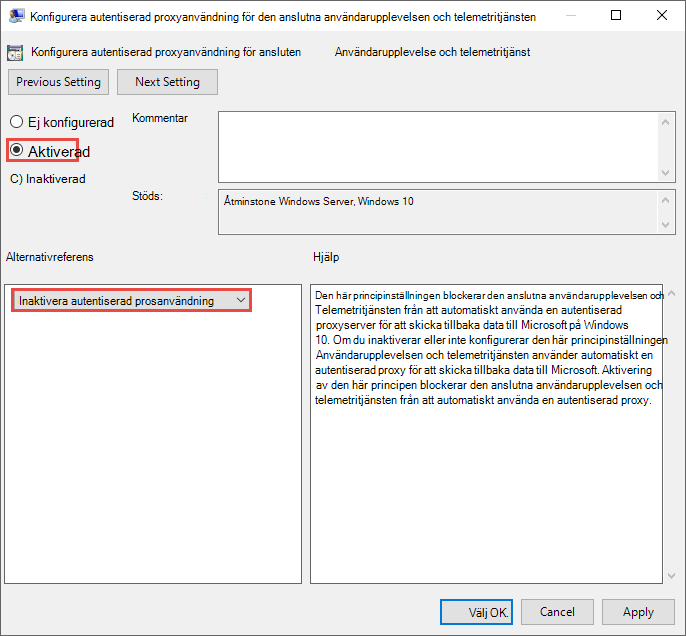

# <a name="set-up-microsoft-defender-for-endpoint-deployment"></a>Konfigurera Microsoft Defender för distribution av Slutpunkt

[!INCLUDE [Microsoft 365 Defender rebranding](../../includes/microsoft-defender.md)]


**Gäller för:**
- [Microsoft Defender för Endpoint](https://go.microsoft.com/fwlink/p/?linkid=2146631)
- [Microsoft 365 Defender](https://go.microsoft.com/fwlink/?linkid=2118804)

> Vill du uppleva Microsoft Defender för Slutpunkt? [Registrera dig för en kostnadsfri utvärderingsversion.](https://www.microsoft.com/microsoft-365/windows/microsoft-defender-atp?ocid=docs-wdatp-exposedapis-abovefoldlink)

Distribution av Defender för Endpoint är en process i tre steg:

| [](prepare-deployment.md)<br>[Fas 1: Förbereda](prepare-deployment.md) | <br>Fas 2: Konfigurera | [](onboarding.md)<br>[Fas 3: Introduktion](onboarding.md) |
| ----- | ----- | ----- |
| | *Du är här!*||

Du befinner dig för närvarande i set-up-fasen.

I det här distributionsscenariot vägleds du genom stegen om:
- Licensieringsverifiering
- Klientorganisationskonfiguration
- Nätverkskonfiguration


>[!NOTE]
>För att du ska kunna vägleda dig genom en vanlig distribution omfattar det här scenariot bara användningen av Microsoft Endpoint Configuration Manager. Defender för Endpoint stöder användning av andra onboarding-verktyg men täcker inte in de scenarierna i distributionsguiden. Mer information finns i Onboard [devices to Microsoft Defender for Endpoint](onboard-configure.md).

## <a name="check-license-state"></a>Kontrollera licenstillstånd

Kontroll av licenstillståndet och om den har etablerats korrekt kan göras via administrationscentret eller via **Microsoft Azure-portalen.**

1. Du visar licenserna genom att gå till **Microsoft Azure-portalen och** gå till microsoft [Azure Portal-licensavsnittet.](https://portal.azure.com/#blade/Microsoft_AAD_IAM/LicensesMenuBlade/Products)

   

1. Du kan också gå till Faktureringsprenumerationer **i**  >  **administrationscentret.**

    På skärmen visas alla etablerade licenser och deras aktuella **status.**

    


## <a name="cloud-service-provider-validation"></a>Validering av molntjänstleverantör

Om du vill få åtkomst till vilka licenser som tillhandahålls till ditt företag och kontrollera licenserna går du till administrationscentret.

1. I **partnerportalen** väljer du **Administrera tjänster > Office 365.**

2. Om du klickar på partnerportallänken **öppnas alternativet Admin för** din räkning och du får tillgång till kundadministrationscentret. 

   


## <a name="tenant-configuration"></a>Klientorganisationskonfiguration

När du öppnar Microsoft Defender Säkerhetscenter för första gången visas en guide som vägleder dig genom några inledande steg. I slutet av installationsguiden finns det en dedikerad molninstans av Defender för Slutpunkt skapad. Den enklaste metoden är att utföra de här stegen från en Windows 10-klientenhet.

1. Från en webbläsare går du till <https://securitycenter.windows.com> .

    

2. Om du går igenom en utvärderingsversionslicens går du till länken ( <https://signup.microsoft.com/Signup?OfferId=6033e4b5-c320-4008-a936-909c2825d83c&dl=WIN_DEF_ATP&pc=xxxxxxx-xxxxxx-xxx-x> )

    När auktoriseringen är klar **visas** välkomstskärmen.
3. Gå igenom auktoriseringsstegen.

    

4. Konfigurera inställningar.

   **Datalagringsplats** – Det är viktigt att ställa in detta på rätt sätt. Avgör var kunden främst vill vara värd: USA, EU eller Storbritannien. Du kan inte ändra platsen efter den här uppsättningen och Microsoft för inte över data från den angivna geolokaliseringen. 

    **Datalagring** – standardvärdet är sex månader.

    **Aktivera förhandsgranskningsfunktioner** – Standardinställningen är att den kan ändras senare.

    

5. Välj **Nästa**.

     

6. Välj **Fortsätt.**


## <a name="network-configuration"></a>Nätverkskonfiguration
Om organisationen inte kräver att slutpunkterna använder en proxyserver för att få åtkomst till Internet kan du hoppa över det här avsnittet.

Microsoft Defender för slutpunkts sensoren kräver Microsoft Windows HTTP (WinHTTP) för att rapportera sensordata och kommunicera med Microsoft Defender för slutpunktstjänsten. Den inbäddade Microsoft Defender för slutpunkts sensoren körs i systemkontexten med localSystem-kontot. Sensorn använder Microsoft Windows HTTP-tjänster (WinHTTP) för att aktivera kommunikation med Microsoft Defender för molntjänsten Endpoint. WinHTTP-konfigurationsinställningen är oberoende av proxyinställningarna för Internetsurfning på Windows Internet (WinINet) och kan bara identifiera en proxyserver med hjälp av följande identifieringsmetoder:

**Metoder för automatisk upptäckt:**

-   Transparent proxy

-   Web Proxy Autodiscovery Protocol (WPAD)

Om transparent proxy eller WPAD har implementerats i nätverkstopologin behöver du inte göra några särskilda konfigurationsinställningar. Mer information om undantag för slutpunkts-URL i proxyn finns i avsnittet Bilaga i det här dokumentet för listan över tillåtna URL-adresser eller [i Microsoft-dokument.](https://docs.microsoft.com/windows/security/threat-protection/windows-defender-atp/configure-proxy-internet-windows-defender-advanced-threat-protection#enable-access-to-windows-defender-atp-service-urls-in-the-proxy-server)

> [!NOTE]
> En detaljerad lista över URL-adresser som måste tillåtas finns i den [här artikeln.](https://docs.microsoft.com/windows/security/threat-protection/microsoft-defender-antivirus/configure-network-connections-microsoft-defender-antivirus)

**Manuell statisk proxykonfiguration:**

-   Registerbaserad konfiguration

-   WinHTTP konfigurerat med netsh-kommandot <br> Endast lämpligt för stationära datorer i en stabil topologi (t.ex. ett skrivbord i ett företagsnätverk bakom samma proxy)

### <a name="configure-the-proxy-server-manually-using-a-registry-based-static-proxy"></a>Konfigurera proxyservern manuellt med hjälp av en registerbaserad statisk proxyserver

Konfigurera en registerbaserad statisk proxy så att endast Microsoft Defender för slutpunkts sensor kan rapportera diagnostikdata och kommunicera med Microsoft Defender för Slutpunktstjänster om en dator inte har tillåtelse att ansluta till Internet. Den statiska proxyn kan konfigureras via grupprincip (GP). Grupprincipen hittar du under:

 - Administrativa mallar \> Windows Components Data Collection and Preview Builds Konfigurera autentiserad proxyanvändning för den anslutna användarupplevelsen och \> \> telemetritjänsten
     - Ställ in den **på Aktiverad** och välj **Inaktivera autentiserad proxyanvändning**

1. Öppna konsolen grupprinciphantering.
2. Skapa en princip eller redigera en befintlig princip utifrån organisationsrutinerna.
3. Redigera grupprincipen och gå till Administrativa mallar: Datainsamling och förhandsversioner av Windows-komponenter Konfigurera autentiserad proxyanvändning för den anslutna användarupplevelsen och **\> \> \> telemetritjänsten.** 
    

4. Välj **Aktiverad**.
5. Välj **Inaktivera autentiserad proxyanvändning.**
   
6. Gå till **Administrativa mallar \> Windows-komponenter \> Datainsamling och förhandsversioner Konfigurera anslutna \> användarupplevelser och telemetri.**
    
7. Välj **Aktiverad**.
8. Ange **proxyservernamnet**.

Principen anger två registervärden `TelemetryProxyServer` som REG_SZ och REG_DWORD `DisableEnterpriseAuthProxy` registernyckeln `HKLM\Software\Policies\Microsoft\Windows\DataCollection` .

Registervärdet `TelemetryProxyServer` har följande strängformat:

```text
<server name or ip>:<port>
```

Till exempel: 10.0.0.6:8080

Registervärdet `DisableEnterpriseAuthProxy` ska vara 1.

###  <a name="configure-the-proxy-server-manually-using-netsh-command"></a>Konfigurera proxyservern manuellt med netsh-kommandot

Använd netsh för att konfigurera en systemomfattande statisk proxy.

> [!NOTE]
> - Detta påverkar alla program, inklusive Windows-tjänster som använder WinHTTP med standardproxy.</br>
> - Bärbara datorer som ändrar topologi (till exempel från kontor till hem) fungerar inte på netsh. Använd den registerbaserade statiska proxykonfigurationen.

1. Öppna en upphöjd kommandorad:

    1. Gå till **Start** och skriv **cmd**.

    1. Högerklicka på **Kommandotolk** och välj **Kör som administratör.**

2. Ange följande kommando och tryck på **Retur:**

   ```PowerShell
   netsh winhttp set proxy <proxy>:<port>
   ```

   Till exempel: netsh winhttp set proxy 10.0.0.6:8080


###  <a name="proxy-configuration-for-down-level-devices"></a>Proxykonfiguration för enheter på lägre nivå

Down-Level-enheter är bland annat Windows 7 SP1 och Windows 8.1 arbetsstationer samt Windows Server 2008 R2, Windows Server 2012, Windows Server 2012 R2 och versioner av Windows Server 2016 innan Windows Server CB 1803. Proxyn konfigureras som en del av Microsoft Management Agent för att hantera kommunikation från slutpunkten till Azure. Mer information om hur en proxy konfigureras på dessa enheter finns i distributionsguiden för Microsoft Management Agent – snabb distribution.

### <a name="proxy-service-urls"></a>URL-adresser för proxytjänst
URL-adresser som innehåller v20 i dem behövs bara om du har Windows 10-, version 1803- eller senare-enheter. Du behöver ```us-v20.events.data.microsoft.com``` till exempel bara om enheten använder Windows 10, version 1803 eller senare.
 

Om en proxy eller brandvägg blockerar anonym trafik, som Microsoft Defender för Slutpunkts sensor ansluter från systemkontext, kontrollerar du att anonym trafik tillåts i de angivna webbadresserna.

I följande nedladdningsbara kalkylblad finns de tjänster och deras tillhörande URL:er som nätverket måste kunna ansluta till. Se till att det inte finns några brandväggs- eller nätverksfiltreringsregler som nekar åtkomst till dessa URL-adresser, eller så kan du behöva skapa en *tillåta-regel* specifikt för dem.

|**Kalkylblad med domänlista**|**Beskrivning**|
|:-----|:-----|
|<br/>  | Kalkylblad med specifika DNS-poster för tjänstplatser, geografiska platser och operativsystem. <br><br>[Ladda ned kalkylbladet här.](https://download.microsoft.com/download/8/a/5/8a51eee5-cd02-431c-9d78-a58b7f77c070/mde-urls.xlsx) 


###  <a name="microsoft-defender-for-endpoint-service-backend-ip-range"></a>IP-intervall för Microsoft Defender för slutpunktstjänstbackend

Om nätverksenheterna inte har stöd för URL-adresser som listas i föregående avsnitt kan du använda följande information.

Defender för Endpoint bygger på Azure Cloud som distribueras i följande regioner:

- \+\<Region Name="uswestcentral">
- \+\<Region Name="useast2">
- \+\<Region Name="useast">
- \+\<Region Name="europenorth">
- \+\<Region Name="europewest">
- \+\<Region Name="uksouth">
- \+\<Region Name="ukwest">

Du hittar AZURE IP-intervallet på [IP-intervallen för Microsoft Azure-datacentret.](https://www.microsoft.com/en-us/download/details.aspx?id=41653)

> [!NOTE]
> Som en molnbaserad lösning kan IP-adressintervallet ändras. Vi rekommenderar att du går över till DNS-lösningsinställningen.

## <a name="next-step"></a>Nästa steg

 <br>[Steg 3: Introduktion:](onboarding.md)Introducera enheter till tjänsten så att Microsoft Defender för Slutpunkt-tjänsten kan få sensordata från dem. 
