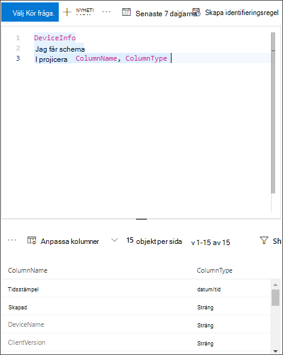

# <a name="configure-microsoft-365-defender-to-stream-advanced-hunting-events-to-your-azure-event-hubs"></a>Konfigurera Microsoft 365 Defender för att strömma Advanced Hunting-händelser till Azure Event Hubs

[!INCLUDE [Microsoft 365 Defender rebranding](../../includes/microsoft-defender.md)]


**Gäller för:**
- [Microsoft 365 Defender](https://go.microsoft.com/fwlink/?linkid=2118804)

[!include[Prerelease information](../../includes/prerelease.md)]

## <a name="before-you-begin"></a>Innan du börjar:

1. Skapa ett [händelsenav](/azure/event-hubs/) i klientorganisationen.

2. Logga in på [din Azure-klientorganisation](https://ms.portal.azure.com/)och **gå till Prenumerationer > din > eller resursleverantörer > Registrera dig i Microsoft.Insights.**

3. Skapa ett namnområde för  händelsehubben, gå till Händelsehubben > Lägg till och välj prissättningsnivå, dataflödesenheter och Automatiskt fylls på för förväntad belastning. Mer information finns i [Priser – | Microsoft Azure](https://azure.microsoft.com/en-us/pricing/details/event-hubs/).  

4. När namnområdet för händelsehubben har skapats måste du lägga till programmets huvudnamn för registreringstjänsten som läsare, Azure Event Hubs Data Receiver och användaren som ska logga in på Microsoft 365 Defender som deltagare (detta kan också göras på resursgrupp- eller prenumerationsnivå). Gå till **namnområdet i händelsehubben > i Access-kontroll (IAM) >** Lägg till och verifiera under **Roll assignements.**

## <a name="enable-raw-data-streaming"></a>Aktivera direktuppspelning av rådata:

1. Logga in på Microsoft 365 [Defender säkerhetscenter](https://security.microsoft.com) som en ***global administratör** _ eller _*_säkerhetsadministratör_**.

2. Gå till sidan [Inställningar för dataexport.](https://security.microsoft.com/settings/mtp_settings/raw_data_export)

3. Klicka på Lägg **till**.

4. Välj ett namn för de nya inställningarna.

5. Välj **Vidarebefordra händelser till Azure Event Hubs.**

6. Du kan välja om du vill exportera händelsedata till ett enskilt händelsenav eller exportera varje händelsetabell till ett annat även nav i namnområdet i händelsehubben. 

7. Om du vill exportera händelsedata till ett enskilt händelsenav anger du namnet **på händelsehubben** och **resurs-ID för Händelsehubben.**

   Om du vill **hämta ditt resurs-ID** för Händelsehubben går du till namnområdessidan i Azure-händelsehubben på fliken [Azure->](https://ms.portal.azure.com/)kopierar texten  >   under **Resurs-ID:**

   

8. Välj de händelser du vill strömma och klicka på **Spara**.

## <a name="the-schema-of-the-events-in-azure-event-hubs"></a>Schemat för händelserna i Azure Event Hub:

```
{
    "records": [
                    {
                        "time": "<The time Microsoft 365 Defender received the event>"
                        "tenantId": "<The Id of the tenant that the event belongs to>"
                        "category": "<The Advanced Hunting table name with 'AdvancedHunting-' prefix>"
                        "properties": { <Microsoft 365 Defender Advanced Hunting event as Json> }
                    }
                    ...
                ]
}
```

- Varje händelsehubbmeddelande i Azure Event Hub innehåller en lista över poster.

- Varje post innehåller händelsenamnet, tiden då Microsoft 365 Defender tog emot händelsen, den klientorganisation som den tillhör (du får bara händelser från klientorganisationen) och händelsen i JSON-format i en egenskap med namnet "**egenskaper**".

- Mer information om schemat för de Microsoft 365 Defender-händelser finns i Avancerad sökning [– översikt.](../defender/advanced-hunting-overview.md)

- I tabellen Avancerad sökning finns en kolumn med namnet **MachineGroup** som innehåller enhetens grupp i tabellen **DeviceInfo.** Här är alla händelser dekorerade med den här kolumnen. 

9. Om du vill exportera varje händelsetabell till  ett annat händelsenav lämnar du händelsehubbens namn tomt så gör Microsoft 365 Defender resten.


## <a name="data-types-mapping"></a>Mappning av datatyper:

Så här hämtar du datatyperna för händelseegenskaper:

1. Logga in på [Microsoft 365 säkerhetscenter](https://security.microsoft.com) och gå till [sidan Advanced Hunting](https://security.microsoft.com/hunting-package).

2. Kör följande fråga för att hämta mappningen av datatyper för varje händelse:
 
   ```
   {EventType}
   | getschema
   | project ColumnName, ColumnType 
   ```

- Här är ett exempel för enhetsinfohändelsen: 

  

## <a name="related-topics"></a>Relaterade ämnen
- [Översikt över Avancerad sökning](../defender/advanced-hunting-overview.md)
- [Microsoft 365 Defender-streaming-API](raw-data-export.md)
- [Strömma Microsoft 365 Defender-händelser till ditt Azure Storage-konto](raw-data-export-storage.md)
- [Dokumentation om Azure Event Hubs](/azure/event-hubs/)
- [Felsöka anslutningsproblem – Azure Event Hub](/azure/event-hubs/troubleshooting-guide)
