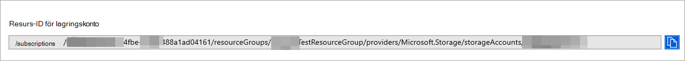

# <a name="configure-microsoft-defender-for-endpoint-to-stream-advanced-hunting-events-to-your-storage-account"></a>Konfigurera Microsoft Defender för slutpunkt för att strömma Advanced Hunting-händelser till ditt lagringskonto

[!INCLUDE [Microsoft 365 Defender rebranding](../../includes/microsoft-defender.md)]


**Gäller för:**
- [Microsoft Defender för Endpoint](https://go.microsoft.com/fwlink/?linkid=2154037)

> Vill du använda Defender för Slutpunkt? [Registrera dig för en kostnadsfri utvärderingsversion.](https://www.microsoft.com/microsoft-365/windows/microsoft-defender-atp?ocid=docs-wdatp-configuresiem-abovefoldlink) 

## <a name="before-you-begin"></a>Innan du börjar:

1. Skapa ett [lagringskonto](https://docs.microsoft.com/azure/storage/common/storage-account-overview) i klientorganisationen.

2. Logga in på [din Azure-klientorganisation](https://ms.portal.azure.com/)och gå **till Prenumerationer > din > eller resursleverantörer > Registrera dig på Microsoft.insights.**

## <a name="enable-raw-data-streaming"></a>Aktivera direktuppspelning av rådata:

1. Logga in i [Microsoft Defender för Endpoint-portalen](https://securitycenter.windows.com) som en ***global administratör** _ eller _*_säkerhetsadministratör_**.

2. Gå till [sidan Inställningar för dataexport](https://securitycenter.windows.com/interoperability/dataexport) i Microsoft Defender Säkerhetscenter.

3. Klicka på Lägg **till inställningar för dataexport.**

4. Välj ett namn för de nya inställningarna.

5. Välj **Vidarebefordra händelser till Azure Storage.**

6. Ange ditt **resurs-ID för lagringskonto.** För att få ditt **resurs-ID** för lagringskonto går du till sidan Lagringskonto på fliken Egenskaper > [i Azure Portal](https://ms.portal.azure.com/) > kopiera texten under **Resurs-ID för lagringskonto:**

   

7. Välj de händelser du vill strömma och klicka på **Spara**.

## <a name="the-schema-of-the-events-in-the-storage-account"></a>Schemat för händelserna i lagringskontot:

- En blob-behållare skapas för varje händelsetyp: 

  

- Schemat för varje rad i en blob är följande JSON: 

  ```
  {
          "time": "<The time WDATP received the event>"
          "tenantId": "<Your tenant ID>"
          "category": "<The Advanced Hunting table name with 'AdvancedHunting-' prefix>"
          "properties": { <WDATP Advanced Hunting event as Json> }
  }               
  ```

- Varje blob innehåller flera rader.

- Varje rad innehåller händelsenamnet, tiden Defender för Slutpunkt tog emot händelsen, den klientorganisation den tillhör (du får bara händelser från klientorganisationen) och händelsen i JSON-format i en egenskap som kallas "egenskaper".

- Mer information om schemat för Microsoft Defender för slutpunktshändelser finns i Avancerad sökning [– översikt.](advanced-hunting-overview.md)

- I tabellen Avancerad sökning finns en kolumn med namnet **MachineGroup** som innehåller enhetens grupp i tabellen **DeviceInfo.** Här är alla händelser dekorerade med den här kolumnen. Mer information [finns i](machine-groups.md) Enhetsgrupper.

## <a name="data-types-mapping"></a>Mappning av datatyper:

För att hämta datatyperna för våra händelseegenskaper gör du följande:

1. Logga in på [Microsoft Defender Säkerhetscenter](https://securitycenter.windows.com) och gå till [sidan Advanced Hunting.](https://securitycenter.windows.com/hunting-package)

2. Kör följande fråga för att hämta mappningen av datatyper för varje händelse: 

   ```
   {EventType}
   | getschema
   | project ColumnName, ColumnType 
   ```

- Här är ett exempel för enhetsinfohändelsen: 

  

## <a name="related-topics"></a>Relaterade ämnen
- [Översikt över Avancerad sökning](advanced-hunting-overview.md)
- [Microsoft Defender för slutpunkts-API för direktuppspelning](raw-data-export.md)
- [Strömma Microsoft Defender för slutpunktshändelser till ditt Azure Storage-konto](raw-data-export-storage.md)
- [Dokumentation om Azure Storage Account](https://docs.microsoft.com/azure/storage/common/storage-account-overview)
