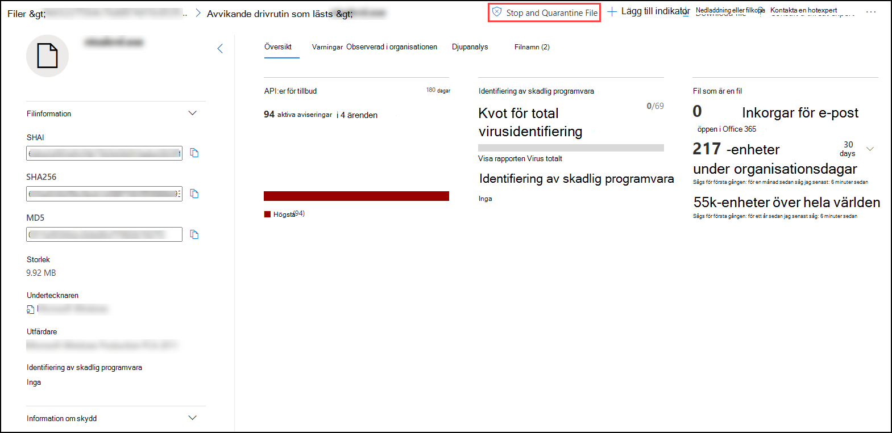
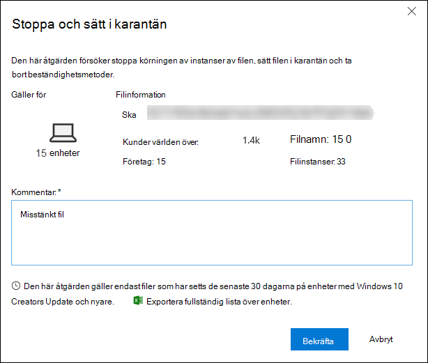
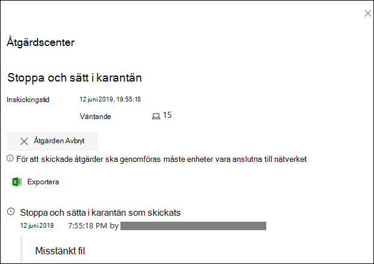
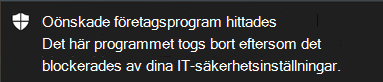
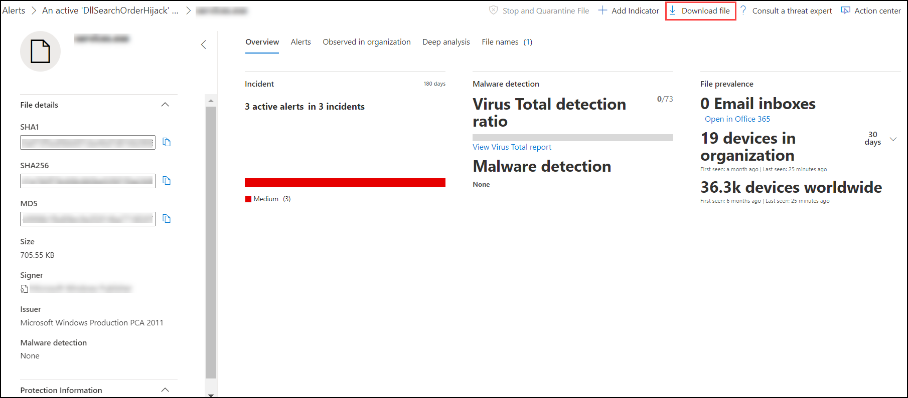
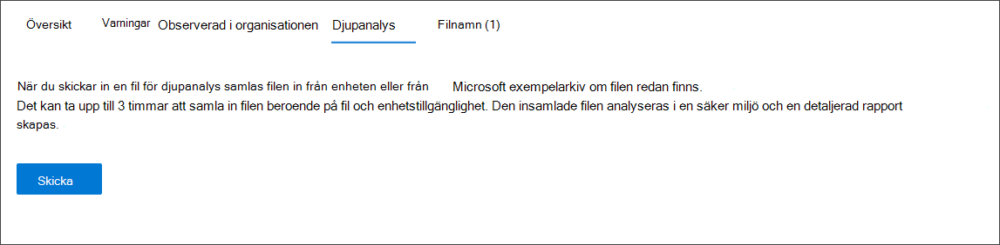

# <a name="take-response-actions-on-a-file"></a>Utföra svarsåtgärder för en fil

[!INCLUDE [Microsoft 365 Defender rebranding](../../includes/microsoft-defender.md)]


**Gäller för:**
- [Microsoft Defender för Endpoint](https://go.microsoft.com/fwlink/?linkid=2154037)

[!include[Prerelease information](../../includes/prerelease.md)]

> Vill du använda Defender för Slutpunkt? [Registrera dig för en kostnadsfri utvärderingsversion.](https://www.microsoft.com/microsoft-365/windows/microsoft-defender-atp?ocid=docs-wdatp-responddile-abovefoldlink)

Svara snabbt på identifierade attacker genom att stoppa och kvartilerna på filer eller blockera en fil. När du har agerat på filer kan du kontrollera aktivitetsinformation i Åtgärdscenter.

Svarsåtgärder är tillgängliga på en fils detaljerade profilsida. När du är på den här sidan kan du växla mellan den nya och gamla sidlayouten genom att byta **ny Filsida.** Resten av den här artikeln beskriver den nyare sidlayouten.

Svarsåtgärder går högst upp på filsidan och omfattar:

- Stoppa och sätt i karantän
- Lägg till indikator
- Ladda ned fil
- Kontakta en hotexpert
- Åtgärdscenter

Du kan också skicka filer för djupanalys för att köra filen i en säker sandbox-miljö i molnet. När analysen är klar får du en detaljerad rapport som innehåller information om filens beteende. Du kan skicka filer för djupanalys och läsa tidigare rapporter genom att välja **fliken Djupanalys.** Den finns under filinformationskorten.

Vissa åtgärder kräver vissa behörigheter. I följande tabell beskrivs vilka åtgärder vissa behörigheter kan vidta för bärbara körbara filer (PE) och icke-PE-filer:

| Behörighet             | PE-filer | Icke-PE-filer |
| :--------------------- | :------: | :----------: |
| Visa data              |     X    |       X      |
| Undersökning av aviseringar   | &#x2611; |       X      |
| Grundläggande livesvar    |     X    |       X      |
| Livesvar avancerat | &#x2611; |   &#x2611;   |

Mer information om roller finns i Skapa [och hantera roller för rollbaserad åtkomstkontroll.](user-roles.md)

## <a name="stop-and-quarantine-files-in-your-network"></a>Stoppa och sätt filer i nätverket i karantän

Du kan innehålla en attack i organisationen genom att stoppa den skadliga processen och kvartilen av filen där den observerades.

> [!IMPORTANT]
> Du kan bara vidta den här åtgärden om:
>
> - Den enhet som du vidtar åtgärden på kör Windows 10, version 1703 eller senare
> - Filen tillhör inte betrodda tredjepartsutgivare eller är inte signerad av Microsoft
> - Microsoft Defender Antivirus måste åtminstone köras på passivt läge. Mer information finns i Kompatibilitet [för Microsoft Defender Antivirus.](https://docs.microsoft.com/windows/security/threat-protection/microsoft-defender-antivirus/microsoft-defender-antivirus-compatibility)

Åtgärden **Stoppa och sätt i karantän** innehåller att stoppa processer, kvartiler av filerna och ta bort beständiga data, till exempel registernycklar.

Den här åtgärden gäller på enheter med Windows 10, version 1703 eller senare, där filen har observerats de senaste 30 dagarna.

> [!NOTE]
> Du kan när som helst återställa filen från karantän.

### <a name="stop-and-quarantine-files"></a>Stoppa och sätt filer i karantän

1. Markera den fil som du vill stoppa och sätt i karantän. Du kan välja en fil från någon av följande vyer eller använda sökrutan:

   - **Aviseringar** – klicka på motsvarande länkar från beskrivningen eller informationen i tidslinjen Med Artefakt
   - **Sökrutan** – **välj** Arkiv i den nedrullningsmenyn och ange filnamnet

   > [!NOTE]
   > Åtgärden att stoppa och sätta i karantän är begränsad till högst 1 000 enheter. Information om hur du stoppar en fil på ett större antal enheter finns i [Lägga till indikator för att blockera eller tillåta fil](#add-indicator-to-block-or-allow-a-file).

2. Gå till det översta fältet och välj **Stoppa och sätt i karantän.**

   

3. Ange en orsak och välj sedan **Bekräfta**.

   

   Åtgärdscenter visar information om inskickat material:
   
   

   - **Inskickningstid** – visar när åtgärden skickades.
   - **Lyckades** – Visar antalet enheter där filen har stoppats och satts i karantän.
   - **Misslyckades** – Visar antalet enheter där åtgärden misslyckades och information om felet.
   - **Väntande** – Visar antalet enheter där filen ännu inte har stoppats och satts i karantän från. Det kan ta tid i fall när enheten är offline eller inte ansluten till nätverket.

4. Välj någon av statusindikatorerna om du vill visa mer information om åtgärden. Välj till exempel **Misslyckades om** du vill se var åtgärden misslyckades.

**Meddelande på enhetens användare:**</br>
När filen tas bort från en enhet visas följande meddelande:



På enhetens tidslinje läggs en ny händelse till för varje enhet där en fil har stoppats och satts i karantän.

En varning visas innan åtgärden implementeras för filer som används ofta i hela organisationen. Det är för att verifiera att åtgärden är avsedd.

## <a name="restore-file-from-quarantine"></a>Återställa en fil från karantän

Du kan återställa och ta bort en fil från karantän om du har fastställt att den är ren efter en undersökning. Kör följande kommando på varje enhet där filen satts i karantän.

1. Öppna en upphöjd kommandoradsfråga på enheten:

   1. Gå till **Start** och skriv _cmd_.

   1. Högerklicka på **Kommandotolken** och välj **Kör som administratör.**

2. Ange följande kommando och tryck på **Retur:**

   ```powershell
   “%ProgramFiles%\Windows Defender\MpCmdRun.exe” –Restore –Name EUS:Win32/CustomEnterpriseBlock –All
   ```

> [!NOTE]
> I vissa fall kan **ThreatName** visas som: EUS:Win32/CustomEnterpriseBlock!cl.
>
> Defender för Endpoint återställer alla egna blockerade filer som har satts i karantän på den här enheten under de senaste 30 dagarna.

> [!IMPORTANT]
> En fil som har satts i karantän som ett potentiellt nätverkshot kanske inte kan återställas. Om en användare försöker återställa filen efter karantänen är filen kanske inte tillgänglig. Det kan bero på att systemet inte längre har nätverksautentiseringsuppgifter för att få åtkomst till filen. Vanligtvis beror det på en tillfällig inloggning till ett system eller en delad mapp och åtkomsttoken har upphört att gälla.

## <a name="download-or-collect-file"></a>Ladda ned eller samla in fil

Om **du väljer Ladda** ned fil från svarsåtgärderna kan du ladda ned ett lokalt, lösenordsskyddat ZIP-arkiv som innehåller filen. En utfällningsfil visas där du kan ange en orsak till att filen laddas ned och ange ett lösenord.

Som standard kan du inte ladda ned filer som ligger i karantän.



### <a name="collect-files"></a>Samla in filer

Om en fil inte redan lagras av Microsoft Defender för Endpoint kan du inte ladda ned den. I stället visas knappen Samla **in fil** på samma plats. Om en fil inte har visats i organisationen under de senaste 30 dagarna **inaktiveras** insamlingsfilen.
> [!Important]
> En fil som har satts i karantän som ett potentiellt nätverkshot kanske inte kan återställas. Om en användare försöker återställa filen efter karantänen är filen kanske inte tillgänglig. Det kan bero på att systemet inte längre har nätverksautentiseringsuppgifter för att få åtkomst till filen. Vanligtvis beror det på en tillfällig inloggning till ett system eller en delad mapp och åtkomsttoken har upphört att gälla.

## <a name="add-indicator-to-block-or-allow-a-file"></a>Lägga till indikator för att blockera eller tillåta en fil

Förhindra ytterligare spridning av en attack i organisationen genom att förbjuda potentiellt skadliga filer eller misstänkt skadlig kod. Om du vet en potentiellt skadlig körbar fil (PE) kan du blockera den. Den här åtgärden gör att den inte kan läsas, skrivas eller köras på enheter i organisationen.

> [!IMPORTANT]
>
> - Den här funktionen är tillgänglig om din organisation använder Microsoft Defender Antivirus och Moln levererat skydd är aktiverat. Mer information finns i [Hantera moln-leveransskydd.](https://docs.microsoft.com/windows/security/threat-protection/microsoft-defender-antivirus/deploy-manage-report-microsoft-defender-antivirus)
>
> - Klientversionen av Antimalware måste vara 4.18.1901.x eller senare.
> - Den här funktionen är utformad för att förhindra att misstänkt skadlig programvara (eller potentiellt skadliga filer) laddas ned från webben. Den har för närvarande stöd för bärbara körbara (PE) filer, inklusive _.exe-_ _och .dll-filer._ Täckningen utökas med tiden.
> - Den här svarsåtgärden är tillgänglig för enheter i Windows 10, version 1703 eller senare.
> - Funktionen tillåt eller blockera kan inte utföras för filer om filens klassificering finns på enhetens cache innan åtgärden för att tillåta eller blockera.

> [!NOTE]
> PE-filen måste finnas på enhetens tidslinje för att du ska kunna vidta den här åtgärden.
>
> Det kan finnas ett par minuter med fördröjning mellan den tid åtgärden vidtas och den faktiska filen blockeras.

### <a name="enable-the-block-file-feature"></a>Aktivera blockeringsfilsfunktionen

För att börja blockera filer måste du först [aktivera funktionen Spärra eller **tillåt**](advanced-features.md) i Inställningar.
### <a name="allow-or-block-file"></a>Tillåta eller blockera fil

När du lägger till en indikatorhash för en fil kan du välja att avisering ska visas och blockera filen när en enhet i organisationen försöker köra den.

Filer som blockeras automatiskt av en indikator visas inte i filens Åtgärdscenter, men aviseringarna visas fortfarande i kön Aviseringar.

Mer [information om att](manage-indicators.md) blockera och höja aviseringar om filer finns i Hantera indikatorer.

Ta bort indikatorn för att sluta blockera en fil. Det kan du göra via **åtgärden Redigera** indikator på filens profilsida. Den här åtgärden visas i samma position som lägg till **indikator,** innan du lagt till indikatorn.

Du kan också redigera indikatorer från **sidan Inställningar,** under   >  **Regelindikatorer.** Indikatorer visas i det här området efter filens hash-kod.

## <a name="consult-a-threat-expert"></a>Kontakta en hotexpert

Kontakta en Microsoft-expert för att få mer information om en potentiellt komprometterad enhet eller redan komprometterade enheter. Microsoft Threat Experts är direkt engagerade i Säkerhetscenter i Microsoft Defender för att få snabba och korrekta svar. Experter ger insikter på en potentiellt komprometterad enhet och hjälper dig att förstå komplexa hot och riktade attackmeddelanden. De kan också tillhandahålla information om aviseringar eller ett informationssammanhang för hot som visas på din portalinstrumentpanel.

Mer [information finns i Kontakta en Microsoft Threat Expert.](https://docs.microsoft.com/microsoft-365/security/defender-endpoint/configure-microsoft-threat-experts#consult-a-microsoft-threat-expert-about-suspicious-cybersecurity-activities-in-your-organization)

## <a name="check-activity-details-in-action-center"></a>Kontrollera aktivitetsinformation i Åtgärdscenter

I **Åtgärdscenter** finns information om åtgärder som har vidtagits på en enhet eller en fil. Du kan visa följande information:

- Samling av undersökningspaket
- Antivirussökning
- Appbegränsning
- Enhetsisolering

All annan relaterad information visas också, till exempel datum/tid för inskickning, skickande av användare och om åtgärden lyckades eller misslyckades.


## <a name="deep-analysis"></a>Djupanalys

Cybersäkerhetsundersökningar utlöses vanligtvis av en varning. Aviseringar är relaterade till en eller flera observerade filer som ofta är nya eller okända. När du markerar en fil kommer du till filvyn där du kan se filens metadata. Om du vill utöka data som är relaterade till filen kan du skicka filen för djupanalys.

Djupanalysfunktionen kör en fil i en säker, fullständigt instrumenterad molnmiljö. Djupanalysresultat visar filens aktiviteter, observerade beteenden och tillhörande artefakter, till exempel neds ignorerade filer, registerändringar och kommunikation med IP-adresser.
Djupanalys stöder för närvarande omfattande analys av PE-filer (Portable Executable) (inklusive _.exe-_ och _.dll-filer)._

Djupanalys av en fil tar flera minuter. När filanalysen är klar uppdateras fliken Djupanalys för att visa en sammanfattning och datum och tid för de senaste tillgängliga resultaten.

Den djupa analyssammanfattningen innehåller en lista över observerade beteenden *,* en del av dem kan indikera skadlig aktivitet och *observerbara*, inklusive kontaktade IP-adresser och filer som skapats på disken. Om inget hittas visas ett kort meddelande i de här avsnitten.

Resultat av djupanalys matchas mot hotinformation och eventuella matchningar genererar lämpliga varningar.

Använd funktionen djupanalys för att undersöka information om en fil, vanligtvis under en undersökning av en varning eller av någon annan anledning där du misstänker skadligt beteende. Den här funktionen är **tillgänglig på fliken** Djupanalys på filens profilsida.<br/>
<br/>

> [!VIDEO https://www.microsoft.com/en-us/videoplayer/embed/RE4aAYy?rel=0]

**Skicka för djupanalys** är aktiverat när filen är tillgänglig i Defender för slutpunktsbackend-exempelsamling, eller om den observerades på en Windows 10-enhet som har stöd för att skicka till djupanalys.

> [!NOTE]
> Endast filer från Windows 10 kan samlas in automatiskt.

Du kan också skicka ett exempel via [Microsoft Säkerhetscenter-portalen](https://www.microsoft.com/security/portal/submission/submit.aspx) om filen inte observerades på en Windows 10-enhet och vänta på att Skicka för **djupanalysknappen** blir tillgänglig.

> [!NOTE]
> På grund av flöden för backend-bearbetning i Microsoft Security Center-portalen kan det finnas upp till 10 minuters fördröjning mellan filinskick och tillgängligheten för den djupanalysfunktion som finns i Defender för Slutpunkt.

När exemplet samlas in kör Defender för Slutpunkt filen i en säker miljö. Sedan skapas en detaljerad rapport över observerade beteenden och associerade artefakter, till exempel filer som släppts på enheter, kommunikation till IP-adresser och registerändringar.

### <a name="submit-files-for-deep-analysis"></a>Skicka filer för djupanalys

1. Välj den fil som du vill skicka för djupanalys. Du kan välja eller söka i en fil från någon av följande vyer:

    - Aviseringar – välj fillänkarna från **beskrivningen eller** **informationen på** tidslinjen Artefakt
    - **Listan Enheter** – välj fillänkarna i **avsnittet** **Beskrivning eller** Information i avsnittet **Enhet i** organisation
    - Sökrutan – **välj** Arkiv i den nedrullningsmenyn och ange filnamnet

2. På fliken **Djupanalys** i filvyn väljer du **Skicka.**

   

   > [!NOTE]
   > Endast PE-filer stöds, inklusive _.exe-_ och _.dll-filer._

En förloppsfält visas med information om de olika stegen i analysen. Du kan sedan visa rapporten när analysen är klar.

> [!NOTE]
> Exempel på samlingstid kan variera beroende på enhetens tillgänglighet. Det finns en tidsgräns på 3 timmar för exempelsamling. Samlingen misslyckas och åtgärden avbryts om det inte finns någon Windows 10-enhetsrapportering online vid den tidpunkten. Du kan skicka filer igen för djupanalys för att hämta nya data i filen.

### <a name="view-deep-analysis-reports"></a>Visa djupanalysrapporter

Visa den angivna djupanalysrapporten för att se mer djupgående information om filen du skickade. Den här funktionen är tillgänglig i filvykontexten.

Du kan visa den omfattande rapporten som innehåller information om följande avsnitt:

- Beteenden
- Observables

Informationen som ges kan hjälpa dig att undersöka om det finns uppgifter om en potentiell attack.

1. Välj filen du skickade för djupanalys.
2. Välj **fliken Djupanalys.** Om det finns tidigare rapporter visas rapportsammanfattningen på den här fliken.

    

#### <a name="troubleshoot-deep-analysis"></a>Felsöka djupanalys

Om du får problem när du försöker skicka en fil kan du prova följande felsökningssteg.

1. Kontrollera att filen i fråga är en PE-fil. PE-filer har vanligtvis _filnamnstilläggen .exe_ eller _.dll_ (körbara program eller program).
2. Kontrollera att tjänsten har åtkomst till filen, att den fortfarande finns och inte har skadats eller ändrats.
3. Vänta en stund och försök sedan skicka filen igen. Kön kan vara full eller det har uppstått ett tillfälligt anslutnings- eller kommunikationsfel.
4. Om exempelsamlingsprincipen inte är konfigurerad är standardbeteendet att tillåta exempelsamling. Om den är konfigurerad bör du kontrollera att principinställningen tillåter exempelinsamling innan du skickar filen igen. När exempelsamlingen är konfigurerad kontrollerar du följande registervärde:

    ```powershell
    Path: HKLM\SOFTWARE\Policies\Microsoft\Windows Advanced Threat Protection
    Name: AllowSampleCollection
    Type: DWORD
    Hexadecimal value :
      Value = 0 – block sample collection
      Value = 1 – allow sample collection
    ```

1. Ändra organisationsenheten via grupprincipen. Mer information finns i [Konfigurera med grupprincip.](configure-endpoints-gp.md)
1. Om de här stegen inte löser problemet kontaktar du [winatp@microsoft.com](mailto:winatp@microsoft.com).

## <a name="related-topics"></a>Relaterade ämnen

- [Vidta svarsåtgärder på en enhet](respond-machine-alerts.md)
- [Undersöka filer](investigate-files.md)
