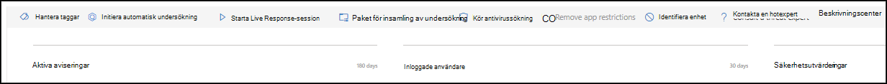
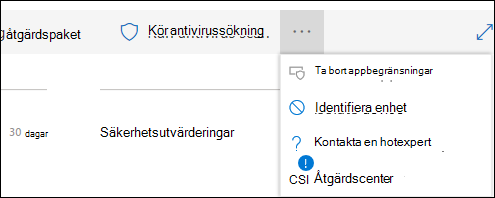
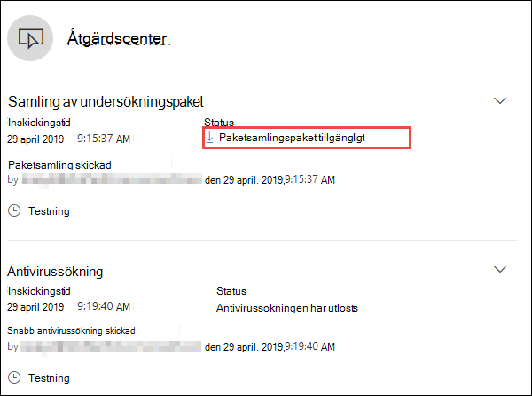
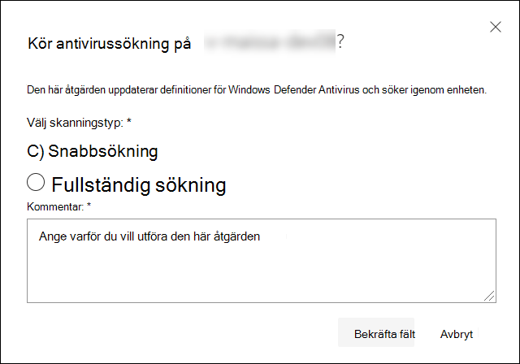
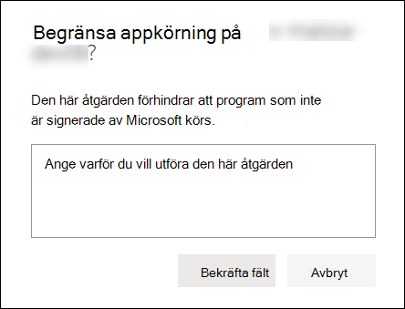
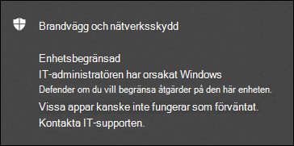
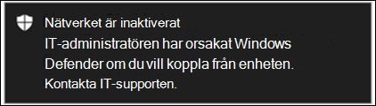
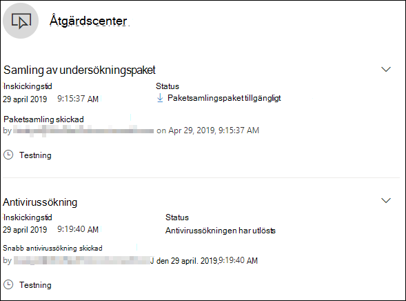

# Vidta svarsåtgärder på en enhetTake response actions on a device

[!INCLUDE [Microsoft 365 Defender rebranding](../../includes/microsoft-defender.md)]

**Gäller för:****Applies to:**
- [Microsoft Defender för EndpointMicrosoft Defender for Endpoint](https://go.microsoft.com/fwlink/?linkid=2154037)

>Vill du använda Defender för Slutpunkt?Want to experience Defender for Endpoint? [Registrera dig för en kostnadsfri utvärderingsversion.Sign up for a free trial.](https://www.microsoft.com/microsoft-365/windows/microsoft-defender-atp?ocid=docs-wdatp-respondmachine-abovefoldlink) 

Svara snabbt på identifierade attacker genom att isolera enheter eller samla in ett undersökningspaket.Quickly respond to detected attacks by isolating devices or collecting an investigation package. När du har vidtar åtgärder på enheter kan du kontrollera aktivitetsinformation i Åtgärdscenter.After taking action on devices, you can check activity details on the Action center.

Svarsåtgärder löper högst upp på en specifik enhet och omfattar:Response actions run along the top of a specific device page and include:

- Hantera taggarManage tags
- Initiera automatisk undersökningInitiate Automated Investigation
- Starta Live Response-sessionInitiate Live Response Session
- Samla in undersökningspaketCollect investigation package
- Kör antivirusgenomsökningRun antivirus scan
- Begränsa körning av programRestrict app execution
- Identifiera enhetIsolate device
- Konsultera en hotexpertConsult a threat expert
- ÅtgärdscenterAction center

 Du hittar enhetssidor från någon av följande vyer:You can find device pages from any of the following views:

- **Instrumentpanel för** säkerhetsåtgärder – Välj ett enhetsnamn på enheterna på riskkortet.**Security operations dashboard** - Select a device name from the Devices at risk card.
- **Telefonaviseringar** – Välj enhetsnamnet bredvid enhetsikonen från aviseringskön.**Alerts queue** - Select the device name beside the device icon from the alerts queue.
- **Listan Enheter** – Välj rubriken för enhetsnamnet i listan över enheter.**Devices list** - Select the heading of the device name from the devices list.
- **Sökruta** – Välj enhet i listrutan och ange enhetens namn.**Search box** - Select Device from the drop-down menu and enter the device name.

>[!IMPORTANT]
> - De här svarsåtgärderna är endast tillgängliga för enheter Windows 10, version 1703 eller senare.These response actions are only available for devices on Windows 10, version  1703 or later. 
> - För icke-Windows-plattformar är svarsfunktioner (som enhetsisolering) beroende av tredjepartsfunktionerna.For non-Windows platforms, response capabilities (such as Device isolation) are dependent on the third-party capabilities.

## Hantera taggarManage tags

Lägg till eller hantera taggar för att skapa en logisk grupp med anknytning.Add or manage tags to create a logical group affiliation. Enhetstaggar stöder korrekt mappning av nätverket, så att du kan bifoga olika taggar för att fånga sammanhang och möjliggöra skapande av dynamiska listor som en del av ett problem.Device tags support proper mapping of the network, enabling you to attach different tags to capture context and to enable dynamic list creation as part of an incident.

Mer information om enhetstaggar finns i [Skapa och hantera enhetstaggar.](machine-tags.md)For more information on device tagging, see [Create and manage device tags](machine-tags.md).

## Initiera automatisk undersökningInitiate Automated Investigation

Du kan starta en ny, allmän automatisk undersökning på enheten om det behövs.You can start a new general purpose automated investigation on the device if needed. Medan en undersökning körs läggs alla andra aviseringar som genereras från enheten till i en pågående automatiserad undersökning tills undersökningen har slutförts.While an investigation is running, any other alert generated from the device will be added to an ongoing Automated investigation until that investigation is completed. Om samma hot visas på andra enheter läggs dessa enheter dessutom till i undersökningen.In addition, if the same threat is seen on other devices, those devices are added to the investigation.

Mer information om automatiserade undersökningar finns i [Översikt över automatiserade undersökningar.](automated-investigations.md)For more information on automated investigations, see [Overview of Automated investigations](automated-investigations.md).

## Starta Live Response-sessionInitiate Live Response Session

Live response är en funktion som ger dig omedelbar åtkomst till en enhet med hjälp av en anslutning för fjärrgränssnitt.Live response is a capability that gives you instantaneous access to a device by using a remote shell connection. Det ger dig möjlighet att göra djupgående undersökningsarbete och vidta omedelbart åtgärder för att snabbt identifiera hot – realtid.This gives you the power to do in-depth investigative work and take immediate response actions to promptly contain identified threats — real time.

Med live-svar kan du förbättra undersökningar genom att samla in tekniska data, köra skript, skicka misstänkta enheter för analys, åtgärda hot och proaktivt leta efter nya hot.Live response is designed to enhance investigations by enabling you to collect forensic data, run scripts, send suspicious entities for analysis, remediate threats, and proactively hunt for emerging threats.

Mer information om livesvar finns i Undersöka [enheter på enheter som använder live-svar.](live-response.md)For more information on live response, see [Investigate entities on devices using live response](live-response.md).

## Samla in undersökningspaket från enheterCollect investigation package from devices

Som en del av undersökningen eller svarsprocessen kan du samla in ett undersökningspaket från en enhet.As part of the investigation or response process, you can collect an investigation package from a device. Genom att samla in undersökningspaketet kan du identifiera enhetens aktuella status och ytterligare förstå de verktyg och tekniker som används av attackeraren.By collecting the investigation package, you can identify the current state of the device and further understand the tools and techniques used by the attacker.

Om du vill ladda ned paketet (zip-filen) och undersöka händelser som inträffat på en enhetTo download the package (Zip file) and investigate the events that occurred on a device

1. Välj **Samla in undersökningspaket** från raden med svarsåtgärder högst upp på sidan enhet.Select **Collect investigation package** from the row of response actions at the top of the device page.
2. Ange i textrutan varför du vill utföra den här åtgärden.Specify in the text box why you want to perform this action. Välj **Bekräfta.**Select **Confirm**.
3. ZIP-filen laddas nedThe zip file will download

Alternativt sätt:Alternate way:

1. Välj **Åtgärdscenter** i avsnittet svarsåtgärder på sidan Enhet.Select **Action center** from the response actions section of the device page.

    

3. I åtgärdscenter väljer du Paketsamlingspaket som **är tillgängligt för att** ladda ned ZIP-filen.In the Action center fly-out, select **Package collection package available** to download the zip file.
  
    

Paketet innehåller följande mappar:The package contains the following folders:

| MappFolder | BeskrivningDescription |
|:---|:---------|
|AutorunsAutoruns | Innehåller en uppsättning filer som var och en representerar innehållet i registret för en känd automatisk startpunkt för start (ASEP) för att identifiera attackers beständiga plats på enheten.Contains a set of files that each represent the content of the registry of a known auto start entry point (ASEP) to help identify attacker’s persistency on the device.    
<b>OBS!</b> Om registernyckeln inte hittas innehåller filen följande meddelande: "FEL: Det gick inte att hitta den angivna registernyckeln eller värdet."<b>NOTE:</b> If the registry key is not found, the file will contain the following message: “ERROR: The system was unable to find the specified registry key or value.”
                                                                                                                                |
|Installerade programInstalled programs | Den .CSV filen innehåller en lista över installerade program som kan hjälpa dig att identifiera vad som är installerat på enheten.This .CSV file contains the list of installed programs that can help identify what is currently installed on the device. Mer information finns i [Win32_Product klass](https://go.microsoft.com/fwlink/?linkid=841509).For more information, see [Win32_Product class](https://go.microsoft.com/fwlink/?linkid=841509).                                                                                  |
|NätverksanslutningarNetwork connections | Den här mappen innehåller en uppsättning datapunkter relaterade till anslutningsinformation som kan hjälpa dig att identifiera anslutning till misstänkta URL:er, attackerens kommando- och kontrollinfrastruktur (C&C), alla rörelser eller fjärranslutningar.This folder contains a set of data points related to the connectivity information which can help in identifying connectivity to suspicious URLs, attacker’s command and control (C&C) infrastructure, any lateral movement, or remote connections.   - ActiveNetConnections.txt – Visar protokollstatistik och aktuella TCP/IP-nätverksanslutningar.- ActiveNetConnections.txt – Displays protocol statistics and current TCP/IP network connections. Ger möjlighet att leta efter misstänkta anslutningar som har gjorts av en process.Provides the ability to look for suspicious connectivity made by a process.    - Arp.txt – Visar den aktuella ARP-cachetabellen (Address Resolution Protocol) för alla gränssnitt.- Arp.txt – Displays the current address resolution protocol (ARP) cache tables for all interfaces.    ARP-cache kan visa ytterligare värdar i ett nätverk som har komprometterats eller misstänkta system i nätverket som kan ha använts för att köra en intern attack.ARP cache can reveal additional hosts on a network that have been compromised or suspicious systems on the network that might have been used to run an internal attack.   - DnsCache.txt – Visar innehållet i DNS-klientens resolvercache, som innehåller både poster som är förinstallerade från den lokala värdfilen och senast använda resursposter för namnfrågor som lösts av datorn.- DnsCache.txt - Displays the contents of the DNS client resolver cache, which includes both entries preloaded from the local Hosts file and any recently obtained resource records for name queries resolved by the computer. På så sätt kan du identifiera misstänkta anslutningar.This can help in identifying suspicious connections.    – IpConfig.txt – Visar den fullständiga TCP/IP-konfigurationen för alla adaptrar.- IpConfig.txt – Displays the full TCP/IP configuration for all adapters. Adaptrar kan representera fysiska gränssnitt, till exempel installerade nätverkskort eller logiska gränssnitt, till exempel fjärranslutningar.Adapters can represent physical interfaces, such as installed network adapters, or logical interfaces, such as dial-up connections.    - FirewallExecutionLog.txt och pfirewall.log- FirewallExecutionLog.txt and pfirewall.log                                                                                  |
| Prefetch-filerPrefetch files| Windows Prefetch-filer är utformade för att snabba upp startprocessen för program.Windows Prefetch files are designed to speed up the application startup process. Den kan användas för att spåra alla filer som nyligen använts i systemet och hitta spårningar för program som kan ha tagits bort men fortfarande finns i förfilslistan.It can be used to track all the files recently used in the system and find traces for applications that might have been deleted but can still be found in the prefetch file list.    - Prefetch-mapp – innehåller en kopia av förmappsfilerna från `%SystemRoot%\Prefetch` .- Prefetch folder –  Contains a copy of the prefetch files from `%SystemRoot%\Prefetch`. Obs! Du rekommenderas att ladda ned ett förinladdat filvisningsprogram för att visa förindelningsfilerna.NOTE: It is suggested to download a prefetch file viewer to view the prefetch files.    – PrefetchFilesList.txt – Innehåller en lista över alla kopierade filer som kan användas för att spåra om det har varit fel med kopieringen av förmappen.- PrefetchFilesList.txt – Contains the list of all the copied files which can be used to track if there were any copy failures to the prefetch folder.                                                                                                      |
| ProcesserProcesses| Innehåller en .CSV med en lista över processer som körs, vilket gör att du kan identifiera aktuella processer som körs på enheten.Contains a .CSV file listing the running processes, which provides the ability to identify current processes running on the device. Det kan vara användbart när du identifierar en misstänkt process och dess status.This can be useful when identifying a suspicious process and its state.                                                                                                                                                                                                       |
| Schemalagda aktiviteterScheduled tasks| Innehåller en .CSV med en lista över schemalagda aktiviteter, som kan användas för att identifiera rutiner som utförs automatiskt på en vald enhet för att leta efter misstänkt kod som ställts in att köras automatiskt.Contains a .CSV file listing the scheduled tasks, which can be used to identify routines performed automatically on a chosen device to look for suspicious code which was set to run automatically.                                                                                                                                                                                                      |
| SäkerhetshändelseloggSecurity event log| Innehåller säkerhetshändelseloggen, som innehåller poster med inloggnings- eller utloggningsaktivitet eller andra säkerhetsrelaterade händelser som anges av systemets granskningsprincip.Contains the security event log, which contains records of login or logout activity, or other security-related events specified by the system's audit policy.   
<b>OBS!</b> Öppna händelseloggfilen i loggboken.<b>NOTE:</b> Open the event log file using Event viewer.
                                                                                    |
| TjänsterServices| Innehåller en .CSV med en lista över tjänster och deras tillstånd.Contains a .CSV file that lists services and their states.                                                                                      |
| Windows SMB-sessioner (Server Message Block)Windows Server Message Block (SMB) sessions | Här listas delad åtkomst till filer, skrivare och serieportar samt övrig kommunikation mellan noder i ett nätverk.Lists shared access to files, printers, and serial ports and miscellaneous communications between nodes on a network. Det kan hjälpa dig att identifiera exfiltrering eller rörelser.This can help identify data exfiltration or lateral movement.    Innehåller filer för SMBInboundSessions och SMBOutboundSession.Contains files for SMBInboundSessions and SMBOutboundSession.    
<b>OBS!</b> Om det inte finns några sessioner (inkommande eller utgående) får du en textfil där det står att det inte finns några SMB-sessioner hittades.<b>NOTE:</b> If there are no sessions (inbound or outbound), you'll get a text file which tell you that there are no SMB sessions found.
                                                                                                                          |
| SysteminformationSystem Information| Innehåller en SystemInformation.txt fil som listar systeminformation som OS-version och nätverkskort.Contains a SystemInformation.txt file which lists system information such as OS version and network cards.                                                                                     |
| Temp-katalogerTemp Directories| Innehåller en uppsättning textfiler med en lista över de filer som finns i %Temp% för varje användare i systemet.Contains a set of text files that lists the files located in %Temp% for every user in the system.    Det kan hjälpa dig att spåra misstänkta filer som en attackerare kan ha släppt i systemet.This can help to track suspicious files that an attacker may have dropped on the system.    
<b>OBS!</b> Om filen innehåller följande meddelande: "Systemet kan inte hitta sökvägen angiven", innebär det att det inte finns någon temp-katalog för den här användaren och kan därför vara på att användaren inte loggade in i systemet.<b>NOTE:</b> If the file contains the following message: “The system cannot find the path specified”, it means that there is no temp directory for this user, and might be because the user didn’t log in to the system.
                                                                                                                                         |
| Användare och grupperUsers and Groups| Innehåller en lista över filer som var och en representerar en grupp och dess medlemmar.Provides a list of files that each represent a group and its members.                                                                                                                   |
|WdSupportLogsWdSupportLogs| Ger MpCmdRunLog.txt och MPSupportFiles.cabProvides the MpCmdRunLog.txt and MPSupportFiles.cab     
<b>OBS!</b> Den här mappen skapas bara Windows 10, version 1709 eller senare med samlad uppdatering i februari 2020 eller senare:<b>NOTE:</b> This folder will only be created on Windows 10, version 1709 or later with February 2020 update rollup or more recent installed:  Win10 1709 (RS3) Version 16299.1717 : [KB4537816](https://support.microsoft.com/en-us/help/4537816/windows-10-update-kb4537816)Win10 1709 (RS3) Build 16299.1717 : [KB4537816](https://support.microsoft.com/en-us/help/4537816/windows-10-update-kb4537816)   Win10 1803 (RS4) version 17134.1345 : [KB4537795](https://support.microsoft.com/en-us/help/4537795/windows-10-update-kb4537795)Win10 1803 (RS4) Build 17134.1345 : [KB4537795](https://support.microsoft.com/en-us/help/4537795/windows-10-update-kb4537795)   Win10 1809 (RS5) Version 17763.1075 : [KB4537818](https://support.microsoft.com/en-us/help/4537818/windows-10-update-kb4537818)Win10 1809 (RS5) Build 17763.1075 : [KB4537818](https://support.microsoft.com/en-us/help/4537818/windows-10-update-kb4537818)   Win10 1903/1909 (19h1/19h2) version 18362.693 och 18363.693 : [KB4535996](https://support.microsoft.com/en-us/help/4535996/windows-10-update-kb4535996)Win10 1903/1909 (19h1/19h2) Builds 18362.693 and 18363.693 : [KB4535996](https://support.microsoft.com/en-us/help/4535996/windows-10-update-kb4535996) 
                                                                                                                    |
| CollectionSummaryReport.xlsCollectionSummaryReport.xls| Den här filen är en sammanfattning av samlingen av undersökningspaket, den innehåller listan med datapunkter, kommandot som används för att extrahera data, körningsstatus och felkoden vid fel.This file is a summary of the investigation package collection, it contains the list of data points, the command used to extract the data, the execution status, and the error code in case of failure. Du kan använda den här rapporten för att spåra om paketet innehåller alla förväntade data och identifiera om det finns fel.You can use this report to track if the package includes all the expected data and identify if there were any errors. |

## Kör Microsoft Defender Antivirus sökning på enheterRun Microsoft Defender Antivirus scan on devices

Som en del av undersökningen eller svarsprocessen kan du via fjärren starta en antivirussökning för att identifiera och åtgärda skadlig programvara som kan finnas på en komprometterad enhet.As part of the investigation or response process, you can remotely initiate an antivirus scan to help identify and remediate malware that might be present on a compromised device.

>[!IMPORTANT]
>- Den här åtgärden är tillgänglig för enheter Windows 10, version 1709 eller senare.This action is available for devices on Windows 10, version  1709 or later.
>- En Microsoft Defender Antivirus (Microsoft Defender AV) kan köras tillsammans med andra antivirusprogram, oavsett om Microsoft Defender AV är den aktiva antiviruslösningen eller inte.A Microsoft Defender Antivirus (Microsoft Defender AV) scan can run alongside other antivirus solutions, whether Microsoft Defender AV is the active antivirus solution or not. Microsoft Defender AV kan vara i passivt läge.Microsoft Defender AV can be in Passive mode. Mer information finns i [Microsoft Defender Antivirus kompatibilitet](/windows/security/threat-protection/microsoft-defender-antivirus/microsoft-defender-antivirus-compatibility.md).For more information, see [Microsoft Defender Antivirus compatibility](/windows/security/threat-protection/microsoft-defender-antivirus/microsoft-defender-antivirus-compatibility.md).

En av dem du har valt Kör **antivirussökning**, välj den genomsökningstyp som du vill köra (snabb eller fullständig) och lägg till en kommentar innan du bekräftar skanningen.One you have selected **Run antivirus scan**, select the scan type that you'd like to run (quick or full) and add a comment before confirming the scan.

Åtgärdscenter kommer att visa genomsökningsinformationen och enhetens tidslinje kommer att innehålla en ny händelse, vilket återspeglar att en genomsökningsåtgärd har skickats in på enheten.The Action center will show the scan information and the device timeline will include a new event, reflecting that a scan action was submitted on the device. Microsoft Defender AV-aviseringar visar alla identifieringar som upptäckts under genomsökningen.Microsoft Defender AV alerts will reflect any detections that surfaced during the scan.

>[!NOTE]
>När en genomsökning utlöses med Defender för slutpunktssvarsåtgärd gäller fortfarande värdet ScanAvgCPULoadFactor för Microsoft Defender antivirus (GenomsökningAvgCPULoadFactor) och begränsar genomsökningens CPU-påverkan.When triggering a scan using Defender for Endpoint response action, Microsoft Defender antivirus 'ScanAvgCPULoadFactor' value still applies and limits the CPU impact of the scan.  Om ScanAvgCPULoadFactor inte har konfigurerats är standardvärdet en gräns på 50 % maximal CPU-belastning vid en genomsökning.If ScanAvgCPULoadFactor is not configured, the default value is a limit of 50% maximum CPU load during a scan. 
>Mer information finns i [configure-advanced-scan-types-microsoft-defender-antivirus](/windows/security/threat-protection/microsoft-defender-antivirus/configure-advanced-scan-types-microsoft-defender-antivirus).For more information, see [configure-advanced-scan-types-microsoft-defender-antivirus](/windows/security/threat-protection/microsoft-defender-antivirus/configure-advanced-scan-types-microsoft-defender-antivirus).

## Begränsa körning av programRestrict app execution

Förutom att stoppa skadliga processer som innehåller en attack kan du låsa en enhet och förhindra att efterföljande försök till potentiellt skadliga program körs.In addition to containing an attack by stopping malicious processes, you can also lock down a device and prevent subsequent attempts of potentially malicious programs from running.

>[!IMPORTANT]
> - Den här åtgärden är tillgänglig för enheter Windows 10, version 1709 eller senare.This action is available for devices on Windows 10, version  1709 or later.
> - Den här funktionen är tillgänglig om din organisation använder Microsoft Defender Antivirus.This feature is available if your organization uses Microsoft Defender Antivirus.
> - Den här åtgärden måste uppfylla Windows Defender programkontrollens policyformat för kodintegritet och signeringskrav.This action needs to meet the Windows Defender Application Control code integrity policy formats and signing requirements. Mer information finns i Format [och signering av kodintegritetsprincip.](/windows/device-security/device-guard/requirements-and-deployment-planning-guidelines-for-device-guard#code-integrity-policy-formats-and-signing)For more information, see [Code integrity policy formats and signing](/windows/device-security/device-guard/requirements-and-deployment-planning-guidelines-for-device-guard#code-integrity-policy-formats-and-signing).

För att hindra ett program från att köras tillämpas en kodintegritetsprincip som bara tillåter att filer körs om de är signerade av ett certifikat utfärdat av Microsoft.To restrict an application from running, a code integrity policy is applied that only allows files to run if they are signed by a Microsoft issued certificate. Den här begränsningsmetoden kan förhindra att en attack kontrollerar komprometterade enheter och utför ytterligare skadliga aktiviteter.This method of restriction can help prevent an attacker from controlling compromised devices and performing further malicious activities.

>[!NOTE]
>Du kan när som helst ångra begränsningen av program från att köras.You’ll be able to reverse the restriction of applications from running at any time. Knappen på sidan enhet ändras till Ta bort **appbegränsningar och** du gör sedan samma steg som om du vill begränsa programkörningen.The button on the device page will change to say **Remove app restrictions**, and then you take the same steps as restricting app execution.

När du har valt **Begränsa programkörning** på enheten skriver du en kommentar och väljer **Bekräfta.**Once you have selected **Restrict app execution** on the device page, type a comment and select **Confirm**. Åtgärdscenter visar genomsökningsinformationen och enhetens tidslinje kommer att innehålla en ny händelse.The Action center will show the scan information and the device timeline will include a new event.

**Meddelande på enhetens användare:****Notification on device user**: 
När en app är begränsad visas följande meddelande för att informera användaren om att en app är begränsad från att köras:When an app is restricted, the following notification is displayed to inform the user that an app is being restricted from running:

## Isolera enheter från nätverketIsolate devices from the network

Beroende på hur allvarlig attacken är och enhetens känslighet kan du behöva isolera enheten från nätverket.Depending on the severity of the attack and the sensitivity of the device, you might want to isolate the device from the network. Den här åtgärden kan förhindra att attackeraren kontrollerar den komprometterade enheten och utför ytterligare aktiviteter, t.ex. att föra in data och röra sig fritt.This action can help prevent the attacker from controlling the compromised device and performing further activities such as data exfiltration and lateral movement.

>[!IMPORTANT]
>- Fullständig avgränsning är tillgängligt för enheter Windows 10, version 1703.Full isolation is available for devices on Windows 10, version 1703.
>- Selektiv avgränsning är tillgängligt för enheter Windows 10, version 1709 eller senare.Selective isolation is available for devices on Windows 10, version 1709 or later.
>- När en enhet isoleras tillåts bara vissa processer och destinationer.When isolating a device, only certain processes and destinations are allowed. Därför kan inte enheter som ligger bakom en fullständig VPN-tunnel nå Microsoft Defender för Slutpunkt-molntjänsten efter att enheten isolerats.Therefore, devices that are behind a full VPN tunnel won't be able to reach the Microsoft Defender for Endpoint cloud service after the device is isolated. Vi rekommenderar att du använder ett VPN för delade tunnlar för Microsoft Defender för Endpoint Microsoft Defender Antivirus och molnbaserad skyddsrelaterad trafik.We recommend using a split-tunneling VPN for Microsoft Defender for Endpoint and Microsoft Defender Antivirus cloud-based protection-related traffic.

Den här funktionen för enhetsisolering kopplar bort den komprometterade enheten från nätverket samtidigt som anslutningen till Defender för slutpunktstjänsten bibehålls, som fortsätter att övervaka enheten.This device isolation feature disconnects the compromised device from the network while retaining connectivity to the Defender for Endpoint service, which continues to monitor the device.

I Windows 10 version 1709 eller senare har du ytterligare kontroll över nätverkisolering.On Windows 10, version 1709 or later, you'll have additional control over the network isolation level. Du kan också välja att Outlook, Microsoft Teams och Skype för företag (kallas även selektiv avgränsning).You can also choose to enable Outlook, Microsoft Teams, and Skype for Business connectivity (a.k.a 'Selective Isolation').

>[!NOTE]
>Du kan när som helst återansluta enheten till nätverket.You’ll be able to reconnect the device back to the network at any time. Knappen på sidan enhet ändras till Släpp från avgränsning och sedan gör du på samma sätt som när du isolerar enheten.The button on the device page will change to say **Release from isolation**, and then you take the same steps as isolating the device.

När du har valt **Isolera enhet** på enhetens sida skriver du en kommentar och väljer **Bekräfta**.Once you have selected **Isolate device** on the device page, type a comment and select **Confirm**. Åtgärdscenter visar genomsökningsinformationen och enhetens tidslinje kommer att innehålla en ny händelse.The Action center will show the scan information and the device timeline will include a new event.

>[!NOTE]
>Enheten förblir ansluten till Defender för slutpunktstjänsten även om den är isolerad från nätverket.The device will remain connected to the Defender for Endpoint service even if it is isolated from the network. Om du har valt att aktivera Outlook och Skype för företag kommunikation kommer du att kunna kommunicera till användaren medan enheten isoleras.If you've chosen to enable Outlook and Skype for Business communication, then you'll be able to communicate to the user while the device is isolated.

**Meddelande på enhetens användare:****Notification on device user**: 
När en enhet isoleras visas följande meddelande för att informera användaren om att enheten isoleras från nätverket:When a device is being isolated, the following notification is displayed to inform the user that the device is being isolated from the network:

## Konsultera en hotexpertConsult a threat expert

Du kan kontakta en Microsoft-expert för att få mer information om en potentiellt komprometterad enhet eller redan komprometterade enheter.You can consult a Microsoft threat expert for more insights regarding a potentially compromised device or already compromised ones. Microsoft Hotexperter kan vara direkt engagerade i mötet via Microsoft Defender Säkerhetscenter för att få korrekta och korrekta svar.Microsoft Threat Experts can be engaged directly from within the Microsoft Defender Security Center for timely and accurate response. Experter ger insikter inte bara om en potentiellt komprometterad enhet, utan även för att bättre förstå komplexa hot, riktade attackmeddelanden som du får eller om du behöver mer information om aviseringar eller ett informationssammanhang för hot som visas på din portalinstrumentpanel.Experts provide insights not just regarding a potentially compromised device, but also to better understand complex threats, targeted attack notifications that you get, or if you need more information about the alerts, or a threat intelligence context that you see on your portal dashboard.

Mer [information finns i Kontakta en Microsoft Threat Expert.](/microsoft-365/security/defender-endpoint/configure-microsoft-threat-experts#consult-a-microsoft-threat-expert-about-suspicious-cybersecurity-activities-in-your-organization)See [Consult a Microsoft Threat Expert](/microsoft-365/security/defender-endpoint/configure-microsoft-threat-experts#consult-a-microsoft-threat-expert-about-suspicious-cybersecurity-activities-in-your-organization) for details.

## Kontrollera aktivitetsinformation i ÅtgärdscenterCheck activity details in Action center

I **Åtgärdscenter** finns information om åtgärder som har vidtagits på en enhet eller en fil.The **Action center** provides information on actions that were taken on a device or file. Du kommer då att kunna se följande information:You’ll be able to view the following details:

- Samling av undersökningspaketInvestigation package collection
- AntivirussökningAntivirus scan
- AppbegränsningApp restriction
- EnhetsisoleringDevice isolation

All annan relaterad information visas också, till exempel datum/tid för inskickning, skickande användare och om åtgärden lyckades eller misslyckades.All other related details are also shown, for example, submission date/time, submitting user, and if the action succeeded or failed.

## Relaterat ämneRelated topic
- [Vidta svarsåtgärder för en filTake response actions on a file](respond-file-alerts.md)
- [Rapportera felaktigheterReport inaccuracy](/microsoft-365/security/defender-endpoint/tvm-security-recommendation#report-inaccuracy)
