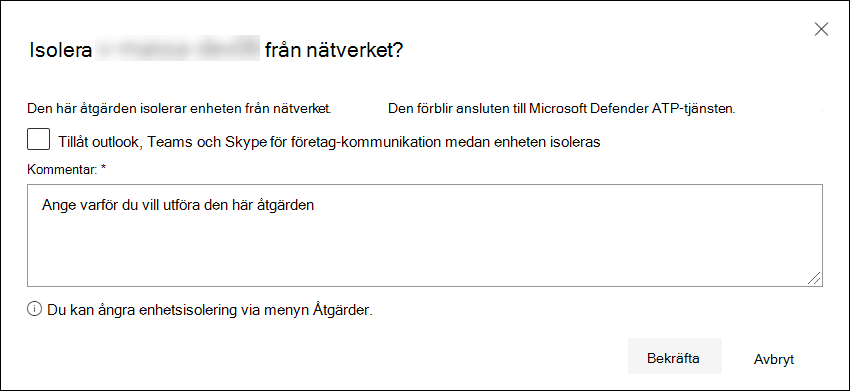

# Vidta svarsåtgärder på en enhet

[!INCLUDE [Microsoft 365 Defender rebranding](../../includes/microsoft-defender.md)]

**Gäller för:**
- [Microsoft Defender för Endpoint](https://go.microsoft.com/fwlink/?linkid=2154037)

>Vill du använda Defender för Slutpunkt? [Registrera dig för en kostnadsfri utvärderingsversion.](https://www.microsoft.com/microsoft-365/windows/microsoft-defender-atp?ocid=docs-wdatp-respondmachine-abovefoldlink) 

Svara snabbt på identifierade attacker genom att isolera enheter eller samla in ett undersökningspaket. När du har vidtar åtgärder på enheter kan du kontrollera aktivitetsinformation i Åtgärdscenter.

Svarsåtgärder löper högst upp på en specifik enhet och omfattar:

- Hantera taggar
- Initiera automatisk undersökning
- Starta Live Response-session
- Samla in undersökningspaket
- Kör antivirusgenomsökning
- Begränsa körning av program
- Identifiera enhet
- Konsultera en hotexpert
- Åtgärdscenter

 Du hittar enhetssidor från någon av följande vyer:

- **Instrumentpanel för** säkerhetsåtgärder – Välj ett enhetsnamn på enheterna på riskkortet.
- **Telefonaviseringar** – Välj enhetsnamnet bredvid enhetsikonen från aviseringskön.
- **Listan Enheter** – Välj rubriken för enhetsnamnet i listan över enheter.
- **Sökruta** – Välj enhet i listrutan och ange enhetens namn.

>[!IMPORTANT]
> - De här svarsåtgärderna är endast tillgängliga för enheter i Windows 10, version 1703 eller senare. 
> - För icke-Windows-plattformar är svarsfunktioner (till exempel enhetsisolering) beroende av tredjepartsfunktionerna.

## Hantera taggar

Lägg till eller hantera taggar för att skapa en logisk grupp med anknytning. Enhetstaggar stöder korrekt mappning av nätverket, så att du kan bifoga olika taggar för att fånga sammanhang och möjliggöra skapande av dynamiska listor som en del av ett problem.

Mer information om enhetstaggar finns i [Skapa och hantera enhetstaggar.](machine-tags.md)

## Initiera automatisk undersökning

Du kan starta en ny, allmän automatisk undersökning på enheten om det behövs. Medan en undersökning körs läggs alla andra aviseringar som genereras från enheten till i en pågående automatiserad undersökning tills undersökningen har slutförts. Om samma hot visas på andra enheter läggs dessa enheter dessutom till i undersökningen.

Mer information om automatiserade undersökningar finns i [Översikt över automatiserade undersökningar.](automated-investigations.md)

## Starta Live Response-session

Live response är en funktion som ger dig omedelbar åtkomst till en enhet med hjälp av en anslutning för fjärrgränssnitt. Det ger dig möjlighet att göra djupgående undersökningsarbete och vidta omedelbart åtgärder för att snabbt identifiera hot – realtid.

Med live-svar kan du förbättra undersökningar genom att samla in tekniska data, köra skript, skicka misstänkta enheter för analys, åtgärda hot och proaktivt leta efter nya hot.

Mer information om livesvar finns i Undersöka [enheter på enheter som använder live-svar.](live-response.md)

## Samla in undersökningspaket från enheter

Som en del av undersökningen eller svarsprocessen kan du samla in ett undersökningspaket från en enhet. Genom att samla in undersökningspaketet kan du identifiera enhetens aktuella status och ytterligare förstå de verktyg och tekniker som används av attackeraren.

Om du vill ladda ned paketet (zip-filen) och undersöka händelser som inträffat på en enhet

1. Välj **Samla in undersökningspaket** från raden med svarsåtgärder högst upp på sidan enhet.
2. Ange i textrutan varför du vill utföra den här åtgärden. Välj **Bekräfta.**
3. ZIP-filen laddas ned

Alternativt sätt:

1. Välj **Åtgärdscenter** i avsnittet svarsåtgärder på sidan Enhet.

    

3. I åtgärdscenter väljer du Paketsamlingspaket som **är tillgängligt för att** ladda ned ZIP-filen.
  
    

Paketet innehåller följande mappar:

| Mapp | Beskrivning |
|:---|:---------|
|Autoruns | Innehåller en uppsättning filer som var och en representerar innehållet i registret för en känd automatisk startpunkt för start (ASEP) för att identifiera attackers beständiga plats på enheten.    
<b>OBS!</b> Om registernyckeln inte hittas innehåller filen följande meddelande: "FEL: Det gick inte att hitta den angivna registernyckeln eller värdet."
                                                                                                                                |
|Installerade program | Detta . CSV-filen innehåller en lista över installerade program som kan hjälpa dig att identifiera vad som är installerat på enheten. Mer information finns i [Win32_Product klass](https://go.microsoft.com/fwlink/?linkid=841509).                                                                                  |
|Nätverksanslutningar | Den här mappen innehåller en uppsättning datapunkter relaterade till anslutningsinformation som kan hjälpa dig att identifiera anslutning till misstänkta URL:er, attackerens kommando- och kontrollinfrastruktur (C&C), alla rörelser eller fjärranslutningar.   - ActiveNetConnections.txt – Visar protokollstatistik och aktuella TCP/IP-nätverksanslutningar. Ger möjlighet att leta efter misstänkta anslutningar som har gjorts av en process.    - Arp.txt – Visar den aktuella ARP-cachetabellen (Address Resolution Protocol) för alla gränssnitt.    ARP-cache kan visa ytterligare värdar i ett nätverk som har komprometterats eller misstänkta system i nätverket som kan ha använts för att köra en intern attack.   - DnsCache.txt – Visar innehållet i DNS-klientens resolvercache, som innehåller både poster som är förinstallerade från den lokala värdfilen och senast använda resursposter för namnfrågor som lösts av datorn. På så sätt kan du identifiera misstänkta anslutningar.    – IpConfig.txt – Visar den fullständiga TCP/IP-konfigurationen för alla adaptrar. Adaptrar kan representera fysiska gränssnitt, till exempel installerade nätverkskort eller logiska gränssnitt, till exempel fjärranslutningar.    - FirewallExecutionLog.txt och pfirewall.log                                                                                  |
| Prefetch-filer| Windows Prefetch-filer är utformade för att göra startprocessen snabbare. Den kan användas för att spåra alla filer som nyligen använts i systemet och hitta spårningar för program som kan ha tagits bort men fortfarande finns i förfilslistan.    - Prefetch-mapp – innehåller en kopia av förmappsfilerna från `%SystemRoot%\Prefetch` . Obs! Du rekommenderas att ladda ned ett förinladdat filvisningsprogram för att visa förindelningsfilerna.    – PrefetchFilesList.txt – Innehåller en lista över alla kopierade filer som kan användas för att spåra om det har varit fel med kopieringen av förmappen.                                                                                                      |
| Processer| Innehåller en . CSV-fil med en lista över processer som körs, vilket gör det möjligt att identifiera aktuella processer som körs på enheten. Det kan vara användbart när du identifierar en misstänkt process och dess status.                                                                                                                                                                                                       |
| Schemalagda aktiviteter| Innehåller en . CSV-fil med de schemalagda aktiviteterna, som kan användas för att identifiera rutiner som utförs automatiskt på en vald enhet för att leta efter misstänkt kod som ställts in att köras automatiskt.                                                                                                                                                                                                      |
| Säkerhetshändelselogg| Innehåller säkerhetshändelseloggen, som innehåller poster med inloggnings- eller utloggningsaktivitet eller andra säkerhetsrelaterade händelser som anges av systemets granskningsprincip.   
<b>OBS!</b> Öppna händelseloggfilen i loggboken.
                                                                                    |
| Tjänster| Innehåller en . CSV-fil som visar tjänster och deras tillstånd.                                                                                      |
| SMB-sessioner (Message Block) i Windows Server | Här listas delad åtkomst till filer, skrivare och serieportar samt övrig kommunikation mellan noder i ett nätverk. Det kan hjälpa dig att identifiera exfiltrering eller rörelser.    Innehåller filer för SMBInboundSessions och SMBOutboundSession.    
<b>OBS!</b> Om det inte finns några sessioner (inkommande eller utgående) får du en textfil där det står att det inte finns några SMB-sessioner hittades.
                                                                                                                          |
| Systeminformation| Innehåller en SystemInformation.txt fil som listar systeminformation som OS-version och nätverkskort.                                                                                     |
| Temp-kataloger| Innehåller en uppsättning textfiler med en lista över de filer som finns i %Temp% för varje användare i systemet.    Det kan hjälpa dig att spåra misstänkta filer som en attackerare kan ha släppt i systemet.    
<b>OBS!</b> Om filen innehåller följande meddelande: "Systemet kan inte hitta sökvägen angiven", innebär det att det inte finns någon temp-katalog för den här användaren och kan därför vara på att användaren inte loggade in i systemet.
                                                                                                                                         |
| Användare och grupper| Innehåller en lista över filer som var och en representerar en grupp och dess medlemmar.                                                                                                                   |
|WdSupportLogs| Ger MpCmdRunLog.txt och MPSupportFiles.cab     
<b>OBS!</b> Den här mappen skapas bara i Windows 10, version 1709 eller senare med samlad uppdatering i februari 2020 eller senare:  Win10 1709 (RS3) Version 16299.1717 : [KB4537816](https://support.microsoft.com/en-us/help/4537816/windows-10-update-kb4537816)   Win10 1803 (RS4) version 17134.1345 : [KB4537795](https://support.microsoft.com/en-us/help/4537795/windows-10-update-kb4537795)   Win10 1809 (RS5) Version 17763.1075 : [KB4537818](https://support.microsoft.com/en-us/help/4537818/windows-10-update-kb4537818)   Win10 1903/1909 (19h1/19h2) version 18362.693 och 18363.693 : [KB4535996](https://support.microsoft.com/en-us/help/4535996/windows-10-update-kb4535996) 
                                                                                                                    |
| CollectionSummaryReport.xls| Den här filen är en sammanfattning av samlingen av undersökningspaket, den innehåller listan med datapunkter, kommandot som används för att extrahera data, körningsstatus och felkoden vid fel. Du kan använda den här rapporten för att spåra om paketet innehåller alla förväntade data och identifiera om det finns fel. |

## Kör sökning med Microsoft Defender Antivirus på enheter

Som en del av undersökningen eller svarsprocessen kan du via fjärren starta en antivirussökning för att identifiera och åtgärda skadlig programvara som kan finnas på en komprometterad enhet.

>[!IMPORTANT]
>- Den här åtgärden är tillgänglig för enheter i Windows 10, version 1709 eller senare.
>- En genomsökning av Microsoft Defender Antivirus (Microsoft Defender AV) kan köras tillsammans med andra antivirusprogramn, oavsett om Microsoft Defender AV är den aktiva antiviruslösningen eller inte. Microsoft Defender AV kan vara i passivt läge. Mer information finns i Kompatibilitet [för Microsoft Defender Antivirus.](https://docs.microsoft.com/windows/security/threat-protection/microsoft-defender-antivirus/microsoft-defender-antivirus-compatibility.md)

En av dem du har valt Kör **antivirussökning**, välj den genomsökningstyp som du vill köra (snabb eller fullständig) och lägg till en kommentar innan du bekräftar skanningen.

Åtgärdscenter kommer att visa genomsökningsinformationen och enhetens tidslinje kommer att innehålla en ny händelse, vilket återspeglar att en genomsökningsåtgärd har skickats in på enheten. Microsoft Defender AV-aviseringar visar alla identifieringar som upptäckts under genomsökningen.

>[!NOTE]
>När en genomsökning utlöses med Defender för slutpunktssvarsåtgärd gäller fortfarande värdet ScanAvgCPULoadFactor för Microsoft Defender antivirus (GenomsökningAvgCPULoadFactor) och begränsar genomsökningens CPU-påverkan.  Om ScanAvgCPULoadFactor inte har konfigurerats är standardvärdet en gräns på 50 % maximal CPU-belastning vid en genomsökning. 
>Mer information finns i [configure-advanced-scan-types-microsoft-defender-antivirus](https://docs.microsoft.com/windows/security/threat-protection/microsoft-defender-antivirus/configure-advanced-scan-types-microsoft-defender-antivirus).

## Begränsa körning av program

Förutom att stoppa skadliga processer som innehåller en attack kan du låsa en enhet och förhindra att efterföljande försök till potentiellt skadliga program körs.

>[!IMPORTANT]
> - Den här åtgärden är tillgänglig för enheter i Windows 10, version 1709 eller senare.
> - Den här funktionen är tillgänglig om din organisation använder Microsoft Defender Antivirus.
> - Den här åtgärden måste uppfylla formaten för sekretesspolicyn och signeringskraven för Windows Defender-programkontrollen. Mer information finns i Format [och signering av kodintegritetsprincip.](https://docs.microsoft.com/windows/device-security/device-guard/requirements-and-deployment-planning-guidelines-for-device-guard#code-integrity-policy-formats-and-signing)

För att hindra ett program från att köras tillämpas en kodintegritetsprincip som bara tillåter att filer körs om de är signerade av ett certifikat utfärdat av Microsoft. Den här begränsningsmetoden kan förhindra att en attack kontrollerar komprometterade enheter och utför ytterligare skadliga aktiviteter.

>[!NOTE]
>Du kan när som helst ångra begränsningen av program från att köras. Knappen på sidan enhet ändras till Ta bort **appbegränsningar och** du gör sedan samma steg som om du vill begränsa programkörningen.

När du har valt **Begränsa programkörning** på enheten skriver du en kommentar och väljer **Bekräfta.** Åtgärdscenter visar genomsökningsinformationen och enhetens tidslinje kommer att innehålla en ny händelse.

**Meddelande på enhetens användare:** 
När en app är begränsad visas följande meddelande för att informera användaren om att en app är begränsad från att köras:

## Isolera enheter från nätverket

Beroende på hur allvarlig attacken är och enhetens känslighet kan du behöva isolera enheten från nätverket. Den här åtgärden kan förhindra att attackeraren kontrollerar den komprometterade enheten och utför ytterligare aktiviteter, t.ex. att föra in data och röra sig fritt.

>[!IMPORTANT]
>- Fullständig avgränsning är tillgängligt för enheter i Windows 10, version 1703.
>- Selektiv avgränsning är tillgängligt för enheter med Windows 10, version 1709 eller senare.

Den här funktionen för enhetsisolering kopplar bort den komprometterade enheten från nätverket samtidigt som anslutningen till Defender för slutpunktstjänsten bibehålls, som fortsätter att övervaka enheten.

I Windows 10, version 1709 eller senare har du ytterligare kontroll över nätverkisolering. Du kan också välja att aktivera Outlook, Microsoft Teams och Skype för företag-anslutning (kallas även selektiv avgränsning).

>[!NOTE]
>Du kan när som helst återansluta enheten till nätverket. Knappen på sidan enhet ändras till Släpp från avgränsning och sedan gör du på samma sätt som när du isolerar enheten.

När du har valt **Isolera enhet** på enhetens sida skriver du en kommentar och väljer **Bekräfta**. Åtgärdscenter visar genomsökningsinformationen och enhetens tidslinje kommer att innehålla en ny händelse.

>[!NOTE]
>Enheten förblir ansluten till Defender för slutpunktstjänsten även om den är isolerad från nätverket. Om du har valt att aktivera Outlook- och Skype för företag-kommunikation kommer du att kunna kommunicera till användaren medan enheten isoleras.

**Meddelande på enhetens användare:** 
När en enhet isoleras visas följande meddelande för att informera användaren om att enheten isoleras från nätverket:

## Konsultera en hotexpert

Du kan kontakta en Microsoft-expert för att få mer information om en potentiellt komprometterad enhet eller redan komprometterade enheter. Microsoft Threat Experts kan engageras direkt från Säkerhetscenter i Microsoft Defender för att få snabba och korrekta svar. Experter ger insikter inte bara om en potentiellt komprometterad enhet, utan även för att bättre förstå komplexa hot, riktade attackmeddelanden som du får eller om du behöver mer information om aviseringar eller ett informationssammanhang för hot som visas på din portalinstrumentpanel.

Mer [information finns i Kontakta en Microsoft Threat Expert.](https://docs.microsoft.com/microsoft-365/security/defender-endpoint/configure-microsoft-threat-experts#consult-a-microsoft-threat-expert-about-suspicious-cybersecurity-activities-in-your-organization)

## Kontrollera aktivitetsinformation i Åtgärdscenter

I **Åtgärdscenter** finns information om åtgärder som har vidtagits på en enhet eller en fil. Du kommer då att kunna se följande information:

- Samling av undersökningspaket
- Antivirussökning
- Appbegränsning
- Enhetsisolering

All annan relaterad information visas också, till exempel datum/tid för inskickning, skickande användare och om åtgärden lyckades eller misslyckades.

## Relaterat ämne
- [Vidta svarsåtgärder för en fil](respond-file-alerts.md)
- [Rapportera felaktigheter](https://docs.microsoft.com/microsoft-365/security/defender-endpoint/tvm-security-recommendation#report-inaccuracy)
