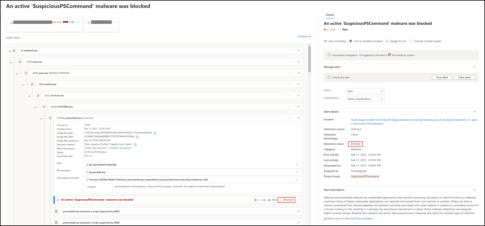

# Granska aviseringar i Microsoft Defender för SlutpunktReview alerts in Microsoft Defender for Endpoint

[!INCLUDE [Microsoft 365 Defender rebranding](../../includes/microsoft-defender.md)]

**Gäller för:****Applies to:**
- [Microsoft Defender för EndpointMicrosoft Defender for Endpoint](https://go.microsoft.com/fwlink/?linkid=2154037)

>Vill du använda Defender för Slutpunkt?Want to experience Defender for Endpoint? [Registrera dig för en kostnadsfri utvärderingsversion.Sign up for a free trial.](https://www.microsoft.com/microsoft-365/windows/microsoft-defender-atp?ocid=docs-wdatp-managealerts-abovefoldlink)

Aviseringssidan i Microsoft Defender för Slutpunkt ger full kontext för aviseringen genom att kombinera attacksignaler och aviseringar relaterade till den valda aviseringen för att skapa en detaljerad aviseringsartikel.The alert page in Microsoft Defender for Endpoint provides full context to the alert, by combining attack signals and alerts related to the selected alert, to construct a detailed alert story.

Du kan snabbt organisera, undersöka och vidta effektiva åtgärder på aviseringar som påverkar organisationen.Quickly triage, investigate, and take effective action on alerts that affect your organization. Förstå varför de utlöstes och deras påverkan från en plats.Understand why they were triggered, and their impact from one location. Läs mer i den här översikten.Learn more in this overview.

> [!VIDEO https://www.microsoft.com/videoplayer/embed/RE4yiO5]

## Komma igång med en aviseringGetting started with an alert

Om du väljer namnet på en avisering i Defender för Endpoint hamnar du på aviseringssidan.Selecting an alert's name in Defender for Endpoint will land you on its alert page. På aviseringssidan visas all information i samband med den valda aviseringen.On the alert page, all the information will be shown in context of the selected alert. Varje aviseringssida består av 4 avsnitt:Each alert page consists of 4 sections:

1. **Aviseringsrubriken** visar aviseringens namn och finns där för att påminna dig om vilken avisering som startade den aktuella undersökningen oavsett vad du valde på sidan.**The alert title** shows the alert's name and is there to remind you which alert started your current investigation regardless of what you have selected on the page.
2. [**Berörda tillgångar**](#review-affected-assets) visar korten för enheter och användare som påverkas av den här aviseringen som kan klickas för ytterligare information och åtgärder.[**Affected assets**](#review-affected-assets) lists cards of devices and users affected by this alert that are clickable for further information and actions.
3. I **aviseringsartikeln** visas alla enheter som är relaterade till aviseringen, sammankopplade med en trädvy.The **alert story** displays all entities related to the alert, interconnected by a tree view. Aviseringen i rubriken kommer att vara den som är i fokus när du först kommer till den valda aviseringens sida.The alert in the title will be the one in focus when you first land on your selected alert's page. Enheter i aviseringsinformationen är expanderbara och klickbara, för att ge ytterligare information och underlätta svar genom att göra det möjligt att vidta åtgärder direkt i kontexten för aviseringssidan.Entities in the alert story are expandable and clickable, to provide additional information and expedite response by allowing you to take actions right in the context of the alert page. Använd aviseringsartikeln för att starta din undersökning.Use the alert story to start your investigation. Läs mer i [Undersöka aviseringar i Microsoft Defender för Slutpunkt.](/microsoft-365/security/defender-endpoint/investigate-alerts)Learn how in [Investigate alerts in Microsoft Defender for Endpoint](/microsoft-365/security/defender-endpoint/investigate-alerts).
4. I **informationsfönstret** visas först information om den valda aviseringen med information och åtgärder relaterade till den här aviseringen.The **details pane** will show the details of the selected alert at first, with details and actions related to this alert. Om du väljer någon av de berörda tillgångarna eller enheterna i aviseringsinformationen ändras informationsfönstret för att ge sammanhangsberoende information och åtgärder för det valda objektet.If you select any of the affected assets or entities in the alert story, the details pane will change to provide contextual information and actions for the selected object.

Observera identifieringsstatus för din avisering.Note the detection status for your alert. 
- Förhindrades – Den misstänkta åtgärden som du försökte undvika.Prevented – The attempted suspicious action was avoided. Till exempel har en fil antingen inte skrivits på disken eller körts.For example, a file either wasn’t written to disk or executed.

- Blockerad – Misstänkt beteende utfördes och blockerades sedan.Blocked – Suspicious behavior was executed and then blocked. En process utfördes till exempel, men eftersom misstänkt beteende därefter visades i den, avslutas processen.For example, a process was executed but because it subsequently exhibited suspicious behaviors, the process was terminated.

- Upptäckt – En attack identifierades och är eventuellt fortfarande aktiv.Detected – An attack was detected and is possibly still active.

Du kan sedan  också granska automatisk undersökningsinformation i aviseringens informationsfönster för att se vilka åtgärder som redan har vidtagits samt läsa beskrivningen av aviseringen för rekommenderade åtgärder.You can then also review the *automated investigation details* in your alert's details pane, to see which actions were already taken, as well as reading the alert's description for recommended actions.

Annan information som är tillgänglig i informationsfönstret när aviseringen öppnas innehåller MITRE-tekniker, källa och ytterligare kontextinformation.Other information available in the details pane when the alert opens includes MITRE techniques, source, and additional contextual details.

## Granska påverkade tillgångarReview affected assets

Om du väljer en enhet eller ett användarkort i avsnitten för de berörda tillgångarna växlas du till informationen om enheten eller användaren i informationsfönstret.Selecting a device or a user card in the affected assets sections will switch to the details of the device or user in the details pane.

- **För enheter** visar informationsfönstret information om själva enheten, som Domän, Operativsystem och IP.**For devices**, the details pane will display information about the device itself, like Domain, Operating System, and IP. Aktiva aviseringar och inloggade användare på enheten är också tillgängliga.Active alerts and the logged on users on that device are also available. Du kan vidta åtgärder omedelbart genom att isolera enheten, begränsa appkörningen eller köra en antivirussökning.You can take immediate action by isolating the device, restricting app execution, or running an antivirus scan. Alternativt kan du samla in ett undersökningspaket, initiera en automatisk undersökning eller gå till enhetssidan för att undersöka ur enhetens perspektiv.Alternatively, you could collect an investigation package, initiate an automated investigation, or go to the device page to investigate from the device's point of view.

   

- **För användare** visar informationsfönstret detaljerad användarinformation, till exempel användarens SAM-namn och SID, samt inloggningstyper som utförs av användaren och eventuella aviseringar och incidenter relaterade till den.**For users**, the details pane will display detailed user information, such as the user's SAM name and SID, as well as logon types performed by this user and any alerts and incidents related to it. Du kan välja *Öppna användarsida* för att fortsätta undersökningen från användarens perspektiv.You can select *Open user page* to continue the investigation from that user's point of view.

   

## Relaterade ämnenRelated topics

- [Visa och ordna incidentkönView and organize the incidents queue](view-incidents-queue.md)
- [Undersöka incidenterInvestigate incidents](investigate-incidents.md)
- [Hantera incidenterManage incidents](manage-incidents.md)
