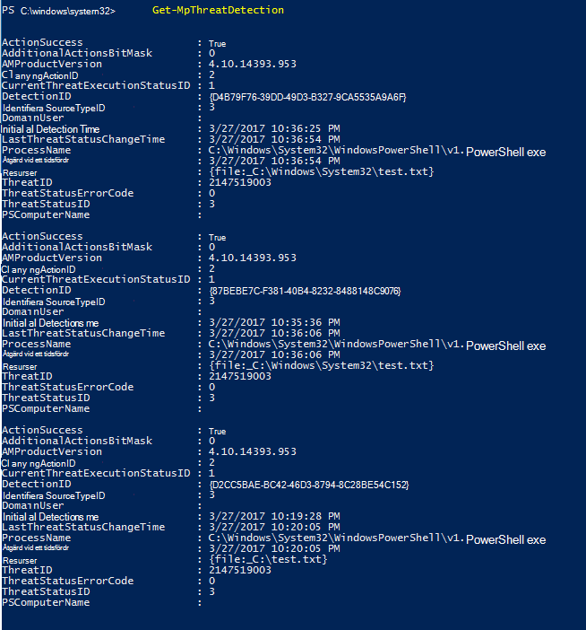
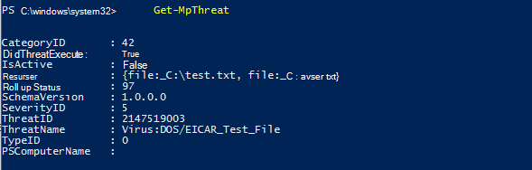

# <a name="review-microsoft-defender-antivirus-scan-results"></a>Granska Microsoft Defender Antivirus genomsökningsresultat

[!INCLUDE [Microsoft 365 Defender rebranding](../../includes/microsoft-defender.md)]


**Gäller för:**

- [Microsoft Defender för Endpoint](/microsoft-365/security/defender-endpoint/)

När en Microsoft Defender Antivirus är klar, oavsett [](run-scan-microsoft-defender-antivirus.md) om det är en sökning på begäran eller [schemalagd,](scheduled-catch-up-scans-microsoft-defender-antivirus.md)spelas resultatet in och du kan visa resultaten. 


## <a name="use-configuration-manager-to-review-scan-results"></a>Granska genomsökningsresultaten med Konfigurationshanteraren

Se [Hur du övervakar Endpoint Protection status](/configmgr/protect/deploy-use/monitor-endpoint-protection).

## <a name="use-powershell-cmdlets-to-review-scan-results"></a>Använda PowerShell-cmdlets för att granska genomsökningsresultat

Följande cmdlet returnerar varje identifiering på slutpunkten. Om det finns flera identifieringar av samma hot listas varje identifiering separat, baserat på tiden för varje identifiering:

```PowerShell
Get-MpThreatDetection
```



Du kan ange `-ThreatID` för att begränsa utdata för att bara visa identifieringar för ett visst hot.

Om du vill lista identifieringar av hot, men kombinera identifieringar av samma hot till ett enda objekt, kan du använda följande cmdlet:

```PowerShell
Get-MpThreat
```



Se [Använda PowerShell-cmdlets](use-powershell-cmdlets-microsoft-defender-antivirus.md) för att konfigurera och köra Microsoft Defender Antivirus- och [Defender-cmdlets för](/powershell/module/defender/) mer information om hur du använder PowerShell med Microsoft Defender Antivirus.

## <a name="use-windows-management-instruction-wmi-to-review-scan-results"></a>Granska Windows genom att använda WMI (Management Instruction)

Använd metoden [ **Get**  för MSFT_MpThreat och **MSFT_MpThreatDetection**](/previous-versions/windows/desktop/defender/windows-defender-wmiv2-apis-portal) klasser.


## <a name="related-articles"></a>Relaterade artiklar

- [Anpassa, initiera och granska resultaten av Microsoft Defender Antivirus genomsökningar och åtgärder](customize-run-review-remediate-scans-microsoft-defender-antivirus.md)
- [Microsoft Defender Antivirus i Windows 10](microsoft-defender-antivirus-in-windows-10.md)