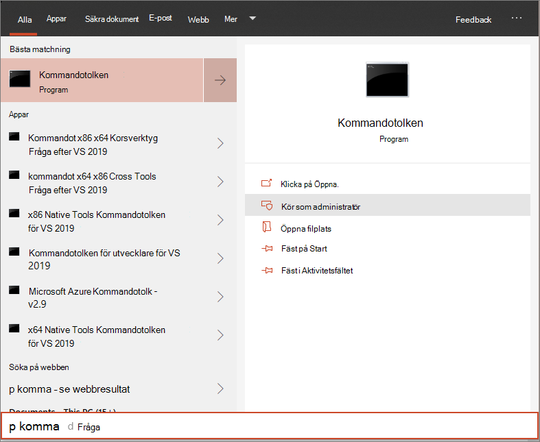

# <a name="run-a-detection-test-on-a-newly-onboarded-microsoft-defender-for-endpoint-device"></a><span data-ttu-id="f282f-104">Köra ett identifieringstest på en nyligen onboarded Microsoft Defender för Endpoint-enhet</span><span class="sxs-lookup"><span data-stu-id="f282f-104">Run a detection test on a newly onboarded Microsoft Defender for Endpoint device</span></span> 

[!INCLUDE [Microsoft 365 Defender rebranding](../../includes/microsoft-defender.md)]


<span data-ttu-id="f282f-105">**Gäller för:**</span><span class="sxs-lookup"><span data-stu-id="f282f-105">**Applies to:**</span></span>
- <span data-ttu-id="f282f-106">Windows 10-versioner som stöds</span><span class="sxs-lookup"><span data-stu-id="f282f-106">Supported Windows 10 versions</span></span>
- <span data-ttu-id="f282f-107">Windows Server 2012 R2</span><span class="sxs-lookup"><span data-stu-id="f282f-107">Windows Server 2012 R2</span></span>
- <span data-ttu-id="f282f-108">Windows Server 2016</span><span class="sxs-lookup"><span data-stu-id="f282f-108">Windows Server 2016</span></span>
- <span data-ttu-id="f282f-109">Windows Server, version 1803</span><span class="sxs-lookup"><span data-stu-id="f282f-109">Windows Server, version 1803</span></span>
- <span data-ttu-id="f282f-110">Windows Server, 2019</span><span class="sxs-lookup"><span data-stu-id="f282f-110">Windows Server, 2019</span></span>
- [<span data-ttu-id="f282f-111">Microsoft Defender för Endpoint</span><span class="sxs-lookup"><span data-stu-id="f282f-111">Microsoft Defender for Endpoint</span></span>](https://go.microsoft.com/fwlink/?linkid=2154037)
- [<span data-ttu-id="f282f-112">Microsoft 365 Defender</span><span class="sxs-lookup"><span data-stu-id="f282f-112">Microsoft 365 Defender</span></span>](https://go.microsoft.com/fwlink/?linkid=2118804)

> <span data-ttu-id="f282f-113">Vill du uppleva Microsoft Defender för Slutpunkt?</span><span class="sxs-lookup"><span data-stu-id="f282f-113">Want to experience Microsoft Defender for Endpoint?</span></span> [<span data-ttu-id="f282f-114">Registrera dig för en kostnadsfri utvärderingsversion.</span><span class="sxs-lookup"><span data-stu-id="f282f-114">Sign up for a free trial.</span></span>](https://www.microsoft.com/microsoft-365/windows/microsoft-defender-atp?ocid=docs-wdatp-exposedapis-abovefoldlink)

<span data-ttu-id="f282f-115">Kör följande PowerShell-skript på en nyligen onboarded-enhet för att verifiera att den rapporterar till Defender för Slutpunkt-tjänsten.</span><span class="sxs-lookup"><span data-stu-id="f282f-115">Run the following PowerShell script on a newly onboarded device to verify that it is properly reporting to the Defender for Endpoint service.</span></span>

1. <span data-ttu-id="f282f-116">Skapa en mapp: 'C:\test-MDATP-test'.</span><span class="sxs-lookup"><span data-stu-id="f282f-116">Create a folder:  'C:\test-MDATP-test'.</span></span>
2. <span data-ttu-id="f282f-117">Öppna en upphöjd kommandoradsfråga på enheten och kör skriptet:</span><span class="sxs-lookup"><span data-stu-id="f282f-117">Open an elevated command-line prompt on the device and run the script:</span></span>

   1. <span data-ttu-id="f282f-118">Gå till **Start** och skriv **cmd**.</span><span class="sxs-lookup"><span data-stu-id="f282f-118">Go to **Start** and type **cmd**.</span></span>

   1. <span data-ttu-id="f282f-119">Högerklicka på **Kommandotolken** och välj **Kör som administratör.**</span><span class="sxs-lookup"><span data-stu-id="f282f-119">Right-click **Command Prompt** and select **Run as administrator**.</span></span>

      

3. <span data-ttu-id="f282f-121">När du uppmanas till det kopierar du och kör följande kommando:</span><span class="sxs-lookup"><span data-stu-id="f282f-121">At the prompt, copy and run the following command:</span></span>

   ```powershell
   powershell.exe -NoExit -ExecutionPolicy Bypass -WindowStyle Hidden $ErrorActionPreference= 'silentlycontinue';(New-Object System.Net.WebClient).DownloadFile('http://127.0.0.1/1.exe', 'C:\\test-MDATP-test\\invoice.exe');Start-Process 'C:\\test-MDATP-test\\invoice.exe'
   ```

<span data-ttu-id="f282f-122">Fönstret Kommandotolken stängs automatiskt.</span><span class="sxs-lookup"><span data-stu-id="f282f-122">The Command Prompt window will close automatically.</span></span> <span data-ttu-id="f282f-123">Om det lyckas markeras det som slutfört och en ny avisering visas i portalen för den onboarded enheten om ungefär 10 minuter.</span><span class="sxs-lookup"><span data-stu-id="f282f-123">If successful, the detection test will be marked as completed and a new alert will appear in the portal for the onboarded device in approximately 10 minutes.</span></span>

## <a name="related-topics"></a><span data-ttu-id="f282f-124">Relaterade ämnen</span><span class="sxs-lookup"><span data-stu-id="f282f-124">Related topics</span></span>
- [<span data-ttu-id="f282f-125">Introducera Windows 10-enheter</span><span class="sxs-lookup"><span data-stu-id="f282f-125">Onboard Windows 10 devices</span></span>](configure-endpoints.md)
- [<span data-ttu-id="f282f-126">Onboard servers</span><span class="sxs-lookup"><span data-stu-id="f282f-126">Onboard servers</span></span>](configure-server-endpoints.md)
- [<span data-ttu-id="f282f-127">Felsöka problem med Introduktion till Slutpunkt för Microsoft Defender</span><span class="sxs-lookup"><span data-stu-id="f282f-127">Troubleshoot Microsoft Defender for Endpoint onboarding issues</span></span>](https://docs.microsoft.com/microsoft-365/security/defender-endpoint/troubleshoot-onboarding)
