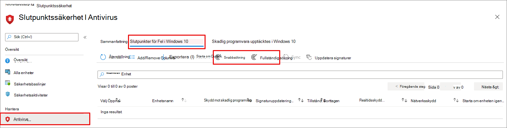

# <a name="configure-and-run-on-demand-microsoft-defender-antivirus-scans"></a><span data-ttu-id="3b279-104">Konfigurera och kör genomsökningar på begäran för Microsoft Defender Antivirus</span><span class="sxs-lookup"><span data-stu-id="3b279-104">Configure and run on-demand Microsoft Defender Antivirus scans</span></span>

<span data-ttu-id="3b279-105">**Gäller för:**</span><span class="sxs-lookup"><span data-stu-id="3b279-105">**Applies to:**</span></span>

- [<span data-ttu-id="3b279-106">Microsoft Defender för Endpoint</span><span class="sxs-lookup"><span data-stu-id="3b279-106">Microsoft Defender for Endpoint</span></span>](/microsoft-365/security/defender-endpoint/)

<span data-ttu-id="3b279-107">Du kan köra en sökning på begäran på enskilda slutpunkter.</span><span class="sxs-lookup"><span data-stu-id="3b279-107">You can run an on-demand scan on individual endpoints.</span></span> <span data-ttu-id="3b279-108">Dessa genomsökningar startar omedelbart och du kan definiera parametrar för skanningen, till exempel plats eller typ.</span><span class="sxs-lookup"><span data-stu-id="3b279-108">These scans will start immediately, and you can define parameters for the scan, such as the location or type.</span></span>

## <a name="quick-scan-versus-full-scan"></a><span data-ttu-id="3b279-109">Snabbsökning jämfört med fullständig sökning</span><span class="sxs-lookup"><span data-stu-id="3b279-109">Quick scan versus full scan</span></span>

<span data-ttu-id="3b279-110">Snabbsökning söker igenom alla platser där skadlig programvara kan registreras för att börja med systemet, till exempel registernycklar och kända Windows startmappar.</span><span class="sxs-lookup"><span data-stu-id="3b279-110">Quick scan looks at all the locations where there could be malware registered to start with the system, such as registry keys and known Windows startup folders.</span></span>

> [!IMPORTANT]
> <span data-ttu-id="3b279-111">Microsoft Defender Antivirus körs i kontexten för [LocalSystem-kontot](/windows/win32/services/localsystem-account) när du utför en lokal genomsökning.</span><span class="sxs-lookup"><span data-stu-id="3b279-111">Microsoft Defender Antivirus runs in the context of the [LocalSystem](/windows/win32/services/localsystem-account) account when performing a local scan.</span></span> <span data-ttu-id="3b279-112">För nätverkssökningar används enhetskontots kontext.</span><span class="sxs-lookup"><span data-stu-id="3b279-112">For network scans, it uses the context of the device account.</span></span> <span data-ttu-id="3b279-113">Om domänenhetskontot inte har tillräcklig behörighet för att komma åt resursen fungerar inte genomsökningen.</span><span class="sxs-lookup"><span data-stu-id="3b279-113">If the domain device account doesn't have appropriate permissions to access the share, the scan won't work.</span></span> <span data-ttu-id="3b279-114">Kontrollera att enheten har behörigheter till den åtkomstnätverksresurs som används.</span><span class="sxs-lookup"><span data-stu-id="3b279-114">Ensure that the device has permissions to the access network share.</span></span>

<span data-ttu-id="3b279-115">I kombination [med ständigt realtidsskydd](configure-real-time-protection-microsoft-defender-antivirus.md)ger en snabb genomsökning bra täckning både för skadlig programvara som börjar med system- och kernel-nivå-skadlig programvara.</span><span class="sxs-lookup"><span data-stu-id="3b279-115">Combined with [always-on real-time protection capability](configure-real-time-protection-microsoft-defender-antivirus.md), a quick scan helps provide strong coverage both for malware that starts with the system and kernel-level malware.</span></span> <span data-ttu-id="3b279-116">Skydd i realtid granskar alltid filer när de öppnas och stängs, och när en användare navigerar till en mapp.</span><span class="sxs-lookup"><span data-stu-id="3b279-116">Always-on, real-time protection reviews files when they're opened and closed, and whenever a user navigates to a folder.</span></span> <span data-ttu-id="3b279-117">Som standard körs snabbsökningar påmonterade flyttbara enheter, till exempel USB-enheter.</span><span class="sxs-lookup"><span data-stu-id="3b279-117">By default, quick scans run on mounted removable devices, such as USB drives.</span></span> <span data-ttu-id="3b279-118">I de flesta fall är en snabb genomsökning lämplig för att hitta skadlig programvara som inte hämtades med realtidsskydd.</span><span class="sxs-lookup"><span data-stu-id="3b279-118">In most instances, a quick scan is adequate to find malware that wasn't picked up by real-time protection.</span></span>

<span data-ttu-id="3b279-119">En fullständig genomsökning kan vara användbar när ett skadlig kodhot rapporteras på en slutpunkt.</span><span class="sxs-lookup"><span data-stu-id="3b279-119">A full scan can be useful when a malware threat is reported on an endpoint.</span></span> <span data-ttu-id="3b279-120">Sökningen kan identifiera om det finns inaktiva komponenter som kräver en mer omfattande rensning.</span><span class="sxs-lookup"><span data-stu-id="3b279-120">The scan can identify whether there are any inactive components that require a more thorough clean-up.</span></span> <span data-ttu-id="3b279-121">Microsoft rekommenderar dock att snabbskanningar används i stället för fullständiga skanningar i stället för att göra sökningar i allmänhet.</span><span class="sxs-lookup"><span data-stu-id="3b279-121">However, Microsoft generally recommends using quick scans instead of full scans.</span></span> <span data-ttu-id="3b279-122">En fullständig genomsökning kan ta några timmar eller dagar att slutföra, beroende på hur mycket och vilken typ av data som behöver skannas.</span><span class="sxs-lookup"><span data-stu-id="3b279-122">A full scan can take a few hours or days to complete, depending on the amount and type of data that needs to be scanned.</span></span> 

> [!TIP]
> <span data-ttu-id="3b279-123">Mer information om skillnaderna mellan snabba och fullständiga skanningar finns i Snabbsökning jämfört med [fullständig genomsökning och anpassad sökning.](scheduled-catch-up-scans-microsoft-defender-antivirus.md#quick-scan-versus-full-scan-and-custom-scan)</span><span class="sxs-lookup"><span data-stu-id="3b279-123">To learn more about the differences between quick and full scans, see [Quick scan versus full scan and custom scan](scheduled-catch-up-scans-microsoft-defender-antivirus.md#quick-scan-versus-full-scan-and-custom-scan).</span></span>

## <a name="use-microsoft-endpoint-manager-to-run-a-scan"></a><span data-ttu-id="3b279-124">Använda Microsoft Endpoint Manager för att köra en sökning</span><span class="sxs-lookup"><span data-stu-id="3b279-124">Use Microsoft Endpoint Manager to run a scan</span></span>

1. <span data-ttu-id="3b279-125">Gå till Microsoft Endpoint Manager administrationscenter ( [https://endpoint.microsoft.com](https://endpoint.microsoft.com) ) och logga in.</span><span class="sxs-lookup"><span data-stu-id="3b279-125">Go to the Microsoft Endpoint Manager admin center ([https://endpoint.microsoft.com](https://endpoint.microsoft.com)) and log in.</span></span>
2. <span data-ttu-id="3b279-126">Välj **Endpoint Security**  >  **Antivirus**.</span><span class="sxs-lookup"><span data-stu-id="3b279-126">Choose **Endpoint security** > **Antivirus**.</span></span>
3. <span data-ttu-id="3b279-127">I listan över flikar väljer du Windows 10 **slutpunkter som inte är fel**.</span><span class="sxs-lookup"><span data-stu-id="3b279-127">In the list of tabs, select **Windows 10 unhealthy endpoints**.</span></span>
4. <span data-ttu-id="3b279-128">I listan med åtgärder väljer du **Snabbsökning eller** **Fullständig sökning.**</span><span class="sxs-lookup"><span data-stu-id="3b279-128">From the list of actions provided, select **Quick Scan** or **Full Scan**.</span></span>

<span data-ttu-id="3b279-129">[](images/mem-antivirus-scan-on-demand.png#lightbox)</span><span class="sxs-lookup"><span data-stu-id="3b279-129">[  ](images/mem-antivirus-scan-on-demand.png#lightbox)</span></span>

> [!TIP]
> <span data-ttu-id="3b279-130">Mer information om hur du använder Microsoft Endpoint Manager att köra en genomsökning finns i Program mot skadlig programvara och [brandväggsåtgärder:](/configmgr/protect/deploy-use/endpoint-antimalware-firewall#how-to-perform-an-on-demand-scan-of-computers)Så här gör du en sökning på begäran.</span><span class="sxs-lookup"><span data-stu-id="3b279-130">For more information about using Microsoft Endpoint Manager to run a scan, see [Antimalware and firewall tasks: How to perform an on-demand scan](/configmgr/protect/deploy-use/endpoint-antimalware-firewall#how-to-perform-an-on-demand-scan-of-computers).</span></span>

## <a name="use-the-mpcmdrunexe-command-line-utility-to-run-a-scan"></a><span data-ttu-id="3b279-131">Använd mpcmdrun.exe för att köra en genomsökning</span><span class="sxs-lookup"><span data-stu-id="3b279-131">Use the mpcmdrun.exe command-line utility to run a scan</span></span>

<span data-ttu-id="3b279-132">Använd följande `-scan` parameter:</span><span class="sxs-lookup"><span data-stu-id="3b279-132">Use the following `-scan` parameter:</span></span>

```console
mpcmdrun.exe -scan -scantype 1
```

<span data-ttu-id="3b279-133">Mer information om hur du använder verktyget och ytterligare parametrar, inklusive hur du påbörjar en fullständig genomsökning eller definierar sökvägar, finns i använda kommandoradsverktyget mpcmdrun.exe för att konfigurera och hantera [Microsoft Defender Antivirus.](command-line-arguments-microsoft-defender-antivirus.md)</span><span class="sxs-lookup"><span data-stu-id="3b279-133">For more information about how to use the tool and additional parameters, including starting a full scan, or defining paths, see [Use the mpcmdrun.exe commandline tool to configure and manage Microsoft Defender Antivirus](command-line-arguments-microsoft-defender-antivirus.md).</span></span>

## <a name="use-microsoft-intune-to-run-a-scan"></a><span data-ttu-id="3b279-134">Använda Microsoft Intune för att köra en sökning</span><span class="sxs-lookup"><span data-stu-id="3b279-134">Use Microsoft Intune to run a scan</span></span>

1. <span data-ttu-id="3b279-135">Gå till Microsoft Endpoint Manager administrationscenter ( [https://endpoint.microsoft.com](https://endpoint.microsoft.com) ) och logga in.</span><span class="sxs-lookup"><span data-stu-id="3b279-135">Go to the Microsoft Endpoint Manager admin center ([https://endpoint.microsoft.com](https://endpoint.microsoft.com)) and log in.</span></span>
2. <span data-ttu-id="3b279-136">I sidofältet väljer du **Enheter > Alla enheter och** väljer den enhet du vill skanna.</span><span class="sxs-lookup"><span data-stu-id="3b279-136">From the sidebar, select **Devices > All Devices** and choose the device you want to scan.</span></span>
3. <span data-ttu-id="3b279-137">Välj **... Mer**.</span><span class="sxs-lookup"><span data-stu-id="3b279-137">Select **...More**.</span></span> <span data-ttu-id="3b279-138">Välj Snabbsökning eller **Fullständig sökning bland** **alternativen.**</span><span class="sxs-lookup"><span data-stu-id="3b279-138">From the options, select **Quick Scan** or **Full Scan**.</span></span>

## <a name="use-the-windows-security-app-to-run-a-scan"></a><span data-ttu-id="3b279-139">Använd appen Windows-säkerhet för att köra en genomsökning</span><span class="sxs-lookup"><span data-stu-id="3b279-139">Use the Windows Security app to run a scan</span></span>

<span data-ttu-id="3b279-140">Se [Köra en genomsökning i Windows-säkerhet-appen](microsoft-defender-security-center-antivirus.md) för anvisningar om hur du kör en genomsökning av enskilda slutpunkter.</span><span class="sxs-lookup"><span data-stu-id="3b279-140">See [Run a scan in the Windows Security app](microsoft-defender-security-center-antivirus.md) for instructions on running a scan on individual endpoints.</span></span>

## <a name="use-powershell-cmdlets-to-run-a-scan"></a><span data-ttu-id="3b279-141">Använda PowerShell-cmdlets för att köra en genomsökning</span><span class="sxs-lookup"><span data-stu-id="3b279-141">Use PowerShell cmdlets to run a scan</span></span>

<span data-ttu-id="3b279-142">Använd följande cmdlet:</span><span class="sxs-lookup"><span data-stu-id="3b279-142">Use the following cmdlet:</span></span>

```PowerShell
Start-MpScan
```

<span data-ttu-id="3b279-143">Mer information om hur du använder PowerShell med Microsoft Defender Antivirus finns i Använda [PowerShell-cmdlets](use-powershell-cmdlets-microsoft-defender-antivirus.md) för att konfigurera och köra Microsoft Defender Antivirus- och [Defender-cmdlets.](/powershell/module/defender/)</span><span class="sxs-lookup"><span data-stu-id="3b279-143">For more information on how to use PowerShell with Microsoft Defender Antivirus, see [Use PowerShell cmdlets to configure and run Microsoft Defender Antivirus](use-powershell-cmdlets-microsoft-defender-antivirus.md) and [Defender cmdlets](/powershell/module/defender/).</span></span>

## <a name="use-windows-management-instruction-wmi-to-run-a-scan"></a><span data-ttu-id="3b279-144">Använd Windows Instruktionerna för hantering (WMI) för att köra en genomsökning</span><span class="sxs-lookup"><span data-stu-id="3b279-144">Use Windows Management Instruction (WMI) to run a scan</span></span>

<span data-ttu-id="3b279-145">Använd [ **metoden Start** för](/previous-versions/windows/desktop/defender/start-msft-mpscan) MSFT_MpScan klassen. </span><span class="sxs-lookup"><span data-stu-id="3b279-145">Use the [**Start** method](/previous-versions/windows/desktop/defender/start-msft-mpscan) of the **MSFT_MpScan** class.</span></span>

<span data-ttu-id="3b279-146">Mer information om vilka parametrar som tillåts finns i Windows Defender [WMIv2-API:er](/previous-versions/windows/desktop/defender/windows-defender-wmiv2-apis-portal)</span><span class="sxs-lookup"><span data-stu-id="3b279-146">For more information about which parameters are allowed, see [Windows Defender WMIv2 APIs](/previous-versions/windows/desktop/defender/windows-defender-wmiv2-apis-portal)</span></span>

## <a name="related-articles"></a><span data-ttu-id="3b279-147">Relaterade artiklar</span><span class="sxs-lookup"><span data-stu-id="3b279-147">Related articles</span></span>

- [<span data-ttu-id="3b279-148">Konfigurera alternativ för genomsökning i Microsoft Defender Antivirus</span><span class="sxs-lookup"><span data-stu-id="3b279-148">Configure Microsoft Defender Antivirus scanning options</span></span>](configure-advanced-scan-types-microsoft-defender-antivirus.md)
- [<span data-ttu-id="3b279-149">Konfigurera schemalagda Microsoft Defender Antivirus genomsökningar</span><span class="sxs-lookup"><span data-stu-id="3b279-149">Configure scheduled Microsoft Defender Antivirus scans</span></span>](scheduled-catch-up-scans-microsoft-defender-antivirus.md)
- [<span data-ttu-id="3b279-150">Microsoft Defender Antivirus i Windows 10</span><span class="sxs-lookup"><span data-stu-id="3b279-150">Microsoft Defender Antivirus in Windows 10</span></span>](microsoft-defender-antivirus-in-windows-10.md)