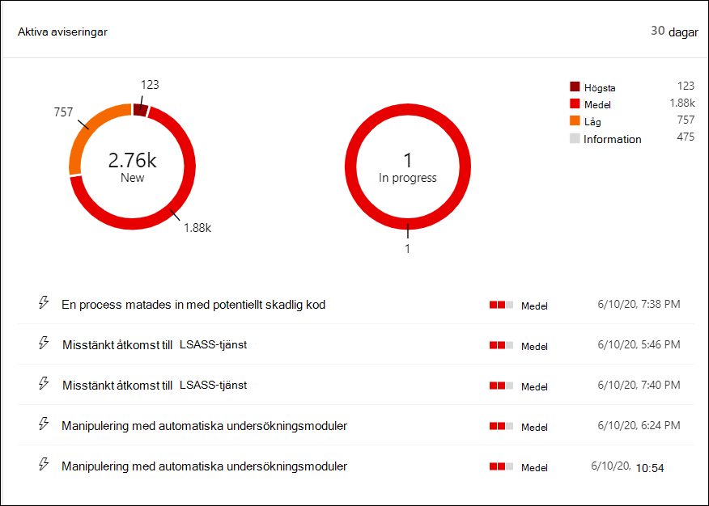
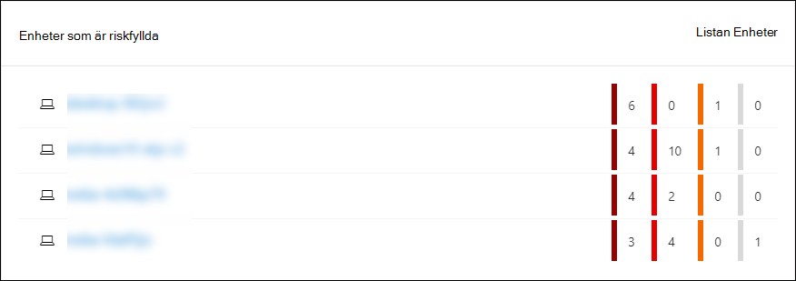
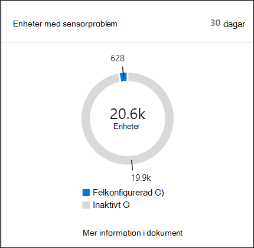
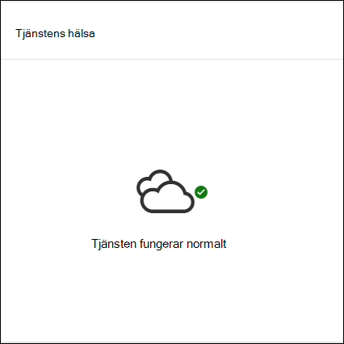
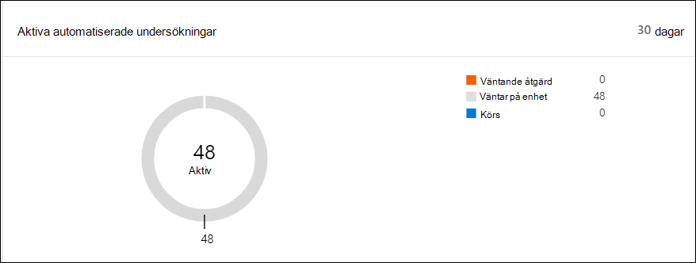
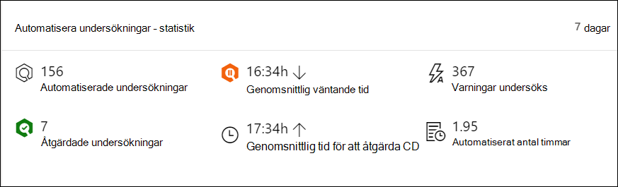
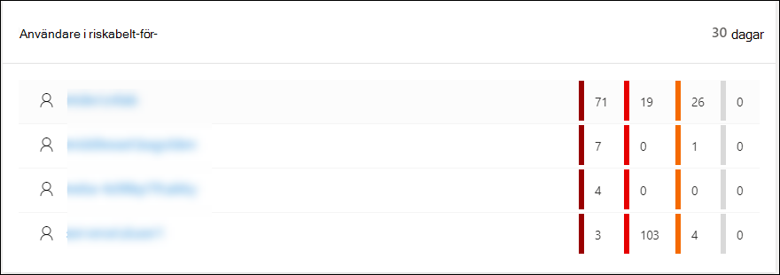

# Microsoft Defender Säkerhetscenter Instrumentpanel för säkerhetsåtgärder

[!INCLUDE [Microsoft 365 Defender rebranding](../../includes/microsoft-defender.md)]

**Gäller för:**
- [Microsoft Defender för Endpoint](https://go.microsoft.com/fwlink/?linkid=2154037)

>Vill du uppleva Microsoft Defender för Slutpunkt? [Registrera dig för en kostnadsfri utvärderingsversion.](https://www.microsoft.com/microsoft-365/windows/microsoft-defender-atp?ocid=docs-wdatp-secopsdashboard-abovefoldlink) 

Instrumentpanelen **för säkerhetsåtgärder** är den identifiering och åtgärd på slutpunkt funktionerna visas. Den ger en översikt över var identifieringar har setts och markerar var svarsåtgärder krävs. 

Instrumentpanelen visar en ögonblicksbild av:

- Aktiva aviseringar
- Enheter som är riskfyllda
- Sensorhälsa
- Tjänstens hälsa
- Daglig rapportering om enheter
- Aktiva automatiserade undersökningar
- Automatisera undersökningar – statistik
- Användare i riskabelt-för-
- Misstänkta aktiviteter

Du kan utforska och undersöka aviseringar och enheter för att snabbt avgöra om, var och när misstänkta aktiviteter inträffade i nätverket för att hjälpa dig att förstå kontexten de visades i.

Från **instrumentpanelen för säkerhetsåtgärder** ser du aggregerade händelser för att underlätta identifiering av viktiga händelser eller beteenden på en enhet. Du kan också öka detaljnivån för detaljerade händelser och indikatorer på låg nivå.

Den har också klickbara paneler som ger visuella ledtrådar om organisationens allmänna status. Varje panel öppnar en detaljerad vy av motsvarande översikt.

## Aktiva aviseringar
Du kan visa det totala antalet aktiva aviseringar från de senaste 30 dagarna i nätverket från panelen. Aviseringar grupperas i **Nytt** och **Pågående**.

Varje grupp kategoriseras ytterligare i motsvarande allvarlighetsnivå för aviseringar. Klicka på antalet aviseringar i varje aviseringsring om du vill se en sorterad vy av den kategorins kö **(Ny** eller **Pågår).**

Mer information finns i Översikt [över aviseringar.](alerts-queue.md)

Varje rad innehåller en kategori med en aviserings allvarlighetsgrad och en kort beskrivning av aviseringen. Du kan klicka på en avisering om du vill se den detaljerade vyn. Mer information finns i Undersök [Microsoft Defender för slutpunktsaviseringar och](investigate-alerts.md) [översikten Aviseringar.](alerts-queue.md)

## Enheter som är riskfyllda
På panelen visas en lista över enheter med det högsta antalet aktiva aviseringar. Det totala antalet aviseringar för varje enhet visas i en cirkel bredvid enhetens namn och kategoriseras ytterligare efter allvarlighetsnivå längst ut i panelen (hovra över varje allvarlighetsfält om du vill se dess etikett).

Klicka på enhetens namn om du vill se information om den enheten. Mer information finns i Undersöka [enheter i listan Microsoft Defender för slutpunktsenheter.](investigate-machines.md)

Du kan också klicka **på Listan** Enheter högst upp på panelen för att gå direkt till listan Enheter **,** sorterad efter antalet aktiva aviseringar. Mer information finns i Undersöka [enheter i listan Microsoft Defender för slutpunktsenheter.](investigate-machines.md)

## Enheter med sensorproblem
Panelen **Enheter med sensorproblem** ger information om den enskilda enhetens möjlighet att ge sensordata till Microsoft Defender för slutpunktstjänsten. Den rapporterar hur många enheter som kräver uppmärksamhet och hjälper dig att identifiera problematiska enheter.

Det finns två statusindikatorer med information om antalet enheter som inte rapporterar korrekt till tjänsten:
- **Felkonfigurerad** – De här enheterna kan delvis rapportera sensordata till Microsoft Defender för Slutpunkt-tjänsten och kan ha konfigurationsfel som behöver korrigeras.
- **Inaktiva** – Enheter som har slutat rapportera till Microsoft Defender för slutpunktstjänsten under mer än sju dagar den senaste månaden.

När du klickar på någon av grupperna dirigeras du till listan över enheter, filtrerade enligt ditt val. Mer information finns i Kontrollera [sensortillståndet](check-sensor-status.md) och [Undersöka enheter.](investigate-machines.md)

## Tjänstens hälsa
Panelen **Tjänstens** hälsa informerar dig om tjänsten är aktiv eller om det är problem.

Mer information om tjänstens hälsa finns i [Kontrollera tjänstens hälsa för Microsoft Defender.](service-status.md)

## Daglig rapportering om enheter
På **panelen för daglig rapportering** visas ett stapeldiagram som representerar antalet enheter som rapporterar dagligen under de senaste 30 dagarna. Hovra över enskilda staplar i diagrammet för att se det exakta antalet enheter som rapporterar varje dag.

## Aktiva automatiserade undersökningar
Du kan visa det totala antalet automatiserade undersökningar från de senaste 30 dagarna i nätverket från panelen för **automatiska aktiv undersökningar.** Undersökningar grupperas i **Väntande åtgärd**, **Väntar på enhet** och **Körs**.

## Automatisera undersökningar – statistik
I panelen visas statistik som är relaterad till automatiserade undersökningar de senaste sju dagarna. Den visar antalet undersökningar som slutförts, antalet slutförda undersökningar, den genomsnittliga väntande tiden det tar för en undersökning att initieras, den genomsnittliga tiden det tar att åtgärda en avisering, antalet aviseringar som undersökts och antalet timmar av automatisering som sparats från en vanlig manuell undersökning. 

Du kan klicka på  **Automatiserade** undersökningar, **åtgärdade** undersökningar och aviseringar som har **undersökts** för att navigera till sidan Undersökningar, filtrerad efter lämplig kategori. På så sätt kan du se en detaljerad uppdelning av undersökningar i sammanhanget.

## Användare i riskabelt-för-
Panelen visar en lista över användarkonton med de mest aktiva aviseringarna och antalet aviseringar som visas på höga, medelstora eller låga aviseringar. 

Klicka på användarkontot om du vill se mer information om användarkontot. Mer information finns i [Undersöka ett användarkonto.](investigate-user.md)

>Vill du uppleva Microsoft Defender för Slutpunkt? [Registrera dig för en kostnadsfri utvärderingsversion.](https://www.microsoft.com/microsoft-365/windows/microsoft-defender-atp?ocid=docs-wdatp-secopsdashboard-belowfoldlink)

## Relaterade ämnen
- [Förstå Microsoft Defender för Slutpunktsportalen](use.md)
- [Portalöversikt](portal-overview.md)
- [Visa instrumentpanelen för & Sårbarhetshantering](tvm-dashboard-insights.md)
- [Visa instrumentpanelen för hotanalyser och vidta rekommenderade åtgärder](threat-analytics.md)
