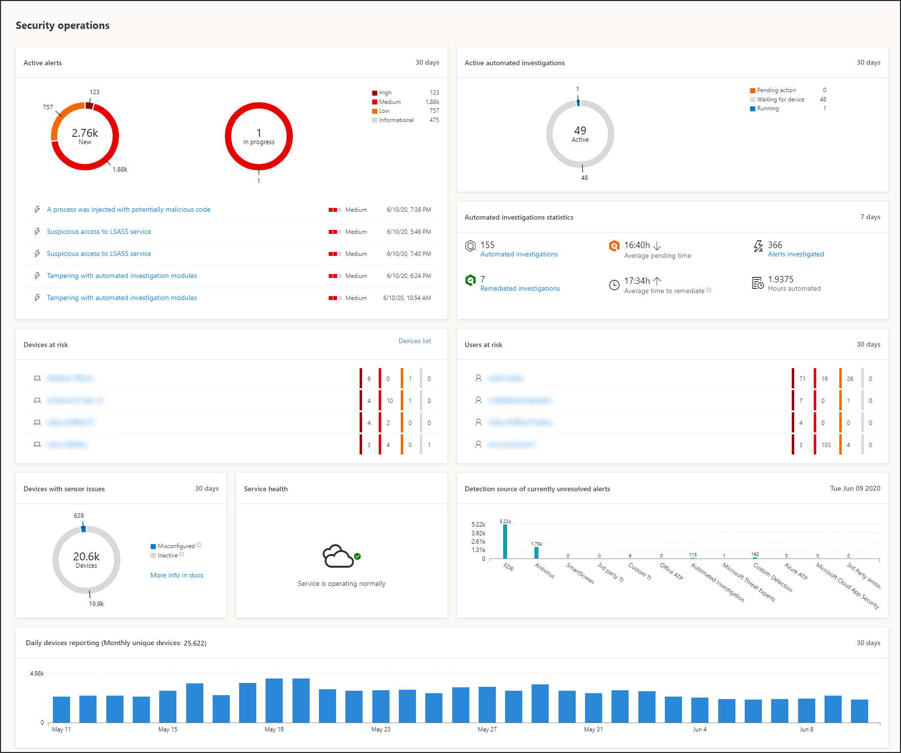

# Instrumentpanel för Säkerhetscenter-åtgärder i Microsoft Defender SäkerhetscenterMicrosoft Defender Security Center Security operations dashboard

[!INCLUDE [Microsoft 365 Defender rebranding](../../includes/microsoft-defender.md)]

**Gäller för:****Applies to:**
- [Microsoft Defender för EndpointMicrosoft Defender for Endpoint](https://go.microsoft.com/fwlink/?linkid=2154037)

>Vill du uppleva Microsoft Defender för Slutpunkt?Want to experience Microsoft Defender for Endpoint? [Registrera dig för en kostnadsfri utvärderingsversion.Sign up for a free trial.](https://www.microsoft.com/microsoft-365/windows/microsoft-defender-atp?ocid=docs-wdatp-secopsdashboard-abovefoldlink) 

Instrumentpanelen **för säkerhetsåtgärder** är den plats där funktionerna för identifiering av slutpunkter och svar visas.The **Security operations dashboard** is where the endpoint detection and response capabilities are surfaced. Den ger en översikt över var identifieringar har setts och markerar var svarsåtgärder krävs.It provides a high level overview of where detections were seen and highlights where response actions are needed. 

Instrumentpanelen visar en ögonblicksbild av:The dashboard displays a snapshot of:

- Aktiva aviseringarActive alerts
- Enheter som är riskfylldaDevices at risk
- SensorhälsaSensor health
- Tjänstens hälsaService health
- Daglig rapportering om enheterDaily devices reporting
- Aktiva automatiserade undersökningarActive automated investigations
- Automatisera undersökningar – statistikAutomated investigations statistics
- Användare i riskabelt-för-Users at risk
- Misstänkta aktiviteterSuspicious activities

Du kan utforska och undersöka aviseringar och enheter för att snabbt avgöra om, var och när misstänkta aktiviteter inträffade i nätverket för att hjälpa dig att förstå kontexten de visades i.You can explore and investigate alerts and devices to quickly determine if, where, and when suspicious activities occurred in your network to help you understand the context they appeared in.

Från **instrumentpanelen för säkerhetsåtgärder** ser du aggregerade händelser för att underlätta identifiering av viktiga händelser eller beteenden på en enhet.From the **Security operations dashboard** you will see aggregated events to facilitate the identification of significant events or behaviors on a device. Du kan också öka detaljnivån för detaljerade händelser och indikatorer på låg nivå.You can also drill down into granular events and low-level indicators.

Den har också klickbara paneler som ger visuella ledtrådar om organisationens allmänna status.It also has clickable tiles that give visual cues on the overall health state of your organization. Varje panel öppnar en detaljerad vy av motsvarande översikt.Each tile opens a detailed view of the corresponding overview.

## Aktiva aviseringarActive alerts
Du kan visa det totala antalet aktiva aviseringar från de senaste 30 dagarna i nätverket från panelen.You can view the overall number of active alerts from the last 30 days in your network from the tile. Aviseringar grupperas i **Nytt** och **Pågående**.Alerts are grouped into **New** and **In progress**.

Varje grupp kategoriseras ytterligare i motsvarande allvarlighetsnivå för aviseringar.Each group is further sub-categorized into their corresponding alert severity levels. Klicka på antalet aviseringar i varje aviseringsring om du vill se en sorterad vy av den kategorins kö **(Ny** eller **Pågår).**Click the number of alerts inside each alert ring to see a sorted view of that category's queue (**New** or **In progress**).

Mer information finns i Översikt [över aviseringar.](alerts-queue.md)For more information see, [Alerts overview](alerts-queue.md).

Varje rad innehåller en kategori med en aviserings allvarlighetsgrad och en kort beskrivning av aviseringen.Each row includes an alert severity category and a short description of the alert. Du kan klicka på en avisering om du vill se den detaljerade vyn.You can click an alert to see its detailed view. Mer information finns i Undersök [Microsoft Defender för slutpunktsaviseringar och](investigate-alerts.md) [översikten Aviseringar.](alerts-queue.md)For more information see,  [Investigate Microsoft Defender for Endpoint alerts](investigate-alerts.md) and [Alerts overview](alerts-queue.md).

## Enheter som är riskfylldaDevices at risk
På panelen visas en lista över enheter med det högsta antalet aktiva aviseringar.This tile shows you a list of devices with the highest number of active alerts. Det totala antalet aviseringar för varje enhet visas i en cirkel bredvid enhetens namn och kategoriseras ytterligare efter allvarlighetsnivå längst ut i panelen (hovra över varje allvarlighetsfält om du vill se dess etikett).The total number of alerts for each device is shown in a circle next to the device name, and then further categorized by severity levels at the far end of the tile (hover over each severity bar to see its label).

Klicka på enhetens namn om du vill se information om den enheten.Click the name of the device to see details about that device. Mer information finns i Undersöka [enheter i listan Microsoft Defender för slutpunktsenheter.](investigate-machines.md)For more information see, [Investigate devices in the Microsoft Defender for Endpoint Devices list](investigate-machines.md).

Du kan också klicka **på Listan** Enheter högst upp på panelen för att gå direkt till listan Enheter **,** sorterad efter antalet aktiva aviseringar.You can also click **Devices list** at the top of the tile to go directly to the **Devices list**, sorted by the number of active alerts. Mer information finns i Undersöka [enheter i listan Microsoft Defender för slutpunktsenheter.](investigate-machines.md)For more information see, [Investigate devices in the Microsoft Defender for Endpoint Devices list](investigate-machines.md).

## Enheter med sensorproblemDevices with sensor issues
Panelen **Enheter med sensorproblem** ger information om den enskilda enhetens möjlighet att ge sensordata till Microsoft Defender för slutpunktstjänsten.The **Devices with sensor issues** tile provides information on the individual device’s ability to provide sensor data to the Microsoft Defender for Endpoint service. Den rapporterar hur många enheter som kräver uppmärksamhet och hjälper dig att identifiera problematiska enheter.It reports how many devices require attention and helps you identify problematic devices.

Det finns två statusindikatorer med information om antalet enheter som inte rapporterar korrekt till tjänsten:There are two status indicators that provide information on the number of devices that are not reporting properly to the service:
- **Felkonfigurerad** – De här enheterna kan delvis rapportera sensordata till Microsoft Defender för Slutpunkt-tjänsten och kan ha konfigurationsfel som behöver korrigeras.**Misconfigured** – These devices might partially be reporting sensor data to the Microsoft Defender for Endpoint service and might have configuration errors that need to be corrected.
- **Inaktiva** – Enheter som har slutat rapportera till Microsoft Defender för slutpunktstjänsten under mer än sju dagar den senaste månaden.**Inactive** - Devices that have stopped reporting to the Microsoft Defender for Endpoint service for more than seven days in the past month.

När du klickar på någon av grupperna dirigeras du till listan över enheter, filtrerade enligt ditt val.When you click any of the groups, you’ll be directed to devices list, filtered according to your choice. Mer information finns i Kontrollera [sensortillståndet](check-sensor-status.md) och [Undersöka enheter.](investigate-machines.md)For more information, see [Check sensor state](check-sensor-status.md) and [Investigate devices](investigate-machines.md).

## Tjänstens hälsaService health
Panelen **Tjänstens** hälsa informerar dig om tjänsten är aktiv eller om det är problem.The **Service health** tile informs you if the service is active or if there are issues.

Mer information om tjänstens hälsa finns i [Kontrollera tjänstens hälsa för Microsoft Defender.](service-status.md)For more information on the service health, see [Check the Microsoft Defender for Endpoint service health](service-status.md).

## Daglig rapportering om enheterDaily devices reporting
På **panelen för daglig rapportering** visas ett stapeldiagram som representerar antalet enheter som rapporterar dagligen under de senaste 30 dagarna.The **Daily devices reporting** tile shows a bar graph that represents the number of devices reporting daily in the last 30 days. Hovra över enskilda staplar i diagrammet för att se det exakta antalet enheter som rapporterar varje dag.Hover over individual bars on the graph to see the exact number of devices reporting in each day.

## Aktiva automatiserade undersökningarActive automated investigations
Du kan visa det totala antalet automatiserade undersökningar från de senaste 30 dagarna i nätverket från panelen för **automatiska aktiv undersökningar.**You can view the overall number of automated investigations from the last 30 days in your network from the **Active automated investigations** tile. Undersökningar grupperas i **Väntande åtgärd**, **Väntar på enhet** och **Körs**.Investigations are grouped into **Pending action**, **Waiting for device**, and **Running**.

## Automatisera undersökningar – statistikAutomated investigations statistics
I panelen visas statistik som är relaterad till automatiserade undersökningar de senaste sju dagarna.This tile shows statistics related to automated investigations in the last seven days. Den visar antalet undersökningar som slutförts, antalet slutförda undersökningar, den genomsnittliga väntande tiden det tar för en undersökning att initieras, den genomsnittliga tiden det tar att åtgärda en avisering, antalet aviseringar som undersökts och antalet timmar av automatisering som sparats från en vanlig manuell undersökning.It shows the number of investigations completed, the number of successfully remediated investigations, the average pending time it takes for an investigation to be initiated, the average time it takes to remediate an alert, the number of alerts investigated, and the number of hours of automation saved from a typical manual investigation. 

Du kan klicka på  **Automatiserade** undersökningar, **åtgärdade** undersökningar och aviseringar som har **undersökts** för att navigera till sidan Undersökningar, filtrerad efter lämplig kategori.You can click on **Automated investigations**, **Remediated investigations**, and **Alerts investigated** to navigate to the **Investigations** page, filtered by the appropriate category. På så sätt kan du se en detaljerad uppdelning av undersökningar i sammanhanget.This lets you see a detailed breakdown of investigations in context.

## Användare i riskabelt-för-Users at risk
Panelen visar en lista över användarkonton med de mest aktiva aviseringarna och antalet aviseringar som visas på höga, medelstora eller låga aviseringar.The tile shows you a list of user accounts with the most active alerts and the number of alerts seen on high, medium, or low alerts. 

Klicka på användarkontot om du vill se mer information om användarkontot.Click the user account to see details about the user account. Mer information finns i [Undersöka ett användarkonto.](investigate-user.md)For more information see [Investigate a user account](investigate-user.md).

>Vill du uppleva Microsoft Defender för Slutpunkt?Want to experience Microsoft Defender for Endpoint? [Registrera dig för en kostnadsfri utvärderingsversion.Sign up for a free trial.](https://www.microsoft.com/microsoft-365/windows/microsoft-defender-atp?ocid=docs-wdatp-secopsdashboard-belowfoldlink)

## Relaterade ämnenRelated topics
- [Förstå Microsoft Defender för SlutpunktsportalenUnderstand the Microsoft Defender for Endpoint portal](use.md)
- [PortalöversiktPortal overview](portal-overview.md)
- [Visa instrumentpanelen för & SårbarhetshanteringView the Threat & Vulnerability Management dashboard](tvm-dashboard-insights.md)
- [Visa instrumentpanelen för hotanalyser och vidta rekommenderade åtgärderView the Threat analytics dashboard and take recommended mitigation actions](threat-analytics.md)
