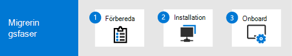

# Göra bytet från skydd från andra slutpunkter än Microsoft Defender till Microsoft Defender för SlutpunktMake the switch from non-Microsoft endpoint protection to Microsoft Defender for Endpoint

Om du funderar på att byta från ditt icke-Microsoft-slutpunktsskydd till [Microsoft Defender](microsoft-defender-endpoint.md) för slutpunkt (Defender för slutpunkt) är du på rätt plats.If you are thinking about switching from your non-Microsoft endpoint protection to [Microsoft Defender for Endpoint](microsoft-defender-endpoint.md) (Defender for Endpoint), you're in the right place. Använd den här artikeln som en guide.Use this article as a guide.

:::image type="content" source="images/nonms-mde-migration.png" alt-text="Översikt över hur du migrerar till Defender för Endpoint":::

När du byter till Defender för Slutpunkt börjar du med din lösning som inte är en Microsoft-lösning som fungerar i aktivt läge, konfigurerar Defender för Slutpunkt i passiv form, går in på Defender för Slutpunkt, ställer in Defender för Slutpunkt till aktivt läge och tar sedan bort lösningen som inte är Från Microsoft.When you make the switch to Defender for Endpoint, you begin with your non-Microsoft solution operating in active mode, configure Defender for Endpoint in passive mode, onboard to Defender for Endpoint, set Defender for Endpoint to active mode, and then remove the non-Microsoft solution.

> [!TIP]
> - Om du använder McAfee Endpoint Security (McAfee), se [Migrera från McAfee till Defender för Slutpunkt](mcafee-to-microsoft-defender-migration.md).If you're currently using McAfee Endpoint Security (McAfee), see [Migrate from McAfee to Defender for Endpoint](mcafee-to-microsoft-defender-migration.md).
> - Om du för närvarande använder Symantec Endpoint Protection (Symantec) se Migrera från [Symantec till Defender för Slutpunkt.](symantec-to-microsoft-defender-endpoint-migration.md)If you're currently using Symantec Endpoint Protection (Symantec), see [Migrate from Symantec to Defender for Endpoint](symantec-to-microsoft-defender-endpoint-migration.md).

## MigreringsprocessenThe migration process

Processen för migrering till Defender för Slutpunkt kan delas upp i tre faser, enligt beskrivningen i följande tabell:The process of migrating to Defender for Endpoint can be divided into three phases, as described in the following table:

|FasPhase |BeskrivningDescription |
|--|--|
|[Förbereda migreringenPrepare for your migration](switch-to-microsoft-defender-prepare.md) |Under [ **förberedelsefasen:**](switch-to-microsoft-defender-prepare.md)During [the **Prepare** phase](switch-to-microsoft-defender-prepare.md): 
1. Uppdatera organisationens enheter.1. Update your organization's devices. 
2. Skaffa Defender för Slutpunkt.2. Get Defender for Endpoint. 
3. Planera dina roller och behörigheter och ge åtkomst till Microsoft Defender Säkerhetscenter.3. Plan your roles and permissions, and grant access to the Microsoft Defender Security Center. 
4. Konfigurera din enhetsproxy och internetinställningar för att aktivera kommunikation mellan din organisations enheter och Defender för Slutpunkt.4. Configure your device proxy and internet settings to enable communication between your organization's devices and Defender for Endpoint. |
|[Konfigurera Defender för SlutpunktSet up Defender for Endpoint](switch-to-microsoft-defender-setup.md) |Under [ **installationsfasen:**](switch-to-microsoft-defender-setup.md)During [the **Setup** phase](switch-to-microsoft-defender-setup.md): 
1. Aktivera/installera om Microsoft Defender Antivirus.1. Enable/reinstall Microsoft Defender Antivirus. 
2. Konfigurera Defender för slutpunkt.2. Configure Defender for Endpoint. 
3. Lägg till Defender för Endpoint i undantagslistan för din befintliga lösning.3. Add Defender for Endpoint to the exclusion list for your existing solution. 
4. Lägg till din befintliga lösning i undantagslistan för Microsoft Defender Antivirus.4. Add your existing solution to the exclusion list for Microsoft Defender Antivirus. 
5. Konfigurera enhetsgrupper, samlingar och organisationsenheter.5. Set up your device groups, collections, and organizational units. 
6. Konfigurera dina riktlinjer för program mot skadlig programvara och inställningar för realtidsskydd.6. Configure your antimalware policies and real-time protection settings.|
|[Onboard to Defender för EndpointOnboard to Defender for Endpoint](switch-to-microsoft-defender-onboard.md) |Under [ **onboardfasen:**](switch-to-microsoft-defender-onboard.md)During [the **Onboard** phase](switch-to-microsoft-defender-onboard.md): 
1. Introducera dina enheter i Defender för Slutpunkt.1. Onboard your devices to Defender for Endpoint. 
2. Kör ett identifieringstest.2. Run a detection test. 
3. Kontrollera att Microsoft Defender Antivirus körs i passiv form.3. Confirm that Microsoft Defender Antivirus is running in passive mode. 
4. Hämta uppdateringar för Microsoft Defender Antivirus.4. Get updates for Microsoft Defender Antivirus. 
5. Avinstallera din befintliga lösning för slutpunktsskydd.5. Uninstall your existing endpoint protection solution. 
6. Kontrollera att Defender för Slutpunkt fungerar korrekt.6. Make sure that Defender for Endpoint working correctly. |

## Vad ingår i Microsoft Defender för Slutpunkt?What's included in Microsoft Defender for Endpoint?

I den här migreringsguiden fokuserar vi på nästa [generations](microsoft-defender-antivirus-in-windows-10.md) skydd [och identifiering och åtgärd på slutpunkt](overview-endpoint-detection-response.md) funktioner som en utgångspunkt för att flytta till Defender för Slutpunkt.In this migration guide, we focus on [next-generation protection](microsoft-defender-antivirus-in-windows-10.md) and [endpoint detection and response](overview-endpoint-detection-response.md) capabilities as a starting point for moving to Defender for Endpoint. Men Defender för Slutpunkt innehåller mycket mer än antivirus- och slutpunktsskydd.However, Defender for Endpoint includes much more than antivirus and endpoint protection. Defender för Endpoint är en enhetlig plattform för förebyggande skydd, identifiering efter intrång, automatiserad undersökning och svar.Defender for Endpoint is a unified platform for preventative protection, post-breach detection, automated investigation, and response. I följande tabell sammanfattas funktioner i Defender för Endpoint.The following table summarizes features and capabilities in Defender for Endpoint. 

| Funktion/funktionFeature/Capability | BeskrivningDescription |
|---|---|
| [Hot och sårbarhetshanteringThreat & vulnerability management](next-gen-threat-and-vuln-mgt.md) | Hot & hantering av säkerhetsrisker funktioner hjälper till att identifiera, utvärdera och åtgärda svagheter mellan dina slutpunkter (t.ex. enheter).Threat & vulnerability management capabilities help identify, assess, and remediate weaknesses across your endpoints (such as devices). |
| [Minskning av attackytanAttack surface reduction](overview-attack-surface-reduction.md) | Minskningsregler för attackytan hjälper till att skydda organisationens enheter och program från cyberhot och attacker.Attack surface reduction rules help protect your organization's devices and applications from cyberthreats and attacks. |
| [Nästa generations skyddNext-generation protection](microsoft-defender-antivirus-in-windows-10.md) | Nästa generations skydd inkluderar skydd Microsoft Defender Antivirus att blockera hot och skadlig programvara.Next-generation protection includes Microsoft Defender Antivirus to help block threats and malware. |
| [Identifiering och svar för slutpunktEndpoint detection and response](overview-endpoint-detection-response.md) | Funktioner för identifiering av slutpunkter och svar identifierar, undersöker och svarar på intrångsförsök och aktiva intrång.Endpoint detection and response capabilities detect, investigate, and respond to intrusion attempts and active breaches.  |
| [Avancerad jaktAdvanced hunting](advanced-hunting-overview.md) | Med avancerade sökfunktioner kan ditt säkerhetsteam hitta indikatorer och enheter för kända eller potentiella hot.Advanced hunting capabilities enable your security operations team to locate indicators and entities of known or potential threats. |
| [Beteendeblockering och inneslutningBehavioral blocking and containment](behavioral-blocking-containment.md) | Funktioner för blockering och inneslutning hjälper till att identifiera och stoppa hot, baserat på deras beteende och processträd även när hoten har börjat körs.Behavioral blocking and containment capabilities help identify and stop threats, based on their behaviors and process trees even when the threat has started execution. |
| [Automatiserad undersökning och åtgärderAutomated investigation and remediation](automated-investigations.md) | Med automatiska undersöknings- och svarsfunktioner undersöks aviseringar och åtgärder vidtas omedelbart för att lösa överträdelser.Automated investigation and response capabilities examine alerts and take immediate remediation action to resolve breaches. |
| [Hot-service](microsoft-threat-experts.md) (Microsoft Hotexperter)[Threat hunting service](microsoft-threat-experts.md) (Microsoft Threat Experts) | Med tjänster för hotsäkerhet kan säkerhetsgrupper med övervakning och analys på expertnivå säkerställa att inga kritiska hot missas.Threat hunting services provide security operations teams with expert level monitoring and analysis, and to help ensure that critical threats aren't missed. |

**Vill du veta mer? Se [Defender för Slutpunkt](microsoft-defender-endpoint.md).****Want to learn more? See [Defender for Endpoint](microsoft-defender-endpoint.md).**

## Nästa stegNext step

- Fortsätt till [Förbereda för migreringen.](switch-to-microsoft-defender-prepare.md)Proceed to [Prepare for your migration](switch-to-microsoft-defender-prepare.md).
