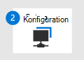

# Växla till Microsoft Defender för Slutpunkt – fas 3: OnboardSwitch to Microsoft Defender for Endpoint - Phase 3: Onboard

**Gäller för:****Applies to:**
- [Microsoft Defender för EndpointMicrosoft Defender for Endpoint](https://go.microsoft.com/fwlink/p/?linkid=2154037)
- [Microsoft 365 DefenderMicrosoft 365 Defender](https://go.microsoft.com/fwlink/?linkid=2118804)

|  [Fas 1: FörberedaPhase 1: Prepare](switch-to-microsoft-defender-prepare.md) |  [Fas 2: KonfigureraPhase 2: Set up](switch-to-microsoft-defender-setup.md) |  Fas 3: IntroduktionPhase 3: Onboard |
|--|--|--|
|| |*Du är här!**You are here!* |

**Välkommen till Fas 3 om [att byta till Defender för Slutpunkt.](switch-to-microsoft-defender-migration.md#the-migration-process)****Welcome to Phase 3 of [switching to Defender for Endpoint](switch-to-microsoft-defender-migration.md#the-migration-process)**. Den här migreringsfasen omfattar följande steg:This migration phase includes the following steps:

1. [Introducera enheter till Defender för Slutpunkt](#onboard-devices-to-microsoft-defender-for-endpoint).[Onboard devices to Defender for Endpoint](#onboard-devices-to-microsoft-defender-for-endpoint).

2. [Kör ett identifieringstest](#run-a-detection-test).[Run a detection test](#run-a-detection-test).

3. [Kontrollera att Microsoft Defender Antivirus är i passivt läge på dina slutpunkter](#confirm-that-microsoft-defender-antivirus-is-in-passive-mode-on-your-endpoints).[Confirm that Microsoft Defender Antivirus is in passive mode on your endpoints](#confirm-that-microsoft-defender-antivirus-is-in-passive-mode-on-your-endpoints).

4. [Hämta uppdateringar för Microsoft Defender Antivirus](#get-updates-for-microsoft-defender-antivirus).[Get updates for Microsoft Defender Antivirus](#get-updates-for-microsoft-defender-antivirus).

5. [Avinstallera din lösning som inte är en Microsoft-lösning.](#uninstall-your-non-microsoft-solution)[Uninstall your non-Microsoft solution](#uninstall-your-non-microsoft-solution). 

6. [Kontrollera att Defender för Slutpunkt fungerar som det ska.](#make-sure-defender-for-endpoint-is-working-correctly)[Make sure Defender for Endpoint is working correctly](#make-sure-defender-for-endpoint-is-working-correctly).

## Registrera enheter till Microsoft Defender för EndpointOnboard devices to Microsoft Defender for Endpoint

1. Gå till Microsoft Defender Säkerhetscenter ( [https://aka.ms/MDATPportal](https://aka.ms/MDATPportal) ) och logga in.Go to the Microsoft Defender Security Center ([https://aka.ms/MDATPportal](https://aka.ms/MDATPportal)) and sign in.

2. Välj **Inställningar**  >  **Registrering av**  >  **enhetshantering**.Choose **Settings** > **Device management** > **Onboarding**. 

3. Välj **ett operativsystem i listan Välj** operativsystem för att starta registreringsprocessen.In the **Select operating system to start onboarding process** list, select an operating system. 

4. Välj **ett alternativ** under Distributionsmetod.Under **Deployment method**, select an option. Följ länkarna och instruktionerna för att registrera organisationens enheter.Follow the links and prompts to onboard your organization's devices. Behöver du hjälp?Need help? Se [Onboarding-metoder](#onboarding-methods) (i den här artikeln).See [Onboarding methods](#onboarding-methods) (in this article).

### Onboarding-metoderOnboarding methods
 
Distributionsmetoderna varierar beroende på operativsystem och rekommenderade metoder.Deployment methods vary, depending on operating system and preferred methods. I följande tabell finns resurser som hjälper dig att komma igång med Defender för Slutpunkt:The following table lists resources to help you onboard to Defender for Endpoint:

|OperativsystemOperating systems  |MetoderMethods  |
|---------|---------|
| Windows 10Windows 10     | [GrupprincipGroup Policy](configure-endpoints-gp.md)
[Configuration ManagerConfiguration Manager](configure-endpoints-sccm.md)
[Hantering av mobila enheter (Intune)Mobile Device Management (Intune)](configure-endpoints-mdm.md)
[Lokalt skriptLocal script](configure-endpoints-script.md) 
**Obs!** Ett lokalt skript är lämpligt för ett konceptbevis men bör inte användas för produktionsdistribution.**NOTE**: A local script is suitable for a proof of concept but should not be used for production deployment. För produktionsdistribution rekommenderar vi att du använder Grupprincip, Microsoft Endpoint Configuration Manager eller Intune.For a production deployment, we recommend using Group Policy, Microsoft Endpoint Configuration Manager, or Intune.         |
| Windows 8.1 EnterpriseWindows 8.1 Enterprise 
Windows 8.1 ProWindows 8.1 Pro 
Windows 7 SP1 EnterpriseWindows 7 SP1 Enterprise 
Windows 7 SP1-ProWindows 7 SP1 Pro     | [Microsoft Monitoring AgentMicrosoft Monitoring Agent](onboard-downlevel.md)
**OBS!** Microsoft Monitoring Agent är nu Azure Log Analytics-agent.**NOTE**: Microsoft Monitoring Agent is now Azure Log Analytics agent. Mer information finns i Översikt [över logganalysagenter.](/azure/azure-monitor/platform/log-analytics-agent)To learn more, see [Log Analytics agent overview](/azure/azure-monitor/platform/log-analytics-agent).        |
| Windows Server 2019 och senareWindows Server 2019 and later 
Windows Basversionen av Server 2019Windows Server 2019 core edition 
Windows Serverversion 1803 och senareWindows Server version 1803 and later | [Lokalt skriptLocal script](configure-endpoints-script.md) 
[GrupprincipGroup Policy](configure-endpoints-gp.md) 
[Configuration ManagerConfiguration Manager](configure-endpoints-sccm.md) 
[System Center Configuration ManagerSystem Center Configuration Manager](configure-endpoints-sccm.md) 
[VDI-onboardingskript för icke-beständiga enheterVDI onboarding scripts for non-persistent devices](configure-endpoints-vdi.md) 
**Obs!** Ett lokalt skript är lämpligt för ett konceptbevis men bör inte användas för produktionsdistribution.**NOTE**: A local script is suitable for a proof of concept but should not be used for production deployment. För produktionsdistribution rekommenderar vi att du använder Grupprincip, Microsoft Endpoint Configuration Manager eller Intune.For a production deployment, we recommend using Group Policy, Microsoft Endpoint Configuration Manager, or Intune.    |
| Windows Server 2016Windows Server 2016 
Windows Server 2012 R2Windows Server 2012 R2 
Windows Server 2008 R2 SP1Windows Server 2008 R2 SP1  | [Microsoft Defender SäkerhetscenterMicrosoft Defender Security Center](configure-server-endpoints.md)
[Azure DefenderAzure Defender](/azure/security-center/security-center-wdatp) |
|macOS:macOS:
11.3.1 (Big Sur)11.3.1 (Big Sur) 
10.15 (Catalina)10.15 (Catalina)
10.14 (Mojave)10.14 (Mojave)|[Introducera icke-Windows-enheterOnboard non-Windows devices](configure-endpoints-non-windows.md)  |
|iOSiOS |[Introducera icke-Windows-enheterOnboard non-Windows devices](configure-endpoints-non-windows.md)  |
|Linux:Linux:
RHEL 7.2+RHEL 7.2+
CentOS Linux 7.2+CentOS Linux 7.2+
Ubuntu 16 LTS eller senare LTSUbuntu 16 LTS, or higher LTS
SLES 12+SLES 12+
9+Debian 9+
Oracle Linux 7.2Oracle Linux 7.2 |[Introducera icke-Windows-enheterOnboard non-Windows devices](configure-endpoints-non-windows.md)  |

## Köra ett identifieringstestRun a detection test

Om du vill kontrollera att dina onboarded-enheter är korrekt anslutna till Defender för Endpoint kan du köra ett identifieringstest.To verify that your onboarded devices are properly connected to Defender for Endpoint, you can run a detection test.

|OperativsystemOperating system  |VägledningGuidance  |
|---------|---------|
| Windows 10Windows 10 
Windows Server 2019Windows Server 2019 
Windows Server, version 1803Windows Server, version 1803 
Windows Server 2016Windows Server 2016 
Windows Server 2012 R2Windows Server 2012 R2     | Se [Köra ett identifieringstest](run-detection-test.md).See [Run a detection test](run-detection-test.md). 
Besök webbplatsen för Demoscenarier i Defender för slutpunkt [https://demo.wd.microsoft.com](https://demo.wd.microsoft.com) () och prova en eller flera av scenarierna.Visit the Defender for Endpoint demo scenarios site ([https://demo.wd.microsoft.com](https://demo.wd.microsoft.com)) and try one or more of the scenarios. Prova till exempel **demoscenariot Moln levererat skydd.**For example, try the **Cloud-delivered protection** demo scenario.         |
| macOS:macOS:
11.3.1 (Big Sur)11.3.1 (Big Sur) 
10.15 (Catalina)10.15 (Catalina)
10.14 (Mojave)10.14 (Mojave)    |Ladda ned och använd APPEN GÖR-själv-programmet på [https://aka.ms/mdatpmacosdiy](https://aka.ms/mdatpmacosdiy) .Download and use the DIY app at [https://aka.ms/mdatpmacosdiy](https://aka.ms/mdatpmacosdiy). 
Mer information finns i [Defender för Slutpunkt på macOS.](microsoft-defender-endpoint-mac.md)For more information, see [Defender for Endpoint on macOS](microsoft-defender-endpoint-mac.md).        |
| Linux:Linux:
RHEL 7.2+RHEL 7.2+
CentOS Linux 7.2+CentOS Linux 7.2+
Ubuntu 16 LTS eller senare LTSUbuntu 16 LTS, or higher LTS
SLES 12+SLES 12+
9+Debian 9+
Oracle Linux 7.2Oracle Linux 7.2 |1. Kör följande kommando och leta efter resultatet **1:**1. Run the following command, and look for a result of **1**:  `mdatp health --field real_time_protection_enabled`.`mdatp health --field real_time_protection_enabled`. 
2. Öppna ett terminalfönster och kör följande kommando:2. Open a Terminal window, and run the following command:  `curl -o ~/Downloads/eicar.com.txt https://www.eicar.org/download/eicar.com.txt`.`curl -o ~/Downloads/eicar.com.txt https://www.eicar.org/download/eicar.com.txt`. 
3. Kör följande kommando för att lista identifierade hot:3. Run the following command to list any detected threats:  `mdatp threat list`.`mdatp threat list`. 
Mer information finns i [Defender för Slutpunkt på Linux.](microsoft-defender-endpoint-linux.md)For more information, see [Defender for Endpoint on Linux](microsoft-defender-endpoint-linux.md). |

## Kontrollera att Microsoft Defender Antivirus är i passivt läge på dina slutpunkterConfirm that Microsoft Defender Antivirus is in passive mode on your endpoints

Nu när dina slutpunkter har introducerats till Defender för Endpoint är nästa steg att se till att Microsoft Defender Antivirus körs i passiv form.Now that your endpoints have been onboarded to Defender for Endpoint, your next step is to make sure Microsoft Defender Antivirus is running in passive mode. Du kan använda kommandotolken eller PowerShell för att utföra den här uppgiften enligt följande tabell:You can use either Command Prompt or PowerShell to perform this task, as described in the following table:

|MetodMethod  |Lämplig åtgärdWhat to do  |
|---------|---------|
|KommandotolkenCommand Prompt     | 1. På en Windows enhet öppnar du Kommandotolken som administratör.1. On a Windows device, open Command Prompt as an administrator.
2. Skriv `sc query windefend` och tryck sedan på Retur.2. Type `sc query windefend`, and then press Enter.
3. Granska resultaten för att bekräfta att Microsoft Defender Antivirus i passiv form.3. Review the results to confirm that Microsoft Defender Antivirus is running in passive mode.         |
|PowerShellPowerShell     | 1. På en Windows enhet öppnar du Windows PowerShell som administratör.1. On a Windows device, open Windows PowerShell as an administrator.
2. Kör [cmdleten Get-MpComputerStatus.](/powershell/module/defender/Get-MpComputerStatus)2. Run the [Get-MpComputerStatus](/powershell/module/defender/Get-MpComputerStatus) cmdlet. 
3. I resultatlistan letar du efter antingen **AMRunningMode: Passivt läge** eller **AMRunningMode: SxS-passivt läge.**3. In the list of results, look for either **AMRunningMode: Passive Mode** or **AMRunningMode: SxS Passive Mode**.          |

> [!NOTE]
> I vissa *versioner Windows Defender Antivirus* inte *Microsoft Defender Antivirus* visas i Windows.You might see *Windows Defender Antivirus* instead of *Microsoft Defender Antivirus* in some versions of Windows.

### Ställ Microsoft Defender Antivirus på Windows server till passivt läge manuelltSet Microsoft Defender Antivirus on Windows Server to passive mode manually

Om du Microsoft Defender Antivirus till passivt läge på Windows Server, version 1803 eller senare eller Windows Server 2019 gör du så här:To set Microsoft Defender Antivirus to passive mode on Windows Server, version 1803 or newer, or Windows Server 2019, follow these steps:

1. Öppna Registereditorn och gå tillOpen Registry Editor, and then navigate to  
   `Computer\HKEY_LOCAL_MACHINE\SOFTWARE\Policies\Microsoft\Windows Advanced Threat Protection`.`Computer\HKEY_LOCAL_MACHINE\SOFTWARE\Policies\Microsoft\Windows Advanced Threat Protection`.

2. Redigera (eller skapa) en DWORD-post **som heter ForcePassiveMode** och ange följande inställningar:Edit (or create) a DWORD entry called **ForcePassiveMode**, and specify the following settings:
   - Ställ in DWORD-värdet på **1.**Set the DWORD's value to **1**.
   - Under **Bas** väljer du **Hexadecimal**.Under **Base**, select **Hexadecimal**.

> [!NOTE]
> Du kan använda andra metoder för att ange registernyckeln, till exempel följande:You can use other methods to set the registry key, such as the following:
>- [Grupprincipinställning](/previous-versions/windows/it-pro/windows-server-2012-R2-and-2012/dn581922(v=ws.11))[Group Policy Preference](/previous-versions/windows/it-pro/windows-server-2012-R2-and-2012/dn581922(v=ws.11))
>- [Verktyget Lokalt grupprincipobjektLocal Group Policy Object tool](/windows/security/threat-protection/security-compliance-toolkit-10#what-is-the-local-group-policy-object-lgpo-tool)
>- [Ett paket i KonfigurationshanterarenA package in Configuration Manager](/mem/configmgr/apps/deploy-use/packages-and-programs)

### Starta Microsoft Defender Antivirus på Windows Server 2016Start Microsoft Defender Antivirus on Windows Server 2016

Om du använder Windows Server 2016 kan du behöva börja Microsoft Defender Antivirus manuellt.If you are using Windows Server 2016, you might have to start Microsoft Defender Antivirus manually. Det kan du göra med hjälp av PowerShell-cmdleten `mpcmdrun.exe -wdenable` på enheten.You can do this by using the PowerShell cmdlet `mpcmdrun.exe -wdenable` on the device.

## Hämta uppdateringar för Microsoft Defender AntivirusGet updates for Microsoft Defender Antivirus

Att hålla Microsoft Defender Antivirus uppdaterad är viktigt för att säkerställa att dina enheter har den senaste tekniken och funktionerna som behövs för att skydda mot nya tekniker för skadlig programvara och attack, även om Microsoft Defender Antivirus körs i [passiv form.](/windows/security/threat-protection/microsoft-defender-antivirus/microsoft-defender-antivirus-compatibility)Keeping Microsoft Defender Antivirus up to date is critical to assure your devices have the latest technology and features needed to protect against new malware and attack techniques, even if Microsoft Defender Antivirus is running in [passive mode](/windows/security/threat-protection/microsoft-defender-antivirus/microsoft-defender-antivirus-compatibility).

Det finns två typer av uppdateringar som är relaterade till Microsoft Defender Antivirus uppdateringar:There are two types of updates related to keeping Microsoft Defender Antivirus up to date:
- SäkerhetsintelligensuppdateringarSecurity intelligence updates
- ProduktuppdateringarProduct updates

Följ linjerna i Hantera uppdateringar i Microsoft Defender Antivirus [och tillämpa baslinjer](/windows/security/threat-protection/microsoft-defender-antivirus/manage-updates-baselines-microsoft-defender-antivirus)för att få uppdateringarna.To get your updates, follow the guidance in [Manage Microsoft Defender Antivirus updates and apply baselines](/windows/security/threat-protection/microsoft-defender-antivirus/manage-updates-baselines-microsoft-defender-antivirus).

## Avinstallera din lösning som inte är en Microsoft-lösningUninstall your non-Microsoft solution

Nu när du har introducerat din organisations enheter i Defender för Endpoint och Microsoft Defender Antivirus är installerat och aktiverat är nästa steg att avinstallera din lösning för slutpunktsskydd som inte är en Microsoft-slutpunkt.Now that you have onboarded your organization's devices to Defender for Endpoint, and Microsoft Defender Antivirus is installed and enabled, your next step is to uninstall your non-Microsoft endpoint protection solution. Om du behöver hjälp med den här uppgiften kan du kontakta lösningsleverantörens tekniska supportteam.To get help with this task, reach out to your solution provider's technical support team.

## Kontrollera att Defender för Slutpunkt fungerar korrektMake sure Defender for Endpoint is working correctly

Nu när du har gått över till Defender för Endpoint och du har avinstallerat din tidigare lösning utanför Microsoft är nästa steg att se till att Defender för Slutpunkt fungerar korrekt.Now that you have onboarded to Defender for Endpoint, and you have uninstalled your former non-Microsoft solution, your next step is to make sure that Defender for Endpoint working correctly. Ett bra sätt att göra detta är att besöka webbplatsen för Defender för Endpoint-demoscenarier ( [https://demo.wd.microsoft.com](https://demo.wd.microsoft.com) ).One good way to do this is by visiting the Defender for Endpoint demo scenarios site ([https://demo.wd.microsoft.com](https://demo.wd.microsoft.com)). Prova en eller flera demoscenarier på den sidan, inklusive minst följande:Try one or more of the demo scenarios on that page, including at least the following:
- Molnbaserat skyddCloud-delivered protection
- Potentiellt oönskade program (PUA)Potentially Unwanted Applications (PUA)
- Network Protection (NP)Network Protection (NP)

## Nästa stegNext steps

**Grattis!****Congratulations**! Du har slutfört [migreringen till Defender för slutpunkt](switch-to-microsoft-defender-migration.md#the-migration-process)!You have completed your [migration to Defender for Endpoint](switch-to-microsoft-defender-migration.md#the-migration-process)! 

- [Besök instrumentpanelen för säkerhetsåtgärder](security-operations-dashboard.md) i Microsoft Defender Säkerhetscenter ( [https://aka.ms/MDATPportal](https://aka.ms/MDATPportal) ).[Visit your security operations dashboard](security-operations-dashboard.md) in the Microsoft Defender Security Center ([https://aka.ms/MDATPportal](https://aka.ms/MDATPportal)). 

- [Hantera Defender för Slutpunkt efter migreringen.](manage-atp-post-migration.md)[Manage Defender for Endpoint, post migration](manage-atp-post-migration.md).
