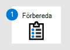
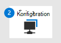

# Byt till Microsoft Defender för slutpunkt – fas 1: FörberedaSwitch to Microsoft Defender for Endpoint - Phase 1: Prepare

**Gäller för:****Applies to:**
- [Microsoft Defender för EndpointMicrosoft Defender for Endpoint](https://go.microsoft.com/fwlink/p/?linkid=2154037)
- [Microsoft 365 DefenderMicrosoft 365 Defender](https://go.microsoft.com/fwlink/?linkid=2118804)

|  Fas 1: FörberedaPhase 1: Prepare |  [Fas 2: KonfigureraPhase 2: Set up](switch-to-microsoft-defender-setup.md) |  [Fas 3: IntroduktionPhase 3: Onboard](switch-to-microsoft-defender-onboard.md) |
|--|--|--|
|*Du är här!**You are here!*| | |

**Välkommen till förberedelsefasen för [att byta till Microsoft Defender för slutpunkt.](switch-to-microsoft-defender-migration.md#the-migration-process)****Welcome to the Prepare phase of [switching to Microsoft Defender for Endpoint](switch-to-microsoft-defender-migration.md#the-migration-process)**. 

Den här migreringsfasen omfattar följande steg:This migration phase includes the following steps:
1. [Hämta och distribuera uppdateringar på organisationens enheterGet and deploy updates across your organization's devices](#get-and-deploy-updates-across-your-organizations-devices)
2. [Skaffa Microsoft Defender för Slutpunkt](#get-microsoft-defender-for-endpoint).[Get Microsoft Defender for Endpoint](#get-microsoft-defender-for-endpoint).
3. [Bevilja åtkomst till Microsoft Defender Säkerhetscenter.](#grant-access-to-the-microsoft-defender-security-center)[Grant access to the Microsoft Defender Security Center](#grant-access-to-the-microsoft-defender-security-center).
4. [Konfigurera enhetsproxy och internetanslutningsinställningar](#configure-device-proxy-and-internet-connectivity-settings).[Configure device proxy and internet connectivity settings](#configure-device-proxy-and-internet-connectivity-settings).

## Hämta och distribuera uppdateringar på organisationens enheterGet and deploy updates across your organization's devices

Det är alltid bra att hålla organisationens enheter och slutpunkter uppdaterade.As a best practice, keep your organization's devices and endpoints up to date. Kontrollera att din befintliga slutpunktsskydd och antiviruslösning är uppdaterade och att operativsystemen och apparna som din organisation använder också har de senaste uppdateringarna.Make sure your existing endpoint protection and antivirus solution is up to date, and that the operating systems and apps your organization is also have the latest updates. Om du gör det här nu kan det förhindra problem senare när du migrerar till Microsoft Defender för Endpoint och Microsoft Defender Antivirus.Doing this now can help prevent problems later as you migrate to Microsoft Defender for Endpoint and Microsoft Defender Antivirus.

### Kontrollera att din befintliga lösning är uppdateradMake sure your existing solution is up to date

Håll din befintliga lösning för slutpunktsskydd uppdaterad och kontrollera att din organisations enheter har de senaste säkerhetsuppdateringarna.Keep your existing endpoint protection solution up to date, and make sure that your organization's devices have the latest security updates. 

Behöver du hjälp?Need help? Se din lösningsleverantörs dokumentation.See your solution provider's documentation.

### Kontrollera att din organisations enheter är uppdateradeMake sure your organization's devices are up to date

Behöver du hjälp med att uppdatera organisationens enheter?Need help updating your organization's devices? Se följande resurser:See the following resources:

|OSOS | ResursResource |
|:--|:--|
|WindowsWindows |[Microsoft UpdateMicrosoft Update](https://www.update.microsoft.com) |
|macOSmacOS | [Uppdatera programvaran på din MacHow to update the software on your Mac](https://support.apple.com/HT201541)|
|iOSiOS |[Uppdatera din iPhone, iPad eller iPod touchUpdate your iPhone, iPad, or iPod touch](https://support.apple.com/HT204204)|
|AndroidAndroid |[Kontrollera & din Android-versionCheck & update your Android version](https://support.google.com/android/answer/7680439) |
|LinuxLinux | [Linux 101: Uppdatera ditt systemLinux 101: Updating Your System](https://www.linux.com/training-tutorials/linux-101-updating-your-system) |

## Skaffa Microsoft Defender för SlutpunktGet Microsoft Defender for Endpoint

Nu när du har uppdaterat organisationens enheter är nästa steg att skaffa Microsoft Defender för Endpoint, tilldela licenser och se till att tjänsten är uppdaterad.Now that you've updated your organization's devices, the next step is to get Microsoft Defender for Endpoint, assign licenses, and make sure the service is provisioned.

1. Köp eller prova Microsoft Defender för Slutpunkt idag.Buy or try Microsoft Defender for Endpoint today. [Påbörja en kostnadsfri utvärderingsversion eller begär en offert](https://aka.ms/mdatp).[Start a free trial or request a quote](https://aka.ms/mdatp). 
2. Kontrollera att licenserna har etablerats korrekt.Verify that your licenses are properly provisioned. [Kontrollera licenstillståndet](https://docs.microsoft.com/microsoft-365/security/defender-endpoint/production-deployment#check-license-state).[Check your license state](https://docs.microsoft.com/microsoft-365/security/defender-endpoint/production-deployment#check-license-state).
3. Konfigurera den dedikerade molninstansen av Microsoft Defender för Slutpunkt som global administratör eller säkerhetsadministratör.As a global administrator or security administrator, set up your dedicated cloud instance of Microsoft Defender for Endpoint. Se [Konfiguration av Microsoft Defender för slutpunkt: Klientorganisationskonfiguration](https://docs.microsoft.com/microsoft-365/security/defender-endpoint/production-deployment#tenant-configuration).See [Microsoft Defender for Endpoint setup: Tenant configuration](https://docs.microsoft.com/microsoft-365/security/defender-endpoint/production-deployment#tenant-configuration).
4. Om slutpunkter (till exempel enheter) i organisationen använder en proxy för att komma åt Internet kan du gå till Microsoft Defender för [Konfiguration av slutpunkt: Nätverkskonfiguration](https://docs.microsoft.com/microsoft-365/security/defender-endpoint/production-deployment#network-configuration).If endpoints (such as devices) in your organization use a proxy to access the internet, see [Microsoft Defender for Endpoint setup: Network configuration](https://docs.microsoft.com/microsoft-365/security/defender-endpoint/production-deployment#network-configuration).
 
I det här läget är du redo att ge åtkomst till dina säkerhetsadministratörer och säkerhetsoperatorer som kommer att använda Microsoft Defender Säkerhetscenter ( [https://aka.ms/MDATPportal](https://aka.ms/MDATPportal) ).At this point, you are ready to grant access to your security administrators and security operators who will use the Microsoft Defender Security Center ([https://aka.ms/MDATPportal](https://aka.ms/MDATPportal)). 

> [!NOTE]
> Microsoft Defender Säkerhetscenter kallas ibland för Microsoft Defender för Endpoint-portalen och kan nås på [https://aka.ms/MDATPportal](https://aka.ms/MDATPportal) .The Microsoft Defender Security Center is sometimes referred to as the Microsoft Defender for Endpoint portal, and can be accessed at [https://aka.ms/MDATPportal](https://aka.ms/MDATPportal). 

## Bevilja åtkomst till Microsoft Defender SäkerhetscenterGrant access to the Microsoft Defender Security Center

I Microsoft Defender Säkerhetscenter [https://aka.ms/MDATPportal](https://aka.ms/MDATPportal) () får du åtkomst till och konfigurerar funktioner i Microsoft Defender för Endpoint.The Microsoft Defender Security Center ([https://aka.ms/MDATPportal](https://aka.ms/MDATPportal)) is where you access and configure features and capabilities of Microsoft Defender for Endpoint. Mer information finns i [Översikt över Microsoft Defender Säkerhetscenter.](https://docs.microsoft.com/microsoft-365/security/defender-endpoint/use)To learn more, see [Overview of the Microsoft Defender Security Center](https://docs.microsoft.com/microsoft-365/security/defender-endpoint/use).

Behörigheter till Microsoft Defender Säkerhetscenter kan beviljas med hjälp av grundläggande behörigheter eller rollbaserad åtkomstkontroll (RBAC).Permissions to the Microsoft Defender Security Center can be granted by using either basic permissions or role-based access control (RBAC). Vi rekommenderar att du använder RBAC så att du har mer detaljerad kontroll över behörigheter.We recommend using RBAC so that you have more granular control over permissions.

1. Planera rollerna och behörigheterna för dina säkerhetsadministratörer och säkerhetsoperatorer.Plan the roles and permissions for your security administrators and security operators. Se [Rollbaserad åtkomstkontroll](https://docs.microsoft.com/microsoft-365/security/defender-endpoint/prepare-deployment#role-based-access-control).See [Role-based access control](https://docs.microsoft.com/microsoft-365/security/defender-endpoint/prepare-deployment#role-based-access-control).
2. Konfigurera och konfigurera RBAC.Set up and configure RBAC. Vi rekommenderar att du använder [Intune](https://docs.microsoft.com/mem/intune/fundamentals/what-is-intune) för att konfigurera RBAC, särskilt om organisationen använder en kombination av Windows 10-, macOS-, iOS- och Android-enheter.We recommend using [Intune](https://docs.microsoft.com/mem/intune/fundamentals/what-is-intune) to configure RBAC, especially if your organization is using a combination of Windows 10, macOS, iOS, and Android devices. Se [konfigurera RBAC med Intune](https://docs.microsoft.com/mem/intune/fundamentals/role-based-access-control).See [setting up RBAC using Intune](https://docs.microsoft.com/mem/intune/fundamentals/role-based-access-control).
    Om din organisation kräver en annan metod än Intune väljer du något av följande alternativ:If your organization requires a method other than Intune, choose one of the following options:
    - [Configuration ManagerConfiguration Manager](https://docs.microsoft.com/mem/configmgr/core/servers/deploy/configure/configure-role-based-administration)
    - [Avancerad grupprinciphanteringAdvanced Group Policy Management](https://docs.microsoft.com/microsoft-desktop-optimization-pack/agpm)
    - [Administrationscenter för WindowsWindows Admin Center](https://docs.microsoft.com/windows-server/manage/windows-admin-center/overview)
3. Bevilja åtkomst till Microsoft Defender Säkerhetscenter.Grant access to the Microsoft Defender Security Center. (Behöver du hjälp?(Need help? Se [Hantera portalåtkomst med RBAC](https://docs.microsoft.com/microsoft-365/security/defender-endpoint/rbac)).See [Manage portal access using RBAC](https://docs.microsoft.com/microsoft-365/security/defender-endpoint/rbac)).

## Konfigurera proxy- och internetanslutningsinställningar för enheterConfigure device proxy and internet connectivity settings

Om du vill aktivera kommunikation mellan dina enheter och Microsoft Defender för Endpoint konfigurerar du proxy- och Internetinställningar.To enable communication between your devices and Microsoft Defender for Endpoint, configure proxy and internet settings. Följande tabell innehåller länkar till resurser som du kan använda för att konfigurera proxy- och Internetinställningar för olika operativsystem och funktioner:The following table includes links to resources you can use to configure your proxy and internet settings for various operating systems and capabilities:

|KapaciteterCapabilities  | OperativsystemOperating System | ResurserResources |
|--|--|--|
|[Identifiering och svar av slutpunkt](https://docs.microsoft.com/microsoft-365/security/defender-endpoint/overview-endpoint-detection-response) (EDR)[Endpoint detection and response](https://docs.microsoft.com/microsoft-365/security/defender-endpoint/overview-endpoint-detection-response) (EDR) |- [Windows 10](https://docs.microsoft.com/windows/release-health/release-information)- [Windows 10](https://docs.microsoft.com/windows/release-health/release-information)  - [Windows Server 2019](https://docs.microsoft.com/windows/release-health/status-windows-10-1809-and-windows-server-2019)- [Windows Server 2019](https://docs.microsoft.com/windows/release-health/status-windows-10-1809-and-windows-server-2019) - [Windows Server 1803 eller senare](https://docs.microsoft.com/windows-server/get-started/whats-new-in-windows-server-1803)- [Windows Server 1803 or later](https://docs.microsoft.com/windows-server/get-started/whats-new-in-windows-server-1803)  |[Konfigurera datorproxy och internetanslutningsinställningarConfigure machine proxy and internet connectivity settings](https://docs.microsoft.com/microsoft-365/security/defender-endpoint/configure-proxy-internet) |
|EDREDR |- [Windows Server 2016](https://docs.microsoft.com/windows/release-health/status-windows-10-1607-and-windows-server-2016)- [Windows Server 2016](https://docs.microsoft.com/windows/release-health/status-windows-10-1607-and-windows-server-2016)  - [Windows Server 2012 R2](https://docs.microsoft.com/windows/release-health/status-windows-8.1-and-windows-server-2012-r2)- [Windows Server 2012 R2](https://docs.microsoft.com/windows/release-health/status-windows-8.1-and-windows-server-2012-r2) - [Windows Server 2008 R2 SP1](https://docs.microsoft.com/windows/release-health/status-windows-7-and-windows-server-2008-r2-sp1)- [Windows Server 2008 R2 SP1](https://docs.microsoft.com/windows/release-health/status-windows-7-and-windows-server-2008-r2-sp1) - [Windows 8.1](https://docs.microsoft.com/windows/release-health/status-windows-8.1-and-windows-server-2012-r2)- [Windows 8.1](https://docs.microsoft.com/windows/release-health/status-windows-8.1-and-windows-server-2012-r2) - [Windows 7 SP1](https://docs.microsoft.com/windows/release-health/status-windows-7-and-windows-server-2008-r2-sp1)- [Windows 7 SP1](https://docs.microsoft.com/windows/release-health/status-windows-7-and-windows-server-2008-r2-sp1) |[Konfigurera proxy- och InternetanslutningsinställningarConfigure proxy and internet connectivity settings](https://docs.microsoft.com/microsoft-365/security/defender-endpoint/onboard-downlevel#configure-proxy-and-internet-connectivity-settings) |
|EDREDR  |macOS:macOS:  - 10.15 (Catalina)- 10.15 (Catalina) - 10.14 (Mojave)- 10.14 (Mojave)  - 10.13 (High Sierra)- 10.13 (High Sierra)  |[Microsoft Defender för slutpunkt i macOS: NätverksanslutningarMicrosoft Defender for Endpoint on macOS: Network connections](https://docs.microsoft.com/microsoft-365/security/defender-endpoint/microsoft-defender-atp-mac#network-connections) |
|[Microsoft Defender AntivirusMicrosoft Defender Antivirus](https://docs.microsoft.com/windows/security/threat-protection/microsoft-defender-antivirus/microsoft-defender-antivirus-in-windows-10) |- [Windows 10](https://docs.microsoft.com/windows/release-health/release-information)- [Windows 10](https://docs.microsoft.com/windows/release-health/release-information)  - [Windows Server 2019](https://docs.microsoft.com/windows/release-health/status-windows-10-1809-and-windows-server-2019)- [Windows Server 2019](https://docs.microsoft.com/windows/release-health/status-windows-10-1809-and-windows-server-2019) - [Windows Server 1803 eller senare](https://docs.microsoft.com/windows-server/get-started/whats-new-in-windows-server-1803)- [Windows Server 1803 or later](https://docs.microsoft.com/windows-server/get-started/whats-new-in-windows-server-1803)  - [Windows Server 2016](https://docs.microsoft.com/windows-server/get-started/whats-new-in-windows-server-2016)- [Windows Server 2016](https://docs.microsoft.com/windows-server/get-started/whats-new-in-windows-server-2016) |[Konfigurera och validera nätverksanslutningar för Microsoft Defender AntivirusConfigure and validate Microsoft Defender Antivirus network connections](https://docs.microsoft.com/windows/security/threat-protection/microsoft-defender-antivirus/configure-network-connections-microsoft-defender-antivirus)  |
|AntivirusAntivirus |macOS:macOS:  - 10.15 (Catalina)- 10.15 (Catalina) - 10.14 (Mojave)- 10.14 (Mojave)  - 10.13 (High Sierra)- 10.13 (High Sierra) |[Microsoft Defender för slutpunkt i macOS: NätverksanslutningarMicrosoft Defender for Endpoint on macOS: Network connections](https://docs.microsoft.com/microsoft-365/security/defender-endpoint/microsoft-defender-atp-mac#network-connections) |
|AntivirusAntivirus |Linux:Linux:  - RHEL 7,2+- RHEL 7.2+ - CentOS Linux 7.2+- CentOS Linux 7.2+ - Ubuntu 16 LTS, eller senare LTS- Ubuntu 16 LTS, or higher LTS - SLES 12+- SLES 12+ - Till och med 9+- Debian 9+ - Oracle Linux 7.2- Oracle Linux 7.2 |[Microsoft Defender för slutpunkt i Linux: NätverksanslutningarMicrosoft Defender for Endpoint on Linux: Network connections](https://docs.microsoft.com/microsoft-365/security/defender-endpoint/microsoft-defender-atp-linux#network-connections) |

## Nästa stegNext step

**Grattis!****Congratulations**! Du har slutfört **förberedelsefasen** för [att byta till Microsoft Defender för slutpunkt!](switch-to-microsoft-defender-migration.md#the-migration-process)You have completed the **Prepare** phase of [switching to Microsoft Defender for Endpoint](switch-to-microsoft-defender-migration.md#the-migration-process)!

- [Fortsätt att konfigurera Microsoft Defender för Slutpunkt](switch-to-microsoft-defender-setup.md).[Proceed to set up Microsoft Defender for Endpoint](switch-to-microsoft-defender-setup.md).
