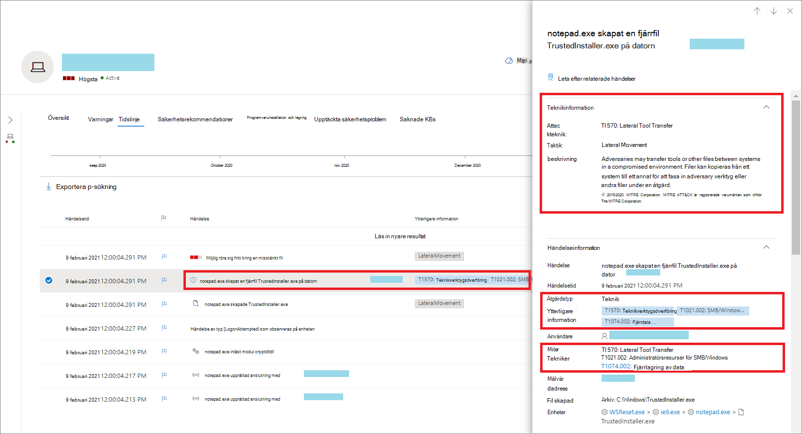
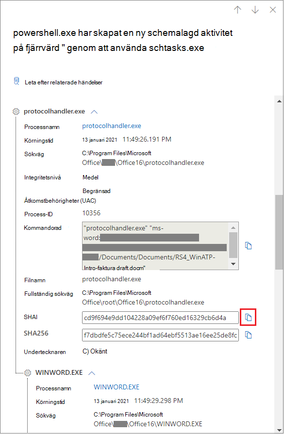
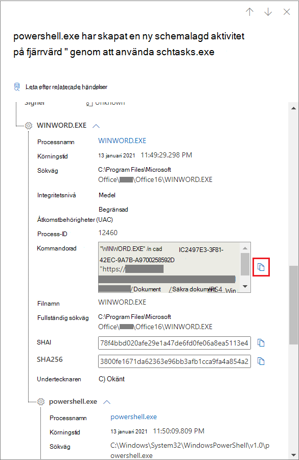
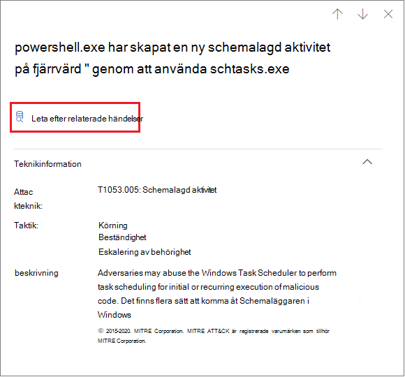
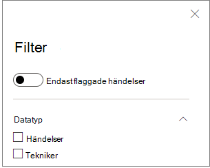

# Tekniker på enhetens tidslinjeTechniques in the device timeline

**Gäller för:****Applies to:**
- [Microsoft Defender för EndpointMicrosoft Defender for Endpoint](https://go.microsoft.com/fwlink/p/?linkid=2154037)

Du kan få mer insyn i en undersökning genom att analysera händelserna på en viss enhet.You can gain more insight in an investigation by analyzing the events that happened on a specific device. Välj först den enhet som är intressant i [listan Enheter](machines-view-overview.md).First, select the device of interest from the [Devices list](machines-view-overview.md). På enhetens sida kan du välja fliken **Tidslinje** för att visa alla händelser som inträffat på enheten.On the device page, you can select the **Timeline** tab to view all the events that occurred on the device.

## Förstå tekniker i tidslinjenUnderstand techniques in the timeline

>[!IMPORTANT]
>Viss information handlar om en förhandsversion av en produkt i en offentlig förhandsversion som kan komma att ändras väsentligt innan den släpps till allmänheten.Some information relates to a prereleased product feature in public preview which may be substantially modified before it's commercially released. Microsoft lämnar inga garantier, uttryckliga eller underförstådda, med avseende på den information som anges här.Microsoft makes no warranties, express or implied, with respect to the information provided here.

I Microsoft Defender för Slutpunkt **är Tekniker** ytterligare en datatyp i händelsetidslinjen.In Microsoft Defender for Endpoint, **Techniques** are an additional data type in the event timeline. Tekniker ger mer insyn i aktiviteter som associeras [med MITRE ATT&CK-tekniker](https://attack.mitre.org/) eller undertekniker.Techniques provide more insight on activities associated with [MITRE ATT&CK](https://attack.mitre.org/) techniques or sub-techniques. 

Den här funktionen förenklar undersökningsupplevelsen genom att hjälpa analytiker att förstå de aktiviteter som observerats på en enhet.This feature simplifies the investigation experience by helping analysts understand the activities that were observed on a device. Analytiker kan sedan bestämma sig för att undersöka ytterligare.Analysts can then decide to investigate further.

För offentlig förhandsgranskning är Tekniker tillgängliga som standard och visas tillsammans med händelser när en enhets tidslinje visas.For public preview, Techniques are available by default and shown together with events when a device's timeline is viewed. 

Tekniker markeras i fetstil och visas med en blå ikon till vänster.Techniques are highlighted in bold text and appear with a blue icon on the left. Motsvarande MITRE ATT&CK-ID och tekniknamn visas också som taggar under Ytterligare information.The corresponding MITRE ATT&CK ID and technique name also appear as tags under Additional information. 

Sök- och exportalternativ är också tillgängliga för tekniker.Search and Export options are also available for Techniques.

## Undersöka användning av sidofönstretInvestigate using the side pane

Välj en teknik för att öppna motsvarande sidofönster.Select a Technique to open its corresponding side pane. Här kan du se ytterligare information och insikter som relaterade ATT&CK-tekniker, taktiker och beskrivningar.Here you can see additional information and insights like related ATT&CK techniques, tactics, and descriptions. 

Välj den specifika *attacktekniken* för att öppna den relaterade att&CK-tekniksidan där du kan hitta mer information om den.Select the specific *Attack technique* to open the related ATT&CK technique page where you can find more information about it.

Du kan kopiera information om en enhet när du ser en blå ikon till höger.You can copy an entity's details when you see a blue icon on the right. Om du till exempel vill kopiera den relaterade filens SHA1 väljer du den blå sidikonen.For instance, to copy a related file's SHA1, select the blue page icon.

Du kan göra samma sak för kommandorader.You can do the same for command lines.

## Undersöka relaterade händelserInvestigate related events

Om du [vill använda avancerad](advanced-hunting-overview.md) sökning för att hitta händelser relaterade till den valda tekniken väljer du Sök efter relaterade **händelser.**To use [advanced hunting](advanced-hunting-overview.md) to find events related to the selected Technique, select **Hunt for related events**. Det leder till sidan för avancerad sökning med en fråga för att hitta händelser som hör till tekniken.This leads to the advanced hunting page with a query to find events related to the Technique.

>[!NOTE]
>Vid sökning med **knappen Sök** efter relaterade händelser från sidofönstret Teknik visas alla händelser som hör till den identifierade tekniken, men själva tekniken ingår inte i frågeresultatet.Querying using the **Hunt for related events** button from a Technique side pane displays all the events related to the identified technique but does not include the Technique itself in the query results.

## Anpassa enhetens tidslinjeCustomize your device timeline

Längst upp till höger på enhetens tidslinje kan du välja ett datumintervall för att begränsa antalet händelser och tekniker på tidslinjen.On the upper right-hand side of the device timeline, you can choose a date range to limit the number of events and techniques in the timeline. 

Du kan anpassa vilka kolumner som ska visas.You can customize which columns to expose. Du kan också filtrera efter flaggade händelser efter datatyp eller händelsegrupp.You can also filter for flagged events by data type or by event group.

### Välj kolumner att visaChoose columns to expose
Du kan välja vilka kolumner som ska visas i tidslinjen genom att välja **knappen Välj** kolumner.You can choose which columns to expose in the timeline by selecting the **Choose columns** button.

Därifrån kan du välja vilken informationsuppsättning som ska inkluderas.From there you can select which information set to include.

### Filter för att endast visa tekniker eller händelserFilter to view techniques or events only

Om du bara vill visa händelser eller tekniker väljer **du Filter** på enhetens tidslinje och väljer den datatyp du vill visa.To view only either events or techniques, select **Filters** from the device timeline and choose your preferred Data type to view.

## Se ävenSee also
- [Visa och ordna EnhetslistaView and organize the Devices list](machines-view-overview.md)
- [Händelseflaggor i Microsoft Defender för slutpunktsenhetstidMicrosoft Defender for Endpoint device timeline event flags](device-timeline-event-flag.md) 

 
