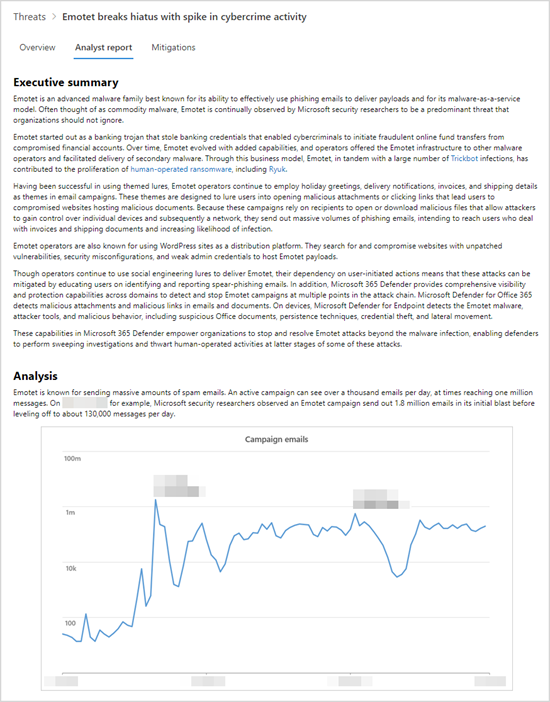

# Förstå analytikerrapporten i hotanalyser

[!INCLUDE [Microsoft 365 Defender rebranding](../../includes/microsoft-defender.md)]

**Gäller för:**
- [Microsoft Defender Avancerat skydd (Microsoft Defender ATP)](https://go.microsoft.com/fwlink/p/?linkid=2069559)
- [Microsoft Defender för Endpoint](https://go.microsoft.com/fwlink/p/?linkid=2154037)
- [Microsoft 365 Defender](https://go.microsoft.com/fwlink/?linkid=2118804)

> Vill du uppleva Microsoft Defender för Slutpunkt? [Registrera dig för en kostnadsfri utvärderingsversion.](https://www.microsoft.com/microsoft-365/windows/microsoft-defender-atp?ocid=docs-wdatp-exposedapis-abovefoldlink)

Varje [rapport om hotanalyser](threat-analytics.md) innehåller dynamiska avsnitt och ett omfattande skriftligt avsnitt som kallas _analytikerrapporten._ Öppna rapporten om de spårade hoten för att komma åt det här avsnittet och välj **fliken Analytikerrapport.**

_Analytikerrapportavsnitt i en rapport om hotanalys_

## Skanna analytikernas rapport 
Varje avsnitt i analytikerrapporten har utformats för att ge användbar information. Rapporterna varierar, men de flesta rapporter innehåller de avsnitt som beskrivs i följande tabell.

| Rapportavsnitt | Beskrivning |
|--|--|
| Sammanfattning | Översikt över hoten, bland annat när man först såg dem, dess motivation, viktiga händelser, viktiga mål samt distinkta verktyg och tekniker. Du kan använda den här informationen för att ytterligare bedöma hur du prioriterar hot inom ramen för branschen, geografisk plats och nätverk. |
| Analys | Teknisk information om hoten, bland annat information om en attack och hur attacker kan använda en ny teknik eller attackyta | 
| MITRE ATT&CK-tekniker som observerats | Hur observerade tekniker mappas till [MITRE ATT&CK-attackramverket](https://attack.mitre.org/) | 
| [Minskningar](#apply-additional-mitigations) | Rekommendationer som kan stoppa eller minska risken. Det här avsnittet innehåller också åtgärder som inte spåras dynamiskt som en del av rapporten över hotanalyser. |
| [Information om identifiering](#understand-how-each-threat-can-be-detected) | Specifika och allmänna identifieringar som tillhandahålls av Microsoft-säkerhetslösningar som kan hantera aktivitet eller komponenter som är associerade med hot. | 
| [Avancerad jakt](#find-subtle-threat-artifacts-using-advanced-hunting) | [Avancerade sökfrågor för att](advanced-hunting-overview.md) proaktivt identifiera möjliga hotaktiviteter. De flesta frågor tillhandahålls för identifiering av tillägg, särskilt för att hitta potentiellt skadliga komponenter eller beteenden som inte kan utvärderas dynamiskt som skadliga. | 
| Referenser | Microsoft och publikationer från tredje part som analytiker refererade till när de skapade rapporten. Innehållet i hotanalyser baseras på data som validerats av Microsofts forskare. Information från offentligt tillgängliga tredjepartskällor identifieras tydligt som sådan. | 
| Ändra logg | Tidpunkten då rapporten publicerades och när betydande ändringar gjorts i rapporten. |

## Tillämpa ytterligare åtgärder
Hotanalyser spårar dynamiskt [status för säkerhetsuppdateringar och säkra konfigurationer.](threat-analytics.md#mitigations-review-list-of-mitigations-and-the-status-of-your-devices) Den här informationen finns som diagram och tabeller på **fliken Minskningar.**

Förutom de här spårade minskningarna tar analysrapporten även upp åtgärder som inte _övervakas_ dynamiskt. Här är några exempel på viktiga åtgärder som inte spåras dynamiskt:

- Blockera e-postmeddelanden _med LNK-bilagor_ eller andra misstänkta filtyper
- Slumpmässiga lösenord för lokala administratörer
- Utbilda slutanvändare om nätfiske och andra vektorer
- Aktivera specifika [minskningsregler för attackytan](attack-surface-reduction.md)

Även om du kan använda **fliken** Minskningar för att bedöma din säkerhetsbegränsning mot ett hot, kan du med hjälp av de här rekommendationerna vidta ytterligare åtgärder för att förbättra säkerheten. Läs noggrant alla minskningsvägledning i analytikerrapporten och använd dem när det är möjligt.

## Förstå hur varje hot kan identifieras
Analysrapporten innehåller även funktioner för identifieringar från Microsoft Defender för endpoint antivirus och _slutpunktsidentifiering_ och svar (EDR).

### Antivirusidentifiering
De här identifieringarna är tillgängliga på enheter [med Microsoft Defender Antivirus](https://docs.microsoft.com/windows/security/threat-protection/microsoft-defender-antivirus/microsoft-defender-antivirus-in-windows-10) aktiverat. När de här identifieringarna inträffar på enheter som har introducerats till Microsoft Defender för Endpoint utlöser de även aviseringar som tar upp diagrammen i rapporten.

>[!NOTE]
>Analytikerrapporten visar även **allmänna** identifieringar som kan identifiera en mängd olika hot, utöver komponenter eller beteenden som är specifika för de spårade hoten. Dessa allmänna identifieringar återspeglas inte i diagrammen.

### Slutpunktsidentifiering och svarsaviseringar (EDR)
EDR-aviseringar upphöjs [för enheter som är onboarded till Microsoft Defender för Endpoint](onboard-configure.md). Dessa varningar förlitar sig vanligtvis på säkerhetssignaler som samlas in av Microsoft Defender för Endpoint-sensoren och andra slutpunktsfunktioner – till exempel antivirus, nätverksskydd, manipuleringsskydd – som fungerar som kraftfulla signalkällor.

Liksom listan med antivirusidentifieringar är vissa EDR-aviseringar utformade för att generellt flagga misstänkt beteende som kanske inte är kopplat till det spårade hotet. I sådana fall identifierar rapporten tydligt varningen som "allmän" och att den inte påverkar något av diagrammen i rapporten.

## Hitta diskreta hotartefakter med avancerad sökning
Vid identifieringar kan du identifiera och stoppa de spårade hoten automatiskt, men många attackaktiviteter lämnar diskreta spårningar som kräver ytterligare kontroll. Vissa attackaktiviteter har beteenden som också kan vara normala, så att de dynamiskt kan leda till driftstörningar eller till och med falska positiva identifieringar.

[Avancerad sökning](advanced-hunting-overview.md) ger ett frågegränssnitt baserat på Kusto-frågespråk som förenklar hitta diskreta indikatorer på hotaktivitet. Du kan också ta fram sammanhangsberoende information och kontrollera om indikatorer är kopplade till ett hot.

Avancerade sökfrågor i analytikernas rapporter har kontrollerats av Microsoft-analytiker och är klara att köra i den avancerade [frågeredigeraren för sökning.](https://securitycenter.windows.com/advanced-hunting) Du kan också använda frågorna för att skapa anpassade [identifieringsregler som](custom-detection-rules.md) utlöser aviseringar för framtida matchningar.

## Relaterade ämnen
- [Översikt över hotanalys](threat-analytics.md)
- [Hitta hot proaktivt med avancerad sökning](advanced-hunting-overview.md) 
- [Anpassade regler för identifiering](custom-detection-rules.md)