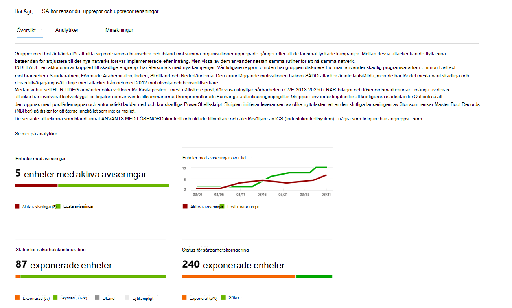
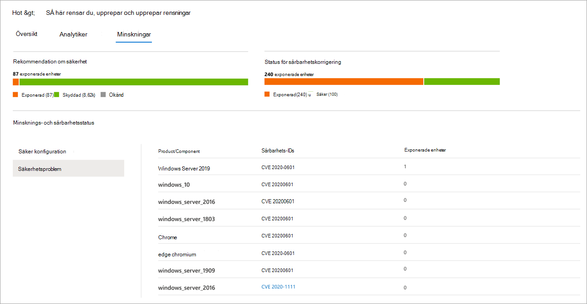

# Spåra och svara på nya hot med hotanalyserTrack and respond to emerging threats with threat analytics 

[!INCLUDE [Microsoft 365 Defender rebranding](../../includes/microsoft-defender.md)]

**Gäller för:****Applies to:**
- [Microsoft Defender för EndpointMicrosoft Defender for Endpoint](https://go.microsoft.com/fwlink/?linkid=2154037)
- [Microsoft 365 DefenderMicrosoft 365 Defender](https://go.microsoft.com/fwlink/?linkid=2118804)

> Vill du uppleva Microsoft Defender för Slutpunkt?Want to experience Microsoft Defender for Endpoint? [Registrera dig för en kostnadsfri utvärderingsversion.Sign up for a free trial.](https://www.microsoft.com/microsoft-365/windows/microsoft-defender-atp?ocid=docs-wdatp-exposedapis-abovefoldlink)

Med mer avancerade adversaries och nya hot som dyker upp ofta och ofta är det viktigt att kunna snabbt:With more sophisticated adversaries and new threats emerging frequently and prevalently, it's critical to be able to quickly:

- Utvärdera effekterna av nya hotAssess the impact of new threats
- Granska din motståndskraft mot eller exponering för hotenReview your resilience against or exposure to the threats
- Identifiera de åtgärder du kan vidta för att stoppa eller stoppa hotenIdentify the actions you can take to stop or contain the threats

Hotanalyser är en uppsättning rapporter från En expert på Microsoft-säkerhet som täcker de mest relevanta hoten, bland annat:Threat analytics is a set of reports from expert Microsoft security researchers covering the most relevant threats, including:

- Aktiva hot-aktör och deras kampanjerActive threat actors and their campaigns
- Populära och nya attackteknikerPopular and new attack techniques
- Kritiska säkerhetsproblemCritical vulnerabilities
- Vanliga attackytorCommon attack surfaces
- Vanligast förekommande skadlig programvaraPrevalent malware

Varje rapport ger en detaljerad analys av ett hot och omfattande vägledning om hur man skyddar mot det hotet.Each report provides a detailed analysis of a threat and extensive guidance on how to defend against that threat. Dessutom införlivas data från ditt nätverk, som anger om hoten är aktiva och om du har tillämpliga skydd.It also incorporates data from your network, indicating whether the threat is active and if you have applicable protections in place.

Titta på den här korta videon om du vill lära dig mer om hur hotanalyser kan hjälpa dig att spåra de senaste hoten och stoppa dem.Watch this short video to learn more about how threat analytics can help you track the latest threats and stop them.

> [!VIDEO https://www.microsoft.com/en-us/videoplayer/embed/RE4bw1f]

## Visa instrumentpanelen för hotanalyserView the threat analytics dashboard

Instrumentpanelen för hotanalyser är ett bra sätt att komma åt de rapporter som är mest relevanta för din organisation.The threat analytics dashboard is a great jump off point for getting to the reports that are most relevant to your organization. Den sammanfattar hoten i följande avsnitt:It summarizes the threats in the following sections:

- **De senaste hoten**– visar de senast publicerade hotrapporterna, tillsammans med antalet enheter med aktiva och lösta varningar.**Latest threats**—lists the most recently published threat reports, along with the number of devices with active and resolved alerts.
- **Hot med hög påverkan**– här listas de hot som har haft störst påverkan på organisationen.**High-impact threats**—lists the threats that have had the highest impact to the organization. I det här avsnittet rangordnas hot efter antalet enheter som har aktiva aviseringar.This section ranks threats by the number of devices that have active alerts.
- **Sammanfattning av** hot – visar den övergripande effekten av spårade hot genom att visa antalet hot med aktiva och lösta varningar.**Threat summary**—shows the overall impact of tracked threats by showing the number of threats with active and resolved alerts.

Välj ett hot från instrumentpanelen för att visa rapporten för det hotet.Select a threat from the dashboard to view the report for that threat.

## Visa en rapport över hotanalyserView a threat analytics report

Varje rapport över hotanalyser innehåller information i tre avsnitt: **Översikt,** **Analytikerrapport** och **Minskningar.**Each threat analytics report provides information in three sections: **Overview**, **Analyst report**, and **Mitigations**.

### Översikt: Förstå snabbt hot, utvärdera dess påverkan och granska försvarOverview: Quickly understand the threat, assess its impact, and review defenses

I **avsnittet** Översikt finns en förhandsgranskning av den detaljerade analytikerrapporten.The **Overview** section provides a preview of the detailed analyst report. Dessutom finns diagram som belyser effekterna av risken för organisationen och exponeringen via felkonfigurerade och icke-kompatibla enheter.It also provides charts that highlight the impact of the threat to your organization and your exposure through misconfigured and unpatched devices.

 _Översikt över en rapport över hotanalyser_
_Overview section of a threat analytics report_

#### Utvärdera påverkan på din organisationAssess the impact to your organization
Varje rapport innehåller diagram som är utformade för att ge information om hur ett hot påverkar organisationen:Each report includes charts designed to provide information about the organizational impact of a threat:
- **Enheter med aviseringar**– visar det aktuella antalet distinkta enheter som har påverkats av risken.**Devices with alerts**—shows the current number of distinct devices that have been impacted by the threat. En enhet kategoriseras som **Aktiv** om det finns minst  en  avisering kopplad till det hotet och löst om alla aviseringar som är associerade med hoten på enheten har lösts.A device is categorized as **Active** if there is at least one alert associated with that threat and **Resolved** if *all* alerts associated with the threat on the device have been resolved.
- **Enheter med aviseringar över tid**– visar antalet distinkta enheter med aktiva **och** **lösta** aviseringar över tid.**Devices with alerts over time**—shows the number of distinct devices with **Active** and **Resolved** alerts over time. Antalet lösta aviseringar anger hur snabbt din organisation svarar på aviseringar som är associerade med ett hot.The number of resolved alerts indicates how quickly your organization responds to alerts associated with a threat. Under idealiska tider ska diagrammet visa aviseringar som lösts inom några dagar.Ideally, the chart should be showing alerts resolved within a few days.

#### Granska motståndskraften hos säkerhet och utvärderingReview security resilience and posture
Varje rapport innehåller diagram som ger en översikt över hur flexibel din organisation är mot ett givet hot:Each report includes charts that provide an overview of how resilient your organization is against a given threat:
- **Säkerhetskonfigurationsstatus**– visar antalet enheter som har tillämpat de rekommenderade säkerhetsinställningarna som kan hjälpa till att minska risken.**Security configuration status**—shows the number of devices that have applied the recommended security settings that can help mitigate the threat. Enheter anses vara **säkra** om de har _tillämpat alla_ spårade inställningar.Devices are considered **Secure** if they have applied _all_ the tracked settings.
- **Status för sårbarhetskorrigering**– visar antalet enheter som har tillämpat säkerhetsuppdateringar eller korrigeringar som säkerhetsproblem utnyttjas av hoten.**Vulnerability patching status**—shows the number of devices that have applied security updates or patches that address vulnerabilities exploited by the threat.

### Analytikerrapport: Få expertinsikter från Microsoft-säkerhetsanalytikerAnalyst report: Get expert insight from Microsoft security researchers
Gå till avsnittet **analysrapport för** att läsa igenom den detaljerade expertens uppskrivning.Go to the **Analyst report** section to read through the detailed expert write-up. De flesta rapporter ger detaljerade beskrivningar av attackkedjor, inklusive taktiker och tekniker som mappats till MITRE ATT&CK-ramverket, uttömmande listor med rekommendationer och kraftfulla vägledningar för hot [efter](advanced-hunting-overview.md) hot.Most reports provide detailed descriptions of attack chains, including tactics and techniques mapped to the MITRE ATT&CK framework, exhaustive lists of recommendations, and powerful [threat hunting](advanced-hunting-overview.md) guidance.

[Läs mer om analytikerLearn more about the analyst report](threat-analytics-analyst-reports.md)

### Minskningar: Granska en lista över åtgärder och status för dina enheterMitigations: Review list of mitigations and the status of your devices
Granska listan **över specifika åtgärdsbara** rekommendationer i avsnittet Minskningar som kan hjälpa dig att öka organisationens motståndskraft mot risken.In the **Mitigations** section, review the list of specific actionable recommendations that can help you increase your organizational resilience against the threat. Listan över spårade åtgärder omfattar:The list of tracked mitigations includes:

- **Säkerhetsuppdateringar**– distribution av säkerhetsuppdateringar eller korrigeringar för säkerhetsproblem**Security updates**—deployment of security updates or patches for vulnerabilities
- **Inställningar för Microsoft Defender Antivirus****Microsoft Defender Antivirus settings**
  - SäkerhetsintelligensversionSecurity intelligence version
  - Moln levererat skyddCloud-delivered protection  
  - Potentiellt oönskat programskydd (PUA)Potentially unwanted application (PUA) protection
  - RealtidsskyddReal-time protection
 
I information om åtgärder i det här avsnittet ingår data från hantering av hot och [risker,](next-gen-threat-and-vuln-mgt.md)som också innehåller detaljerad information om åtgärder från olika länkar i rapporten.Mitigation information in this section incorporates data from [threat and vulnerability management](next-gen-threat-and-vuln-mgt.md), which also provides detailed drill-down information from various links in the report.

 _i avsnittet Åtgärder i en rapport om hotanalys_
_Mitigations section of a threat analytics report_

## Ytterligare rapportinformation och begränsningarAdditional report details and limitations
När du använder rapporterna ska du tänka på följande:When using the reports, keep the following in mind: 

- Data omfattas av din rollbaserade åtkomstkontroll ( RBAC).Data is scoped based on your role-based access control (RBAC) scope. Du ser statusen för enheter i grupper [som du kan komma åt.](machine-groups.md)You will see the status of devices in [groups that you can access](machine-groups.md).
- Diagram återspeglar endast minskningar som spåras.Charts reflect only mitigations that are tracked. Kontrollera rapportens översikt för ytterligare åtgärder som inte visas i diagrammen.Check the report overview for additional mitigations that are not shown in the charts.
- Minskningar garanterar inte fullständig motståndskraft.Mitigations don't guarantee complete resilience. Tillhandahållna minskningar återspeglar bästa möjliga åtgärder som krävs för att förbättra motståndskraften.The provided mitigations reflect the best possible actions needed to improve resiliency.
- Enheter räknas som "inte tillgängliga" om de inte har överfört data till tjänsten.Devices are counted as "unavailable" if they have not transmitted data to the service.
- Antivirusrelaterad statistik baseras på inställningarna för Microsoft Defender Antivirus.Antivirus-related statistics are based on Microsoft Defender Antivirus settings. Enheter med antiviruslösningar från tredje part kan visas som "exponerade".Devices with third-party antivirus solutions can appear as "exposed".

## Relaterade ämnenRelated topics
- [Hitta hot proaktivt med avancerad sökningProactively find threats with advanced hunting](advanced-hunting-overview.md) 
- [Förstå analytikernas rapportavsnittUnderstand the analyst report section](threat-analytics-analyst-reports.md)
- [Utvärdera och lösa säkerhetsbrister och exponeringarAssess and resolve security weaknesses and exposures](next-gen-threat-and-vuln-mgt.md)