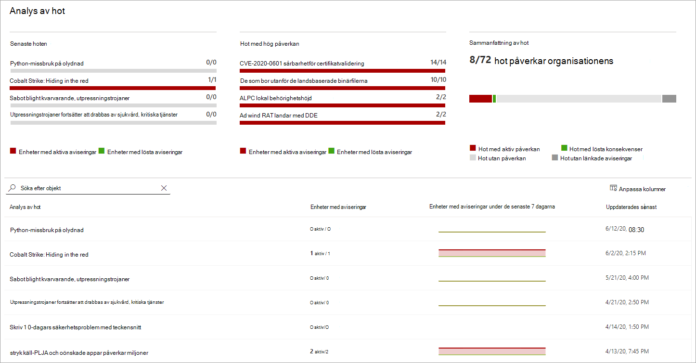

# Spåra och svara på nya hot med hotanalyser 

[!INCLUDE [Microsoft 365 Defender rebranding](../../includes/microsoft-defender.md)]

**Gäller för:**
- [Microsoft Defender för Endpoint](https://go.microsoft.com/fwlink/?linkid=2154037)
- [Microsoft 365 Defender](https://go.microsoft.com/fwlink/?linkid=2118804)

> Vill du uppleva Microsoft Defender för Slutpunkt? [Registrera dig för en kostnadsfri utvärderingsversion.](https://www.microsoft.com/microsoft-365/windows/microsoft-defender-atp?ocid=docs-wdatp-exposedapis-abovefoldlink)

Med mer avancerade adversaries och nya hot som dyker upp ofta och ofta är det viktigt att kunna snabbt:

- Utvärdera effekterna av nya hot
- Granska din motståndskraft mot eller exponering för hoten
- Identifiera de åtgärder du kan vidta för att stoppa eller stoppa hoten

Hotanalyser är en uppsättning rapporter från En expert på Microsoft-säkerhet som täcker de mest relevanta hoten, bland annat:

- Aktiva hot-aktör och deras kampanjer
- Populära och nya attacktekniker
- Kritiska säkerhetsproblem
- Vanliga attackytor
- Vanligast förekommande skadlig programvara

Varje rapport ger en detaljerad analys av ett hot och omfattande vägledning om hur man skyddar mot det hotet. Dessutom införlivas data från ditt nätverk, som anger om hoten är aktiva och om du har tillämpliga skydd.

Titta på den här korta videon om du vill lära dig mer om hur hotanalyser kan hjälpa dig att spåra de senaste hoten och stoppa dem.

> [!VIDEO https://www.microsoft.com/en-us/videoplayer/embed/RE4bw1f]

## Visa instrumentpanelen för hotanalyser

Instrumentpanelen för hotanalyser är ett bra sätt att komma åt de rapporter som är mest relevanta för din organisation. Den sammanfattar hoten i följande avsnitt:

- **De senaste hoten**– visar de senast publicerade hotrapporterna, tillsammans med antalet enheter med aktiva och lösta varningar.
- **Hot med hög påverkan**– här listas de hot som har haft störst påverkan på organisationen. I det här avsnittet rangordnas hot efter antalet enheter som har aktiva aviseringar.
- **Sammanfattning av** hot – visar den övergripande effekten av spårade hot genom att visa antalet hot med aktiva och lösta varningar.

Välj ett hot från instrumentpanelen för att visa rapporten för det hotet.

## Visa en rapport över hotanalyser

Varje rapport över hotanalyser innehåller information i tre avsnitt: **Översikt,** **Analytikerrapport** och **Minskningar.**

### Översikt: Förstå snabbt hot, utvärdera dess påverkan och granska försvar

I **avsnittet** Översikt finns en förhandsgranskning av den detaljerade analytikerrapporten. Dessutom finns diagram som belyser effekterna av risken för organisationen och exponeringen via felkonfigurerade och icke-kompatibla enheter.

 _Översikt över en rapport över hotanalyser_

#### Utvärdera påverkan på din organisation
Varje rapport innehåller diagram som är utformade för att ge information om hur ett hot påverkar organisationen:
- **Enheter med aviseringar**– visar det aktuella antalet distinkta enheter som har påverkats av risken. En enhet kategoriseras som **Aktiv** om det finns minst  en  avisering kopplad till det hotet och löst om alla aviseringar som är associerade med hoten på enheten har lösts.
- **Enheter med aviseringar över tid**– visar antalet distinkta enheter med aktiva **och** **lösta** aviseringar över tid. Antalet lösta aviseringar anger hur snabbt din organisation svarar på aviseringar som är associerade med ett hot. Under idealiska tider ska diagrammet visa aviseringar som lösts inom några dagar.

#### Granska motståndskraften hos säkerhet och utvärdering
Varje rapport innehåller diagram som ger en översikt över hur flexibel din organisation är mot ett givet hot:
- **Säkerhetskonfigurationsstatus**– visar antalet enheter som har tillämpat de rekommenderade säkerhetsinställningarna som kan hjälpa till att minska risken. Enheter anses vara **säkra** om de har _tillämpat alla_ spårade inställningar.
- **Status för sårbarhetskorrigering**– visar antalet enheter som har tillämpat säkerhetsuppdateringar eller korrigeringar som säkerhetsproblem utnyttjas av hoten.

### Analytikerrapport: Få expertinsikter från Microsoft-säkerhetsanalytiker
Gå till avsnittet **analysrapport för** att läsa igenom den detaljerade expertens uppskrivning. De flesta rapporter ger detaljerade beskrivningar av attackkedjor, inklusive taktiker och tekniker som mappats till MITRE ATT&CK-ramverket, uttömmande listor med rekommendationer och kraftfulla vägledningar för hot [efter](advanced-hunting-overview.md) hot.

[Läs mer om analytiker](threat-analytics-analyst-reports.md)

### Minskningar: Granska en lista över åtgärder och status för dina enheter
Granska listan **över specifika åtgärdsbara** rekommendationer i avsnittet Minskningar som kan hjälpa dig att öka organisationens motståndskraft mot risken. Listan över spårade åtgärder omfattar:

- **Säkerhetsuppdateringar**– distribution av säkerhetsuppdateringar eller korrigeringar för säkerhetsproblem
- **Microsoft Defender Antivirus inställningar**
  - Säkerhetsintelligensversion
  - Molnbaserat skydd  
  - Potentiellt oönskat programskydd (PUA)
  - Realtidsskydd
 
I den här informationen ingår data från [Hantering av hot och säkerhetsrisker](next-gen-threat-and-vuln-mgt.md), som också innehåller detaljerad information om åtgärder från olika länkar i rapporten.

 _i avsnittet Åtgärder i en rapport om hotanalys_

## Ytterligare rapportinformation och begränsningar
När du använder rapporterna ska du tänka på följande: 

- Data omfattas av din rollbaserade åtkomstkontroll ( RBAC). Du ser statusen för enheter i grupper [som du kan komma åt.](machine-groups.md)
- Diagram återspeglar endast minskningar som spåras. Kontrollera rapportens översikt för ytterligare åtgärder som inte visas i diagrammen.
- Minskningar garanterar inte fullständig motståndskraft. Tillhandahållna minskningar återspeglar bästa möjliga åtgärder som krävs för att förbättra motståndskraften.
- Enheter räknas som "inte tillgängliga" om de inte har överfört data till tjänsten.
- Antivirusrelaterad statistik baseras på de Microsoft Defender Antivirus inställningarna. Enheter med antiviruslösningar från tredje part kan visas som "exponerade".

## Relaterade ämnen
- [Hitta hot proaktivt med avancerad sökning](advanced-hunting-overview.md) 
- [Förstå analytikernas rapportavsnitt](threat-analytics-analyst-reports.md)
- [Utvärdera och lösa säkerhetsbrister och exponeringar](next-gen-threat-and-vuln-mgt.md)