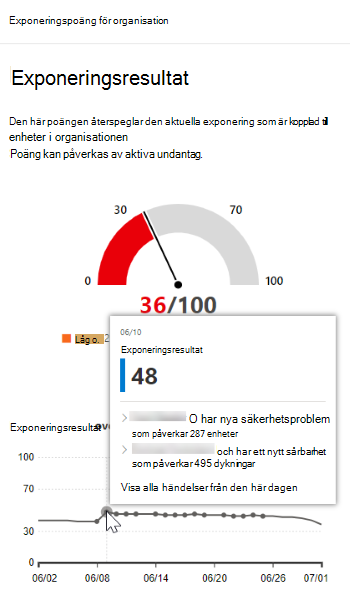
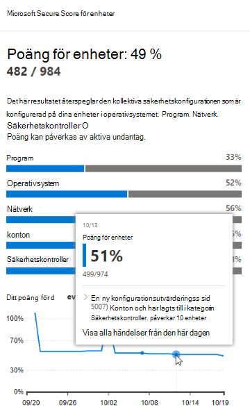
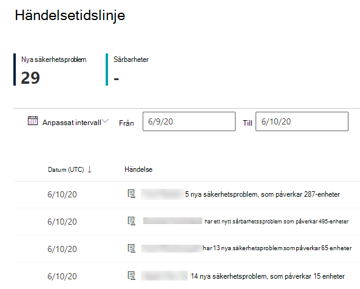
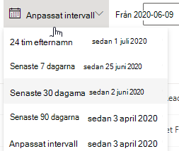
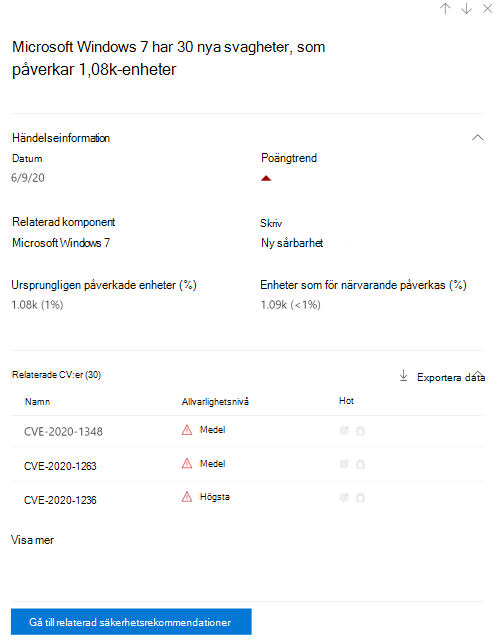
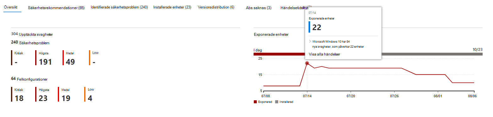

# Händelsetidslinje – hantering av hot och hot

[!INCLUDE [Microsoft 365 Defender rebranding](../../includes/microsoft-defender.md)]

**Gäller för:**
- [Microsoft Defender för Endpoint](https://go.microsoft.com/fwlink/?linkid=2154037)
- [Microsoft 365 Defender](https://go.microsoft.com/fwlink/?linkid=2118804)

>Vill du uppleva Microsoft Defender för Slutpunkt? [Registrera dig för en kostnadsfri utvärderingsversion.](https://www.microsoft.com/microsoft-365/windows/microsoft-defender-atp?ocid=docs-wdatp-portaloverview-abovefoldlink)

Händelsetidslinje är en nyhetsfeed som hjälper dig att tolka hur risker införs i organisationen genom nya säkerhetsproblem eller sårbarheter. Du kan visa händelser som kan påverka organisationens risker. Du kan till exempel hitta nya säkerhetsproblem som har introducerats, säkerhetsproblem som blev sårbarheter, sårbarheter som lagts till i en sårbarhetssats och mycket mer.

Händelsetidslinje berättar även om [exponeringsresultatet](tvm-exposure-score.md) och [Microsoft Secure Score för](tvm-microsoft-secure-score-devices.md) enheter så att du kan fastställa orsaken till stora förändringar. Händelser kan påverka dina enheter eller poäng för enheter. Minska exponeringen genom att åtgärda vad som behöver åtgärdas baserat på de prioriterade [säkerhetsrekommendationerna.](tvm-security-recommendation.md)

>[!TIP]
>E-postmeddelanden om nya sårbarhetshändelser finns i [Konfigurera e-postaviseringar om säkerhetsrisk i Microsoft Defender för slutpunkt](configure-vulnerability-email-notifications.md)

## Gå till sidan Händelsetidslinje

Det finns också tre inledningen till instrumentpanelen för hot [och sårbarhetshantering:](tvm-dashboard-insights.md)

- **Styrkort för exponering för** organisation: Hovra över händelseträffarna i diagrammet "Exponeringsresultat över tid" och välj "Visa alla händelser från den här dagen". Händelserna motsvarar säkerhetsproblem med programvara.
- **Microsoft Secure Score för enheter:** Hovra över händelseträffarna i diagrammet "Poäng för enheter över tid" och välj "Visa alla händelser från den här dagen". Händelserna representerar nya konfigurationsutvärderingar.
- **De viktigaste** evenemangskorten: Välj "Visa mer" längst ned i den översta händelsetabellen. Kortet visar de tre mest effektfulla händelserna under de senaste sju dagarna. Effektfulla händelser kan inkludera om händelsen påverkar ett stort antal enheter eller om det är ett kritiskt problem.

### Exponeringsresultat och Microsoft Secure Score för enheter

I instrumentpanelen för hantering av hot och risker hovrar du över diagrammet med exponeringsresultat för att visa de viktigaste säkerhetshändelserna för programvara från den dagen som påverkade dina enheter. Hovra över diagrammet Microsoft Secure Score för enheter för att visa nya säkerhetskonfigurationsutvärderingar som påverkar resultatet.

Om det inte finns några händelser som påverkar dina enheter eller ditt poängresultat för enheter visas ingen.

 
 

### Öka detalj detalj detalj för händelser från den dagen

Om **du väljer Visa alla händelser från** den här dagen kommer du till sidan Händelsetidslinje med ett anpassat datumintervall för den dagen.

Välj **Anpassat område** om du vill ändra datumintervallet till ett annat anpassat, eller ett förinställt tidsperiodintervall.

## Översikt över händelsetidslinje

På sidan Händelsetidslinje kan du visa all nödvändig information som är relaterad till en händelse. 

Funktioner:

- Anpassa kolumner
- Filtrera efter händelsetyp eller procent av påverkade enheter
- Visa 30, 50 eller 100 objekt per sida

De två stora siffrorna längst upp på sidan visar antalet nya säkerhetsproblem och sårbarheter, inte händelser. Vissa händelser kan ha flera säkerhetsproblem, och vissa säkerhetsproblem kan ha flera händelser.

### Kolumner

- **Datum:** månad, dag, år
- **Händelse**: effektfull händelse, inklusive komponent, typ och antal påverkade enheter
- **Relaterad komponent:** programvara
- **Ursprungligen påverkade enheter:** antalet och procentandelen påverkade enheter när den här händelsen ursprungligen inträffade. Du kan också filtrera efter procentandelen ursprungligen påverkade enheter, av ditt totala antal enheter.
- **Enheter som för närvarande påverkas**: aktuellt antal och procentandel av enheter som den här händelsen för närvarande påverkar. Du hittar fältet genom att välja **Anpassa kolumner.**
- **Typer**: speglar tidsstämplade händelser som påverkar poängen. De kan filtreras.
    - Sårbarhet tillagd i en sårbarhetssats
    - Sårbarhet har verifierats
    - Ny offentlig sårbarhet
    - Ny sårbarhet
    - Ny konfigurationsutvärdering
- **Poängtrend**: trend för exponeringsresultat

### Ikoner

Följande ikoner visas bredvid händelser:

-  Ny offentlig sårbarhet
-  Ny sårbarhet publicerades
-  Sårbarhet som hittas i sårbarhetskit
-  Sårbarhet verifierad

### Öka detalj detalj för en viss händelse

När du har valt en händelse visas en utfäll kant med en lista över information och aktuella CV:n som påverkar dina enheter. Du kan visa fler CV:er eller visa den relaterade rekommendationen.

Pilen under "poängtrend" hjälper dig att avgöra om händelsen eventuellt höjer eller sänker exponeringsresultatet för organisationen. Högre exponeringsresultat innebär att enheter är mer sårbara för användning.

Därifrån väljer du Gå **till relaterad säkerhetsrekommendationer,** se rekommendationen som handlar om den nya programsäkerhetsproblemen på [sidan med säkerhetsrekommendationer.](tvm-security-recommendation.md) När du har läst beskrivningen och sårbarhetsinformationen i säkerhetsrekommendationern kan du skicka en begäran om åtgärder och spåra begäran på [sidan För att åtgärda.](tvm-remediation.md)  

## Visa tidslinjer för händelser på programvarusidor

Om du vill öppna en programvarusida väljer du en händelse > väljer det hyperlänkade programvarunamnet (till exempel Visual Studio 2017) i avsnittet "Related component" i den utfällbar menyn. [Läs mer om programvarusidor](tvm-software-inventory.md#software-pages)

En hel sida med all information om en viss programvara visas. Håll muspekaren över diagrammet för att se tidslinjen för händelser för den specifika programvaran.

Gå till fliken händelsetidslinje för att visa alla händelser som hör till den programvaran. Du kan även se säkerhetsrekommendationer, identifierade säkerhetsproblem, installerade enheter och versionsdistribution.

## Relaterade ämnen

- [Översikt över hot- och sårbarhetshantering](next-gen-threat-and-vuln-mgt.md)
- [Instrumentpanelen](tvm-dashboard-insights.md)
- [Exponeringsvärde](tvm-exposure-score.md)
- [Säkerhetsrekommendationer](tvm-security-recommendation.md)
- [Åtgärda säkerhetsproblem](tvm-remediation.md)
- [Programvaruinventering](tvm-software-inventory.md)

