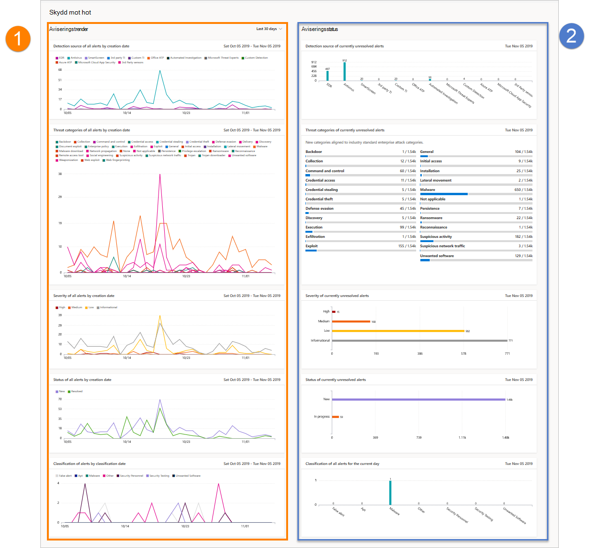

# Rapport om hotskydd i Microsoft Defender för Slutpunkt

[!INCLUDE [Microsoft 365 Defender rebranding](../../includes/microsoft-defender.md)]

**Gäller för:**
- [Microsoft Defender för Endpoint](https://go.microsoft.com/fwlink/p/?linkid=2154037)
- [Microsoft 365 Defender](https://go.microsoft.com/fwlink/?linkid=2118804)

> Vill du använda Defender för Slutpunkt? [Registrera dig för en kostnadsfri utvärderingsversion.](https://www.microsoft.com/microsoft-365/windows/microsoft-defender-atp?ocid=docs-wdatp-pullalerts-abovefoldlink) 

Rapporten om skydd mot hot ger information på hög nivå om aviseringar som genereras i organisationen. Rapporten innehåller trendinformation som visar identifieringskällor, kategorier, allvarlighetsgrad, status, klassificeringar och avgöranden för aviseringar över tid.

Instrumentpanelen är strukturerad i två avsnitt:

Avsnitt | Beskrivning 
:---|:---
1 | Aviseringstrender
2 | Sammanfattning av aviseringar

## Aviseringstrender
Som standard visar aviseringstrenderna aviseringsinformation från 30-dagarsperioden som slutar på den senaste fullständiga dagen. För att få bättre perspektiv på trender i organisationen kan du finjustera rapporteringsperioden genom att justera tidsperioden som visas. Om du vill justera tidsperioden väljer du ett tidsperiodintervall bland alternativen i listrutan:

- 30 dagar
- 3 månader
- 6 månader
- Anpassad

>[!NOTE]
>Dessa filter tillämpas endast på avsnittet aviseringstrender. Det påverkar inte sammanfattningsavsnittet för aviseringar.

## Sammanfattning av aviseringar
Även om aviseringstrender visar trendande aviseringsinformation, visar sammanfattningen av aviseringsinformation begränsad till den aktuella dagen.

 I sammanfattningen av aviseringar kan du granska nedåt till en viss aviseringskö med motsvarande filter tillämpat på den. Om du till exempel klickar på EDR-fältet i kortet Identifieringskällor kommer du till aviseringskön med resultat som bara visar aviseringar som genererats från EDR-identifieringar. 

>[!NOTE]
>Data som återspeglas i sammanfattningsavsnittet är begränsade till 180 dagar före dagens datum. Om dagens datum till exempel är 5 november 2019 visar informationen i sammanfattningsavsnittet tal från den 5 maj 2019 till den 5 november 2019. 
> Filtret som används i avsnittet trender tillämpas inte i sammanfattningsavsnittet. 

## Aviseringsattribut
Rapporten består av kort som visar följande aviseringsattribut:

- **Identifieringskällor:** Visar information om de sensor- och identifieringstekniker som tillhandahåller de data som används av Microsoft Defender för Slutpunkten för att utlösa varningar.

- **Hotkategorier:** Visar de typer av hot eller attackaktiviteter som utlöste aviseringar, som anger möjliga fokusområden för dina säkerhetsåtgärder.

- **Allvarlighetsgrad**: visar varningens allvarlighetsnivå, som visar den samlade potentiella påverkan på hot för organisationen och den svarsnivå som behövs för att hantera dem.

- **Status:** Visar lösningens status för aviseringar, vilket anger effektiviteten i dina manuella aviseringssvar och automatiserad åtgärd (om aktiverat). 

- **Klassificering & avgörande:** visar hur du har klassificerat aviseringar vid en lösning, om du har klassificerat dem som faktiska hot (faktiska varningar) eller som felaktiga identifieringar (falska aviseringar). De här korten visar också att lösta aviseringar är avgörande, vilket ger ytterligare insyn, till exempel vilka typer av faktiska hot som hittas eller legitima aktiviteter som identifierats felaktigt.

 

## Filtrera data

Använd de angivna filtren för att inkludera eller exkludera aviseringar med vissa attribut.

>[!NOTE]
>De här filtren **gäller** för alla korten i rapporten.

Om du till exempel endast vill visa data om varningar med hög allvarlighetsgrad:

1. Under **Filter > allvarlighetsgrad** väljer du **Hög**
2. Kontrollera att alla andra alternativ under **Allvarlighetsgrad** är avmarkerade.
3. Välj **Använd**. 

## Relaterat ämne
- [Rapport om enhetshälsa och efterlevnad](machine-reports.md)
