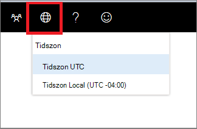

# Tidszonsinställningar i Microsoft Defender Säkerhetscenter

[!INCLUDE [Microsoft 365 Defender rebranding](../../includes/microsoft-defender.md)]

**Gäller för:**
- [Microsoft Defender för Endpoint](https://go.microsoft.com/fwlink/p/?linkid=2154037)
- [Microsoft 365 Defender](https://go.microsoft.com/fwlink/?linkid=2118804)

>Vill du uppleva Microsoft Defender för Slutpunkt? [Registrera dig för en kostnadsfri utvärderingsversion.](https://www.microsoft.com/microsoft-365/windows/microsoft-defender-atp?ocid=docs-wdatp-settings-abovefoldlink)

Använd menyn **Tidszon inställningar**  visa licensinformation.

## Tidszonsinställningar
Tidsaspekten är viktig i bedömningen och analysen av uppfattas och faktiska cyberattacker.

Cyberforensic undersökningar förlitar sig ofta på tidsstämplar för att skapa händelsesekvenser. Det är viktigt att ditt system återspeglar rätt tidszonsinställningar.

Microsoft Defender för Endpoint kan visa antingen Coordinated Universal Time (UTC) eller lokal tid.

Din aktuella tidszon visas på menyn Microsoft Defender för slutpunkt. Du kan ändra den tidszon som visas på **menyn Tidszon.**

.

### UTC-tidszon
Microsoft Defender för Slutpunkt använder UTC-tid som standard.

Om du ställer in Microsoft Defender för slutpunktens tidszon på UTC visas alla systemtidsstämplar (aviseringar, händelser och andra) i UTC för alla användare. Det kan hjälpa säkerhetsanalytiker som arbetar på olika platser över hela världen att använda samma tidsstämplar vid undersökning av händelser.

### Lokal tidszon
Du kan välja att Microsoft Defender för Endpoint ska använda lokala tidszonsinställningar. Alla aviseringar och händelser visas med din lokala tidszon.

Den lokala tidszonen tas från enhetens nationella inställningar. Om du ändrar de nationella inställningarna ändras även tidszonen för Microsoft Defender för slutpunkt. Om du väljer den här inställningen innebär det att tidsstämplar som visas i Microsoft Defender för Slutpunkt justeras efter lokal tid för alla Microsoft Defender för slutpunktsanvändare. Analytiker som befinner sig på olika globala platser ser nu Microsoft Defender för Endpoint-aviseringar i enlighet med sina nationella inställningar.

Att välja att använda lokal tid kan vara användbart om analytikerna finns på en enda plats. I det här fallet kan det vara enklare att korrelera händelser till lokal tid, till exempel när en lokal användare klickade på en länk till ett misstänkt e-postmeddelande.

### Ange tidszon
Tidszonen för Microsoft Defender för slutpunkt är som standard utc.
Om du anger tidszonen ändras även tiderna för alla Microsoft Defender för slutpunktsvyer.
Så här anger du tidszon:

1. Klicka på **tidszonsmenyn**  .
2. Välj TIDSZON **UTC-indikatorn.**
3. Välj **Tidszon UTC** eller din lokala tidszon, till exempel -07:00.

### Nationella inställningar
Om du vill använda olika datumformat för Microsoft Defender för Endpoint använder du nationella inställningar för Internet Explorer (IE) och Microsoft Edge (Edge). Om du använder en annan webbläsare, till exempel Google Chrome, följer du anvisningarna för att ändra tid och datum för den webbläsaren. 

**Internet Explorer (IE) och Microsoft Edge**

IE och Microsoft Edge använder **inställningarna för Region** som konfigurerats med alternativen **Klocka, språk** och region på Kontrollpanelen. 

#### Kända problem med nationella format

**Datum- och tidsformat** 
Det finns några kända problem med tids- och datumformat. Om du konfigurerar dina nationella inställningar till något annat än de format som stöds kanske portalen inte återspeglar dina inställningar på rätt sätt.

Följande datum- och tidsformat stöds:
- Datumformat MM/dd/yyyy
- Datumformat dd/MM/yyyy
- Tidsformat hh:mm:ss (12-timmarsformat)

Följande datum- och tidsformat stöds för närvarande inte:
- Datumformat yyyy-MM-dd
- Datumformat dd-MMM-yy
- Datumformat dd/MM/yy
- Datumformat MM/dd/yy
- Datumformat med yy. Kommer bara att visa yyyy.
- Tidsformat HH:mm:ss (24-timmarsformat)

**Decimalsymbol som används i tal** 
Decimalsymbol som används är alltid en punkt, även om ett kommatecken har markerats i inställningarna **för** Talformat i **inställningarna för** Region. Till exempel visas 15,5K som 15,5K.

