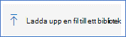

# <a name="collect-support-logs-in-microsoft-defender-for-endpoint-using-live-response"></a><span data-ttu-id="de01b-104">Samla in supportloggar i Microsoft Defender för slutpunkt med live-svar</span><span class="sxs-lookup"><span data-stu-id="de01b-104">Collect support logs in Microsoft Defender for Endpoint using live response</span></span> 


<span data-ttu-id="de01b-105">**Gäller för:**</span><span class="sxs-lookup"><span data-stu-id="de01b-105">**Applies to:**</span></span>
- [<span data-ttu-id="de01b-106">Microsoft Defender för Endpoint</span><span class="sxs-lookup"><span data-stu-id="de01b-106">Microsoft Defender for Endpoint</span></span>](https://go.microsoft.com/fwlink/p/?linkid=2154037)
- [<span data-ttu-id="de01b-107">Microsoft 365 Defender</span><span class="sxs-lookup"><span data-stu-id="de01b-107">Microsoft 365 Defender</span></span>](https://go.microsoft.com/fwlink/?linkid=2118804)

> <span data-ttu-id="de01b-108">Vill du använda Defender för Slutpunkt?</span><span class="sxs-lookup"><span data-stu-id="de01b-108">Want to experience Defender for Endpoint?</span></span> [<span data-ttu-id="de01b-109">Registrera dig för en kostnadsfri utvärderingsversion.</span><span class="sxs-lookup"><span data-stu-id="de01b-109">Sign up for a free trial.</span></span>](https://www.microsoft.com/microsoft-365/windows/microsoft-defender-atp?ocid=docs-wdatp-pullalerts-abovefoldlink) 


<span data-ttu-id="de01b-110">När du kontaktar supporten kan du bli ombedd att tillhandahålla utdatapaketet för verktyget Microsoft Defender för Endpoint Client Analyzer.</span><span class="sxs-lookup"><span data-stu-id="de01b-110">When contacting support, you may be asked to provide the output package of the Microsoft Defender for Endpoint Client Analyzer tool.</span></span>

<span data-ttu-id="de01b-111">I det här avsnittet finns instruktioner om hur du kör verktyget via Live Response.</span><span class="sxs-lookup"><span data-stu-id="de01b-111">This topic provides instructions on how to run the tool via Live Response.</span></span>

1. <span data-ttu-id="de01b-112">Ladda ned rätt skript</span><span class="sxs-lookup"><span data-stu-id="de01b-112">Download the appropriate script</span></span>
    * <span data-ttu-id="de01b-113">Endast Microsoft Defender för slutpunktsklientens sensorloggar: [LiveAnalyzer.ps1 skript](https://aka.ms/MDELiveAnalyzer).</span><span class="sxs-lookup"><span data-stu-id="de01b-113">Microsoft Defender for Endpoint client sensor logs only: [LiveAnalyzer.ps1 script](https://aka.ms/MDELiveAnalyzer).</span></span>
      - <span data-ttu-id="de01b-114">Ungefärlig storlek för resultatpaket: ~100Kb</span><span class="sxs-lookup"><span data-stu-id="de01b-114">Result package approximate size: ~100Kb</span></span> 
    *  <span data-ttu-id="de01b-115">Microsoft Defender för slutpunktsklient sensor och antivirusloggar: [LiveAnalyzer+MDAV.ps1 skript](https://aka.ms/MDELiveAnalyzerAV).</span><span class="sxs-lookup"><span data-stu-id="de01b-115">Microsoft Defender for Endpoint client sensor and Antivirus logs: [LiveAnalyzer+MDAV.ps1 script](https://aka.ms/MDELiveAnalyzerAV).</span></span>
       - <span data-ttu-id="de01b-116">Ungefärlig storlek för resultatpaket: ~10 MB</span><span class="sxs-lookup"><span data-stu-id="de01b-116">Result package approximate size: ~10Mb</span></span> 
 
2.  <span data-ttu-id="de01b-117">Starta en [Live Response-session](live-response.md#initiate-a-live-response-session-on-a-device) på den dator du behöver undersöka.</span><span class="sxs-lookup"><span data-stu-id="de01b-117">Initiate a [Live Response session](live-response.md#initiate-a-live-response-session-on-a-device) on the machine you need to investigate.</span></span>

3.  <span data-ttu-id="de01b-118">Välj **Upload till biblioteket**.</span><span class="sxs-lookup"><span data-stu-id="de01b-118">Select **Upload file to library**.</span></span>

    

4. <span data-ttu-id="de01b-120">Välj **Välj fil**.</span><span class="sxs-lookup"><span data-stu-id="de01b-120">Select **Choose file**.</span></span>

    

5. <span data-ttu-id="de01b-122">Markera den nedladdade filen med namnet MDELiveAnalyzer.ps1 klicka sedan på **Bekräfta**</span><span class="sxs-lookup"><span data-stu-id="de01b-122">Select the downloaded file named MDELiveAnalyzer.ps1 and then click on **Confirm**</span></span>


   


6. <span data-ttu-id="de01b-124">I LiveResponse-sessionen använder du kommandona nedan för att köra analyseraren och samla in resultatfilen:</span><span class="sxs-lookup"><span data-stu-id="de01b-124">While still in the LiveResponse session, use the commands below to run the analyzer and collect the result file:</span></span>

    ```console
    Run MDELiveAnalyzer.ps1
    GetFile "C:\ProgramData\Microsoft\Windows Defender Advanced Threat Protection\Downloads\MDEClientAnalyzerResult.zip" -auto
    ```

    <span data-ttu-id="de01b-125">[](images/analyzer-commands.png#lightbox)</span><span class="sxs-lookup"><span data-stu-id="de01b-125">[  ](images/analyzer-commands.png#lightbox)</span></span>


>[!NOTE]
> - <span data-ttu-id="de01b-126">Den senaste förhandsversionen av MDEClientAnalyzer kan laddas ned här: [https://aka.ms/Betamdeanalyzer](https://aka.ms/Betamdeanalyzer) .</span><span class="sxs-lookup"><span data-stu-id="de01b-126">The latest preview version of MDEClientAnalyzer can be downloaded here: [https://aka.ms/Betamdeanalyzer](https://aka.ms/Betamdeanalyzer).</span></span>
> 
> - <span data-ttu-id="de01b-127">LiveAnalyzer-skriptet laddar ned felsökningspaketet på måldatorn från: https://mdatpclientanalyzer.blob.core.windows.net .</span><span class="sxs-lookup"><span data-stu-id="de01b-127">The LiveAnalyzer script downloads the troubleshooting package on the destination machine from: https://mdatpclientanalyzer.blob.core.windows.net.</span></span>
> 
>   <span data-ttu-id="de01b-128">Om du inte kan låta datorn nå URL:en ovan laddar du upp MDEClientAnalyzerPreview.zip till biblioteket innan du kör LiveAnalyzer-skriptet:</span><span class="sxs-lookup"><span data-stu-id="de01b-128">If you cannot allow the machine to reach the above URL, then upload MDEClientAnalyzerPreview.zip file to the library before running the LiveAnalyzer script:</span></span>
>
>   ```console
>   PutFile MDEClientAnalyzerPreview.zip -overwrite
>   Run MDELiveAnalyzer.ps1
>   GetFile "C:\ProgramData\Microsoft\Windows Defender Advanced Threat Protection\Downloads\MDEClientAnalyzerResult.zip" -auto
>   ```
> 
> - <span data-ttu-id="de01b-129">Mer information om hur du samlar in data lokalt på en dator om datorn inte kommunicerar med Microsoft Defender för Endpoint-molntjänster, eller om den inte visas i Microsoft Defender för Slutpunktsportalen som förväntat, finns i Verifiera klientanslutningen till Microsoft Defender för [slutpunktstjänst-URL:er.](configure-proxy-internet.md#verify-client-connectivity-to-microsoft-defender-for-endpoint-service-urls)</span><span class="sxs-lookup"><span data-stu-id="de01b-129">For more information on gathering data locally on a machine in case the machine isn't communicating with Microsoft Defender for Endpoint cloud services, or does not appear in Microsoft Defender for Endpoint portal as expected, see [Verify client connectivity to Microsoft Defender for Endpoint service URLs](configure-proxy-internet.md#verify-client-connectivity-to-microsoft-defender-for-endpoint-service-urls).</span></span>
