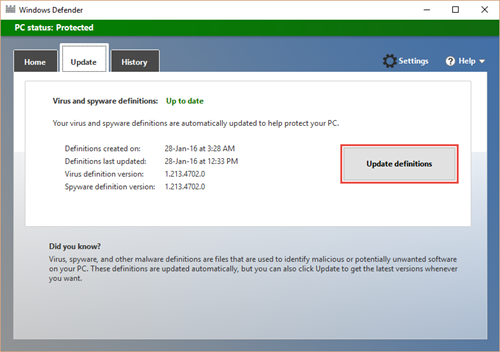

# Granska händelseloggar och felkoder för att felsöka problem med Microsoft Defender Antivirus

[!INCLUDE [Microsoft 365 Defender rebranding](../../includes/microsoft-defender.md)]

**Gäller för:**

- [Microsoft Defender för Endpoint](/microsoft-365/security/defender-endpoint/)

Om du stöter på ett problem med Microsoft Defender Antivirus kan du söka i tabellerna i den här artikeln för att hitta ett matchande problem och en möjlig lösning.

Tabelllistan:

- [Microsoft Defender Antivirus händelse-Ds](#windows-defender-av-ids) (dessa gäller både Windows 10 och Windows Server 2016)
- [Felkoder för Microsoft Defender Antivirus-klienten](#error-codes)
- [Interna felkoder för Microsoft Defender Antivirus-klienten (används av Microsoft under utveckling och testning)](#internal-error-codes)

> [!TIP]
> Du kan också besöka demowebbplatsen Microsoft Defender för slutpunkt [på demo.wd.microsoft.com](https://demo.wd.microsoft.com?ocid=cx-wddocs-testground) för att bekräfta att följande funktioner fungerar:
> 
> - Moln levererat skydd
> - Fast learning (inklusive Block at first sight)
> - Potentiellt oönskad programblockering

## Händelse-ID:er för Microsoft Defender Antivirus

Microsoft Defender Antivirus registrerar händelse-IDn i händelseloggen i Windows.

Du kan visa händelseloggen direkt, eller om du har ett säkerhetsinformations- och händelsehanteringsverktyg från tredje part (SIEM), kan du också använda [Microsoft Defender Antivirus-klienthändelse-IDn](troubleshoot-microsoft-defender-antivirus.md#windows-defender-av-ids) för att granska specifika händelser och fel från slutpunkterna.

Tabellen i det här avsnittet innehåller huvud-ID för Microsoft Defender Antivirus-händelser och, om möjligt, förslag på lösningar för att åtgärda eller lösa felet. 

## Så här visar du en Microsoft Defender Antivirus-händelse

1.  Öppna **Loggboken.**
2.  I konsolträdet expanderar du **Program- och tjänstloggar** och **sedan Microsoft** och sedan **Windows** och sedan **Windows Defender.**
3.  Dubbelklicka på **Drift.**
4.  I informationsfönstret kan du visa listan med enskilda händelser för att hitta händelsen.
5.  Klicka på händelsen om du vill se specifik information om en händelse i det nedre fönstret, under **flikarna** **Allmänt och** Information.

<table> 
<tr>
<th colspan="2" >Händelse-ID: 1000</th>
</tr>
<tr>
<td>
Symboliskt namn:
</td>
<td>
<b>MALWAREPROTECTION_SCAN_STARTED</b>
</td>
</tr>
<tr>
<td>
Meddelande:
</td>
<td >
<b>En sökning mot skadlig programvara startade. </b>
</td>
</tr>
<tr>
<td >
Beskrivning:
</td>
<td >
<dl>
<dt>Genomsöknings-ID: &lt; ID-numret för den &gt; relevanta genomsökningen.</dt> 
<dt> Skanningstyp: &lt; &gt; Skanningstyp, till exempel:<ul>
<li>Antivirus</li>
<li>Antispionprogram</li>
<li>Antimalware</li>
</ul>
</dt>
<dt>&lt;Genomsökningsparametrar: &gt; Genomsökningsparametrar, till exempel:<ul>
<li>Fullständig sökning</li>
<li>Snabbsökning</li>
<li>Kundsökning</li>
</ul>
</dt>
<dt>Sökresurser: &lt; Resurser (till exempel filer/kataloger/BHO) som &gt; skannades.</dt> 
<dt>Användare: &lt; Domain &gt; \& lt; Användare &gt; </dt>
</dl>
</td>
</tr>
<tr>
<th colspan="2">Händelse-ID: 1001</th>
</tr>
<tr><td>
Symboliskt namn:
</td>
<td >
<b>MALWAREPROTECTION_SCAN_COMPLETED</b>
</td>
</tr>
<tr>
<td>
Meddelande:
</td>
<td >
<b>En sökning efter program mot skadlig programvara slutförd.</b>
</td>
</tr>
<tr>
<td>
Beskrivning:
</td>
<td >
<dl>
<dt>Genomsöknings-ID: &lt; ID-numret för den &gt; relevanta genomsökningen.</dt> 
<dt> Skanningstyp: &lt; &gt; Skanningstyp, till exempel:<ul>
<li>Antivirus</li>
<li>Antispionprogram</li>
<li>Antimalware</li>
</ul>
</dt>
<dt>&lt;Genomsökningsparametrar: &gt; Genomsökningsparametrar, till exempel:<ul>
<li>Fullständig sökning</li>
<li>Snabbsökning</li>
<li>Kundsökning</li>
</ul>
</dt>
<dt>Användare: &lt; Domain &gt; \& lt; &gt;Användarens</dt>
<dt>genomsökningstid: &lt; Varaktigheten &gt; för en genomsökning.</dt>
</dl>
</td>
</tr>
<tr>
<th colspan="2">Händelse-ID: 1002</th>
</tr>
<tr><td>
Symboliskt namn:
</td>
<td >
<b>MALWAREPROTECTION_SCAN_CANCELLED </b>
</td>
</tr>
<tr>
<td>
Meddelande:
</td>
<td >
<b>En sökning efter program mot skadlig programvara stoppades innan den slutfördes. </b>
</td>
</tr>
<tr>
<td>
Beskrivning:
</td>
<td >
<dl>
<dt>Genomsöknings-ID: &lt; ID-numret för den &gt; relevanta genomsökningen.</dt> 
<dt> Skanningstyp: &lt; &gt; Skanningstyp, till exempel:<ul>
<li>Antivirus</li>
<li>Antispionprogram</li>
<li>Antimalware</li>
</ul>
</dt>
<dt>&lt;Genomsökningsparametrar: &gt; Genomsökningsparametrar, till exempel:<ul>
<li>Fullständig sökning</li>
<li>Snabbsökning</li>
<li>Kundsökning</li>
</ul>
</dt>
<dt>Användare: &lt; Domain &gt; &amp; lt; &gt;Användarens</dt>
<dt>genomsökningstid: &lt; Varaktigheten &gt; för en genomsökning.</dt>
</dl>
</td>
</tr>
<tr>
<th colspan="2">Händelse-ID: 1003</th>
</tr>
<tr><td>
Symboliskt namn:
</td>
<td >
<b>MALWAREPROTECTION_SCAN_PAUSED </b>
</td>
</tr>
<tr>
<td>
Meddelande:
</td>
<td >
<b>En sökning efter program mot skadlig programvara pausades. </b>
</td>
</tr>
<tr>
<td>
Beskrivning:
</td>
<td >
<dl>
<dt>Genomsöknings-ID: &lt; ID-numret för den &gt; relevanta genomsökningen.</dt> 
<dt> Skanningstyp: &lt; &gt; Skanningstyp, till exempel:<ul>
<li>Antivirus</li>
<li>Antispionprogram</li>
<li>Antimalware</li>
</ul>
</dt>
<dt>&lt;Genomsökningsparametrar: &gt; Genomsökningsparametrar, till exempel:<ul>
<li>Fullständig sökning</li>
<li>Snabbsökning</li>
<li>Kundsökning</li>
</ul>
</dt>
<dt>Användare: &lt; Domain &gt; \& lt; Användare&gt;</dt>
</dl>
</td>
</tr>
<tr>
<th colspan="2">Händelse-ID: 1004</th>
</tr>
<tr><td>
Symboliskt namn:
</td>
<td >
<b>MALWAREPROTECTION_SCAN_RESUMED </b>
</td>
</tr>
<tr>
<td>
Meddelande:
</td>
<td >
<b>En sökning efter program mot skadlig programvara återupptades. </b>
</td>
</tr>
<tr>
<td>
Beskrivning:
</td>
<td >
<dl>
<dt>Genomsöknings-ID: &lt; ID-numret för den &gt; relevanta genomsökningen.</dt> 
<dt> Skanningstyp: &lt; &gt; Skanningstyp, till exempel:<ul>
<li>Antivirus</li>
<li>Antispionprogram</li>
<li>Antimalware</li>
</ul>
</dt>
<dt>&lt;Genomsökningsparametrar: &gt; Genomsökningsparametrar, till exempel:<ul>
<li>Fullständig sökning</li>
<li>Snabbsökning</li>
<li>Kundsökning</li>
</ul>
</dt>
<dt>Användare: &lt; Domain &gt; \& lt; Användare&gt;</dt>
</dl>
</td>
</tr>
<tr>
<th colspan="2">Händelse-ID: 1005</th>
</tr>
<tr><td>
Symboliskt namn:
</td>
<td >
<b>MALWAREPROTECTION_SCAN_FAILED </b>
</td>
</tr>
<tr>
<td>
Meddelande:
</td>
<td >
<b>En sökning efter program mot skadlig programvara misslyckades. </b>
</td>
</tr>
<tr>
<td>
Beskrivning:
</td>
<td >
<dl>
<dt>Genomsöknings-ID: &lt; ID-numret för den &gt; relevanta genomsökningen.</dt> 
<dt> Skanningstyp: &lt; &gt; Skanningstyp, till exempel:<ul>
<li>Antivirus</li>
<li>Antispionprogram</li>
<li>Antimalware</li>
</ul>
</dt>
<dt>&lt;Genomsökningsparametrar: &gt; Genomsökningsparametrar, till exempel:<ul>
<li>Fullständig sökning</li>
<li>Snabbsökning</li>
<li>Kundsökning</li>
</ul>
</dt>
<dt>Användare: &lt; Domain &gt; \& lt; &gt;</dt>
<dt>Användarfelkod: &lt; Felkod &gt; resultatkod som är associerad med hotstatus. Vanliga HRESULT-värden.</dt> 
<dt>Felbeskrivning: &lt; Felbeskrivning &gt; Beskrivning av felet.</dt>
</dl>
</td>
</tr>
<tr>
<td>
Användaråtgärd:
</td>
<td >
Ett fel uppstod på antivirusklienten och den aktuella genomsökningen har stoppats. Genomsökningen kan misslyckas på grund av problem på klientsidan. Den här händelseposten omfattar genomsöknings-ID, typ av genomsökning (Microsoft Defender Antivirus, antispionprogram, program mot skadlig kod), genomsökningsparametrar, användaren som startade genomsökningen, felkoden och en beskrivning av felet.
Så här felsöker du händelsen:
<ol>
<li>Kör skanningen igen.</li>
<li>Om det misslyckas på samma sätt går du till <a href="https://go.microsoft.com/fwlink/?LinkId=215163">Microsoft Support-webbplatsen</a>och anger felnumret i rutan Sök för att leta efter felkoden. <b></b></li>
<li>Kontakta <a href="https://go.microsoft.com/fwlink/?LinkId=215491">Microsofts tekniska support</a>.
</li>
</ol>
</td>
</tr>
<tr>
<th colspan="2">Händelse-ID: 1006</th>
</tr>
<tr><td>
Symboliskt namn:
</td>
<td >
<b>MALWAREPROTECTION_MALWARE_DETECTED </b>
</td>
</tr>
<tr>
<td>
Meddelande:
</td>
<td >
<b>Kod mot skadlig programvara eller annan potentiellt oönskad programvara hittades. </b>
</td>
</tr>
<tr>
<td>
Beskrivning:
</td>
<td >
Mer information finns i följande avsnitt:
<dl>
<dt>Namn: &lt; Namn-ID &gt; </dt>
<dt>för hot: Allvarlighetsgrad för hot-ID: &lt; &gt; </dt> 
<dt> &lt; &gt; Allvarlighetsgrad , till exempel:<ul>
<li>Låg</li>
<li>Måttlig</li>
<li>Högsta</li>
<li>Allvarligt</li>
</ul>
</dt>
<dt>Kategori: &lt; &gt;Kategoribeskrivning, till exempel olika hot eller skadlig programvara.</dt> 
<dt>Sökväg: &lt; Sökväg &gt; Identifiering av</dt> 
<dt> ursprung: &lt; Identifierings &gt; ursprung, till exempel:<ul>
<li>Okänd</li>
<li>Lokal dator</li>
<li>Nätverksresurs</li>
<li>Internet</li>
<li>Inkommande trafik</li>
<li>Utgående trafik</li>
</ul>
</dt>
<dt>Identifieringstyp: &lt; &gt; Identifieringstyp, till exempel:<ul>
<li>Heuristics</li>
<li>Allmänt</li>
<li>Betong</li>
<li>Dynamisk signatur</li>
</ul>
</dt>
<dt>Identifieringskälla: &lt; &gt; Identifieringskälla till exempel:<ul>
<li>Användare: användarinitierad</li>
<li>System: initierat system</li>
<li>Realtidskomponent initierad i realtid</li>
<li>IOAV: IE-nedladdningar och initierade Bifogade Outlook Express-filer</li>
<li>NIS: System för nätverksinspektion</li>
<li>IEPROTECT: IE - IExtensionValidation; Detta skyddar mot skadliga webbsidekontroller</li>
<li>ELAM (Early Launch Antimalware). Detta inkluderar skadlig programvara som upptäckts av startsekvensen</li>
<li>Fjärr attestation</li>
</ul>Antimalware Scan Interface (AMSI). Används främst för att skydda skript (PS, VBS), men kan även anropas av tredje part.
</dt>
<dt>UAC-status: &lt; Status &gt; </dt>
<dt>Användare: &lt; Domain &gt; \& lt; &gt;Användarnamn:</dt>
<dt>Process i &lt; &gt; PID-signaturversion:</dt>Definition
<dt> &lt; version &gt; </dt>Engine
<dt>Version: &lt; Antimalware Engine-version &gt; </dt>
</dl>
</td>
</tr>
<tr>
<th colspan="2">Händelse-ID: 1007</th>
</tr>
<tr><td>
Symboliskt namn:
</td>
<td >
<b>MALWAREPROTECTION_MALWARE_ACTION_TAKEN </b>
</td>
</tr>
<tr>
<td>
Meddelande:
</td>
<td >
<b>Program mot skadlig programvara utförde en åtgärd för att skydda datorn mot skadlig programvara eller annan potentiellt oönskad programvara. </b>
</td>
</tr>
<tr>
<td>
Beskrivning:
</td>
<td >
Microsoft Defender Antivirus har vidtagit åtgärder för att skydda datorn mot skadlig programvara eller annan potentiellt oönskad programvara. Mer information finns i följande avsnitt:
<dl>
<dt>Användare: &lt; Domain &gt; \& lt; &gt;Användarnamn:</dt>
<dt> &lt; Namn-ID för &gt; </dt>
<dt>hot: Allvarlighetsgrad för &lt; &gt; hot-ID:</dt> 
<dt> &lt; &gt; Allvarlighetsgrad , till exempel:<ul>
<li>Låg</li>
<li>Måttlig</li>
<li>Högsta</li>
<li>Allvarligt</li>
</ul>
</dt>
<dt>Kategori: &lt; &gt;Kategoribeskrivning, till exempel olika hot eller skadlig programvara.</dt> 
<dt> Åtgärd: &lt; &gt; Åtgärd, till exempel:<ul>
<li>Rensa: Resursen har rensats</li>
<li>Karantän: Resursen satt i karantän</li>
<li>Ta bort: Resursen har tagits bort</li>
<li>Tillåt: Resursen har tillåtits att köra/finnas</li>
<li>Användardefinierad: Användardefinierad åtgärd som normalt är en från den här listan med åtgärder som användaren har angett</li>
<li>Ingen åtgärd: Ingen åtgärd</li>
<li>Blockera: Resursen blockerades från att köras</li>
</ul>
</dt>
<dt>Status: &lt; &gt;</dt>
<dt>Statussignaturversion: &lt; Version av &gt; definitionsversion:</dt>
<dt> &lt; Antimalware Engine-version &gt; </dt>
</dl>
</td>
</tr>
<tr>
<th colspan="2">Händelse-ID: 1008</th>
</tr>
<tr><td>
Symboliskt namn:
</td>
<td >
<b>MALWAREPROTECTION_MALWARE_ACTION_FAILED</b>
</td>
</tr>
<tr>
<td>
Meddelande:
</td>
<td >
<b>Program mot skadlig programvara försökte utföra en åtgärd för att skydda datorn mot skadlig programvara eller annan potentiellt oönskad programvara, men åtgärden misslyckades.</b>
</td>
</tr>
<tr>
<td>
Beskrivning:
</td>
<td >
Det har uppstått ett fel i Microsoft Defender Antivirus när skadlig programvara eller annan potentiellt oönskad programvara vidtas. Mer information finns i följande avsnitt:
<dl>
<dt>Användare: &lt; Domain &gt; \& lt; &gt;Användarnamn:</dt>
<dt> &lt; Namn-ID för &gt; </dt>
<dt>hot: Allvarlighetsgrad för &lt; &gt; hot-ID:</dt> 
<dt> &lt; &gt; Allvarlighetsgrad , till exempel:<ul>
<li>Låg</li>
<li>Måttlig</li>
<li>Högsta</li>
<li>Allvarligt</li>
</ul>
</dt>
<dt>Kategori: &lt; &gt;Kategoribeskrivning, till exempel olika hot eller skadlig programvara.</dt> 
<dt>Sökväg: &lt; Filsökväg &gt; </dt> 
<dt> &lt; Åtgärd: &gt; Åtgärd, till exempel:<ul>
<li>Rensa: Resursen har rensats</li>
<li>Karantän: Resursen satt i karantän</li>
<li>Ta bort: Resursen har tagits bort</li>
<li>Tillåt: Resursen har tillåtits att köra/finnas</li>
<li>Användardefinierad: Användardefinierad åtgärd som normalt är en från den här listan med åtgärder som användaren har angett</li>
<li>Ingen åtgärd: Ingen åtgärd</li>
<li>Blockera: Resursen blockerades från att köras</li>
</ul>
</dt>
<dt>Felkod: &lt; Felkod &gt; Resultatkod kopplad till hotstatus. Vanliga HRESULT-värden. </dt> 
<dt>Felbeskrivning: &lt; &gt; Felbeskrivning Beskrivning av felet.</dt> 
<dt>Status: &lt; &gt;</dt>
<dt>Statussignaturversion: &lt; Version av &gt; definitionsversion:</dt>
<dt> &lt; Antimalware Engine-version &gt; </dt>
</dl>
</td>
</tr>
<tr>
<th colspan="2">Händelse-ID: 1009</th>
</tr>
<tr><td>
Symboliskt namn:
</td>
<td >
<b>MALWAREPROTECTION_QUARANTINE_RESTORE </b>
</td>
</tr>
<tr>
<td>
Meddelande:
</td>
<td >
<b>Program mot skadlig programvara återställde ett objekt från karantän. </b>
</td>
</tr>
<tr>
<td>
Beskrivning:
</td>
<td >
Microsoft Defender Antivirus har återställt ett objekt från karantän. Mer information finns i följande avsnitt:
<dl>
<dt>Namn: &lt; Namn-ID &gt; </dt>
<dt>för hot: Allvarlighetsgrad för hot-ID: &lt; &gt; </dt> 
<dt> &lt; &gt; Allvarlighetsgrad , till exempel:<ul>
<li>Låg</li>
<li>Måttlig</li>
<li>Högsta</li>
<li>Allvarligt</li>
</ul>
</dt>
<dt>Kategori: &lt; &gt;Kategoribeskrivning, till exempel olika hot eller skadlig programvara.</dt> 
<dt>Sökväg: &lt; Sökväg &gt; Användare:</dt>
<dt>Domän &lt; &gt; \& lt; &gt;</dt>
<dt>Användarsignaturversion: &lt; &gt; Definition version</dt>Engine
<dt>Version: &lt; Antimalware Engine-version &gt; </dt>
</dl>
</td>
</tr>
<tr>
<th colspan="2">Händelse-ID: 1010</th>
</tr>
<tr><td>
Symboliskt namn:
</td>
<td >
<b>MALWAREPROTECTION_QUARANTINE_RESTORE_FAILED </b>
</td>
</tr>
<tr>
<td>
Meddelande:
</td>
<td >
<b>Program mot skadlig programvara kunde inte återställa ett objekt från karantän. </b>
</td>
</tr>
<tr>
<td>
Beskrivning:
</td>
<td >
Det har uppstått ett fel i Microsoft Defender Antivirus om att försöka återställa ett objekt från karantän. Mer information finns i följande avsnitt:
<dl>
<dt>Namn: &lt; Namn-ID &gt; </dt>
<dt>för hot: Allvarlighetsgrad för hot-ID: &lt; &gt; </dt> 
<dt> &lt; &gt; Allvarlighetsgrad , till exempel:<ul>
<li>Låg</li>
<li>Måttlig</li>
<li>Högsta</li>
<li>Allvarligt</li>
</ul>
</dt>
<dt>Kategori: &lt; &gt;Kategoribeskrivning, till exempel olika hot eller skadlig programvara.</dt> 
<dt>Sökväg: &lt; Sökväg &gt; Användare:</dt>
<dt>Domän &lt; &gt; \& lt; &gt;</dt>
<dt>Användarfelkod: &lt; Felkod &gt; resultatkod som är associerad med hotstatus. Vanliga HRESULT-värden. </dt> 
<dt>Felbeskrivning: &lt; &gt; Felbeskrivning Beskrivning av felet.</dt> 
<dt>Signaturversion: &lt; Definition &gt; version</dt>
<dt>Engine Version: &lt; Antimalware Engine version &gt; </dt>
</dl>
</td>
</tr>
<tr>
<th colspan="2">Händelse-ID: 1011</th>
</tr>
<tr><td>
Symboliskt namn:
</td>
<td >
<b>MALWAREPROTECTION_QUARANTINE_DELETE</b>
</td>
</tr>
<tr>
<td>
Meddelande:
</td>
<td >
<b>Program mot skadlig programvara tog bort ett objekt från karantän. </b>
</td>
</tr>
<tr>
<td>
Beskrivning:
</td>
<td >
Ett objekt har tagits bort från karantän i Microsoft Defender Antivirus. Mer information finns i följande avsnitt:
<dl>
<dt>Namn: &lt; Namn-ID &gt; </dt>
<dt>för hot: Allvarlighetsgrad för hot-ID: &lt; &gt; </dt> 
<dt> &lt; &gt; Allvarlighetsgrad , till exempel:<ul>
<li>Låg</li>
<li>Måttlig</li>
<li>Högsta</li>
<li>Allvarligt</li>
</ul>
</dt>
<dt>Kategori: &lt; &gt;Kategoribeskrivning, till exempel olika hot eller skadlig programvara.</dt> 
<dt>Sökväg: &lt; Sökväg &gt; Användare:</dt>
<dt>Domän &lt; &gt; \& lt; &gt;</dt>
<dt>Användarsignaturversion: &lt; &gt; Definition version</dt>Engine
<dt>Version: &lt; Antimalware Engine-version &gt; </dt>
</dl>
</td>
</tr>
<tr>
<th colspan="2">Händelse-ID: 1012</th>
</tr>
<tr><td>
Symboliskt namn:
</td>
<td >
<b>MALWAREPROTECTION_QUARANTINE_DELETE_FAILED </b>
</td>
</tr>
<tr>
<td>
Meddelande:
</td>
<td >
<b>Det gick inte att ta bort ett objekt från karantän på plattformen för program mot skadlig programvara.</b>
</td>
</tr>
<tr>
<td>
Beskrivning:
</td>
<td >
Det har uppstått ett fel i Microsoft Defender Antivirus när ett objekt ska tas bort från karantän.
Mer information finns i följande avsnitt:
<dl>
<dt>Namn: &lt; Namn-ID &gt; </dt>
<dt>för hot: Allvarlighetsgrad för hot-ID: &lt; &gt; </dt> 
<dt> &lt; &gt; Allvarlighetsgrad , till exempel:<ul>
<li>Låg</li>
<li>Måttlig</li>
<li>Högsta</li>
<li>Allvarligt</li>
</ul>
</dt>
<dt>Kategori: &lt; &gt;Kategoribeskrivning, till exempel olika hot eller skadlig programvara.</dt> 
<dt>Sökväg: &lt; Sökväg &gt; Användare:</dt>
<dt>Domän &lt; &gt; \& lt; &gt;</dt>
<dt>Användarfelkod: &lt; Felkod &gt; resultatkod som är associerad med hotstatus. Vanliga HRESULT-värden. </dt> 
<dt>Felbeskrivning: &lt; &gt; Felbeskrivning Beskrivning av felet.</dt> 
<dt>Signaturversion: &lt; Definition &gt; version</dt>
<dt>Engine Version: &lt; Antimalware Engine version &gt; </dt>
</dl>
</td>
</tr>
<tr>
<th colspan="2">Händelse-ID: 1013</th>
</tr>
<tr><td>
Symboliskt namn:
</td>
<td >
<b>MALWAREPROTECTION_MALWARE_HISTORY_DELETE </b>
</td>
</tr>
<tr>
<td>
Meddelande:
</td>
<td >
<b>Program mot skadlig programvara raderades från historiken för skadlig programvara och annan potentiellt oönskad programvara.</b>
</td>
</tr>
<tr>
<td>
Beskrivning:
</td>
<td >
Microsoft Defender Antivirus har tagit bort historik över skadlig programvara och annan potentiellt oönskad programvara.
<dl>
<dt>Tid: Tiden då händelsen inträffade, till exempel när historiken rensas. Den här parametern används inte i hothändelser, så det finns ingen förvirring kring om det är åtgärdstid eller smitta tid. För dem kallar vi dem specifikt för Åtgärdstid eller Identifieringstid.</dt> 
<dt>Användare: &lt; Domain &gt; \& lt; Användare &gt; </dt>
</dl>
</td>
</tr>
<tr>
<th colspan="2">Händelse-ID: 1014</th>
</tr>
<tr><td>
Symboliskt namn:
</td>
<td >
<b>MALWAREPROTECTION_MALWARE_HISTORY_DELETE_FAILED </b>
</td>
</tr>
<tr>
<td>
Meddelande:
</td>
<td >
Det gick inte att radera historik över skadlig programvara och annan potentiellt oönskad programvara på programplattformen.
</td>
</tr>
<tr>
<td>
Beskrivning:
</td>
<td >
Ett fel har uppstått i Microsoft Defender Antivirus vid försök att ta bort historik över skadlig programvara och annan potentiellt oönskad programvara.
<dl>
<dt>Tid: Tiden då händelsen inträffade, till exempel när historiken rensas. Den här parametern används inte i hothändelser, så det finns ingen förvirring kring om det är åtgärdstid eller smitta tid. För dem kallar vi dem specifikt för Åtgärdstid eller Identifieringstid.</dt> 
<dt>Användare: &lt; Domain &gt; \& lt; &gt;</dt>
<dt>Användarfelkod: &lt; Felkod &gt; resultatkod som är associerad med hotstatus. Vanliga HRESULT-värden. </dt> 
<dt>Felbeskrivning: &lt; &gt; Felbeskrivning Beskrivning av felet.</dt>
</dl>
</td>
</tr>
<tr>
<th colspan="2">Händelse-ID: 1015</th>
</tr>
<tr><td>
Symboliskt namn:
</td>
<td >
<b>MALWAREPROTECTION_BEHAVIOR_DETECTED </b>
</td>
</tr>
<tr>
<td>
Meddelande:
</td>
<td >
<b>Motprogramplattformen upptäckte misstänkt beteende.</b>
</td>
</tr>
<tr>
<td>
Beskrivning:
</td>
<td >
Microsoft Defender Antivirus har upptäckt ett misstänkt beteende. Mer information finns i följande avsnitt:
<dl>
<dt>Namn: &lt; Namn-ID &gt; </dt>
<dt>för hot: Allvarlighetsgrad för hot-ID: &lt; &gt; </dt> 
<dt> &lt; &gt; Allvarlighetsgrad , till exempel:<ul>
<li>Låg</li>
<li>Måttlig</li>
<li>Högsta</li>
<li>Allvarligt</li>
</ul>
</dt>
<dt>Kategori: &lt; &gt;Kategoribeskrivning, till exempel olika hot eller skadlig programvara.</dt> 
<dt>Sökväg: &lt; Sökväg &gt; Identifiering av</dt> 
<dt> ursprung: &lt; Identifierings &gt; ursprung, till exempel:
<ul>
<li>Okänd</li>
<li>Lokal dator</li>
<li>Nätverksresurs</li>
<li>Internet</li>
<li>Inkommande trafik</li>
<li>Utgående trafik</li>
</ul>
</dt>
<dt>Identifieringstyp: &lt; &gt; Identifieringstyp, till exempel:<ul>
<li>Heuristics</li>
<li>Allmänt</li>
<li>Betong</li>
<li>Dynamisk signatur</li>
</ul>
</dt>
<dt>Identifieringskälla: &lt; &gt; Identifieringskälla till exempel:<ul>
<li>Användare: användarinitierad</li>
<li>System: initierat system</li>
<li>Realtidskomponent initierad i realtid</li>
<li>IOAV: IE-nedladdningar och initierade Bifogade Outlook Express-filer</li>
<li>NIS: System för nätverksinspektion</li>
<li>IEPROTECT: IE - IExtensionValidation; Detta skyddar mot skadliga webbsidekontroller</li>
<li>ELAM (Early Launch Antimalware). Detta inkluderar skadlig programvara som upptäckts av startsekvensen</li>
<li>Fjärr attestation</li>
</ul>Antimalware Scan Interface (AMSI). Används främst för att skydda skript (PS, VBS), men kan även anropas av tredje part.
</dt>
<dt>UAC-status: &lt; Status &gt; </dt>
<dt>Användare: &lt; Domain &gt; \& lt; &gt;Användarnamn:</dt>
<dt>Process i &lt; &gt; PID-signatur-ID:</dt>
<dt>Uppräkningsmatchning för allvarlighetsgrad.</dt> 
<dt>Signaturversion: &lt; Definition &gt; version</dt>
<dt>Engine Version: &lt; Antimalware Engine version &gt; </dt>
<dt>Återgivningsetikett:</dt>
<dt>Target File Name: Filnamn för &lt; &gt; filen.</dt>
</dl>
</td>
</tr>
<tr>
<th colspan="2">Händelse-ID: 1116</th>
</tr>
<tr><td>
Symboliskt namn:
</td>
<td >
<b>MALWAREPROTECTION_STATE_MALWARE_DETECTED</b>
</td>
</tr>
<tr>
<td>
Meddelande:
</td>
<td >
<b>Program mot skadlig programvara eller annan potentiellt oönskad programvara har upptäckts. </b>
</td>
</tr>
<tr>
<td>
Beskrivning:
</td>
<td >
Microsoft Defender Antivirus har upptäckt skadlig programvara eller annan potentiellt oönskad programvara. Mer information finns i följande avsnitt:
<dl>
<dt>Namn: &lt; Namn-ID &gt; </dt>
<dt>för hot: Allvarlighetsgrad för hot-ID: &lt; &gt; </dt> 
<dt> &lt; &gt; Allvarlighetsgrad , till exempel:<ul>
<li>Låg</li>
<li>Måttlig</li>
<li>Högsta</li>
<li>Allvarligt</li>
</ul>
</dt>
<dt>Kategori: &lt; &gt;Kategoribeskrivning, till exempel olika hot eller skadlig programvara.</dt> 
<dt>Sökväg: &lt; Sökväg &gt; Identifiering av</dt> 
<dt> ursprung: &lt; Identifierings &gt; ursprung, till exempel:
<ul>
<li>Okänd</li>
<li>Lokal dator</li>
<li>Nätverksresurs</li>
<li>Internet</li>
<li>Inkommande trafik</li>
<li>Utgående trafik</li>
</ul>
</dt>
<dt>Identifieringstyp: &lt; &gt; Identifieringstyp, till exempel:<ul>
<li>Heuristics</li>
<li>Allmänt</li>
<li>Betong</li>
<li>Dynamisk signatur</li>
</ul>
</dt>
<dt>Identifieringskälla: &lt; &gt; Identifieringskälla till exempel:<ul>
<li>Användare: användarinitierad</li>
<li>System: initierat system</li>
<li>Realtidskomponent initierad i realtid</li>
<li>IOAV: IE-nedladdningar och initierade Bifogade Outlook Express-filer</li>
<li>NIS: System för nätverksinspektion</li>
<li>IEPROTECT: IE - IExtensionValidation; Detta skyddar mot skadliga webbsidekontroller</li>
<li>ELAM (Early Launch Antimalware). Detta inkluderar skadlig programvara som upptäckts av startsekvensen</li>
<li>Fjärr attestation</li>
</ul>Antimalware Scan Interface (AMSI). Används främst för att skydda skript (PS, VBS), men kan även anropas av tredje part.
</dt>
<dt>UAC-användare: &lt; Domän &gt; \& lt; &gt;Användarnamn:</dt>
<dt>Process i &lt; &gt; PID-signaturversion:</dt>Definition
<dt> &lt; version &gt; </dt>Engine
<dt>Version: &lt; Antimalware Engine-version &gt; </dt>
</dl>
</td>
</tr>
<tr>
<td>
Användaråtgärd:
</td>
<td >
Ingen åtgärd krävs. Microsoft Defender Antivirus kan avbryta och vidta rutinmässiga åtgärder mot det här hotet. Om du vill ta bort risken manuellt går du till gränssnittet för Microsoft Defender Antivirus och klickar på <b>Rensa dator.</b>
</td>
</tr>
<tr>
<th colspan="2">Händelse-ID: 1117</th>
</tr>
<tr><td>
Symboliskt namn:
</td>
<td >
<b>MALWAREPROTECTION_STATE_MALWARE_ACTION_TAKEN </b>
</td>
</tr>
<tr>
<td>
Meddelande:
</td>
<td >
<b>Program mot skadlig programvara utförde en åtgärd för att skydda datorn mot skadlig programvara eller annan potentiellt oönskad programvara. </b>
</td>
</tr>
<tr>
<td>
Beskrivning:
</td>
<td >
Microsoft Defender Antivirus har vidtagit åtgärder för att skydda datorn mot skadlig programvara eller annan potentiellt oönskad programvara. Mer information finns i följande avsnitt:
<dl>
<dt>Namn: &lt; Namn-ID &gt; </dt>
<dt>för hot: Allvarlighetsgrad för hot-ID: &lt; &gt; </dt> 
<dt> &lt; &gt; Allvarlighetsgrad , till exempel:<ul>
<li>Låg</li>
<li>Måttlig</li>
<li>Högsta</li>
<li>Allvarligt</li>
</ul>
</dt>
<dt>Kategori: &lt; &gt;Kategoribeskrivning, till exempel olika hot eller skadlig programvara.</dt> 
<dt>Sökväg: &lt; Sökväg &gt; Identifiering av</dt> 
<dt> ursprung: &lt; Identifierings &gt; ursprung, till exempel:
<ul>
<li>Okänd</li>
<li>Lokal dator</li>
<li>Nätverksresurs</li>
<li>Internet</li>
<li>Inkommande trafik</li>
<li>Utgående trafik</li>
</ul>
</dt>
<dt>Identifieringstyp: &lt; &gt; Identifieringstyp, till exempel:<ul>
<li>Heuristics</li>
<li>Allmänt</li>
<li>Betong</li>
<li>Dynamisk signatur</li>
</ul>
</dt>
<dt>Identifieringskälla: &lt; &gt; Identifieringskälla till exempel:<ul>
<li>Användare: användarinitierad</li>
<li>System: initierat system</li>
<li>Realtidskomponent initierad i realtid</li>
<li>IOAV: IE-nedladdningar och initierade Bifogade Outlook Express-filer</li>
<li>NIS: System för nätverksinspektion</li>
<li>IEPROTECT: IE - IExtensionValidation; Detta skyddar mot skadliga webbsidekontroller</li>
<li>ELAM (Early Launch Antimalware). Detta inkluderar skadlig programvara som upptäckts av startsekvensen</li>
<li>Fjärr attestation</li>
</ul>Antimalware Scan Interface (AMSI). Används främst för att skydda skript (PS, VBS), men kan även anropas av tredje part.
</dt>
<dt>UAC-användare: &lt; Domän &gt; \& lt; &gt;Användarnamn:</dt>
<dt>Process i &lt; &gt; PID-åtgärden:</dt>Åtgärd , till 
<dt> &lt; &gt; exempel:<ul>
<li>Rensa: Resursen har rensats</li>
<li>Karantän: Resursen satt i karantän</li>
<li>Ta bort: Resursen har tagits bort</li>
<li>Tillåt: Resursen har tillåtits att köra/finnas</li>
<li>Användardefinierad: Användardefinierad åtgärd som normalt är en från den här listan med åtgärder som användaren har angett</li>
<li>Ingen åtgärd: Ingen åtgärd</li>
<li>Blockera: Resursen blockerades från att köras</li>
</ul>
</dt>
<dt>Åtgärdsstatus: &lt; Beskrivning av &gt; ytterligare åtgärder</dt>
<dt>Felkod: &lt; Felkod &gt; resultatkod som är associerad med hotstatus. Vanliga HRESULT-värden.</dt> 
<dt>Felbeskrivning: &lt; Felbeskrivning &gt; Beskrivning av felet.</dt> 
<dt>Signaturversion: &lt; Version &gt; av definitionsversion:</dt>
<dt>Version av &lt; &gt; antimalwaremotorn:</dt> När Microsoft Defender Antivirus, Microsoft Security Essentials, borttagningsverktyget för skadlig programvara eller System Center Endpoint Protection upptäcker en skadlig programvara återställs följande systeminställningar och tjänster som den skadliga programvaran kan ha ändrat:<ul>
<li>Standardinställning för Internet Explorer eller Microsoft Edge</li>
<li>Inställningar för användaråtkomstkontroll</li>
<li>Chrome-inställningar</li>
<li>Startkontrolldata</li>
<li>Registerinställningar för Regedit och Aktivitetshanteraren</li>
<li>Windows Update, Intelligent Transfer-tjänst för bakgrund och tjänsten för fjärrprocedursamtal</li>
<li>Windows-operativsystemfiler</li></ul>
Ovanstående sammanhang gäller för följande klient- och serverversioner:
<table>
<tr>
<th>Operativsystem</th>
<th>Operativsystemsversion</th>
</tr>
<tr>
<td>
Klientoperativsystemet
</td>
<td>
Windows Vista (Service Pack 1 eller Service Pack 2), Windows 7 och senare
</td>
</tr>
<tr>
<td>
Server-operativsystem
</td>
<td>
Windows Server 2008, Windows Server 2008 R2, Windows Server 2012 och Windows Server 2016
</td>
</tr>
</table>
</dl>
</td>
</tr>
<tr>
<td>
Användaråtgärd:
</td>
<td >
Ingen åtgärd krävs. Microsoft Defender Antivirus har tagits bort eller sätts i karantän för ett hot. 
</td>
</tr>
<tr>
<th colspan="2">Händelse-ID: 1118</th>
</tr>
<tr><td>
Symboliskt namn:
</td>
<td >
<b>MALWAREPROTECTION_STATE_MALWARE_ACTION_FAILED</b>
</td>
</tr>
<tr>
<td>
Meddelande:
</td>
<td >
<b>Program mot skadlig programvara försökte utföra en åtgärd för att skydda datorn mot skadlig programvara eller annan potentiellt oönskad programvara, men åtgärden misslyckades. </b>
</td>
</tr>
<tr>
<td>
Beskrivning:
</td>
<td >
Ett icke-kritiskt fel har uppstått i Microsoft Defender Antivirus när skadlig programvara eller annan potentiellt oönskad programvara vidtas. Mer information finns i följande avsnitt:
<dl>
<dt>Namn: &lt; Namn-ID &gt; </dt>
<dt>för hot: Allvarlighetsgrad för hot-ID: &lt; &gt; </dt> 
<dt> &lt; &gt; Allvarlighetsgrad , till exempel:<ul>
<li>Låg</li>
<li>Måttlig</li>
<li>Högsta</li>
<li>Allvarligt</li>
</ul>
</dt>
<dt>Kategori: &lt; &gt;Kategoribeskrivning, till exempel olika hot eller skadlig programvara.</dt> 
<dt>Sökväg: &lt; Sökväg &gt; Identifiering av</dt> 
<dt> ursprung: &lt; Identifierings &gt; ursprung, till exempel:
<ul>
<li>Okänd</li>
<li>Lokal dator</li>
<li>Nätverksresurs</li>
<li>Internet</li>
<li>Inkommande trafik</li>
<li>Utgående trafik</li>
</ul>
</dt>
<dt>Identifieringstyp: &lt; &gt; Identifieringstyp, till exempel:<ul>
<li>Heuristics</li>
<li>Allmänt</li>
<li>Betong</li>
<li>Dynamisk signatur</li>
</ul>
</dt>
<dt>Identifieringskälla: &lt; &gt; Identifieringskälla till exempel:<ul>
<li>Användare: användarinitierad</li>
<li>System: initierat system</li>
<li>Realtidskomponent initierad i realtid</li>
<li>IOAV: IE-nedladdningar och initierade Bifogade Outlook Express-filer</li>
<li>NIS: System för nätverksinspektion</li>
<li>IEPROTECT: IE - IExtensionValidation; Detta skyddar mot skadliga webbsidekontroller</li>
<li>ELAM (Early Launch Antimalware). Detta inkluderar skadlig programvara som upptäckts av startsekvensen</li>
<li>Fjärr attestation</li>
</ul>Antimalware Scan Interface (AMSI). Används främst för att skydda skript (PS, VBS), men kan även anropas av tredje part.
</dt>
<dt>UAC-användare: &lt; Domän &gt; \& lt; &gt;Användarnamn:</dt>
<dt>Process i &lt; &gt; PID-åtgärden:</dt>Åtgärd , till 
<dt> &lt; &gt; exempel:<ul>
<li>Rensa: Resursen har rensats</li>
<li>Karantän: Resursen satt i karantän</li>
<li>Ta bort: Resursen har tagits bort</li>
<li>Tillåt: Resursen har tillåtits att köra/finnas</li>
<li>Användardefinierad: Användardefinierad åtgärd som normalt är en från den här listan med åtgärder som användaren har angett</li>
<li>Ingen åtgärd: Ingen åtgärd</li>
<li>Blockera: Resursen blockerades från att köras</li>
</ul>
</dt>
<dt>Åtgärdsstatus: &lt; Beskrivning av &gt; ytterligare åtgärder</dt>
<dt>Felkod: &lt; Felkod &gt; resultatkod som är associerad med hotstatus. Vanliga HRESULT-värden.</dt> 
<dt>Felbeskrivning: &lt; Felbeskrivning &gt; Beskrivning av felet.</dt> 
<dt>Signaturversion: &lt; Definition &gt; version</dt>
<dt>Engine Version: &lt; Antimalware Engine version &gt; </dt>
</dl>
</td>
</tr>
<tr>
<td>
Användaråtgärd:
</td>
<td >
Ingen åtgärd krävs. Microsoft Defender Antivirus kunde inte slutföra en uppgift som rör åtgärden för skadlig programvara. Det här är inte ett kritiskt fel.
</td>
</tr>
<tr>
<th colspan="2">Händelse-ID: 1119</th>
</tr>
<tr><td>
Symboliskt namn:
</td>
<td >
<b>MALWAREPROTECTION_STATE_MALWARE_ACTION_CRITICALLY_FAILED </b>
</td>
</tr>
<tr>
<td>
Meddelande:
</td>
<td >
<b>På program mot skadlig programvara påträffades ett kritiskt fel när man försökte vidta åtgärder mot skadlig programvara eller annan potentiellt oönskad programvara. Det finns mer information i händelsemeddelandet.</b>
</td>
</tr>
<tr>
<td>
Beskrivning:
</td>
<td >
Ett kritiskt fel har uppstått i Microsoft Defender Antivirus när du vidtar åtgärder mot skadlig programvara eller annan potentiellt oönskad programvara. Mer information finns i följande avsnitt:
<dl>
<dt>Namn: &lt; Namn-ID &gt; </dt>
<dt>för hot: Allvarlighetsgrad för hot-ID: &lt; &gt; </dt> 
<dt> &lt; &gt; Allvarlighetsgrad , till exempel:<ul>
<li>Låg</li>
<li>Måttlig</li>
<li>Högsta</li>
<li>Allvarligt</li>
</ul>
</dt>
<dt>Kategori: &lt; &gt;Kategoribeskrivning, till exempel olika hot eller skadlig programvara.</dt> 
<dt>Sökväg: &lt; Sökväg &gt; Identifiering av</dt> 
<dt> ursprung: &lt; Identifierings &gt; ursprung, till exempel:
<ul>
<li>Okänd</li>
<li>Lokal dator</li>
<li>Nätverksresurs</li>
<li>Internet</li>
<li>Inkommande trafik</li>
<li>Utgående trafik</li>
</ul>
</dt>
<dt>Identifieringstyp: &lt; &gt; Identifieringstyp, till exempel:<ul>
<li>Heuristics</li>
<li>Allmänt</li>
<li>Betong</li>
<li>Dynamisk signatur</li>
</ul>
</dt>
<dt>Identifieringskälla: &lt; &gt; Identifieringskälla till exempel:<ul>
<li>Användare: användarinitierad</li>
<li>System: initierat system</li>
<li>Realtidskomponent initierad i realtid</li>
<li>IOAV: IE-nedladdningar och initierade Bifogade Outlook Express-filer</li>
<li>NIS: System för nätverksinspektion</li>
<li>IEPROTECT: IE - IExtensionValidation; Detta skyddar mot skadliga webbsidekontroller</li>
<li>ELAM (Early Launch Antimalware). Detta inkluderar skadlig programvara som upptäckts av startsekvensen</li>
<li>Fjärr attestation</li>
</ul>Antimalware Scan Interface (AMSI). Används främst för att skydda skript (PS, VBS), men kan även anropas av tredje part.
</dt>
<dt>UAC-användare: &lt; Domän &gt; \& lt; &gt;Användarnamn:</dt>
<dt>Process i &lt; &gt; PID-åtgärden:</dt>Åtgärd , till 
<dt> &lt; &gt; exempel:<ul>
<li>Rensa: Resursen har rensats</li>
<li>Karantän: Resursen satt i karantän</li>
<li>Ta bort: Resursen har tagits bort</li>
<li>Tillåt: Resursen har tillåtits att köra/finnas</li>
<li>Användardefinierad: Användardefinierad åtgärd som normalt är en från den här listan med åtgärder som användaren har angett</li>
<li>Ingen åtgärd: Ingen åtgärd</li>
<li>Blockera: Resursen blockerades från att köras</li>
</ul>
</dt>
<dt>Åtgärdsstatus: &lt; Beskrivning av &gt; ytterligare åtgärder</dt>
<dt>Felkod: &lt; Felkod &gt; resultatkod som är associerad med hotstatus. Vanliga HRESULT-värden.</dt> 
<dt>Felbeskrivning: &lt; Felbeskrivning &gt; Beskrivning av felet.</dt> 
<dt>Signaturversion: &lt; Definition &gt; version</dt>
<dt>Engine Version: &lt; Antimalware Engine version &gt; </dt>
</dl>
</td>
</tr>
<tr>
<td>
Användaråtgärd:
</td>
<td >
Det här felet påträffades på grund av kritiska problem i Microsoft Defender Antivirus-klienten. Slutpunkten kanske inte är skyddad. Granska felbeskrivningen och följ sedan de relevanta <b>användaråtgärdsstegen</b> nedan.
<table>
<tr>
<th>Åtgärd</th>
<th>Användaråtgärd</th>
</tr>
<tr>
<td>
<b>Ta bort</b>
</td>
<td>
Uppdatera definitionerna och kontrollera sedan att borttagningen lyckades.
</td>
</tr>
<tr>
<td>
<b>Rensa</b>
</td>
<td>
Uppdatera definitionerna och kontrollera sedan att korrigeringen lyckades.
</td>
</tr>
<tr>
<td>
<b>Karantän</b>
</td>
<td>
Uppdatera definitionerna och kontrollera att användaren har behörighet att komma åt nödvändiga resurser.
</td>
</tr>
<tr>
<td>
<b>Tillåt</b>
</td>
<td>
Kontrollera att användaren har behörighet att komma åt nödvändiga resurser.
</td>
</tr>
</table>

Om händelsen kvarstår:<ol>
<li>Kör skanningen igen.</li>
<li>Om det misslyckas på samma sätt går du till <a href="https://go.microsoft.com/fwlink/?LinkId=215163">Microsoft Support-webbplatsen</a>och anger felnumret i rutan Sök för att leta efter felkoden. <b></b></li>
<li>Kontakta <a href="https://go.microsoft.com/fwlink/?LinkId=215491">Microsofts tekniska support</a>.
</li>
</ol>
</td>
</tr>
<tr>
<th colspan="2">Händelse-ID: 1120</th>
</tr>
<tr><td>
Symboliskt namn:
</td>
<td >
<b>MALWAREPROTECTION_THREAT_HASH</b>
</td>
</tr>
<tr>
<td>
Meddelande:
</td>
<td >
<b>Microsoft Defender Antivirus har bortser från hashtaggarna för en hotresurs.</b>
</td>
</tr>
<tr>
<td>
Beskrivning:
</td>
<td >
Microsoft Defender Antivirus-klienten är igång i ett felfritt läge.
<dl>
<dt>Aktuell plattformsversion: &lt; Current platform &gt; version</dt>
<dt>Threat Resource Path: &lt; Path &gt; </dt>
<dt>Hashes: &lt; Hashes &gt; </dt>
</dl>
</td>
</tr>
<tr>
<td></td>
<td >

<b>Obs! Den här händelsen loggas bara om följande policy har angetts: <b>ThreatFileHashLogging osignerad</b>.

 

</td>
</tr>
<tr>
<th colspan="2">Händelse-ID: 1150</th>
</tr>
<tr><td>
Symboliskt namn:
</td>
<td >
<b>MALWAREPROTECTION_SERVICE_HEALTHY</b>
</td>
</tr>
<tr>
<td>
Meddelande:
</td>
<td >
<b>Om din antimalware-plattform rapporterar status till en övervakningsplattform anger den här händelsen att plattform mot skadlig programvara körs och är i ett felfritt tillstånd. </b>
</td>
</tr>
<tr>
<td>
Beskrivning:
</td>
<td >
Microsoft Defender Antivirus-klienten är igång i ett felfritt läge.
<dl>
<dt>Plattformsversion: &lt; Aktuell plattform &gt; version</dt>
<dt>Signatur version: Definition &lt; &gt; version</dt>Engine
<dt>Version: &lt; Antimalware Engine version &gt; </dt>
</dl>
</td>
</tr>
<tr>
<td>
Användaråtgärd:
</td>
<td >
Ingen åtgärd krävs. Microsoft Defender Antivirus-klienten är i ett felfritt tillstånd. Händelsen rapporteras varje timme.
</td>
</tr>

<tr>
<th colspan="2">Händelse-ID: 1151</th>
</tr>
<tr><td>
Symboliskt namn:
</td>
<td >
<b>MALWAREPROTECTION_SERVICE_HEALTH_REPORT</b>
</td>
</tr>
<tr>
<td>
Meddelande:
</td>
<td >
<b>Hälsorapport för endpoint Protection-klient (tid i UTC) </b>
</td>
</tr>
<tr>
<td>
Beskrivning:
</td>
<td >
Hälsorapport för antivirusprogram.
<dl>
<dt>Plattformsversion: &lt; Current platform &gt; version</dt>
<dt>Engine Version: &lt; Antimalware Engine version &gt; </dt>Network
<dt>Realtime Inspection engine version: &lt; Network Realtime Inspection &gt; </dt>engine version Antivirus signature
<dt>version: Antivirus signature &lt; version &gt; </dt>
<dt>Antispyware signature version: &lt; Antispyware signature version &gt; </dt>Network
<dt>Realtime Inspection signature version: Network &lt; Realtime Inspection version &gt; RTP</dt>
<dt>state: &lt; Realtime protection state &gt; (Enabled or Disabled)</dt>
<dt>OA state: On Access state &lt; &gt; (Enabled or Disabled)</dt>
<dt>IOAV state: IE-nedladdningar och Status för Outlook Express-bifogade filer (aktiverad eller &lt; inaktiverad) &gt; </dt>BM-läge: Status för funktionsövervakning (aktiverad eller
<dt> &lt; &gt; inaktiverad)</dt>ålder för antivirussignaturen: Ålder på antivirussignaturen (i dagar) Antispionprogramsignatur, ålder: Ålder för antivirussignatur
<dt> &lt; &gt; (i</dt>
<dt> &lt; &gt; dagar)</dt>
<dt> &lt; &gt; Antispionprogramsåldern:</dt>Senaste fullständiga genomsökningsåldern: Senaste fullständiga genomsökningsåldern
<dt> &lt; &gt; (i dagar)</dt>Tid då antivirussignaturen
<dt>skapades: ? &lt; Tid för &gt; att skapa antivirussignaturer</dt>
<dt>Tid då man skapade antispionwaresignaturer: ? &lt; Tid för att skapa &gt; antispionprogramssignaturer</dt>
<dt>Senaste snabbstarttiden: ? &lt; Sista snabba skanningens &gt; starttid</dt>Sista snabba
<dt>genomsökning sluttid: ? &lt; &gt;</dt>Sista snabba skanningens sluttid Senaste snabbsökningskälla: Senaste snabbsökningskälla (0 = genomsökning&#39;inte
<dt> &lt; &gt; körts, 1 = användare initierad, 2 = systeminitierad)</dt>Senaste
<dt>fullständiga genomsökningsstarttid: ? &lt; Senaste fullständiga genomsökningsstarttid &gt; </dt>Senaste fullständiga
<dt>genomsökning sluttid: ? &lt; &gt;</dt>Sista fullständiga genomsökningens sluttid Senaste fullständiga genomsökningskälla: Senaste fullständiga genomsökningskälla (0 = genomsökningen&#39;inte
<dt> &lt; &gt; körts, 1 = användarinitierad, 2 = systeminitierad)</dt>Produktstatus: För intern felsökning 
<dt>
</dl>
</td>
</tr>

<tr>
<th colspan="2">Händelse-ID: 2000</th>
</tr>
<tr><td>
Symboliskt namn:
</td>
<td >
<b>MALWAREPROTECTION_SIGNATURE_UPDATED </b>
</td>
</tr>
<tr>
<td>
Meddelande:
</td>
<td >
<b>Definitionerna för program mot skadlig programvara har uppdaterats. </b>
</td>
</tr>
<tr>
<td>
Beskrivning:
</td>
<td >
Antivirussignaturversionen har uppdaterats.
<dl>
<dt>Aktuell signaturversion: &lt; Aktuell signaturversion &gt; </dt>
<dt>Tidigare signaturversion: Tidigare &lt; signaturversion &gt; </dt> 
<dt> Signaturtyp: &lt; &gt; Signaturtyp, till exempel: <ul>
<li>Antivirus</li>
<li>Antispionprogram</li>
<li>Antimalware</li>
<li>System för nätverksinspektion</li>
</ul>
</dt>
<dt>Uppdateringstyp: &lt; Uppdatera typen &gt; , antingen Fullständig eller Delta.</dt> 
<dt>Användare: &lt; Domain &gt; \& lt; User &gt; </dt>
<dt>Current Engine Version: &lt; Current engine version &gt; </dt>Previous Engine
<dt>Version: Previous engine &lt; version &gt; </dt>
</dl>
</td>
</tr>
<tr>
<td>
Användaråtgärd:
</td>
<td >
Ingen åtgärd krävs. Microsoft Defender Antivirus-klienten är i ett felfritt tillstånd. Händelsen rapporteras när signaturer har uppdaterats.
</td>
</tr>
<tr>
<th colspan="2">Händelse-ID: 2001</th>
</tr>
<tr><td>
Symboliskt namn:
</td>
<td >
<b>MALWAREPROTECTION_SIGNATURE_UPDATE_FAILED</b>
</td>
</tr>
<tr>
<td>
Meddelande:
</td>
<td >
<b>Uppdateringen av säkerhetsintelligens misslyckades. </b>
</td>
</tr>
<tr>
<td>
Beskrivning:
</td>
<td >
Det har uppstått ett fel i Microsoft Defender Antivirus när signaturer ska uppdateras.
<dl>
<dt>Ny säkerhetsintelligensversion: &lt; Nytt versionsnummer &gt; </dt>
<dt>Tidigare säkerhetsinformationsversion: Tidigare &lt; &gt; versionsuppdateringskälla:</dt> 
<dt> &lt; &gt; Uppdateringskälla, till exempel:
<ul>
<li>Uppdateringsmapp för säkerhetsinformation</li>
<li>Uppdateringsserver för intern säkerhetsintelligens</li>
<li>Microsoft Update Server</li>
<li>Filresurs</li>
<li>Microsoft Malware Protection Center (MMPC)</li>
</ul>
</dt>
<dt>Uppdateringsfas: &lt; &gt; Uppdateringsfas, till exempel:
<ul>
<li>Sök</li>
<li>Ladda ned</li>
<li>Installera</li>
</ul>
</dt>
<dt>Källsökväg: Filresursnamn för UNC (Universal Naming Convention), servernamn för Windows Server Update Services (WSUS)/Microsoft Update/ADL.</dt> 
<dt> Signaturtyp: &lt; &gt; Signaturtyp, till exempel: <ul>
<li>Antivirus</li>
<li>Antispionprogram</li>
<li>Antimalware</li>
<li>System för nätverksinspektion</li>
</ul>
</dt>
<dt>Uppdateringstyp: &lt; Uppdatera typen &gt; , antingen Fullständig eller Delta.</dt> 
<dt>Användare: &lt; Domain &gt; \& lt; Användar &gt; </dt>
<dt>current Engine Version: &lt; Current engine version &gt; </dt>Previous Engine
<dt>Version: Previous engine &lt; &gt; version</dt>Error
<dt>Code: Error code Result code associated &lt; with threat &gt; status. Vanliga HRESULT-värden.</dt> 
<dt>Felbeskrivning: &lt; Felbeskrivning &gt; Beskrivning av felet.</dt>
</dl>
</td>
</tr>
<tr>
<td>
Användaråtgärd:
</td>
<td >
Det här felet inträffar när det är problem med att uppdatera definitioner.
Så här felsöker du händelsen:
<ol>
<li><a href="manage-updates-baselines-microsoft-defender-antivirus.md" data-raw-source="[Update definitions](manage-updates-baselines-microsoft-defender-antivirus.md)">Uppdatera definitioner</a> och tvinga fram en omsökning direkt i slutpunkten.</li>
<li>Granska posterna i filen %Windir%\WindowsUpdate.log för mer information om det här felet.</li>
<li>Kontakta <a href="https://go.microsoft.com/fwlink/?LinkId=215491">Microsofts tekniska support</a>.
</li>
</ol>
</td>
</tr>
<tr>
<th colspan="2">Händelse-ID: 2002</th>
</tr>
<tr><td>
Symboliskt namn:
</td>
<td >
<b>MALWAREPROTECTION_ENGINE_UPDATED</b>
</td>
</tr>
<tr>
<td>
Meddelande:
</td>
<td >
<b>Antimalware-motorn har uppdaterats. </b>
</td>
</tr>
<tr>
<td>
Beskrivning:
</td>
<td >
Microsoft Defender Antivirusmotorns version har uppdaterats.
<dl>
<dt>Current Engine-version: &lt; Current engine &gt; version</dt>
<dt>Previous Engine Version: Previous engine &lt; version &gt; </dt>Engine
<dt>Type: Engine type , either &lt; &gt; antimalware engine or Network Inspection System engine.</dt> 
<dt>Användare: &lt; Domain &gt; \& lt; Användare &gt; </dt>
</dl>
</td>
</tr>
<tr>
<td>
Användaråtgärd:
</td>
<td >
Ingen åtgärd krävs. Microsoft Defender Antivirus-klienten är i ett felfritt tillstånd. Händelsen rapporteras när program mot skadlig programvara har uppdaterats.
</td>
</tr>
<tr>
<th colspan="2">Händelse-ID: 2003</th>
</tr>
<tr><td>
Symboliskt namn:
</td>
<td >
<b>MALWAREPROTECTION_ENGINE_UPDATE_FAILED</b>
</td>
</tr>
<tr>
<td>
Meddelande:
</td>
<td >
<b>Uppdateringen av program mot skadlig programvara misslyckades. </b>
</td>
</tr>
<tr>
<td>
Beskrivning:
</td>
<td >
Det har uppstått ett fel i Microsoft Defender Antivirus när motorn ska uppdateras.
<dl>
<dt>Ny motorversion: Tidigare</dt>
<dt>motorversion: Tidigare &lt; &gt; </dt>motorversionstyp: Motortyp , antingen
<dt> &lt; &gt; programskyddsmotor eller system för nätverksinspektion.</dt> 
<dt>Användare: &lt; Domain &gt; \& lt; &gt;</dt>
<dt>Användarfelkod: &lt; Felkod &gt; resultatkod som är associerad med hotstatus. Vanliga HRESULT-värden.</dt> 
<dt>Felbeskrivning: &lt; Felbeskrivning &gt; Beskrivning av felet.</dt>
</dl>
</td>
</tr>
<tr>
<td>
Användaråtgärd:
</td>
<td >
Uppdateringen av Microsoft Defender Antivirus-klienten misslyckades. Den här händelsen inträffar när klienten inte kan uppdatera sig själv. Händelsen beror vanligtvis på ett avbrott i nätverksanslutningen under en uppdatering.
Så här felsöker du händelsen:
<ol>
<li><a href="manage-updates-baselines-microsoft-defender-antivirus.md" data-raw-source="[Update definitions](manage-updates-baselines-microsoft-defender-antivirus.md)">Uppdatera definitioner</a> och tvinga fram en omsökning direkt i slutpunkten.</li>
<li>Kontakta <a href="https://go.microsoft.com/fwlink/?LinkId=215491">Microsofts tekniska support</a>.
</li>
</ol>
</td>
</tr>
<tr>
<th colspan="2">Händelse-ID: 2004</th>
</tr>
<tr><td>
Symboliskt namn:
</td>
<td >
<b>MALWAREPROTECTION_SIGNATURE_REVERSION</b>
</td>
</tr>
<tr>
<td>
Meddelande:
</td>
<td >
<b>Det gick inte att läsa in definitioner för program mot skadlig programvara. The antimalware engine will attempt to load the last-known good set of definitions.</b>
</td>
</tr>
<tr>
<td>
Beskrivning:
</td>
<td >
Det har uppstått ett fel i Microsoft Defender Antivirus när man försöker läsa in signaturer och försöker återgå till en känd uppsättning signaturer.
<dl>
<dt>Signaturer: Försöks:</dt>
<dt>Felkod: &lt; Felkod &gt; resultatkod som är kopplad till hotstatus. Vanliga HRESULT-värden.</dt> 
<dt>Felbeskrivning: &lt; Felbeskrivning &gt; Beskrivning av felet.</dt> 
<dt>Signaturversion: &lt; Definition &gt; version</dt>
<dt>Engine Version: &lt; Antimalware engine version &gt; </dt>
</dl>
</td>
</tr>
<tr>
<td>
Användaråtgärd:
</td>
<td >
Microsoft Defender Antivirus-klienten försökte hämta och installera den senaste definitionsfilen och misslyckades. Det här felet kan uppstå när klienten stöter på ett fel när du försöker läsa in definitionerna eller om filen är skadad. Microsoft Defender Antivirus försöker återgå till en känd uppsättning definitioner.
Så här felsöker du händelsen:
<ol>
<li>Starta om datorn och försök igen.</li>
<li>Hämta de senaste definitionerna från <a href="https://aka.ms/wdsi">Microsoft Security Intelligence-webbplatsen</a>.
Obs! Storleken på definitionsfilen som laddas ned från webbplatsen kan överskrida 60 MB och bör inte användas som en långsiktig lösning för att uppdatera definitioner.
</li>
<li>Kontakta <a href="https://go.microsoft.com/fwlink/?LinkId=215491">Microsofts tekniska support</a>.
</li>
</ol>
</td>
</tr>
<tr>
<th colspan="2">Händelse-ID: 2005</th>
</tr>
<tr><td>
Symboliskt namn:
</td>
<td >
<b>MALWAREPROTECTION_ENGINE_UPDATE_PLATFORMOUTOFDATE</b>
</td>
</tr>
<tr>
<td>
Meddelande:
</td>
<td >
<b>Antimalware-motorn kunde inte läsas in eftersom programplattformen mot skadlig programvara är in date. Antimalware-plattformen laddar den senast kända bra antimalware-motorn och försöker uppdatera.</b>
</td>
</tr>
<tr>
<td>
Beskrivning:
</td>
<td >
Det gick inte att läsa in skadlig programvara i Microsoft Defender Antivirus eftersom den aktuella plattformsversionen inte stöds. Microsoft Defender Antivirus återgår till den senaste kända motorn och en plattformsuppdatering kommer att försökas.
<dl>
<dt>Aktuell plattformsversion: &lt; Aktuell plattformsversion&gt;</dt>
</dl>
</td>
</tr>
<tr>
<th colspan="2">Händelse-ID: 2006</th>
</tr>
<tr><td>
Symboliskt namn:
</td>
<td >
<b>MALWAREPROTECTION_PLATFORM_UPDATE_FAILED </b>
</td>
</tr>
<tr>
<td>
Meddelande:
</td>
<td >
<b>Plattformsuppdateringen misslyckades. </b>
</td>
</tr>
<tr>
<td>
Beskrivning:
</td>
<td >
Det har uppstått ett fel i Microsoft Defender Antivirus när plattformen ska uppdateras.
<dl>
<dt>Aktuell plattformsversion: &lt; Aktuell plattformsversion &gt; </dt>
<dt>Felkod: &lt; Resultatkod för &gt; felkod som är kopplad till hotstatus. Vanliga HRESULT-värden.</dt> 
<dt>Felbeskrivning: &lt; Felbeskrivning &gt; Beskrivning av felet.</dt>
</dl>
</td>
</tr>
<tr>
<th colspan="2">Händelse-ID: 2007</th>
</tr>
<tr><td>
Symboliskt namn:
</td>
<td >
<b>MALWAREPROTECTION_PLATFORM_ALMOSTOUTOFDATE</b>
</td>
</tr>
<tr>
<td>
Meddelande:
</td>
<td >
<b>Plattformen är snart in föråldrad. Ladda ned den senaste plattformen för att ha ett uppdaterat skydd.</b>
</td>
</tr>
<tr>
<td>
Beskrivning:
</td>
<td >
Microsoft Defender Antivirus kommer snart att kräva en nyare plattformsversion för att stödja framtida versioner av program mot skadlig programvara. Ladda ned den senaste Microsoft Defender Antivirus-plattformen för att upprätthålla den bästa skyddsnivån som finns tillgänglig.
<dl>
<dt>Aktuell plattformsversion: &lt; Aktuell plattformsversion&gt;</dt>
</dl>
</td>
</tr>
<tr>
<th colspan="2">Händelse-ID: 2010</th>
</tr>
<tr><td>
Symboliskt namn:
</td>
<td >
<b>MALWAREPROTECTION_SIGNATURE_FASTPATH_UPDATED </b>
</td>
</tr>
<tr>
<td>
Meddelande:
</td>
<td >
<b>Antimalware-motorn använde tjänsten Dynamic Signature Service för att få ytterligare definitioner. </b>
</td>
</tr>
<tr>
<td>
Beskrivning:
</td>
<td >
Microsoft Defender Antivirus använde <i>dynamisk signaturtjänst för</i> att hämta ytterligare signaturer som skyddar din dator.
<dl>
<dt>Aktuell signaturversion: &lt; Aktuell signaturversion &gt; </dt> 
<dt> Signaturtyp: &lt; &gt; Signaturtyp, till exempel: <ul>
<li>Antivirus</li>
<li>Antispionprogram</li>
<li>Antimalware</li>
<li>System för nätverksinspektion</li>
</ul>
</dt>
<dt>Current Engine-version: &lt; Aktuell motorversion &gt; </dt> 
<dt> av dynamisk signaturtyp: Dynamisk &lt; &gt; signaturtyp, till exempel:
<ul>
<li>Version</li>
<li>Tidsstämpel</li>
<li>Ingen gräns</li>
<li>Varaktighet</li>
</ul>
</dt>
<dt>Beständig sökväg: &lt; Path &gt; </dt>
<dt>Dynamic Signature Version: &lt; &gt; Versionsnummer</dt>Dynamic Signature Compilation
<dt> &lt; &gt; Timestamp: Tidsstämpel</dt>Gränstyp för beständighet: Gränstyp för beständighet, till 
<dt> &lt; &gt; exempel:
<ul>
<li>VDM-version</li>
<li>Tidsstämpel</li>
<li>Ingen gräns</li>
</ul>
</dt>
<dt>Gräns för beständighet: Gränsen för beständighet för fastpath-signaturen.</dt>
</dl>
</td>
</tr>
<tr>
<th colspan="2">Händelse-ID: 2011</th>
</tr>
<tr><td>
Symboliskt namn:
</td>
<td >
<b>MALWAREPROTECTION_SIGNATURE_FASTPATH_DELETED </b>
</td>
</tr>
<tr>
<td>
Meddelande:
</td>
<td >
<b>Tjänsten dynamisk signatur tog bort de in datera dynamiska definitionerna. </b>
</td>
</tr>
<tr>
<td>
Beskrivning:
</td>
<td >
Microsoft Defender Antivirus använde <i>dynamisk signaturtjänst för att</i> ignorera inaktuella signaturer.
<dl>
<dt>Aktuell signaturversion: &lt; Aktuell signaturversion &gt; </dt> 
<dt> Signaturtyp: &lt; &gt; Signaturtyp, till exempel: <ul>
<li>Antivirus</li>
<li>Antispionprogram</li>
<li>Antimalware</li>
<li>System för nätverksinspektion</li>
</ul>
</dt>
<dt>Current Engine-version: &lt; Aktuell motorversion &gt; </dt> 
<dt> av dynamisk signaturtyp: Dynamisk &lt; &gt; signaturtyp, till exempel:
<ul>
<li>Version</li>
<li>Tidsstämpel</li>
<li>Ingen gräns</li>
<li>Varaktighet</li>
</ul>
</dt>
<dt>Beständig sökväg: &lt; Path &gt; </dt>
<dt>Dynamic Signature Version: &lt; &gt; Versionsnummer</dt>Dynamic Signature Compilation
<dt> &lt; &gt; Timestamp: Ta bort tidsstämpel</dt>
<dt>Orsak:</dt>Gränstyp för beständig beständighet: Gränstyp för beständighet, 
<dt> till &lt; &gt; exempel:
<ul>
<li>VDM-version</li>
<li>Tidsstämpel</li>
<li>Ingen gräns</li>
</ul>
</dt>
<dt>Gräns för beständighet: Gränsen för beständighet för fastpath-signaturen.</dt>
</dl>
</td>
</tr>
<tr>
<td>
Användaråtgärd:
</td>
<td >
Ingen åtgärd krävs. Microsoft Defender Antivirus-klienten är i ett felfritt tillstånd. Den här händelsen rapporteras när tjänsten Dynamisk signatur tar bort dynamiska definitioner som inte är aktuella.
</td>
</tr>
<tr>
<th colspan="2">Händelse-ID: 2012</th>
</tr>
<tr><td>
Symboliskt namn:
</td>
<td >
<b>MALWAREPROTECTION_SIGNATURE_FASTPATH_UPDATE_FAILED </b>
</td>
</tr>
<tr>
<td>
Meddelande:
</td>
<td >
<b>Det uppstod ett fel på motorn mot skadlig programvara när man försökte använda tjänsten Dynamisk signatur. </b>
</td>
</tr>
<tr>
<td>
Beskrivning:
</td>
<td >
Det har uppstått ett fel i Microsoft Defender Antivirus när <i>tjänsten Dynamisk signatur ska användas.</i>
<dl>
<dt>Aktuell signaturversion: &lt; Aktuell signaturversion &gt; </dt> 
<dt> Signaturtyp: &lt; &gt; Signaturtyp, till exempel: <ul>
<li>Antivirus</li>
<li>Antispionprogram</li>
<li>Antimalware</li>
<li>System för nätverksinspektion</li>
</ul>
</dt>
<dt>Current Engine-version: &lt; Current engine &gt; version</dt>
<dt>Error Code: Error code Result &lt; code associated with threat &gt; status. Vanliga HRESULT-värden.</dt> 
<dt>Felbeskrivning: &lt; Felbeskrivning &gt; Beskrivning av felet.</dt> 
<dt> Dynamisk signaturtyp: &lt; Dynamisk &gt; signaturtyp, till exempel:
<ul>
<li>Version</li>
<li>Tidsstämpel</li>
<li>Ingen gräns</li>
<li>Varaktighet</li>
</ul>
</dt>
<dt>Beständig sökväg: &lt; Path &gt; </dt>
<dt>Dynamic Signature Version: &lt; &gt; Versionsnummer</dt>Dynamic Signature Compilation
<dt> &lt; &gt; Timestamp: Tidsstämpel</dt>Gränstyp för beständighet: Gränstyp för beständighet, till 
<dt> &lt; &gt; exempel:
<ul>
<li>VDM-version</li>
<li>Tidsstämpel</li>
<li>Ingen gräns</li>
</ul>
</dt>
<dt>Gräns för beständighet: Gränsen för beständighet för fastpath-signaturen.</dt>
</dl>
</td>
</tr>
<tr>
<td>
Användaråtgärd:
</td>
<td >
Kontrollera inställningarna för Internetanslutningen.
</td>
</tr>
<tr>
<th colspan="2">Händelse-ID: 2013</th>
</tr>
<tr><td>
Symboliskt namn:
</td>
<td >
<b>MALWAREPROTECTION_SIGNATURE_FASTPATH_DELETED_ALL </b>
</td>
</tr>
<tr>
<td>
Meddelande:
</td>
<td >
<b>Tjänsten Dynamisk signatur tog bort alla dynamiska definitioner. </b>
</td>
</tr>
<tr>
<td>
Beskrivning:
</td>
<td >
Alla signaturer för <i></i> dynamisk signaturtjänst ignorerades i Microsoft Defender Antivirus.
<dl>
<dt>Aktuell signaturversion: &lt; aktuell signaturversion&gt;</dt>
</dl>
</td>
</tr>
<tr>
<th colspan="2">Händelse-ID: 2020</th>
</tr>
<tr><td>
Symboliskt namn:
</td>
<td >
<b>MALWAREPROTECTION_CLOUD_CLEAN_RESTORE_FILE_DOWNLOADED </b>
</td>
</tr>
<tr>
<td>
Meddelande:
</td>
<td >
<b>Antimalware-motorn laddade ned en ren fil. </b>
</td>
</tr>
<tr>
<td>
Beskrivning:
</td>
<td >
Microsoft Defender Antivirus har laddat ned en ren fil.
<dl>
<dt>Filnamn: &lt; Filens &gt; filnamn.</dt> 
<dt>Aktuell signaturversion: &lt; Current signature &gt; version</dt>
<dt>Current Engine Version: Current engine &lt; version &gt; </dt>
</dl>
</td>
</tr>
<tr>
<th colspan="2">Händelse-ID: 2021</th>
</tr>
<tr><td>
Symboliskt namn:
</td>
<td >
<b>MALWAREPROTECTION_CLOUD_CLEAN_RESTORE_FILE_DOWNLOAD_FAILED</b>
</td>
</tr>
<tr>
<td>
Meddelande:
</td>
<td >
<b>Det gick inte att hämta en ren fil till programmotorn. </b>
</td>
</tr>
<tr>
<td>
Beskrivning:
</td>
<td >
Det har uppstått ett fel i Microsoft Defender Antivirus när en ren fil ska laddas ned.
<dl>
<dt>Filnamn: &lt; Filens &gt; filnamn.</dt> 
<dt>Aktuell signaturversion: &lt; Current signature &gt; version</dt>
<dt>Current Engine Version: Current engine &lt; version &gt; </dt>Error
<dt>Code: Error code Result code associated with &lt; threat &gt; status. Vanliga HRESULT-värden.</dt> 
<dt>Felbeskrivning: &lt; Felbeskrivning &gt; Beskrivning av felet.</dt>
</dl>
</td>
</tr>
<tr>
<td>
Användaråtgärd:
</td>
<td >
Kontrollera inställningarna för Internetanslutningen.
Det uppstod ett fel i Microsoft Defender Antivirus-klienten när tjänsten Dynamisk signatur skulle användas för att ladda ned de senaste definitionerna för ett visst hot. Det här felet orsakas troligen av ett nätverksanslutningsproblem. 
</td>
</tr>
<tr>
<th colspan="2">Händelse-ID: 2030</th>
</tr>
<tr><td>
Symboliskt namn:
</td>
<td >
<b>MALWAREPROTECTION_OFFLINE_SCAN_INSTALLED</b>
</td>
</tr>
<tr>
<td>
Meddelande:
</td>
<td >
<b>Antimalware-motorn har laddats ned och är konfigurerad att köras offline vid nästa systemomstart.</b>
</td>
</tr>
<tr>
<td>
Beskrivning:
</td>
<td >
Microsoft Defender Antivirus har laddats ned och konfigurerats att köras offline för att köras vid nästa omstart.
</td>
</tr>
<tr>
<th colspan="2">Händelse-ID: 2031</th>
</tr>
<tr><td>
Symboliskt namn:
</td>
<td >
<b>MALWAREPROTECTION_OFFLINE_SCAN_INSTALL_FAILED </b>
</td>
</tr>
<tr>
<td>
Meddelande:
</td>
<td >
<b>Det gick inte att hämta och konfigurera en offlinesökning via motorn för program mot skadlig programvara.</b>
</td>
</tr>
<tr>
<td>
Beskrivning:
</td>
<td >
Det har uppstått ett fel i Microsoft Defender Antivirus när antivirusprogrammet ska laddas ned och konfigureras.
<dl>
<dt>Felkod: &lt; Felkod &gt; Resultatkod kopplad till hotstatus. Vanliga HRESULT-värden.</dt> 
<dt>Felbeskrivning: &lt; Felbeskrivning &gt; Beskrivning av felet.</dt>
</dl>
</td>
</tr>
<tr>
<th colspan="2">Händelse-ID: 2040</th>
</tr>
<tr><td>
Symboliskt namn:
</td>
<td >
<b>MALWAREPROTECTION_OS_EXPIRING </b>
</td>
</tr>
<tr>
<td>
Meddelande:
</td>
<td >
<b>Stöd för program mot skadlig programvara för den här versionen av operativsystemet avslutas snart. </b>
</td>
</tr>
<tr>
<td>
Beskrivning:
</td>
<td >
Stödet för ditt operativsystem upphör snart. Att köra Microsoft Defender Antivirus på ett operativsystem utan support är inte en lämplig lösning för att skydda mot hot.
</td>
</tr>
<tr>
<th colspan="2">Händelse-ID: 2041</th>
</tr>
<tr><td>
Symboliskt namn:
</td>
<td >
<b>MALWAREPROTECTION_OS_EOL </b>
</td>
</tr>
<tr>
<td>
Meddelande:
</td>
<td >
<b>Stödet för program mot skadlig programvara för det här operativsystemet har upphört. Du måste uppgradera operativsystemet för att kunna fortsätta stödja. </b>
</td>
</tr>
<tr>
<td>
Beskrivning:
</td>
<td >
Stödet för ditt operativsystem har upphört att gälla. Att köra Microsoft Defender Antivirus på ett operativsystem utan support är inte en lämplig lösning för att skydda mot hot.
</td>
</tr>
<tr>
<th colspan="2">Händelse-ID: 2042</th>
</tr>
<tr><td>
Symboliskt namn:
</td>
<td >
<b>MALWAREPROTECTION_PROTECTION_EOL </b>
</td>
</tr>
<tr>
<td>
Meddelande:
</td>
<td >
<b>Antimalware-motorn stöder inte längre det här operativsystemet och skyddar inte längre datorn mot skadlig programvara. </b>
</td>
</tr>
<tr>
<td>
Beskrivning:
</td>
<td >
Stödet för ditt operativsystem har upphört att gälla. Microsoft Defender Antivirus stöds inte längre i ditt operativsystem, har slutat fungera och skyddar inte mot skadlig programvara.
</td>
</tr>
<tr>
<th colspan="2">Händelse-ID: 3002</th>
</tr>
<tr><td>
Symboliskt namn:
</td>
<td >
<b>MALWAREPROTECTION_RTP_FEATURE_FAILURE </b>
</td>
</tr>
<tr>
<td>
Meddelande:
</td>
<td >
<b>Realtidsskyddet påträffade ett fel och misslyckades.</b>
</td>
</tr>
<tr>
<td>
Beskrivning:
</td>
<td >
Ett fel har uppstått Real-Time har uppstått i funktionen Microsoft Defender Antivirus Real-Time Antivirus Antivirus.
<dl>
<dt>Funktion: &lt; &gt; Funktion, till exempel:
<ul>
<li>I Access</li>
<li>Internet Explorer-nedladdningar och bifogade filer i Microsoft Outlook Express</li>
<li>Övervakning av beteende</li>
<li>System för nätverksinspektion</li>
</ul>
</dt>
<dt>Felkod: &lt; Felkod &gt; Resultatkod kopplad till hotstatus. Vanliga HRESULT-värden.</dt> 
<dt>Felbeskrivning: &lt; Felbeskrivning &gt; Beskrivning av felet.</dt> 
<dt>Orsak: Orsaken till att realtidsskyddet för Microsoft Defender Antivirus har startat om en funktion.</dt>
</dl>
</td>
</tr>
<tr>
<td>
Användaråtgärd:
</td>
<td >
Du bör starta om systemet och sedan köra en fullständig genomsökning eftersom&#39;det är möjligt att systemet inte var skyddat på ett tag.
Ett fel uppstod när&#39;antivirusklienten för Microsoft Defender i realtid påträffade ett fel eftersom en av tjänsterna inte kunde startas. Om det följs av ett 3007 händelse-ID var felet tillfälligt och klienten för program mot skadlig kod återställdes efter felet. 
</td>
</tr>
<tr>
<th colspan="2">Händelse-ID: 3007</th>
</tr>
<tr><td>
Symboliskt namn:
</td>
<td >
<b>MALWAREPROTECTION_RTP_FEATURE_RECOVERED</b>
</td>
</tr>
<tr>
<td>
Meddelande:
</td>
<td >
<b>Realtidsskydd som återställts efter ett fel. Vi rekommenderar att du kör en fullständig systemsökning när du ser det här felet. </b>
</td>
</tr>
<tr>
<td>
Beskrivning:
</td>
<td >
Microsoft Defender Antivirus Realtidsskydd har startat om en funktion. Vi rekommenderar att du kör en fullständig systemsökning för att hitta eventuella objekt som kan ha missats under tiden den här agenten var nere.
<dl>
<dt>Funktion: &lt; &gt; Funktion, till exempel:
<ul>
<li>I Access</li>
<li>IE-nedladdningar och Outlook Express-bilagor</li>
<li>Övervakning av beteende</li>
<li>System för nätverksinspektion</li>
</ul>
</dt>
<dt>Orsak: Orsaken till att realtidsskyddet för Microsoft Defender Antivirus har startat om en funktion.</dt>
</dl>
</td>
</tr>
<tr>
<td>
Användaråtgärd:
</td>
<td >
Realtidsskyddet har startats om. Om händelsen inträffar igen kontaktar du <a href="https://go.microsoft.com/fwlink/?LinkId=215491">Microsofts tekniska support.</a> 
</td>
</tr>
<tr>
<th colspan="2">Händelse-ID: 5000</th>
</tr>
<tr><td>
Symboliskt namn:
</td>
<td >
<b>MALWAREPROTECTION_RTP_ENABLED </b>
</td>
</tr>
<tr>
<td>
Meddelande:
</td>
<td >
<b>Realtidsskydd är aktiverat. </b>
</td>
</tr>
<tr>
<td>
Beskrivning:
</td>
<td >
Sökning efter skadlig programvara och andra potentiellt oönskade program har aktiverats i realtid med Microsoft Defender Antivirus.
</td>
</tr>
<tr>
<th colspan="2">Händelse-ID: 5001</th>
</tr>
<tr><td>
Symboliskt namn:
</td>
<td >
<b>MALWAREPROTECTION_RTP_DISABLED</b>
</td>
</tr>
<tr>
<td>
Meddelande:
</td>
<td >
<b>Realtidsskydd är inaktiverat. </b>
</td>
</tr>
<tr>
<td>
Beskrivning:
</td>
<td >
Genomsökning av realtidsskydd för skadlig programvara och andra potentiellt oönskade program har inaktiverats i Microsoft Defender Antivirus. 
</td>
</tr>
<tr>
<th colspan="2">Händelse-ID: 5004</th>
</tr>
<tr><td>
Symboliskt namn:
</td>
<td >
<b>MALWAREPROTECTION_RTP_FEATURE_CONFIGURED </b>
</td>
</tr>
<tr>
<td>
Meddelande:
</td>
<td >
<b>Konfigurationen av realtidsskyddet har ändrats. </b>
</td>
</tr>
<tr>
<td>
Beskrivning:
</td>
<td >
Funktionskonfigurationen för realtidsskyddet i Microsoft Defender Antivirus har ändrats.
<dl>
<dt>Funktion: &lt; &gt; Funktion, till exempel:
<ul>
<li>I Access</li>
<li>IE-nedladdningar och Outlook Express-bilagor</li>
<li>Övervakning av beteende</li>
<li>System för nätverksinspektion</li>
</ul>
</dt>
<dt>Konfiguration: </dt>
</dl>
</td>
</tr>
<tr>
<th colspan="2">Händelse-ID: 5007</th>
</tr>
<tr><td>
Symboliskt namn:
</td>
<td >
<b>MALWAREPROTECTION_CONFIG_CHANGED </b>
</td>
</tr>
<tr>
<td>
Meddelande:
</td>
<td >
<b>Konfigurationen av motprogramsplattformen har ändrats.</b>
</td>
</tr>
<tr>
<td>
Beskrivning:
</td>
<td >
Microsoft Defender Antivirus-konfigurationen har ändrats. Om det här är en oväntad händelse bör du granska inställningarna eftersom det kan vara resultatet av skadlig programvara.
<dl>
<dt>Gammalt värde: &lt; Gammalt värde nummer &gt; Gammalt antivirusprogram-konfigurationsvärde.</dt> 
<dt>Nytt värde: &lt; Nytt värdenummer &gt; Nytt antivirusprograms konfigurationsvärde.</dt>
</dl>
</td>
</tr>
<tr>
<th colspan="2">Händelse-ID: 5008</th>
</tr>
<tr><td>
Symboliskt namn:
</td>
<td >
<b>MALWAREPROTECTION_ENGINE_FAILURE</b>
</td>
</tr>
<tr>
<td>
Meddelande:
</td>
<td >
<b>Det uppstod ett fel på motorn mot skadlig programvara och misslyckades.</b>
</td>
</tr>
<tr>
<td>
Beskrivning:
</td>
<td >
Microsoft Defender Antivirus-motorn har avslutats på grund av ett oväntat fel.
<dl>
<dt>Feltyp: &lt; &gt;Feltyp, till exempel: Krasch- eller undantagskod:</dt>
<dt> &lt; Felkod &gt; Resurs:</dt>
<dt> &lt; Resurs &gt; </dt>
</dl>
</td>
</tr>
<tr>
<td>
Användaråtgärd:
</td>
<td >
Så här felsöker du händelsen:<ol>
<li>Försök att starta om tjänsten.<ul>
<li>För program mot skadlig programvara, antivirus och spionprogram skriver du net <b>stop msmpsvc</b>i en upphöjd kommandotolk och skriver sedan net <b>start msmpsvc</b> för att starta om program mot skadlig programvara.</li>
<li>För <i>System för</i>nätverksinspektion i en upphöjd kommandotolk skriver du <b>net start nissrv</b>och skriver sedan <b>net start nissrv</b> för att starta om <i>motorn i Network Inspection System</i> med hjälp av NiSSRV.exe filen.
</li>
</ul>
</li>
<li>Om den misslyckas på samma sätt letar du upp felkoden genom att gå <b></b> till <a href="https://go.microsoft.com/fwlink/?LinkId=215163">Microsoft Support-webbplatsen</a> och ange felnumret i rutan Sök och kontakta <a href="https://go.microsoft.com/fwlink/?LinkId=215491">Microsofts tekniska support.</a></li>
</ol>
</td>
</tr>
<tr>
<td>
Användaråtgärd:
</td>
<td >
Microsoft Defender Antivirus-klientmotorn slutade fungera på grund av ett oväntat fel.
Så här felsöker du händelsen:
<ol>
<li>Kör skanningen igen.</li>
<li>Om det misslyckas på samma sätt går du till <a href="https://go.microsoft.com/fwlink/?LinkId=215163">Microsoft Support-webbplatsen</a>och anger felnumret i rutan Sök för att leta efter felkoden. <b></b></li>
<li>Kontakta <a href="https://go.microsoft.com/fwlink/?LinkId=215491">Microsofts tekniska support</a>.
</li>
</ol>
</td>
</tr>
<tr>
<th colspan="2">Händelse-ID: 5009</th>
</tr>
<tr><td>
Symboliskt namn:
</td>
<td >
<b>MALWAREPROTECTION_ANTISPYWARE_ENABLED </b>
</td>
</tr>
<tr>
<td>
Meddelande:
</td>
<td >
<b>Sökning efter skadlig programvara och annan potentiellt oönskad programvara aktiveras. </b>
</td>
</tr>
<tr>
<td>
Beskrivning:
</td>
<td >
Sökning efter skadlig programvara och andra potentiellt oönskade program har aktiverats i Microsoft Defender Antivirus.
</td>
</tr>
<tr>
<th colspan="2">Händelse-ID: 5010</th>
</tr>
<tr><td>
Symboliskt namn:
</td>
<td >
<b>MALWAREPROTECTION_ANTISPYWARE_DISABLED </b>
</td>
</tr>
<tr>
<td>
Meddelande:
</td>
<td >
<b>Sökning efter skadlig programvara och annan potentiellt oönskad programvara inaktiveras.</b>
</td>
</tr>
<tr>
<td>
Beskrivning:
</td>
<td >
Genomsökning av skadlig programvara och andra potentiellt oönskade program inaktiveras i Microsoft Defender Antivirus.
</td>
</tr>
<tr>
<th colspan="2">Händelse-ID: 5011</th>
</tr>
<tr><td>
Symboliskt namn:
</td>
<td >
<b>MALWAREPROTECTION_ANTIVIRUS_ENABLED</b>
</td>
</tr>
<tr>
<td>
Meddelande:
</td>
<td >
<b>Sökning efter virus har aktiverats.</b>
</td>
</tr>
<tr>
<td>
Beskrivning:
</td>
<td >
Microsoft Defender Antivirus-genomsökning efter virus har aktiverats. 
</td>
</tr>
<tr>
<th colspan="2">Händelse-ID: 5012</th>
</tr>
<tr><td>
Symboliskt namn:
</td>
<td >
<b>MALWAREPROTECTION_ANTIVIRUS_DISABLED </b>
</td>
</tr>
<tr>
<td>
Meddelande:
</td>
<td >
<b>Sökning efter virus inaktiveras. </b>
</td>
</tr>
<tr>
<td>
Beskrivning:
</td>
<td >
Microsoft Defender Antivirus-genomsökning efter virus inaktiveras. 
</td>
</tr>
<tr>
<th colspan="2">Händelse-ID: 5100</th>
</tr>
<tr><td>
Symboliskt namn:
</td>
<td >
<b>MALWAREPROTECTION_EXPIRATION_WARNING_STATE </b>
</td>
</tr>
<tr>
<td>
Meddelande:
</td>
<td >
<b>Antimalware-plattformen upphör snart att gälla. </b>
</td>
</tr>
<tr>
<td>
Beskrivning:
</td>
<td >
Microsoft Defender Antivirus har angett en respitperiod och upphör snart att gälla. Efter att programmet har gått ut inaktiveras skyddet mot virus, spionprogram och annan potentiellt oönskad programvara.
<dl>
<dt>Orsak till förfallodatum: Orsaken till att Microsoft Defender Antivirus upphör att gälla.</dt> 
<dt>Förfallodatum: Datumet då Microsoft Defender Antivirus upphör att gälla.</dt>
</dl>
</td>
</tr>
<tr>
<th colspan="2">Händelse-ID: 5101</th>
</tr>
<tr><td>
Symboliskt namn:
</td>
<td >
<b>MALWAREPROTECTION_DISABLED_EXPIRED_STATE </b>
</td>
</tr>
<tr>
<td>
Meddelande:
</td>
<td >
<b>Antimalware-plattformen har upphört att gälla. </b>
</td>
</tr>
<tr>
<td>
Beskrivning:
</td>
<td >
Respitperioden för Microsoft Defender Antivirus har upphört att gälla. Skydd mot virus, spionprogram och annan potentiellt oönskad programvara inaktiveras.
<dl>
<dt>Förfallodatum: Förfallodatum:</dt>
<dt>Felkod: </dt> 
<dt>Felkod &lt; resultatkod som är associerad med &gt; hotstatus. Vanliga HRESULT-värden.</dt> 
<dt>Felbeskrivning: &lt; Felbeskrivning &gt; Beskrivning av felet.</dt>
</dl>
</td>
</tr>
</table>

## Felkoder för Microsoft Defender Antivirus-klienten Om microsoft Defender Antivirus upplever problem får du vanligtvis en felkod som hjälper dig att felsöka problemet. Oftast innebär ett fel att det gick att installera en uppdatering.
Det här avsnittet innehåller följande information om Microsoft Defender Antivirus-klientfel.
-   Felkoden -   Den möjliga orsaken till felet Råd -   om vad du ska göra nu

Använd informationen i de här tabellerna för felsökning av felkoder för Microsoft Defender Antivirus.

<table> 
<tr>
<th colspan="2">Felkod: 0x80508007</th>
</tr>
<tr>
<td>Meddelande</td>
<td>
<b>ERR_MP_NO_MEMORY </b>
</td>
</tr>
<tr>
<td>
Möjlig orsak
</td>
<td>
Det här felet anger att minnet kan vara slut. 
</td>
</tr>
<tr>
<td>Lösning</td>
<td>
<ol>
<li>Kontrollera enhetens tillgängliga minne.</li>
<li>Stäng alla oanvända program som körs för att frigöra minne på enheten.</li>
<li>Starta om enheten och kör skanningen igen. 
</li>
</ol>
</td>
</tr>
<tr>
<th colspan="2">Felkod: 0x8050800C</th>
</tr><tr><td>Meddelande</td>
<td><b>ERR_MP_BAD_INPUT_DATA</b>
</td></tr><tr><td>Möjlig orsak</td>
<td>
Det här felet anger att det kan vara problem med din säkerhetsprodukt.
</td>
</tr><tr><td>Lösning</td><td>
<ol>
<li>Uppdatera definitionerna. Antingen:<ol>
<li>Klicka på <b>knappen Uppdatera</b> definitioner på <b>fliken Uppdatera</b> i Microsoft Defender Antivirus. Eller:
</li>
<li>Hämta de senaste definitionerna från <a href="https://aka.ms/wdsi">Microsoft Security Intelligence-webbplatsen</a>.
Obs! Storleken på definitionsfilen som laddas ned från webbplatsen kan överskrida 60 MB och bör inte användas som en långsiktig lösning för att uppdatera definitioner.
</li>
</ol>
</li>
<li>Kör en fullständig genomsökning.
</li>
<li>Starta om enheten och försök igen.</li>
</ol>
</td>
</tr>
<tr>
<th colspan="2">Felkod: 0x80508020</th>
</tr><tr><td>Meddelande</td>
<td><b>ERR_MP_BAD_CONFIGURATION </b>
</td></tr><tr><td>Möjlig orsak</td>
<td>
Det här felet anger att det kan finnas ett motorkonfigurationsfel. vanligtvis är detta relaterat till indata som inte tillåter att motorn fungerar korrekt. 
</td>
</tr>
<tr>
<th colspan="2">Felkod: 0x805080211
</th>
</tr><tr><td>Meddelande</td>
<td><b>ERR_MP_QUARANTINE_FAILED </b>
</td></tr><tr><td>Möjlig orsak</td>
<td>
Det här felet anger att Microsoft Defender Antivirus inte kunde sätta ett hot i karantän. 
</td>
</tr>
<tr>
<th colspan="2">Felkod: 0x80508022
</th>
</tr><tr><td>Meddelande</td>
<td><b>ERR_MP_REBOOT_REQUIRED </b>
</td></tr><tr><td>Möjlig orsak</td>
<td>
Det här felet anger att en omstart krävs för att slutföra borttagningen av hot. 
</td>
</tr>
<tr>
<th colspan="2">
0x80508023
</th>
</tr><tr><td>Meddelande</td>
<td><b>ERR_MP_THREAT_NOT_FOUND </b>
</td></tr><tr><td>Möjlig orsak</td>
<td>
Det här felet anger att risken inte längre finns i media, eller att skadlig programvara hindrar dig från att skanna enheten. 
</tr><tr><td>Lösning
</td>
<td>
Kör <a href="https://www.microsoft.com/security/scanner/default.aspx">Microsoft Safety Scanner och</a> uppdatera sedan säkerhetsprogramvaran och försök igen. 
</td>
</tr>
<tr>
<th colspan="2">Felkod: 0x80508024 </th></tr>
<tr>
<td>Meddelande</td>
<td><b>ERR_MP_FULL_SCAN_REQUIRED </b>
</td></tr><tr><td>Möjlig orsak</td>
<td>
Det här felet anger att en fullständig systemsökning kan behövas. 
</td></tr>
<tr>
<td>Lösning</td><td>
Kör en fullständig systemsökning. 
</td>
</tr>
<tr>
<th colspan="2">Felkod: 0x80508025
</th>
</tr><tr><td>Meddelande</td>
<td><b>ERR_MP_MANUAL_STEPS_REQUIRED </b>
</td></tr><tr><td>Möjlig orsak</td>
<td>
Det här felet anger att manuella steg krävs för att slutföra borttagningen av hot. 
</td></tr><tr><td>Lösning</td><td>
Följ de anvisningar för manuella åtgärder som beskrivs i <a href="https://www.microsoft.com/security/portal/threat/Threats.aspx">Microsoft Malware Protection Encyclopedia.</a> Du hittar en länk som är specifik för hot i händelsehistoriken. </td>
</tr>
<tr>
<th colspan="2">Felkod: 0x80508026
</th>
</tr><tr><td>Meddelande</td>
<td><b>ERR_MP_REMOVE_NOT_SUPPORTED </b>
</td></tr><tr><td>Möjlig orsak</td>
<td>
Det här felet anger att borttagning inuti behållartypen kanske inte stöds. 
</td></tr><tr><td>Lösning</td><td>
Microsoft Defender Antivirus kan inte åtgärda hot som upptäckts i arkivet. Överväg att manuellt ta bort identifierade resurser. 
</td>
</tr>
<tr>
<th colspan="2">Felkod: 0x80508027
</th>
</tr><tr><td>Meddelande</td>
<td><b>ERR_MP_REMOVE_LOW_MEDIUM_DISABLED </b>
</td></tr><tr><td>Möjlig orsak</td>
<td>
Det här felet anger att borttagning av små och medelstora hot kan inaktiveras. 
</td></tr><tr><td>Lösning</td><td>
Kontrollera de identifierade hoten och lös dem efter behov. 
</td>
</tr>
<tr>
<th colspan="2">Felkod: 0x80508029
</th>
</tr><tr><td>Meddelande</td>
<td><b>ERROR_MP_RESCAN_REQUIRED </b>
</td></tr><tr><td>Möjlig orsak</td>
<td>
Det här felet anger att en ny sökning av hot krävs. 
</td></tr><tr><td>Lösning</td><td>
Kör en fullständig systemsökning. 
</td>
</tr>
<tr>
<th colspan="2">Felkod: 0x80508030
</th>
</tr><tr><td>Meddelande</td>
<td><b>ERROR_MP_CALLISTO_REQUIRED </b>
</td></tr><tr><td>Möjlig orsak</td>
<td>
Det här felet anger att en offlinesökning krävs. 
</td></tr><tr><td>Lösning</td><td>
Kör Microsoft Defender Antivirus offline. Du kan läsa om hur du gör detta i artikeln <a href="https://windows.microsoft.com/windows/what-is-windows-defender-offline">Microsoft Defender Antivirus offline.</a>
</td>
</tr>
<tr>
<th colspan="2">Felkod: 0x80508031
</th>
</tr><tr><td>Meddelande</td>
<td><b>ERROR_MP_PLATFORM_OUTDATED </b>
</td></tr><tr><td>Möjlig orsak</td>
<td>
Det här felet anger att Microsoft Defender Antivirus inte stöder den aktuella versionen av plattformen och kräver en ny version av plattformen. 
</td></tr><tr><td>Lösning</td><td>
Du kan bara använda Microsoft Defender Antivirus i Windows 10. För Windows 8, Windows 7 och Windows Vista kan du använda <a href="https://www.microsoft.com/server-cloud/system-center/endpoint-protection-2012.aspx">System Center Endpoint Protection.</a> </td>
</tr>
</table>

 Följande felkoder används vid intern testning av Microsoft Defender Antivirus.

Om du ser de här felen kan du försöka uppdatera [definitioner och](manage-updates-baselines-microsoft-defender-antivirus.md) tvinga fram en ny sökning direkt på slutpunkten.

<table> 
<tr>
<th colspan="3">Interna felkoder</th>
</tr>
<tr>
<th><b>Felkod</b></th>
<th>Meddelande som visas</th>
<th>Möjlig orsak till fel och lösning</th>
</tr>
<tr>
<td>
0x80501004
</td>
<td>
<b>ERROR_MP_NO_INTERNET_CONN </b>
</td>
<td>
Kontrollera internetanslutningen och kör sedan sökningen igen.
</td>
</tr>
<tr>
<td>
0x80501000
</td>
<td>
<b>ERROR_MP_UI_CONSOLIDATION_BAS</b> E
</td>
<td rowspan="34">
Det här är ett internt fel. Orsaken är inte tydligt definierad.
</td>
<td rowspan="36">

</td>
</tr>
<tr>
<td>
0x80501001
</td>
<td>
<b>ERROR_MP_ACTIONS_FAILED</b>
</td>
</tr>
<tr>
<td>
0x80501002
</td>
<td>
<b>ERROR_MP_NOENGINE</b>
</td>
</tr>
<tr>
<td>
0x80501003
</td>
<td>
<b>ERROR_MP_ACTIVE_THREATS</b>
</td>
</tr>
<tr>
<td>
0x805011011
</td>
<td>
<b>MP_ERROR_CODE_LUA_CANCELLED </b>
</td>
</tr>
<tr>
<td>
0x80501101
</td>
<td>
<b>ERROR_LUA_CANCELLATION </b>
</td>
</tr>
<tr>
<td>
0x80501102
</td>
<td>
<b>MP_ERROR_CODE_ALREADY_SHUTDOWN</b>
</td>
</tr>
<tr>
<td>
0x80501103
</td>
<td>
<b>MP_ERROR_CODE_RDEVICE_S_ASYNC_CALL_PENDING </b>
</td>
</tr>
<tr>
<td>
0x80501104
</td>
<td>
<b>MP_ERROR_CODE_CANCELLED</b>
</td>
</tr>
<tr>
<td>
0x80501105
</td>
<td>
<b>MP_ERROR_CODE_NO_TARGETOS</b>
</td>
</tr>
<tr>
<td>
0x80501106
</td>
<td>
<b>MP_ERROR_CODE_BAD_REGEXP</b>
</td>
</tr>
<tr>
<td>
0x80501107
</td>
<td>
<b>MP_ERROR_TEST_INDUCED_ERROR</b>
</td>
</tr>
<tr>
<td>
0x80501108
</td>
<td>
<b>MP_ERROR_SIG_BACKUP_DISABLED</b>
</td>
</tr>
<tr>
<td>
0x80508001
</td>
<td>
<b>ERR_MP_BAD_INIT_MODULES</b>
</td>
</tr>
<tr>
<td>
0x80508002
</td>
<td>
<b>ERR_MP_BAD_DATABASE</b>
</td>
</tr>
<tr>
<td>
0x80508004
</td>
<td>
<b>ERR_MP_BAD_UFS </b>
</td>
</tr>
<tr>
<td>
0x8050800C
</td>
<td>
<b>ERR_MP_BAD_INPUT_DATA</b>
</td>
</tr>
<tr>
<td>
0x8050800D
</td>
<td>
<b>ERR_MP_BAD_GLOBAL_STORAGE</b>
</td>
</tr>
<tr>
<td>
0x8050800E
</td>
<td>
<b>ERR_MP_OBSOLETE</b>
</td>
</tr>
<tr>
<td>
0x8050800F
</td>
<td>
<b>ERR_MP_NOT_SUPPORTED</b>
</td>
</tr>
<tr>
<td>
0x8050800F 0x80508010
</td>
<td>
<b>ERR_MP_NO_MORE_ITEMS </b>
</td>
</tr>
<tr>
<td>
0x80508011
</td>
<td>
<b>ERR_MP_DUPLICATE_SCANID</b>
</td>
</tr>
<tr>
<td>
0x80508012
</td>
<td>
<b>ERR_MP_BAD_SCANID</b>
</td>
</tr>
<tr>
<td>
0x80508013
</td>
<td>
<b>ERR_MP_BAD_USERDB_VERSION</b>
</td>
</tr>
<tr>
<td>
0x80508014
</td>
<td>
<b>ERR_MP_RESTORE_FAILED</b>
</td>
</tr>
<tr>
<td>
0x80508016
</td>
<td>
<b>ERR_MP_BAD_ACTION</b>
</td>
</tr>
<tr>
<td>
0x80508019
</td>
<td>
<b>ERR_MP_NOT_FOUND</b>
</td>
</tr>
<tr>
<td>
0x80509001
</td>
<td>
<b>ERR_RELO_BAD_EHANDLE</b>
</td>
</tr>
<tr>
<td>
0x80509003
</td>
<td>
<b>ERR_RELO_KERNEL_NOT_LOADED</b>
</td>
</tr>
<tr>
<td>
0x8050A001
</td>
<td>
<b>ERR_MP_BADDB_OPEN</b>
</td>
</tr>
<tr>
<td>
0x8050A002
</td>
<td>
<b>ERR_MP_BADDB_HEADER</b>
</td>
</tr>
<tr>
<td>
0x8050A003
</td>
<td>
<b>ERR_MP_BADDB_OLDENGINE</b>
</td>
</tr>
<tr>
<td>
0x8050A004
</td>
<td>
<b>ERR_MP_BADDB_CONTENT </b>
</td>
</tr>
<tr>
<td>
0x8050A005
</td>
<td>
<b>ERR_MP_BADDB_NOTSIGNED</b>
</td>
</tr>
<tr>
<td>
0x8050801
</td>
<td>
<b>ERR_MP_REMOVE_FAILED</b>
</td>
<td>
Det här är ett internt fel. Det kan utlösas när borttagning av skadlig programvara inte lyckas. 
</td>
</tr>
<tr>
<td>
0x80508018
</td>
<td>
<b>ERR_MP_SCAN_ABORTED </b>
</td>
<td>
Det här är ett internt fel. Det kan ha utlösts när en genomsökning inte kunde slutföras. 
</td>
</tr>
</table>

## Relaterade ämnen

- [Rapport om antivirusskyddet i Microsoft Defender](report-monitor-microsoft-defender-antivirus.md)
- [Microsoft Defender Antivirus i Windows 10](microsoft-defender-antivirus-in-windows-10.md)