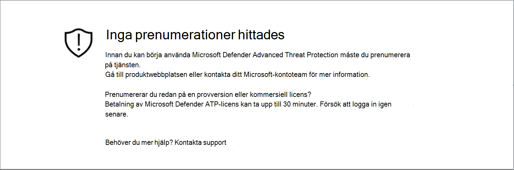
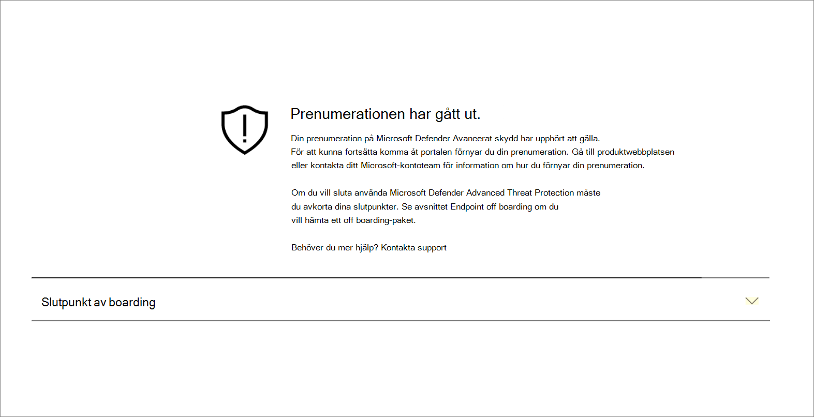
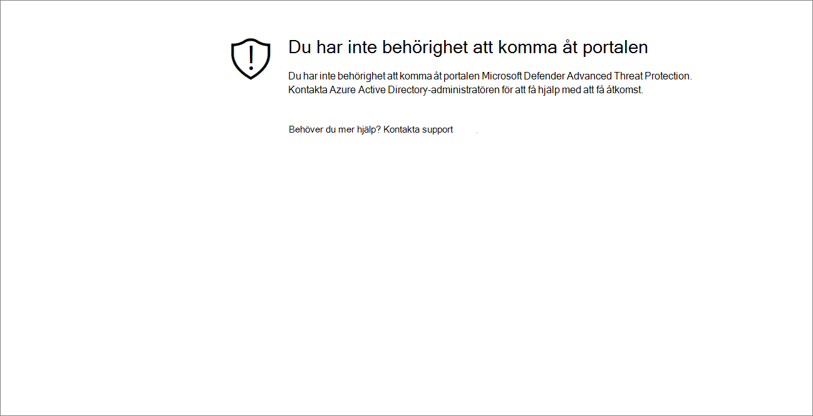
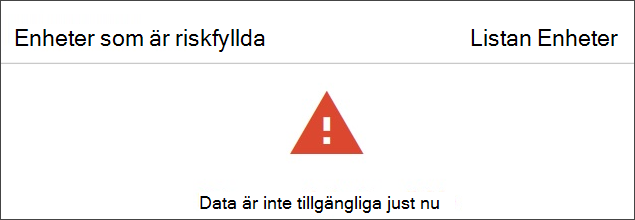

# Felsöka åtkomstproblem med prenumeration och portal

[!INCLUDE [Microsoft 365 Defender rebranding](../../includes/microsoft-defender.md)]

**Gäller för:**
- [Microsoft Defender för Endpoint](https://go.microsoft.com/fwlink/p/?linkid=2154037)
- [Microsoft 365 Defender](https://go.microsoft.com/fwlink/?linkid=2118804)

>Vill du uppleva Microsoft Defender för Slutpunkt? [Registrera dig för en kostnadsfri utvärderingsversion.](https://www.microsoft.com/microsoft-365/windows/microsoft-defender-atp?ocid=docs-wdatp-troublshootonboarding-abovefoldlink)

På den här sidan finns detaljerad information om hur du felsöker problem som kan uppstå när du skaffar Microsoft Defender för slutpunktstjänsten.

Om du får ett felmeddelande ger Microsoft Defender Säkerhetscenter en detaljerad förklaring av vad problemet är och relevanta länkar kommer att tillhandahållas.

## Inga prenumerationer hittades

Om du får meddelandet Inga prenumerationer  hittades när du använde Microsoft Defender Säkerhetscenter betyder det att den Azure Active Directory (Azure AD) som används för att logga in användaren på portalen inte har någon Microsoft Defender för slutpunkt-licens.

Möjliga orsaker:
- Licenserna för Windows E5 och Office E5 är separata licenser.
- Licensen har köpts men inte etablerats till den här Azure AD-instansen.
    - Det kan vara ett problem med licensetablering.
    - Det kan vara så att du oavsiktligt har etablerat licensen till en annan Microsoft Azure AD än den som används för autentisering i tjänsten.

I båda fallen bör du kontakta Microsofts support på [Allmän Microsoft Defender för Endpoint-support eller](https://support.microsoft.com/getsupport?wf=0&tenant=ClassicCommercial&oaspworkflow=start_1.0.0.0&locale=en-us&supportregion=en-us&pesid=16055&ccsid=636419533611396913) [volymlicenssupport.](https://www.microsoft.com/licensing/servicecenter/Help/Contact.aspx)

## Din prenumeration har gått ut

Om du får ett meddelande om att din prenumeration har upphört att **gälla** när du öppnar Microsoft Defender Säkerhetscenter har prenumerationen upphört att gälla. Microsoft Defender för Endpoint-prenumerationen har, precis som alla andra onlinetjänstprenumerationer, ett utgångsdatum. 

Du kan när som helst välja att förnya eller förlänga licensen. När du öppnar portalen efter  utgångsdatumet visas meddelandet Din prenumeration har upphört att gälla med ett alternativ för att ladda ned paketet för offboarding på enheten om du väljer att inte förnya licensen.

> [!NOTE]
> Av säkerhetsskäl upphör paketet som används till Offboard-enheter 30 dagar efter det datum då det laddades ned. Utgångna offboarding-paket som skickats till en enhet kommer att avvisas. När du laddar ned ett offboarding-paket meddelas du om paketens utgångsdatum och det inkluderas också i paketnamnet.

## Du har inte behörighet att komma åt portalen

Om du får ett meddelande om att du inte har behörighet att komma åt **portalen** bör du vara medveten om att Microsoft Defender för Endpoint är en säkerhetsövervakning, undersökning av incidenter och svar, och därför begränsas åtkomsten till den och kontrolleras av användaren.
Mer information finns i Tilldela [**användaråtkomst till portalen.**](https://docs.microsoft.com/windows/threat-protection/windows-defender-atp/assign-portal-access-windows-defender-advanced-threat-protection)

## Data är för närvarande inte tillgängliga på vissa avsnitt i portalen
Om instrumentpanelen på portalen och andra avsnitt visar ett felmeddelande, till exempel "Data är för närvarande inte tillgängligt":

Du måste tillåta alla `securitycenter.windows.com` underdomäner under den. Till exempel `*.securitycenter.windows.com`.

## Informationsproblem i portalen
Om du stöter på problem med åtkomst till portalen, saknade data eller begränsad åtkomst till delar av portalen måste du kontrollera att följande URL:er är tillåtna och öppna för kommunikation.

- `*.blob.core.windows.net`
- `crl.microsoft.com`
- `https://*.microsoftonline-p.com`
- `https://*.securitycenter.windows.com` 
- `https://automatediracs-eus-prd.securitycenter.windows.com`
- `https://login.microsoftonline.com`
- `https://login.windows.net`
- `https://onboardingpackagescusprd.blob.core.windows.net`
- `https://secure.aadcdn.microsoftonline-p.com` 
- `https://securitycenter.windows.com` 
- `https://static2.sharepointonline.com` 

