# <a name="troubleshoot-microsoft-defender-for-endpoint-onboarding-issues"></a><span data-ttu-id="f7a3b-104">Felsöka problem med Introduktion till Slutpunkt för Microsoft Defender</span><span class="sxs-lookup"><span data-stu-id="f7a3b-104">Troubleshoot Microsoft Defender for Endpoint onboarding issues</span></span>

[!INCLUDE [Microsoft 365 Defender rebranding](../../includes/microsoft-defender.md)]


<span data-ttu-id="f7a3b-105">**Gäller för:**</span><span class="sxs-lookup"><span data-stu-id="f7a3b-105">**Applies to:**</span></span>

- [<span data-ttu-id="f7a3b-106">Microsoft Defender för Endpoint</span><span class="sxs-lookup"><span data-stu-id="f7a3b-106">Microsoft Defender for Endpoint</span></span>](https://go.microsoft.com/fwlink/?linkid=2154037)
- <span data-ttu-id="f7a3b-107">Windows Server 2012 R2</span><span class="sxs-lookup"><span data-stu-id="f7a3b-107">Windows Server 2012 R2</span></span>
- <span data-ttu-id="f7a3b-108">Windows Server 2016</span><span class="sxs-lookup"><span data-stu-id="f7a3b-108">Windows Server 2016</span></span>
- [<span data-ttu-id="f7a3b-109">Microsoft 365 Defender</span><span class="sxs-lookup"><span data-stu-id="f7a3b-109">Microsoft 365 Defender</span></span>](https://go.microsoft.com/fwlink/?linkid=2118804)

> <span data-ttu-id="f7a3b-110">Vill du använda Defender för Slutpunkt?</span><span class="sxs-lookup"><span data-stu-id="f7a3b-110">Want to experience Defender for Endpoint?</span></span> [<span data-ttu-id="f7a3b-111">Registrera dig för en kostnadsfri utvärderingsversion.</span><span class="sxs-lookup"><span data-stu-id="f7a3b-111">Sign up for a free trial.</span></span>](https://www.microsoft.com/microsoft-365/windows/microsoft-defender-atp?ocid=docs-wdatp-pullalerts-abovefoldlink) 

<span data-ttu-id="f7a3b-112">Du kan behöva felsöka introduktionsprocessen för Microsoft Defender för slutpunkt om du stöter på problem.</span><span class="sxs-lookup"><span data-stu-id="f7a3b-112">You might need to troubleshoot the Microsoft Defender for Endpoint onboarding process if you encounter issues.</span></span>
<span data-ttu-id="f7a3b-113">På den här sidan finns detaljerad information om hur du felsöker onboarding-problem som kan uppstå vid distribution med ett av distributionsverktygen och vanliga fel som kan uppstå på enheterna.</span><span class="sxs-lookup"><span data-stu-id="f7a3b-113">This page provides detailed steps to troubleshoot onboarding issues that might occur when deploying with one of the deployment tools and common errors that might occur on the devices.</span></span>

## <a name="troubleshoot-issues-with-onboarding-tools"></a><span data-ttu-id="f7a3b-114">Felsöka problem med onboarding-verktyg</span><span class="sxs-lookup"><span data-stu-id="f7a3b-114">Troubleshoot issues with onboarding tools</span></span>

<span data-ttu-id="f7a3b-115">Om du har slutfört onboarding-processen och inte [](investigate-machines.md) ser enheterna i listan Enheter efter en timme kan det indikera problem med onboarding eller anslutning.</span><span class="sxs-lookup"><span data-stu-id="f7a3b-115">If you have completed the onboarding process and don't see devices in the [Devices list](investigate-machines.md) after an hour, it might indicate an onboarding or connectivity problem.</span></span>

### <a name="troubleshoot-onboarding-when-deploying-with-group-policy"></a><span data-ttu-id="f7a3b-116">Felsöka registrering vid distribution med grupprincip</span><span class="sxs-lookup"><span data-stu-id="f7a3b-116">Troubleshoot onboarding when deploying with Group Policy</span></span>

<span data-ttu-id="f7a3b-117">Distribution med grupprincip utförs genom att köra onboarding-skriptet på enheterna.</span><span class="sxs-lookup"><span data-stu-id="f7a3b-117">Deployment with Group Policy is done by running the onboarding script on the devices.</span></span> <span data-ttu-id="f7a3b-118">Grupprincipkonsolen anger inte om distributionen har lyckats eller inte.</span><span class="sxs-lookup"><span data-stu-id="f7a3b-118">The Group Policy console does not indicate if the deployment has succeeded or not.</span></span>

<span data-ttu-id="f7a3b-119">Om du har slutfört onboarding-processen och inte [](investigate-machines.md) ser enheterna i listan Enheter efter en timme kan du kontrollera utdata för skriptet på enheterna.</span><span class="sxs-lookup"><span data-stu-id="f7a3b-119">If you have completed the onboarding process and don't see devices in the [Devices list](investigate-machines.md) after an hour, you can check the output of the script on the devices.</span></span> <span data-ttu-id="f7a3b-120">Mer information finns i [Felsöka registrering när du distribuerar med ett skript.](#troubleshoot-onboarding-when-deploying-with-a-script)</span><span class="sxs-lookup"><span data-stu-id="f7a3b-120">For more information, see [Troubleshoot onboarding when deploying with a script](#troubleshoot-onboarding-when-deploying-with-a-script).</span></span>

<span data-ttu-id="f7a3b-121">Om skriptet slutförs korrekt går du [till Felsöka onboarding-problem på enheterna](#troubleshoot-onboarding-issues-on-the-device) för ytterligare fel som kan uppstå.</span><span class="sxs-lookup"><span data-stu-id="f7a3b-121">If the script completes successfully, see [Troubleshoot onboarding issues on the devices](#troubleshoot-onboarding-issues-on-the-device) for additional errors that might occur.</span></span>

### <a name="troubleshoot-onboarding-issues-when-deploying-with-microsoft-endpoint-configuration-manager"></a><span data-ttu-id="f7a3b-122">Felsöka onboarding-problem vid distribution med Microsoft Endpoint Configuration Manager</span><span class="sxs-lookup"><span data-stu-id="f7a3b-122">Troubleshoot onboarding issues when deploying with Microsoft Endpoint Configuration Manager</span></span>

<span data-ttu-id="f7a3b-123">När du onboarding-enheter med hjälp av följande versioner av Konfigurationshanteraren:</span><span class="sxs-lookup"><span data-stu-id="f7a3b-123">When onboarding devices using the following versions of Configuration Manager:</span></span>

- <span data-ttu-id="f7a3b-124">Microsoft Endpoint Configuration Manager</span><span class="sxs-lookup"><span data-stu-id="f7a3b-124">Microsoft Endpoint Configuration Manager</span></span>
- <span data-ttu-id="f7a3b-125">System Center 2012 Configuration Manager</span><span class="sxs-lookup"><span data-stu-id="f7a3b-125">System Center 2012 Configuration Manager</span></span>
- <span data-ttu-id="f7a3b-126">System Center 2012 R2 Configuration Manager</span><span class="sxs-lookup"><span data-stu-id="f7a3b-126">System Center 2012 R2 Configuration Manager</span></span>

<span data-ttu-id="f7a3b-127">Distribution med de ovan nämnda versionerna av Konfigurationshanteraren utförs genom att köra onboarding-skriptet på enheterna.</span><span class="sxs-lookup"><span data-stu-id="f7a3b-127">Deployment with the above-mentioned versions of Configuration Manager is done by running the onboarding script on the devices.</span></span> <span data-ttu-id="f7a3b-128">Du kan spåra distributionen i Konfigurationshanterarens konsol.</span><span class="sxs-lookup"><span data-stu-id="f7a3b-128">You can track the deployment in the Configuration Manager Console.</span></span>

<span data-ttu-id="f7a3b-129">Om distributionen misslyckas kan du kontrollera utdata för skriptet på enheterna.</span><span class="sxs-lookup"><span data-stu-id="f7a3b-129">If the deployment fails, you can check the output of the script on the devices.</span></span>

<span data-ttu-id="f7a3b-130">Om onboarding avslutades men enheterna inte visas  i listan Enheter efter en timme kan du gå till Felsöka [onboarding-problem](#troubleshoot-onboarding-issues-on-the-device) på enheten för ytterligare fel som kan uppstå.</span><span class="sxs-lookup"><span data-stu-id="f7a3b-130">If the onboarding completed successfully but the devices are not showing up in the **Devices list** after an hour, see [Troubleshoot onboarding issues on the device](#troubleshoot-onboarding-issues-on-the-device) for additional errors that might occur.</span></span>

### <a name="troubleshoot-onboarding-when-deploying-with-a-script"></a><span data-ttu-id="f7a3b-131">Felsöka onboarding när du distribuerar med ett skript</span><span class="sxs-lookup"><span data-stu-id="f7a3b-131">Troubleshoot onboarding when deploying with a script</span></span>

<span data-ttu-id="f7a3b-132">**Kontrollera resultatet av skriptet på enheten:**</span><span class="sxs-lookup"><span data-stu-id="f7a3b-132">**Check the result of the script on the device:**</span></span>

1. <span data-ttu-id="f7a3b-133">Klicka **på Start**, skriv **Loggboken** och tryck på **Retur.**</span><span class="sxs-lookup"><span data-stu-id="f7a3b-133">Click **Start**, type **Event Viewer**, and press **Enter**.</span></span>

2. <span data-ttu-id="f7a3b-134">Gå till **Windows loggar**  >  **program**.</span><span class="sxs-lookup"><span data-stu-id="f7a3b-134">Go to **Windows Logs** > **Application**.</span></span>

3. <span data-ttu-id="f7a3b-135">Leta efter en händelse från **WDATPOnboarding-händelsekällan.**</span><span class="sxs-lookup"><span data-stu-id="f7a3b-135">Look for an event from **WDATPOnboarding** event source.</span></span>

<span data-ttu-id="f7a3b-136">Om skriptet misslyckas och händelsen är ett fel kan du kontrollera händelse-ID:t i följande tabell för att felsöka problemet.</span><span class="sxs-lookup"><span data-stu-id="f7a3b-136">If the script fails and the event is an error, you can check the event ID in the following table to help you troubleshoot the issue.</span></span>

> [!NOTE]
> <span data-ttu-id="f7a3b-137">Följande händelse-ID är endast specifika för onboarding-skriptet.</span><span class="sxs-lookup"><span data-stu-id="f7a3b-137">The following event IDs are specific to the onboarding script only.</span></span>

<span data-ttu-id="f7a3b-138">Händelse-ID</span><span class="sxs-lookup"><span data-stu-id="f7a3b-138">Event ID</span></span> | <span data-ttu-id="f7a3b-139">Feltyp</span><span class="sxs-lookup"><span data-stu-id="f7a3b-139">Error Type</span></span> | <span data-ttu-id="f7a3b-140">Lösningssteg</span><span class="sxs-lookup"><span data-stu-id="f7a3b-140">Resolution steps</span></span>
:---:|:---|:---
 `5` | <span data-ttu-id="f7a3b-141">Offboarding-data hittades men kunde inte tas bort</span><span class="sxs-lookup"><span data-stu-id="f7a3b-141">Offboarding data was found but couldn't be deleted</span></span> | <span data-ttu-id="f7a3b-142">Kontrollera behörigheterna i registret, särskilt</span><span class="sxs-lookup"><span data-stu-id="f7a3b-142">Check the permissions on the registry, specifically</span></span><br> <span data-ttu-id="f7a3b-143">`HKLM\SOFTWARE\Policies\Microsoft\Windows Advanced Threat Protection`.</span><span class="sxs-lookup"><span data-stu-id="f7a3b-143">`HKLM\SOFTWARE\Policies\Microsoft\Windows Advanced Threat Protection`.</span></span>
`10` | <span data-ttu-id="f7a3b-144">Registreringsdata kunde inte skrivas till registret</span><span class="sxs-lookup"><span data-stu-id="f7a3b-144">Onboarding data couldn't be written to registry</span></span> |  <span data-ttu-id="f7a3b-145">Kontrollera behörigheterna i registret, särskilt</span><span class="sxs-lookup"><span data-stu-id="f7a3b-145">Check the permissions on the registry, specifically</span></span><br> <span data-ttu-id="f7a3b-146">`HKLM\SOFTWARE\Policies\Microsoft\Windows Advanced Threat Protection`.</span><span class="sxs-lookup"><span data-stu-id="f7a3b-146">`HKLM\SOFTWARE\Policies\Microsoft\Windows Advanced Threat Protection`.</span></span><br><span data-ttu-id="f7a3b-147">Kontrollera att skriptet har körts som administratör.</span><span class="sxs-lookup"><span data-stu-id="f7a3b-147">Verify that the script has been run as an administrator.</span></span>
`15` |  <span data-ttu-id="f7a3b-148">Det gick inte att starta SENSE-tjänsten</span><span class="sxs-lookup"><span data-stu-id="f7a3b-148">Failed to start SENSE service</span></span> |<span data-ttu-id="f7a3b-149">Kontrollera tjänstens hälsa `sc query sense` (kommando).</span><span class="sxs-lookup"><span data-stu-id="f7a3b-149">Check the service health (`sc query sense` command).</span></span> <span data-ttu-id="f7a3b-150">Kontrollera att den inte är i ett mellanliggande tillstånd (*"Pending_Stopped",* *"Pending_Running"*) och försök att köra skriptet igen (med administratörsrättigheter).</span><span class="sxs-lookup"><span data-stu-id="f7a3b-150">Make sure it's not in an intermediate state (*'Pending_Stopped'*, *'Pending_Running'*) and try to run the script again (with administrator rights).</span></span> <br> <br> <span data-ttu-id="f7a3b-151">Om enheten körs med Windows 10, version 1607 och kommandot körs, startar `sc query sense` `START_PENDING` du om enheten.</span><span class="sxs-lookup"><span data-stu-id="f7a3b-151">If the device is running Windows 10, version 1607 and running the command `sc query sense` returns `START_PENDING`, reboot the device.</span></span> <span data-ttu-id="f7a3b-152">Om problemet inte åtgärdas när du startar om enheten måste du uppgradera till KB4015217 och prova att komma igång igen.</span><span class="sxs-lookup"><span data-stu-id="f7a3b-152">If rebooting the device doesn't address the issue, upgrade to KB4015217 and try onboarding again.</span></span>
`15` | <span data-ttu-id="f7a3b-153">Det gick inte att starta SENSE-tjänsten</span><span class="sxs-lookup"><span data-stu-id="f7a3b-153">Failed to start SENSE service</span></span> | <span data-ttu-id="f7a3b-154">Om felmeddelandet visas: Systemfel 577 eller fel 1058 har uppstått måste du aktivera ELAM-drivrutinen för Microsoft Defender Antivirus. Anvisningar finns i Kontrollera att Microsoft Defender Antivirus inte är inaktiverat av en [princip.](#ensure-that-microsoft-defender-antivirus-is-not-disabled-by-a-policy)</span><span class="sxs-lookup"><span data-stu-id="f7a3b-154">If the message of the error is: System error 577  or error 1058 has occurred, you need to enable the Microsoft Defender Antivirus ELAM driver, see [Ensure that Microsoft Defender Antivirus is not disabled by a policy](#ensure-that-microsoft-defender-antivirus-is-not-disabled-by-a-policy) for instructions.</span></span>
`30` |  <span data-ttu-id="f7a3b-155">Skriptet kunde inte vänta på att tjänsten ska börja köras</span><span class="sxs-lookup"><span data-stu-id="f7a3b-155">The script failed to wait for the service to start running</span></span> | <span data-ttu-id="f7a3b-156">Det kan ta längre tid att starta tjänsten eller så har det uppstått fel när den försöker starta.</span><span class="sxs-lookup"><span data-stu-id="f7a3b-156">The service could have taken more time to start or has encountered errors while trying to start.</span></span> <span data-ttu-id="f7a3b-157">Mer information om händelser och fel relaterade till SENSE finns i [Granska händelser och fel med hjälp av Loggboken.](event-error-codes.md)</span><span class="sxs-lookup"><span data-stu-id="f7a3b-157">For more information on events and errors related to SENSE, see [Review events and errors using Event viewer](event-error-codes.md).</span></span>
`35` |  <span data-ttu-id="f7a3b-158">Skriptet kunde inte hitta registerstatusvärdet för onboarding-status</span><span class="sxs-lookup"><span data-stu-id="f7a3b-158">The script failed to find needed onboarding status registry value</span></span> | <span data-ttu-id="f7a3b-159">När SENSE-tjänsten startas för första gången skriver den onboarding-status till registerplatsen</span><span class="sxs-lookup"><span data-stu-id="f7a3b-159">When the SENSE service starts for the first time, it writes onboarding status to the registry location</span></span><br><span data-ttu-id="f7a3b-160">`HKLM\SOFTWARE\Microsoft\Windows Advanced Threat Protection\Status`.</span><span class="sxs-lookup"><span data-stu-id="f7a3b-160">`HKLM\SOFTWARE\Microsoft\Windows Advanced Threat Protection\Status`.</span></span><br> <span data-ttu-id="f7a3b-161">Skriptet kunde inte hitta det efter flera sekunder.</span><span class="sxs-lookup"><span data-stu-id="f7a3b-161">The script failed to find it after several seconds.</span></span> <span data-ttu-id="f7a3b-162">Du kan manuellt testa den och kontrollera om den finns där.</span><span class="sxs-lookup"><span data-stu-id="f7a3b-162">You can manually test it and check if it's there.</span></span> <span data-ttu-id="f7a3b-163">Mer information om händelser och fel relaterade till SENSE finns i [Granska händelser och fel med hjälp av Loggboken.](event-error-codes.md)</span><span class="sxs-lookup"><span data-stu-id="f7a3b-163">For more information on events and errors related to SENSE, see [Review events and errors using Event viewer](event-error-codes.md).</span></span>
`40` | <span data-ttu-id="f7a3b-164">SENSE-status för tjänst onboarding är inte inställd på **1**</span><span class="sxs-lookup"><span data-stu-id="f7a3b-164">SENSE service onboarding status is not set to **1**</span></span> | <span data-ttu-id="f7a3b-165">SENSE-tjänsten har inte kunnat introduceras korrekt.</span><span class="sxs-lookup"><span data-stu-id="f7a3b-165">The SENSE service has failed to onboard properly.</span></span> <span data-ttu-id="f7a3b-166">Mer information om händelser och fel relaterade till SENSE finns i [Granska händelser och fel med hjälp av Loggboken.](event-error-codes.md)</span><span class="sxs-lookup"><span data-stu-id="f7a3b-166">For more information on events and errors related to SENSE, see [Review events and errors using Event viewer](event-error-codes.md).</span></span>
`65` | <span data-ttu-id="f7a3b-167">Otillräckliga behörigheter</span><span class="sxs-lookup"><span data-stu-id="f7a3b-167">Insufficient privileges</span></span>| <span data-ttu-id="f7a3b-168">Kör skriptet igen med administratörsbehörighet.</span><span class="sxs-lookup"><span data-stu-id="f7a3b-168">Run the script again with administrator privileges.</span></span>

### <a name="troubleshoot-onboarding-issues-using-microsoft-intune"></a><span data-ttu-id="f7a3b-169">Felsöka onboarding-problem med Microsoft Intune</span><span class="sxs-lookup"><span data-stu-id="f7a3b-169">Troubleshoot onboarding issues using Microsoft Intune</span></span>

<span data-ttu-id="f7a3b-170">Du kan Microsoft Intune att kontrollera felkoder och försöka felsöka orsaken till problemet.</span><span class="sxs-lookup"><span data-stu-id="f7a3b-170">You can use Microsoft Intune to check error codes and attempt to troubleshoot the cause of the issue.</span></span>

<span data-ttu-id="f7a3b-171">Om du har konfigurerat principer i Intune och de inte sprids på enheter kan du behöva konfigurera automatisk MDM-registrering.</span><span class="sxs-lookup"><span data-stu-id="f7a3b-171">If you have configured policies in Intune and they are not propagated on devices, you might need to configure automatic MDM enrollment.</span></span>

<span data-ttu-id="f7a3b-172">Använd följande tabeller för att förstå möjliga orsaker till problem vid registrering:</span><span class="sxs-lookup"><span data-stu-id="f7a3b-172">Use the following tables to understand the possible causes of issues while onboarding:</span></span>

- <span data-ttu-id="f7a3b-173">Microsoft Intune felkoder och OMA-URIs tabell</span><span class="sxs-lookup"><span data-stu-id="f7a3b-173">Microsoft Intune error codes and OMA-URIs table</span></span>
- <span data-ttu-id="f7a3b-174">Kända problem med icke-efterlevnadstabell</span><span class="sxs-lookup"><span data-stu-id="f7a3b-174">Known issues with non-compliance table</span></span>
- <span data-ttu-id="f7a3b-175">Tabellen Händelseloggar för mobil enhetshantering (MDM)</span><span class="sxs-lookup"><span data-stu-id="f7a3b-175">Mobile Device Management (MDM) event logs table</span></span>

<span data-ttu-id="f7a3b-176">Om ingen av händelseloggarna och felsökningsstegen  fungerar laddar du ned det lokala skriptet från avsnittet Enhetshantering i portalen och kör det i en upphöjd kommandotolk.</span><span class="sxs-lookup"><span data-stu-id="f7a3b-176">If none of the event logs and troubleshooting steps work, download the Local script from the **Device management** section of the portal, and run it in an elevated command prompt.</span></span>

#### <a name="microsoft-intune-error-codes-and-oma-uris"></a><span data-ttu-id="f7a3b-177">Microsoft Intune felkoder och OMA-URIs</span><span class="sxs-lookup"><span data-stu-id="f7a3b-177">Microsoft Intune error codes and OMA-URIs</span></span>

<span data-ttu-id="f7a3b-178">Felkod Hex</span><span class="sxs-lookup"><span data-stu-id="f7a3b-178">Error Code Hex</span></span> | <span data-ttu-id="f7a3b-179">Felkod dec</span><span class="sxs-lookup"><span data-stu-id="f7a3b-179">Error Code Dec</span></span> | <span data-ttu-id="f7a3b-180">Felbeskrivning</span><span class="sxs-lookup"><span data-stu-id="f7a3b-180">Error Description</span></span> | <span data-ttu-id="f7a3b-181">OMA-URI</span><span class="sxs-lookup"><span data-stu-id="f7a3b-181">OMA-URI</span></span> | <span data-ttu-id="f7a3b-182">Möjliga orsaker och felsökningssteg</span><span class="sxs-lookup"><span data-stu-id="f7a3b-182">Possible cause and troubleshooting steps</span></span>
:---:|:---|:---|:---|:---
<span data-ttu-id="f7a3b-183">0x87D1FDE8</span><span class="sxs-lookup"><span data-stu-id="f7a3b-183">0x87D1FDE8</span></span> | <span data-ttu-id="f7a3b-184">-2016281112</span><span class="sxs-lookup"><span data-stu-id="f7a3b-184">-2016281112</span></span> | <span data-ttu-id="f7a3b-185">Åtgärd misslyckades</span><span class="sxs-lookup"><span data-stu-id="f7a3b-185">Remediation failed</span></span> | <span data-ttu-id="f7a3b-186">Introduktioner</span><span class="sxs-lookup"><span data-stu-id="f7a3b-186">Onboarding</span></span> <br> <span data-ttu-id="f7a3b-187">Offboarding</span><span class="sxs-lookup"><span data-stu-id="f7a3b-187">Offboarding</span></span> | <span data-ttu-id="f7a3b-188">**Möjlig orsak:** Onboarding eller offboarding misslyckades i fel blob: fel signatur eller saknar PreviousOrgIds-fält.</span><span class="sxs-lookup"><span data-stu-id="f7a3b-188">**Possible cause:** Onboarding or offboarding failed on a wrong blob: wrong signature or missing PreviousOrgIds fields.</span></span> <br><br> <span data-ttu-id="f7a3b-189">**Felsökningssteg:**</span><span class="sxs-lookup"><span data-stu-id="f7a3b-189">**Troubleshooting steps:**</span></span> <br> <span data-ttu-id="f7a3b-190">Kontrollera händelse-IDt i avsnittet Visa registrering av agent [i händelseloggen för](#view-agent-onboarding-errors-in-the-device-event-log) enheten.</span><span class="sxs-lookup"><span data-stu-id="f7a3b-190">Check the event IDs in the [View agent onboarding errors in the device event log](#view-agent-onboarding-errors-in-the-device-event-log) section.</span></span> <br><br> <span data-ttu-id="f7a3b-191">Kontrollera MDM-händelseloggarna i följande tabell eller följ instruktionerna i [Diagnostisera MDM-fel i Windows 10](/windows/client-management/mdm/diagnose-mdm-failures-in-windows-10).</span><span class="sxs-lookup"><span data-stu-id="f7a3b-191">Check the MDM event logs in the following table or follow the instructions in [Diagnose MDM failures in Windows 10](/windows/client-management/mdm/diagnose-mdm-failures-in-windows-10).</span></span>
 | | | | <span data-ttu-id="f7a3b-192">Introduktioner</span><span class="sxs-lookup"><span data-stu-id="f7a3b-192">Onboarding</span></span> <br> <span data-ttu-id="f7a3b-193">Offboarding</span><span class="sxs-lookup"><span data-stu-id="f7a3b-193">Offboarding</span></span> <br> <span data-ttu-id="f7a3b-194">Exempelformning</span><span class="sxs-lookup"><span data-stu-id="f7a3b-194">SampleSharing</span></span> | <span data-ttu-id="f7a3b-195">**Möjlig orsak:** Registernyckeln Microsoft Defender för slutpunktsprincipen finns inte eller så har OMA DM-klienten inte behörighet att skriva till den.</span><span class="sxs-lookup"><span data-stu-id="f7a3b-195">**Possible cause:** Microsoft Defender for Endpoint Policy registry key does not exist or the OMA DM client doesn't have permissions to write to it.</span></span> <br><br> <span data-ttu-id="f7a3b-196">**Felsökningssteg:** Kontrollera att följande registernyckel finns: `HKEY_LOCAL_MACHINE\SOFTWARE\Policies\Microsoft\Windows Advanced Threat Protection`</span><span class="sxs-lookup"><span data-stu-id="f7a3b-196">**Troubleshooting steps:** Ensure that the following registry key exists: `HKEY_LOCAL_MACHINE\SOFTWARE\Policies\Microsoft\Windows Advanced Threat Protection`</span></span> <br> <br> <span data-ttu-id="f7a3b-197">Om det inte finns öppnar du ett upphöjd kommando och lägger till nyckeln.</span><span class="sxs-lookup"><span data-stu-id="f7a3b-197">If it doesn't exist, open an elevated command and add the key.</span></span>
 | | | | <span data-ttu-id="f7a3b-198">SenseIsRunning</span><span class="sxs-lookup"><span data-stu-id="f7a3b-198">SenseIsRunning</span></span> <br> <span data-ttu-id="f7a3b-199">OnboardingState</span><span class="sxs-lookup"><span data-stu-id="f7a3b-199">OnboardingState</span></span> <br> <span data-ttu-id="f7a3b-200">OrgId</span><span class="sxs-lookup"><span data-stu-id="f7a3b-200">OrgId</span></span> |  <span data-ttu-id="f7a3b-201">**Möjlig orsak:** Ett försök att åtgärda med egenskapen skrivskydd.</span><span class="sxs-lookup"><span data-stu-id="f7a3b-201">**Possible cause:** An attempt to remediate by read-only property.</span></span> <span data-ttu-id="f7a3b-202">Onboarding har misslyckats.</span><span class="sxs-lookup"><span data-stu-id="f7a3b-202">Onboarding has failed.</span></span> <br><br> <span data-ttu-id="f7a3b-203">**Felsökningssteg:** Kontrollera felsökningsstegen [i Felsöka onboarding-problem på enheten.](#troubleshoot-onboarding-issues-on-the-device)</span><span class="sxs-lookup"><span data-stu-id="f7a3b-203">**Troubleshooting steps:** Check the troubleshooting steps in [Troubleshoot onboarding issues on the device](#troubleshoot-onboarding-issues-on-the-device).</span></span> <br><br> <span data-ttu-id="f7a3b-204">Kontrollera MDM-händelseloggarna i följande tabell eller följ instruktionerna i [Diagnostisera MDM-fel i Windows 10](/windows/client-management/mdm/diagnose-mdm-failures-in-windows-10).</span><span class="sxs-lookup"><span data-stu-id="f7a3b-204">Check the MDM event logs in the following table or follow the instructions in [Diagnose MDM failures in Windows 10](/windows/client-management/mdm/diagnose-mdm-failures-in-windows-10).</span></span>
 | | | | <span data-ttu-id="f7a3b-205">Alla</span><span class="sxs-lookup"><span data-stu-id="f7a3b-205">All</span></span> | <span data-ttu-id="f7a3b-206">**Möjlig orsak:** Försök att distribuera Microsoft Defender för Endpoint på SKU/Platform som inte stöds, särskilt Holographic SKU.</span><span class="sxs-lookup"><span data-stu-id="f7a3b-206">**Possible cause:** Attempt to deploy Microsoft Defender for Endpoint on non-supported SKU/Platform, particularly Holographic SKU.</span></span> <br><br> <span data-ttu-id="f7a3b-207">Plattformar som stöds för närvarande:</span><span class="sxs-lookup"><span data-stu-id="f7a3b-207">Currently supported platforms:</span></span><br> <span data-ttu-id="f7a3b-208">Företag, utbildning och professional.</span><span class="sxs-lookup"><span data-stu-id="f7a3b-208">Enterprise, Education, and Professional.</span></span><br> <span data-ttu-id="f7a3b-209">Servern stöds inte.</span><span class="sxs-lookup"><span data-stu-id="f7a3b-209">Server is not supported.</span></span>
 <span data-ttu-id="f7a3b-210">0x87D101A9</span><span class="sxs-lookup"><span data-stu-id="f7a3b-210">0x87D101A9</span></span> | <span data-ttu-id="f7a3b-211">-2016345687</span><span class="sxs-lookup"><span data-stu-id="f7a3b-211">-2016345687</span></span> |<span data-ttu-id="f7a3b-212">SynkroniseraML(425): Det begärda kommandot misslyckades eftersom avsändaren inte har tillräcklig åtkomstkontrollbehörighet (ACL) för mottagaren.</span><span class="sxs-lookup"><span data-stu-id="f7a3b-212">SyncML(425): The requested command failed because the sender does not have adequate access control permissions (ACL) on the recipient.</span></span> | <span data-ttu-id="f7a3b-213">Alla</span><span class="sxs-lookup"><span data-stu-id="f7a3b-213">All</span></span> |  <span data-ttu-id="f7a3b-214">**Möjlig orsak:** Försök att distribuera Microsoft Defender för Endpoint på SKU/Platform som inte stöds, särskilt Holographic SKU.</span><span class="sxs-lookup"><span data-stu-id="f7a3b-214">**Possible cause:** Attempt to deploy Microsoft Defender for Endpoint on non-supported SKU/Platform, particularly Holographic SKU.</span></span><br><br> <span data-ttu-id="f7a3b-215">Plattformar som stöds för närvarande:</span><span class="sxs-lookup"><span data-stu-id="f7a3b-215">Currently supported platforms:</span></span><br>  <span data-ttu-id="f7a3b-216">Företag, utbildning och professional.</span><span class="sxs-lookup"><span data-stu-id="f7a3b-216">Enterprise, Education, and Professional.</span></span>

#### <a name="known-issues-with-non-compliance"></a><span data-ttu-id="f7a3b-217">Kända problem med icke-efterlevnad</span><span class="sxs-lookup"><span data-stu-id="f7a3b-217">Known issues with non-compliance</span></span>

<span data-ttu-id="f7a3b-218">Följande tabell innehåller information om problem med icke-efterlevnad och hur du kan åtgärda problemen.</span><span class="sxs-lookup"><span data-stu-id="f7a3b-218">The following table provides information on issues with non-compliance and how you can address the issues.</span></span>

<span data-ttu-id="f7a3b-219">Ärende</span><span class="sxs-lookup"><span data-stu-id="f7a3b-219">Case</span></span> | <span data-ttu-id="f7a3b-220">Symptom</span><span class="sxs-lookup"><span data-stu-id="f7a3b-220">Symptoms</span></span> | <span data-ttu-id="f7a3b-221">Möjliga orsaker och felsökningssteg</span><span class="sxs-lookup"><span data-stu-id="f7a3b-221">Possible cause and troubleshooting steps</span></span>
:---:|:---|:---
 `1` | <span data-ttu-id="f7a3b-222">Enheten följer SenseIsRunning OMA-URI.</span><span class="sxs-lookup"><span data-stu-id="f7a3b-222">Device is compliant by SenseIsRunning OMA-URI.</span></span> <span data-ttu-id="f7a3b-223">Men är inte kompatibelt av OrgId, Onboarding och OnboardingState OMA-URI:er.</span><span class="sxs-lookup"><span data-stu-id="f7a3b-223">But is non-compliant by OrgId, Onboarding and OnboardingState OMA-URIs.</span></span> | <span data-ttu-id="f7a3b-224">**Möjlig orsak:** Kontrollera att användaren har passerat OOBE efter Windows installationen eller uppgraderingen.</span><span class="sxs-lookup"><span data-stu-id="f7a3b-224">**Possible cause:** Check that user passed OOBE after Windows installation or upgrade.</span></span> <span data-ttu-id="f7a3b-225">Under OOBE-onboarding kunde inte slutföras men SENSE körs redan.</span><span class="sxs-lookup"><span data-stu-id="f7a3b-225">During OOBE onboarding couldn't be completed but SENSE is running already.</span></span><br><br> <span data-ttu-id="f7a3b-226">**Felsökningssteg:** Vänta tills OOBE har slutförts.</span><span class="sxs-lookup"><span data-stu-id="f7a3b-226">**Troubleshooting steps:** Wait for OOBE to complete.</span></span>
 `2` |  <span data-ttu-id="f7a3b-227">Enheten följer OrgId, Onboarding och OnboardingState OMA-URI:er, men följer inte av SenseIsRunning OMA-URI.</span><span class="sxs-lookup"><span data-stu-id="f7a3b-227">Device is compliant by OrgId, Onboarding, and OnboardingState OMA-URIs, but is non-compliant by SenseIsRunning OMA-URI.</span></span> |  <span data-ttu-id="f7a3b-228">**Möjlig orsak:** Sense-tjänstens starttyp anges som "Fördröjd start".</span><span class="sxs-lookup"><span data-stu-id="f7a3b-228">**Possible cause:** Sense service's startup type is set as "Delayed Start".</span></span> <span data-ttu-id="f7a3b-229">Ibland gör det här Microsoft Intune server att rapportera enheten som icke-kompatibel av SenseIsRunning när DM-sessionen startar på systemstarten.</span><span class="sxs-lookup"><span data-stu-id="f7a3b-229">Sometimes this causes the Microsoft Intune server to report the device as non-compliant by SenseIsRunning when DM session occurs on system start.</span></span> <br><br> <span data-ttu-id="f7a3b-230">**Felsökningssteg:** Problemet bör åtgärdas automatiskt inom 24 timmar.</span><span class="sxs-lookup"><span data-stu-id="f7a3b-230">**Troubleshooting steps:** The issue should automatically be fixed within 24 hours.</span></span>
 `3` | <span data-ttu-id="f7a3b-231">Enheten följer inte</span><span class="sxs-lookup"><span data-stu-id="f7a3b-231">Device is non-compliant</span></span> | <span data-ttu-id="f7a3b-232">**Felsökningssteg:** Se till att principer för onboarding och offboarding inte är distribuerade på samma enhet samtidigt.</span><span class="sxs-lookup"><span data-stu-id="f7a3b-232">**Troubleshooting steps:** Ensure that Onboarding and Offboarding policies are not deployed on the same device at same time.</span></span>

#### <a name="mobile-device-management-mdm-event-logs"></a><span data-ttu-id="f7a3b-233">Händelseloggar för hantering av mobil enhet (MDM)</span><span class="sxs-lookup"><span data-stu-id="f7a3b-233">Mobile Device Management (MDM) event logs</span></span>

<span data-ttu-id="f7a3b-234">Visa MDM-händelseloggar för att felsöka problem som kan uppstå under registrering:</span><span class="sxs-lookup"><span data-stu-id="f7a3b-234">View the MDM event logs to troubleshoot issues that might arise during onboarding:</span></span>

<span data-ttu-id="f7a3b-235">Loggnamn: Microsoft\Windows\DeviceManagement-EnterpriseDiagnostics-Provider</span><span class="sxs-lookup"><span data-stu-id="f7a3b-235">Log name: Microsoft\Windows\DeviceManagement-EnterpriseDiagnostics-Provider</span></span>

<span data-ttu-id="f7a3b-236">Kanalnamn: Admin</span><span class="sxs-lookup"><span data-stu-id="f7a3b-236">Channel name: Admin</span></span>

<span data-ttu-id="f7a3b-237">ID</span><span class="sxs-lookup"><span data-stu-id="f7a3b-237">ID</span></span> | <span data-ttu-id="f7a3b-238">Allvarlighetsgrad</span><span class="sxs-lookup"><span data-stu-id="f7a3b-238">Severity</span></span> | <span data-ttu-id="f7a3b-239">Händelsebeskrivning</span><span class="sxs-lookup"><span data-stu-id="f7a3b-239">Event description</span></span> | <span data-ttu-id="f7a3b-240">Felsökningssteg</span><span class="sxs-lookup"><span data-stu-id="f7a3b-240">Troubleshooting steps</span></span>
:---|:---|:---|:---
<span data-ttu-id="f7a3b-241">1819</span><span class="sxs-lookup"><span data-stu-id="f7a3b-241">1819</span></span> | <span data-ttu-id="f7a3b-242">Fel</span><span class="sxs-lookup"><span data-stu-id="f7a3b-242">Error</span></span> | <span data-ttu-id="f7a3b-243">Microsoft Defender för slutpunkts-CSP: Det gick inte att ange nodens värde.</span><span class="sxs-lookup"><span data-stu-id="f7a3b-243">Microsoft Defender for Endpoint CSP: Failed to Set Node's Value.</span></span> <span data-ttu-id="f7a3b-244">NodeId: (%1), TokenName: (%2), Resultat: (%3).</span><span class="sxs-lookup"><span data-stu-id="f7a3b-244">NodeId: (%1), TokenName: (%2), Result: (%3).</span></span> | <span data-ttu-id="f7a3b-245">Ladda ned [den kumulativa uppdateringen för Windows 10, 1607.](https://go.microsoft.com/fwlink/?linkid=829760)</span><span class="sxs-lookup"><span data-stu-id="f7a3b-245">Download the [Cumulative Update for Windows 10, 1607](https://go.microsoft.com/fwlink/?linkid=829760).</span></span>

## <a name="troubleshoot-onboarding-issues-on-the-device"></a><span data-ttu-id="f7a3b-246">Felsöka onboarding-problem på enheten</span><span class="sxs-lookup"><span data-stu-id="f7a3b-246">Troubleshoot onboarding issues on the device</span></span>

<span data-ttu-id="f7a3b-247">Om de distributionsverktyg som används inte anger ett fel i onboarding-processen, men enheter fortfarande inte visas i listan över enheter på en timme, går du igenom följande verifieringsavsnitt för att kontrollera om ett fel uppstod med Microsoft Defender för slutpunktsagenten.</span><span class="sxs-lookup"><span data-stu-id="f7a3b-247">If the deployment tools used does not indicate an error in the onboarding process, but devices are still not appearing in the devices list in an hour, go through the following verification topics to check if an error occurred with the Microsoft Defender for Endpoint agent.</span></span>

- [<span data-ttu-id="f7a3b-248">Visa onboarding-fel för agent i händelseloggen för enheten</span><span class="sxs-lookup"><span data-stu-id="f7a3b-248">View agent onboarding errors in the device event log</span></span>](#view-agent-onboarding-errors-in-the-device-event-log)
- [<span data-ttu-id="f7a3b-249">Kontrollera att diagnostikdatatjänsten är aktiverad</span><span class="sxs-lookup"><span data-stu-id="f7a3b-249">Ensure the diagnostic data service is enabled</span></span>](#ensure-the-diagnostics-service-is-enabled)
- [<span data-ttu-id="f7a3b-250">Kontrollera att tjänsten är inställd på att starta</span><span class="sxs-lookup"><span data-stu-id="f7a3b-250">Ensure the service is set to start</span></span>](#ensure-the-service-is-set-to-start)
- [<span data-ttu-id="f7a3b-251">Kontrollera att enheten har en Internetanslutning</span><span class="sxs-lookup"><span data-stu-id="f7a3b-251">Ensure the device has an Internet connection</span></span>](#ensure-the-device-has-an-internet-connection)
- [<span data-ttu-id="f7a3b-252">Kontrollera att Microsoft Defender Antivirus inaktiveras av en princip</span><span class="sxs-lookup"><span data-stu-id="f7a3b-252">Ensure that Microsoft Defender Antivirus is not disabled by a policy</span></span>](#ensure-that-microsoft-defender-antivirus-is-not-disabled-by-a-policy)

### <a name="view-agent-onboarding-errors-in-the-device-event-log"></a><span data-ttu-id="f7a3b-253">Visa onboarding-fel för agent i händelseloggen för enheten</span><span class="sxs-lookup"><span data-stu-id="f7a3b-253">View agent onboarding errors in the device event log</span></span>

1. <span data-ttu-id="f7a3b-254">Klicka **på Start**, skriv **Loggboken** och tryck på **Retur.**</span><span class="sxs-lookup"><span data-stu-id="f7a3b-254">Click **Start**, type **Event Viewer**, and press **Enter**.</span></span>

2. <span data-ttu-id="f7a3b-255">I fönstret **Loggboken (lokal)** expanderar du **Program- och tjänstloggar**  >  **Microsoft**  >  **Windows**  >  **SENSE.**</span><span class="sxs-lookup"><span data-stu-id="f7a3b-255">In the **Event Viewer (Local)** pane, expand **Applications and Services Logs** > **Microsoft** > **Windows** > **SENSE**.</span></span>

   > [!NOTE]
   > <span data-ttu-id="f7a3b-256">SENSE är det interna namn som används för att referera till den beteende sensor som driver Microsoft Defender för Endpoint.</span><span class="sxs-lookup"><span data-stu-id="f7a3b-256">SENSE is the internal name used to refer to the behavioral sensor that powers Microsoft Defender for Endpoint.</span></span>

3. <span data-ttu-id="f7a3b-257">Välj **Drift för** att läsa in loggen.</span><span class="sxs-lookup"><span data-stu-id="f7a3b-257">Select **Operational** to load the log.</span></span>

4. <span data-ttu-id="f7a3b-258">I **åtgärdsfönstret** klickar du på **Filtrera aktuell logg.**</span><span class="sxs-lookup"><span data-stu-id="f7a3b-258">In the **Action** pane, click **Filter Current log**.</span></span>

5. <span data-ttu-id="f7a3b-259">På fliken **Filter** under **Händelsenivå: välj Kritisk** , **Varning** och  **Fel** och klicka på **OK.**</span><span class="sxs-lookup"><span data-stu-id="f7a3b-259">On the **Filter** tab, under **Event level:** select **Critical**, **Warning**, and **Error**, and click **OK**.</span></span>

   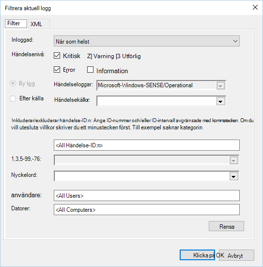

6. <span data-ttu-id="f7a3b-261">Händelser som kan indikera problem visas i **driftsfönstret.**</span><span class="sxs-lookup"><span data-stu-id="f7a3b-261">Events which can indicate issues will appear in the **Operational** pane.</span></span> <span data-ttu-id="f7a3b-262">Du kan försöka felsöka dem baserat på lösningarna i följande tabell:</span><span class="sxs-lookup"><span data-stu-id="f7a3b-262">You can attempt to troubleshoot them based on the solutions in the following table:</span></span>

<span data-ttu-id="f7a3b-263">Händelse-ID</span><span class="sxs-lookup"><span data-stu-id="f7a3b-263">Event ID</span></span> | <span data-ttu-id="f7a3b-264">Meddelande</span><span class="sxs-lookup"><span data-stu-id="f7a3b-264">Message</span></span> | <span data-ttu-id="f7a3b-265">Lösningssteg</span><span class="sxs-lookup"><span data-stu-id="f7a3b-265">Resolution steps</span></span>
:---:|:---|:---
 `5` | <span data-ttu-id="f7a3b-266">Microsoft Defender för slutpunktstjänsten kunde inte ansluta till servern med _variabeln_</span><span class="sxs-lookup"><span data-stu-id="f7a3b-266">Microsoft Defender for Endpoint service failed to connect to the server at _variable_</span></span> | <span data-ttu-id="f7a3b-267">[Kontrollera att enheten har internetåtkomst.](#ensure-the-device-has-an-internet-connection)</span><span class="sxs-lookup"><span data-stu-id="f7a3b-267">[Ensure the device has Internet access](#ensure-the-device-has-an-internet-connection).</span></span>
 `6` | <span data-ttu-id="f7a3b-268">Microsoft Defender för Slutpunkt-tjänsten är inte onboarded och inga onboarding-parametrar hittades.</span><span class="sxs-lookup"><span data-stu-id="f7a3b-268">Microsoft Defender for Endpoint service is not onboarded and no onboarding parameters were found.</span></span> <span data-ttu-id="f7a3b-269">Felkod: _variabel_</span><span class="sxs-lookup"><span data-stu-id="f7a3b-269">Failure code: _variable_</span></span> | <span data-ttu-id="f7a3b-270">[Kör onboarding-skriptet igen](configure-endpoints-script.md).</span><span class="sxs-lookup"><span data-stu-id="f7a3b-270">[Run the onboarding script again](configure-endpoints-script.md).</span></span>
 `7` | <span data-ttu-id="f7a3b-271">Microsoft Defender för slutpunktstjänsten kunde inte läsa onboarding-parametrarna.</span><span class="sxs-lookup"><span data-stu-id="f7a3b-271">Microsoft Defender for Endpoint service failed to read the onboarding parameters.</span></span> <span data-ttu-id="f7a3b-272">Felkod: _variabel_</span><span class="sxs-lookup"><span data-stu-id="f7a3b-272">Failure code: _variable_</span></span> | <span data-ttu-id="f7a3b-273">[Kontrollera att enheten har internetanslutning](#ensure-the-device-has-an-internet-connection)och kör sedan hela onboarding-processen igen.</span><span class="sxs-lookup"><span data-stu-id="f7a3b-273">[Ensure the device has Internet access](#ensure-the-device-has-an-internet-connection), then run the entire onboarding process again.</span></span>
 `9` | <span data-ttu-id="f7a3b-274">Microsoft Defender för slutpunktstjänsten kunde inte ändra starttypen.</span><span class="sxs-lookup"><span data-stu-id="f7a3b-274">Microsoft Defender for Endpoint service failed to change its start type.</span></span> <span data-ttu-id="f7a3b-275">Felkod: variabel</span><span class="sxs-lookup"><span data-stu-id="f7a3b-275">Failure code: variable</span></span> | <span data-ttu-id="f7a3b-276">Om händelsen inträffade under onboarding startar du om och försöker köra onboarding-skriptet igen.</span><span class="sxs-lookup"><span data-stu-id="f7a3b-276">If the event happened during onboarding, reboot and re-attempt running the onboarding script.</span></span> <span data-ttu-id="f7a3b-277">Mer information finns i [Kör onboarding-skriptet igen.](configure-endpoints-script.md)</span><span class="sxs-lookup"><span data-stu-id="f7a3b-277">For more information, see [Run the onboarding script again](configure-endpoints-script.md).</span></span> <br><br><span data-ttu-id="f7a3b-278">Kontakta support om händelsen inträffade vid offboarding.</span><span class="sxs-lookup"><span data-stu-id="f7a3b-278">If the event happened during offboarding, contact support.</span></span>
`10` | <span data-ttu-id="f7a3b-279">Microsoft Defender för slutpunktstjänsten kunde inte spara informationen om introduktionen.</span><span class="sxs-lookup"><span data-stu-id="f7a3b-279">Microsoft Defender for Endpoint service failed to persist the onboarding information.</span></span> <span data-ttu-id="f7a3b-280">Felkod: variabel</span><span class="sxs-lookup"><span data-stu-id="f7a3b-280">Failure code: variable</span></span> | <span data-ttu-id="f7a3b-281">Om händelsen inträffade under onboarding försöker du igen med onboarding-skriptet.</span><span class="sxs-lookup"><span data-stu-id="f7a3b-281">If the event happened during onboarding, re-attempt running the onboarding script.</span></span> <span data-ttu-id="f7a3b-282">Mer information finns i [Kör onboarding-skriptet igen.](configure-endpoints-script.md)</span><span class="sxs-lookup"><span data-stu-id="f7a3b-282">For more information, see [Run the onboarding script again](configure-endpoints-script.md).</span></span> <br><br><span data-ttu-id="f7a3b-283">Kontakta support om problemet kvarstår.</span><span class="sxs-lookup"><span data-stu-id="f7a3b-283">If the problem persists, contact support.</span></span>
`15` | <span data-ttu-id="f7a3b-284">Microsoft Defender för Slutpunkt kan inte starta kommandokanalen med variabeln _URL:_</span><span class="sxs-lookup"><span data-stu-id="f7a3b-284">Microsoft Defender for Endpoint cannot start command channel with URL: _variable_</span></span> | <span data-ttu-id="f7a3b-285">[Kontrollera att enheten har internetåtkomst.](#ensure-the-device-has-an-internet-connection)</span><span class="sxs-lookup"><span data-stu-id="f7a3b-285">[Ensure the device has Internet access](#ensure-the-device-has-an-internet-connection).</span></span>
`17` | <span data-ttu-id="f7a3b-286">Microsoft Defender för slutpunktstjänsten kunde inte ändra plats för anslutna användarupplevelser och telemetritjänster.</span><span class="sxs-lookup"><span data-stu-id="f7a3b-286">Microsoft Defender for Endpoint service failed to change the Connected User Experiences and Telemetry service location.</span></span> <span data-ttu-id="f7a3b-287">Felkod: variabel</span><span class="sxs-lookup"><span data-stu-id="f7a3b-287">Failure code: variable</span></span> | <span data-ttu-id="f7a3b-288">[Kör onboarding-skriptet igen](configure-endpoints-script.md).</span><span class="sxs-lookup"><span data-stu-id="f7a3b-288">[Run the onboarding script again](configure-endpoints-script.md).</span></span> <span data-ttu-id="f7a3b-289">Kontakta support om problemet kvarstår.</span><span class="sxs-lookup"><span data-stu-id="f7a3b-289">If the problem persists, contact support.</span></span>
`25` | <span data-ttu-id="f7a3b-290">Microsoft Defender för Slutpunkt-tjänsten kunde inte återställa hälsostatus i registret.</span><span class="sxs-lookup"><span data-stu-id="f7a3b-290">Microsoft Defender for Endpoint service failed to reset health status in the registry.</span></span> <span data-ttu-id="f7a3b-291">Felkod: _variabel_</span><span class="sxs-lookup"><span data-stu-id="f7a3b-291">Failure code: _variable_</span></span> | <span data-ttu-id="f7a3b-292">Kontakta supporten.</span><span class="sxs-lookup"><span data-stu-id="f7a3b-292">Contact support.</span></span>
`27` | <span data-ttu-id="f7a3b-293">Det gick inte att aktivera Microsoft Defender för slutpunktsläge i Windows Defender.</span><span class="sxs-lookup"><span data-stu-id="f7a3b-293">Failed to enable Microsoft Defender for Endpoint mode in Windows Defender.</span></span> <span data-ttu-id="f7a3b-294">Onboarding-processen misslyckades.</span><span class="sxs-lookup"><span data-stu-id="f7a3b-294">Onboarding process failed.</span></span> <span data-ttu-id="f7a3b-295">Felkod: variabel</span><span class="sxs-lookup"><span data-stu-id="f7a3b-295">Failure code: variable</span></span> | <span data-ttu-id="f7a3b-296">Kontakta supporten.</span><span class="sxs-lookup"><span data-stu-id="f7a3b-296">Contact support.</span></span>
`29` | <span data-ttu-id="f7a3b-297">Det gick inte att läsa parametrarna för offboarding.</span><span class="sxs-lookup"><span data-stu-id="f7a3b-297">Failed to read the offboarding parameters.</span></span> <span data-ttu-id="f7a3b-298">Feltyp: %1, Felkod: %2, Beskrivning: %3</span><span class="sxs-lookup"><span data-stu-id="f7a3b-298">Error type: %1, Error code: %2, Description: %3</span></span> | <span data-ttu-id="f7a3b-299">Kontrollera att enheten har internetanslutning och kör sedan hela offboardingprocessen igen.</span><span class="sxs-lookup"><span data-stu-id="f7a3b-299">Ensure the device has Internet access, then run the entire offboarding process again.</span></span>
`30` | <span data-ttu-id="f7a3b-300">Det gick inte att inaktivera läget $(build.sense.productDisplayName) i Microsoft Defender för Slutpunkt.</span><span class="sxs-lookup"><span data-stu-id="f7a3b-300">Failed to disable $(build.sense.productDisplayName) mode in Microsoft Defender for Endpoint.</span></span> <span data-ttu-id="f7a3b-301">Felkod: %1</span><span class="sxs-lookup"><span data-stu-id="f7a3b-301">Failure code: %1</span></span> | <span data-ttu-id="f7a3b-302">Kontakta supporten.</span><span class="sxs-lookup"><span data-stu-id="f7a3b-302">Contact support.</span></span>
`32` | <span data-ttu-id="f7a3b-303">$(build.sense.productDisplayName)-tjänsten kunde inte begära att stoppas efter offboarding-processen.</span><span class="sxs-lookup"><span data-stu-id="f7a3b-303">$(build.sense.productDisplayName) service failed to request to stop itself after offboarding process.</span></span> <span data-ttu-id="f7a3b-304">Felkod: %1</span><span class="sxs-lookup"><span data-stu-id="f7a3b-304">Failure code: %1</span></span> | <span data-ttu-id="f7a3b-305">Kontrollera att tjänstens starttyp är manuell och starta om enheten.</span><span class="sxs-lookup"><span data-stu-id="f7a3b-305">Verify that the service start type is manual and reboot the device.</span></span>
`55` | <span data-ttu-id="f7a3b-306">Det gick inte att skapa automatisk ETW-loggare för säker ETW.</span><span class="sxs-lookup"><span data-stu-id="f7a3b-306">Failed to create the Secure ETW autologger.</span></span> <span data-ttu-id="f7a3b-307">Felkod: %1</span><span class="sxs-lookup"><span data-stu-id="f7a3b-307">Failure code: %1</span></span> | <span data-ttu-id="f7a3b-308">Starta om enheten.</span><span class="sxs-lookup"><span data-stu-id="f7a3b-308">Reboot the device.</span></span>
`63` | <span data-ttu-id="f7a3b-309">Uppdatera starttypen för extern tjänst.</span><span class="sxs-lookup"><span data-stu-id="f7a3b-309">Updating the start type of external service.</span></span> <span data-ttu-id="f7a3b-310">Namn: %1, verklig starttyp: %2, förväntad starttyp: %3, utgångskod: %4</span><span class="sxs-lookup"><span data-stu-id="f7a3b-310">Name: %1, actual start type: %2, expected start type: %3, exit code: %4</span></span> | <span data-ttu-id="f7a3b-311">Identifiera vad som orsakar ändringarna i starttypen för den omnämnda tjänsten.</span><span class="sxs-lookup"><span data-stu-id="f7a3b-311">Identify what is causing changes in start type of mentioned service.</span></span> <span data-ttu-id="f7a3b-312">Om utgångskoden inte är 0 korrigerar du starttypen manuellt till förväntad starttyp.</span><span class="sxs-lookup"><span data-stu-id="f7a3b-312">If the exit code is not 0, fix the start type manually to expected start type.</span></span>
`64` | <span data-ttu-id="f7a3b-313">Starta den externa tjänsten som stoppas.</span><span class="sxs-lookup"><span data-stu-id="f7a3b-313">Starting stopped external service.</span></span> <span data-ttu-id="f7a3b-314">Namn: %1, utgångskod: %2</span><span class="sxs-lookup"><span data-stu-id="f7a3b-314">Name: %1, exit code: %2</span></span> | <span data-ttu-id="f7a3b-315">Kontakta support om händelsen fortsätter att visas.</span><span class="sxs-lookup"><span data-stu-id="f7a3b-315">Contact support if the event keeps re-appearing.</span></span>
`68` | <span data-ttu-id="f7a3b-316">Tjänstens starttyp är oväntad.</span><span class="sxs-lookup"><span data-stu-id="f7a3b-316">The start type of the service is unexpected.</span></span> <span data-ttu-id="f7a3b-317">Tjänstnamn: %1, verklig starttyp: %2, förväntad starttyp: %3</span><span class="sxs-lookup"><span data-stu-id="f7a3b-317">Service name: %1, actual start type: %2, expected start type: %3</span></span> | <span data-ttu-id="f7a3b-318">Identifiera vad som orsakar ändringarna i starttypen.</span><span class="sxs-lookup"><span data-stu-id="f7a3b-318">Identify what is causing changes in start type.</span></span> <span data-ttu-id="f7a3b-319">Åtgärda den omnämnda tjänstens starttyp.</span><span class="sxs-lookup"><span data-stu-id="f7a3b-319">Fix mentioned service start type.</span></span>
`69` | <span data-ttu-id="f7a3b-320">Tjänsten stoppas.</span><span class="sxs-lookup"><span data-stu-id="f7a3b-320">The service is stopped.</span></span> <span data-ttu-id="f7a3b-321">Tjänstnamn: %1</span><span class="sxs-lookup"><span data-stu-id="f7a3b-321">Service name: %1</span></span> | <span data-ttu-id="f7a3b-322">Starta den omnämnda tjänsten.</span><span class="sxs-lookup"><span data-stu-id="f7a3b-322">Start the mentioned service.</span></span> <span data-ttu-id="f7a3b-323">Kontakta support om detta kvarstår.</span><span class="sxs-lookup"><span data-stu-id="f7a3b-323">Contact support if persists.</span></span>

<br />

<span data-ttu-id="f7a3b-324">Det finns ytterligare komponenter på enheten som Microsoft Defender för slutpunktsagenten är beroende av för att fungera korrekt.</span><span class="sxs-lookup"><span data-stu-id="f7a3b-324">There are additional components on the device that the Microsoft Defender for Endpoint agent depends on to function properly.</span></span> <span data-ttu-id="f7a3b-325">Om det inte finns några onboarding-relaterade fel i microsoft Defender för slutpunktsagentens händelselogg går du vidare med följande steg för att säkerställa att de ytterligare komponenterna är konfigurerade på rätt sätt.</span><span class="sxs-lookup"><span data-stu-id="f7a3b-325">If there are no onboarding related errors in the Microsoft Defender for Endpoint agent event log, proceed with the following steps to ensure that the additional components are configured correctly.</span></span>

<span id="ensure-the-diagnostics-service-is-enabled" />

### <a name="ensure-the-diagnostic-data-service-is-enabled"></a><span data-ttu-id="f7a3b-326">Kontrollera att diagnostikdatatjänsten är aktiverad</span><span class="sxs-lookup"><span data-stu-id="f7a3b-326">Ensure the diagnostic data service is enabled</span></span>

<span data-ttu-id="f7a3b-327">Om enheterna inte rapporterar korrekt kan du behöva kontrollera att Windows 10 för diagnostikdata är inställd på att startas automatiskt och körs på enheten.</span><span class="sxs-lookup"><span data-stu-id="f7a3b-327">If the devices aren't reporting correctly, you might need to check that the Windows 10 diagnostic data service is set to automatically start and is running on the device.</span></span> <span data-ttu-id="f7a3b-328">Tjänsten kan ha inaktiverats av andra program eller ändringar av användarkonfigurationen.</span><span class="sxs-lookup"><span data-stu-id="f7a3b-328">The service might have been disabled by other programs or user configuration changes.</span></span>

<span data-ttu-id="f7a3b-329">Kontrollera först att tjänsten är inställd på att starta automatiskt när Windows startar. Kontrollera sedan att tjänsten körs (och starta den om den inte är det).</span><span class="sxs-lookup"><span data-stu-id="f7a3b-329">First, you should check that the service is set to start automatically when Windows starts, then you should check that the service is currently running (and start it if it isn't).</span></span>

### <a name="ensure-the-service-is-set-to-start"></a><span data-ttu-id="f7a3b-330">Kontrollera att tjänsten är inställd på att starta</span><span class="sxs-lookup"><span data-stu-id="f7a3b-330">Ensure the service is set to start</span></span>

<span data-ttu-id="f7a3b-331">**Använd kommandoraden för att kontrollera Windows 10 av tjänstens starttyp för diagnostikdata:**</span><span class="sxs-lookup"><span data-stu-id="f7a3b-331">**Use the command line to check the Windows 10 diagnostic data service startup type**:</span></span>

1. <span data-ttu-id="f7a3b-332">Öppna en upphöjd kommandoradsfråga på enheten:</span><span class="sxs-lookup"><span data-stu-id="f7a3b-332">Open an elevated command-line prompt on the device:</span></span>

   <span data-ttu-id="f7a3b-333">a.</span><span class="sxs-lookup"><span data-stu-id="f7a3b-333">a.</span></span> <span data-ttu-id="f7a3b-334">Klicka **på Start**, skriv **cmd** och tryck på **Retur.**</span><span class="sxs-lookup"><span data-stu-id="f7a3b-334">Click **Start**, type **cmd**, and press **Enter**.</span></span>

   <span data-ttu-id="f7a3b-335">b.</span><span class="sxs-lookup"><span data-stu-id="f7a3b-335">b.</span></span> <span data-ttu-id="f7a3b-336">Högerklicka på **Kommandotolken** och välj **Kör som administratör**.</span><span class="sxs-lookup"><span data-stu-id="f7a3b-336">Right-click **Command prompt** and select **Run as administrator**.</span></span>

2. <span data-ttu-id="f7a3b-337">Ange följande kommando och tryck på **Retur:**</span><span class="sxs-lookup"><span data-stu-id="f7a3b-337">Enter the following command, and press **Enter**:</span></span>

   ```text
   sc qc diagtrack
   ```

   <span data-ttu-id="f7a3b-338">Om tjänsten är aktiverad bör resultatet se ut som på följande skärmbild:</span><span class="sxs-lookup"><span data-stu-id="f7a3b-338">If the service is enabled, then the result should look like the following screenshot:</span></span>

   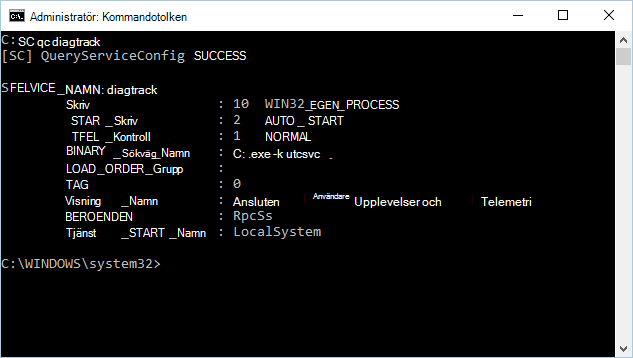

   <span data-ttu-id="f7a3b-340">Om `START_TYPE` den inte är `AUTO_START` inställd på måste du ange att tjänsten ska startas automatiskt.</span><span class="sxs-lookup"><span data-stu-id="f7a3b-340">If the `START_TYPE` is not set to `AUTO_START`, then you'll need to set the service to automatically start.</span></span>

<span data-ttu-id="f7a3b-341">**Använd kommandoraden för att ställa in Windows 10 för diagnostikdata att starta automatiskt:**</span><span class="sxs-lookup"><span data-stu-id="f7a3b-341">**Use the command line to set the Windows 10 diagnostic data service to automatically start:**</span></span>

1. <span data-ttu-id="f7a3b-342">Öppna en upphöjd kommandoradsfråga på enheten:</span><span class="sxs-lookup"><span data-stu-id="f7a3b-342">Open an elevated command-line prompt on the device:</span></span>

   <span data-ttu-id="f7a3b-343">a.</span><span class="sxs-lookup"><span data-stu-id="f7a3b-343">a.</span></span> <span data-ttu-id="f7a3b-344">Klicka **på Start**, skriv **cmd** och tryck på **Retur.**</span><span class="sxs-lookup"><span data-stu-id="f7a3b-344">Click **Start**, type **cmd**, and press **Enter**.</span></span>

   <span data-ttu-id="f7a3b-345">b.</span><span class="sxs-lookup"><span data-stu-id="f7a3b-345">b.</span></span> <span data-ttu-id="f7a3b-346">Högerklicka på **Kommandotolken** och välj **Kör som administratör**.</span><span class="sxs-lookup"><span data-stu-id="f7a3b-346">Right-click **Command prompt** and select **Run as administrator**.</span></span>

2. <span data-ttu-id="f7a3b-347">Ange följande kommando och tryck på **Retur:**</span><span class="sxs-lookup"><span data-stu-id="f7a3b-347">Enter the following command, and press **Enter**:</span></span>

   ```text
   sc config diagtrack start=auto
   ```

3. <span data-ttu-id="f7a3b-348">Ett meddelande om att det har lyckats visas.</span><span class="sxs-lookup"><span data-stu-id="f7a3b-348">A success message is displayed.</span></span> <span data-ttu-id="f7a3b-349">Verifiera ändringen genom att ange följande kommando och tryck på **Retur:**</span><span class="sxs-lookup"><span data-stu-id="f7a3b-349">Verify the change by entering the following command, and press **Enter**:</span></span>

   ```text
   sc qc diagtrack
   ```

4. <span data-ttu-id="f7a3b-350">Starta tjänsten.</span><span class="sxs-lookup"><span data-stu-id="f7a3b-350">Start the service.</span></span>

   <span data-ttu-id="f7a3b-351">a.</span><span class="sxs-lookup"><span data-stu-id="f7a3b-351">a.</span></span> <span data-ttu-id="f7a3b-352">Skriv följande kommando i kommandotolken och tryck på **Retur:**</span><span class="sxs-lookup"><span data-stu-id="f7a3b-352">In the command prompt, type the following command and press **Enter**:</span></span>

   ```text
   sc start diagtrack
   ```

### <a name="ensure-the-device-has-an-internet-connection"></a><span data-ttu-id="f7a3b-353">Kontrollera att enheten har en Internetanslutning</span><span class="sxs-lookup"><span data-stu-id="f7a3b-353">Ensure the device has an Internet connection</span></span>

<span data-ttu-id="f7a3b-354">Microsoft Defender för slutpunkts sensoren kräver Microsoft Windows HTTP (WinHTTP) för att rapportera sensordata och kommunicera med Microsoft Defender för slutpunktstjänsten.</span><span class="sxs-lookup"><span data-stu-id="f7a3b-354">The Microsoft Defender for Endpoint sensor requires Microsoft Windows HTTP (WinHTTP) to report sensor data and communicate with the Microsoft Defender for Endpoint service.</span></span>

<span data-ttu-id="f7a3b-355">WinHTTP är oberoende av proxyinställningar för surfning och andra användarkontextprogram och måste kunna identifiera de proxyservrar som är tillgängliga i just din miljö.</span><span class="sxs-lookup"><span data-stu-id="f7a3b-355">WinHTTP is independent of the Internet browsing proxy settings and other user context applications and must be able to detect the proxy servers that are available in your particular environment.</span></span>

<span data-ttu-id="f7a3b-356">Om du vill säkerställa att sensorn har tjänstanslutning följer du stegen som beskrivs i avsnittet Verifiera klientanslutningen till Microsoft Defender för [slutpunktstjänstens URL-adresser.](configure-proxy-internet.md#verify-client-connectivity-to-microsoft-defender-for-endpoint-service-urls)</span><span class="sxs-lookup"><span data-stu-id="f7a3b-356">To ensure that sensor has service connectivity, follow the steps described in the [Verify client connectivity to Microsoft Defender for Endpoint service URLs](configure-proxy-internet.md#verify-client-connectivity-to-microsoft-defender-for-endpoint-service-urls) topic.</span></span>

<span data-ttu-id="f7a3b-357">Om verifieringen misslyckas och miljön använder en proxyserver för att ansluta till Internet följer du stegen som beskrivs i Konfigurera proxy- och [Internetanslutningsinställningar.](configure-proxy-internet.md)</span><span class="sxs-lookup"><span data-stu-id="f7a3b-357">If the verification fails and your environment is using a proxy to connect to the Internet, then follow the steps described in [Configure proxy and Internet connectivity settings](configure-proxy-internet.md) topic.</span></span>

### <a name="ensure-that-microsoft-defender-antivirus-is-not-disabled-by-a-policy"></a><span data-ttu-id="f7a3b-358">Kontrollera att Microsoft Defender Antivirus inaktiveras av en princip</span><span class="sxs-lookup"><span data-stu-id="f7a3b-358">Ensure that Microsoft Defender Antivirus is not disabled by a policy</span></span>

> [!IMPORTANT]
> <span data-ttu-id="f7a3b-359">Följande gäller endast enheter  som ännu inte har fått uppdateringen augusti 2020 (version 4.18.2007.8) till Microsoft Defender Antivirus.</span><span class="sxs-lookup"><span data-stu-id="f7a3b-359">The following only applies to devices that have **not** yet received the August 2020 (version 4.18.2007.8) update to Microsoft Defender Antivirus.</span></span>
>
> <span data-ttu-id="f7a3b-360">Uppdateringen säkerställer att Microsoft Defender Antivirus kan inaktiveras på klientenheter via systemprincipen.</span><span class="sxs-lookup"><span data-stu-id="f7a3b-360">The update ensures that Microsoft Defender Antivirus cannot be turned off on client devices via system policy.</span></span>

<span data-ttu-id="f7a3b-361">**Problem:** Microsoft Defender för slutpunktstjänsten startar inte efter introduktionen.</span><span class="sxs-lookup"><span data-stu-id="f7a3b-361">**Problem**: The Microsoft Defender for Endpoint service does not start after onboarding.</span></span>

<span data-ttu-id="f7a3b-362">**Symptom:** Onboarding har slutförts, men du ser felet 577 eller felet 1058 när du försöker starta tjänsten.</span><span class="sxs-lookup"><span data-stu-id="f7a3b-362">**Symptom**: Onboarding successfully completes, but you see error 577 or error 1058 when trying to start the service.</span></span>

<span data-ttu-id="f7a3b-363">**Lösning:** Om dina enheter kör en tredjepartsklient för program mot skadlig programvara måste drivrutinen Early Launch Antimalware (ELAM) aktiveras av Microsoft Defender för slutpunktsagenten.</span><span class="sxs-lookup"><span data-stu-id="f7a3b-363">**Solution**: If your devices are running a third-party antimalware client, the Microsoft Defender for Endpoint agent needs the Early Launch Antimalware (ELAM) driver to be enabled.</span></span> <span data-ttu-id="f7a3b-364">Du måste se till att det inte är inaktiverat av en systemprincip.</span><span class="sxs-lookup"><span data-stu-id="f7a3b-364">You must ensure that it's not turned off by a system policy.</span></span>

- <span data-ttu-id="f7a3b-365">Beroende på vilket verktyg du använder för att implementera principer måste du kontrollera att följande Windows Defender principer är avmarkerade:</span><span class="sxs-lookup"><span data-stu-id="f7a3b-365">Depending on the tool that you use to implement policies, you'll need to verify that the following Windows Defender policies are cleared:</span></span>

  - <span data-ttu-id="f7a3b-366">DisableAntiSpyware</span><span class="sxs-lookup"><span data-stu-id="f7a3b-366">DisableAntiSpyware</span></span>
  - <span data-ttu-id="f7a3b-367">DisableAntiVirus</span><span class="sxs-lookup"><span data-stu-id="f7a3b-367">DisableAntiVirus</span></span>

  <span data-ttu-id="f7a3b-368">I grupprinciper ska det till exempel inte finnas några poster som följande värden:</span><span class="sxs-lookup"><span data-stu-id="f7a3b-368">For example, in Group Policy there should be no entries such as the following values:</span></span>

  - `<Key Path="SOFTWARE\Policies\Microsoft\Windows Defender"><KeyValue Value="0" ValueKind="DWord" Name="DisableAntiSpyware"/></Key>`
  - `<Key Path="SOFTWARE\Policies\Microsoft\Windows Defender"><KeyValue Value="0" ValueKind="DWord" Name="DisableAntiVirus"/></Key>`

> [!IMPORTANT]
> <span data-ttu-id="f7a3b-369">Inställningen har utgått och ignoreras på alla klientenheter från och med augusti `disableAntiSpyware` 2020 (version 4.18.2007.8) till Microsoft Defender Antivirus.</span><span class="sxs-lookup"><span data-stu-id="f7a3b-369">The `disableAntiSpyware` setting is discontinued and will be ignored on all client devices, as of the August 2020 (version 4.18.2007.8) update to Microsoft Defender Antivirus.</span></span>

- <span data-ttu-id="f7a3b-370">När du har rensat principen kör du introduktionsstegen igen.</span><span class="sxs-lookup"><span data-stu-id="f7a3b-370">After clearing the policy, run the onboarding steps again.</span></span>

- <span data-ttu-id="f7a3b-371">Du kan också kontrollera tidigare registernyckelvärden för att verifiera att principen är inaktiverad genom att öppna registernyckeln `HKEY_LOCAL_MACHINE\SOFTWARE\Policies\Microsoft\Windows Defender` .</span><span class="sxs-lookup"><span data-stu-id="f7a3b-371">You can also check the previous registry key values to verify that the policy is disabled, by opening the registry key `HKEY_LOCAL_MACHINE\SOFTWARE\Policies\Microsoft\Windows Defender`.</span></span>

    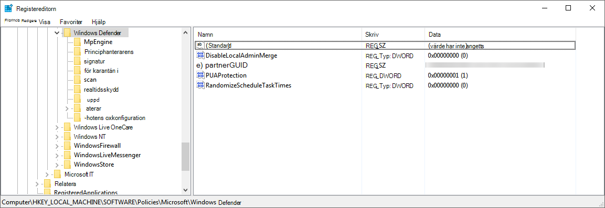

   > [!NOTE]
   > <span data-ttu-id="f7a3b-373">Alla Windows Defender-tjänster (wdboot, wdfilter, wdnisdrv, wdnissvc och windefend) ska vara i standardtillståndet.</span><span class="sxs-lookup"><span data-stu-id="f7a3b-373">All Windows Defender services (wdboot, wdfilter, wdnisdrv, wdnissvc, and windefend) should be in their default state.</span></span> <span data-ttu-id="f7a3b-374">Det går inte att ändra starten av dessa tjänster och kan tvinga dig att animera systemet.</span><span class="sxs-lookup"><span data-stu-id="f7a3b-374">Changing the startup of these services is unsupported and may force you to reimage your system.</span></span>
   >
   > <span data-ttu-id="f7a3b-375">Exempel på standardkonfigurationer för WdBoot och WdFilter:</span><span class="sxs-lookup"><span data-stu-id="f7a3b-375">Example default configurations for WdBoot and WdFilter:</span></span>
   > - `<Key Path="SYSTEM\CurrentControlSet\Services\WdBoot"><KeyValue Value="0" ValueKind="DWord" Name="Start"/></Key>`
   > - `<Key Path="SYSTEM\CurrentControlSet\Services\WdFilter"><KeyValue Value="0" ValueKind="DWord" Name="Start"/></Key>`

## <a name="troubleshoot-onboarding-issues-on-a-server"></a><span data-ttu-id="f7a3b-376">Felsöka onboarding-problem på en server</span><span class="sxs-lookup"><span data-stu-id="f7a3b-376">Troubleshoot onboarding issues on a server</span></span>

<span data-ttu-id="f7a3b-377">Om du stöter på problem vid registrering av en server går du igenom följande verifieringssteg för att åtgärda möjliga problem.</span><span class="sxs-lookup"><span data-stu-id="f7a3b-377">If you encounter issues while onboarding a server, go through the following verification steps to address possible issues.</span></span>

- [<span data-ttu-id="f7a3b-378">Kontrollera att Microsoft Monitoring Agent (MMA) är installerat och konfigurerat för att rapportera sensordata till tjänsten</span><span class="sxs-lookup"><span data-stu-id="f7a3b-378">Ensure Microsoft Monitoring Agent (MMA) is installed and configured to report sensor data to the service</span></span>](configure-server-endpoints.md)
- [<span data-ttu-id="f7a3b-379">Kontrollera att serverproxyn och internetanslutningsinställningarna är korrekt konfigurerade</span><span class="sxs-lookup"><span data-stu-id="f7a3b-379">Ensure that the server proxy and Internet connectivity settings are configured properly</span></span>](configure-server-endpoints.md)

<span data-ttu-id="f7a3b-380">Du kan också behöva kontrollera följande:</span><span class="sxs-lookup"><span data-stu-id="f7a3b-380">You might also need to check the following:</span></span>

- <span data-ttu-id="f7a3b-381">Kontrollera att microsoft Defender för slutpunktstjänsten körs på fliken **Processer** i **Aktivitetshanteraren.**</span><span class="sxs-lookup"><span data-stu-id="f7a3b-381">Check that there is a Microsoft Defender for Endpoint Service running in the **Processes** tab in **Task Manager**.</span></span> <span data-ttu-id="f7a3b-382">Till exempel:</span><span class="sxs-lookup"><span data-stu-id="f7a3b-382">For example:</span></span>

    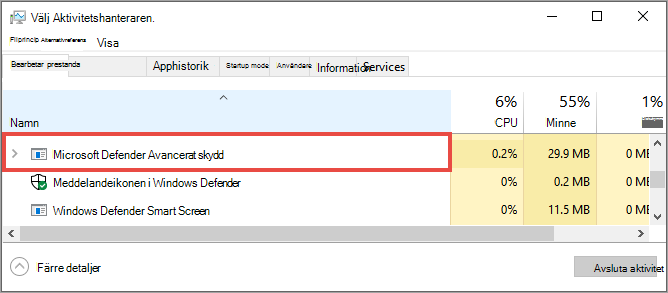

- <span data-ttu-id="f7a3b-384">Kontrollera **åtgärdshanteraren**  >  **för program- och tjänstloggar** i  >   Loggboken för att se om det finns några fel.</span><span class="sxs-lookup"><span data-stu-id="f7a3b-384">Check **Event Viewer** > **Applications and Services Logs** > **Operation Manager** to see if there are any errors.</span></span>

- <span data-ttu-id="f7a3b-385">Kontrollera **om** Microsofts **övervakningsagent körs** på servern i Tjänster.</span><span class="sxs-lookup"><span data-stu-id="f7a3b-385">In **Services**, check if the **Microsoft Monitoring Agent** is running on the server.</span></span> <span data-ttu-id="f7a3b-386">Ett exempel:</span><span class="sxs-lookup"><span data-stu-id="f7a3b-386">For example,</span></span>

    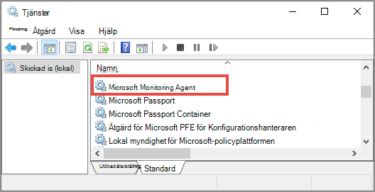

- <span data-ttu-id="f7a3b-388">I **Microsoft Monitoring Agent** Azure Log Analytics  >  **(OMS)** kontrollerar du arbetsytorna och kontrollerar att statusen är igång.</span><span class="sxs-lookup"><span data-stu-id="f7a3b-388">In **Microsoft Monitoring Agent** > **Azure Log Analytics (OMS)**, check the Workspaces and verify that the status is running.</span></span>

    

- <span data-ttu-id="f7a3b-390">Kontrollera att enheter visas i listan **Enheter i** portalen.</span><span class="sxs-lookup"><span data-stu-id="f7a3b-390">Check to see that devices are reflected in the **Devices list** in the portal.</span></span>

## <a name="confirming-onboarding-of-newly-built-devices"></a><span data-ttu-id="f7a3b-391">Bekräfta registrering av nyligen skapade enheter</span><span class="sxs-lookup"><span data-stu-id="f7a3b-391">Confirming onboarding of newly built devices</span></span>

<span data-ttu-id="f7a3b-392">Det kan finnas instanser när onboarding distribueras på en ny enhet men inte slutförd.</span><span class="sxs-lookup"><span data-stu-id="f7a3b-392">There may be instances when onboarding is deployed on a newly built device but not completed.</span></span>

<span data-ttu-id="f7a3b-393">Anvisningarna nedan ger vägledning för följande scenario:</span><span class="sxs-lookup"><span data-stu-id="f7a3b-393">The steps below provide guidance for the following scenario:</span></span>

- <span data-ttu-id="f7a3b-394">Onboarding-paket har distribuerats till nya enheter</span><span class="sxs-lookup"><span data-stu-id="f7a3b-394">Onboarding package is deployed to newly built devices</span></span>
- <span data-ttu-id="f7a3b-395">Sensorn startar inte eftersom den inbe-upplevelsen (OOBE) eller första användarens inloggning inte har slutförts</span><span class="sxs-lookup"><span data-stu-id="f7a3b-395">Sensor does not start because the Out-of-box experience (OOBE) or first user logon has not been completed</span></span>
- <span data-ttu-id="f7a3b-396">Enheten stängs av eller startas om innan slutanvändaren loggar in första gången</span><span class="sxs-lookup"><span data-stu-id="f7a3b-396">Device is turned off or restarted before the end user performs a first logon</span></span>
- <span data-ttu-id="f7a3b-397">I det här scenariot startar INTE SENSE-tjänsten automatiskt även om onboarding-paketet har distribuerats</span><span class="sxs-lookup"><span data-stu-id="f7a3b-397">In this scenario, the SENSE service will not start automatically even though onboarding package was deployed</span></span>

> [!NOTE]
> <span data-ttu-id="f7a3b-398">Följande steg är bara relevanta när du använder Microsoft Endpoint Configuration Manager.</span><span class="sxs-lookup"><span data-stu-id="f7a3b-398">The following steps are only relevant when using Microsoft Endpoint Configuration Manager.</span></span> <span data-ttu-id="f7a3b-399">Mer information om onboarding med hjälp Microsoft Endpoint Configuration Manager finns i [Microsoft Defender för Endpoint](/mem/configmgr/protect/deploy-use/windows-defender-advanced-threat-protection).</span><span class="sxs-lookup"><span data-stu-id="f7a3b-399">For more details about onboarding using Microsoft Endpoint Configuration Manager, see [Microsoft Defender for Endpoint](/mem/configmgr/protect/deploy-use/windows-defender-advanced-threat-protection).</span></span>

1. <span data-ttu-id="f7a3b-400">Skapa ett program i Microsoft Endpoint Configuration Manager.</span><span class="sxs-lookup"><span data-stu-id="f7a3b-400">Create an application in Microsoft Endpoint Configuration Manager.</span></span>

    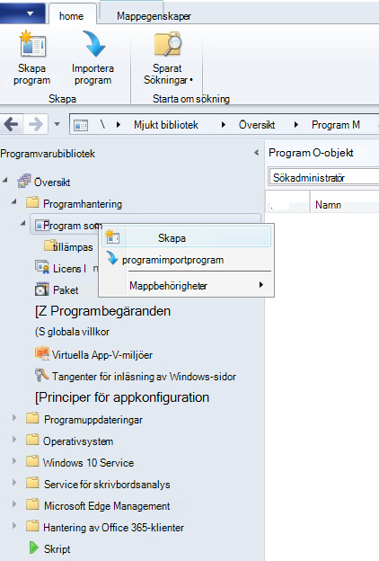

2. <span data-ttu-id="f7a3b-402">Välj **Ange programinformationen manuellt.**</span><span class="sxs-lookup"><span data-stu-id="f7a3b-402">Select **Manually specify the application information**.</span></span>

    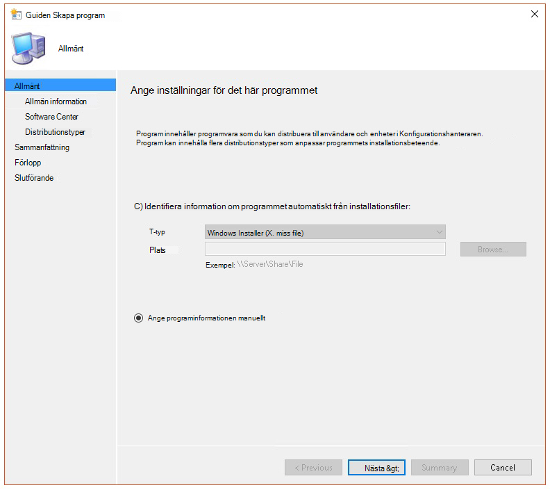

3. <span data-ttu-id="f7a3b-404">Ange information om programmet och välj sedan **Nästa**.</span><span class="sxs-lookup"><span data-stu-id="f7a3b-404">Specify information about the application, then select **Next**.</span></span>

    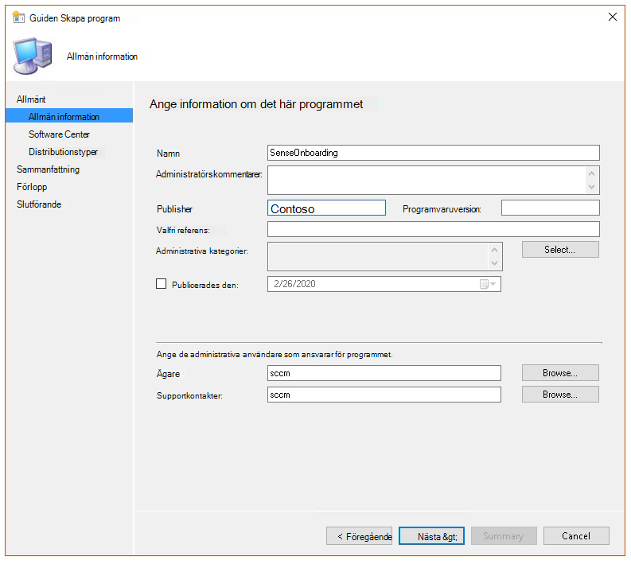

4. <span data-ttu-id="f7a3b-406">Ange information om programvarucentret och välj **nästa**.</span><span class="sxs-lookup"><span data-stu-id="f7a3b-406">Specify information about the software center, then select **Next**.</span></span>

    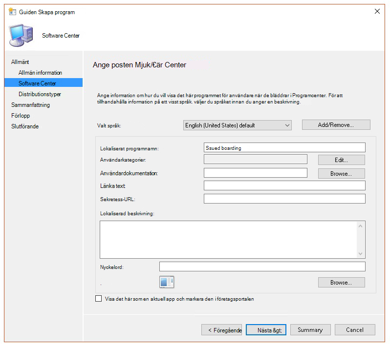

5. <span data-ttu-id="f7a3b-408">Välj **Lägg till i** **Distributionstyper.**</span><span class="sxs-lookup"><span data-stu-id="f7a3b-408">In **Deployment types** select **Add**.</span></span>

    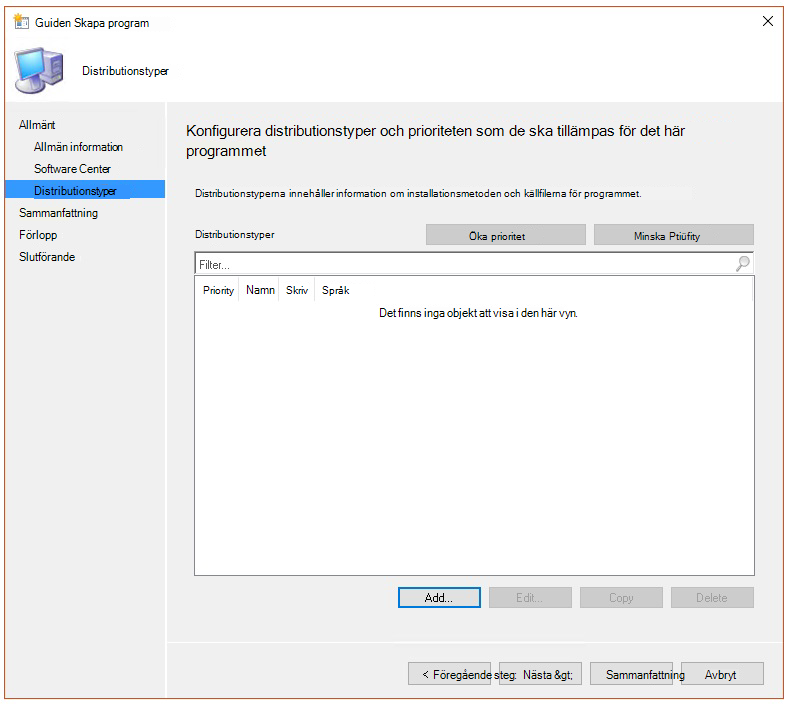

6. <span data-ttu-id="f7a3b-410">Välj **Ange information om distributionstyp manuellt** och välj sedan **Nästa.**</span><span class="sxs-lookup"><span data-stu-id="f7a3b-410">Select **Manually specify the deployment type information**, then select **Next**.</span></span>

    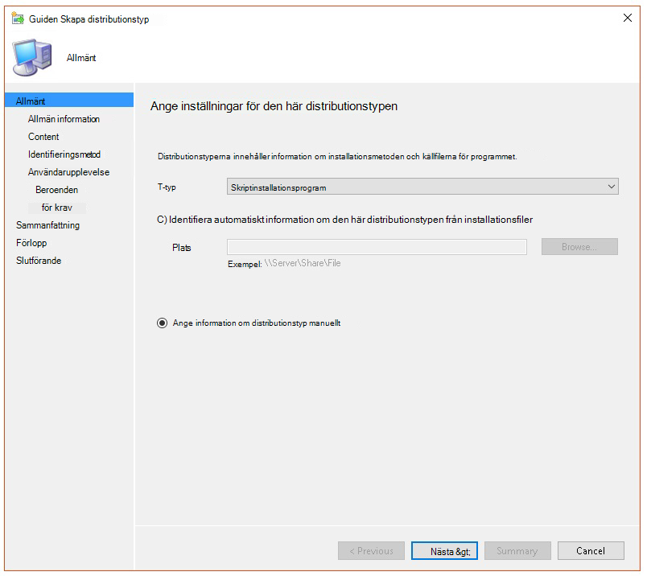

7. <span data-ttu-id="f7a3b-412">Ange information om distributionstyp och välj sedan **Nästa.**</span><span class="sxs-lookup"><span data-stu-id="f7a3b-412">Specify information about the deployment type, then select **Next**.</span></span>

    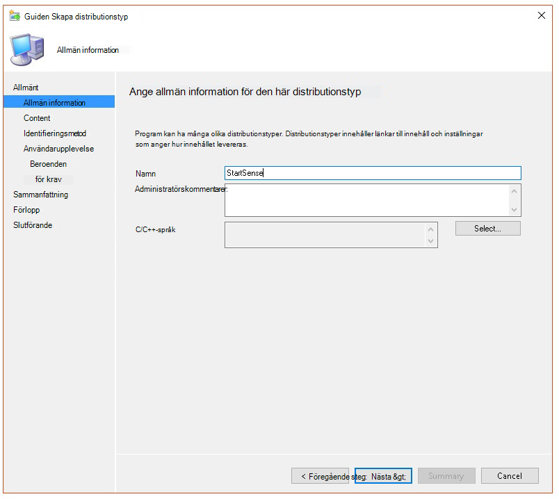

8. <span data-ttu-id="f7a3b-414">I **programmet**  >  **för innehållsinstallation** anger du kommandot: `net start sense` .</span><span class="sxs-lookup"><span data-stu-id="f7a3b-414">In **Content** > **Installation program** specify the command: `net start sense`.</span></span>

    

9. <span data-ttu-id="f7a3b-416">I **Identifieringsmetod** väljer du **Konfigurera regler för att identifiera närvaro av den här distributionstypen** och väljer sedan Lägg **till sats.**</span><span class="sxs-lookup"><span data-stu-id="f7a3b-416">In **Detection method**, select **Configure rules to detect the presence of this deployment type**, then select **Add Clause**.</span></span>

    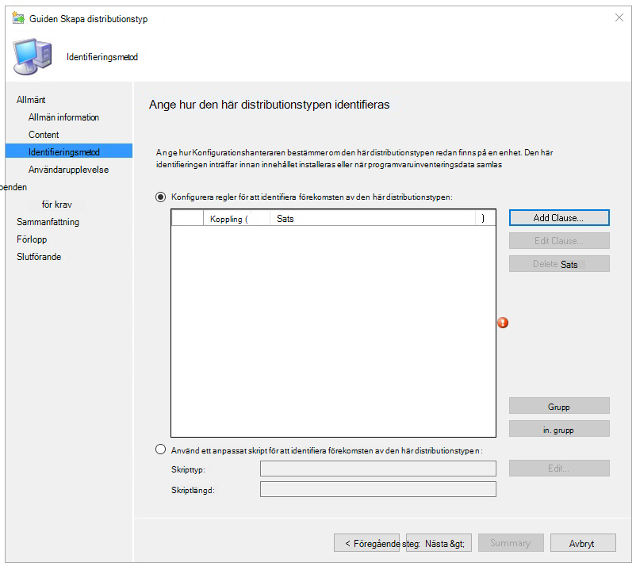

10. <span data-ttu-id="f7a3b-418">Ange följande information om identifieringsregeln och välj sedan **OK:**</span><span class="sxs-lookup"><span data-stu-id="f7a3b-418">Specify the following detection rule details, then select **OK**:</span></span>

    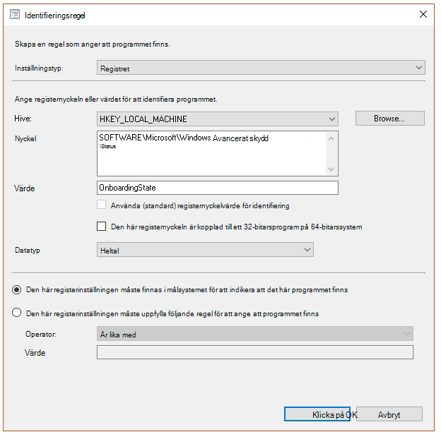

11. <span data-ttu-id="f7a3b-420">Välj Nästa i **Identifieringsmetod.** </span><span class="sxs-lookup"><span data-stu-id="f7a3b-420">In **Detection method** select **Next**.</span></span>

    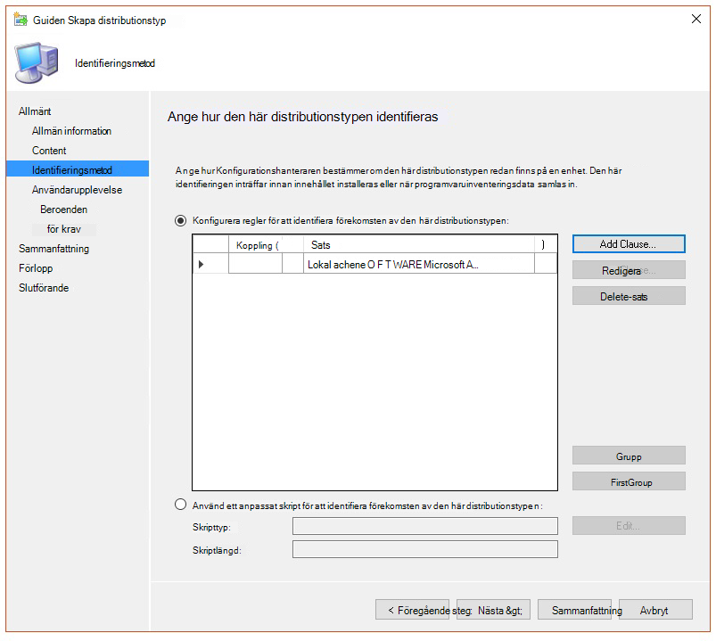

12. <span data-ttu-id="f7a3b-422">I **Användarupplevelse** anger du följande information och väljer sedan **Nästa:**</span><span class="sxs-lookup"><span data-stu-id="f7a3b-422">In **User Experience**, specify the following information, then select **Next**:</span></span>

    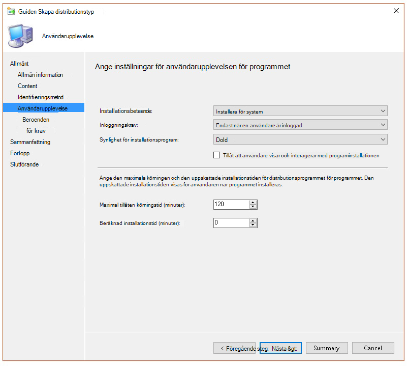

13. <span data-ttu-id="f7a3b-424">Välj **Nästa** i **Krav.**</span><span class="sxs-lookup"><span data-stu-id="f7a3b-424">In **Requirements**, select **Next**.</span></span>

    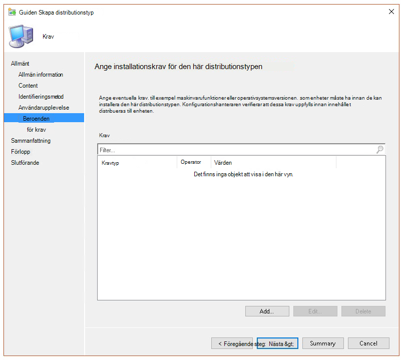

14. <span data-ttu-id="f7a3b-426">I **Beroenden väljer** du **Nästa.**</span><span class="sxs-lookup"><span data-stu-id="f7a3b-426">In **Dependencies**, select **Next**.</span></span>

    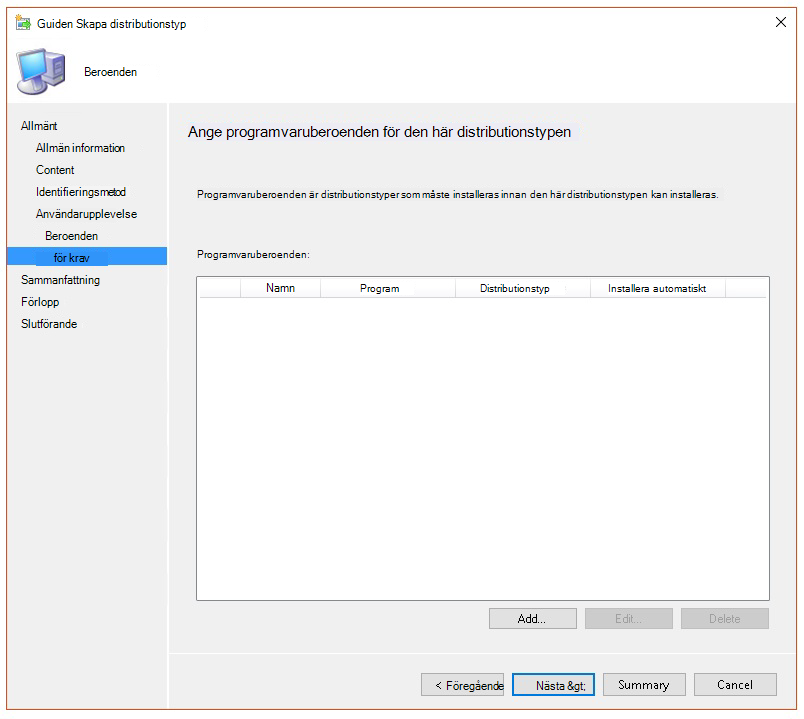

15. <span data-ttu-id="f7a3b-428">Välj **Nästa** i **Sammanfattning.**</span><span class="sxs-lookup"><span data-stu-id="f7a3b-428">In **Summary**, select **Next**.</span></span>

    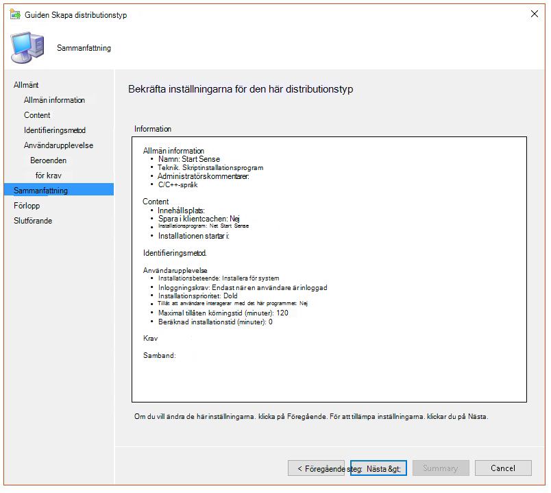

16. <span data-ttu-id="f7a3b-430">I **komplettering** väljer du **Stäng**.</span><span class="sxs-lookup"><span data-stu-id="f7a3b-430">In **Completion**, select **Close**.</span></span>

    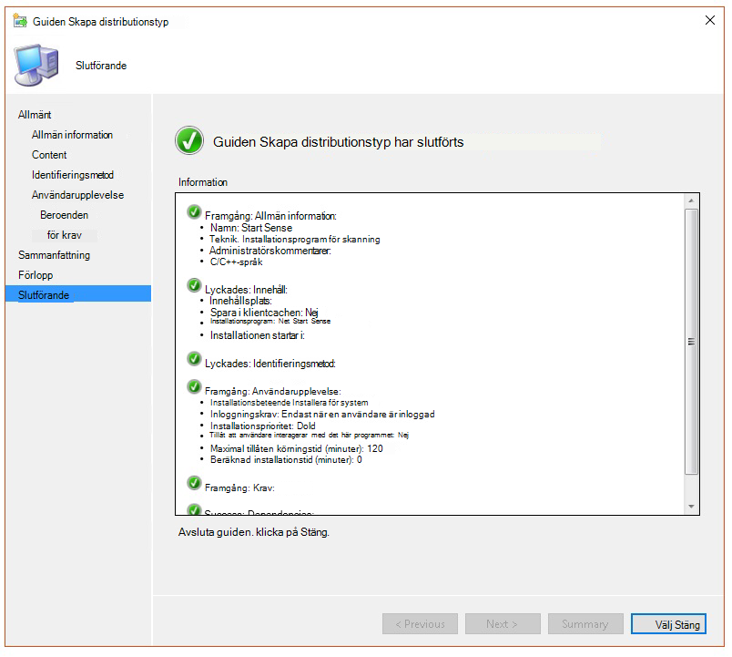

17. <span data-ttu-id="f7a3b-432">I **Distributionstyper** väljer du **Nästa.**</span><span class="sxs-lookup"><span data-stu-id="f7a3b-432">In **Deployment types**, select **Next**.</span></span>

    

18. <span data-ttu-id="f7a3b-434">Välj **Nästa** i **Sammanfattning.**</span><span class="sxs-lookup"><span data-stu-id="f7a3b-434">In **Summary**, select **Next**.</span></span>

    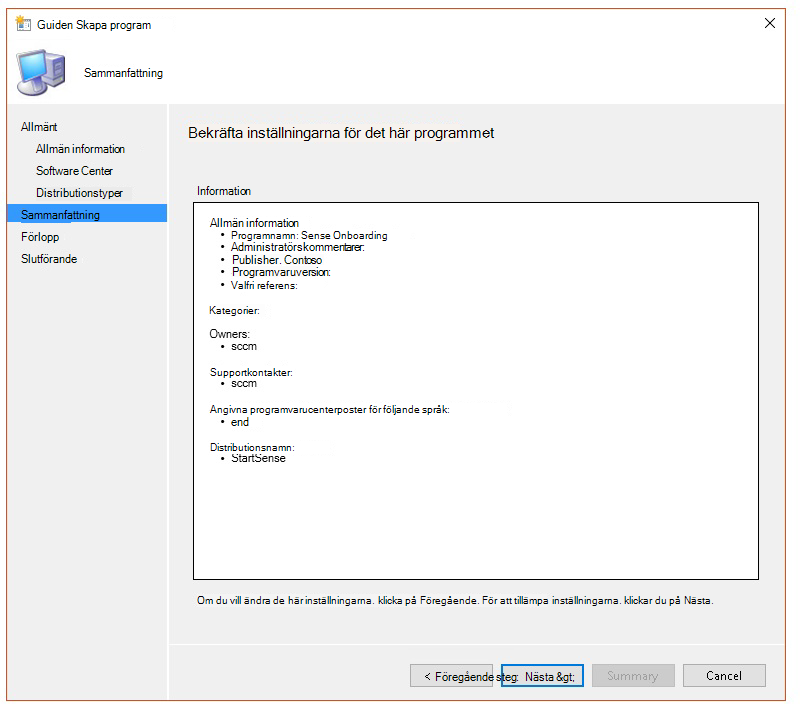

    <span data-ttu-id="f7a3b-436">Status visas sedan: Bild 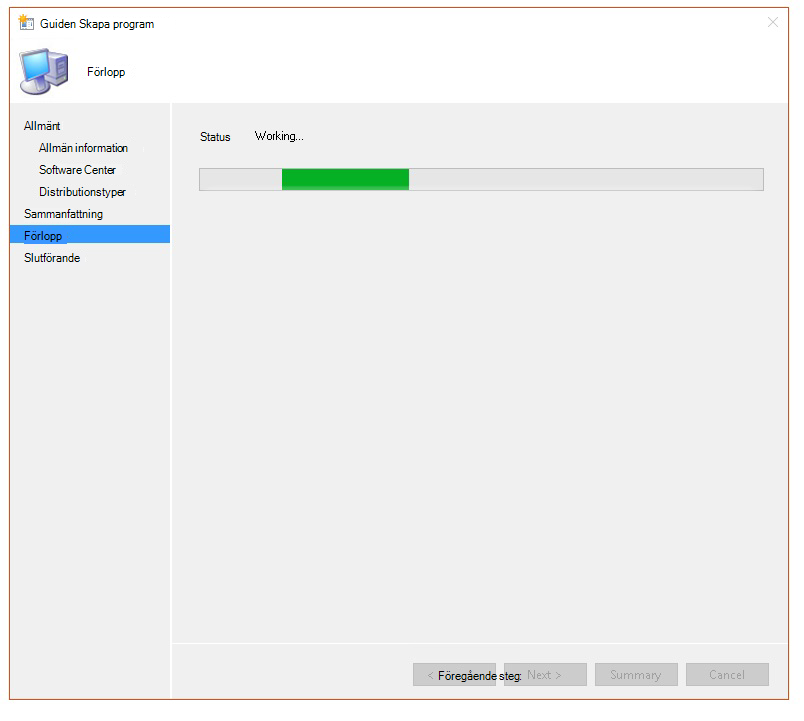</span><span class="sxs-lookup"><span data-stu-id="f7a3b-436">The status is then displayed: </span></span>

19. <span data-ttu-id="f7a3b-437">I **komplettering** väljer du **Stäng**.</span><span class="sxs-lookup"><span data-stu-id="f7a3b-437">In **Completion**, select **Close**.</span></span>

    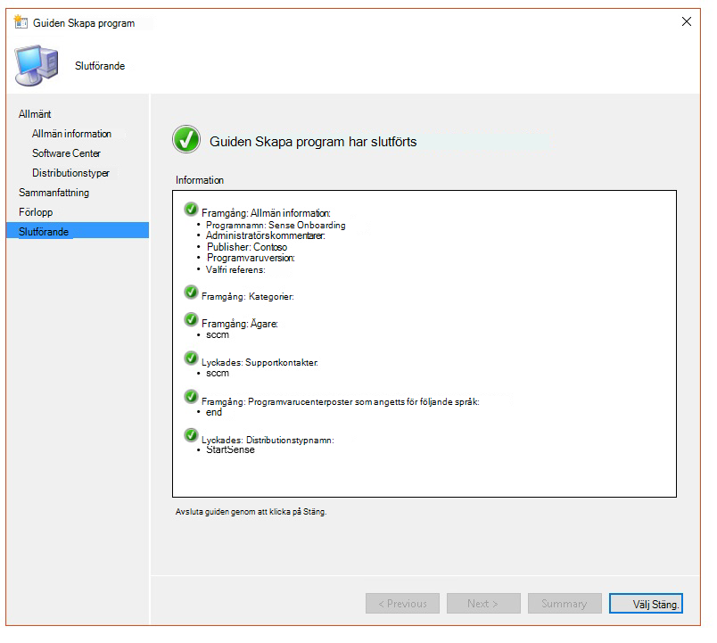

20. <span data-ttu-id="f7a3b-439">Nu kan du distribuera programmet genom att högerklicka på programmet och välja **Distribuera.**</span><span class="sxs-lookup"><span data-stu-id="f7a3b-439">You can now deploy the application by right-clicking the app and selecting **Deploy**.</span></span>

    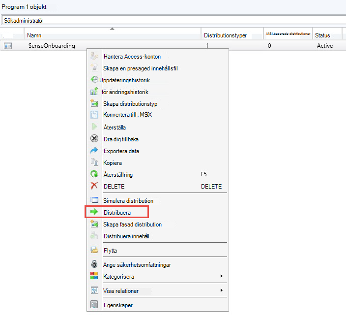

21. <span data-ttu-id="f7a3b-441">I **Allmänt** väljer **du Distribuera innehåll automatiskt för beroenden** och **Bläddra**.</span><span class="sxs-lookup"><span data-stu-id="f7a3b-441">In **General** select **Automatically distribute content for dependencies** and **Browse**.</span></span>

    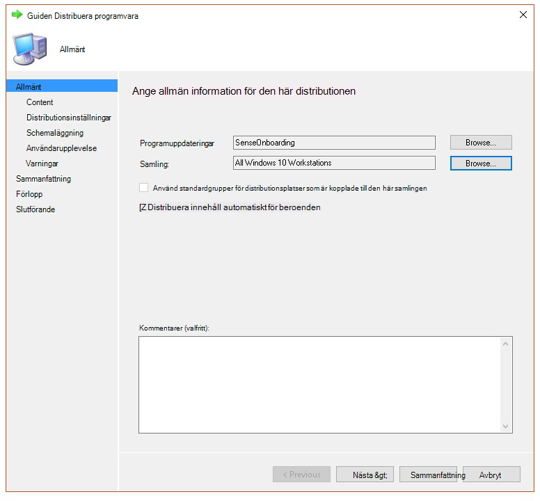

22. <span data-ttu-id="f7a3b-443">Välj **Nästa** i **Innehåll.**</span><span class="sxs-lookup"><span data-stu-id="f7a3b-443">In **Content** select **Next**.</span></span>

    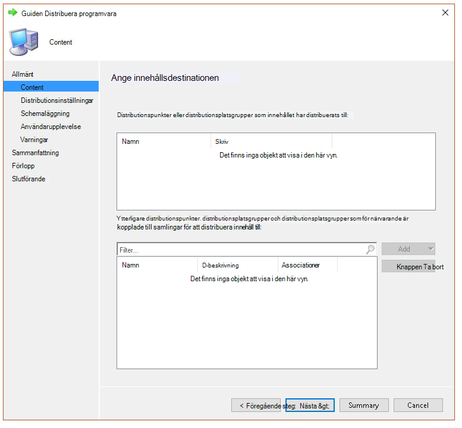

23. <span data-ttu-id="f7a3b-445">Välj **Nästa i** **Distributionsinställningar.**</span><span class="sxs-lookup"><span data-stu-id="f7a3b-445">In **Deployment settings**, select **Next**.</span></span>

    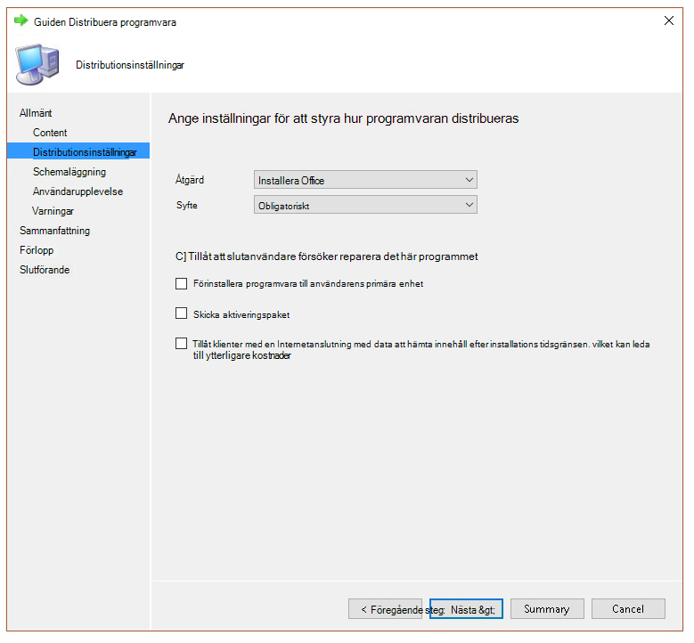

24. <span data-ttu-id="f7a3b-447">Välj **Så** **snart som möjligt efter den tillgängliga tiden i Schemaläggning** och välj sedan **Nästa.**</span><span class="sxs-lookup"><span data-stu-id="f7a3b-447">In **Scheduling** select **As soon as possible after the available time**, then select **Next**.</span></span>

    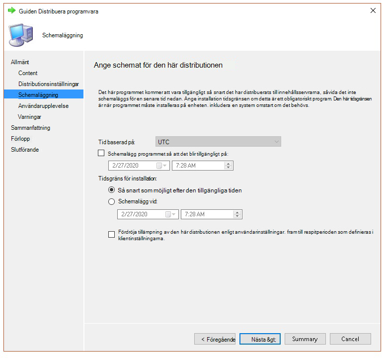

25. <span data-ttu-id="f7a3b-449">I **Användarupplevelse väljer** du **Spara ändringar vid tidsgräns eller under ett underhållsfönster (kräver omstarter)** och väljer sedan **Nästa.**</span><span class="sxs-lookup"><span data-stu-id="f7a3b-449">In **User experience**, select **Commit changes at deadline or during a maintenance window (requires restarts)**, then select **Next**.</span></span>

    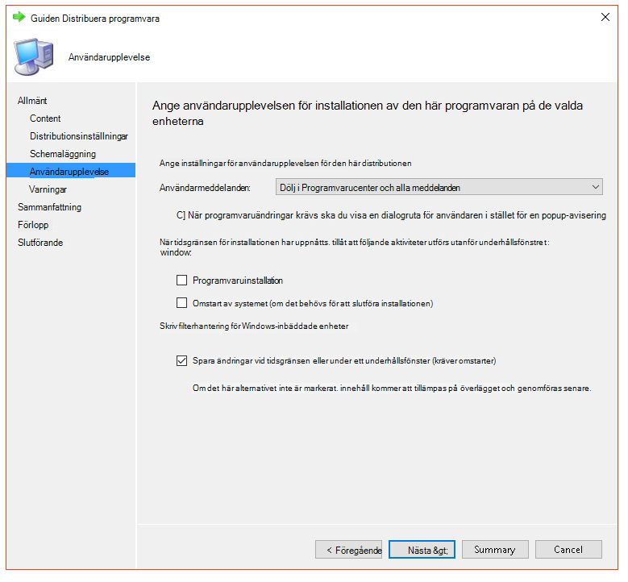

26. <span data-ttu-id="f7a3b-451">Välj **Nästa i** **Aviseringar.**</span><span class="sxs-lookup"><span data-stu-id="f7a3b-451">In **Alerts** select **Next**.</span></span>

    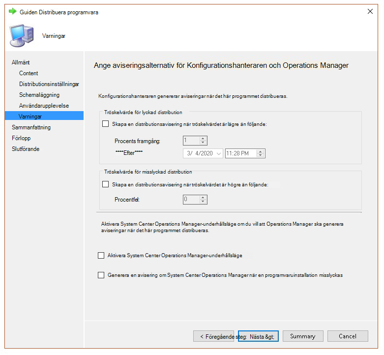

27. <span data-ttu-id="f7a3b-453">Välj **Nästa** i **Sammanfattning.**</span><span class="sxs-lookup"><span data-stu-id="f7a3b-453">In **Summary**, select **Next**.</span></span>

    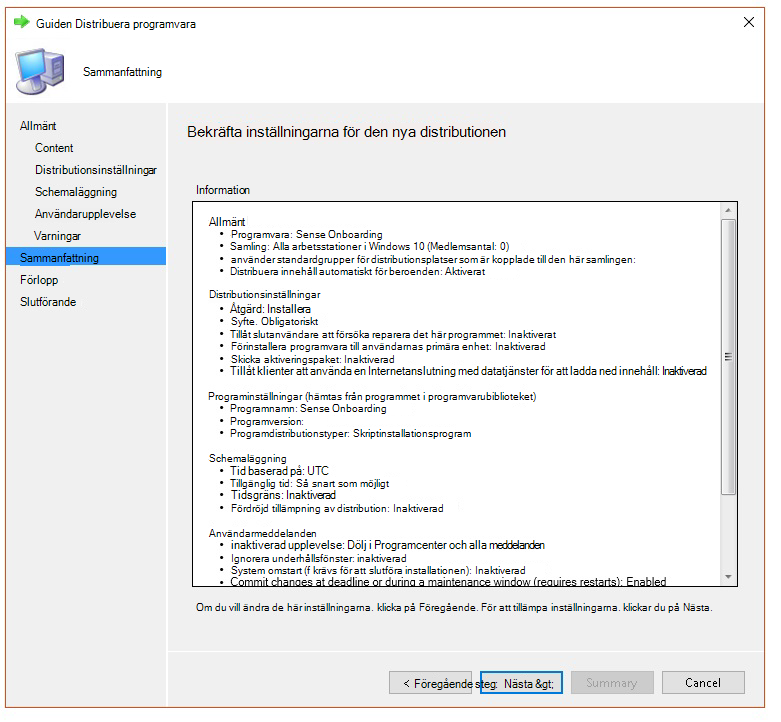

    <span data-ttu-id="f7a3b-455">Statusen visas sedan 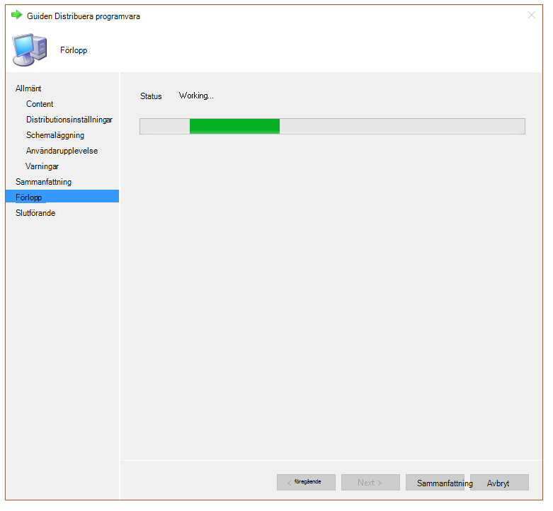</span><span class="sxs-lookup"><span data-stu-id="f7a3b-455">The status is then displayed </span></span>

28. <span data-ttu-id="f7a3b-456">I **komplettering** väljer du **Stäng**.</span><span class="sxs-lookup"><span data-stu-id="f7a3b-456">In **Completion**, select **Close**.</span></span>

    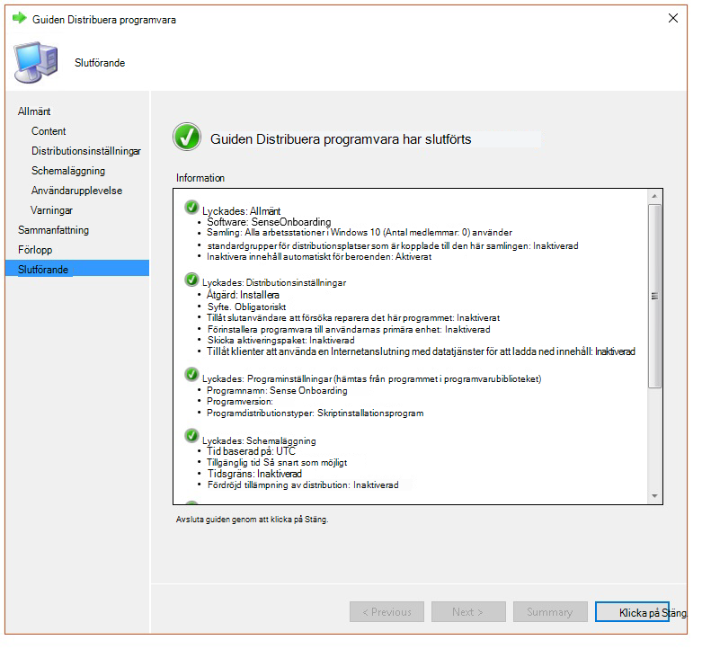


## <a name="related-topics"></a><span data-ttu-id="f7a3b-458">Relaterade ämnen</span><span class="sxs-lookup"><span data-stu-id="f7a3b-458">Related topics</span></span>

- [<span data-ttu-id="f7a3b-459">Felsöka Microsoft Defender för Endpoint</span><span class="sxs-lookup"><span data-stu-id="f7a3b-459">Troubleshoot Microsoft Defender for Endpoint</span></span>](troubleshoot-mdatp.md)
- [<span data-ttu-id="f7a3b-460">Onboard-enheter</span><span class="sxs-lookup"><span data-stu-id="f7a3b-460">Onboard devices</span></span>](onboard-configure.md)
- [<span data-ttu-id="f7a3b-461">Konfigurera enhetsproxy och internetanslutningsinställningar</span><span class="sxs-lookup"><span data-stu-id="f7a3b-461">Configure device proxy and Internet connectivity settings</span></span>](configure-proxy-internet.md)
