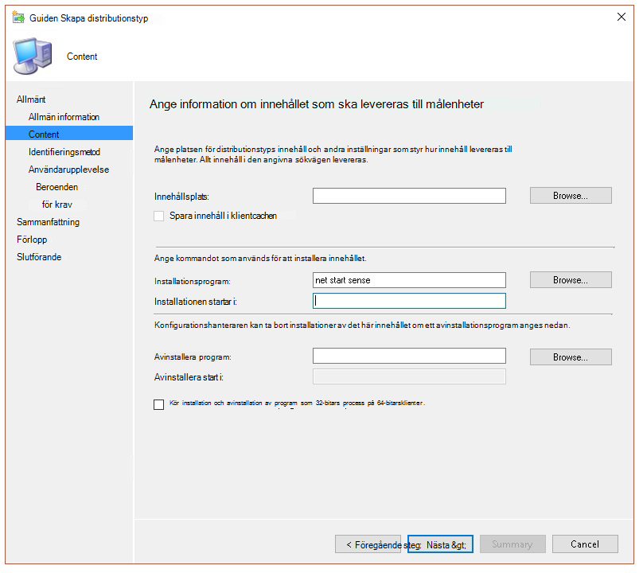

# <a name="troubleshoot-microsoft-defender-for-endpoint-onboarding-issues"></a>Felsöka problem med Introduktion till Slutpunkt för Microsoft Defender

[!INCLUDE [Microsoft 365 Defender rebranding](../../includes/microsoft-defender.md)]


**Gäller för:**

- [Microsoft Defender för Endpoint](https://go.microsoft.com/fwlink/?linkid=2154037)
- Windows Server 2012 R2
- Windows Server 2016
- [Microsoft 365 Defender](https://go.microsoft.com/fwlink/?linkid=2118804)

> Vill du använda Defender för Slutpunkt? [Registrera dig för en kostnadsfri utvärderingsversion.](https://www.microsoft.com/microsoft-365/windows/microsoft-defender-atp?ocid=docs-wdatp-pullalerts-abovefoldlink) 

Du kan behöva felsöka introduktionsprocessen för Microsoft Defender för slutpunkt om du stöter på problem.
På den här sidan finns detaljerad information om hur du felsöker onboarding-problem som kan uppstå vid distribution med ett av distributionsverktygen och vanliga fel som kan uppstå på enheterna.

## <a name="troubleshoot-issues-with-onboarding-tools"></a>Felsöka problem med onboarding-verktyg

Om du har slutfört onboarding-processen och inte [](investigate-machines.md) ser enheterna i listan Enheter efter en timme kan det indikera problem med onboarding eller anslutning.

### <a name="troubleshoot-onboarding-when-deploying-with-group-policy"></a>Felsöka registrering vid distribution med grupprincip

Distribution med grupprincip utförs genom att köra onboarding-skriptet på enheterna. Grupprincipkonsolen anger inte om distributionen har lyckats eller inte.

Om du har slutfört onboarding-processen och inte [](investigate-machines.md) ser enheterna i listan Enheter efter en timme kan du kontrollera utdata för skriptet på enheterna. Mer information finns i [Felsöka registrering när du distribuerar med ett skript.](#troubleshoot-onboarding-when-deploying-with-a-script)

Om skriptet slutförs korrekt går du [till Felsöka onboarding-problem på enheterna](#troubleshoot-onboarding-issues-on-the-device) för ytterligare fel som kan uppstå.

### <a name="troubleshoot-onboarding-issues-when-deploying-with-microsoft-endpoint-configuration-manager"></a>Felsöka onboarding-problem vid distribution med Konfigurationshanteraren för Microsoft Endpoint

När du onboarding-enheter med hjälp av följande versioner av Konfigurationshanteraren:

- Microsoft Endpoint Configuration Manager
- System Center 2012 Configuration Manager
- Konfigurationshanteraren för System Center 2012 R2

Distribution med de ovan nämnda versionerna av Konfigurationshanteraren utförs genom att köra onboarding-skriptet på enheterna. Du kan spåra distributionen i Konfigurationshanterarens konsol.

Om distributionen misslyckas kan du kontrollera utdata för skriptet på enheterna.

Om onboarding avslutades men enheterna inte visas  i listan Enheter efter en timme kan du gå till Felsöka [onboarding-problem](#troubleshoot-onboarding-issues-on-the-device) på enheten för ytterligare fel som kan uppstå.

### <a name="troubleshoot-onboarding-when-deploying-with-a-script"></a>Felsöka onboarding när du distribuerar med ett skript

**Kontrollera resultatet av skriptet på enheten:**

1. Klicka **på Start**, skriv **Loggboken** och tryck på **Retur.**

2. Gå till **programmet Windows-loggar.**  >  

3. Leta efter en händelse från **WDATPOnboarding-händelsekällan.**

Om skriptet misslyckas och händelsen är ett fel kan du kontrollera händelse-ID:t i följande tabell för att felsöka problemet.

> [!NOTE]
> Följande händelse-ID är endast specifika för onboarding-skriptet.

Händelse-ID | Feltyp | Lösningssteg
:---:|:---|:---
 `5` | Offboarding-data hittades men kunde inte tas bort | Kontrollera behörigheterna i registret, särskilt<br> `HKLM\SOFTWARE\Policies\Microsoft\Windows Advanced Threat Protection`.
`10` | Registreringsdata kunde inte skrivas till registret |  Kontrollera behörigheterna i registret, särskilt<br> `HKLM\SOFTWARE\Policies\Microsoft\Windows Advanced Threat Protection`.<br>Kontrollera att skriptet har körts som administratör.
`15` |  Det gick inte att starta SENSE-tjänsten |Kontrollera tjänstens hälsa `sc query sense` (kommando). Kontrollera att den inte är i ett mellanliggande tillstånd (*"Pending_Stopped",* *"Pending_Running"*) och försök att köra skriptet igen (med administratörsrättigheter). <br> <br> Om enheten kör Windows 10, version 1607 och kommandot körs, startar `sc query sense` `START_PENDING` du om enheten. Om problemet inte åtgärdas när du startar om enheten måste du uppgradera till KB4015217 och prova att komma igång igen.
`15` | Det gick inte att starta SENSE-tjänsten | Om felmeddelandet är: Systemfel 577 eller felet 1058 har uppstått måste du aktivera Microsoft Defender Antivirus ELAM-drivrutinen. Anvisningar finns i Se till att Microsoft Defender Antivirus inte är inaktiverat av en [princip.](#ensure-that-microsoft-defender-antivirus-is-not-disabled-by-a-policy)
`30` |  Skriptet kunde inte vänta på att tjänsten ska börja köras | Det kan ta längre tid att starta tjänsten eller så har det uppstått fel när den försöker starta. Mer information om händelser och fel relaterade till SENSE finns i [Granska händelser och fel med hjälp av Loggboken.](event-error-codes.md)
`35` |  Skriptet kunde inte hitta registerstatusvärdet för onboarding-status | När SENSE-tjänsten startas för första gången skriver den onboarding-status till registerplatsen<br>`HKLM\SOFTWARE\Microsoft\Windows Advanced Threat Protection\Status`.<br> Skriptet kunde inte hitta det efter flera sekunder. Du kan manuellt testa den och kontrollera om den finns där. Mer information om händelser och fel relaterade till SENSE finns i [Granska händelser och fel med hjälp av Loggboken.](event-error-codes.md)
`40` | SENSE-status för tjänst onboarding är inte inställd på **1** | SENSE-tjänsten har inte kunnat introduceras korrekt. Mer information om händelser och fel relaterade till SENSE finns i [Granska händelser och fel med hjälp av Loggboken.](event-error-codes.md)
`65` | Otillräckliga behörigheter| Kör skriptet igen med administratörsbehörighet.

### <a name="troubleshoot-onboarding-issues-using-microsoft-intune"></a>Felsöka onboarding-problem med Microsoft Intune

Du kan använda Microsoft Intune för att kontrollera felkoder och försöka felsöka orsaken till problemet.

Om du har konfigurerat principer i Intune och de inte sprids på enheter kan du behöva konfigurera automatisk MDM-registrering.

Använd följande tabeller för att förstå möjliga orsaker till problem vid registrering:

- Microsoft Intune-felkoder och OMA-URIs tabell
- Kända problem med icke-efterlevnadstabell
- Tabellen Händelseloggar för mobil enhetshantering (MDM)

Om ingen av händelseloggarna och felsökningsstegen  fungerar laddar du ned det lokala skriptet från avsnittet Enhetshantering i portalen och kör det i en upphöjd kommandotolk.

#### <a name="microsoft-intune-error-codes-and-oma-uris"></a>Microsoft Intune-felkoder och -OMA-URIs

Felkod Hex | Felkod dec | Felbeskrivning | OMA-URI | Möjliga orsaker och felsökningssteg
:---:|:---|:---|:---|:---
0x87D1FDE8 | -2016281112 | Åtgärd misslyckades | Introduktioner <br> Offboarding | **Möjlig orsak:** Onboarding eller offboarding misslyckades i fel blob: fel signatur eller saknar PreviousOrgIds-fält. <br><br> **Felsökningssteg:** <br> Kontrollera händelse-IDt i avsnittet Visa registrering av agent [i händelseloggen för](#view-agent-onboarding-errors-in-the-device-event-log) enheten. <br><br> Kontrollera MDM-händelseloggarna i följande tabell eller följ instruktionerna i [Diagnostisera MDM-fel i Windows 10.](https://docs.microsoft.com/windows/client-management/mdm/diagnose-mdm-failures-in-windows-10)
 | | | | Introduktioner <br> Offboarding <br> Exempelformning | **Möjlig orsak:** Registernyckeln Microsoft Defender för slutpunktsprincipen finns inte eller så har OMA DM-klienten inte behörighet att skriva till den. <br><br> **Felsökningssteg:** Kontrollera att följande registernyckel finns: `HKEY_LOCAL_MACHINE\SOFTWARE\Policies\Microsoft\Windows Advanced Threat Protection` <br> <br> Om det inte finns öppnar du ett upphöjd kommando och lägger till nyckeln.
 | | | | SenseIsRunning <br> OnboardingState <br> OrgId |  **Möjlig orsak:** Ett försök att åtgärda med egenskapen skrivskydd. Onboarding har misslyckats. <br><br> **Felsökningssteg:** Kontrollera felsökningsstegen [i Felsöka onboarding-problem på enheten.](#troubleshoot-onboarding-issues-on-the-device) <br><br> Kontrollera MDM-händelseloggarna i följande tabell eller följ instruktionerna i [Diagnostisera MDM-fel i Windows 10.](https://docs.microsoft.com/windows/client-management/mdm/diagnose-mdm-failures-in-windows-10)
 | | | | Alla | **Möjlig orsak:** Försök att distribuera Microsoft Defender för Endpoint på SKU/Platform som inte stöds, särskilt Holographic SKU. <br><br> Plattformar som stöds för närvarande:<br> Företag, utbildning och professional.<br> Servern stöds inte.
 0x87D101A9 | -2016345687 |SynkroniseraML(425): Det begärda kommandot misslyckades eftersom avsändaren inte har tillräcklig åtkomstkontrollbehörighet (ACL) för mottagaren. | Alla |  **Möjlig orsak:** Försök att distribuera Microsoft Defender för Endpoint på SKU/Platform som inte stöds, särskilt Holographic SKU.<br><br> Plattformar som stöds för närvarande:<br>  Företag, utbildning och professional.

#### <a name="known-issues-with-non-compliance"></a>Kända problem med icke-efterlevnad

Följande tabell innehåller information om problem med icke-efterlevnad och hur du kan åtgärda problemen.

Ärende | Symptom | Möjliga orsaker och felsökningssteg
:---:|:---|:---
 `1` | Enheten följer SenseIsRunning OMA-URI. Men är inte kompatibelt av OrgId, Onboarding och OnboardingState OMA-URI:er. | **Möjlig orsak:** Kontrollera att användaren har passerat OOBE efter Windows-installationen eller uppgraderingen. Under OOBE-onboarding kunde inte slutföras men SENSE körs redan.<br><br> **Felsökningssteg:** Vänta tills OOBE har slutförts.
 `2` |  Enheten följer OrgId, Onboarding och OnboardingState OMA-URI:er, men följer inte av SenseIsRunning OMA-URI. |  **Möjlig orsak:** Sense-tjänstens starttyp anges som "Fördröjd start". Ibland gör det här så att Microsoft Intune-servern rapporterar enheten som icke-kompatibel av SenseIsRunning när DM-sessionen startar på systemstarten. <br><br> **Felsökningssteg:** Problemet bör åtgärdas automatiskt inom 24 timmar.
 `3` | Enheten följer inte | **Felsökningssteg:** Se till att principer för onboarding och offboarding inte är distribuerade på samma enhet samtidigt.

#### <a name="mobile-device-management-mdm-event-logs"></a>Händelseloggar för hantering av mobil enhet (MDM)

Visa MDM-händelseloggar för att felsöka problem som kan uppstå under registrering:

Loggnamn: Microsoft\Windows\DeviceManagement-EnterpriseDiagnostics-Provider

Kanalnamn: Admin

ID | Allvarlighetsgrad | Händelsebeskrivning | Felsökningssteg
:---|:---|:---|:---
1819 | Fel | Microsoft Defender för slutpunkts-CSP: Det gick inte att ange nodens värde. NodeId: (%1), TokenName: (%2), Resultat: (%3). | Ladda ned [den kumulativa uppdateringen för Windows 10, 1607.](https://go.microsoft.com/fwlink/?linkid=829760)

## <a name="troubleshoot-onboarding-issues-on-the-device"></a>Felsöka onboarding-problem på enheten

Om de distributionsverktyg som används inte anger ett fel i onboarding-processen, men enheter fortfarande inte visas i listan över enheter på en timme, går du igenom följande verifieringsavsnitt för att kontrollera om ett fel uppstod med Microsoft Defender för slutpunktsagenten.

- [Visa onboarding-fel för agent i händelseloggen för enheten](#view-agent-onboarding-errors-in-the-device-event-log)
- [Kontrollera att diagnostikdatatjänsten är aktiverad](#ensure-the-diagnostics-service-is-enabled)
- [Kontrollera att tjänsten är inställd på att starta](#ensure-the-service-is-set-to-start)
- [Kontrollera att enheten har en Internetanslutning](#ensure-the-device-has-an-internet-connection)
- [Se till att Microsoft Defender Antivirus inte är inaktiverat av en princip](#ensure-that-microsoft-defender-antivirus-is-not-disabled-by-a-policy)

### <a name="view-agent-onboarding-errors-in-the-device-event-log"></a>Visa onboarding-fel för agent i händelseloggen för enheten

1. Klicka **på Start**, skriv **Loggboken** och tryck på **Retur.**

2. I fönstret **Loggboken (lokal)** expanderar du **Program- och tjänstloggar**  >  **Microsoft**  >  **Windows**  >  **SENSE.**

   > [!NOTE]
   > SENSE är det interna namn som används för att referera till den beteende sensor som driver Microsoft Defender för Endpoint.

3. Välj **Drift för** att läsa in loggen.

4. I **åtgärdsfönstret** klickar du på **Filtrera aktuell logg.**

5. På fliken **Filter** under **Händelsenivå: välj Kritisk** , **Varning** och  **Fel** och klicka på **OK.**

   

6. Händelser som kan indikera problem visas i **driftsfönstret.** Du kan försöka felsöka dem baserat på lösningarna i följande tabell:

Händelse-ID | Meddelande | Lösningssteg
:---:|:---|:---
 `5` | Microsoft Defender för slutpunktstjänsten kunde inte ansluta till servern med _variabeln_ | [Kontrollera att enheten har internetåtkomst.](#ensure-the-device-has-an-internet-connection)
 `6` | Microsoft Defender för Slutpunkt-tjänsten är inte onboarded och inga onboarding-parametrar hittades. Felkod: _variabel_ | [Kör onboarding-skriptet igen](configure-endpoints-script.md).
 `7` | Microsoft Defender för slutpunktstjänsten kunde inte läsa onboarding-parametrarna. Felkod: _variabel_ | [Kontrollera att enheten har internetanslutning](#ensure-the-device-has-an-internet-connection)och kör sedan hela onboarding-processen igen.
 `9` | Microsoft Defender för slutpunktstjänsten kunde inte ändra starttypen. Felkod: variabel | Om händelsen inträffade under onboarding startar du om och försöker köra onboarding-skriptet igen. Mer information finns i [Kör onboarding-skriptet igen.](configure-endpoints-script.md) <br><br>Kontakta support om händelsen inträffade vid offboarding.
`10` | Microsoft Defender för slutpunktstjänsten kunde inte spara informationen om introduktionen. Felkod: variabel | Om händelsen inträffade under onboarding försöker du igen med onboarding-skriptet. Mer information finns i [Kör onboarding-skriptet igen.](configure-endpoints-script.md) <br><br>Kontakta support om problemet kvarstår.
`15` | Microsoft Defender för Slutpunkt kan inte starta kommandokanalen med variabeln _URL:_ | [Kontrollera att enheten har internetåtkomst.](#ensure-the-device-has-an-internet-connection)
`17` | Microsoft Defender för slutpunktstjänsten kunde inte ändra plats för anslutna användarupplevelser och telemetritjänster. Felkod: variabel | [Kör onboarding-skriptet igen](configure-endpoints-script.md). Kontakta support om problemet kvarstår.
`25` | Microsoft Defender för Slutpunkt-tjänsten kunde inte återställa hälsostatus i registret. Felkod: _variabel_ | Kontakta supporten.
`27` | Det gick inte att aktivera Microsoft Defender för slutpunktsläge i Windows Defender. Onboarding-processen misslyckades. Felkod: variabel | Kontakta supporten.
`29` | Det gick inte att läsa parametrarna för offboarding. Feltyp: %1, Felkod: %2, Beskrivning: %3 | Kontrollera att enheten har internetanslutning och kör sedan hela offboardingprocessen igen.
`30` | Det gick inte att inaktivera läget $(build.sense.productDisplayName) i Microsoft Defender för Slutpunkt. Felkod: %1 | Kontakta supporten.
`32` | $(build.sense.productDisplayName)-tjänsten kunde inte begära att stoppas efter offboarding-processen. Felkod: %1 | Kontrollera att tjänstens starttyp är manuell och starta om enheten.
`55` | Det gick inte att skapa automatisk ETW-loggare för säker ETW. Felkod: %1 | Starta om enheten.
`63` | Uppdatera starttypen för extern tjänst. Namn: %1, verklig starttyp: %2, förväntad starttyp: %3, utgångskod: %4 | Identifiera vad som orsakar ändringarna i starttypen för den omnämnda tjänsten. Om utgångskoden inte är 0 korrigerar du starttypen manuellt till förväntad starttyp.
`64` | Starta den externa tjänsten som stoppas. Namn: %1, utgångskod: %2 | Kontakta support om händelsen fortsätter att visas.
`68` | Tjänstens starttyp är oväntad. Tjänstnamn: %1, verklig starttyp: %2, förväntad starttyp: %3 | Identifiera vad som orsakar ändringarna i starttypen. Åtgärda den omnämnda tjänstens starttyp.
`69` | Tjänsten stoppas. Tjänstnamn: %1 | Starta den omnämnda tjänsten. Kontakta support om detta kvarstår.

<br />

Det finns ytterligare komponenter på enheten som Microsoft Defender för slutpunktsagenten är beroende av för att fungera korrekt. Om det inte finns några onboarding-relaterade fel i microsoft Defender för slutpunktsagentens händelselogg går du vidare med följande steg för att säkerställa att de ytterligare komponenterna är konfigurerade på rätt sätt.

<span id="ensure-the-diagnostics-service-is-enabled" />

### <a name="ensure-the-diagnostic-data-service-is-enabled"></a>Kontrollera att diagnostikdatatjänsten är aktiverad

Om enheterna inte rapporterar korrekt kan du behöva kontrollera att Windows 10-diagnostikdatatjänsten är inställd på att startas automatiskt och körs på enheten. Tjänsten kan ha inaktiverats av andra program eller ändringar av användarkonfigurationen.

Kontrollera först att tjänsten är inställd på att starta automatiskt när Windows startar, därefter bör du kontrollera att tjänsten körs (och starta den om den inte är det).

### <a name="ensure-the-service-is-set-to-start"></a>Kontrollera att tjänsten är inställd på att starta

**Använd kommandoraden för att kontrollera starttypen för Windows 10-diagnostikdatatjänsten:**

1. Öppna en upphöjd kommandoradsfråga på enheten:

   a. Klicka **på Start**, skriv **cmd** och tryck på **Retur.**

   b. Högerklicka på **Kommandotolk** och välj **Kör som administratör.**

2. Ange följande kommando och tryck på **Retur:**

   ```text
   sc qc diagtrack
   ```

   Om tjänsten är aktiverad bör resultatet se ut som på följande skärmbild:

   

   Om `START_TYPE` den inte är `AUTO_START` inställd på måste du ange att tjänsten ska startas automatiskt.

**Använd kommandoraden för att ställa in Windows 10-diagnostikdatatjänsten så att den startas automatiskt:**

1. Öppna en upphöjd kommandoradsfråga på enheten:

   a. Klicka **på Start**, skriv **cmd** och tryck på **Retur.**

   b. Högerklicka på **Kommandotolk** och välj **Kör som administratör.**

2. Ange följande kommando och tryck på **Retur:**

   ```text
   sc config diagtrack start=auto
   ```

3. Ett meddelande om att det har lyckats visas. Verifiera ändringen genom att ange följande kommando och tryck på **Retur:**

   ```text
   sc qc diagtrack
   ```

4. Starta tjänsten.

   a. Skriv följande kommando i kommandotolken och tryck på **Retur:**

   ```text
   sc start diagtrack
   ```

### <a name="ensure-the-device-has-an-internet-connection"></a>Kontrollera att enheten har en Internetanslutning

Windows Defender ATP-sensorn kräver Microsoft Windows HTTP (WinHTTP) för att rapportera sensordata och kommunicera med Microsoft Defender för slutpunktstjänsten.

WinHTTP är oberoende av proxyinställningar för surfning och andra användarkontextprogram och måste kunna identifiera de proxyservrar som är tillgängliga i just din miljö.

Om du vill säkerställa att sensorn har tjänstanslutning följer du stegen som beskrivs i avsnittet Verifiera klientanslutningen till Microsoft Defender för [slutpunktstjänstens URL-adresser.](configure-proxy-internet.md#verify-client-connectivity-to-microsoft-defender-atp-service-urls)

Om verifieringen misslyckas och miljön använder en proxyserver för att ansluta till Internet följer du stegen som beskrivs i Konfigurera proxy- och [Internetanslutningsinställningar.](configure-proxy-internet.md)

### <a name="ensure-that-microsoft-defender-antivirus-is-not-disabled-by-a-policy"></a>Se till att Microsoft Defender Antivirus inte är inaktiverat av en princip

> [!IMPORTANT]
> Följande gäller endast enheter  som ännu inte har fått uppdateringen augusti 2020 (version 4.18.2007.8) till Microsoft Defender Antivirus.
>
> Uppdateringen säkerställer att Microsoft Defender Antivirus inte kan stängas av på klientenheter via systemprincipen.

**Problem:** Microsoft Defender för slutpunktstjänsten startar inte efter introduktionen.

**Symptom:** Onboarding har slutförts, men du ser felet 577 eller felet 1058 när du försöker starta tjänsten.

**Lösning:** Om dina enheter kör en tredjepartsklient för program mot skadlig programvara måste drivrutinen Early Launch Antimalware (ELAM) aktiveras av Microsoft Defender för slutpunktsagenten. Du måste se till att det inte är inaktiverat av en systemprincip.

- Beroende på vilket verktyg du använder för att implementera principer måste du kontrollera att följande Windows Defender-principer är avmarkerade:

  - DisableAntiSpyware
  - DisableAntiVirus

  I grupprinciper ska det till exempel inte finnas några poster som följande värden:

  - `<Key Path="SOFTWARE\Policies\Microsoft\Windows Defender"><KeyValue Value="0" ValueKind="DWord" Name="DisableAntiSpyware"/></Key>`
  - `<Key Path="SOFTWARE\Policies\Microsoft\Windows Defender"><KeyValue Value="0" ValueKind="DWord" Name="DisableAntiVirus"/></Key>`

> [!IMPORTANT]
> Inställningen har utgått och ignoreras på alla klientenheter från och med augusti `disableAntiSpyware` 2020 (version 4.18.2007.8) av Microsoft Defender Antivirus.

- När du har rensat principen kör du introduktionsstegen igen.

- Du kan också kontrollera tidigare registernyckelvärden för att verifiera att principen är inaktiverad genom att öppna registernyckeln `HKEY_LOCAL_MACHINE\SOFTWARE\Policies\Microsoft\Windows Defender` .

    

   > [!NOTE]
   > Alla Windows Defender-tjänster (wdboot, wdfilter, wdnisdrv, wdnissvc och windefend) ska vara i standardläge. Det går inte att ändra starten av dessa tjänster och kan tvinga dig att animera systemet.
   >
   > Exempel på standardkonfigurationer för WdBoot och WdFilter:
   > - `<Key Path="SYSTEM\CurrentControlSet\Services\WdBoot"><KeyValue Value="0" ValueKind="DWord" Name="Start"/></Key>`
   > - `<Key Path="SYSTEM\CurrentControlSet\Services\WdFilter"><KeyValue Value="0" ValueKind="DWord" Name="Start"/></Key>`

## <a name="troubleshoot-onboarding-issues-on-a-server"></a>Felsöka onboarding-problem på en server

Om du stöter på problem vid registrering av en server går du igenom följande verifieringssteg för att åtgärda möjliga problem.

- [Kontrollera att Microsoft Monitoring Agent (MMA) är installerat och konfigurerat för att rapportera sensordata till tjänsten](configure-server-endpoints.md#server-mma)
- [Kontrollera att serverproxyn och internetanslutningsinställningarna är korrekt konfigurerade](configure-server-endpoints.md#server-proxy)

Du kan också behöva kontrollera följande:

- Kontrollera att microsoft Defender för slutpunktstjänsten körs på fliken **Processer** i **Aktivitetshanteraren.** Till exempel:

    

- Kontrollera **åtgärdshanteraren**  >  **för program- och tjänstloggar** i  >   Loggboken för att se om det finns några fel.

- Kontrollera **om** Microsofts **övervakningsagent körs** på servern i Tjänster. Ett exempel:

    

- I **Microsoft Monitoring Agent** Azure Log Analytics  >  **(OMS)** kontrollerar du arbetsytorna och kontrollerar att statusen är igång.

    

- Kontrollera att enheter visas i listan **Enheter i** portalen.

## <a name="confirming-onboarding-of-newly-built-devices"></a>Bekräfta registrering av nyligen skapade enheter

Det kan finnas instanser när onboarding distribueras på en ny enhet men inte slutförd.

Anvisningarna nedan ger vägledning för följande scenario:

- Onboarding-paket har distribuerats till nya enheter
- Sensorn startar inte eftersom den inbe-upplevelsen (OOBE) eller första användarens inloggning inte har slutförts
- Enheten stängs av eller startas om innan slutanvändaren loggar in första gången
- I det här scenariot startar INTE SENSE-tjänsten automatiskt även om onboarding-paketet har distribuerats

> [!NOTE]
> Följande steg är bara relevanta när du använder Konfigurationshanteraren för Microsoft Endpoint. Mer information om onboarding med Hjälp av Microsoft Endpoint Configuration Manager finns i [Microsoft Defender för Slutpunkt](https://docs.microsoft.com/mem/configmgr/protect/deploy-use/windows-defender-advanced-threat-protection).

1. Skapa ett program i Konfigurationshanteraren för Microsoft Endpoint.

    

2. Välj **Ange programinformationen manuellt.**

    

3. Ange information om programmet och välj sedan **Nästa**.

    

4. Ange information om programvarucentret och välj **nästa**.

    

5. Välj **Lägg till i** **Distributionstyper.**

    

6. Välj **Ange information om distributionstyp manuellt** och välj sedan **Nästa.**

    

7. Ange information om distributionstyp och välj sedan **Nästa.**

    

8. I **programmet**  >  **för innehållsinstallation** anger du kommandot: `net start sense` .

    

9. I **Identifieringsmetod** väljer du **Konfigurera regler för att identifiera närvaro av den här distributionstypen** och väljer sedan Lägg **till sats.**

    

10. Ange följande information om identifieringsregeln och välj sedan **OK:**

    

11. Välj Nästa i **Identifieringsmetod.** 

    

12. I **Användarupplevelse** anger du följande information och väljer sedan **Nästa:**

    

13. Välj **Nästa** i **Krav.**

    

14. I **Beroenden väljer** du **Nästa.**

    

15. Välj **Nästa** i **Sammanfattning.**

    

16. I **komplettering** väljer du **Stäng**.

    

17. I **Distributionstyper** väljer du **Nästa.**

    

18. Välj **Nästa** i **Sammanfattning.**

    

    Status visas sedan: Bild på 

19. I **komplettering** väljer du **Stäng**.

    

20. Nu kan du distribuera programmet genom att högerklicka på programmet och välja **Distribuera.**

    

21. I **Allmänt** väljer **du Distribuera innehåll automatiskt för beroenden** och **Bläddra**.

    

22. Välj **Nästa** i **Innehåll.**

    

23. Välj **Nästa i** **Distributionsinställningar.**

    

24. Välj **Så** **snart som möjligt efter den tillgängliga tiden i Schemaläggning** och välj sedan **Nästa.**

    

25. I **Användarupplevelse väljer** du **Spara ändringar vid tidsgräns eller under ett underhållsfönster (kräver omstarter)** och väljer sedan **Nästa.**

    

26. Välj **Nästa i** **Aviseringar.**

    

27. Välj **Nästa** i **Sammanfattning.**

    

    Statusen visas sedan Bild 

28. I **komplettering** väljer du **Stäng**.

    


## <a name="related-topics"></a>Relaterade ämnen

- [Felsöka Microsoft Defender för Endpoint](troubleshoot-mdatp.md)
- [Onboard-enheter](onboard-configure.md)
- [Konfigurera enhetsproxy och internetanslutningsinställningar](configure-proxy-internet.md)
