# <a name="troubleshoot-performance-issues-related-to-real-time-protection"></a>Felsöka prestandaproblem relaterade till realtidsskydd


[!INCLUDE [Microsoft 365 Defender rebranding](../../includes/microsoft-defender.md)]


**Gäller för:**

- [Microsoft Defender för Endpoint](https://go.microsoft.com/fwlink/p/?linkid=2146631)
 
Om ditt system har problem med hög CPU-användning eller prestanda relaterade till realtidsskyddstjänsten i Microsoft Defender för Endpoint kan du skicka ett ärende till Microsoft Support. Följ stegen i Samla in [diagnostikdata för Microsoft Defender Antivirus.](collect-diagnostic-data.md)

Som administratör kan du också felsöka dessa problem på egen hand. 

Först kanske du vill kontrollera om problemet orsakas av en annan programvara. Läs [Kontrollera med leverantörs-undantag för antivirus](#check-with-vendor-for-antivirus-exclusions).

Annars kan du identifiera vilken programvara som är relaterad till det identifierade prestandaproblemet genom att följa stegen i [Analysera Microsoft Protection-loggen.](#analyze-the-microsoft-protection-log) 

Du kan också skicka ytterligare loggar till din inskickade information till Microsoft genom att följa stegen i:
- [Registrera processloggar med processövervakning](#capture-process-logs-using-process-monitor)
- [Spara prestandaloggar med Windows Performance Recorder](#capture-performance-logs-using-windows-performance-recorder) 

## <a name="check-with-vendor-for-antivirus-exclusions"></a>Kontrollera med leverantörer om undantag för antivirus

Om du enkelt kan identifiera den programvara som påverkar systemprestanda går du till programvaruleverantörens kunskapsbas eller supportcenter. Sök om de har rekommendationer om undantag för antivirus. Om leverantörens webbplats inte har dem kan du öppna ett support ärende tillsammans med dem och be dem publicera ett. 

Vi rekommenderar att programvaruleverantörer följer de olika riktlinjerna i [att samarbeta med branschen för att minimera falska positiva resultat.](https://www.microsoft.com/security/blog/2018/08/16/partnering-with-the-industry-to-minimize-false-positives/) Leverantören kan skicka in sin programvara via [Microsoft Defender Security Intelligence-portalen (MDSI).](https://www.microsoft.com/wdsi/filesubmission?persona=SoftwareDeveloper)


## <a name="analyze-the-microsoft-protection-log"></a>Analysera Microsoft Protection-loggen

I **MPLog-xxxxxxxx-xxxxxx.log** kan du hitta information om beräknad prestandaeffekter av att köra programvara som *Uppskattat Antal:*
    
`Per-process counts:ProcessImageName: smsswd.exe, TotalTime: 6597, Count: 1406, MaxTime: 609, MaxTimeFile: \Device\HarddiskVolume3\_SMSTaskSequence\Packages\WQ1008E9\Files\FramePkg.exe, EstimatedImpact: 65%`

| Fältnamn | Beskrivning |
|---|---|
|ProcessImageName | Namn på processbild |
| TotalTime | Den kumulativa varaktigheten i millisekunder som spenderas i genomsökningar av filer som används i den här processen |
|Antal | Antalet genomsökta filer som används i den här processen |
|MaxTime |  Varaktigheten i millisekunder vid den längsta enskilda genomsökningen av en fil som används av den här processen |
| MaxTimeFile | Sökvägen till filen som används i den här processen för vilken den längsta genomsökningen `MaxTime` registrerades |
| EstimatedImpact | Hur lång tid i procent som använts i genomsökningar för filer som använts i den här processen under den period då den här processen gick igenom |

Om prestandan är hög kan du prova att lägga till processen i undantag för sökväg/process genom att följa stegen i Konfigurera och validera undantag för [genomsökningar för Microsoft Defender Antivirus.](collect-diagnostic-data.md)

Om det föregående steget inte löser problemet kan du samla in mer information via [processövervakningen](#capture-process-logs-using-process-monitor) eller [Med](#capture-performance-logs-using-windows-performance-recorder) prestandainspelaren i följande avsnitt.
     
## <a name="capture-process-logs-using-process-monitor"></a>Registrera processloggar med processövervakning

Processövervakning (ProcMon) är ett avancerat övervakningsverktyg som kan visa realtidsprocesser. Du kan använda detta för att registrera prestandaproblemet medan det inträffar.

1. Ladda [ned Processövervakning v3.60](/sysinternals/downloads/procmon) till en mapp som `C:\temp` .

2. Så här tar du bort filens markering på webben:
    1. Högerklicka på **ProcessMonitor.zip** välj **Egenskaper**.
    1. Leta *efter Säkerhet* på fliken *Allmänt.*
    1. Markera rutan bredvid **Avblockera**.
    1. Välj **Använd**.
    
     

3. Packa upp filen så `C:\temp` att mappsökvägen blir `C:\temp\ProcessMonitor` . 

4. Kopiera **ProcMon.exe**  till Windows-klienten eller Windows-servern som du felsöker.  

5. Innan du kör ProcMon ska du se till att alla andra program som inte är relaterade till problemet med hög CPU-användning är stängda. Då minimeras antalet processer som ska kontrolleras.

6. Du kan starta ProcMon på två sätt.
    1. Högerklicka på **ProcMon.exe** välj **Kör som administratör.** 
    

        Eftersom loggning startar automatiskt väljer du förstoringsglaset för att stoppa den aktuella inspelningen eller använder kortkommandot **Ctrl+E.**
 
        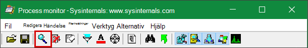

        Kontrollera att bilden stoppats genom att kontrollera om förstoringsglasikonen nu visas med ett rött kryss.

        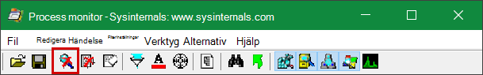         

        Välj radergummiikonen för att rensa den tidigare bildinspelningen.

        

        Eller använd kortkommandot **Ctrl+X.**

    2. Det andra sättet är att köra **kommandoraden som** administratör och sedan köra följande från sökvägen till Processövervakaren:

        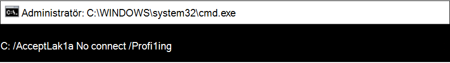
 
        ```console
        Procmon.exe /AcceptEula /Noconnect /Profiling
        ```
        
        >[!TIP] 
        >Gör ProcMon-fönstret så litet som möjligt när du samlar in data så att du enkelt kan starta och stoppa spårningen.
        > 
        >
    
7. När du har följt en av procedurerna i steg 6 visas sedan ett alternativ för att ange filter. Välj **OK**. Du kan alltid filtrera resultatet när insinspelningen är klar.
 
    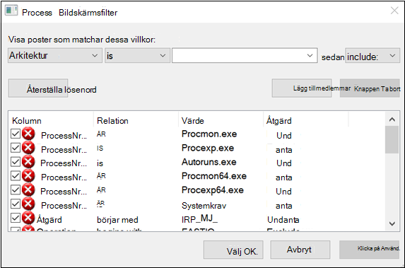 

8. Välj förstoringsglaset igen för att starta inspelningsinspelningen.
     
9. Återskapa problemet.
 
    >[!TIP] 
    >Vänta tills problemet återskapas helt och notera tidsstämpeln när spårningen startade.

10. När du har två till fyra minuters processaktivitet under villkoret om hög CPU-användning stoppar du hämtningen genom att välja förstoringsglasikonen.

11. Om du vill spara en inspelning med ett unikt namn och med .pml-formatet väljer du **Arkiv** och sedan **Spara...**. Se till att välja alternativknapparna **Alla händelser och** **PML (Native Process Monitor Format).**

    

12. För bättre spårning kan du ändra standardsökvägen från `C:\temp\ProcessMonitor\LogFile.PML` till `C:\temp\ProcessMonitor\%ComputerName%_LogFile_MMDDYEAR_Repro_of_issue.PML` där:
    - `%ComputerName%` är enhetens namn
    - `MMDDYEAR` är månad, dag och år
    -  `Repro_of_issue` är namnet på problemet som du försöker återskapa

    >[!TIP] 
    > Om du har ett fungerande system kanske du vill ha en exempellogg att jämföra.

13. Zippa .pml-filen och skicka den till Microsoft Support.


## <a name="capture-performance-logs-using-windows-performance-recorder"></a>Spara prestandaloggar med Windows Performance Recorder

Du kan använda Windows Performance Recorder (WPR) för att inkludera ytterligare information i din inskicking till Microsofts support. WPR är ett kraftfullt inspelningsverktyg som skapar händelsespårning för Windows-inspelningar. 

WPR är en del av Windows Assessment and Deployment Kit (Windows ADK) och kan laddas ned från Ladda ned och [installera Windows ADK.](/windows-hardware/get-started/adk-install) Du kan också ladda ned den som en del av Windows 10 Software Development Kit i [Windows 10 SDK.](https://developer.microsoft.com/windows/downloads/windows-10-sdk/)

Du kan använda WPR-användargränssnittet genom att följa stegen i Spara [prestandaloggar med hjälp av WPR-användargränssnittet.](#capture-performance-logs-using-the-wpr-ui) 

Du kan också använda kommandoradsverktyget *wpr.exe* som finns i Windows 8 och senare versioner genom att följa stegen i Hämta prestandaloggar med HJÄLP av [WPR CLI.](#capture-performance-logs-using-the-wpr-cli)


### <a name="capture-performance-logs-using-the-wpr-ui"></a>Registrera prestandaloggar med hjälp av WPR-användargränssnittet

>[!TIP]
>Om du har flera enheter där problemet inträffar bör du använda den som har mest RAM-minne.

1. Ladda ned och installera WPR.

2. Högerklicka på Windows Performance Recorder under *Windows Kits.*  

    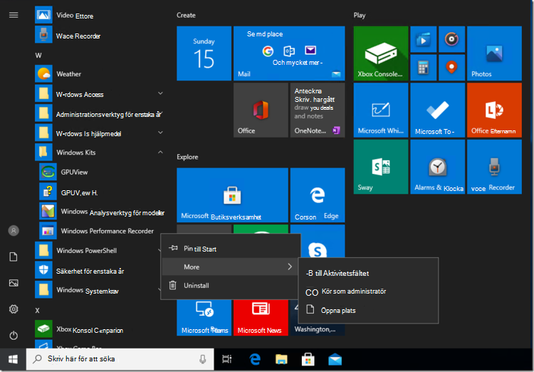

    Välj **Mer**. Välj **Kör som administratör**.

3. När dialogrutan User Account Control visas väljer du **Ja.**

    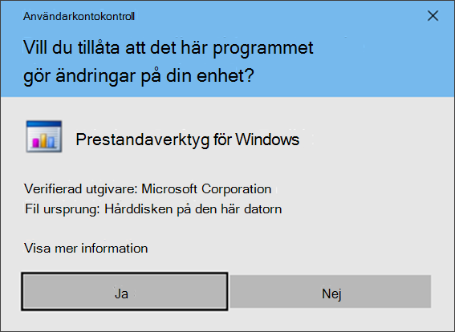

4. Ladda sedan ned [Microsoft Defender för slutpunktsanalysprofilen](https://github.com/YongRhee-MDE/Scripts/blob/master/MDAV.wprp) och spara `WD.wprp` den i en mapp som `C:\temp` . 
     
5. I dialogrutan WPR väljer du **Fler alternativ**.

    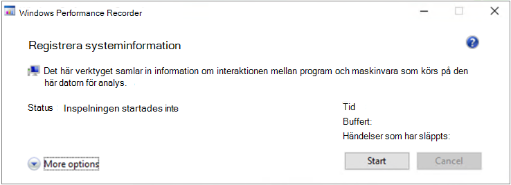

6. Välj **Lägg till profiler...** och bläddra till sökvägen till `WD.wprp` filen.

7. Därefter bör du se en ny profiluppsättning under Anpassade mått med namnet *Microsoft Defender för slutpunktsanalys* under det. 

    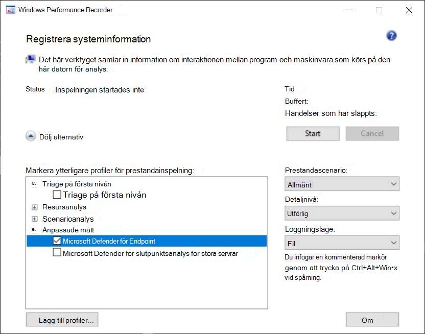

    >[!WARNING]
    >Om Windows Server har 64 GB RAM-minne eller mer kan du använda det anpassade måttet `Microsoft Defender for Endpoint analysis for large servers` i stället för `Microsoft Defender for Endpoint analysis` . I annat fall kan det ta upp ett stort antal icke-sidbaserade poolminnen eller buffertar som kan leda till systeminstabilitet. Du kan välja vilka profiler du vill lägga till genom att expandera **Resursanalys.** Den här anpassade profilen ger den kontext som krävs för djupgående prestandaanalys.
 
8. Så här använder du den anpassade måttet Microsoft Defender för slutpunktsanalysprofilen för utförlig analys i WPR-användargränssnittet:

    1. Se till att inga profiler väljs under *grupperna För förstanivådetriering,* *resursanalys* *och scenarioanalys.*
    2. Välj **Anpassade mått**.
    3. Välj **Microsoft Defender för Slutpunktsanalys**.
    4. Välj **Utförlig** under *Detaljnivå.*
    1. Välj **Arkiv** eller **Minne** under Loggningsläge. 

    >[!important]
    >Välj Arkiv *om* du vill använda filloggningsläget om prestandaproblemet kan återskapas direkt av användaren. De flesta problem faller under den här kategorin. Men om användaren inte kan återskapa problemet direkt, men enkelt märker det  när problemet uppstår, bör användaren välja Minne för att använda minnesloggningsläget. Det här säkerställer att spårningsloggen inte fylls upp för mycket på grund av den långa körningen.

9. Nu är du redo att samla in data. Avsluta alla program som inte är relevanta för att återge prestandaproblemet. Du kan välja **Dölj alternativ** för att inte utrymmet upptas av WPR-fönstret.

    

    >[!TIP]
    >Prova att starta spårningen med helt nummer sekunder. Till exempel 01:30:00. Det gör det enklare att analysera data. Försök också att hålla reda på tidsstämpeln exakt när problemet återskapas.

10. Välj **Start**.

    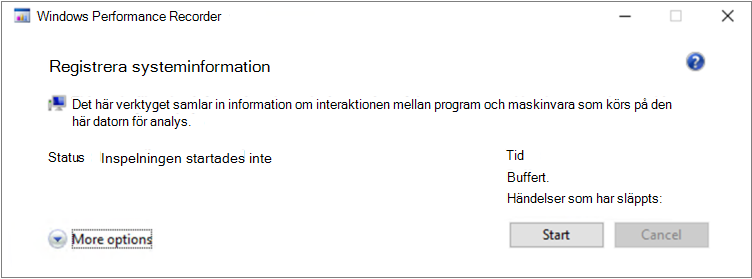

11. Återskapa problemet.

    >[!TIP]
    >Se till att datainsamlingen inte är längre än fem minuter. Två till tre minuter är ett bra intervall eftersom stora data samlas in.

12. Välj **Spara**.

    

13. Fyll i **Typ i en detaljerad beskrivning av problemet:** med information om problemet och hur du återskapade problemet.

    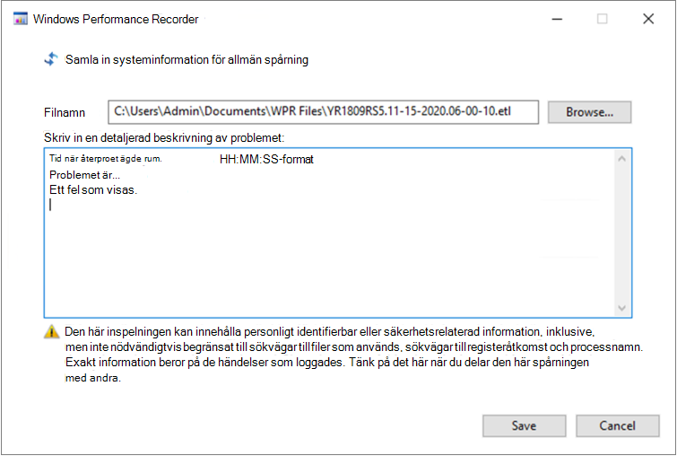

    1. Välj **Filnamn: för** att avgöra var spårningsfilen ska sparas. Som standard sparas 1.is till `%user%\Documents\WPR Files\` .
    1. Välj **Spara**.

14. Vänta medan spårningen sammanfogas.

    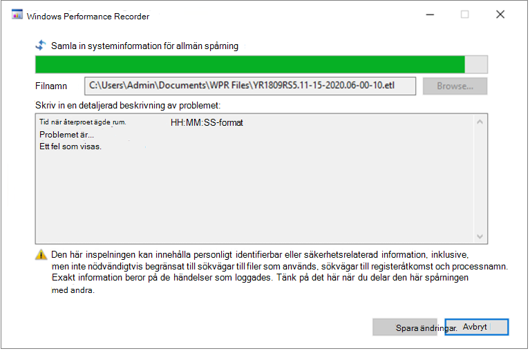

15. När spårningen har sparats väljer du **Öppna mapp**.

    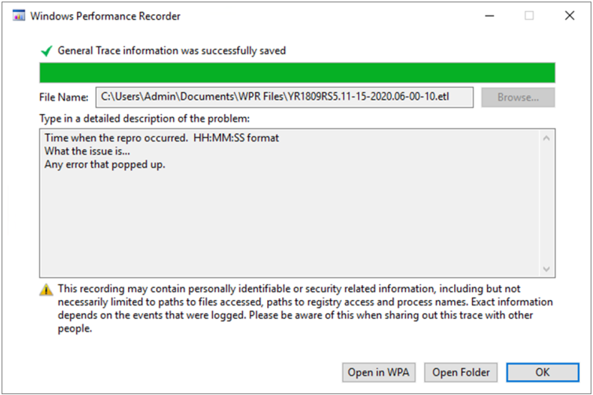

    Inkludera både filen och mappen i din inskickade fil till Microsoft support.

    

### <a name="capture-performance-logs-using-the-wpr-cli"></a>Registrera prestandaloggar med WPR CLI

Kommandoradsverktyget är *wpr.exe* en del av operativsystemet med början i Windows 8. Om du vill samla in en WPR-spårning med kommandoradsverktyget wpr.exe:

1. Ladda **[ned Microsoft Defender för slutpunktsanalysprofilen](https://github.com/YongRhee-MDE/Scripts/blob/master/MDAV.wprp)** för prestandaspårningar till en fil som `WD.wprp` namnges i en lokal katalog, till exempel `C:\traces` .

3. Högerklicka på **Start-menyikonen** och välj **Windows PowerShell (administratör)** eller **Kommandotolken (administratör)** för att öppna kommandotolken för administratör.

4. När dialogrutan User Account Control visas väljer du **Ja.**

5. Vid upphöjd uppmaning kör du följande kommando för att starta en Microsoft Defender för slutpunktsprestandaspårning:

    ```console
    wpr.exe -start C:\traces\WD.wprp!WD.Verbose -filemode
    ```
    
    >[!WARNING]
    >Om Windows Server har 64 GB eller RAM-minne eller mer kan du använda profiler och i stället för `WDForLargeServers.Light` `WDForLargeServers.Verbose` profiler `WD.Light` `WD.Verbose` respektive. I annat fall kan det ta upp ett stort antal icke-sidbaserade poolminnen eller buffertar som kan leda till systeminstabilitet.

6. Återskapa problemet.

    >[!TIP]
    >Se till att datainsamlingen inte är längre än fem minuter.  Beroende på scenariot är två till tre minuter ett bra intervall eftersom stora data samlas in.

7. Vid upphöjd uppmaning kör du följande kommando för att stoppa prestandaspårningen och anger information om problemet och hur du återskapar problemet:

    ```console
    wpr.exe -stop merged.etl "Timestamp when the issue was reproduced, in HH:MM:SS format" "Description of the issue" "Any error that popped up"
    ```

8. Vänta tills spårningen har kopplats. 

9. Inkludera både filen och mappen i din inskickade fil till Microsoft support.

## <a name="see-also"></a>Se även

- [Samla in diagnostikdata för Microsoft Defender Antivirus](collect-diagnostic-data.md)
- [Konfigurera och validera undantag för genomsökningar för Microsoft Defender Antivirus](configure-exclusions-microsoft-defender-antivirus.md)
