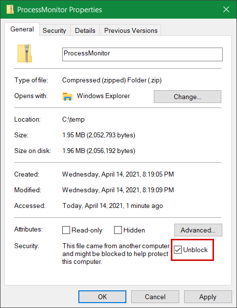
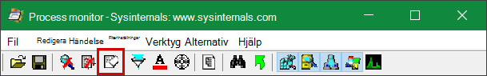
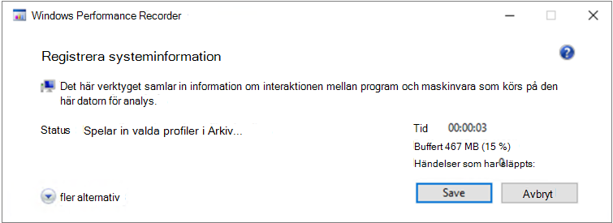

# <a name="troubleshoot-performance-issues-related-to-real-time-protection"></a><span data-ttu-id="ce4cb-104">Felsöka prestandaproblem relaterade till realtidsskydd</span><span class="sxs-lookup"><span data-stu-id="ce4cb-104">Troubleshoot performance issues related to real-time protection</span></span>


[!INCLUDE [Microsoft 365 Defender rebranding](../../includes/microsoft-defender.md)]


<span data-ttu-id="ce4cb-105">**Gäller för:**</span><span class="sxs-lookup"><span data-stu-id="ce4cb-105">**Applies to:**</span></span>

- [<span data-ttu-id="ce4cb-106">Microsoft Defender för Endpoint</span><span class="sxs-lookup"><span data-stu-id="ce4cb-106">Microsoft Defender for Endpoint</span></span>](https://go.microsoft.com/fwlink/p/?linkid=2146631)
 
<span data-ttu-id="ce4cb-107">Om ditt system har problem med hög CPU-användning eller prestanda relaterade till realtidsskyddstjänsten i Microsoft Defender för Endpoint kan du skicka ett ärende till Microsoft Support.</span><span class="sxs-lookup"><span data-stu-id="ce4cb-107">If your system is having high CPU usage or performance issues related to the real-time protection service in Microsoft Defender for Endpoint, you can submit a ticket to Microsoft support.</span></span> <span data-ttu-id="ce4cb-108">Följ stegen i Samla in [Microsoft Defender Antivirus diagnostikdata.](collect-diagnostic-data.md)</span><span class="sxs-lookup"><span data-stu-id="ce4cb-108">Follow the steps in [Collect Microsoft Defender Antivirus diagnostic data](collect-diagnostic-data.md).</span></span>

<span data-ttu-id="ce4cb-109">Som administratör kan du också felsöka dessa problem på egen hand.</span><span class="sxs-lookup"><span data-stu-id="ce4cb-109">As an admin, you can also troubleshoot these issues on your own.</span></span> 

<span data-ttu-id="ce4cb-110">Först kanske du vill kontrollera om problemet orsakas av en annan programvara.</span><span class="sxs-lookup"><span data-stu-id="ce4cb-110">First, you might want to check if the issue is being caused by another software.</span></span> <span data-ttu-id="ce4cb-111">Läs [Kontrollera med leverantörs-undantag för antivirus](#check-with-vendor-for-antivirus-exclusions).</span><span class="sxs-lookup"><span data-stu-id="ce4cb-111">Read [Check with vendor for antivirus exclusions](#check-with-vendor-for-antivirus-exclusions).</span></span>

<span data-ttu-id="ce4cb-112">Annars kan du identifiera vilken programvara som är relaterad till det identifierade prestandaproblemet genom att följa stegen i [Analysera Microsoft Protection-loggen.](#analyze-the-microsoft-protection-log)</span><span class="sxs-lookup"><span data-stu-id="ce4cb-112">Otherwise, you can identify which software is related to the identified performance issue by following the steps in [Analyze the Microsoft Protection Log](#analyze-the-microsoft-protection-log).</span></span> 

<span data-ttu-id="ce4cb-113">Du kan också skicka ytterligare loggar till din inskickade information till Microsoft genom att följa stegen i:</span><span class="sxs-lookup"><span data-stu-id="ce4cb-113">You can also provide additional logs to your submission to Microsoft support by following the steps in:</span></span>
- [<span data-ttu-id="ce4cb-114">Registrera processloggar med processövervakning</span><span class="sxs-lookup"><span data-stu-id="ce4cb-114">Capture process logs using Process Monitor</span></span>](#capture-process-logs-using-process-monitor)
- [<span data-ttu-id="ce4cb-115">Spara prestandaloggar med hjälp Windows Prestandainspelaren</span><span class="sxs-lookup"><span data-stu-id="ce4cb-115">Capture performance logs using Windows Performance Recorder</span></span>](#capture-performance-logs-using-windows-performance-recorder) 

## <a name="check-with-vendor-for-antivirus-exclusions"></a><span data-ttu-id="ce4cb-116">Kontrollera med leverantörer om undantag för antivirus</span><span class="sxs-lookup"><span data-stu-id="ce4cb-116">Check with vendor for antivirus exclusions</span></span>

<span data-ttu-id="ce4cb-117">Om du enkelt kan identifiera den programvara som påverkar systemprestanda går du till programvaruleverantörens kunskapsbas eller supportcenter.</span><span class="sxs-lookup"><span data-stu-id="ce4cb-117">If you can readily identify the software affecting system performance, go to the software vendor's knowledge base or support center.</span></span> <span data-ttu-id="ce4cb-118">Sök om de har rekommendationer om undantag för antivirus.</span><span class="sxs-lookup"><span data-stu-id="ce4cb-118">Search if they have recommendations about antivirus exclusions.</span></span> <span data-ttu-id="ce4cb-119">Om leverantörens webbplats inte har dem kan du öppna ett support ärende tillsammans med dem och be dem publicera ett.</span><span class="sxs-lookup"><span data-stu-id="ce4cb-119">If the vendor's website does not have them, you can open a support ticket with them and ask them to publish one.</span></span> 

<span data-ttu-id="ce4cb-120">Vi rekommenderar att programvaruleverantörer följer de olika riktlinjerna i [att samarbeta med branschen för att minimera falska positiva resultat.](https://www.microsoft.com/security/blog/2018/08/16/partnering-with-the-industry-to-minimize-false-positives/)</span><span class="sxs-lookup"><span data-stu-id="ce4cb-120">We recommend that software vendors follow the various guidelines in [Partnering with the industry to minimize false positives](https://www.microsoft.com/security/blog/2018/08/16/partnering-with-the-industry-to-minimize-false-positives/).</span></span> <span data-ttu-id="ce4cb-121">Leverantören kan skicka in sin programvara via [Microsoft Defender Security Intelligence-portalen (MDSI).](https://www.microsoft.com/wdsi/filesubmission?persona=SoftwareDeveloper)</span><span class="sxs-lookup"><span data-stu-id="ce4cb-121">The vendor can submit their software through the [Microsoft Defender Security Intelligence portal (MDSI)](https://www.microsoft.com/wdsi/filesubmission?persona=SoftwareDeveloper).</span></span>


## <a name="analyze-the-microsoft-protection-log"></a><span data-ttu-id="ce4cb-122">Analysera Microsoft Protection-loggen</span><span class="sxs-lookup"><span data-stu-id="ce4cb-122">Analyze the Microsoft Protection Log</span></span>

<span data-ttu-id="ce4cb-123">I **MPLog-xxxxxxxx-xxxxxx.log** kan du hitta information om beräknad prestandaeffekter av att köra programvara som *Uppskattat Antal:*</span><span class="sxs-lookup"><span data-stu-id="ce4cb-123">In **MPLog-xxxxxxxx-xxxxxx.log**, you can find the estimated performance impact information of running software as *EstimatedImpact*:</span></span>
    
`Per-process counts:ProcessImageName: smsswd.exe, TotalTime: 6597, Count: 1406, MaxTime: 609, MaxTimeFile: \Device\HarddiskVolume3\_SMSTaskSequence\Packages\WQ1008E9\Files\FramePkg.exe, EstimatedImpact: 65%`

| <span data-ttu-id="ce4cb-124">Fältnamn</span><span class="sxs-lookup"><span data-stu-id="ce4cb-124">Field name</span></span> | <span data-ttu-id="ce4cb-125">Beskrivning</span><span class="sxs-lookup"><span data-stu-id="ce4cb-125">Description</span></span> |
|---|---|
|<span data-ttu-id="ce4cb-126">ProcessImageName</span><span class="sxs-lookup"><span data-stu-id="ce4cb-126">ProcessImageName</span></span> | <span data-ttu-id="ce4cb-127">Namn på processbild</span><span class="sxs-lookup"><span data-stu-id="ce4cb-127">Process image name</span></span> |
| <span data-ttu-id="ce4cb-128">TotalTime</span><span class="sxs-lookup"><span data-stu-id="ce4cb-128">TotalTime</span></span> | <span data-ttu-id="ce4cb-129">Den kumulativa varaktigheten i millisekunder som spenderas i genomsökningar av filer som används i den här processen</span><span class="sxs-lookup"><span data-stu-id="ce4cb-129">The cumulative duration in milliseconds spent in scans of files accessed by this process</span></span> |
|<span data-ttu-id="ce4cb-130">Antal</span><span class="sxs-lookup"><span data-stu-id="ce4cb-130">Count</span></span> | <span data-ttu-id="ce4cb-131">Antalet genomsökta filer som används i den här processen</span><span class="sxs-lookup"><span data-stu-id="ce4cb-131">The number of scanned files accessed by this process</span></span> |
|<span data-ttu-id="ce4cb-132">MaxTime</span><span class="sxs-lookup"><span data-stu-id="ce4cb-132">MaxTime</span></span> |  <span data-ttu-id="ce4cb-133">Varaktigheten i millisekunder vid den längsta enskilda genomsökningen av en fil som används av den här processen</span><span class="sxs-lookup"><span data-stu-id="ce4cb-133">The duration in milliseconds in the longest single scan of a file accessed by this process</span></span> |
| <span data-ttu-id="ce4cb-134">MaxTimeFile</span><span class="sxs-lookup"><span data-stu-id="ce4cb-134">MaxTimeFile</span></span> | <span data-ttu-id="ce4cb-135">Sökvägen till filen som används i den här processen för vilken den längsta genomsökningen `MaxTime` registrerades</span><span class="sxs-lookup"><span data-stu-id="ce4cb-135">The path of the file accessed by this process for which the longest scan of `MaxTime` duration was recorded</span></span> |
| <span data-ttu-id="ce4cb-136">EstimatedImpact</span><span class="sxs-lookup"><span data-stu-id="ce4cb-136">EstimatedImpact</span></span> | <span data-ttu-id="ce4cb-137">Hur lång tid i procent som använts i genomsökningar för filer som använts i den här processen under den period då den här processen gick igenom</span><span class="sxs-lookup"><span data-stu-id="ce4cb-137">The percentage of time spent in scans for files accessed by this process out of the period in which this process experienced scan activity</span></span> |

<span data-ttu-id="ce4cb-138">Om prestandan är hög kan du prova att lägga till processen i undantag för sökväg/process genom att följa stegen i Konfigurera och validera undantag för [Microsoft Defender Antivirus genomsökningar.](collect-diagnostic-data.md)</span><span class="sxs-lookup"><span data-stu-id="ce4cb-138">If the performance impact is high, try adding the process to the Path/Process exclusions by following the steps in [Configure and validate exclusions for Microsoft Defender Antivirus scans](collect-diagnostic-data.md).</span></span>

<span data-ttu-id="ce4cb-139">Om det föregående steget inte löser problemet kan du samla in mer information via [processövervakningen](#capture-process-logs-using-process-monitor) eller Windows [Performance Recorder](#capture-performance-logs-using-windows-performance-recorder) i följande avsnitt.</span><span class="sxs-lookup"><span data-stu-id="ce4cb-139">If the previous step doesn't solve the problem, you can collect more information through the [Process Monitor](#capture-process-logs-using-process-monitor) or the [Windows Performance Recorder](#capture-performance-logs-using-windows-performance-recorder) in the following sections.</span></span>
     
## <a name="capture-process-logs-using-process-monitor"></a><span data-ttu-id="ce4cb-140">Registrera processloggar med processövervakning</span><span class="sxs-lookup"><span data-stu-id="ce4cb-140">Capture process logs using Process Monitor</span></span>

<span data-ttu-id="ce4cb-141">Processövervakning (ProcMon) är ett avancerat övervakningsverktyg som kan visa realtidsprocesser.</span><span class="sxs-lookup"><span data-stu-id="ce4cb-141">Process Monitor (ProcMon) is an advanced monitoring tool that can show real-time processes.</span></span> <span data-ttu-id="ce4cb-142">Du kan använda detta för att registrera prestandaproblemet medan det inträffar.</span><span class="sxs-lookup"><span data-stu-id="ce4cb-142">You can use this to capture the performance issue as it is occurring.</span></span>

1. <span data-ttu-id="ce4cb-143">Ladda [ned Processövervakning v3.60](/sysinternals/downloads/procmon) till en mapp som `C:\temp` .</span><span class="sxs-lookup"><span data-stu-id="ce4cb-143">Download [Process Monitor v3.60](/sysinternals/downloads/procmon) to a folder like `C:\temp`.</span></span>

2. <span data-ttu-id="ce4cb-144">Så här tar du bort filens markering på webben:</span><span class="sxs-lookup"><span data-stu-id="ce4cb-144">To remove the file's mark of the web:</span></span>
    1. <span data-ttu-id="ce4cb-145">Högerklicka på **ProcessMonitor.zip** välj **Egenskaper**.</span><span class="sxs-lookup"><span data-stu-id="ce4cb-145">Right-click **ProcessMonitor.zip** and select **Properties**.</span></span>
    1. <span data-ttu-id="ce4cb-146">Leta *efter Säkerhet* på fliken *Allmänt.*</span><span class="sxs-lookup"><span data-stu-id="ce4cb-146">Under the *General* tab, look for *Security*.</span></span>
    1. <span data-ttu-id="ce4cb-147">Markera rutan bredvid **Avblockera**.</span><span class="sxs-lookup"><span data-stu-id="ce4cb-147">Check the box beside **Unblock**.</span></span>
    1. <span data-ttu-id="ce4cb-148">Välj **Använd**.</span><span class="sxs-lookup"><span data-stu-id="ce4cb-148">Select **Apply**.</span></span>
    
     

3. <span data-ttu-id="ce4cb-150">Packa upp filen så `C:\temp` att mappsökvägen blir `C:\temp\ProcessMonitor` .</span><span class="sxs-lookup"><span data-stu-id="ce4cb-150">Unzip the file in `C:\temp` so that the folder path will be `C:\temp\ProcessMonitor`.</span></span> 

4. <span data-ttu-id="ce4cb-151">Kopiera **ProcMon.exe** till Windows klient eller Windows server som du felsöker.</span><span class="sxs-lookup"><span data-stu-id="ce4cb-151">Copy **ProcMon.exe**  to the Windows client or Windows server you're troubleshooting.</span></span>  

5. <span data-ttu-id="ce4cb-152">Innan du kör ProcMon ska du se till att alla andra program som inte är relaterade till problemet med hög CPU-användning är stängda.</span><span class="sxs-lookup"><span data-stu-id="ce4cb-152">Before running ProcMon, make sure all other applications not related to the high CPU usage issue are closed.</span></span> <span data-ttu-id="ce4cb-153">Då minimeras antalet processer som ska kontrolleras.</span><span class="sxs-lookup"><span data-stu-id="ce4cb-153">Doing this will minimize the number of processes to check.</span></span>

6. <span data-ttu-id="ce4cb-154">Du kan starta ProcMon på två sätt.</span><span class="sxs-lookup"><span data-stu-id="ce4cb-154">You can launch ProcMon in two ways.</span></span>
    1. <span data-ttu-id="ce4cb-155">Högerklicka på **ProcMon.exe** välj **Kör som administratör.**</span><span class="sxs-lookup"><span data-stu-id="ce4cb-155">Right-click **ProcMon.exe** and select **Run as administrator**.</span></span> 
    

        <span data-ttu-id="ce4cb-156">Eftersom loggning startar automatiskt väljer du förstoringsglaset för att stoppa den aktuella inspelningen eller använder kortkommandot **Ctrl+E.**</span><span class="sxs-lookup"><span data-stu-id="ce4cb-156">Since logging starts automatically, select the magnifying glass icon  to stop the current capture or use the keyboard shortcut **Ctrl+E**.</span></span>
 
        

        <span data-ttu-id="ce4cb-158">Kontrollera att bilden stoppats genom att kontrollera om förstoringsglasikonen nu visas med ett rött kryss.</span><span class="sxs-lookup"><span data-stu-id="ce4cb-158">To verify that you have stopped the capture, check if the magnifying glass icon now appears with a red X.</span></span>

                 

        <span data-ttu-id="ce4cb-160">Välj radergummiikonen för att rensa den tidigare bildinspelningen.</span><span class="sxs-lookup"><span data-stu-id="ce4cb-160">Next, to clear the earlier capture, select the eraser icon.</span></span>

        

        <span data-ttu-id="ce4cb-162">Eller använd kortkommandot **Ctrl+X.**</span><span class="sxs-lookup"><span data-stu-id="ce4cb-162">Or use the keyboard shortcut **Ctrl+X**.</span></span>

    2. <span data-ttu-id="ce4cb-163">Det andra sättet är att köra **kommandoraden som** administratör och sedan köra följande från sökvägen till Processövervakaren:</span><span class="sxs-lookup"><span data-stu-id="ce4cb-163">The second way is to run the **command line** as admin, then from the Process Monitor path, run:</span></span>

        
 
        ```console
        Procmon.exe /AcceptEula /Noconnect /Profiling
        ```
        
        >[!TIP] 
        ><span data-ttu-id="ce4cb-165">Gör ProcMon-fönstret så litet som möjligt när du samlar in data så att du enkelt kan starta och stoppa spårningen.</span><span class="sxs-lookup"><span data-stu-id="ce4cb-165">Make the ProcMon window as small as possible when capturing data so you can easily start and stop the trace.</span></span>
        > 
        >
    
7. <span data-ttu-id="ce4cb-167">När du har följt en av procedurerna i steg 6 visas sedan ett alternativ för att ange filter.</span><span class="sxs-lookup"><span data-stu-id="ce4cb-167">After following one of the procedures in step 6, you'll next see an option to set filters.</span></span> <span data-ttu-id="ce4cb-168">Välj **OK**.</span><span class="sxs-lookup"><span data-stu-id="ce4cb-168">Select **OK**.</span></span> <span data-ttu-id="ce4cb-169">Du kan alltid filtrera resultatet när insinspelningen är klar.</span><span class="sxs-lookup"><span data-stu-id="ce4cb-169">You can always filter the results after the capture is completed.</span></span>
 
     

8. <span data-ttu-id="ce4cb-171">Välj förstoringsglaset igen för att starta inspelningsinspelningen.</span><span class="sxs-lookup"><span data-stu-id="ce4cb-171">To start the capture, select the magnifying glass icon again.</span></span>
     
9. <span data-ttu-id="ce4cb-172">Återskapa problemet.</span><span class="sxs-lookup"><span data-stu-id="ce4cb-172">Reproduce the problem.</span></span>
 
    >[!TIP] 
    ><span data-ttu-id="ce4cb-173">Vänta tills problemet återskapas helt och notera tidsstämpeln när spårningen startade.</span><span class="sxs-lookup"><span data-stu-id="ce4cb-173">Wait for the problem to be fully reproduced, then take note of the timestamp when the trace started.</span></span>

10. <span data-ttu-id="ce4cb-174">När du har två till fyra minuters processaktivitet under villkoret om hög CPU-användning stoppar du hämtningen genom att välja förstoringsglasikonen.</span><span class="sxs-lookup"><span data-stu-id="ce4cb-174">Once you have two to four minutes of process activity during the high CPU usage condition, stop the capture by selecting the magnifying glass icon.</span></span>

11. <span data-ttu-id="ce4cb-175">Om du vill spara en inspelning med ett unikt namn och med .pml-formatet väljer du **Arkiv** och sedan **Spara...**. Se till att välja alternativknapparna **Alla händelser och** **PML (Native Process Monitor Format).**</span><span class="sxs-lookup"><span data-stu-id="ce4cb-175">To save the capture with a unique name and with the .pml format, select **File** then select **Save...**. Make sure to select the radio buttons **All events** and **Native Process Monitor Format (PML)**.</span></span>

    

12. <span data-ttu-id="ce4cb-177">För bättre spårning kan du ändra standardsökvägen från `C:\temp\ProcessMonitor\LogFile.PML` till `C:\temp\ProcessMonitor\%ComputerName%_LogFile_MMDDYEAR_Repro_of_issue.PML` där:</span><span class="sxs-lookup"><span data-stu-id="ce4cb-177">For better tracking, change the default path from `C:\temp\ProcessMonitor\LogFile.PML` to `C:\temp\ProcessMonitor\%ComputerName%_LogFile_MMDDYEAR_Repro_of_issue.PML` where:</span></span>
    - <span data-ttu-id="ce4cb-178">`%ComputerName%` är enhetens namn</span><span class="sxs-lookup"><span data-stu-id="ce4cb-178">`%ComputerName%` is the device name</span></span>
    - <span data-ttu-id="ce4cb-179">`MMDDYEAR` är månad, dag och år</span><span class="sxs-lookup"><span data-stu-id="ce4cb-179">`MMDDYEAR` is the month, day, and year</span></span>
    -  <span data-ttu-id="ce4cb-180">`Repro_of_issue` är namnet på problemet som du försöker återskapa</span><span class="sxs-lookup"><span data-stu-id="ce4cb-180">`Repro_of_issue` is the name of the issue you're trying to reproduce</span></span>

    >[!TIP] 
    > <span data-ttu-id="ce4cb-181">Om du har ett fungerande system kanske du vill ha en exempellogg att jämföra.</span><span class="sxs-lookup"><span data-stu-id="ce4cb-181">If you have a working system, you might want to get a sample log to compare.</span></span>

13. <span data-ttu-id="ce4cb-182">Zippa .pml-filen och skicka den till Microsoft Support.</span><span class="sxs-lookup"><span data-stu-id="ce4cb-182">Zip the .pml file and submit it to Microsoft support.</span></span>


## <a name="capture-performance-logs-using-windows-performance-recorder"></a><span data-ttu-id="ce4cb-183">Spara prestandaloggar med hjälp Windows Prestandainspelaren</span><span class="sxs-lookup"><span data-stu-id="ce4cb-183">Capture performance logs using Windows Performance Recorder</span></span>

<span data-ttu-id="ce4cb-184">Du kan använda Windows Performance Recorder (WPR) för att inkludera ytterligare information i din inskickning till Microsofts support.</span><span class="sxs-lookup"><span data-stu-id="ce4cb-184">You can use Windows Performance Recorder (WPR) to include additional information in your submission to Microsoft support.</span></span> <span data-ttu-id="ce4cb-185">WPR är ett kraftfullt inspelningsverktyg som skapar händelsespårning för Windows inspelning.</span><span class="sxs-lookup"><span data-stu-id="ce4cb-185">WPR is a powerful recording tool that creates Event Tracing for Windows recordings.</span></span> 

<span data-ttu-id="ce4cb-186">WPR är en del av Windows Assessment and Deployment Kit (Windows ADK) och kan laddas ned från Ladda ned och installera [Windows ADK.](/windows-hardware/get-started/adk-install)</span><span class="sxs-lookup"><span data-stu-id="ce4cb-186">WPR is part of the Windows Assessment and Deployment Kit (Windows ADK) and can be downloaded from [Download and install the Windows ADK](/windows-hardware/get-started/adk-install).</span></span> <span data-ttu-id="ce4cb-187">Du kan också ladda ned det som en del av Windows 10 Software Development Kit [på Windows 10 SDK.](https://developer.microsoft.com/windows/downloads/windows-10-sdk/)</span><span class="sxs-lookup"><span data-stu-id="ce4cb-187">You can also download it as part of the Windows 10 Software Development Kit at [Windows 10 SDK](https://developer.microsoft.com/windows/downloads/windows-10-sdk/).</span></span>

<span data-ttu-id="ce4cb-188">Du kan använda WPR-användargränssnittet genom att följa stegen i Spara [prestandaloggar med hjälp av WPR-användargränssnittet.](#capture-performance-logs-using-the-wpr-ui)</span><span class="sxs-lookup"><span data-stu-id="ce4cb-188">You can use the WPR user interface by following the steps in [Capture performance logs using the WPR UI](#capture-performance-logs-using-the-wpr-ui).</span></span> 

<span data-ttu-id="ce4cb-189">Du kan också använda kommandoradsverktyget *wpr.exe* som finns i Windows 8 och senare versioner genom att följa stegen i Hämta prestandaloggar med HJÄLP av [WPR CLI.](#capture-performance-logs-using-the-wpr-cli)</span><span class="sxs-lookup"><span data-stu-id="ce4cb-189">Alternatively, you can also use the command-line tool *wpr.exe*, which is available in Windows 8 and later versions  by following the steps in [Capture performance logs using the WPR CLI](#capture-performance-logs-using-the-wpr-cli).</span></span>


### <a name="capture-performance-logs-using-the-wpr-ui"></a><span data-ttu-id="ce4cb-190">Registrera prestandaloggar med hjälp av WPR-användargränssnittet</span><span class="sxs-lookup"><span data-stu-id="ce4cb-190">Capture performance logs using the WPR UI</span></span>

>[!TIP]
><span data-ttu-id="ce4cb-191">Om du har flera enheter där problemet inträffar bör du använda den som har mest RAM-minne.</span><span class="sxs-lookup"><span data-stu-id="ce4cb-191">If you have multiple devices where the issue is occurring, use the one which has the most amount of RAM.</span></span>

1. <span data-ttu-id="ce4cb-192">Ladda ned och installera WPR.</span><span class="sxs-lookup"><span data-stu-id="ce4cb-192">Download and install WPR.</span></span>

2. <span data-ttu-id="ce4cb-193">Under *Windows Kits* högerklickar du på Windows **Performance Recorder**.</span><span class="sxs-lookup"><span data-stu-id="ce4cb-193">Under *Windows Kits*, right-click **Windows Performance Recorder**.</span></span> 

    

    <span data-ttu-id="ce4cb-195">Välj **Mer**.</span><span class="sxs-lookup"><span data-stu-id="ce4cb-195">Select **More**.</span></span> <span data-ttu-id="ce4cb-196">Välj **Kör som administratör**.</span><span class="sxs-lookup"><span data-stu-id="ce4cb-196">Select **Run as administrator**.</span></span>

3. <span data-ttu-id="ce4cb-197">När dialogrutan User Account Control visas väljer du **Ja.**</span><span class="sxs-lookup"><span data-stu-id="ce4cb-197">When the User Account Control dialog box appears, select **Yes**.</span></span>

    

4. <span data-ttu-id="ce4cb-199">Ladda sedan ned [Microsoft Defender för slutpunktsanalysprofilen](https://github.com/YongRhee-MDE/Scripts/blob/master/MDAV.wprp) och spara `MDAV.wprp` den i en mapp som `C:\temp` .</span><span class="sxs-lookup"><span data-stu-id="ce4cb-199">Next, download the [Microsoft Defender for Endpoint analysis](https://github.com/YongRhee-MDE/Scripts/blob/master/MDAV.wprp) profile and save as `MDAV.wprp` to a folder like `C:\temp`.</span></span> 
     
5. <span data-ttu-id="ce4cb-200">I dialogrutan WPR väljer du **Fler alternativ**.</span><span class="sxs-lookup"><span data-stu-id="ce4cb-200">On the WPR dialog box, select **More options**.</span></span>

    

6. <span data-ttu-id="ce4cb-202">Välj **Lägg till profiler...** och bläddra till sökvägen till `MDAV.wprp` filen.</span><span class="sxs-lookup"><span data-stu-id="ce4cb-202">Select **Add Profiles...** and browse to the path of the `MDAV.wprp` file.</span></span>

7. <span data-ttu-id="ce4cb-203">Därefter bör du se en ny profiluppsättning under Anpassade mått med namnet *Microsoft Defender för slutpunktsanalys* under det. </span><span class="sxs-lookup"><span data-stu-id="ce4cb-203">After that, you should see a new profile set under *Custom measurements* named *Microsoft Defender for Endpoint analysis* underneath it.</span></span>

    

    >[!WARNING]
    ><span data-ttu-id="ce4cb-205">Om din Windows Server har 64 GB RAM-minne eller mer kan du använda det anpassade måttet `Microsoft Defender for Endpoint analysis for large servers` i stället för `Microsoft Defender for Endpoint analysis` .</span><span class="sxs-lookup"><span data-stu-id="ce4cb-205">If your Windows Server has 64 GB of RAM or more, use the custom measurement `Microsoft Defender for Endpoint analysis for large servers` instead of `Microsoft Defender for Endpoint analysis`.</span></span> <span data-ttu-id="ce4cb-206">I annat fall kan det ta upp ett stort antal icke-sidbaserade poolminnen eller buffertar som kan leda till systeminstabilitet.</span><span class="sxs-lookup"><span data-stu-id="ce4cb-206">Otherwise, your system could consume a high amount of non-paged pool memory or buffers which can lead to system instability.</span></span> <span data-ttu-id="ce4cb-207">Du kan välja vilka profiler du vill lägga till genom att expandera **Resursanalys.**</span><span class="sxs-lookup"><span data-stu-id="ce4cb-207">You can choose which profiles to add by expanding **Resource Analysis**.</span></span> <span data-ttu-id="ce4cb-208">Den här anpassade profilen ger den kontext som krävs för djupgående prestandaanalys.</span><span class="sxs-lookup"><span data-stu-id="ce4cb-208">This custom profile provides the necessary context for in-depth performance analysis.</span></span>
 
8. <span data-ttu-id="ce4cb-209">Så här använder du den anpassade måttet Microsoft Defender för slutpunktsanalysprofilen för utförlig analys i WPR-användargränssnittet:</span><span class="sxs-lookup"><span data-stu-id="ce4cb-209">To use the custom measurement Microsoft Defender for Endpoint verbose analysis profile in the WPR UI:</span></span>

    1. <span data-ttu-id="ce4cb-210">Se till att inga profiler väljs under *grupperna För förstanivådetriering,* *resursanalys* *och scenarioanalys.*</span><span class="sxs-lookup"><span data-stu-id="ce4cb-210">Ensure no profiles are selected under the *First-level triage*, *Resource Analysis* and *Scenario Analysis* groups.</span></span>
    2. <span data-ttu-id="ce4cb-211">Välj **Anpassade mått**.</span><span class="sxs-lookup"><span data-stu-id="ce4cb-211">Select **Custom measurements**.</span></span>
    3. <span data-ttu-id="ce4cb-212">Välj **Microsoft Defender för Slutpunktsanalys**.</span><span class="sxs-lookup"><span data-stu-id="ce4cb-212">Select **Microsoft Defender for Endpoint analysis**.</span></span>
    4. <span data-ttu-id="ce4cb-213">Välj **Utförlig** under *Detaljnivå.*</span><span class="sxs-lookup"><span data-stu-id="ce4cb-213">Select **Verbose** under *Detail* level.</span></span>
    1. <span data-ttu-id="ce4cb-214">Välj **Arkiv** eller **Minne** under Loggningsläge.</span><span class="sxs-lookup"><span data-stu-id="ce4cb-214">Select **File** or **Memory** under Logging mode.</span></span> 

    >[!important]
    ><span data-ttu-id="ce4cb-215">Välj Arkiv *om* du vill använda filloggningsläget om prestandaproblemet kan återskapas direkt av användaren.</span><span class="sxs-lookup"><span data-stu-id="ce4cb-215">You should select *File* to use the file logging mode if the performance issue can be reproduced directly by the user.</span></span> <span data-ttu-id="ce4cb-216">De flesta problem faller under den här kategorin.</span><span class="sxs-lookup"><span data-stu-id="ce4cb-216">Most issues fall under this category.</span></span> <span data-ttu-id="ce4cb-217">Men om användaren inte kan återskapa problemet direkt, men enkelt märker det  när problemet uppstår, bör användaren välja Minne för att använda minnesloggningsläget.</span><span class="sxs-lookup"><span data-stu-id="ce4cb-217">However, if the user cannot directly reproduce the issue but can easily notice it once the issue occurs, the user should select *Memory* to use the memory logging mode.</span></span> <span data-ttu-id="ce4cb-218">Det här säkerställer att spårningsloggen inte fylls upp för mycket på grund av den långa körningen.</span><span class="sxs-lookup"><span data-stu-id="ce4cb-218">This ensures that the trace log will not inflate excessively due to the long run time.</span></span>

9. <span data-ttu-id="ce4cb-219">Nu är du redo att samla in data.</span><span class="sxs-lookup"><span data-stu-id="ce4cb-219">Now you're ready to collect data.</span></span> <span data-ttu-id="ce4cb-220">Avsluta alla program som inte är relevanta för att återge prestandaproblemet.</span><span class="sxs-lookup"><span data-stu-id="ce4cb-220">Exit all the applications that are not relevant to reproducing the performance issue.</span></span> <span data-ttu-id="ce4cb-221">Du kan välja **Dölj alternativ** för att inte utrymmet upptas av WPR-fönstret.</span><span class="sxs-lookup"><span data-stu-id="ce4cb-221">You can select **Hide options** to keep the space occupied by the WPR window small.</span></span>

    

    >[!TIP]
    ><span data-ttu-id="ce4cb-223">Prova att starta spårningen med helt nummer sekunder.</span><span class="sxs-lookup"><span data-stu-id="ce4cb-223">Try starting the trace at whole number seconds.</span></span> <span data-ttu-id="ce4cb-224">Till exempel 01:30:00.</span><span class="sxs-lookup"><span data-stu-id="ce4cb-224">For instance, 01:30:00.</span></span> <span data-ttu-id="ce4cb-225">Det gör det enklare att analysera data.</span><span class="sxs-lookup"><span data-stu-id="ce4cb-225">This will make it easier to analyze the data.</span></span> <span data-ttu-id="ce4cb-226">Försök också att hålla reda på tidsstämpeln exakt när problemet återskapas.</span><span class="sxs-lookup"><span data-stu-id="ce4cb-226">Also try to keep track of the timestamp of exactly when the issue is reproduced.</span></span>

10. <span data-ttu-id="ce4cb-227">Välj **Start**.</span><span class="sxs-lookup"><span data-stu-id="ce4cb-227">Select **Start**.</span></span>

    

11. <span data-ttu-id="ce4cb-229">Återskapa problemet.</span><span class="sxs-lookup"><span data-stu-id="ce4cb-229">Reproduce the issue.</span></span>

    >[!TIP]
    ><span data-ttu-id="ce4cb-230">Se till att datainsamlingen inte är längre än fem minuter.</span><span class="sxs-lookup"><span data-stu-id="ce4cb-230">Keep the data collection to no more than five minutes.</span></span> <span data-ttu-id="ce4cb-231">Två till tre minuter är ett bra intervall eftersom stora data samlas in.</span><span class="sxs-lookup"><span data-stu-id="ce4cb-231">Two to three minutes is a good range since a lot of data is being collected.</span></span>

12. <span data-ttu-id="ce4cb-232">Välj **Spara**.</span><span class="sxs-lookup"><span data-stu-id="ce4cb-232">Select **Save**.</span></span>

    

13. <span data-ttu-id="ce4cb-234">Fyll i **Typ i en detaljerad beskrivning av problemet:** med information om problemet och hur du återskapade problemet.</span><span class="sxs-lookup"><span data-stu-id="ce4cb-234">Fill up **Type in a detailed description of the problem:** with information about the problem and how you reproduced the issue.</span></span>

    

    1. <span data-ttu-id="ce4cb-236">Välj **Filnamn: för** att avgöra var spårningsfilen ska sparas.</span><span class="sxs-lookup"><span data-stu-id="ce4cb-236">Select **File Name:** to determine where your trace file will be saved.</span></span> <span data-ttu-id="ce4cb-237">Som standard sparas 1.is till `%user%\Documents\WPR Files\` .</span><span class="sxs-lookup"><span data-stu-id="ce4cb-237">By default, it 1.is saved to `%user%\Documents\WPR Files\`.</span></span>
    1. <span data-ttu-id="ce4cb-238">Välj **Spara**.</span><span class="sxs-lookup"><span data-stu-id="ce4cb-238">Select **Save**.</span></span>

14. <span data-ttu-id="ce4cb-239">Vänta medan spårningen sammanfogas.</span><span class="sxs-lookup"><span data-stu-id="ce4cb-239">Wait while the trace is being merged.</span></span>

    

15. <span data-ttu-id="ce4cb-241">När spårningen har sparats väljer du **Öppna mapp**.</span><span class="sxs-lookup"><span data-stu-id="ce4cb-241">Once the trace is saved, select **Open folder**.</span></span>

    

    <span data-ttu-id="ce4cb-243">Inkludera både filen och mappen i din inskickade fil till Microsoft support.</span><span class="sxs-lookup"><span data-stu-id="ce4cb-243">Include both the file and the folder in your submission to Microsoft support.</span></span>

    

### <a name="capture-performance-logs-using-the-wpr-cli"></a><span data-ttu-id="ce4cb-245">Registrera prestandaloggar med WPR CLI</span><span class="sxs-lookup"><span data-stu-id="ce4cb-245">Capture performance logs using the WPR CLI</span></span>

<span data-ttu-id="ce4cb-246">Kommandoradsverktyget är *wpr.exe* en del av operativsystemet som börjar med Windows 8.</span><span class="sxs-lookup"><span data-stu-id="ce4cb-246">The command-line tool *wpr.exe* is part of the operating system starting with Windows 8.</span></span> <span data-ttu-id="ce4cb-247">Om du vill samla in en WPR-spårning med kommandoradsverktyget wpr.exe:</span><span class="sxs-lookup"><span data-stu-id="ce4cb-247">To collect a WPR trace using the command-line tool wpr.exe:</span></span>

1. <span data-ttu-id="ce4cb-248">Ladda **[ned Microsoft Defender för slutpunktsanalysprofilen](https://github.com/YongRhee-MDE/Scripts/blob/master/MDAV.wprp)** för prestandaspårningar till en fil som `MDAV.wprp` namnges i en lokal katalog, till exempel `C:\traces` .</span><span class="sxs-lookup"><span data-stu-id="ce4cb-248">Download **[Microsoft Defender for Endpoint analysis](https://github.com/YongRhee-MDE/Scripts/blob/master/MDAV.wprp)** profile for performance traces to a file named `MDAV.wprp` in a local directory such as `C:\traces`.</span></span>

3. <span data-ttu-id="ce4cb-249">Högerklicka på **Start-menyikonen** och välj **Windows PowerShell (administratör)** eller **Kommandotolken (administratör)** för att öppna kommandotolken för administratör.</span><span class="sxs-lookup"><span data-stu-id="ce4cb-249">Right-click the **Start Menu** icon and select **Windows PowerShell (Admin)** or **Command Prompt (Admin)** to open an Admin command prompt window.</span></span>

4. <span data-ttu-id="ce4cb-250">När dialogrutan User Account Control visas väljer du **Ja.**</span><span class="sxs-lookup"><span data-stu-id="ce4cb-250">When the User Account Control dialog box appears, select **Yes**.</span></span>

5. <span data-ttu-id="ce4cb-251">Vid upphöjd uppmaning kör du följande kommando för att starta en Microsoft Defender för slutpunktsprestandaspårning:</span><span class="sxs-lookup"><span data-stu-id="ce4cb-251">At the elevated prompt, run the following command to start a Microsoft Defender for Endpoint performance trace:</span></span>

    ```console
    wpr.exe -start C:\traces\MDAV.wprp!WD.Verbose -filemode
    ```
    
    >[!WARNING]
    ><span data-ttu-id="ce4cb-252">Om ditt Windows Server har 64 GB eller RAM-minne eller mer använder du profiler och istället för `WDForLargeServers.Light` `WDForLargeServers.Verbose` profiler `WD.Light` `WD.Verbose` respektive.</span><span class="sxs-lookup"><span data-stu-id="ce4cb-252">If your Windows Server has 64 GB or RAM or more, use profiles `WDForLargeServers.Light` and `WDForLargeServers.Verbose` instead of profiles `WD.Light` and `WD.Verbose`, respectively.</span></span> <span data-ttu-id="ce4cb-253">I annat fall kan det ta upp ett stort antal icke-sidbaserade poolminnen eller buffertar som kan leda till systeminstabilitet.</span><span class="sxs-lookup"><span data-stu-id="ce4cb-253">Otherwise, your system could consume a high amount of non-paged pool memory or buffers which can lead to system instability.</span></span>

6. <span data-ttu-id="ce4cb-254">Återskapa problemet.</span><span class="sxs-lookup"><span data-stu-id="ce4cb-254">Reproduce the issue.</span></span>

    >[!TIP]
    ><span data-ttu-id="ce4cb-255">Se till att datainsamlingen inte är längre än fem minuter.</span><span class="sxs-lookup"><span data-stu-id="ce4cb-255">Keep the data collection no to more than five minutes.</span></span>  <span data-ttu-id="ce4cb-256">Beroende på scenariot är två till tre minuter ett bra intervall eftersom stora data samlas in.</span><span class="sxs-lookup"><span data-stu-id="ce4cb-256">Depending on the scenario, two to three minutes is a good range since a lot of data is being collected.</span></span>

7. <span data-ttu-id="ce4cb-257">Vid upphöjd uppmaning kör du följande kommando för att stoppa prestandaspårningen och anger information om problemet och hur du återskapar problemet:</span><span class="sxs-lookup"><span data-stu-id="ce4cb-257">At the elevated prompt, run the following command to stop the performance trace, making sure to provide information about the problem and how you reproduced the issue:</span></span>

    ```console
    wpr.exe -stop merged.etl "Timestamp when the issue was reproduced, in HH:MM:SS format" "Description of the issue" "Any error that popped up"
    ```

8. <span data-ttu-id="ce4cb-258">Vänta tills spårningen har kopplats.</span><span class="sxs-lookup"><span data-stu-id="ce4cb-258">Wait until the trace is merged.</span></span> 

9. <span data-ttu-id="ce4cb-259">Inkludera både filen och mappen i din inskickade fil till Microsoft support.</span><span class="sxs-lookup"><span data-stu-id="ce4cb-259">Include both the file and the folder in your submission to Microsoft support.</span></span>

## <a name="see-also"></a><span data-ttu-id="ce4cb-260">Se även</span><span class="sxs-lookup"><span data-stu-id="ce4cb-260">See also</span></span>

- [<span data-ttu-id="ce4cb-261">Samla Microsoft Defender Antivirus av diagnostikdata</span><span class="sxs-lookup"><span data-stu-id="ce4cb-261">Collect Microsoft Defender Antivirus diagnostic data</span></span>](collect-diagnostic-data.md)
- [<span data-ttu-id="ce4cb-262">Konfigurera och validera undantag för Microsoft Defender Antivirus genomsökningar</span><span class="sxs-lookup"><span data-stu-id="ce4cb-262">Configure and validate exclusions for Microsoft Defender Antivirus scans</span></span>](configure-exclusions-microsoft-defender-antivirus.md)
