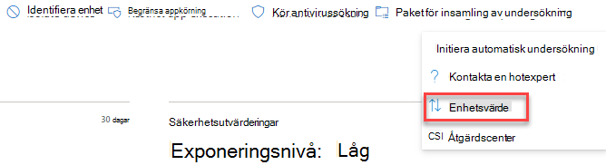
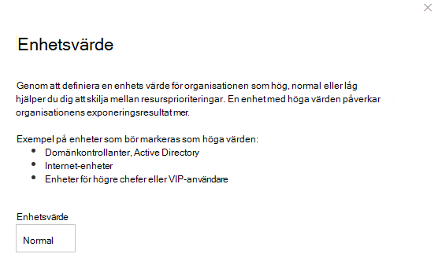

# Tilldela enhetsvärde – hantering av hot och sårbarhetAssign device value - threat and vulnerability management

[!INCLUDE [Microsoft 365 Defender rebranding](../../includes/microsoft-defender.md)]

**Gäller för:****Applies to:**

- [Microsoft Defender för EndpointMicrosoft Defender for Endpoint](https://go.microsoft.com/fwlink/?linkid=2154037)
- [Hantering av hot och sårbarhetThreat and vulnerability management](next-gen-threat-and-vuln-mgt.md)
- [Microsoft 365 DefenderMicrosoft 365 Defender](https://go.microsoft.com/fwlink/?linkid=2118804)

> Vill du uppleva Microsoft Defender för Slutpunkt?Want to experience Microsoft Defender for Endpoint? [Registrera dig för en kostnadsfri utvärderingsversion.Sign up for a free trial.](https://www.microsoft.com/microsoft-365/windows/microsoft-defender-atp?ocid=docs-wdatp-portaloverview-abovefoldlink)

[!include[Prerelease information](../../includes/prerelease.md)]

Genom att definiera en enhets värde kan du skilja på resursprioriteringar.Defining a device’s value helps you differentiate between asset priorities. Enhetsvärdet används för att införliva en enskild tillgångs riskdekans i beräkningen av exponeringsresultatet för hot och sårbarhetshantering.The device value is used to incorporate the risk appetite of an individual asset into the threat and vulnerability management exposure score calculation. Enheter som tilldelas som "höga värden" får större vikt.Devices assigned as “high value” will receive more weight.

Du kan också använda [API:t för enhetsvärde.](set-device-value.md)You can also use the [set device value API](set-device-value.md).

Alternativ för enhetsvärde:Device value options:

- LågLow
- Normal (standard)Normal (Default)
- HögstaHigh

Exempel på enheter som bör tilldelas ett högt värde:Examples of devices that should be assigned a high value:

- Domänkontrollanter, Active DirectoryDomain controllers, Active Directory
- Internet-enheterInternet facing devices
- VIP-enheterVIP devices
- Enheter som fungerar som värd för interna/externa produktionstjänsterDevices hosting internal/external production services

## Välj enhetsvärdeChoose device value

1. Gå till valfri enhetssida, den enklaste platsen är från enhetsinventeringen.Navigate to any device page, the easiest place is from the device inventory.

2. Välj **Enhetsvärde** från tre punkter bredvid åtgärdsfältet högst upp på sidan.Select **Device value** from three dots next to the actions bar at the top of the page.

    

3. En utfäll kan visas med enhetens aktuella värde och vad det innebär.A flyout will appear with the current device value and what it means. Granska enhetens värde och välj det som passar bäst för din enhet.Review the value of the device and choose the one that best fits your device.

## Hur enhetsvärde påverkar exponeringsresultatetHow device value impacts your exposure score

Exponeringsresultatet är ett viktat medelvärde för alla enheter.The exposure score is a weighted average across all devices. Om du har enhetsgrupper kan du också filtrera poängen efter enhetsgrupp.If you have device groups, you can also filter the score by device group.

- Normal enheter har en vikt på 1Normal devices have a weight of 1
- Enheter med låg värde har en vikt på 0,75Low value devices have a weight of 0.75
- Enheter med höga värden har vikten NumberOfAssets / 10.High value devices have a weight of NumberOfAssets / 10.
    - Om du har 100 enheter har varje enhet med höga värden 10 (100/10)If you have 100 devices, each high value device will have a weight of 10 (100/10)

## Relaterade ämnenRelated topics

- [Översikt över hot- och sårbarhetshanteringThreat and vulnerability management overview](next-gen-threat-and-vuln-mgt.md)
- [ExponeringsresultatExposure Score](tvm-exposure-score.md)
- [API:erAPIs](next-gen-threat-and-vuln-mgt.md#apis)