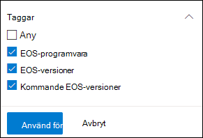
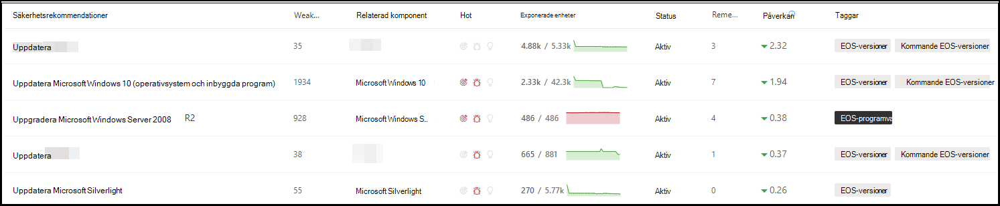
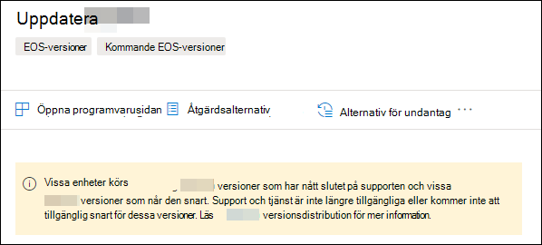
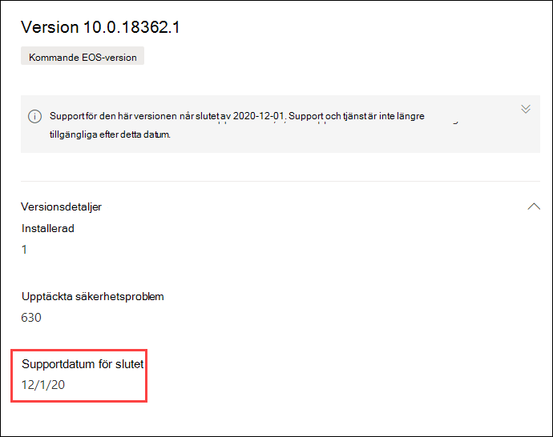

# Planera för slut på support av programvara och programvaruversioner med Hantering av hot och säkerhetsriskerPlan for end-of-support software and software versions with threat and vulnerability management

[!INCLUDE [Microsoft 365 Defender rebranding](../../includes/microsoft-defender.md)]

**Gäller för:****Applies to:**

- [Microsoft Defender för EndpointMicrosoft Defender for Endpoint](https://go.microsoft.com/fwlink/?linkid=2154037)
- [Hot och hantering av säkerhetsriskerThreat and vulnerability management](next-gen-threat-and-vuln-mgt.md)
- [Microsoft 365 DefenderMicrosoft 365 Defender](https://go.microsoft.com/fwlink/?linkid=2118804)

>Vill du uppleva Microsoft Defender för Slutpunkt?Want to experience Microsoft Defender for Endpoint? [Registrera dig för en kostnadsfri utvärderingsversion.Sign up for a free trial.](https://www.microsoft.com/microsoft-365/windows/microsoft-defender-atp?ocid=docs-wdatp-portaloverview-abovefoldlink)

Supporten för programvara eller programversioner (EOS, kallas även slutet på livscykeln, EOL), innebär att de inte längre kommer att få support eller service, och att de inte får säkerhetsuppdateringar.End-of-support (EOS), otherwise known as end-of-life (EOL), for software or software versions means that they will no longer be supported or serviced, and will not receive security updates. När du använder programvara eller programvaruversioner utan att ha avslutat supporten utser du organisationen för att skapa säkerhetsbrister, juridiska och finansiella risker.When you use software or software versions with ended support, you're exposing your organization to security vulnerabilities, legal, and financial risks.

Det är centralt för säkerhet- och IT-administratörer att samarbeta och se till att organisationens programvaruinventering har konfigurerats för optimala resultat, efterlevnad och ett hälsosamt nätverks-ekosystem.It's crucial for Security and IT Administrators to work together and ensure that the organization's software inventory is configured for optimal results, compliance, and a healthy network ecosystem. De bör granska alternativen för att ta bort eller ersätta program som stöds i slutet av supporten och uppdateringsversionerna som inte längre stöds.They should examine the options to remove or replace apps that have reached end-of-support and update versions that are no longer supported. Det är bäst att skapa och implementera en plan **innan supportdatumen** är slut.It's best to create and implement a plan **before** the end of support dates.

>[!NOTE]
> Supporten för supporten är för närvarande endast tillgänglig för Windows produkter.End-of-support capability is currently available only for Windows products.

## Hitta program- och programvaruversioner som inte längre stödsFind software or software versions that are no longer supported

1. Från menyn Hantering av hot och säkerhetsrisker navigerar du till [**Säkerhetsrekommendationer**](tvm-security-recommendation.md).From the threat and vulnerability management menu, navigate to [**Security recommendations**](tvm-security-recommendation.md).
2. Gå till **panelen Filter** och leta efter avsnittet med taggar.Go to the **Filters** panel and look for the tags section. Markera ett eller flera av EOS-taggalternativen.Select one or more of the EOS tag options. Använd **sedan**.Then **Apply**.

    

3. Du ser en lista med rekommendationer relaterade till programvara med upphört med support, programvaruversioner som upphör och versioner med kommande support upphör.You'll see a list of recommendations related to software with ended support, software versions that are end of support, or versions with upcoming end of support. De här taggarna visas också på [sidan för programvaruinventering.](tvm-software-inventory.md)These tags are also visible in the [software inventory](tvm-software-inventory.md) page.

    

## Lista över versioner och datumList of versions and dates

Om du vill visa en lista över versioner som snart har supporten har gått ut, eller snart har supporten, och dessa datum, följer du stegen nedan:To view a list of versions that have reached end of support, or end or support soon, and those dates, follow the below steps:

1. Ett meddelande visas i den utfällliga säkerhetsrekommendationerna för programvara med versioner där supporten har gått ut, eller snart kommer att upphöra med support.A message will appear in the security recommendation flyout for software with versions that have reached end of support, or will reach end of support soon.

    

2. Välj länken **för versionsdistribution** för att gå till sidan för programvarugranskning.Select the **version distribution** link to go to the software drill-down page. Där visas en filtrerad lista med versioner med taggar som identifierar dem som supporten är slut eller kommande support avslutas.There, you can see a filtered list of versions with tags identifying them as end of support, or upcoming end of support.

    

3. Välj någon av versionerna i tabellen som ska öppnas.Select one of the versions in the table to open. Till exempel version 10.0.18362.1.For example, version 10.0.18362.1. En utfälling visas när supportdatumet är slut.A flyout will appear with the end of support date.

    

När du har identifierat vilka program- och programvaruversioner som är sårbara på grund av deras status vid slutet av supporten måste du bestämma dig för om du vill uppdatera eller ta bort dem från organisationen.Once you identify which software and software versions are vulnerable due to their end-of-support status, you must decide whether to update or remove them from your organization. Om du gör det minskar risken för risker för organisationer och avancerade fortlöpande hot.Doing so will lower your organizations exposure to vulnerabilities and advanced persistent threats.

## Relaterade ämnenRelated topics

- [Översikt över hantering av säkerhetsrisker hot och hotThreat and vulnerability management overview](next-gen-threat-and-vuln-mgt.md)
- [SäkerhetsrekommendationerSecurity recommendations](tvm-security-recommendation.md)
- [ProgramvaruinventeringSoftware inventory](tvm-software-inventory.md)
