# Skapa och visa undantag för säkerhetsrekommendationer – hantering av hot och sårbarhet

[!INCLUDE [Microsoft 365 Defender rebranding](../../includes/microsoft-defender.md)]

**Gäller för:**

- [Microsoft Defender för Endpoint](https://go.microsoft.com/fwlink/?linkid=2154037)
- [Hantering av hot och sårbarhet](next-gen-threat-and-vuln-mgt.md)
- [Microsoft 365 Defender](https://go.microsoft.com/fwlink/?linkid=2118804)

>Vill du uppleva Microsoft Defender för Slutpunkt? [Registrera dig för en kostnadsfri utvärderingsversion.](https://www.microsoft.com/microsoft-365/windows/microsoft-defender-atp?ocid=docs-wdatp-portaloverview-abovefoldlink)

Som ett alternativ till en begäran om åtgärd när en rekommendation inte är relevant för tillfället kan du skapa undantag för rekommendationer. Om din organisation har enhetsgrupper kan du begränsa undantaget till specifika enhetsgrupper. Undantag kan antingen skapas för valda enhetsgrupper eller för alla enhetsgrupper som är tidigare och finns.  

När ett undantag skapas för en rekommendation är rekommendationen inte aktiv förrän undantagets varaktighet är slut. Rekommendationstillståndet ändras till **Fullständigt undantag eller** Delvis **undantag** (efter enhetsgrupp).

## Behörigheter

Endast användare med behörigheten "undantagshantering" kan hantera undantag (till exempel att skapa eller avbryta). [Läs mer om RBAC-roller.](user-roles.md)

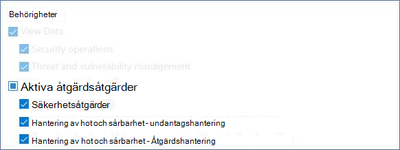

## Skapa ett undantag

Välj en säkerhetsrekommendationer som du vill skapa ett undantag för och välj sedan **Alternativ för undantag** och fyll i formuläret.  

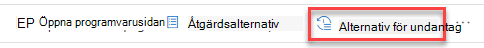

### Undantag efter enhetsgrupp

Använd undantaget för alla aktuella enhetsgrupper eller välj specifika enhetsgrupper. Framtida enhetsgrupper inkluderas inte i undantaget. Enhetsgrupper som redan har ett undantag visas inte i listan. Om du bara väljer vissa enhetsgrupper ändras rekommendationstillståndet från "aktiv" till "delvis undantag". Statusen ändras till "fullständigt undantag" om du markerar alla enhetsgrupper.

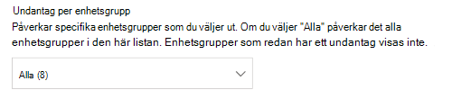

#### Filtrerade vyer

Om du har filtrerat efter enhetsgrupp på någon av sidorna för hot och sårbarhetshantering visas bara de filtrerade enhetsgrupper som alternativ.

Det här är knappen för att filtrera efter enhetsgrupp på någon av sidorna för hot och sårbarhetshantering: 

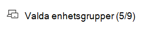

Undantagsvy med filtrerade enhetsgrupper:

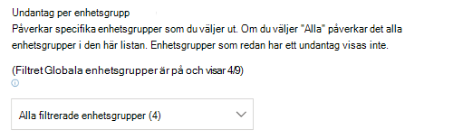

#### Stort antal enhetsgrupper

Om din organisation har fler än 20 enhetsgrupper väljer **du Redigera** bredvid alternativet för filtrerad enhetsgrupp.

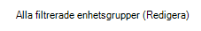

En utfälling visas där du kan söka efter och välja enhetsgrupper som du vill ta med. Markera bockikonen under Sök för att markera/avmarkera alla.

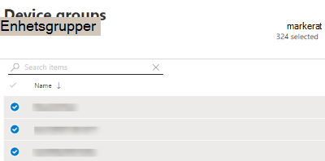

### Globala undantag

Om du har global administratörsbehörighet kan du skapa och avbryta ett globalt undantag. Det påverkar **alla** nuvarande och framtida enhetsgrupper i organisationen, och endast en användare med liknande behörighet skulle kunna ändra den. Rekommendationstillståndet ändras från "aktiv" till "fullständigt undantag".

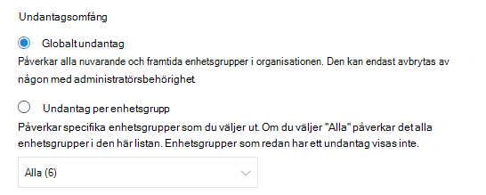

Några saker att tänka på:

- Om en rekommendation ligger under globalt undantag inaktiveras de nyligen skapade undantagen för enhetsgrupper tills det globala undantaget har upphört att gälla eller avbrutits. Därefter börjar de nya enhetsgruppundantagen att gälla tills de upphör att gälla.
- Om en rekommendation redan har undantag för vissa enhetsgrupper och ett globalt undantag skapas inaktiveras enhetsgruppundantaget tills det upphör att gälla eller tills det globala undantaget avbryts innan det förfaller.

### Justering

Välj justeringen för det undantag du behöver spara i stället för att åtgärda den säkerhetsrekommendationer som gäller. Fyll i justeringskontexten och ange sedan varaktighet för undantaget.

I följande lista visas detaljerad information om justeringarna bakom undantagsalternativen:

- **Kontroll från tredje part** – en produkt eller programvara från tredje part som redan tar den här rekommendationen – Om du väljer den här justeringstypen sänks exponeringsresultatet och det säkra resultatet ökar eftersom risken minskar
- **Alternativ minskning** – Ett internt verktyg behandlar redan den här rekommendationen – Om du väljer den här justeringstypen sänks exponeringsresultatet och det säkra resultatet ökar eftersom risken minskar
- **Accepterad** risk – Det kan vara en låg risk och/eller att implementera rekommendationen är för dyr
- **Planerad åtgärd (respit) –** Redan planerat, men väntar på körning eller auktorisering

## Visa alla undantag

Gå till **fliken** Undantag **på sidan** Åtgärd. Du kan filtrera efter justering, typ och status.

 Välj ett undantag för att öppna en utfällblad med mer information. Undantag per enhetsgrupp har en lista över alla enhetsgrupper som undantaget omfattar, som du kan exportera. Du kan också visa den relaterade rekommendationen eller avbryta undantaget.

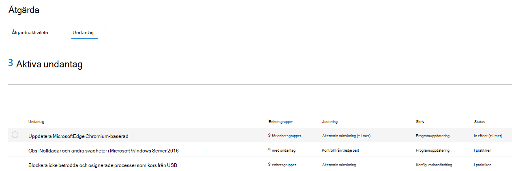

## Avbryta ett undantag

Om du vill avbryta ett undantag går **du till** fliken Undantag **på sidan** Åtgärd. Markera undantaget.

Om du vill avbryta undantaget för alla enhetsgrupper eller för ett globalt undantag väljer du **knappen Avbryt undantag för alla enhetsgrupper.** Du kan bara avbryta undantag för enhetsgrupper som du har behörighet för.

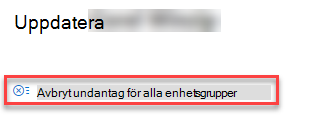

### Avbryta undantaget för en viss enhetsgrupp

Markera den specifika enhetsgruppen om du vill avbryta undantaget för den. En utfälling visas för enhetsgruppen och du kan välja **Avbryt undantag**.

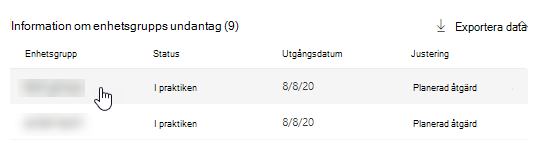

## Visa påverkan efter att undantag har tillämpats

På sidan Säkerhetsrekommendationer väljer du **Anpassa kolumner** och markerar kryssrutorna för exponerade enheter **(efter undantag)** **och Påverkan (efter undantag).**

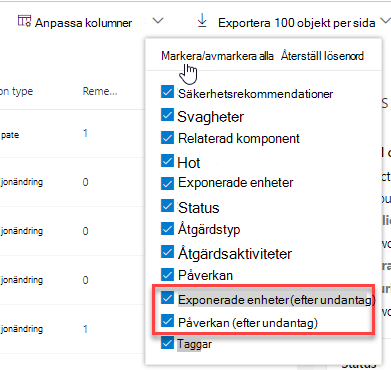

I kolumnen exponerade enheter (efter undantag) visas återstående enheter som fortfarande exponeras för säkerhetsproblem när undantag tillämpas. Justering av undantag som påverkar exponering inkluderar "kontroll från tredje part" och "alternativ minskning". Andra justeringar minskar inte exponering av en enhet och de anses fortfarande vara exponerade.

Effekterna (efter undantag) visar återstående påverkan på exponeringsresultat eller säker poäng efter att undantag har tillämpats. Justering av undantag som påverkar resultat är bland annat "kontroll från tredje part" och "alternativ minskning". Andra justeringar minskar inte exponeringen för en enhet och därför ändras inte exponeringsresultatet och det säkra resultatet.

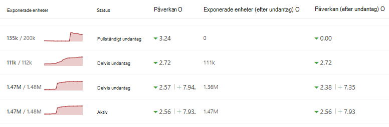

## Relaterade ämnen

- [Översikt över hot- och sårbarhetshantering](next-gen-threat-and-vuln-mgt.md)
- [Åtgärda säkerhetsproblem](tvm-remediation.md)
- [Säkerhetsrekommendationer](tvm-security-recommendation.md)
- [Exponeringsvärde](tvm-exposure-score.md)
- [Microsoft Secure Score för enheter](tvm-microsoft-secure-score-devices.md)
