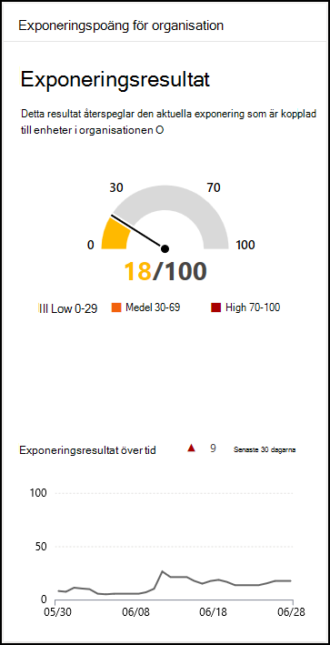

# Exponeringsresultat – hantering av hot och risker

[!INCLUDE [Microsoft 365 Defender rebranding](../../includes/microsoft-defender.md)]

**Gäller för:**

- [Microsoft Defender för Endpoint](https://go.microsoft.com/fwlink/?linkid=2154037)
- [Hantering av hot och sårbarhet](next-gen-threat-and-vuln-mgt.md)
- [Microsoft 365 Defender](https://go.microsoft.com/fwlink/?linkid=2118804)

>Vill du uppleva Microsoft Defender för Slutpunkt? [Registrera dig för en kostnadsfri utvärderingsversion.](https://www.microsoft.com/microsoft-365/windows/microsoft-defender-atp?ocid=docs-wdatp-portaloverview-abovefoldlink)

Din exponeringspoäng visas i instrumentpanelen [för hantering av hot och risker](tvm-dashboard-insights.md) i Microsoft Defender Säkerhetscenter. Den visar hur sårbar organisationen är för hot om cybersäkerhet. Låg exponeringspoäng innebär att enheterna är mindre sårbara för användning.

- Förstå och identifiera takeaways på hög nivå om säkerhetstillstånden i din organisation.
- Identifiera och svara på områden som kräver undersökning eller åtgärd för att förbättra den aktuella statusen.
- Kommunicera med kollegor och ledningen om hur säkerhetsarbetet kommer att påverkas.

Kortet ger dig en bra bild av exponeringsresultattrenden över tid. Alla ökningar i diagrammet ger en visuell indikation om exponering av hot mot cyberhot som du kan undersöka ytterligare.

## Så här fungerar det

Exponeringsresultatet delas in i följande nivåer:

- 0–29: låg exponeringspoäng
- 30–69: medelhög exponeringspoäng
- 70–100: hög exponeringspoäng

Du kan åtgärda problemen baserat på prioriterade säkerhetsrekommendationer [för att](tvm-security-recommendation.md) minska exponeringsresultatet. Varje programvara har svagheter som omvandlats till rekommendationer och prioriteras utifrån risker för organisationen.

## Minska risken för exponering av sårbarheter

Minska exponeringen av hot och risker genom att åtgärda [säkerhetsrekommendationer](tvm-security-recommendation.md). Gör störst inverkan på exponeringsresultatet genom att åtgärda de viktigaste säkerhetsrekommendationerna, som kan visas på instrumentpanelen för hantering av hot [och risker.](tvm-dashboard-insights.md)

## Relaterade ämnen

- [Översikt över hot- och sårbarhetshantering](next-gen-threat-and-vuln-mgt.md)
- [Microsoft Secure Score för enheter](tvm-microsoft-secure-score-devices.md)
- [Säkerhetsrekommendationer](tvm-security-recommendation.md)
- [Tidlinje för händelse](threat-and-vuln-mgt-event-timeline.md)
