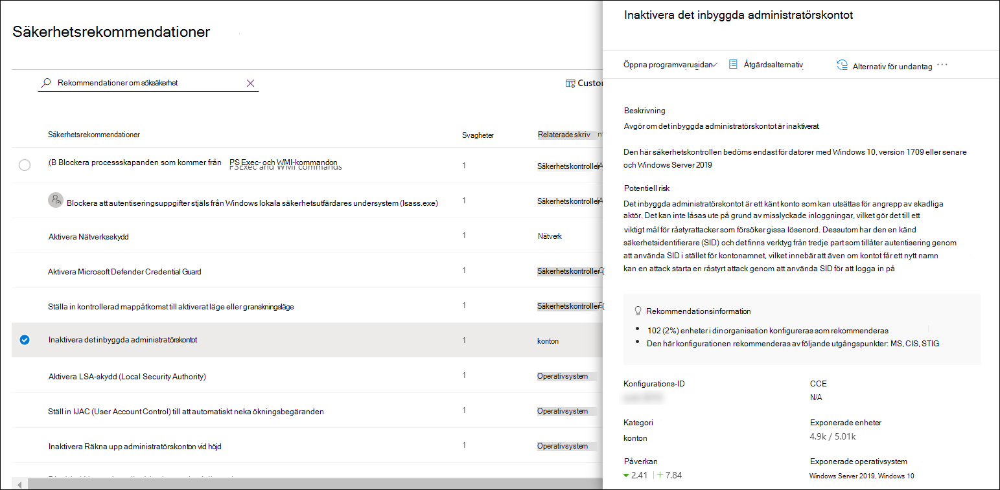
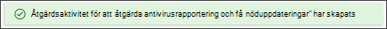
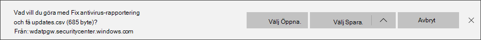

# Microsoft Secure Score för enheterMicrosoft Secure Score for Devices

[!INCLUDE [Microsoft 365 Defender rebranding](../../includes/microsoft-defender.md)]

**Gäller för:****Applies to:**

- [Microsoft Defender för EndpointMicrosoft Defender for Endpoint](https://go.microsoft.com/fwlink/?linkid=2154037)
- [Hantering av hot och sårbarhetThreat and vulnerability management](next-gen-threat-and-vuln-mgt.md)
- [Microsoft 365 DefenderMicrosoft 365 Defender](https://go.microsoft.com/fwlink/?linkid=2118804)

> Vill du använda Defender för Slutpunkt?Want to experience Defender for Endpoint? [Registrera dig för en kostnadsfri utvärderingsversion.Sign up for a free trial.](https://www.microsoft.com/microsoft-365/windows/microsoft-defender-atp?ocid=docs-wdatp-pullalerts-abovefoldlink) 

>[!NOTE]
> Konfigurationsresultat är nu en del av hantering av hot och problem som Microsoft Secure Score för enheter.Configuration score is now part of threat and vulnerability management as Microsoft Secure Score for Devices.

Din poäng för enheter är synlig i instrumentpanelen [för hantering av hot och sårbarhet](tvm-dashboard-insights.md) i Microsoft Defender Säkerhetscenter.Your score for devices is visible in the [threat and vulnerability management dashboard](tvm-dashboard-insights.md) of the Microsoft Defender Security Center. Ett högre Microsoft Secure Score för enheter innebär att dina slutpunkter är mer flexibel mot attacker mot hot om cyberhot.A higher Microsoft Secure Score for Devices means your endpoints are more resilient from cybersecurity threat attacks. Den återspeglar den kollektiva säkerhetskonfigurationstillståndet för dina enheter i följande kategorier:It reflects the collective security configuration state of your devices across the following categories:

- ProgramApplication
- OperativsystemOperating system
- NätverkNetwork
- KontonAccounts
- SäkerhetskontrollerSecurity controls

Välj en kategori för att gå till sidan [**Säkerhetsrekommendationer**](tvm-security-recommendation.md) och visa relevanta rekommendationer.Select a category to go to the [**Security recommendations**](tvm-security-recommendation.md) page and view the relevant recommendations.

## Aktivera Microsoft Secure Score-kopplingenTurn on the Microsoft Secure Score connector

Vidarebefordra Microsoft Defender för Endpoint-signaler och ge Microsoft Secure Score insyn i enhetssäkerhet.Forward Microsoft Defender for Endpoint signals, giving Microsoft Secure Score visibility into the device security posture. Vidarebefordrade data lagras och bearbetas på samma plats som dina Microsoft Secure Score-data.Forwarded data is stored and processed in the same location as your Microsoft Secure Score data.

Det kan ta några timmar innan ändringarna har återspeglas i instrumentpanelen.Changes might take up to a few hours to reflect in the dashboard.

1. I navigeringsfönstret går du till **Avancerade**  >  **inställningar**In the navigation pane, go to **Settings** > **Advanced features** 

2. Rulla ned till **Microsoft Secure Score** och ändra inställningen till **På**.Scroll down to **Microsoft Secure Score** and toggle the setting to **On**.

3. Välj **Spara inställningar**.Select **Save preferences**.

## Så här fungerar detHow it works

>[!NOTE]
> Microsoft Secure Score för enheter stöder för närvarande konfigurationer som har ställts in via Grupprincip.Microsoft Secure Score for Devices currently supports configurations set via Group Policy. På grund av det aktuella stödet för Intune kan konfigurationer som har konfigurerats via Intune visas som felkonfigurerade.Due to the current partial Intune support, configurations which might have been set through Intune might show up as misconfigured. Kontakta IT-administratören för att kontrollera den faktiska konfigurationsstatusen om din organisation använder Intune för säker konfigurationshantering.Contact your IT Administrator to verify the actual configuration status in case your organization is using Intune for secure configuration management.

Data i kortet Microsoft Secure Score för enheter är produkten av noggrann och pågående sårbarhetsidentifieringsprocess.The data in the Microsoft Secure Score for Devices card is the product of meticulous and ongoing vulnerability discovery process. Den sammanställs med kontinuerliga konfigurationsidentifieringsutvärderingar:It is aggregated with configuration discovery assessments that continuously:

- Jämför insamlade konfigurationer med insamlade riktmärken för att upptäcka felkonfigurerade tillgångarCompare collected configurations to the collected benchmarks to discover misconfigured assets
- Mappa konfigurationer till säkerhetsproblem som kan åtgärdas eller delvis åtgärdas (riskminskning)Map configurations to vulnerabilities that can be remediated or partially remediated (risk reduction)
- Samla in och underhålla bästa möjliga prestanda vid konfigurationer (leverantörer, säkerhetsflöden, interna forskningsteam)Collect and maintain best practice configuration benchmarks (vendors, security feeds, internal research teams)
- Samla in och övervaka ändringar av konfigurationstillståndet för säkerhetskontroller för alla tillgångarCollect and monitor changes of security control configuration state from all assets

## Förbättra din säkerhetskonfigurationImprove your security configuration

Förbättra säkerhetskonfigurationen genom att åtgärda problem från listan med säkerhetsrekommendationer.Improve your security configuration by remediating issues from the security recommendations list. Samtidigt som du gör det förbättras ditt Microsoft Secure Score för enheter och din organisation blir mer flexibel mot hot och säkerhetsproblem mot cybersäkerhet.As you do so, your Microsoft Secure Score for Devices improves and your organization becomes more resilient against cybersecurity threats and vulnerabilities.

1. Från kortet Microsoft Secure Score för enheter med instrumentpanelen för hot och sårbarhetshantering väljer du en av kategorierna.From the Microsoft Secure Score for Devices card in the threat and vulnerability management dashboard, select the one of the categories. Du ser en lista med rekommendationer för den kategorin.You'll view the list of recommendations related to that category. Du kommer då till sidan [**Säkerhetsrekommendationer.**](tvm-security-recommendation.md)It will take you to the [**Security recommendations**](tvm-security-recommendation.md) page. Om du vill se alla säkerhetsrekommendationer rensar du sökfältet när du kommer till sidan Säkerhetsrekommendationer.If you want to see all security recommendations, once you get to the Security recommendations page, clear the search field.

2. Markera ett objekt i listan.Select an item on the list. Den utfällna panelen öppnas med information om rekommendationen.The flyout panel will open with details related to the recommendation. Välj **Alternativ för åtgärder.**Select **Remediation options**.

   

3. Läs beskrivningen för att förstå kontexten för problemet och vad du ska göra härnäst.Read the description to understand the context of the issue and what to do next. Välj ett förfallodatum, lägg till anteckningar och välj Exportera alla åtgärdsaktivitetsdata i **CSV** så att du kan bifoga dem i ett e-postmeddelande för uppföljning.Select a due date, add notes, and select **Export all remediation activity data to CSV** so you can attach it to an email for follow-up.

4. **Skicka begäran**.**Submit request**. Ett bekräftelsemeddelande visas om att åtgärden har skapats.You'll see a confirmation message that the remediation task has been created.
   

5. Spara CSV-filen.Save your CSV file.
   

6. Skicka ett uppföljande e-postmeddelande till IT-administratören och tillåt den tid som du har tilldelats för åtgärd för att spridas i systemet.Send a follow-up email to your IT Administrator and allow the time that you've allotted for the remediation to propagate in the system.

7. Gå tillbaka **till kortet Microsoft Secure Score för enheter** på instrumentpanelen.Review the **Microsoft Secure Score for Devices** card again on the dashboard. Antalet rekommendationer om säkerhetskontroller kommer att minska.The number of security controls recommendations will decrease. När du **väljer Säkerhetskontroller** för  att gå tillbaka till sidan Säkerhetsrekommendationer visas inte objektet som du har adresserat längre.When you select **Security controls** to go back to the **Security recommendations** page, the item that you've addressed won't be listed there anymore. Ditt Microsoft Secure Score för enheter bör öka.Your Microsoft Secure Score for Devices should increase.

>[!IMPORTANT]
>Du kan förbättra utvärderingsfrekvensen för sårbarhet genom att ladda ned följande obligatoriska säkerhetsuppdateringar och distribuera dem i nätverket:To boost your vulnerability assessment detection rates, download the following mandatory security updates and deploy them in your network:
>- 19H1-kunder | [KB 4512941](https://support.microsoft.com/help/4512941/windows-10-update-kb4512941)19H1 customers | [KB 4512941](https://support.microsoft.com/help/4512941/windows-10-update-kb4512941)
>- RS5 customers | [KB 4516077](https://support.microsoft.com/help/4516077/windows-10-update-kb4516077)RS5 customers | [KB 4516077](https://support.microsoft.com/help/4516077/windows-10-update-kb4516077)
>- RS4 customers | [KB 4516045](https://support.microsoft.com/help/4516045/windows-10-update-kb4516045)RS4 customers | [KB 4516045](https://support.microsoft.com/help/4516045/windows-10-update-kb4516045)
>- RS3-| [KB 4516071](https://support.microsoft.com/help/4516071/windows-10-update-kb4516071)RS3 customers | [KB 4516071](https://support.microsoft.com/help/4516071/windows-10-update-kb4516071)
>
>Så här laddar du ned säkerhetsuppdateringarna:To download the security updates:
>1. Gå till [Microsoft Update-katalogen.](https://www.catalog.update.microsoft.com/home.aspx)Go to [Microsoft Update Catalog](https://www.catalog.update.microsoft.com/home.aspx).
>2. Key-in the security update KB number that you need to download, then click **Search**.Key-in the security update KB number that you need to download, then click **Search**.  

## Relaterade ämnenRelated topics

- [Översikt över hot- och sårbarhetshanteringThreat and vulnerability management overview](next-gen-threat-and-vuln-mgt.md)
- [InstrumentpanelenDashboard](tvm-dashboard-insights.md)
- [ExponeringsvärdeExposure score](tvm-exposure-score.md)
- [SäkerhetsrekommendationerSecurity recommendations](tvm-security-recommendation.md)
