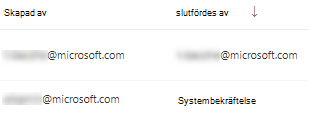
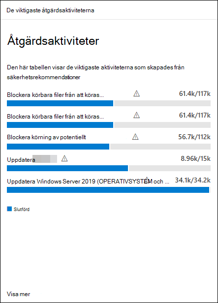

# Åtgärda säkerhetsproblem med hantering av hot och risker

[!INCLUDE [Microsoft 365 Defender rebranding](../../includes/microsoft-defender.md)]

**Gäller för:**
- [Microsoft Defender för Endpoint](https://go.microsoft.com/fwlink/?linkid=2154037)
- [Hantering av hot och sårbarhet](next-gen-threat-and-vuln-mgt.md)
- [Microsoft 365 Defender](https://go.microsoft.com/fwlink/?linkid=2118804)

>Vill du uppleva Microsoft Defender för Slutpunkt? [Registrera dig för en kostnadsfri utvärderingsversion.](https://www.microsoft.com/microsoft-365/windows/microsoft-defender-atp?ocid=docs-wdatp-portaloverview-abovefoldlink)

## Begära åtgärd

Funktionen för hantering av hot och sårbarhet i Microsoft Defender för Endpoint överbrygger mellanrummet mellan säkerhet och IT-administratörer genom arbetsflödet för åtgärdsförfrågningar. Som säkerhetsadministratörer kan du begära att IT-administratören åtgärdar problemet från sidorna med säkerhetsrekommendationer till Intune. 

### Aktivera Microsoft Intune-anslutning

Aktivera dina Microsoft Intune-anslutningar om du vill använda den här funktionen. I Microsoft Defender Säkerhetscenter går du till **Inställningar**  >  **Allmänna**  >  **avancerade funktioner.** Rulla nedåt och leta efter **Microsoft Intune-anslutning**. Växlingsknappen är inaktiverad som standard. Aktivera Microsoft **Intune-anslutningen.** 

**Obs!** Om Intune-anslutningen är aktiverad får du ett alternativ för att skapa en Intune-säkerhetsaktivitet när du skapar en åtgärdsbegäran. Det här alternativet visas inte om anslutningen inte har angetts.

Mer [information finns i Använda Intune för att](https://docs.microsoft.com/intune/atp-manage-vulnerabilities) åtgärda säkerhetsproblem som identifieras av Microsoft Defender.

### Steg för åtgärdsförfrågan

1. Gå till navigeringsmenyn för hantering av hot och sårbarhet i Microsoft Defender Säkerhetscenter och välj [**Säkerhetsrekommendationer**](tvm-security-recommendation.md).

2. Välj en säkerhetsrekommendationer som du vill begära åtgärd för och välj sedan **Åtgärdsalternativ.**

3. Fyll i formuläret, inklusive vad du begär åtgärd för, tillämpliga enhetsgrupper, prioritet, förfallodatum och valfria anteckningar.
    1. Om du väljer åtgärdsalternativet "åtgärd krävs" är det inte tillgängligt att välja ett förfallodatum eftersom det inte finns någon särskild åtgärd.

4. Välj **Skicka begäran**. Om du skickar en begäran om åtgärd skapas ett åtgärdsaktivitetsobjekt inom hantering av hot och sårbarhet, som kan användas för att övervaka åtgärdsförloppet för den här rekommendationen. Det här utlöser inte någon åtgärd eller tillämpar ändringar på enheter.

5. Meddela IT-administratören om den nya begäran och be dem logga in i Intune för att godkänna eller avvisa begäran och starta en paketdistribution.

6. Gå till [**sidan Åtgärd för**](tvm-remediation.md) att visa status för din begäran om åtgärd.

Om du vill kontrollera hur biljetten visas i Intune hittar du mer information i Använd [Intune](https://docs.microsoft.com/intune/atp-manage-vulnerabilities) för att åtgärda säkerhetsproblem som identifieras av Microsoft Defender för Endpoint.

>[!NOTE]
>Om din begäran kräver åtgärd av fler än 10 000 enheter kan vi bara skicka 10 000 enheter för åtgärd till Intune.

När du har identifierat och mappat organisationens cybersäkerhet till åtgärdsbara [säkerhetsrekommendationer börjar](tvm-security-recommendation.md)du med att skapa säkerhetsuppgifter. Du kan skapa uppgifter genom integreringen med Microsoft Intune där åtgärder skapas.

Minska exponeringen från svagheter i organisationen och öka säkerhetskonfigurationen genom att åtgärda säkerhetsrekommendationerna.

## Visa åtgärder

När du skickar en begäran om åtgärd från sidan Säkerhetsrekommendationer startar den en åtgärdsaktivitet. En säkerhetsuppgift skapas som kan spåras på  sidan för åtgärder för hot och sårbarhetshantering, och en åtgärdsuppgift skapas i Microsoft Intune.

Om du väljer åtgärdsalternativet "åtgärd krävs" finns det ingen förloppsstapel, status för biljett eller förfallodatum eftersom det inte finns någon verklig åtgärd vi kan övervaka.

När du är på sidan Åtgärd väljer du den åtgärdsaktivitet som du vill visa. Du kan följa åtgärdsstegen, spåra förloppet, visa relaterad rekommendation, exportera till CSV eller markera som slutförd.

>[!NOTE]
> Det finns en 180-dagars kvarhållningstid för slutförda åtgärder. För att åtgärdssidan ska fungera optimalt tas åtgärdsaktiviteten bort 6 månader efter att den har slutförts.

### Kolumnen Slutförd efter

Spåra vem som har stängt åtgärdsaktiviteten med kolumnen "Slutförd av" på sidan Åtgärd.

- **E-postadress:** E-postadressen till den person som slutförde uppgiften manuellt
- **Systembekräftelse:** Uppgiften slutfördes automatiskt (alla enheter har åtgärdats)
- **Ej tillgänglig:** Informationen är inte tillgänglig eftersom vi inte vet hur den äldre uppgiften slutfördes

### De viktigaste åtgärdsaktiviteterna på instrumentpanelen

Visa **de viktigaste åtgärdsaktiviteterna på instrumentpanelen** [för hantering av hot och sårbarhet.](tvm-dashboard-insights.md) Markera någon av posterna för att gå **till sidan** Åtgärd. Du kan markera åtgärdsaktiviteten som slutförd när IT-administratörteamet har åtgärdat uppgiften.

## Relaterade artiklar

- [Översikt över hot- och sårbarhetshantering](next-gen-threat-and-vuln-mgt.md)
- [Instrumentpanelen](tvm-dashboard-insights.md)
- [Säkerhetsrekommendationer](tvm-security-recommendation.md)