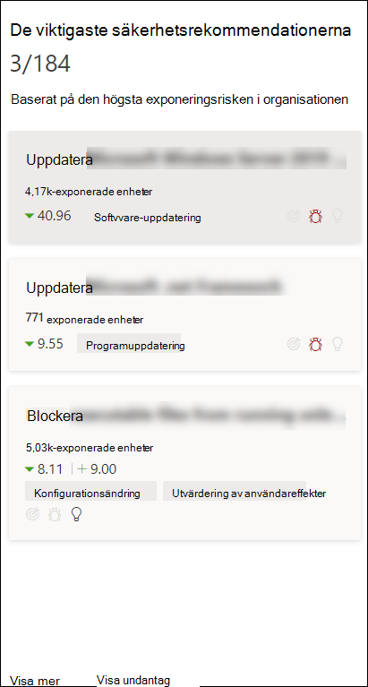
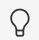
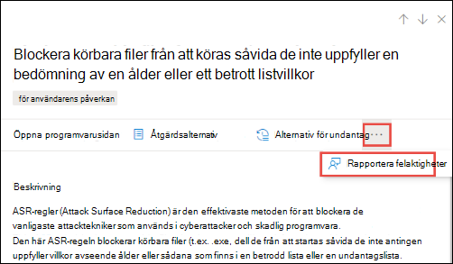

# Säkerhetsrekommendationer – hantering av hot och hotSecurity recommendations - threat and vulnerability management

[!INCLUDE [Microsoft 365 Defender rebranding](../../includes/microsoft-defender.md)]

**Gäller för:****Applies to:**

- [Microsoft Defender för EndpointMicrosoft Defender for Endpoint](https://go.microsoft.com/fwlink/?linkid=2154037)
- [Hantering av hot och sårbarhetThreat and vulnerability management](next-gen-threat-and-vuln-mgt.md)
- [Microsoft 365 DefenderMicrosoft 365 Defender](https://go.microsoft.com/fwlink/?linkid=2118804)

>Vill du uppleva Microsoft Defender för Slutpunkt?Want to experience Microsoft Defender for Endpoint? [Registrera dig för en kostnadsfri utvärderingsversion.Sign up for a free trial.](https://www.microsoft.com/microsoft-365/windows/microsoft-defender-atp?ocid=docs-wdatp-portaloverview-abovefoldlink)

Cybersäkerhet som identifieras i organisationen mappas till rekommendationer om säkerhet som kan åtgärdas och prioriteras efter hur de påverkas.Cybersecurity weaknesses identified in your organization are mapped to actionable security recommendations and prioritized by their impact. Prioriterade rekommendationer hjälper till att förkorta tiden för att minimera eller åtgärda säkerhetsproblem och enhetsefterlevnad.Prioritized recommendations help shorten the time to mitigate or remediate vulnerabilities and drive compliance.

Varje säkerhetsrekommendationer innehåller åtgärdsåtgärdssteg.Each security recommendation includes actionable remediation steps. För att hjälpa till med uppgiftshantering kan rekommendationen också skickas med Hjälp av Microsoft Intune och Konfigurationshanteraren för Microsoft Endpoint.To help with task management, the recommendation can also be sent using Microsoft Intune and Microsoft Endpoint Configuration Manager. När hoten liggande ändras ändras även rekommendationen när den kontinuerligt samlar in information från din miljö.When the threat landscape changes, the recommendation also changes as it continuously collects information from your environment.

>[!TIP]
>E-postmeddelanden om nya sårbarhetshändelser finns i [Konfigurera e-postaviseringar om säkerhetsrisk i Microsoft Defender för slutpunkt](configure-vulnerability-email-notifications.md)To get emails about new vulnerability events, see [Configure vulnerability email notifications in Microsoft Defender for Endpoint](configure-vulnerability-email-notifications.md)

## Så här fungerar detHow it works

Varje enhet i organisationen har tre viktiga faktorer som hjälper kunderna att fokusera på rätt saker vid rätt tidpunkt.Each device in the organization is scored based on three important factors to help customers to focus on the right things at the right time.

- **Hot** – Egenskaper för svagheter och sårbarheter i din organisations enheter och historik för intrång.**Threat** - Characteristics of the vulnerabilities and exploits in your organizations' devices and breach history. Baserat på dessa faktorer visar säkerhetsrekommendationerna motsvarande länkar till aktiva varningar, pågående hotkampanjer och deras motsvarande analysrapporter för hot.Based on these factors, the security recommendations show the corresponding links to active alerts, ongoing threat campaigns, and their corresponding threat analytic reports.

- **Risken för** intrång – din organisations säkerhetsstatus och motståndskraft mot hot**Breach likelihood** - Your organization's security posture and resilience against threats

- **Affärsvärde** – organisationens tillgångar, kritiska processer och immateriella egenskaper**Business value** - Your organization's assets, critical processes, and intellectual properties

## Gå till sidan SäkerhetsrekommendationerNavigate to the Security recommendations page

Få åtkomst till sidan Rekommendationer om säkerhet på ett par olika sätt:Access the Security recommendations page a few different ways:

- Navigeringsmenyn för hantering av hot och sårbarhet i [Säkerhetscenter för Microsoft Defender](portal-overview.md)Threat and vulnerability management navigation menu in the [Microsoft Defender Security Center](portal-overview.md)
- De viktigaste säkerhetsrekommendationerna på [instrumentpanelen för hot och sårbarhetshantering](tvm-dashboard-insights.md)Top security recommendations in the [threat and vulnerability management dashboard](tvm-dashboard-insights.md)

Visa relaterade säkerhetsrekommendationer på följande platser:View related security recommendations in the following places:

- Sidan ProgramvaraSoftware page
- Sidan EnhetDevice page

### NavigeringsmenyNavigation menu

Gå till navigeringsmenyn för hot och sårbarhetshantering och välj **Säkerhetsrekommendationer**.Go to the threat and vulnerability management navigation menu and select **Security recommendations**. Sidan innehåller en lista över säkerhetsrekommendationer för de hot och svagheter som finns i organisationen.The page contains a list of security recommendations for the threats and vulnerabilities found in your organization.

### De viktigaste säkerhetsrekommendationerna på instrumentpanelen för hot och sårbarhetshanteringTop security recommendations in the threat and vulnerability management dashboard

Under en viss dag som säkerhetsadministratör kan du  titta på instrumentpanelen  för hantering av hot och risker för att se din exponeringsresultat sida vid sida med Microsoft [Secure Score för enheter.](tvm-microsoft-secure-score-devices.md)In a given day as a Security Administrator, you can take a look at the [threat and vulnerability management dashboard](tvm-dashboard-insights.md) to see your [exposure score](tvm-exposure-score.md) side by side with your [Microsoft Secure Score for Devices](tvm-microsoft-secure-score-devices.md). Målet är att **minska organisationens** exponering mot  sårbarheter och att öka organisationens enhetssäkerhet för att bli mer flexibel mot attacker mot cybersäkerhetshot.The goal is to **lower** your organization's exposure from vulnerabilities, and **increase** your organization's device security to be more resilient against cybersecurity threat attacks. Den översta listan med säkerhetsrekommendationer hjälper dig att uppnå detta mål.The top security recommendations list can help you achieve that goal.

De viktigaste säkerhetsrekommendationerna innehåller de förbättringsmöjligheter som prioriterats baserat på de viktiga faktorer som nämns i föregående avsnitt – hot, risk för intrång och värde.The top security recommendations list the improvement opportunities prioritized based on the important factors mentioned in the previous section - threat, likelihood to be breached, and value. Om du väljer en rekommendation kommer du till sidan med säkerhetsrekommendationer med mer information.Selecting a recommendation will take you to the security recommendations page with more details.

## Översikt över säkerhetsrekommendationerSecurity recommendations overview

Visa rekommendationer, antalet svagheter, relaterade komponenter, hotinsikter, antal exponerade enheter, status, åtgärdstyp, åtgärder, påverkan på exponeringsresultatet och Microsoft Secure Score för enheter samt tillhörande taggar.View recommendations, the number of weaknesses found, related components, threat insights, number of exposed devices, status, remediation type, remediation activities, impact to your exposure score and Microsoft Secure Score for Devices, and associated tags.

Färgen på diagrammet **Exponerade enheter** ändras när trenden ändras.The color of the **Exposed devices** graph changes as the trend changes. Om antalet exponerade enheter är på uppgång ändras färgen till röd.If the number of exposed devices is on the rise, the color changes into red. Om antalet exponerade enheter minskar kommer färgen på diagrammet att ändras till grön.If there's a decrease in the number of exposed devices, the color of the graph will change into green.

>[!NOTE]
>Hantering av hot och sårbarhet visar enheter som används i upp till **30 dagar** sedan.Threat and vulnerability management shows devices that were in use up to **30 days** ago. Detta skiljer sig från resten av Microsoft Defender för Endpoint, där en enhet inte har använts på mer än 7 dagar och har statusen Inaktiv.This is different from the rest of Microsoft Defender for Endpoint, where if a device has not been in use for more than 7 days it has in an ‘Inactive’ status.

### IkonerIcons

Användbara ikoner kan också snabbt uppmärksamma dig på:Useful icons also quickly call your attention to:
-  möjliga aktiva aviseringarpossible active alerts
-  tillhörande offentliga sårbarheterassociated public exploits
-  rekommendationsinformationrecommendation insights

### Utforska alternativ för säkerhetsrekommendationerExplore security recommendation options

Välj den säkerhetsrekommendationer som du vill undersöka eller bearbeta.Select the security recommendation that you want to investigate or process.

Du kan välja något av följande alternativ i den utfällade den:From the flyout, you can choose any of the following options:

- **Öppna programvarusidan** – Öppna programvarusidan för att få mer kontext över programvaran och hur den distribueras.**Open software page** - Open the software page to get more context on the software and how it's distributed. Informationen kan omfatta hotsammanhang, associerade rekommendationer, identifierade svagheter, antal exponerade enheter, identifierade säkerhetsproblem, namn och detaljerad information om enheter med programvaran installerad samt versionsdistribution.The information can include threat context, associated recommendations, weaknesses discovered, number of exposed devices, discovered vulnerabilities, names and detailed of devices with the software installed, and version distribution.

- [**Åtgärdsalternativ –**](tvm-remediation.md) Skicka en begäran om åtgärd för att öppna ett ärende i Microsoft Intune, så att IT-administratören kan svara och ange adress.[**Remediation options**](tvm-remediation.md) - Submit a remediation request to open a ticket in Microsoft Intune for your IT administrator to pick up and address. Spåra åtgärdsaktiviteten på sidan Åtgärd.Track the remediation activity in the Remediation page.

- [**Undantagsalternativ**](tvm-exception.md) – Skicka ett undantag, ange justering och ange varaktighet för undantag om du inte kan åtgärda problemet ännu.[**Exception options**](tvm-exception.md) - Submit an exception, provide justification, and set exception duration if you can't remediate the issue yet.

>[!NOTE]
>När en programvaruändring görs på en enhet tar det normalt 2 timmar innan data återspeglas i säkerhetsportalen.When a software change is made on a device, it typically takes 2 hours for the data to be reflected in the security portal. Ibland kan det dock ta längre tid.However, it may sometimes take longer. Det kan ta allt från 4 till 24 timmar att ändra konfigurationen.Configuration changes can take anywhere from 4 to 24 hours.

### Undersöka ändringar av exponering av enhet eller påverkanInvestigate changes in device exposure or impact

Om antalet exponerade enheter ökar stort, eller om det är en stark ökning av effekterna på exponeringsresultatet för organisationen och Microsoft Secure Score för enheter, bör säkerhetsrekommendationer undersökas.If there is a large jump in the number of exposed devices, or a sharp increase in the impact on your organization exposure score and Microsoft Secure Score for Devices, then that security recommendation is worth investigating.

1. Välj rekommendationen och **sidan Öppna programvara**Select the recommendation and **Open software page**
2. Välj **tidslinjefliken** Händelse för att visa alla effektfulla händelser relaterade till den programvaran, till exempel nya säkerhetsproblem eller nya offentliga sårbarheter.Select the **Event timeline** tab to view all the impactful events related to that software, such as new vulnerabilities or new public exploits. [Läs mer om tidslinjen för händelserLearn more about event timeline](threat-and-vuln-mgt-event-timeline.md)
3. Bestäm hur du ska åtgärda den ökade eller organisationens exponering, t.ex. att skicka en begäran om åtgärdDecide how to address the increase or your organization's exposure, such as submitting a remediation request

## Begära åtgärdRequest remediation

Funktionen för åtgärder för hantering av hot och sårbarhet överbrygger mellanrummet mellan säkerhet och IT-administratörer genom arbetsflödet för åtgärdsförfrågningar.The threat and vulnerability management remediation capability bridges the gap between Security and IT administrators through the remediation request workflow. Som säkerhetsadministratörer kan du begära att IT-administratören åtgärdar ett problem från rekommendationssidan **för** säkerhet till Intune.Security admins like you can request for the IT Administrator to remediate a vulnerability from the **Security recommendation** page to Intune. [Läs mer om alternativ för åtgärderLearn more about remediation options](tvm-remediation.md)

### Så här begär du åtgärdHow to request remediation

Välj en säkerhetsrekommendationer som du vill begära åtgärd för och välj sedan **Åtgärdsalternativ.**Select a security recommendation you would like to request remediation for, and then select **Remediation options**. Fyll i formuläret och välj **Skicka begäran**.Fill out the form and select **Submit request**. Gå till [**sidan Åtgärd för**](tvm-remediation.md) att visa status för din begäran om åtgärd.Go to the [**Remediation**](tvm-remediation.md) page to view the status of your remediation request. [Läs mer om hur du begär åtgärdLearn more about how to request remediation](tvm-remediation.md#request-remediation)

## Fil för undantagFile for exception

Som ett alternativ till en begäran om åtgärd när en rekommendation inte är relevant för tillfället kan du skapa undantag för rekommendationer.As an alternative to a remediation request when a recommendation is not relevant at the moment, you can create exceptions for recommendations. [Läs mer om undantagLearn more about exceptions](tvm-exception.md)

Endast användare med behörigheten "undantagshantering" kan lägga till undantag.Only users with “exceptions handling” permissions can add exception. [Läs mer om RBAC-roller.](user-roles.md)[Learn more about RBAC roles](user-roles.md).

När ett undantag skapas för en rekommendation är rekommendationen inte längre aktiv.When an exception is created for a recommendation, the recommendation is no longer active. Rekommendationstillståndet ändras till **Fullständigt undantag eller** Delvis **undantag** (efter enhetsgrupp).The recommendation state will change to **Full exception** or **Partial exception** (by device group).

### Så här skapar du ett undantagHow to create an exception

Välj en säkerhetsrekommendationer som du vill skapa ett undantag för och välj sedan **Undantagsalternativ**.Select a security recommendation you would like create an exception for, and then select **Exception options**.  

Fyll i formuläret och skicka.Fill out the form and submit. Om du vill visa alla dina undantag  (nuvarande och tidigare) går du till sidan Åtgärd under **menyn & Vulnerability Management** och väljer **fliken** Undantag. Läs mer om hur du skapar ett [undantag](tvm-exception.md#create-an-exception)To view all your exceptions (current and past), navigate to the [Remediation](tvm-remediation.md) page under the **Threat & Vulnerability Management** menu and select the **Exceptions** tab. [Learn more about how to create an exception](tvm-exception.md#create-an-exception)

## Rapportera felaktigheterReport inaccuracy

Du kan rapportera en falsk positivhet när du ser någon vag, felaktig, ofullständig eller redan åtgärdad information om säkerhetsrekommendationer.You can report a false positive when you see any vague, inaccurate, incomplete, or already remediated security recommendation information.

1. Öppna rekommendationen Säkerhet.Open the Security recommendation.

2. Välj de tre punkterna bredvid den säkerhetsrekommendationer som du vill rapportera och välj **sedan Rapportinkurs.**Select the three dots beside the security recommendation that you want to report,  then select **Report inaccuracy**.

    

3. I den utfällliga fönsterrutan väljer du kategorin felaktigheter i den nedrullningsmenyn, fyller i din e-postadress och information om felaktigheter.From the flyout pane, select the inaccuracy category from the drop-down menu, fill in your email address, and details regarding the inaccuracy.

4. Välj **Skicka**.Select **Submit**. Din feedback skickas omedelbart till experter på hot och sårbarhetshantering.Your feedback is immediately sent to the threat and vulnerability management experts.

## Relaterade artiklarRelated articles

- [Översikt över hot- och sårbarhetshanteringThreat and vulnerability management overview](next-gen-threat-and-vuln-mgt.md)
- [InstrumentpanelenDashboard](tvm-dashboard-insights.md)
- [ExponeringsvärdeExposure score](tvm-exposure-score.md)
- [Microsoft Secure Score för enheterMicrosoft Secure Score for Devices](tvm-microsoft-secure-score-devices.md)
- [Åtgärda säkerhetsproblemRemediate vulnerabilities](tvm-remediation.md)
- [Skapa och visa undantag för säkerhetsrekommendationerCreate and view exceptions for security recommendations](tvm-exception.md)
- [Tidlinje för händelseEvent timeline](threat-and-vuln-mgt-event-timeline.md)
