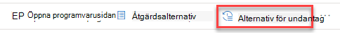

# Säkerhetsrekommendationer – hantering av hot och hot

[!INCLUDE [Microsoft 365 Defender rebranding](../../includes/microsoft-defender.md)]

**Gäller för:**

- [Microsoft Defender för Endpoint](https://go.microsoft.com/fwlink/?linkid=2154037)
- [Hantering av hot och sårbarhet](next-gen-threat-and-vuln-mgt.md)
- [Microsoft 365 Defender](https://go.microsoft.com/fwlink/?linkid=2118804)

>Vill du uppleva Microsoft Defender för Slutpunkt? [Registrera dig för en kostnadsfri utvärderingsversion.](https://www.microsoft.com/microsoft-365/windows/microsoft-defender-atp?ocid=docs-wdatp-portaloverview-abovefoldlink)

Cybersäkerhet som identifieras i organisationen mappas till rekommendationer om säkerhet som kan åtgärdas och prioriteras efter hur de påverkas. Prioriterade rekommendationer hjälper till att förkorta tiden för att minimera eller åtgärda säkerhetsproblem och enhetsefterlevnad.

Varje säkerhetsrekommendationer innehåller åtgärdsåtgärdssteg. För att hjälpa till med uppgiftshantering kan rekommendationen också skickas med Hjälp av Microsoft Intune och Konfigurationshanteraren för Microsoft Endpoint. När hoten liggande ändras ändras även rekommendationen när den kontinuerligt samlar in information från din miljö.

>[!TIP]
>E-postmeddelanden om nya sårbarhetshändelser finns i [Konfigurera e-postaviseringar om säkerhetsrisk i Microsoft Defender för slutpunkt](configure-vulnerability-email-notifications.md)

## Så här fungerar det

Varje enhet i organisationen har tre viktiga faktorer som hjälper kunderna att fokusera på rätt saker vid rätt tidpunkt.

- **Hot** – Egenskaper för svagheter och sårbarheter i din organisations enheter och historik för intrång. Baserat på dessa faktorer visar säkerhetsrekommendationerna motsvarande länkar till aktiva varningar, pågående hotkampanjer och deras motsvarande analysrapporter för hot.

- **Risken för** intrång – din organisations säkerhetsstatus och motståndskraft mot hot

- **Affärsvärde** – organisationens tillgångar, kritiska processer och immateriella egenskaper

## Gå till sidan Säkerhetsrekommendationer

Få åtkomst till sidan Rekommendationer om säkerhet på ett par olika sätt:

- Navigeringsmenyn för hantering av hot och sårbarhet i [Säkerhetscenter för Microsoft Defender](portal-overview.md)
- De viktigaste säkerhetsrekommendationerna på [instrumentpanelen för hot och sårbarhetshantering](tvm-dashboard-insights.md)

Visa relaterade säkerhetsrekommendationer på följande platser:

- Sidan Programvara
- Sidan Enhet

### Navigeringsmeny

Gå till navigeringsmenyn för hot och sårbarhetshantering och välj **Säkerhetsrekommendationer**. Sidan innehåller en lista över säkerhetsrekommendationer för de hot och svagheter som finns i organisationen.

### De viktigaste säkerhetsrekommendationerna på instrumentpanelen för hot och sårbarhetshantering

Under en viss dag som säkerhetsadministratör kan du  titta på instrumentpanelen  för hantering av hot och risker för att se din exponeringsresultat sida vid sida med Microsoft [Secure Score för enheter.](tvm-microsoft-secure-score-devices.md) Målet är att **minska organisationens** exponering mot  sårbarheter och att öka organisationens enhetssäkerhet för att bli mer flexibel mot attacker mot cybersäkerhetshot. Den översta listan med säkerhetsrekommendationer hjälper dig att uppnå detta mål.

De viktigaste säkerhetsrekommendationerna innehåller de förbättringsmöjligheter som prioriterats baserat på de viktiga faktorer som nämns i föregående avsnitt – hot, risk för intrång och värde. Om du väljer en rekommendation kommer du till sidan med säkerhetsrekommendationer med mer information.

## Översikt över säkerhetsrekommendationer

Visa rekommendationer, antalet svagheter, relaterade komponenter, hotinsikter, antal exponerade enheter, status, åtgärdstyp, åtgärder, påverkan på exponeringsresultatet och Microsoft Secure Score för enheter samt tillhörande taggar.

Färgen på diagrammet **Exponerade enheter** ändras när trenden ändras. Om antalet exponerade enheter är på uppgång ändras färgen till röd. Om antalet exponerade enheter minskar kommer färgen på diagrammet att ändras till grön.

>[!NOTE]
>Hantering av hot och sårbarhet visar enheter som används i upp till **30 dagar** sedan. Detta skiljer sig från resten av Microsoft Defender för Endpoint, där en enhet inte har använts på mer än 7 dagar och har statusen Inaktiv.

### Ikoner

Användbara ikoner kan också snabbt uppmärksamma dig på:
-  möjliga aktiva aviseringar
-  tillhörande offentliga sårbarheter
-  rekommendationsinformation

### Utforska alternativ för säkerhetsrekommendationer

Välj den säkerhetsrekommendationer som du vill undersöka eller bearbeta.

Du kan välja något av följande alternativ i den utfällade den:

- **Öppna programvarusidan** – Öppna programvarusidan för att få mer kontext över programvaran och hur den distribueras. Informationen kan omfatta hotsammanhang, associerade rekommendationer, identifierade svagheter, antal exponerade enheter, identifierade säkerhetsproblem, namn och detaljerad information om enheter med programvaran installerad samt versionsdistribution.

- [**Åtgärdsalternativ –**](tvm-remediation.md) Skicka en begäran om åtgärd för att öppna ett ärende i Microsoft Intune, så att IT-administratören kan svara och ange adress. Spåra åtgärdsaktiviteten på sidan Åtgärd.

- [**Undantagsalternativ**](tvm-exception.md) – Skicka ett undantag, ange justering och ange varaktighet för undantag om du inte kan åtgärda problemet ännu.

>[!NOTE]
>När en programvaruändring görs på en enhet tar det normalt 2 timmar innan data återspeglas i säkerhetsportalen. Ibland kan det dock ta längre tid. Det kan ta allt från 4 till 24 timmar att ändra konfigurationen.

### Undersöka ändringar av exponering av enhet eller påverkan

Om antalet exponerade enheter ökar stort, eller om det är en stark ökning av effekterna på exponeringsresultatet för organisationen och Microsoft Secure Score för enheter, bör säkerhetsrekommendationer undersökas.

1. Välj rekommendationen och **sidan Öppna programvara**
2. Välj **tidslinjefliken** Händelse för att visa alla effektfulla händelser relaterade till den programvaran, till exempel nya säkerhetsproblem eller nya offentliga sårbarheter. [Läs mer om tidslinjen för händelser](threat-and-vuln-mgt-event-timeline.md)
3. Bestäm hur du ska åtgärda den ökade eller organisationens exponering, t.ex. att skicka en begäran om åtgärd

## Begära åtgärd

Funktionen för åtgärder för hantering av hot och sårbarhet överbrygger mellanrummet mellan säkerhet och IT-administratörer genom arbetsflödet för åtgärdsförfrågningar. Som säkerhetsadministratörer kan du begära att IT-administratören åtgärdar ett problem från rekommendationssidan **för** säkerhet till Intune. [Läs mer om alternativ för åtgärder](tvm-remediation.md)

### Så här begär du åtgärd

Välj en säkerhetsrekommendationer som du vill begära åtgärd för och välj sedan **Åtgärdsalternativ.** Fyll i formuläret och välj **Skicka begäran**. Gå till [**sidan Åtgärd för**](tvm-remediation.md) att visa status för din begäran om åtgärd. [Läs mer om hur du begär åtgärd](tvm-remediation.md#request-remediation)

## Fil för undantag

Som ett alternativ till en begäran om åtgärd när en rekommendation inte är relevant för tillfället kan du skapa undantag för rekommendationer. [Läs mer om undantag](tvm-exception.md)

Endast användare med behörigheten "undantagshantering" kan lägga till undantag. [Läs mer om RBAC-roller.](user-roles.md)

När ett undantag skapas för en rekommendation är rekommendationen inte längre aktiv. Rekommendationstillståndet ändras till **Fullständigt undantag eller** Delvis **undantag** (efter enhetsgrupp).

### Så här skapar du ett undantag

Välj en säkerhetsrekommendationer som du vill skapa ett undantag för och välj sedan **Undantagsalternativ**.  

Fyll i formuläret och skicka. Om du vill visa alla dina undantag  (nuvarande och tidigare) går du till sidan Åtgärd under **menyn & Vulnerability Management** och väljer **fliken** Undantag. Läs mer om hur du skapar ett [undantag](tvm-exception.md#create-an-exception)

## Rapportera felaktigheter

Du kan rapportera en falsk positivhet när du ser någon vag, felaktig, ofullständig eller redan åtgärdad information om säkerhetsrekommendationer.

1. Öppna rekommendationen Säkerhet.

2. Välj de tre punkterna bredvid den säkerhetsrekommendationer som du vill rapportera och välj **sedan Rapportinkurs.**

    

3. I den utfällliga fönsterrutan väljer du kategorin felaktigheter i den nedrullningsmenyn, fyller i din e-postadress och information om felaktigheter.

4. Välj **Skicka**. Din feedback skickas omedelbart till experter på hot och sårbarhetshantering.

## Relaterade artiklar

- [Översikt över hot- och sårbarhetshantering](next-gen-threat-and-vuln-mgt.md)
- [Instrumentpanelen](tvm-dashboard-insights.md)
- [Exponeringsvärde](tvm-exposure-score.md)
- [Microsoft Secure Score för enheter](tvm-microsoft-secure-score-devices.md)
- [Åtgärda säkerhetsproblem](tvm-remediation.md)
- [Skapa och visa undantag för säkerhetsrekommendationer](tvm-exception.md)
- [Tidlinje för händelse](threat-and-vuln-mgt-event-timeline.md)
