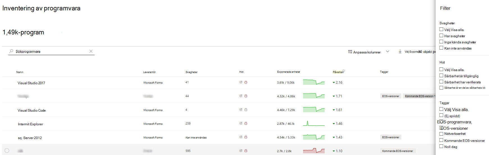
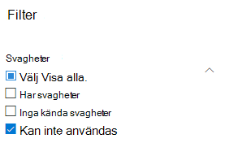

# Programvaruinventering – hantering av hot och sårbarhet

[!INCLUDE [Microsoft 365 Defender rebranding](../../includes/microsoft-defender.md)]

**Gäller för:**
- [Microsoft Defender för Endpoint](https://go.microsoft.com/fwlink/?linkid=2154037)
- [Hantering av hot och sårbarhet](next-gen-threat-and-vuln-mgt.md)
- [Microsoft 365 Defender](https://go.microsoft.com/fwlink/?linkid=2118804)

>Vill du använda Defender för Slutpunkt? [Registrera dig för en kostnadsfri utvärderingsversion.](https://www.microsoft.com/microsoft-365/windows/microsoft-defender-atp?ocid=docs-wdatp-portaloverview-abovefoldlink)

Software Inventory in in threat and vulnerability management is a list of known software in your organization with [official Common Platform Enumerations (CPE)](https://nvd.nist.gov/products/cpe). Eventuella svagheter publiceras inte för programvaruprodukter utan ett officiellt CPE. Den innehåller även information som namn på leverantören, antal svagheter, hot och antal exponerade enheter.

## Så här fungerar det

När det gäller identifiering utnyttjar vi samma uppsättning signaler som ansvarar för identifierings- och sårbarhetsbedömning i Microsoft Defender för funktioner för identifiering och [svar av slutpunkter.](overview-endpoint-detection-response.md)

Eftersom det är i realtid kommer du att se sårbarhetsinformation när de upptäcks. Motorn hämtar automatiskt information från flera säkerhetsfeeds. Faktum är att du ser om en viss programvara är ansluten till en kampanj med verkliga hot. Den innehåller även en länk till en rapport om hotanalys så snart den blir tillgänglig.

## Gå till sidan för programvaruinventering

Öppna sidan Software Inventory genom att välja **Software inventory** från navigeringsmenyn för hot och sårbarhetshantering i Microsoft [Defender Säkerhetscenter.](portal-overview.md)

Visa programvara på specifika enheter på sidorna för enskilda enheter i [listan över enheter](machines-view-overview.md).

>[!NOTE]
>Om du söker efter programvara med hjälp av den globala sökningen i Microsoft Defender för Endpoint ska du se till att lägga till ett understreck i stället för ett blanksteg. Om du till exempel vill ha bästa sökresultatet skriver du "windows_10" i stället för "Windows 10".

## Översikt över programvaruinventering

Sidan **För inventering** av programvara öppnas med en lista över programvara som installerats i nätverket, inklusive leverantörsnamn, svagheter, hot associerade med dem, exponerade enheter, påverkan på exponeringsresultat och taggar.

Du kan filtrera listvyn baserat på var programvaran finns, hot som är associerade med dem och taggar som om supporten för programvaran har uppnåtts.

Välj den programvara du vill undersöka. En utfällningspanel öppnas med en mer komprimerad vy av informationen på sidan. Du kan antingen dyka ned djupare i undersökningen och välja Öppna programvarusida **eller** flagga tekniska inkonsekvenser genom att välja **Rapportinsekvens.**

### Programvara som inte stöds

Programvara som för närvarande inte stöds av hot & sårbarhetshantering kan finnas på sidan för programvaruinventering. Eftersom det inte stöds är endast begränsade data tillgängliga. Filtrera efter programvara som inte stöds med alternativet "Inte tillgängligt" i avsnittet "Bra att"

Följande anger att en programvara inte stöds:

- Fältet Svagheter visar "Inte tillgängligt"
- Fältet Exponerade enheter visar ett streck
- Informationstext på sidopanelen och på programvarusidan
- Programsidan kommer inte att ha säkerhetsrekommendationer, identifierade säkerhetsproblem eller avsnitt om händelsetidslinje

För närvarande visas inte produkter utan CPE på sidan för programvaruinventering, utan endast i inventeringen av programvara på enhetsnivå.

## Inventering av programvara på enheter

Från navigeringspanelen i Microsoft Defender Säkerhetscenter går du till **[listan Enheter](machines-view-overview.md)**. Välj namnet på en enhet för att öppna enhetssidan  (t.ex. Dator1). Välj sedan fliken Programvaruinventering för att se en lista över alla kända program som finns på enheten. Välj en specifik programvarupost för att öppna den utfällade listan med mer information.

Programvaran kan vara synlig på enhetsnivå även om den för närvarande inte stöds av hantering av hot och sårbarhet. Men endast begränsade data kommer att vara tillgängliga. Du vet om programvaran inte stöds eftersom det står "Inte tillgänglig" i kolumnen "Det här är en bra dag".

Programvara utan CPE kan också visas under denna enhetsspecifika inventering av programvara.

### Programvarubevis

Se bevis för var vi upptäckte en specifik programvara på en enhet från registret, hårddisken eller båda. Du hittar den på alla enheter i inventeringen av enhetsprogramvaran.

Välj ett programvarunamn för att öppna den utfällna sidan och leta efter avsnittet "Programvarubevis".

## Programvarusidor

Du kan visa programvarusidor på några olika sätt:

- Sidan För programvaruinventering > Välj ett programvarunamn > **Välj Sidan Öppna programvara i** den utfäll plats
- [Sidan Rekommendationer](tvm-security-recommendation.md) för > Välj en rekommendation > Välj **sidan Öppna programvara i** den utfällda sidan
-  Sidan Händelsetidslinje > Välj en händelse > Välj namnet på den hyperlänkade programvaran (t.ex. Visual Studio 2017) i avsnittet "Related component" i den utfällbar menyn

 En hel sida visas med all information om en viss programvara och följande information:

- Sidopanel med leverantörsinformation, av programvaran i organisationen (inklusive antal enheter som den är installerad på och exponerade enheter som inte har korrigerats), om och sårbarhet är tillgänglig och påverkan på exponeringsresultatet.
- Datavisualiseringar som visar antalet säkerhetsproblem och felkonfigurering, samt deras allvarlighetsgrad. Dessutom diagram med antalet exponerade enheter.
- Flikar som visar information som:
    - Motsvarande säkerhetsrekommendationer för svagheter och svagheter som identifieras.
    - Namngivna CV:n för identifierade säkerhetsproblem.
    - Enheter som har programvaran installerad (tillsammans med enhetsnamn, domän, operativsystem med mera).
    - Lista över programvaruversion (inklusive antalet enheter som versionen är installerad på, antalet identifierade säkerhetsproblem och namnen på de installerade enheterna).

    

## Rapportera felaktigheter

Rapportera en falsk positiv när du ser någon vag, felaktig eller ofullständig information. Du kan också rapportera säkerhetsrekommendationer som redan har åtgärdats.

1. Öppna programvarans utfällutrymme på sidan För programvaruinventering.
2. Välj **Rapportens felaktigheter.**
3. I den utfällliga fönsterrutan väljer du kategorin felaktigheter i den nedrullningsmenyn, fyller i din e-postadress och information om felaktigheter.
4. Välj **Skicka**. Din feedback skickas omedelbart till experter på hot och sårbarhetshantering.

## Relaterade artiklar

- [Översikt över hot- och sårbarhetshantering](next-gen-threat-and-vuln-mgt.md)
- [Säkerhetsrekommendationer](tvm-security-recommendation.md)
- [Händelsetidslinje](threat-and-vuln-mgt-event-timeline.md)
- [Visa och ordna listan Microsoft Defender för slutpunktsenheter](machines-view-overview.md)
